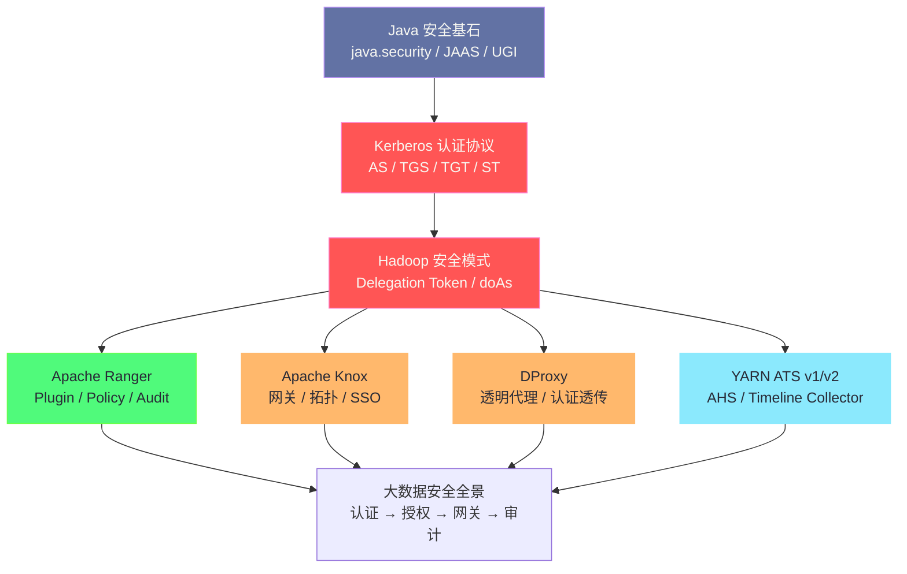

# 大数据安全与认证体系：从 Kerberos 到 Ranger 全栈解析

## 专栏简介

本专栏系统梳理大数据平台安全与认证体系的完整技术栈，从 Java 安全模型的底层基石出发，逐层向上剖析 [[Kerberos]] 认证协议、[[Hadoop]] 安全模式、[[Apache Ranger]] 权限管控、[[Apache Knox]] 网关、DProxy 透明代理，以及 YARN 作业历史日志服务（[[ATS]]/[[AHS]]）的原理与工程实践。

> [!info] 写作背景
> 大数据集群的安全往往是工程师最容易忽视、却最难排查问题的领域。一个 `GSSException: No valid credentials provided` 的报错背后，可能涉及 Kerberos TGT 过期、UGI Token 未刷新、Ranger Policy 配置错误、Knox 拓扑路由失败中的任意一环。本专栏的目标是帮助读者建立**完整的安全链路认知**，做到"知其然，更知其所以然"。

---

## 技术地图

---

## 文章目录

| 序号 | 文章标题 | 核心主题 |
|------|---------|---------|
| [[01 Java 安全基石：UserGroupInformation 与 Subject 深度解析]] | `java.security.Subject`、JAAS、UGI、`doAs` | Java 安全模型底层 |
| [[02 Kerberos 协议深度解析：TGT、ST 与票据体系]] | AS/TGS/SS、票据流程、keytab、Renewal | 认证协议核心 |
| [[03 Hadoop 安全模式：Kerberos 集成全链路解析]] | UGI + Kerberos、Delegation Token、Token 刷新 | Hadoop 安全集成 |
| [[04 Apache Ranger 权限管控体系深度解析]] | Ranger Admin/Plugin/Audit、Policy 模型、拦截链路 | 授权管控核心 |
| [[05 Apache Knox 网关：大数据集群的统一入口]] | 拓扑配置、Kerberos 集成、WebHDFS 代理、SSO | 边界安全网关 |
| [[06 DProxy 透明代理：原理与生产实践]] | 定位、认证透传、部署架构、生产避坑 | 透明代理层 |
| [[07 YARN ATS 与 AHS：作业历史日志服务全解析]] | AHS/ATS v1/v2、存储模型、查询 API、容量规划 | 历史日志服务 |
| [[08 大数据安全体系全景：从认证到审计的完整链路]] | 全链路串联、多租户最佳实践 | 全景总结 |

---

## 推荐阅读路径

**路径一：从零入门**
`01 → 02 → 03 → 04 → 08`
适合刚接触大数据安全的工程师，建立完整认知框架。

**路径二：排查认证问题**
`01 → 02 → 03`
快速定位 Kerberos / UGI / Token 相关报错的根因。

**路径三：权限与网关实践**
`04 → 05 → 06`
聚焦 Ranger Policy 配置、Knox 拓扑和 DProxy 部署。

**路径四：作业历史排查**
`07 → 03`
理解 ATS/AHS 为何需要 Kerberos 认证，以及历史数据查询失败的常见原因。

---

## 前置知识

- 了解 [[大数据/Hadoop/Yarn/00 专栏导览|YARN]] 基本架构（ResourceManager / NodeManager / Container）
- 了解 [[大数据/Hadoop/HDFS/00 专栏导览|HDFS]] 基本原理（NameNode / DataNode）
- 了解 [[大数据/Hive/00 专栏导览|Hive]] / [[大数据/HBase/00 专栏导览|HBase]] 的基本使用
- 熟悉 Java 基础（`Subject`、`Principal`、`LoginContext` 等概念会在文章中从零讲解）

---

## 关联专栏

- [[大数据/Hadoop/Yarn/00 专栏导览|YARN]]：YARN 的安全认证与授权
- [[大数据/Hadoop/HDFS/00 专栏导览|HDFS]]：HDFS 的权限模型与 Delegation Token
- [[大数据/Hive/00 专栏导览|Hive]]：HiveServer2 的 Kerberos 认证
- [[大数据/HBase/00 专栏导览|HBase]]：HBase 的安全认证机制
- [[Trouble-shooting/HiveServer2 Kerberos认证故障报告|HiveServer2 Kerberos 故障案例]]：生产环境的 Kerberos 故障分析
