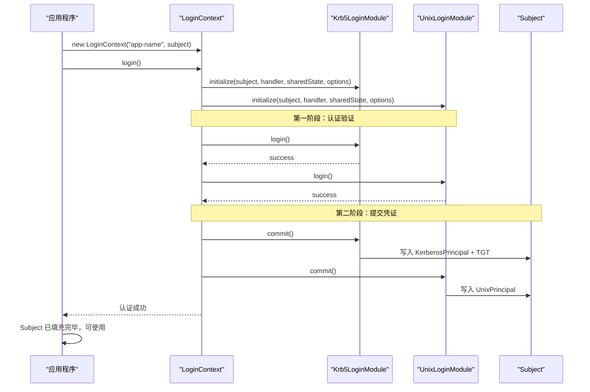
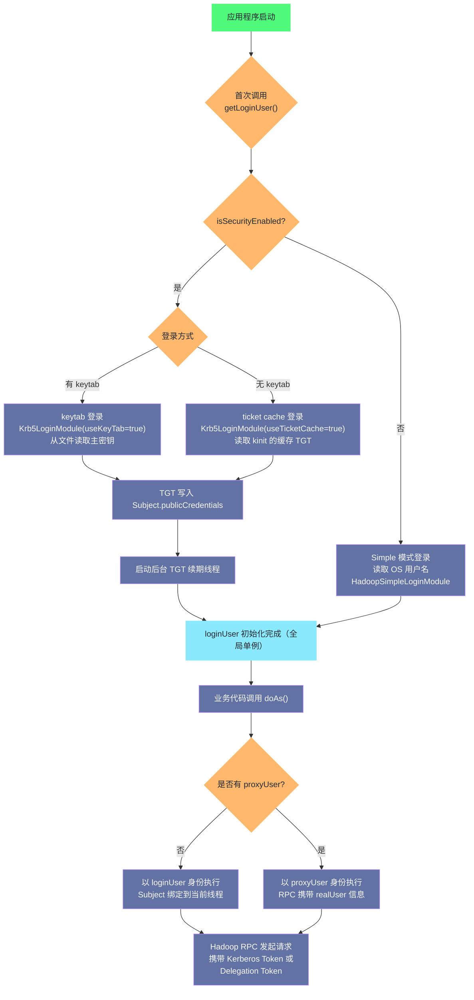

**摘要：**

`UserGroupInformation`（UGI）是 Hadoop 生态中所有安全认证的核心入口。它并非 Hadoop 凭空发明的东西，而是对 Java 标准安全框架 JAAS（Java Authentication and Authorization Service）的深度封装与扩展。理解 UGI，必须先理解 `java.security.Subject`、`Principal`、`LoginContext`、`LoginModule` 这一套 Java 安全体系的底层设计哲学——因为 UGI 不过是站在这些基础之上，针对大数据集群环境（尤其是 Kerberos 认证场景）所做的工程化适配。本文从 Java 安全模型的底层基石出发，逐步揭示 UGI 的设计动机、核心机制、`doAs` 代理模式，以及在生产环境中最常踩到的那些深坑。

---

## 第 1 章 为什么需要一套身份认证框架

### 1.1 分布式系统中的身份困境

在单机程序的世界里，"谁在运行这个程序"是一个简单的问题：操作系统的用户模型（`uid`/`gid`）已经给出了答案。你以 `hdfs` 用户登录，启动一个进程，这个进程的所有文件操作都以 `hdfs` 的权限执行。清晰、简单、自然。

但分布式系统把这个简单的问题彻底复杂化了。

考虑一个典型的 Hadoop 集群场景：用户 `alice` 向 NameNode 请求读取一个 HDFS 文件。NameNode 收到这个请求之后，必须回答一个关键问题：**这个请求真的是 `alice` 发来的吗？**

在没有任何认证机制的早期 Hadoop（俗称"Simple 模式"）中，答案极其简单粗暴——NameNode 直接相信客户端声称的任何用户名。客户端代码是这样写的：

```java
// Hadoop 1.x 时代，Simple 安全模式下
// 客户端只需要声称自己是某人，服务端就信了
System.setProperty("HADOOP_USER_NAME", "hdfs");  // 声称自己是 hdfs 超级用户
FileSystem fs = FileSystem.get(conf);             // 于是获得了 hdfs 的所有权限
```

这意味着任何能连接到 NameNode 端口的人，只要修改一个环境变量，就可以伪装成 `hdfs` 超级用户，读写或删除整个集群的数据。这在企业内网中是灾难性的安全漏洞。

**为了解决这个问题，Hadoop 在 0.20.205 版本（Hadoop 1.0 时代）引入了安全机制，核心就是依托 Kerberos 和 Java 的 JAAS 框架来做真正的身份认证。** 而 `UserGroupInformation` 正是这套认证机制在 Hadoop 侧的统一封装，所有 Hadoop 组件（HDFS Client、YARN Client、HBase Client、Hive JDBC 等）通通通过 UGI 来处理用户身份。

> [!info] 核心设计原则
> UGI 的设计目标是做一个**"透明的安全门面（Facade）"**：业务代码不需要关心底层是 Kerberos 还是 Simple 模式，只需要通过统一的 UGI API 获取当前用户、执行代理操作，其余的复杂性由 UGI 负责吸收。

### 1.2 Java 安全模型的前世今生

在深入 UGI 之前，必须先搞清楚它所依赖的底层框架——Java 安全模型。这不是可以跳过的背景知识，而是理解 UGI 设计决策的必要前提。

Java 安全模型的核心理念是**"基于代码来源和运行时身份的双重访问控制"**。早期的 Java（1.0 时代）只有 Sandbox 模型，本地代码完全可信，下载来的 Applet 完全不可信。这个二元对立的模型很快就显得过于粗糙。

Java 1.1 引入了基于代码签名（`CodeSource`）的安全策略，允许根据代码的来源赋予不同的权限。但是，这依然没有解决一个关键问题：**同一段代码，以不同用户身份运行，应该有不同的权限**。

这个问题在 Java 1.3 之后通过 JAAS（Java Authentication and Authorization Service）得到了解决。JAAS 于 2001 年作为 Java 1.4 的标准库正式合并进 JDK，它引入了"**基于运行主体（Subject）的访问控制**"，使得权限检查从"这段代码从哪里来的"扩展到了"这段代码是以谁的身份运行的"。

这个扩展是根本性的，它让 Java 的权限模型从静态的代码来源检查，变成了动态的运行时身份检查，为后续一切基于角色的访问控制（RBAC）和大数据安全认证奠定了基础。

---

## 第 2 章 JAAS 核心概念深度解析

### 2.1 Subject：一个实体的完整安全画像

JAAS 的核心是 `javax.security.auth.Subject` 类。理解 `Subject`，是理解整个安全体系的起点。

**`Subject` 代表什么？** 官方定义是"请求访问资源的实体（entity）"。这个实体可以是一个人（比如用户 `alice`），也可以是一个服务（比如 Hadoop NameNode 服务账号 `hdfs/namenode@EXAMPLE.COM`）。

但 `Subject` 并不只是一个名字。一个真实世界的实体往往有多重身份，而且持有多种凭证来证明自己的身份。`Subject` 用三个集合来完整描述一个实体的安全画像：

```
Subject
├── Set<Principal>         -- 身份标识集合（"我是谁"）
│   ├── KerberosPrincipal("alice@EXAMPLE.COM")
│   └── UnixPrincipal("alice")
├── Set<Object> publicCredentials   -- 公开凭证（"我的公开证明"）
│   └── KerberosTicket (TGT)
└── Set<Object> privateCredentials  -- 私密凭证（"我的私密密钥"）
    └── KerberosKey (加密密钥)
```

**为什么要把身份标识和凭证分开存储？** 这是一个非常重要的设计决策。

身份标识（`Principal`）是对外声明的"我是谁"，它可以安全地共享和展示。而凭证（`Credential`）是证明身份的手段，分为两类：
- **公开凭证（Public Credentials）**：可以共享的凭证，如 Kerberos 的 TGT（Ticket Granting Ticket），服务端可以验证它但不会泄露敏感信息。
- **私密凭证（Private Credentials）**：必须严格保护的凭证，如私钥、对称加密密钥。访问私密凭证需要特殊的 `PrivateCredentialPermission`。

> [!note] 设计哲学
> `Subject` 的三层设计（Principal + 公开凭证 + 私密凭证）体现了"最小权限暴露"原则：身份可以公开，公开凭证可以验证，私密凭证必须严格隔离。这种分层不仅是安全设计，更是防止凭证泄露的工程保障。

### 2.2 Principal：身份的多维表示

`java.security.Principal` 是一个极简的接口，只有一个方法：

```java
public interface Principal {
    public String getName();  // 返回该 Principal 的名称
}
```

别看它简单，它的设计意图非常深刻：**一个真实的实体（Subject）可以拥有多个 Principal，代表该实体在不同上下文中的身份**。

比如用户 Alice 在一个企业系统里同时拥有：
- `KerberosPrincipal("alice@CORP.EXAMPLE.COM")`：她的 Kerberos 身份
- `UnixPrincipal("alice")`：她的 Unix 系统账号
- `LdapPrincipal("cn=Alice Smith,ou=employees,dc=example,dc=com")`：她的 LDAP 身份

这三个 Principal 都属于同一个 Subject，它们是同一个人在不同认证体系下的投影。

在 Hadoop 的世界里，`UserGroupInformation` 内部的 Subject 通常包含一个 `KerberosPrincipal`（安全模式下）或一个 `User`（Simple 模式下），后者是 Hadoop 自定义的 Principal 类型，定义在 `org.apache.hadoop.security.User` 中。

### 2.3 LoginContext 与 LoginModule：可插拔的认证流程

知道了"用户是谁"（`Subject` + `Principal`）之后，下一个问题是：**如何完成身份验证？如何把凭证填充到 Subject 中？**

这正是 `LoginContext` 和 `LoginModule` 要解决的问题。

**`LoginContext` 是认证流程的指挥官。** 它负责：
1. 读取 JAAS 配置（`javax.security.auth.login.Configuration`），决定用哪些 `LoginModule`
2. 按配置顺序依次调用各 `LoginModule` 执行认证
3. 根据各模块的结果和控制标志（`required`/`sufficient`/`optional`/`requisite`），决定整体认证是否成功
4. 认证成功后，调用所有模块的 `commit()` 方法，将验证通过的 Principal 和 Credential 写入 Subject

**`LoginModule` 是具体的认证执行者。** 它是一个接口，不同的实现对接不同的认证后端：
- `Krb5LoginModule`：通过 Kerberos 5 协议认证，验证 TGT 或 keytab
- `UnixLoginModule`：读取当前操作系统的 Unix 账号信息
- `JndiLoginModule`：通过 JNDI/LDAP 查询用户信息

JAAS 配置文件（通常是 `jaas.conf`）定义了针对不同"应用名（Application Name）"使用什么 `LoginModule`：

```
// 一个典型的 Hadoop JAAS 配置
hadoop-keytab-kerberos {
    com.sun.security.auth.module.Krb5LoginModule required
    useKeyTab=true
    keyTab="/etc/security/keytabs/hdfs.headless.keytab"
    storeKey=true
    useTicketCache=false
    principal="hdfs@EXAMPLE.COM";
};
```

这段配置说明：当应用名为 `hadoop-keytab-kerberos` 时，使用 `Krb5LoginModule`，方式是读取指定的 keytab 文件，以 `hdfs@EXAMPLE.COM` 身份登录，`required` 表示此模块必须成功。

**LoginModule 的两阶段提交（Two-Phase Commit）是一个重要的设计细节，很多人忽略了它：

```
第一阶段：login()
  - 执行实际的认证验证（如验证密码、验证 Kerberos ticket）
  - 只保存临时状态，不修改 Subject

第二阶段：commit() 或 abort()
  - 如果所有 required 模块的 login() 都成功 → 调用 commit()，将 Principal/Credential 写入 Subject
  - 如果任何 required 模块失败 → 调用 abort()，清理临时状态
```

这个两阶段提交保证了原子性：要么所有模块都成功并将凭证写入 Subject，要么全部回滚，Subject 保持干净状态。这在多 `LoginModule` 组合使用时尤为重要。



### 2.4 Subject.doAs：以指定身份执行代码

完成认证之后，`Subject` 里已经有了 `Principal` 和各种 `Credential`。但还有一个关键问题：**如何让某段代码"以这个 Subject 的身份"来运行？**

这就是 `Subject.doAs()` 的作用：

```java
public static <T> T doAs(Subject subject, PrivilegedAction<T> action);
public static <T> T doAs(Subject subject, PrivilegedExceptionAction<T> action) 
    throws PrivilegedActionException;
```

`Subject.doAs()` 将 `subject` 关联到当前线程的 `AccessControlContext` 上，然后在这个上下文中执行 `action`。在 `action` 执行期间，任何对 `Subject.getSubject(AccessController.getContext())` 的调用都会返回这个 subject。

这是整个 JAAS 授权模型的核心：**代码不是凭空运行的，它总是"以某个身份"在运行**，而权限检查会根据这个运行时身份来决定是否放行。

> [!warning] 生产避坑
> `Subject.doAs()` 和 UGI 的 `doAs()` 是两层不同的抽象，不要混淆。`Subject.doAs()` 是 Java 标准库的 API，主要影响 Java 安全管理器的权限检查。UGI 的 `doAs()` 是 Hadoop 层的封装，它会切换线程绑定的 Kerberos 票据和 Hadoop Delegation Token，这才是 Hadoop 组件间认证的关键。两者可能同时生效，也可能各自独立。

---

## 第 3 章 UserGroupInformation：JAAS 之上的工程化封装

### 3.1 UGI 诞生的工程背景

Java 的 JAAS 框架是一个通用的安全框架，设计得非常灵活——但"灵活"意味着"使用起来繁琐"。用原生 JAAS 处理 Kerberos 认证，需要：
1. 手写 JAAS 配置文件，指定 `Krb5LoginModule`
2. 手动管理 `LoginContext` 的生命周期
3. 手动处理 TGT 过期和续期的逻辑
4. 自己在 Kerberos 模式和非 Kerberos 模式之间写分支逻辑
5. 每次切换用户身份都要手动调用 `Subject.doAs()`...

对于 Hadoop 这种需要在 **上千个节点、数十个组件** 中都涉及认证的系统来说，如果每个组件都自己写这套逻辑，代码将极其混乱且难以维护。

**`UserGroupInformation`（`org.apache.hadoop.security.UserGroupInformation`）就是为了解决这个问题而生的。** 它是一个门面类（Facade），把所有 JAAS 的复杂性封装在内部，对外提供简洁的 API。整个 Hadoop 生态（HDFS、YARN、HBase、Hive...）都通过 UGI 来处理用户身份，这保证了安全代码的统一性和可维护性。

### 3.2 UGI 的核心内部结构

UGI 本质上是 `javax.security.auth.Subject` 的一个包装器（Wrapper）。每个 UGI 实例内部持有一个 Subject 对象：

```java
// org.apache.hadoop.security.UserGroupInformation 核心字段（简化版）
public class UserGroupInformation {

    // 核心：内部持有的 JAAS Subject，所有凭证都存储在里面
    private final Subject subject;

    // UGI 的类型：KERBEROS、SIMPLE、TOKEN、PROXY 等
    private final AuthenticationMethod authMethod;

    // 安全模式标志（全局单例状态）
    private static boolean isSecurityEnabled = false;

    // 登录用户（全局单例，整个进程共享）
    private static UserGroupInformation loginUser = null;

    // TGT 自动续期的后台线程
    private static Thread renewalThread;
}
```

UGI 内部的 Subject 会包含以下内容（以 Kerberos 安全模式为例）：

```
Subject（UGI 内部）
├── Principals
│   ├── User("alice")                                    -- Hadoop 自定义 Principal，保存用户名
│   └── KerberosPrincipal("alice@EXAMPLE.COM")           -- Kerberos 主体名
├── Public Credentials
│   └── KerberosTicket（TGT，Ticket Granting Ticket）    -- Kerberos 认证票据
└── Private Credentials
    └── KerberosKey（对称密钥，来自 keytab）             -- 仅 keytab 登录时存在
```

### 3.3 UGI 的初始化：从登录到凭证填充

UGI 的登录流程由 `loginUserFromKeytab()` 或 `getLoginUser()` 触发，内部流程如下：

**Step 1：创建 HadoopLoginContext**

UGI 不直接使用 JDK 的 `LoginContext`，而是使用 Hadoop 自己实现的 `HadoopLoginContext`，它继承自 `LoginContext`。这样做是因为 Hadoop 需要控制类加载器（`ClassLoader`），防止在复杂的类隔离环境（如 YARN ApplicationMaster）中加载到错误版本的 `Krb5LoginModule`：

```java
// UGI.java 内部（简化）
private static LoginContext newLoginContext(String appName, Subject subject,
    javax.security.auth.login.Configuration loginConf) throws LoginException {
    Thread t = Thread.currentThread();
    ClassLoader oldCCL = t.getContextClassLoader();
    // 关键：临时切换类加载器到 HadoopLoginModule 所在的 ClassLoader
    // 防止在 YARN 等场景中加载到用户应用的类
    t.setContextClassLoader(HadoopLoginModule.class.getClassLoader());
    try {
        return new HadoopLoginContext(appName, subject, loginConf);
    } finally {
        t.setContextClassLoader(oldCCL);  // 恢复原始类加载器
    }
}
```

**Step 2：HadoopConfiguration 决定 LoginModule 组合**

UGI 使用自己的 `HadoopConfiguration`（`LoginContext` 的配置实现），根据当前安全模式动态决定使用哪些 `LoginModule`：

| 安全模式 | 登录类型 | LoginModule 组合 |
|---------|---------|----------------|
| Simple 模式 | 任何情况 | `HadoopSimpleLoginModule`（读取 OS 用户名） |
| Kerberos 模式 | keytab 登录 | `HadoopLoginModule` + `Krb5LoginModule(useKeyTab=true)` |
| Kerberos 模式 | ticket cache 登录 | `HadoopLoginModule` + `Krb5LoginModule(useTicketCache=true)` |
| Kerberos 模式 | Token 续期 | `HadoopLoginModule`（只刷新 Hadoop Token，不重新 Kerberos 认证） |

其中 `HadoopLoginModule` 是 Hadoop 自定义的 `LoginModule`，它的作用是在 Kerberos 认证完成之后，把 Kerberos Principal 名称提取出来，创建一个 Hadoop `User` Principal 并写入 Subject——这个 `User` Principal 是 UGI 获取用户名的实际来源。

**Step 3：TGT 自动续期线程**

安全模式下，`getLoginUser()` 在完成首次登录之后，会启动一个后台守护线程 `renewalThread`，定期调用 `checkTGTAndReloginFromKeytab()` 来检查 TGT 是否即将过期，并在必要时重新从 keytab 获取新的 TGT：

```java
// UGI.java 内部（简化），TGT 续期逻辑的核心
private void startThreadsForUGI() {
    renewalThread = new Thread(new Runnable() {
        @Override
        public void run() {
            while (true) {
                try {
                    // 计算下次续期时间：TGT 剩余有效期的 80% 处触发续期
                    long nextRenewal = getLastTGTRenewalTime() + tgtRenewalWindow;
                    Thread.sleep(Math.max(nextRenewal - System.currentTimeMillis(), 0));
                    // 触发续期
                    reloginFromKeytab();
                } catch (InterruptedException e) {
                    return;  // 线程被中断，退出
                } catch (IOException e) {
                    LOG.warn("TGT renewal failed", e);
                    // 失败后继续循环重试，而不是退出
                }
            }
        }
    });
    renewalThread.setDaemon(true);
    renewalThread.setName("UGI TGT Renewal Thread");
    renewalThread.start();
}
```

> [!warning] 生产避坑：TGT 续期的陷阱
> 这个自动续期机制在生产中有一个常见的问题：**续期线程是全局单例的，它只为 `loginUser`（即进程级主用户）续期，而不会为通过 `createProxyUser()` 创建的代理用户续期**。代理用户的票据由其 `realUser` 的票据继承而来，当 `realUser` 的 TGT 续期成功后，代理用户自然也能正常认证。但如果你手动创建了一个 `UserGroupInformation` 对象并通过 `loginUserFromKeytabAndReturnUGI()` 登录，这个 UGI 不在续期线程的管理范围内，需要自己负责续期。

### 3.4 UGI 的单例性：最重要的设计约束

UGI 有一个极其重要的约束，在生产中频繁踩坑的根源：**`loginUser` 是进程级单例（process-level singleton）**。

```java
// UGI 的全局状态（简化）
private static UserGroupInformation loginUser = null;
private static boolean isSecurityEnabled = false;

// getLoginUser() 的实现（简化）
public static UserGroupInformation getLoginUser() throws IOException {
    if (loginUser == null) {
        synchronized (UserGroupInformation.class) {
            if (loginUser == null) {
                loginUserFromSubject(null);  // 触发首次登录
            }
        }
    }
    return loginUser;
}
```

这意味着：
1. **一个 JVM 进程只有一个"登录用户"**。Hadoop DataNode 进程有且只有一个 `hdfs` 身份，Spark Driver 进程有且只有一个提交作业的用户身份。
2. **首次调用 `getLoginUser()` 触发登录，此后无法重置**。这意味着必须在调用任何 Hadoop API 之前，先正确设置好配置（包括 `hadoop.security.authentication`、keytab 路径、principal 等）。
3. **调用任何 Hadoop Filesystem API 都可能触发 UGI 初始化**。`FileSystem.get()` 内部会调用 `getLoginUser()`，所以即便你还没显式操作安全相关代码，UGI 可能已经被初始化了。

> [!warning] 生产避坑：初始化顺序问题
> 这是一个典型的生产故障场景：
> ```java
> // 错误的顺序！先创建了 FileSystem（触发 UGI 初始化），再加载 Kerberos 配置
> FileSystem fs = FileSystem.get(conf);           // 此时以 Simple 模式初始化了 UGI
> conf.set("hadoop.security.authentication", "kerberos");  // 已经晚了！
> UserGroupInformation.setConfiguration(conf);             // 无法生效
>
> // 正确的顺序：先加载完整配置，再做任何 Hadoop 操作
> conf.set("hadoop.security.authentication", "kerberos");
> UserGroupInformation.setConfiguration(conf);  // 先设置安全配置
> UserGroupInformation.loginUserFromKeytab("alice@EXAMPLE.COM", "/path/to/alice.keytab");
> FileSystem fs = UserGroupInformation.getLoginUser().doAs(
>     (PrivilegedExceptionAction<FileSystem>) () -> FileSystem.get(conf)
> );
> ```

---

## 第 4 章 UGI 的代理机制：doAs 与 Proxy User

### 4.1 为什么需要代理机制

代理机制（Proxy/Impersonation）是大数据平台多租户架构的基础设施。考虑这样一个场景：

Oozie 是一个工作流调度服务，它以 `oozie` 服务账号运行。但是，用户 `alice` 提交了一个工作流，要求以 `alice` 的身份读取 HDFS 上属于 `alice` 的文件、向 `alice` 的 YARN 队列提交作业。

如何实现这个需求？有两种思路：

**思路一：Oozie 使用 `alice` 的凭证直接认证**
这意味着 `alice` 必须把自己的 Kerberos 密码或 keytab 给 Oozie。但这违反了基本的安全原则：服务账号不应该持有用户的私密凭证。

**思路二：代理机制（Impersonation）**
Hadoop 的代理机制允许 `oozie` 服务账号在经过授权的情况下，"代理"（impersonate）为 `alice` 执行操作。NameNode 在收到请求时，知道这个请求来自 `oozie` 代表 `alice`，并根据 `alice` 的权限来做访问控制判断，同时审计日志记录的是"oozie 代理 alice 执行了操作"。

这正是 UGI 的 Proxy User 机制和 `doAs()` 要实现的目标。

### 4.2 createProxyUser 与 doAs 的工作机制

UGI 的代理用户创建方式：

```java
// 创建一个代理用户 UGI：以 alice 的身份，实际通过 oozie 的票据发起请求
UserGroupInformation proxyUser = UserGroupInformation.createProxyUser(
    "alice",                                  // 代理的目标用户名
    UserGroupInformation.getLoginUser()       // 真实的认证用户（realUser = oozie）
);

// 以 alice 的身份执行 HDFS 操作
FileSystem aliceFS = proxyUser.doAs(new PrivilegedExceptionAction<FileSystem>() {
    @Override
    public FileSystem run() throws Exception {
        return FileSystem.get(conf);
    }
});
```

**`proxyUser` 内部的 Subject 结构**与普通 UGI 有所不同：

```
Subject（proxyUser 内部）
├── Principals
│   ├── User("alice")                         -- 代理目标：alice
│   └── RealUser(ref → oozie 的 UGI)          -- 真实认证方：oozie
└── (没有自己的 Kerberos 票据，认证靠 realUser 的票据)
```

关键在于：**代理用户本身没有 Kerberos 票据，它的认证凭证来自 `realUser`（oozie）。** 当代理用户发起 RPC 请求时，Hadoop 的 RPC 框架会把 `alice` 作为 `proxyUser`、`oozie` 作为 `realUser` 同时发送给服务端，服务端（如 NameNode）检查：
1. `oozie` 是否在配置中被允许代理其他用户（`hadoop.proxyuser.oozie.hosts` 和 `hadoop.proxyuser.oozie.users`）
2. `alice` 是否在 `oozie` 被允许代理的用户范围内
3. 如果两个条件都满足，则以 `alice` 的权限执行请求

### 4.3 doAs 的线程安全性

UGI 的 `doAs()` 实现最终调用的是 Java 标准库的 `Subject.doAs()`，但 Hadoop 在这之上还做了额外的处理：

```java
// UGI.doAs() 内部（简化）
public <T> T doAs(PrivilegedExceptionAction<T> action) 
    throws IOException, InterruptedException {
    // 关键：将当前 UGI 绑定到当前线程
    // Hadoop RPC 框架在发起请求时，从当前线程的上下文读取 UGI
    logPrivilegedAction(subject, action);
    try {
        // 委托给 Java 标准的 Subject.doAs()
        return Subject.doAs(subject, action);
    } catch (PrivilegedActionException pae) {
        // 包装异常，确保所有异常都是 IOException 子类
        Throwable cause = pae.getCause();
        if (cause instanceof IOException) {
            throw (IOException) cause;
        } else if (cause instanceof Error) {
            throw (Error) cause;
        } else if (cause instanceof RuntimeException) {
            throw (RuntimeException) cause;
        } else {
            throw new UndeclaredThrowableException(cause);
        }
    }
}
```

`Subject.doAs()` 通过 `AccessController.doPrivileged()` 将 Subject 绑定到**当前线程**的访问控制上下文。这有一个重要的线程安全含义：

**`doAs()` 的作用域是单线程的**。如果在 `doAs()` 内部创建了新线程，新线程**不会**自动继承父线程的 Subject 上下文。这是一个极容易忽略的陷阱：

```java
// 危险！在 doAs 内部创建新线程
proxyUser.doAs((PrivilegedExceptionAction<Void>) () -> {
    // 这个 Future 在另一个线程池中执行
    Future<?> future = executor.submit(() -> {
        // 这里的线程上下文 Subject 是什么？
        // 是 proxyUser（alice）？还是 loginUser（oozie）？
        // 答案：是 JVM 默认的上下文，不是 alice！
        FileSystem.get(conf).listFiles(new Path("/user/alice"), false);
    });
    future.get();
    return null;
});
```

要在新线程中正确传递 UGI 上下文，需要在创建新线程之前捕获当前 UGI，然后在新线程内部重新调用 `doAs()`。

> [!warning] 生产避坑：线程池中的 UGI 丢失
> 这是 Spark on YARN、Oozie 等系统中非常常见的 Bug 来源。当一个以代理用户身份运行的任务，将子任务提交到线程池时，如果不注意传递 UGI 上下文，子任务会以 JVM 默认身份（通常是服务账号本身）发起请求，导致权限被拒绝，错误信息通常是类似 `Permission denied: user=oozie, access=READ, inode="/user/alice/data"` 这样令人困惑的报错（明明外层是 alice 在读，内层却变成了 oozie）。

---

## 第 5 章 安全模式与 Simple 模式的兼容性设计

### 5.1 isSecurityEnabled 的分支哲学

Hadoop 支持两种安全模式：
- **Simple 模式**：无真实认证，客户端声称的用户名即为身份（适合开发/测试环境）
- **Kerberos 模式**：通过 Kerberos 协议强制认证（生产环境必选）

UGI 通过 `isSecurityEnabled()` 区分这两种模式，但正如前文 Steve Loughran 的评价所指出的，两个分支的代码路径非常危险——它意味着你的安全代码在开发阶段（Simple 模式）根本得不到测试。

> [!note] 设计哲学
> YARN 的 Token 机制是解决这个问题的最佳实践：即使在 Simple 模式下，YARN 也生成和使用 Delegation Token 来做 RM 和 AM 之间的认证。这使得 Token 相关的代码路径在两种模式下都能被测试，大大降低了"只在 Kerberos 模式下出问题"的概率。

### 5.2 checkTGTAndReloginFromKeytab 的防御性使用

在长时间运行的服务（如 Spark Streaming、Flink、HBase RegionServer）中，TGT 的默认有效期通常是 10 小时，最长续约期（Renewable life）通常是 7 天。超过可续约期后，即使有 keytab，也需要重新完整认证一次。

最佳实践是在每次发起对 Hadoop 服务的 RPC 调用之前，先调用 `checkTGTAndReloginFromKeytab()`：

```java
// 推荐的防御性写法：每次请求前检查 TGT 状态
public void writeToHdfs(String path, byte[] data) throws IOException {
    // 低成本检查：如果 TGT 仍然有效，这是一个几乎无开销的 no-op
    UserGroupInformation.getLoginUser().checkTGTAndReloginFromKeytab();
    
    // 发起实际的 HDFS 写入操作
    try (FSDataOutputStream out = fs.create(new Path(path))) {
        out.write(data);
    }
}
```

`checkTGTAndReloginFromKeytab()` 的内部逻辑：
1. 如果 Simple 模式：直接返回（no-op）
2. 如果 Kerberos 模式但 TGT 还足够新（距上次登录不超过 `hadoop.kerberos.min.seconds.before.relogin`，默认 60 秒）：直接返回
3. 如果需要续期：从 keytab 重新 `kinit`，获取新的 TGT

> [!warning] 生产避坑：relogin 失败的重试风险
> 注意配置项 `hadoop.kerberos.min.seconds.before.relogin`（默认 60 秒）。这个配置的含义是：**如果上一次 relogin 是在 60 秒以内，不管成功还是失败，本次都跳过续期**。这个设计是为了防止在 KDC 不可用时造成的重试风暴。但副作用是：如果 keytab 文件被意外删除，在接下来的 60 秒内，`checkTGTAndReloginFromKeytab()` 会静默地跳过续期，让你误以为没有问题，直到下一个检查窗口才暴露真正的认证失败。

---

## 第 6 章 完整的 UGI 登录流程图

综合以上分析，画出一张完整的 UGI 登录与 doAs 的流程图，帮助在脑中建立整体认知：



---

## 第 7 章 UGI 在 Hadoop 组件中的实际使用模式

### 7.1 HDFS Client 的认证流程

当 HDFS Client（`DFSClient`）与 NameNode 建立连接时，认证流程如下：

1. `DFSClient` 初始化时调用 `UserGroupInformation.getCurrentUser()` 获取当前用户 UGI
2. 建立 RPC 连接时，Hadoop 的 `Server.Connection` 使用 SASL（Simple Authentication and Security Layer）协议进行握手
3. 在 SASL 握手阶段，客户端提供以下之一作为凭证：
   - **Kerberos 模式**：使用 UGI 内部 Subject 中的 `KerberosTicket`（TGT）向 NameNode 的 Kerberos 服务票据（Service Ticket）请求认证
   - **Delegation Token 模式**：当客户端已持有 NameNode 颁发的 Delegation Token 时，优先使用 Token（Token 不需要 KDC 参与，适合长时间运行的 Spark/MR 任务）
4. 认证成功后，NameNode 在后续请求中通过会话信息识别客户端身份，不再每次都走完整 SASL 握手

### 7.2 Spark 中的 UGI 使用

Spark 对 UGI 的使用场景更为复杂，因为 Spark 有 Driver 和多个 Executor，它们运行在不同的 JVM 进程中：

**Driver 侧**：
- `SparkContext` 初始化时，通过 `UserGroupInformation.getLoginUser()` 获取提交作业的用户身份
- 向 YARN ResourceManager 提交 ApplicationMaster 时，生成并传递 HDFS、HBase、Hive Metastore 等服务的 Delegation Token

**Executor 侧**：
- Executor 进程由 YARN NodeManager 启动，继承了 Driver 传来的 Delegation Token
- Executor 通过这些 Token 访问 HDFS、HBase 等服务，而不需要 Kerberos TGT（因为 Executor 进程没有 keytab）
- Token 有过期时间，Spark 的 `AMCredentialRenewer` 组件负责在后台周期性地刷新 Token

> [!info] 核心概念：Delegation Token 的角色
> 这里引出了一个重要的架构设计：**Delegation Token 是 Kerberos 的"降级代理"**。Kerberos TGT 只能在有 KDC 网络访问的节点上使用，而且持有 TGT 的 keytab 不能随意分发给 Executor。Delegation Token 解决了这个问题：由有 Kerberos 认证能力的 Driver 向服务端（NameNode、ResourceManager）申请 Delegation Token，然后把这个 Token 安全地传递给 Executor，Executor 用 Token 访问服务，不再需要 KDC。这个机制在[[03 Hadoop 安全模式：Kerberos 集成全链路解析]]中有详细介绍。

---

## 第 8 章 常见问题与排查指南

### 8.1 最常见的 UGI 相关异常

| 异常信息 | 根本原因 | 排查方向 |
|---------|---------|---------|
| `GSSException: No valid credentials provided` | UGI 没有有效的 Kerberos TGT | 检查 keytab 是否存在、principal 是否正确、KDC 是否可达 |
| `javax.security.sasl.SaslException: GSS initiate failed` | SASL Kerberos 握手失败 | 通常是 TGT 过期或 Service Principal 配置错误 |
| `IOException: Failed on local exception: java.io.IOException: org.apache.hadoop.security.AccessControlException` | RPC 认证被服务端拒绝 | 检查服务端的 principal 配置和 keytab 权限 |
| `KerberosAuthException: TGT from credential cache has expired` | ticket cache 中的 TGT 已过期 | 重新 `kinit` 或切换到 keytab 登录方式 |
| `LoginException: Unable to obtain password from user` | 交互式输入密码失败（在守护进程中） | 配置使用 keytab 而非密码认证 |

### 8.2 关键调试手段

**开启 UGI 调试日志**：

```bash
# 在 JVM 启动参数中添加
-Dsun.security.krb5.debug=true          # Kerberos 底层调试
-Dsun.security.jgss.debug=true          # JGSS 调试

# 设置环境变量（Hadoop 特定）
export HADOOP_JAAS_DEBUG=true            # 开启 JAAS 调试日志
```

**通过代码检查 UGI 状态**：

```java
UserGroupInformation ugi = UserGroupInformation.getCurrentUser();
System.out.println("User: " + ugi.getUserName());
System.out.println("Auth method: " + ugi.getAuthenticationMethod());
System.out.println("Is security enabled: " + UserGroupInformation.isSecurityEnabled());
System.out.println("Has Kerberos credentials: " + ugi.hasKerberosCredentials());
// 打印 Subject 内所有凭证（注意：生产环境慎用，可能泄露敏感信息）
System.out.println("Subject: " + ugi.getSubject());
```

---

## 小结

本文从 Java 安全体系的底层基石出发，完整梳理了 `Subject`、`Principal`、`LoginContext`、`LoginModule` 的设计哲学，并在此基础上深入解析了 `UserGroupInformation` 的内部结构、初始化流程、代理机制和生产陷阱。

核心认知要点：
- **Subject 是身份的完整画像**，它包含多个 Principal（我是谁）和多套凭证（我如何证明）
- **LoginContext + LoginModule 是可插拔的认证流程**，两阶段提交保证了原子性
- **UGI 是 JAAS 之上的工程化封装**，是整个 Hadoop 生态安全的统一门面
- **UGI 是进程级单例**，必须在任何 Hadoop 操作之前完成初始化
- **doAs 的作用域是单线程的**，跨线程传递身份上下文是高频 Bug 来源
- **Delegation Token 是 Kerberos 的轻量化代理**，使 Executor/Container 无需 KDC 即可认证

下一篇 [[02 Kerberos 协议深度解析：TGT、ST 与票据体系]] 将深入 Kerberos 协议本身，理解 UGI 持有的那张 TGT 到底是什么、如何产生的，以及 AS/TGS/SS 三方模型背后的密码学原理。


> [!note] 思考题
> 1. Hadoop 的 `UserGroupInformation`（UGI）封装了 JAAS 的 `Subject`，是整个 Hadoop 安全体系的身份基石。UGI 提供了 `doAs()` 方法，允许以指定用户身份执行代码块（Privileged Action）。在 Hadoop Proxy User（代理用户）场景中，超级用户 A 需要以普通用户 B 的身份访问 HDFS，UGI 的 `doAs()` 在 JVM 层面做了什么？执行 `doAs()` 后，当前线程的安全上下文如何切换，执行完毕后如何恢复？
> 2. UGI 的 `loginUserFromKeytab()` 会从 keytab 文件中读取凭证并向 KDC 申请 TGT，将 Kerberos Ticket 存入 Subject 的 PrivateCredential 集合。TGT 是有过期时间的（通常 8-24 小时），UGI 内置了自动续约（TGT Renewal）机制——后台线程在 TGT 过期前自动 `kinit`。如果 KDC 暂时不可达（网络故障），这个后台续约线程会在什么时机失败？当 TGT 真正过期后，下一次 RPC 调用会发生什么？
> 3. 在同一个 JVM 进程中，如果多个线程同时以不同的 UGI 身份（通过 `doAs()`）执行操作，JAAS 的 `Subject` 是线程局部的（Thread-Local）还是进程全局的？如果 Subject 是全局的，多线程并发调用 `doAs()` 时，不同线程的身份信息是否会发生互相覆盖的竞态条件？Hadoop 是如何解决这个并发安全问题的？