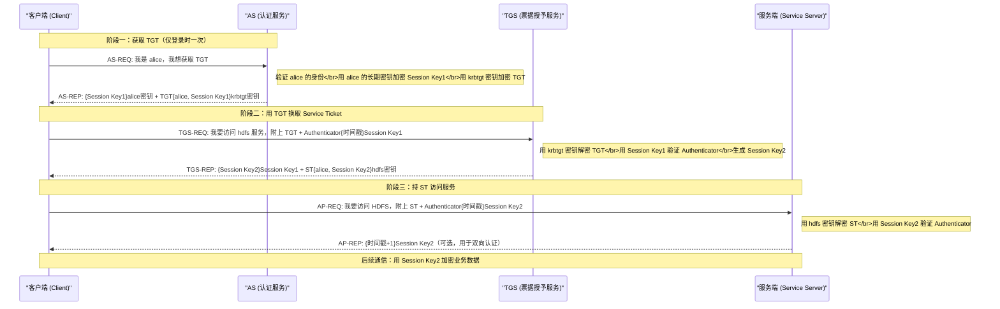

**摘要：**

Kerberos 是大数据集群安全认证的基石协议，几乎所有企业级 Hadoop/Spark/HBase 集群的安全模式都建立在它之上。但 Kerberos 并非专门为大数据设计，它诞生于 1980 年代 MIT 的 Athena 项目，是一套通用的网络认证协议，至今仍被 Windows Active Directory、Linux PAM、macOS 等主流系统所使用。本文从 Kerberos 要解决的根本问题出发，深入剖析 KDC 的内部组成（AS + TGS）、三方票据交换模型（TGT → ST）、加密机制、keytab 与 kinit 的本质，以及 Ticket Renewal 的工作原理。理解了这些底层机制，才能真正读懂 Hadoop 集群中那些令人迷惑的认证报错，以及 UGI 为何要以那种方式管理凭证。

---

## 第 1 章 Kerberos 的诞生背景：它要解决什么问题

### 1.1 网络中的身份验证困境

1980 年代，MIT 的 Athena 项目面临一个棘手的工程问题：校园里有数百台工作站和服务器，学生和研究人员需要访问分布在不同机器上的资源（文件系统、打印机、邮件服务等）。每台服务器都需要验证请求者的身份，但如何安全地做到这一点？

最朴素的方案是：**每台服务器各自保存所有用户的密码**。用户登录时把密码发送给服务器，服务器验证后放行。

这个方案有三个致命缺陷：

**缺陷一：密码在网络上明文传输**。1980 年代的网络是非加密的，任何人只要能嗅探网络流量（当时的以太网是广播式的），就能截获密码。

**缺陷二：N 个服务端要维护 M 个用户的密码，管理成本是 O(N×M)**。用户修改密码时，必须同步更新 N 台服务器，极易出现不一致。

**缺陷三：每次访问都要发送密码**。密码每传输一次，被截获的风险就增加一次。

另一个看似聪明的方案是：**用户只把密码发给一个中央服务器验证，然后由中央服务器通知各业务服务器"这个人已经验证通过"**。但这又引出新问题：业务服务器怎么知道这条"通知"真的来自中央服务器，而不是攻击者伪造的？

**Kerberos 的核心洞察是：在不安全的网络中，双方可以通过共享密钥（Shared Secret）来建立互信，而无需在网络上传输密码本身。** 它的整个协议设计，本质上就是围绕"如何安全地分发临时会话密钥"这一问题展开的。

> [!info] 命名来源
> Kerberos 这个名字来自希腊神话中守卫冥界入口的三头狗 Cerberus（科尔柏洛斯）。对应地，Kerberos 协议也有三个主要参与方：客户端（Client）、密钥分发中心（KDC）、以及服务端（Server）——三头共同守卫着资源的访问入口。

### 1.2 Kerberos 的核心设计原则

在深入协议细节之前，先建立几个核心设计原则，它们贯穿整个协议：

**原则一：密码永远不在网络上传输**。Kerberos 用密码派生的对称密钥来加密数据，但密码本身（或长期密钥）只存在于客户端和 KDC 两处，永远不离开这两个地方。

**原则二：票据（Ticket）而非密码**。认证的凭证是有时效性的"票据"，不是持久密码。票据过期即失效，即使被截获，攻击窗口也是有限的。

**原则三：双向认证（Mutual Authentication）**。不仅服务端要验证客户端的身份，客户端也可以验证服务端的身份，防止中间人伪造服务端。

**原则四：集中式 KDC，分散式认证**。KDC 只负责颁发票据，实际的业务服务不需要联系 KDC 来验证票据——它们用自己的密钥解密票据即可完成验证。这使得 KDC 不成为每次请求的瓶颈。

---

## 第 2 章 KDC 内部解剖：AS 与 TGS

### 2.1 KDC 不是铁板一块

很多人把 KDC（Key Distribution Center，密钥分发中心）当作一个黑盒，认为它只是一个"认证服务器"。事实上，KDC 内部由两个逻辑上独立的服务组成：

```
KDC（Key Distribution Center）
├── AS（Authentication Service，认证服务）
│   监听端口：88（UDP/TCP）
│   职责：验证用户身份，颁发 TGT
│   类比：签发"入园通行证"的门卫
│
└── TGS（Ticket Granting Service，票据授予服务）
    监听端口：88（同一端口，通过消息类型区分）
    职责：凭借 TGT，颁发访问具体服务的 ST
    类比：持入园通行证换取"各景点门票"的服务台
```

**为什么要把 AS 和 TGS 分开？** 这是一个精妙的设计决策。

设想一下，如果没有 TGS，用户每次访问一个新服务都必须向 AS 重新认证（即每次都要用密码去 AS 换票）。这有两个问题：
1. 密码的使用频率极高，被截获的风险随之上升
2. AS 成为每次服务访问的瓶颈，高并发下压力巨大

TGS 的引入实现了一个关键的解耦：**用户只在登录时向 AS 使用一次密码，换来一张 TGT（Ticket Granting Ticket）。此后，用户持 TGT 向 TGS 换取访问各具体服务的 ST（Service Ticket），整个过程不再需要密码参与。** TGT 就像一张"通用换票证"，有了它，你可以在园区内随意换取各景点的门票，而不需要每次都回到大门口重新验票。

### 2.2 KDC 的数据库：存的是什么

KDC 维护着一个数据库（MIT Kerberos 使用 `kdb5` 格式），其中为每个 **Principal** 存储一条记录。

**Principal** 是 Kerberos 中的身份标识，格式为 `primary/instance@REALM`：
- `alice@EXAMPLE.COM`：用户 alice 在 EXAMPLE.COM 域中的 Principal
- `hdfs/namenode.example.com@EXAMPLE.COM`：namenode 机器上 hdfs 服务的 Principal
- `HTTP/knox.example.com@EXAMPLE.COM`：knox 主机上 HTTP 服务的 Principal
- `krbtgt/EXAMPLE.COM@EXAMPLE.COM`：TGS 服务自身的特殊 Principal（用于加密 TGT）

每条 Principal 记录包含：
- **Long-term Key（长期密钥）**：由用户密码（或随机密钥）通过 `string2key` 函数派生而来的对称密钥。用户账号的长期密钥来自密码哈希，服务账号的长期密钥通常是随机生成的（存储在 keytab 文件中）。
- **Key Version Number（kvno）**：密钥版本号，每次密码变更或 keytab 轮转时递增
- **Valid Dates（有效期配置）**：该 Principal 的票据最大有效期（`max_life`）和最大可续约期（`max_renewable_life`）
- **Principal Flags**：如是否允许 forwardable、是否允许renewable 等

> [!note] 设计哲学：KDC 从不传输长期密钥
> KDC 中存储的长期密钥永远不会通过网络传输。KDC 用这些密钥来加密发给客户端的数据（客户端用自己的长期密钥解密），或者加密发给服务端的票据（服务端用自己的长期密钥解密）。密钥是用来"加密"的工具，而不是"传输"的内容。

---

## 第 3 章 完整的票据交换流程：三步走

Kerberos V5 的完整认证流程分为三个阶段，对应六条消息（AS-REQ/AS-REP、TGS-REQ/TGS-REP、AP-REQ/AP-REP）：



### 3.1 阶段一：AS 交换（客户端向 AS 获取 TGT）

**AS-REQ（客户端 → AS）**：

客户端发送一个请求，包含：
- 客户端的 Principal 名称（如 `alice@EXAMPLE.COM`）
- 请求的服务 Principal（固定是 `krbtgt/EXAMPLE.COM@EXAMPLE.COM`，即 TGS 服务自身）
- 请求的票据有效期
- 一个**预认证数据（Pre-authentication Data）**：用客户端的长期密钥加密的当前时间戳

**为什么需要预认证（Pre-authentication）？** 早期 Kerberos V4 没有预认证机制，KDC 收到 AS-REQ 后会直接返回加密的 TGT。这导致了一个弱点：攻击者可以向 KDC 请求任意 Principal 的 TGT（不需要知道密码），然后对返回的加密数据做离线暴力破解（即 AS-REP Roasting 攻击）。引入预认证后，客户端必须先证明自己知道密码（用密码加密时间戳），否则 AS 直接拒绝请求，从根本上防止了这类攻击。

**AS-REP（AS → 客户端）**：

AS 收到请求后：
1. 在 KDC 数据库中查找 `alice` 的长期密钥
2. 验证 Pre-authentication 数据（解密时间戳，检查是否在允许的时钟偏差范围内，默认 ±5 分钟）
3. 生成一个**会话密钥（Session Key 1）**，这是临时的、随机的对称密钥，用于客户端与 TGS 之间的通信
4. 构造两个加密数据包：
   - `{Session Key1, TGT有效期, ...}` 用 **alice 的长期密钥** 加密 → 发给客户端（只有 alice 能解密）
   - `TGT = {alice的Principal, Session Key1, 有效期, 客户端IP, ...}` 用 **krbtgt 的长期密钥** 加密 → 也发给客户端，但客户端无法解密它（因为客户端没有 krbtgt 的密钥）

客户端收到 AS-REP 后：
- 用自己的长期密钥（密码派生的密钥）解密第一个数据包，得到 Session Key 1 和 TGT 的元信息
- 把 TGT 原封不动地存储起来（后续交给 TGS）

> [!info] 核心洞察：TGT 是给 TGS 的，不是给客户端的
> TGT（Ticket Granting Ticket）这个名字很容易造成误解，让人以为它是客户端用来证明身份的凭证。实际上，TGT 是用 krbtgt 的密钥加密的，**客户端根本无法读取 TGT 的内容**。TGT 是专门为 TGS 准备的一个"包裹"，里面装着客户端的身份信息和 Session Key 1。客户端持有 TGT 的作用，是在与 TGS 通信时把这个包裹交给 TGS，让 TGS 解开它、确认客户端身份。

### 3.2 阶段二：TGS 交换（客户端用 TGT 换取 Service Ticket）

**TGS-REQ（客户端 → TGS）**：

客户端向 TGS 请求访问特定服务（如 HDFS NameNode）的票据，发送：
- 目标服务的 Principal（如 `hdfs/namenode.example.com@EXAMPLE.COM`）
- TGT（完整的加密包裹，客户端无法看到内容）
- **Authenticator**：用 Session Key 1 加密的 `{alice的Principal, 当前时间戳}`

**Authenticator 的作用是什么？** 这是防止重放攻击（Replay Attack）的关键机制。攻击者即使截获了某次请求中的 TGT，如果没有 Session Key 1，就无法构造有效的 Authenticator（因为 Authenticator 包含时间戳，且用 Session Key 1 加密）。TGS 在验证时会检查：
1. 用 krbtgt 密钥解密 TGT，得到 `{alice的Principal, Session Key 1, 有效期}`
2. 用解出来的 Session Key 1 解密 Authenticator，得到 `{alice的Principal, 时间戳}`
3. 对比 TGT 中的 Principal 和 Authenticator 中的 Principal 是否一致（防冒充）
4. 检查时间戳是否在当前时间的 ±5 分钟内（防重放）
5. 检查这个 Authenticator 是否在 Replay Cache 中出现过（防同一 Authenticator 被重复使用）

**TGS-REP（TGS → 客户端）**：

验证通过后，TGS：
1. 生成新的**会话密钥（Session Key 2）**，用于客户端与实际服务之间的通信
2. 构造两个加密数据包：
   - `{Session Key2, ST有效期, ...}` 用 **Session Key 1** 加密 → 发给客户端
   - `ST = {alice的Principal, Session Key2, 有效期, ...}` 用 **hdfs 服务的长期密钥** 加密 → 也发给客户端，但客户端无法解密

### 3.3 阶段三：AP 交换（客户端持 ST 访问服务）

**AP-REQ（客户端 → 服务端）**：

客户端向实际服务（如 NameNode）发起请求，携带：
- ST（完整的加密包裹，客户端无法读取内容）
- 新的 Authenticator：用 Session Key 2 加密的 `{alice的Principal, 当前时间戳}`

**服务端（如 NameNode）的验证过程**：
1. 用自己的长期密钥（来自 keytab 文件）解密 ST，得到 `{alice的Principal, Session Key 2, 有效期}`
2. 用 Session Key 2 解密 Authenticator
3. 做与 TGS 相同的一致性检查、时钟偏差检查、重放检查

**关键：服务端不需要联系 KDC 来验证 ST！** 只要服务端持有正确的长期密钥（keytab 中的密钥与 KDC 数据库中的密钥一致），它就能独立解密 ST 并完成验证。这是 Kerberos 协议最优雅的设计之一：**KDC 只在颁发票据时参与，不在验证票据时参与**，完美地避免了 KDC 成为每次请求的单点瓶颈。

**AP-REP（服务端 → 客户端，可选）**：

用于实现双向认证。服务端用 Session Key 2 加密一个响应，客户端通过能解密这个响应来确认服务端确实持有正确的密钥（即确认服务端是真实的，而非中间人伪造的）。

---

## 第 4 章 票据的结构与加密机制

### 4.1 票据（Ticket）的内部结构

一张完整的 Kerberos 5 Ticket（无论是 TGT 还是 ST），其明文结构（RFC 4120 定义）包含以下核心字段：

```
Ticket ::= [APPLICATION 1] SEQUENCE {
    tkt-vno    [0] INTEGER (5),          -- Kerberos 版本号，始终为 5
    realm      [1] Realm,                -- 所属域，如 EXAMPLE.COM
    sname      [2] PrincipalName,        -- 服务的 Principal 名称
    enc-part   [3] EncryptedData         -- 加密的票据主体
}

EncTicketPart ::= [APPLICATION 3] SEQUENCE {
    flags       [0] TicketFlags,         -- 标志位（forwardable/renewable/proxiable等）
    key         [1] EncryptionKey,       -- 会话密钥（Session Key）
    crealm      [2] Realm,               -- 客户端所在域
    cname       [3] PrincipalName,       -- 客户端 Principal 名称（如 alice）
    transited   [4] TransitedEncoding,   -- 跨域认证路径（跨 Realm 时使用）
    authtime    [5] KerberosTime,        -- 首次认证时间
    starttime   [6] KerberosTime OPTIONAL,-- 票据生效时间（一般与 authtime 相同）
    endtime     [7] KerberosTime,        -- 票据过期时间
    renew-till  [8] KerberosTime OPTIONAL,-- 最晚可续约到的时间
    caddr       [9] HostAddresses OPTIONAL -- 允许使用此票据的客户端 IP（现代实践一般不限制）
}
```

**重要的 TicketFlags（票据标志位）**：

| Flag | 含义 | 大数据场景 |
|------|------|---------|
| `FORWARDABLE` | 允许将此票据转发给另一方代为使用 | Hadoop 的 Delegation Token 机制依赖此特性 |
| `RENEWABLE` | 允许在有效期内续约（延长有效期） | UGI 的 TGT 续期依赖此特性 |
| `PROXIABLE` | 允许获取具有不同 IP 限制的代理票据 | 分布式计算节点跨主机访问时使用 |
| `PRE-AUTHENT` | 使用了预认证 | 现代 Kerberos 部署必须启用 |
| `INITIAL` | 通过 AS 直接颁发（而非通过续约或转发获得）| 区分"新鲜"票据和"续约"票据 |

### 4.2 加密算法套件（Encryption Type）

Kerberos 5 支持多种加密算法（通过 `etype` 字段指定），在 Hadoop 集群中常见的有：

| etype 编号 | 算法名称 | 安全性 | 是否推荐 |
|-----------|---------|-------|---------|
| 17 | `aes128-cts-hmac-sha1-96` | 较高 | 可用（遗留系统） |
| 18 | `aes256-cts-hmac-sha1-96` | 高 | **推荐（主流）** |
| 20 | `aes128-cts-hmac-sha384-192` | 高 | 推荐（新标准 RFC 8009） |
| 21 | `aes256-cts-hmac-sha512-256` | 最高 | 推荐（新标准 RFC 8009） |
| 23 | `rc4-hmac` | 低（已破解） | **严禁使用** |
| 3 | `des-cbc-md5` | 极低（已破解）| **严禁使用** |

> [!warning] 生产避坑：RC4 和 DES 的安全问题
> 在老旧的 Hadoop 集群中，经常会发现 `krb5.conf` 中仍然配置了 `rc4-hmac` 或 `des3-cbc-sha1`。RC4 已于 2015 年被 IETF RFC 7465 明确禁止使用（因为 RC4 存在严重的统计偏置漏洞）。如果 KDC 和集群节点的 `krb5.conf` 中的 `default_tkt_enctypes` 和 `default_tgs_enctypes` 还包含这些弱算法，应当立即清除，只保留 AES256。

### 4.3 时钟同步：Kerberos 的阿喀琉斯之踵

Kerberos 对时钟同步有极严格的要求。所有参与认证的节点（KDC、客户端、服务端）之间的时钟偏差必须在 5 分钟以内（`clockskew`，可在 `krb5.conf` 中配置）。

**为什么？** 因为防重放机制依赖时间戳。Authenticator 中的时间戳是防止同一 Authenticator 被重复使用的关键。如果允许时钟偏差无限大，攻击者可以截获一个旧的 Authenticator，等待 Replay Cache 过期后重放它。

在大数据集群中，时钟同步通常通过 NTP（Network Time Protocol）服务来保证。如果某个节点的 NTP 服务异常，时钟偏差超过 5 分钟，该节点上所有涉及 Kerberos 的操作都会报错：

```
KrbException: Clock skew too great (37) - PROCESS_TGS
```

> [!warning] 生产避坑：时钟同步是基础设施
> 在排查 Kerberos 认证问题时，**第一步永远是检查时钟同步**。这比检查 keytab 文件还要优先，因为即使 keytab 完全正确，时钟偏差也会导致所有认证失败，且错误信息往往不够直观。建议在所有集群节点上运行：
> ```bash
> # 检查当前时间偏差
> ntpq -p
> chronyc tracking
> # 查看系统时间与硬件时钟的差异
> timedatectl status
> ```

---

## 第 5 章 keytab：服务账号的机器密码

### 5.1 keytab 是什么

普通用户通过交互式输入密码来完成 `kinit`（AS 认证）。但服务进程（如 NameNode、DataNode、Hive Server）无法交互式输入密码——它们需要在无人值守的情况下自动完成 Kerberos 认证。

**keytab（Key Table）**就是为此设计的：它是一个二进制文件，存储了一个或多个 Kerberos Principal 的长期密钥（与 KDC 数据库中存储的密钥完全相同）。服务进程在启动时读取 keytab 文件，用其中的密钥完成 AS 认证，获取 TGT，从而无需人工干预。

**keytab 文件的内部结构**：

```
keytab 文件格式（简化）
├── 文件头：版本标识（0x0502 表示 Kerberos V5）
└── 条目列表（可包含多个 Principal 的多个密钥版本）
    ├── Entry 1:
    │   ├── principal: hdfs/namenode.example.com@EXAMPLE.COM
    │   ├── timestamp: 2024-01-15 10:00:00
    │   ├── kvno: 3          (密钥版本号，每次轮换递增)
    │   ├── etype: 18        (aes256-cts-hmac-sha1-96)
    │   └── key: [32字节加密密钥，与 KDC 数据库同步]
    └── Entry 2:
        ├── principal: HTTP/namenode.example.com@EXAMPLE.COM
        ├── kvno: 2
        ├── etype: 18
        └── key: [32字节加密密钥]
```

**用 `klist -e -k` 命令可以查看 keytab 内容**：

```bash
$ klist -e -k -t /etc/security/keytabs/hdfs.headless.keytab
Keytab name: FILE:/etc/security/keytabs/hdfs.headless.keytab
KVNO Timestamp           Principal
---- ------------------- ------------------------------------------------------
   3 2024-01-15T10:00:00 hdfs@EXAMPLE.COM (aes256-cts-hmac-sha1-96)
   3 2024-01-15T10:00:00 hdfs@EXAMPLE.COM (aes128-cts-hmac-sha1-96)
   2 2023-07-01T08:00:00 hdfs@EXAMPLE.COM (aes256-cts-hmac-sha1-96)
```

注意 keytab 中保存了**多个版本（kvno）的密钥**，这是为了支持密钥轮换期间的平滑过渡：当 KDC 数据库中的密钥已更新到 kvno=3，但旧的 TGT 还是用 kvno=2 的密钥签发的，服务端可以用 kvno=2 的密钥继续验证这些旧 TGT，直到它们自然过期。

### 5.2 kinit 的本质

`kinit` 命令的核心就是触发一次 AS 交换：

```bash
# 方式一：交互式输入密码
kinit alice@EXAMPLE.COM
# 输入密码后，客户端用密码派生长期密钥，完成 AS-REQ/AS-REP 交换，TGT 存入 ticket cache

# 方式二：使用 keytab（服务账号的标准方式）
kinit -kt /etc/security/keytabs/hdfs.headless.keytab hdfs@EXAMPLE.COM

# 方式三：续约现有 TGT（前提：TGT 标记了 RENEWABLE 且未超过 renew-till 时间）
kinit -R
```

`kinit` 完成后，TGT 存储在 **Credential Cache（凭证缓存）**中，默认位置是 `/tmp/krb5cc_<uid>`（可通过 `KRB5CCNAME` 环境变量修改）。

用 `klist` 可以查看当前 ticket cache 中的票据状态：

```bash
$ klist
Credentials cache: FILE:/tmp/krb5cc_1000
        Principal: alice@EXAMPLE.COM

  Issued                Expires               Principal
Jan 15 10:00:00 2024  Jan 15 20:00:00 2024  krbtgt/EXAMPLE.COM@EXAMPLE.COM
Jan 15 10:00:05 2024  Jan 15 20:00:00 2024  hdfs/namenode.example.com@EXAMPLE.COM
```

### 5.3 keytab 的安全管理

keytab 文件一旦泄露，就等同于泄露了服务账号的永久密码（在密钥轮换之前）。因此生产环境中对 keytab 的管理必须非常严格：

| 安全要求 | 实施方式 |
|---------|---------|
| 最小权限原则 | keytab 文件权限设置为 `400`（仅所有者可读），且所有者必须是对应的服务账号 |
| 密钥轮换 | 定期执行 `kadmin: ktadd` 轮换密钥，更新 kvno，并同步更新所有节点的 keytab 文件 |
| 分发安全 | 通过 Ansible Vault、HashiCorp Vault 等密钥管理工具分发 keytab，禁止明文存储在代码仓库或配置管理中 |
| 审计监控 | 对 keytab 文件的读取操作进行审计（通过 Linux auditd），发现异常访问及时告警 |
| 隔离存储 | 不同服务的 keytab 分开存储，NameNode 的 keytab 不应包含 DataNode 的密钥 |

---

## 第 6 章 Ticket Renewal：长时间运行任务的生命线

### 6.1 为什么需要 Ticket Renewal

Kerberos 票据（TGT 和 ST）都有有效期限制，这是 Kerberos 的安全设计：即使票据被截获，攻击者的窗口也是有限的。

典型的企业 Kerberos 配置：
- TGT 有效期（`max_life`）：通常 10 小时
- TGT 最大可续约期（`max_renewable_life`）：通常 7 天
- ST 有效期：通常与 TGT 相同，部分配置更短

对于交互式用户，10 小时的 TGT 足够一天的工作（下班后 TGT 自然过期，第二天重新 `kinit`）。但对于大数据的长时间运行任务（比如一个跑 3 天的 Spark 数据回刷作业），10 小时的 TGT 在任务中途就会过期，导致作业失败。

**Ticket Renewal 机制的作用**：在 TGT 过期之前，用现有的（仍有效的）TGT 向 KDC 请求一张新的 TGT，从而延长认证时效。这个操作不需要重新输入密码，只要原 TGT 仍在有效期内且未超过 `renew-till` 时间即可。

### 6.2 Renewal 的协议层细节

续约（Renew）是通过向 TGS 发送一个特殊的 TGS-REQ 来实现的，请求中设置了 `RENEW` 标志位：

```
TGS-REQ（续约请求）:
- kdc-options: RENEW 标志位置 1
- sname: krbtgt/EXAMPLE.COM@EXAMPLE.COM（请求的是一张新的 TGT）
- 附带当前的 TGT + Authenticator
```

KDC 收到续约请求后：
1. 验证原 TGT 的有效性（必须还在 `endtime` 之前，即还没过期）
2. 检查原 TGT 是否设置了 `RENEWABLE` 标志
3. 检查当前时间是否在 `renew-till` 之前（如果当前时间超过了 `renew-till`，则无法续约，必须重新 `kinit`）
4. 如果都满足，颁发一张新的 TGT，`authtime` 保持与原 TGT 相同，`starttime` 更新为当前时间，`endtime` = min(当前时间 + max_life, renew-till)

**UGI 的自动续期机制**就是基于这个协议特性实现的——前台代码调用 `checkTGTAndReloginFromKeytab()`，后台线程定期调用 `reloginFromKeytab()`，在 TGT 即将过期时（进入有效期的最后 20% 时），重新用 keytab 执行完整的 AS 交换（而不是续约），获取一张全新的 TGT。

> [!note] 重新登录 vs 续约的区别
> UGI 选择的是**重新登录（re-login from keytab）**而不是**续约（renew）**。区别在于：
> - **续约**：复用原 TGT 的 `renew-till` 限制，最多只能续约到 `renew-till` 时间
> - **重新登录**：重新走完整的 AS-REQ/AS-REP 流程，获得一张全新的 TGT，有新的 `renew-till`
> 
> 这意味着只要 keytab 有效，UGI 的服务进程可以无限期运行，不受 `max_renewable_life` 的限制。

### 6.3 与 Delegation Token 的关系

理解了 Kerberos TGT 的有效期机制，就能理解为什么 Hadoop 引入了 Delegation Token。

**Delegation Token 的本质**：由 Hadoop 服务（如 NameNode）颁发的、Hadoop 应用层的访问凭证，与 Kerberos 协议无关。它的有效期和续约期由 Hadoop 服务端独立管理（与 KDC 无关），且可以被安全地序列化并分发给没有 keytab 的进程（如 YARN Executor）。

Delegation Token 解决了 Kerberos 无法解决的几个问题：
1. **TGT 无法安全分发**：TGT 包含用于签名的 Session Key，不能共享给其他进程。Delegation Token 是不含私密密钥的 HMAC-signed token，可以安全传递。
2. **Executor 节点没有 keytab**：分布式框架中，Executor 是动态创建的，不可能为每个 Executor 预置 keytab。Delegation Token 可以由 Driver 统一申请后分发。
3. **KDC 扩展性**：如果每个 Executor 都去 KDC 认证，KDC 会成为瓶颈。Delegation Token 的验证由服务端（如 NameNode）独立完成，完全不需要 KDC 参与。

这部分内容在 [[03 Hadoop 安全模式：Kerberos 集成全链路解析]] 中有完整的展开。

---

## 第 7 章 krb5.conf：集群的 Kerberos 导航图

### 7.1 krb5.conf 的核心配置项

`/etc/krb5.conf` 是所有 Kerberos 客户端（包括 Hadoop 节点）的本地配置文件，决定了客户端如何找到 KDC、使用什么算法等：

```ini
[libdefaults]
    # 默认的 Kerberos 域（Realm）
    default_realm = EXAMPLE.COM

    # 允许的最大时钟偏差（秒），KDC 和客户端都需要配置
    clockskew = 300

    # 优先使用 DNS 解析 KDC 地址（便于 KDC HA 切换）
    dns_lookup_realm = false
    dns_lookup_kdc = true

    # 票据有效期配置
    ticket_lifetime = 24h
    renew_lifetime = 7d
    forwardable = true
    renewable = true

    # 加密算法配置（只保留强加密，移除 RC4/DES）
    default_tkt_enctypes = aes256-cts-hmac-sha1-96 aes128-cts-hmac-sha1-96
    default_tgs_enctypes = aes256-cts-hmac-sha1-96 aes128-cts-hmac-sha1-96
    permitted_enctypes = aes256-cts-hmac-sha1-96 aes128-cts-hmac-sha1-96

    # UDP 包大小限制（超过此大小自动切换到 TCP）
    # 大数据集群建议设小一些，避免大型 Ticket 因 UDP 分片问题丢失
    udp_preference_limit = 1

[realms]
    EXAMPLE.COM = {
        # KDC 地址（支持多个，实现 HA）
        kdc = kdc1.example.com:88
        kdc = kdc2.example.com:88

        # Admin Server 地址（用于 kadmin 管理操作）
        admin_server = kdc1.example.com:749
    }

[domain_realm]
    # 域名到 Realm 的映射（DNS 解析 Kerberos Realm 时使用）
    .example.com = EXAMPLE.COM
    example.com = EXAMPLE.COM
```

### 7.2 常见配置陷阱

**陷阱一：`forwardable = true` 必须全局配置**

如果 `krb5.conf` 中没有设置 `forwardable = true`，客户端获取的 TGT 就不带 `FORWARDABLE` 标志。Hadoop 的 Delegation Token 机制依赖 Forwardable TGT，如果缺少这个标志，`kinit` 出来的 TGT 无法被 UGI 用于生成 Delegation Token，会导致 Hadoop 作业在某些场景下失败。

**陷阱二：`udp_preference_limit = 1` 在大型集群中是必要的**

Kerberos 默认使用 UDP 通信。当票据（TGT/ST）的大小超过 UDP MTU（约 1400 字节）时，数据包会被分片，在某些网络设备（尤其是云环境的 VPC 网关）上可能被丢弃，导致莫名其妙的认证超时。将 `udp_preference_limit = 1` 强制使用 TCP 可以避免这个问题，代价是略微增加每次认证的连接开销（TCP 三次握手）。

**陷阱三：多 Realm 环境下的跨域认证**

大型企业往往有多个 Kerberos Realm（如业务 Realm `PROD.EXAMPLE.COM` 和开发 Realm `DEV.EXAMPLE.COM`）。跨 Realm 认证需要建立 Cross-Realm Trust（交叉域信任），KDC 双方各自创建对方 `krbtgt` 的 Principal 记录，并配置相同的密钥。Hadoop 的跨 Realm 配置还需要在 `core-site.xml` 中额外配置 `hadoop.security.auth_to_local` 规则来做 Principal → Unix 用户名的映射。

---

## 第 8 章 Kerberos 在大数据集群中的典型问题排查

### 8.1 认证失败的系统性排查思路

遇到 Kerberos 认证失败，按以下顺序排查：

**Step 1：检查时钟同步**
```bash
# 检查当前节点的时钟状态
timedatectl status
chronyc tracking | grep "System time"
# 与 KDC 的时差应 < 300 秒
ntpdate -q kdc1.example.com
```

**Step 2：验证 keytab 和 Principal 的有效性**
```bash
# 测试 keytab 是否可以成功认证
kinit -kt /etc/security/keytabs/hdfs.headless.keytab hdfs@EXAMPLE.COM
# 如果成功，查看获取到的 TGT
klist -v
```

**Step 3：验证 KDC 可达性**
```bash
# 检查端口连通性
nc -zv kdc1.example.com 88
# 使用 Kerberos 诊断工具
kvno hdfs/namenode.example.com@EXAMPLE.COM
```

**Step 4：开启 Kerberos 底层调试**
```bash
# 设置 JVM 参数，获取详细的 Kerberos 交互日志
export HADOOP_OPTS="-Dsun.security.krb5.debug=true $HADOOP_OPTS"
# 然后重新执行失败的命令
```

### 8.2 常见报错速查表

| 错误信息 | 原因 | 解决方案 |
|---------|------|---------|
| `Clock skew too great` | 时钟偏差超过 5 分钟 | 检查 NTP，同步时钟 |
| `Ticket not yet valid` | 客户端时钟比 KDC 慢（票据的 starttime 在客户端"未来"）| 同步时钟 |
| `Credentials have expired` | TGT 已过期，需要重新 kinit | 重新 kinit 或检查 UGI 续期线程 |
| `No credentials cache file found` | ticket cache 文件不存在 | 执行 kinit 获取 TGT |
| `Wrong number of key table entries` | keytab 中没有匹配的 Principal/kvno | 重新生成 keytab（kadmin: ktadd） |
| `Cannot find key for principal` | keytab 中的 Principal 与配置不符 | 检查 principal 名称（大小写、主机名） |
| `KDC has no support for encryption type` | KDC 和客户端的加密类型不兼容 | 对齐 krb5.conf 中的 enctypes 配置 |
| `Message stream modified (41)` | 数据包在传输中被修改（或网络分片丢失）| 设置 `udp_preference_limit = 1`，强制 TCP |
| `Server not found in Kerberos database` | 服务的 Principal 在 KDC 中不存在 | kadmin 中创建对应的 Principal |

---

## 小结

本文系统梳理了 Kerberos 协议从设计哲学到工程细节的全貌：

- **KDC = AS + TGS**：分工明确，AS 验证身份颁发 TGT，TGS 凭 TGT 颁发 ST，业务服务不依赖 KDC 完成验证
- **三阶段票据交换**：AS-REQ/AS-REP → TGS-REQ/TGS-REP → AP-REQ/AP-REP，每一步都通过对称加密和时间戳确保安全性
- **keytab 是服务账号的身份证**：存储与 KDC 同步的长期密钥，允许服务进程无人值守地完成 Kerberos 认证
- **Ticket Renewal 是长任务的生命线**：RENEWABLE 标志和 renew-till 时间共同保障了长时间运行服务的认证连续性
- **时钟同步是 Kerberos 的基础设施**：所有节点的时钟偏差必须 < 5 分钟，这是排查 Kerberos 问题的第一步

理解了这些底层机制，就能读懂 [[01 Java 安全基石：UserGroupInformation 与 Subject 深度解析]] 中 UGI 持有的那张 TGT 的来龙去脉，也为 [[03 Hadoop 安全模式：Kerberos 集成全链路解析]] 中 Delegation Token 的设计做好了铺垫。


> [!note] 思考题
> 1. Kerberos 协议的核心设计是"客户端永远不直接向服务端发送密码"——认证通过票据（Ticket）传递，而不是直接传递共享密钥。TGT（Ticket-Granting Ticket）是客户端与 KDC 之间信任的凭证，ST（Service Ticket）是客户端与具体服务之间信任的凭证。如果攻击者截获了一个有效的 TGT（Pass-the-Ticket 攻击），他能做什么？有没有办法让 KDC 提前使一个 TGT 失效（类似 HTTPS 证书吊销机制）？
> 2. Kerberos 的 ST 中包含了客户端的 IP 地址（`TicketFlags.ADDRESSLESS` 为 false 时），服务端会验证请求来源 IP 与 ST 中记录的 IP 是否一致。这个设计可以防止票据被其他 IP 的攻击者使用（即使票据被盗）。但在 NAT、负载均衡、容器化（Pod IP 动态变化）的现代网络架构中，IP 地址检查会导致大量合法请求被拒绝。生产环境通常如何处理这个问题（即 `no_addresses` 标志的含义和权衡）？
> 3. Kerberos 的 Delegation Token（委托令牌）允许一个服务代表客户端向其他服务发起请求（Forwardable Ticket）。在 Hadoop 中，Delegation Token 被广泛用于服务间认证（如 Spark Driver 代表用户访问 HDFS）。Delegation Token 的过期时间通常比 TGT 短（默认 7 天），而且不能像 TGT 一样通过 keytab 自动续约。如何设计一套自动化的 Delegation Token 续约机制，确保长时间运行的 Spark 作业（如运行 10 天的历史回溯）不会因 Token 过期而中断？