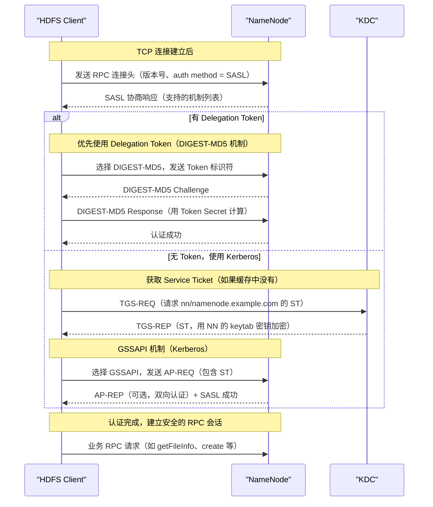
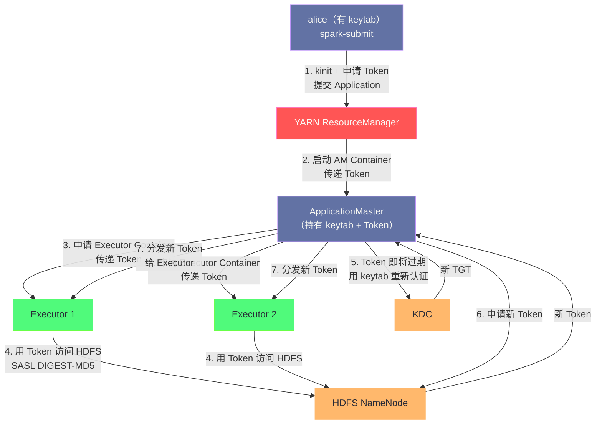

**摘要：**

Hadoop 的安全模式（Secure Mode）并非简单地"开启 Kerberos"那么轻描淡写。它是一套覆盖 HDFS、YARN、RPC 通信、数据传输、Web UI 的完整安全架构，涉及 Kerberos Principal 规划、keytab 分发、SASL 握手协议、Delegation Token 生命周期管理，以及 `hadoop.security.auth_to_local` 这条将 Kerberos Principal 映射到 OS 用户的关键规则链。本文以"一次完整的 Spark on YARN 作业提交"为主线，将 Hadoop 安全模式的每一个环节串联起来，深入剖析为什么 Hadoop 要这样设计，以及生产中最常踩到的那些安全配置陷阱。

---

## 第 1 章 Hadoop 安全模式的整体架构

### 1.1 为什么 Hadoop 安全不只是"加 Kerberos"

刚接触 Hadoop 安全的人，往往有一个误解：安全模式不就是配一下 Kerberos，让用户登录时认证一下吗？

这个理解只覆盖了整个安全体系的 10%。一个完整的 Hadoop 安全架构需要回答以下几个问题：

**认证（Authentication）**：如何确认"你是谁"？
- 用户与 Hadoop 服务之间（Client → NameNode、Client → ResourceManager）
- Hadoop 服务与服务之间（NameNode → DataNode、ResourceManager → NodeManager）
- YARN Container 与服务之间（Executor 进程 → NameNode，此时 Executor 没有 Kerberos keytab）

**授权（Authorization）**：确认身份后，"你能做什么"？
- HDFS 文件权限（POSIX 权限 + ACL）
- YARN 队列权限（哪些用户可以提交到哪些队列）
- Hive/HBase 的行级、列级权限（由 [[Apache Ranger]] 管控，详见第 04 篇）

**传输安全（Wire Security）**：数据在网络上传输时是否加密？
- RPC 通信的完整性验证（Integrity）和加密（Privacy）
- DataNode 数据块传输的加密
- Web UI 和 REST API 的 HTTPS

**审计（Audit）**：谁做了什么操作，留下了记录？
- HDFS 审计日志
- [[Apache Ranger]] 的统一审计体系（详见第 04 篇）

本文聚焦**认证**这一核心环节，沿着 Spark on YARN 作业提交这条主线，把 HDFS、YARN 的认证流程完整串联起来。

### 1.2 Hadoop 安全的两层凭证体系

理解 Hadoop 安全模式，最重要的认知是：**Hadoop 构建了独立于 Kerberos 的第二层凭证体系——Delegation Token**。

这不是多余的设计，而是工程上的必然选择。Kerberos 的 TGT 虽然强大，但在分布式计算场景中有几个根本性的局限：

1. **TGT 无法安全地在进程间传递**：TGT 内含 Session Key，是私密凭证，不能序列化后发给 YARN Executor
2. **所有节点需要能访问 KDC**：如果 KDC 网络抖动，所有 Executor 的认证都会失败，单点风险极高
3. **keytab 不能分发给动态创建的 Container**：YARN Container 是按需创建的，不可能为每个 Container 预置 keytab
4. **KDC 扩展性受限**：成千上万的 Executor 同时向 KDC 请求 Service Ticket，KDC 会成为瓶颈

Delegation Token 正是为解决这些问题而设计的：

```
两层凭证体系对比：

第一层：Kerberos TGT（凭证层）
├── 颁发方：KDC（AS）
├── 验证方：KDC（TGS）+ 各服务（用 keytab 验证 ST）
├── 使用场景：服务启动时的初始认证、Driver 向 RM/NN 的认证
└── 局限：私密凭证，不可分发，依赖 KDC 可达性

第二层：Delegation Token（委托令牌层）
├── 颁发方：各 Hadoop 服务（NameNode、ResourceManager 等）
├── 验证方：颁发该 Token 的服务本身（不需要 KDC）
├── 使用场景：Executor/Container 对 HDFS/YARN 的访问
└── 优势：可安全序列化传递，验证不依赖 KDC，有独立的续期机制
```

> [!info] 核心概念：Delegation Token 的本质
> Delegation Token 是 Hadoop 服务端颁发的、经过 HMAC-SHA1 签名的访问令牌，本质上是服务端对"持有此 Token 者被授权以某用户身份访问本服务"的背书。它存储在服务端内存中（NameNode、ResourceManager 各自维护自己的 Token Store），验证时直接在服务端内存中查找，完全不需要 KDC 参与。

---

## 第 2 章 Hadoop 服务的 Principal 规划与 keytab 分布

### 2.1 _HOST 通配符：简化大规模部署的关键设计

每个 Hadoop 服务进程都需要一个 Kerberos Principal。对于包含数百个 DataNode 的集群，如果每个节点的 Principal 都不同（`dn/node001.example.com@REALM`、`dn/node002.example.com@REALM`...），配置文件管理将极为繁琐。

Hadoop 引入了 `_HOST` 通配符来解决这个问题：在配置文件中统一写 `dn/_HOST@EXAMPLE.COM`，每个 DataNode 进程启动时自动将 `_HOST` 替换为本机的完全限定域名（FQDN）。这样所有节点可以共享同一份 `hdfs-site.xml` 配置文件，只需为每台机器单独生成对应的 keytab 文件。

Hadoop 集群各服务的标准 Principal 命名规范：

| 服务 | Principal 格式 | keytab 建议路径 |
|------|--------------|----------------|
| NameNode | `nn/_HOST@REALM` + `host/_HOST@REALM` | `/etc/security/keytabs/nn.service.keytab` |
| DataNode | `dn/_HOST@REALM` + `host/_HOST@REALM` | `/etc/security/keytabs/dn.service.keytab` |
| Secondary NameNode | `sn/_HOST@REALM` + `host/_HOST@REALM` | `/etc/security/keytabs/sn.service.keytab` |
| JournalNode（HA 模式）| `jn/_HOST@REALM` + `host/_HOST@REALM` | `/etc/security/keytabs/jn.service.keytab` |
| ResourceManager | `rm/_HOST@REALM` + `host/_HOST@REALM` | `/etc/security/keytabs/rm.service.keytab` |
| NodeManager | `nm/_HOST@REALM` + `host/_HOST@REALM` | `/etc/security/keytabs/nm.service.keytab` |
| MapReduce JobHistory Server | `jhs/_HOST@REALM` + `HTTP/_HOST@REALM` | `/etc/security/keytabs/jhs.service.keytab` |
| WebHDFS / HttpFS | `HTTP/_HOST@REALM` | `/etc/security/keytabs/spnego.service.keytab` |

注意每个服务通常包含两个 Principal：一个是服务专用的（如 `nn/...`），用于服务间 RPC 认证；另一个是 `HTTP/...`（即 SPNEGO Principal），用于浏览器访问 Web UI 时的 HTTP 认证。

### 2.2 `hadoop.security.auth_to_local`：连接 Kerberos 与 Linux 的桥梁

Kerberos Principal 的格式是 `primary/instance@REALM`，而 Linux 系统和 HDFS 权限体系使用的是简单的用户名（如 `hdfs`、`alice`）。两者之间的映射，由 `core-site.xml` 中的 `hadoop.security.auth_to_local` 规则决定。

**为什么需要这个映射？** 当 NameNode 收到一个来自 `hdfs/namenode.example.com@EXAMPLE.COM` 的 RPC 请求时，它需要把这个 Kerberos Principal 转换成一个 Linux 用户名，才能做 HDFS 权限检查（`hdfs` 用户是超级用户，有完全访问权限）。

规则格式基于 MIT Kerberos 的 `auth_to_local` 语法：

```xml
<property>
  <name>hadoop.security.auth_to_local</name>
  <value>
    <!-- 规则一：服务账号映射——去掉 /hostname 部分，只保留 service name -->
    <!-- 匹配有两个组件（如 hdfs/hostname）且 realm 是 EXAMPLE.COM 的 Principal -->
    <!-- 映射规则：取第一个组件（$1），即 hdfs, nn, rm 等 -->
    RULE:[2:$1](^(hdfs|nn|dn|rm|nm|jhs|HTTP)$)s/.*/\L$1/

    <!-- 规则二：普通用户映射——直接取 Principal 的第一部分 -->
    RULE:[1:$1@$0](.*@EXAMPLE\.COM)s/@.*//

    <!-- 规则三：跨 Realm 用户（如来自 AD 的用户）-->
    RULE:[1:$1@$0](.*@AD\.EXAMPLE\.COM)s/@AD\.EXAMPLE\.COM//L

    <!-- 默认规则：只保留默认 Realm 的用户 -->
    DEFAULT
  </value>
</property>
```

规则的匹配逻辑：**从上到下依次匹配，第一条匹配成功的规则生效**。每条规则格式为 `RULE:[n:format](regexp)s/pattern/replacement/flags`：
- `n`：Principal 组件数量（`alice@REALM` 有 1 个组件，`hdfs/host@REALM` 有 2 个组件）
- `format`：从 Principal 构造一个中间字符串（`$1` 表示第一个组件，`$0` 表示 Realm）
- `(regexp)`：中间字符串必须匹配的正则
- `s/pattern/replacement/`：对中间字符串做替换，得到最终的 Linux 用户名
- `/L` 标志：转换为小写（Hadoop 对 MIT 标准的扩展）

> [!warning] 生产避坑：auth_to_local 配置错误是常见故障根源
> 如果 `auth_to_local` 规则配置有误，`hdfs/namenode.example.com@EXAMPLE.COM` 可能被映射成一个不存在的用户名（如 `namenode` 而不是 `hdfs`），导致 NameNode 启动失败或丧失超级用户权限。常见的错误是正则表达式的转义问题——Java 的正则引擎和 krb5.conf 的规则语法略有不同，`.` 在 Java 正则中必须转义为 `\.`，否则会匹配任意字符，可能导致意外的映射结果。

---

## 第 3 章 SASL：RPC 通信安全的基础设施

### 3.1 SASL 是什么，为什么 Hadoop 选它

在深入 Hadoop 认证流程之前，需要理解 [[SASL]]（Simple Authentication and Security Layer，简单认证与安全层）。SASL 是一个认证框架，定义于 RFC 4422，它的核心设计是**将认证机制与应用协议解耦**。

**为什么需要 SASL？** 考虑 Hadoop 的 IPC（RPC 框架）需要支持多种认证方式：
- Simple 模式（无加密，仅凭用户名）
- Kerberos 模式（GSSAPI 机制）
- Delegation Token 模式（DIGEST-MD5 机制）

如果 Hadoop RPC 直接在代码里写死这三种认证逻辑，代码耦合极重，扩展新认证方式时需要修改核心 RPC 代码。SASL 提供了一个统一的框架：RPC 连接建立时先协商使用哪种 SASL 机制（`GSSAPI` 或 `DIGEST-MD5`），然后通过统一的 Challenge/Response 接口完成认证，RPC 代码本身不需要了解具体的认证细节。

### 3.2 Hadoop RPC 的 SASL 握手流程

以客户端（如 HDFS Client）连接 NameNode 为例，完整的 SASL 握手流程：



**关键设计：Delegation Token 优先于 Kerberos TGT**

客户端在决定用哪种认证方式时，有明确的优先级：**如果客户端持有目标服务的 Delegation Token，优先使用 Token（DIGEST-MD5 机制），而不是走 Kerberos（GSSAPI）**。

这个优先级设计极其重要，原因是：
1. **DIGEST-MD5 不需要 KDC 参与**：验证在服务端内存中完成，响应速度更快，且减少了 KDC 的压力
2. **减少 KDC 的负载**：在大规模集群中，大量 Executor 同时发起 Kerberos 认证可能导致 KDC 过载
3. **支持无 keytab 的 Container**：Executor 容器根本没有 Kerberos 凭证，只能用 Delegation Token

### 3.3 `hadoop.rpc.protection`：认证之外的通信安全

认证只解决了"确认身份"的问题，但认证后的 RPC 通信是否也需要安全保护？

`hadoop.rpc.protection` 配置项控制 RPC 通信的安全级别：

| 配置值 | 安全级别 | 含义 | 性能开销 |
|-------|---------|------|---------|
| `authentication` | 仅认证 | 只在建立连接时验证身份，后续数据不加密 | 最低 |
| `integrity` | 完整性保护 | 每个 RPC 消息都带 HMAC 签名，防篡改 | 低 |
| `privacy` | 完全加密 | 所有 RPC 数据加密传输，防窃听 | 较高 |

生产环境中的推荐策略：
- **内部 RPC（服务间通信）**：`integrity` 即可，防止内网中间人篡改，性能损失可接受
- **外部 RPC（客户端接入）**：`privacy`，防止数据在网络中被嗅探
- **数据块传输（HDFS BlockTransfer）**：单独配置 `dfs.encrypt.data.transfer=true`

---

## 第 4 章 Delegation Token 深度解析

### 4.1 Token 的结构与颁发机制

Hadoop Delegation Token 由两部分组成：**Token Identifier（令牌标识符）** 和 **Token Password（令牌密码/密文）**。

**Token Identifier** 是明文的，包含：
```
TokenIdentifier {
    kind:          "HDFS_DELEGATION_TOKEN"  // Token 类型标识
    owner:         "alice"                   // Token 的所有者（被代理的用户）
    renewer:       "yarn"                    // 被允许续期此 Token 的 Principal
    realUser:      ""                        // 如果是代理用户，这里记录 realUser
    issueDate:     1705280400000             // 颁发时间（毫秒时间戳）
    maxDate:       1705886400000             // 最大有效期（不可超越，即使续期）
    sequenceNumber: 12345                    // 递增序号，服务端用于查找 Token
    masterKeyId:    3                        // 签名所用的 Master Key ID
}
```

**Token Password** 是用 NameNode 内部的 **Master Key** 对 Token Identifier 做 HMAC-SHA1 计算得到的。Master Key 只存在于 NameNode 内存中，客户端无法伪造 Token Password。

**Token 的颁发流程**：

```java
// 客户端代码示例：获取 HDFS Delegation Token
// 这需要客户端持有有效的 Kerberos 凭证（TGT），因为向 NameNode 申请 Token 本身需要认证
Token<DelegationTokenIdentifier> token = 
    dfs.getDelegationToken("yarn");  // "yarn" 是 renewer，即谁有权续期这个 Token

// Token 可以被序列化为字节数组，安全地传递给其他进程
byte[] tokenBytes = token.encodeToUrlString();
```

NameNode 内部处理 `getDelegationToken` RPC 时：
1. 验证调用方的 Kerberos 身份（必须是已认证的用户）
2. 生成新的 Token Identifier（设置 owner、renewer、issueDate、maxDate 等）
3. 用当前的 Master Key 计算 HMAC，得到 Token Password
4. 将 `(sequenceNumber → TokenIdentifier + Password)` 存储在 NameNode 内存的 Token Store 中
5. 返回 `(TokenIdentifier, Password)` 给客户端

### 4.2 Token 的有效期与续期机制

Delegation Token 有两个时间边界：

```
颁发时间        Token 过期时间            最大有效期
    |               |                        |
    ▼               ▼                        ▼
────●───────────────●────────────────────────●────→ 时间轴
    │<── max_life ──>│(需续期才能延续)         │(无论如何不能超越)
    │
    │ 默认：dfs.namenode.delegation.token.max-lifetime = 7 天
    │ 每次续期后，过期时间 = min(当前时间 + renewal-interval, maxDate)
    │ 续期间隔：dfs.namenode.delegation.token.renew-interval = 24 小时
```

**续期（Renew）操作**：

只有 Token 中指定的 `renewer`（在上面的例子中是 `yarn`）才有权续期这个 Token。在 Spark on YARN 场景中，ResourceManager 会在后台定期（每 24 小时）调用 NameNode 的 `renewDelegationToken` 接口续期所有活跃作业使用的 HDFS Token。

**取消（Cancel）操作**：

当作业完成或被 kill 时，ResourceManager 会调用 `cancelDelegationToken` 接口让 NameNode 立即失效对应的 Token，防止 Token 在作业结束后被滥用。

### 4.3 Master Key 的轮换：服务端安全的关键

NameNode 内部维护着一个 Master Key，所有 Delegation Token 的 Password 都是用这个 Key 签名的。如果 Master Key 泄露，攻击者可以伪造任意 Token。

为了降低 Master Key 泄露的影响，NameNode 会定期轮换 Master Key：
- 每隔 `dfs.namenode.delegation.key.update-interval`（默认 1 天）生成新的 Master Key
- 旧的 Master Key **不立即废弃**，而是保留 `dfs.namenode.delegation.token.max-lifetime`（默认 7 天）后才删除
- 保留期间，用旧 Key 签发的 Token 仍然有效（Token Identifier 中记录了 masterKeyId，NameNode 据此找到对应的历史 Key 验证）

这个设计保证了：Master Key 轮换时，现有 Token 不会立即失效，可以继续使用直到各自的 maxDate。

> [!warning] 生产避坑：NameNode HA 时的 Token Store 同步
> 在 NameNode HA 模式下，Active NN 和 Standby NN 都需要维护相同的 Token Store 和 Master Key，否则在 Active NN 故障切换后，Standby NN 接管时无法验证之前颁发的 Token，导致所有正在运行的作业认证失败。这个同步是通过 JournalNode（HA 的共享编辑日志）实现的——每次颁发 Token、续期 Token、删除 Token 的操作都会写入 EditLog，Standby NN 通过回放 EditLog 保持状态同步。

---

## 第 5 章 Spark on YARN 的完整安全链路

### 5.1 作业提交阶段：Token 的生成与打包

以用户 `alice` 在安全集群上提交一个 Spark 作业为例，完整走一遍安全链路：

**前提**：`alice` 已通过 `kinit` 获取了有效的 Kerberos TGT（或配置了 keytab 自动认证）。

**Step 1：SparkContext 初始化，获取 loginUser**

```java
// Spark Driver 内部（简化）
UserGroupInformation loginUser = UserGroupInformation.getLoginUser();
// loginUser = alice，authMethod = KERBEROS，Subject 中含有 TGT
```

**Step 2：向各服务申请 Delegation Token**

SparkContext 在初始化时，通过 `HadoopDelegationTokenManager` 向所有需要的服务申请 Delegation Token：

```
alice（持 Kerberos TGT）向以下服务申请 Delegation Token：
├── HDFS NameNode → 获取 HDFS_DELEGATION_TOKEN（renewer = yarn）
├── YARN ResourceManager → 获取 RM Delegation Token
├── HBase Master（如果作业访问 HBase）→ 获取 HBASE_AUTH_TOKEN
├── Hive Metastore（如果作业使用 Hive）→ 获取 HIVE_DELEGATION_TOKEN
└── 其他需要的服务...
```

**Step 3：将 Token 打包进 ApplicationSubmissionContext**

所有 Token 被序列化后，放入 YARN 的 `ApplicationSubmissionContext` 中，随 `submitApplication` RPC 发送给 ResourceManager。

```java
// Spark YARN Client 内部（简化）
Credentials credentials = new Credentials();
// 将所有获取到的 Token 写入 credentials
UserGroupInformation.getCurrentUser().addCredentialsToCredentials(credentials);

// 序列化 credentials
ByteArrayOutputStream bos = new ByteArrayOutputStream();
DataOutputStream dos = new DataOutputStream(bos);
credentials.writeTokenStorageToStream(dos);

// 打包进 ApplicationSubmissionContext
appContext.setTokens(ByteBuffer.wrap(bos.toByteArray()));
```

**Step 4：ResourceManager 分发 Token 给 Container**

当 RM 决定在某个 NodeManager 上启动 ApplicationMaster Container 时，会将这些 Token 传递给 NodeManager：

```
RM → NM：启动 AM Container，附带 Token 集合
NM：
  1. 将 Token 写入本地文件（$HADOOP_TOKEN_FILE_LOCATION 指定的临时文件）
  2. 在启动 Container 进程时，设置环境变量 HADOOP_TOKEN_FILE_LOCATION
AM（ApplicationMaster）进程启动：
  1. 读取 HADOOP_TOKEN_FILE_LOCATION 指定的文件
  2. 将 Token 加载到自己的 UGI Credentials 中
```

### 5.2 Executor 启动阶段：Token 的继承与使用

AM 启动后，决定在哪些 NodeManager 上启动 Executor：

**Step 5：AM 向 NM 申请 Executor Container**

AM 向 NM 发起 `startContainerAsync` 请求时，会将 Credentials（包含所有 Token）再次打包进 `ContainerLaunchContext`，传递给目标 NodeManager。

**Step 6：NM 启动 Executor Container**

NodeManager 将 Token 写入 Executor 的临时凭证文件，并设置 `HADOOP_TOKEN_FILE_LOCATION` 环境变量。Executor JVM 启动时，UGI 框架自动读取这个文件，将 Token 加载到 Executor 的 UGI 中。

```
Executor UGI 中的凭证状态：
├── authMethod = TOKEN（没有 Kerberos TGT，只有 Token）
└── credentials:
    ├── HDFS_DELEGATION_TOKEN: {owner=alice, renewer=yarn, ...}
    └── RM_DELEGATION_TOKEN: {...}
```

**Step 7：Executor 访问 HDFS**

Executor 发起 HDFS 读写请求时，UGI 从 Credentials 中取出 HDFS Delegation Token，通过 SASL DIGEST-MD5 机制向 NameNode 认证：

```
Executor → NameNode：
  SASL 握手：使用 DIGEST-MD5 机制
  认证材料：HDFS Delegation Token（TokenIdentifier + Password）
NameNode：
  在 Token Store 中查找对应的 Token
  验证 Password（用 masterKeyId 找到对应的 Master Key，重新计算 HMAC，与 Password 对比）
  验证 Token 未过期
  认证通过，以 Token owner（alice）的权限执行请求
```

### 5.3 Token 续期：长时间作业的保障

对于运行时间超过 24 小时的长时间作业（如 Spark Streaming、批量回刷），Delegation Token 在作业运行期间可能过期。

**YARN 的自动 Token 续期机制**：

ResourceManager 内部有一个 `RMDelegationTokenRenewer` 组件，负责为所有活跃应用程序续期其 HDFS/HBase 等服务的 Delegation Token：

```
续期时机：
├── 当检测到某个 Token 距过期时间 < renew-interval（24h）的 10% 时
└── 触发 renewDelegationToken RPC → 对应的服务（如 NameNode）

续期条件：
├── RM 的 Principal（通常是 yarn@REALM）必须是 Token 的 renewer
└── 当前时间 < Token 的 maxDate（7 天上限）
```

**Spark 自己的 Token 刷新机制（Spark 2.3+）**：

对于超过 7 天的超长任务（maxDate 到期后 Token 不可续期，必须重新申请），Spark 引入了 `AMCredentialRenewer`：

1. Driver 端配置了 keytab 时（`spark.kerberos.keytab`），AM 持有 keytab
2. AM 内部的 `AMCredentialRenewer` 线程定期（在 Token 即将到达 maxDate 之前）用 keytab 重新认证，向 NameNode 申请新的 Delegation Token
3. 新 Token 通过 Spark 内部的 RPC 分发给所有活跃的 Executor



---

## 第 6 章 DataNode 安全：特殊的端口绑定要求

### 6.1 DataNode 为什么必须绑定特权端口

DataNode 的安全机制有一个特别之处，让很多人困惑：**在 Hadoop 安全模式下，DataNode 的数据传输端口（`dfs.datanode.address`）必须是特权端口（端口号 < 1024），默认是 1004**。

为什么有这个要求？这是 Linux 安全机制的一个特性：绑定 1024 以下端口需要 root 权限（或 `CAP_NET_BIND_SERVICE` capability）。Hadoop 利用这个特性来保证 DataNode 进程必须以 root 启动，然后通过 `jsvc`（Java Service Wrapper）降权到 `hdfs` 用户运行。

**安全意图**：如果 DataNode 可以随意在高位端口（>1024）监听，任何普通用户都可以在 DataNode 宕机后伪造一个 DataNode 进程监听同一端口，截获客户端的数据请求，造成数据窃取。绑定特权端口保证了只有经过认证的（能以 root 启动的）进程才能成为合法 DataNode。

**Hadoop 3.x 的改进**：Hadoop 3.0 引入了基于 SASL 的 DataNode 认证（`dfs.data.transfer.protection = authentication`），允许 DataNode 使用高位端口，但要求数据传输通道本身经过 SASL 认证。这消除了对特权端口的依赖，简化了容器化部署（容器内进程通常不能绑定特权端口）。

### 6.2 Block Token：数据传输的独立认证

除了控制通道（RPC）的 SASL 认证，HDFS 的数据传输通道（Block Transfer）也有独立的认证机制——Block Token。

**Block Token 的工作流程**：

```
1. 客户端向 NameNode 请求读取文件
   NameNode 返回：文件块列表 + 每个块对应的 Block Token
   Block Token = HMAC(block_id + block_pool_id + expiry_time + access_modes, Block Token Key)

2. 客户端向目标 DataNode 发起数据请求，携带 Block Token

3. DataNode 验证 Block Token：
   DataNode 持有与 NameNode 同步的 Block Token Key（通过 DN → NN 的心跳同步）
   重新计算 HMAC，与 Block Token 对比
   验证 access_modes（READ / WRITE / COPY / REPLACE）
   验证 expiry_time

4. 验证通过，DataNode 传输数据
```

Block Token 的关键特性：
- **短时效**：Block Token 的有效期通常只有 10 小时（`dfs.block.access.token.lifetime`），过期后即使数据块还在，也无法用旧 Token 访问
- **操作类型限制**：Token 中记录了允许的操作类型（READ/WRITE/COPY），READ Token 不能用于写入
- **不需要 KDC**：验证完全在 NN 和 DN 之间完成

---

## 第 7 章 WebHDFS 与 SPNEGO：浏览器端的认证

### 7.1 SPNEGO：让 HTTP 支持 Kerberos 认证

Hadoop 的 Web UI（NameNode UI、ResourceManager UI）和 REST API（WebHDFS）需要支持浏览器访问，而浏览器不理解 Kerberos 的 SASL 协议。这里用到的是 SPNEGO（Simple and Protected GSSAPI Negotiation Mechanism，简单受保护的 GSSAPI 协商机制）。

**SPNEGO 的工作方式**：SPNEGO 将 Kerberos 认证封装在 HTTP 协议中，通过标准的 `Authorization: Negotiate <kerberos-token>` HTTP 头传递认证信息。支持 SPNEGO 的浏览器（Chrome、Firefox、IE/Edge）在检测到服务器返回 `WWW-Authenticate: Negotiate` 响应头时，会自动调用操作系统的 Kerberos 库获取 Service Ticket，并放在后续请求的 `Authorization` 头中。

**服务端配置**：

```xml
<!-- core-site.xml：启用 SPNEGO 认证 -->
<property>
  <name>hadoop.http.authentication.type</name>
  <value>kerberos</value>
</property>
<property>
  <name>hadoop.http.authentication.kerberos.principal</name>
  <value>HTTP/_HOST@EXAMPLE.COM</value>  <!-- SPNEGO 专用的 HTTP Principal -->
</property>
<property>
  <name>hadoop.http.authentication.kerberos.keytab</name>
  <value>/etc/security/keytabs/spnego.service.keytab</value>
</property>
```

**一次 WebHDFS 请求的认证流程**：

```
客户端（curl / 浏览器）
  │
  ├─1→ GET /webhdfs/v1/user/alice?op=LISTSTATUS
  │     （无认证头）
  │
  ←2── HTTP 401 Unauthorized
  │    WWW-Authenticate: Negotiate
  │    WWW-Authenticate: Basic realm="hadoop"
  │
  ├─3→ 客户端向 KDC 申请 HTTP/namenode.example.com 的 ST
  │
  ├─4→ GET /webhdfs/v1/user/alice?op=LISTSTATUS
  │    Authorization: Negotiate YIIBxgYJKoZIhvcSAQICAQBuggG1MIIB...（ST 的 Base64）
  │
  ←5── HTTP 200 OK（成功）
       Set-Cookie: hadoop.auth=...（可选：认证 Cookie，避免每次请求都走 Kerberos）
```

---

## 第 8 章 常见安全配置完整参考

### 8.1 core-site.xml 安全核心配置

```xml
<!-- 开启 Kerberos 安全模式（必须在所有节点一致） -->
<property>
  <name>hadoop.security.authentication</name>
  <value>kerberos</value>
</property>

<!-- 开启服务授权（基于 hadoop-policy.xml 的服务访问控制） -->
<property>
  <name>hadoop.security.authorization</name>
  <value>true</value>
</property>

<!-- Principal → OS 用户名映射规则 -->
<property>
  <name>hadoop.security.auth_to_local</name>
  <value>
    RULE:[2:$1/$2@$0]([ndj]n/.*@EXAMPLE\.COM$)s/.*/hdfs/
    RULE:[2:$1/$2@$0]([rn]m/.*@EXAMPLE\.COM$)s/.*/yarn/
    RULE:[2:$1/$2@$0](jhs/.*@EXAMPLE\.COM$)s/.*/mapred/
    RULE:[1:$1@$0](.*@EXAMPLE\.COM$)s/@.*//
    DEFAULT
  </value>
</property>

<!-- RPC 通信保护级别 -->
<property>
  <name>hadoop.rpc.protection</name>
  <value>integrity</value>
</property>

<!-- 代理用户配置：允许 yarn 服务代理所有用户 -->
<property>
  <name>hadoop.proxyuser.yarn.hosts</name>
  <value>*</value>
</property>
<property>
  <name>hadoop.proxyuser.yarn.users</name>
  <value>*</value>
</property>

<!-- 允许 hive 服务代理用户（Hive on Tez/Spark 场景） -->
<property>
  <name>hadoop.proxyuser.hive.hosts</name>
  <value>hiveserver2.example.com</value>
</property>
<property>
  <name>hadoop.proxyuser.hive.users</name>
  <value>*</value>
</property>
```

### 8.2 Token 生命周期配置（hdfs-site.xml）

```xml
<!-- HDFS Delegation Token 最大有效期（默认 7 天） -->
<property>
  <name>dfs.namenode.delegation.token.max-lifetime</name>
  <value>604800000</value>  <!-- 7 * 24 * 3600 * 1000 ms -->
</property>

<!-- Token 续期间隔（默认 24 小时） -->
<property>
  <name>dfs.namenode.delegation.token.renew-interval</name>
  <value>86400000</value>  <!-- 24 * 3600 * 1000 ms -->
</property>

<!-- Master Key 更新间隔（默认 1 天） -->
<property>
  <name>dfs.namenode.delegation.key.update-interval</name>
  <value>86400000</value>
</property>

<!-- 开启 Block Token 认证 -->
<property>
  <name>dfs.block.access.token.enable</name>
  <value>true</value>
</property>

<!-- 数据传输加密（Hadoop 3.x 推荐替代特权端口方案） -->
<property>
  <name>dfs.data.transfer.protection</name>
  <value>authentication</value>
</property>
```

---

## 第 9 章 KDiag：官方安全诊断工具

Hadoop 3.x 提供了官方的 Kerberos 诊断工具 `KDiag`，可以系统性地检查 Kerberos 配置、keytab 有效性、时钟同步等：

```bash
# 使用 KDiag 进行全面诊断
hadoop org.apache.hadoop.security.KDiag \
  --keytab /etc/security/keytabs/hdfs.headless.keytab \
  --principal hdfs@EXAMPLE.COM \
  --keylen 256 \
  --output /tmp/kdiag-output.txt

# 典型输出（成功时）：
# Kerberos library found: MIT Kerberos 1.18
# KDC: kdc1.example.com:88 [reachable]
# Clock: within tolerance
# Keytab: /etc/security/keytabs/hdfs.headless.keytab [readable]
# Principal: hdfs@EXAMPLE.COM [found in keytab, kvno=3]
# TGT: obtained successfully [expires: 2024-01-15T20:00:00]
# DIAGNOSIS: PASS
```

`KDiag` 会检查的内容包括：
- Kerberos 库版本（MIT vs IBM）
- KDC 网络可达性
- 时钟偏差
- keytab 文件权限和内容
- 能否成功获取 TGT
- 主机名解析是否正常（影响 `_HOST` 通配符替换）

---

## 小结

本文以 Spark on YARN 作业提交为主线，系统串联了 Hadoop 安全模式的完整链路：

- **两层凭证体系**：Kerberos TGT 负责服务启动时的初始认证，Delegation Token 负责 Container/Executor 的轻量级认证，两层设计互补
- **SASL 握手**：RPC 连接建立时协商认证机制（GSSAPI for Kerberos，DIGEST-MD5 for Token），Token 优先于 TGT
- **Principal 规划**：`_HOST` 通配符简化大规模部署，`auth_to_local` 规则连接 Kerberos 与 Linux 用户体系
- **Token 生命周期**：申请 → 分发 → 续期（RM 自动续期）→ 重新申请（AM 用 keytab 刷新）→ 取消
- **DataNode 安全**：特权端口或 SASL 数据传输保护，Block Token 独立控制数据访问
- **SPNEGO**：将 Kerberos 认证封装在 HTTP 中，支持浏览器无缝访问 Web UI

下一篇 [[04 Apache Ranger 权限管控体系深度解析]] 将进入授权层，介绍当认证通过之后，如何通过 Ranger 的 Policy 引擎精细控制"谁能做什么"。
