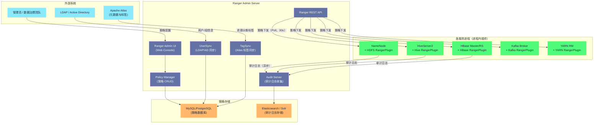
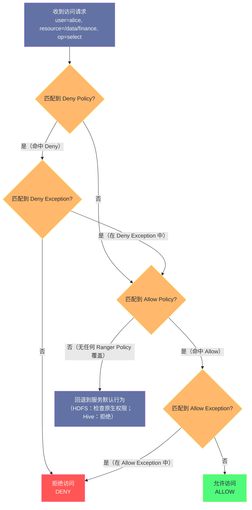
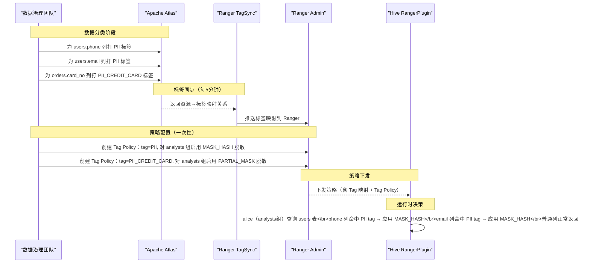
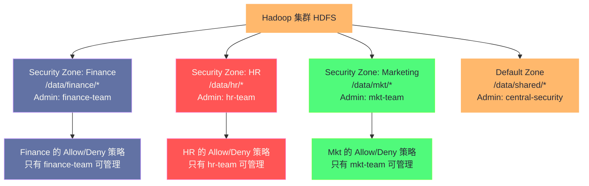

**摘要：**

当 Kerberos 完成"你是谁"的认证之后，集群还面临一个同等重要的问题："你能做什么"。Apache Ranger 正是为解决这个问题而生的统一授权框架。它将 HDFS、Hive、HBase、Kafka、YARN 等十余种大数据服务的权限管控统一纳入一套 Policy 模型中，并在每个服务内部以轻量级插件（RangerPlugin）的方式执行授权决策，做到**策略集中管理、执行本地化**。本文从 Ranger 的整体架构出发，深入剖析 RangerPlugin 的工作原理与 Policy 评估引擎，然后系统讲解资源型策略（RBAC）、标签型策略（TBAC）、属性型策略（ABAC）、行级过滤（Row Filter）与列级脱敏（Data Masking）五种策略模型，最后结合生产实践中的常见误区与排查手段，帮助读者真正吃透 Ranger 的设计哲学。

---

## 第 1 章 从 HDFS POSIX 权限到 Ranger：为什么原生权限不够用

### 1.1 HDFS 原生权限的三层演进

在介绍 Ranger 之前，必须先理解它要替代的东西，以及为什么要替代它。

**第一层：POSIX 权限（owner/group/other + rwx）**

HDFS 最初的权限模型直接照搬了 Linux 的 POSIX 权限：每个文件/目录有一个 owner（所有者）和一个 group（所属组），权限分为 read（r）、write（w）、execute（x），分别对 owner、group、other 三类主体生效。

这套模型对于单机 Linux 系统足够好用，但在企业级数据平台中面临严峻挑战：

**挑战一：无法表达"多个不同用户各自有不同权限"**。POSIX 模型对 other（其他所有人）只有一个权限位。如果你想让 team_A 可读、team_B 可写、team_C 既不可读也不可写，POSIX 无法表达这种细粒度的差异化权限。

**挑战二：group 机制的局限性**。POSIX 通过 group 来扩展权限，但一个文件只能属于一个 group，而企业中的数据往往需要对多个不同团队开放不同级别的访问权。

**第二层：HDFS ACL（Access Control List）**

为弥补 POSIX 的不足，HDFS 在 Hadoop 2.4 引入了 ACL（`dfs.namenode.acls.enabled = true`）。ACL 允许为特定用户或特定组单独设置权限，突破了 POSIX "只有三类主体" 的限制：

```bash
# 设置 ACL：允许 analyst 组对 /data/finance 目录只读
hdfs dfs -setfacl -m group:analyst:r-x /data/finance
# 设置默认 ACL（新创建的子文件/目录继承此 ACL）
hdfs dfs -setfacl -m default:group:analyst:r-x /data/finance
```

ACL 解决了多主体细粒度控制的问题，但依然有三个根本性局限：

**局限一：管理孤岛**。HDFS ACL 只管 HDFS，Hive 有自己的权限体系，HBase 有自己的，Kafka 有自己的。运维人员需要在多套权限系统中分别配置，容易出现不一致，也难以进行全局审计（"alice 在整个数据平台上有哪些权限？"这个问题无法一次性回答）。

**局限二：无法表达动态策略**。ACL 是静态绑定在资源上的，无法表达"工作时间才可访问"、"只能访问自己所在部门的数据"这类动态条件。

**局限三：无法做列级和行级控制**。即使用户有权限读取某张 Hive 表，你可能希望某些列（如身份证号、手机号）被自动脱敏，或者只能看到与自己相关的数据行。ACL 完全无法实现这类需求。

**第三层：Apache Ranger**

Ranger 的定位就是解决上面所有问题，做到：
- **统一管理**：一个控制台管理所有服务的权限
- **细粒度**：从数据库级、表级、列级到行级
- **动态策略**：基于用户属性、时间、环境条件的 ABAC 策略
- **集中审计**：所有服务的访问记录汇聚到一处，满足合规需求

### 1.2 Ranger 的核心设计哲学："策略集中，执行本地"

Ranger 最关键的架构决策是：**不做代理，做插件**。

如果 Ranger 采用代理模式（类似 API Gateway），所有访问请求都必须经过 Ranger Server 转发，则 Ranger Server 会成为整个集群的单点瓶颈。对于 Kafka 每秒数万条消息的吞吐、HBase 每秒数千次读写，这显然不可接受。

Ranger 的选择是：**Admin Server 只负责策略的集中管理和审计日志的收集，而授权决策（Policy Evaluation）在每个服务进程内部由 RangerPlugin 完成**。RangerPlugin 定期（默认 30 秒）从 Admin Server 拉取最新策略，缓存在本地内存中。此后的每一次授权请求，RangerPlugin 直接在本地内存完成评估，无需网络 I/O，响应时间在微秒到毫秒级别。

这一设计还带来了一个重要的高可用保证：**即使 Ranger Admin Server 宕机，RangerPlugin 使用本地缓存的策略继续提供授权服务，不影响集群的正常运行**（当然，宕机期间策略变更无法下发）。

---

## 第 2 章 Ranger 整体架构深度解析

### 2.1 组件全景图



### 2.2 Ranger Admin Server 内部机制

**Policy Manager** 是 Admin Server 的核心，负责：
- 接收管理员通过 UI 或 REST API 提交的策略变更
- 对策略进行合法性校验（比如检查引用的用户/组是否存在）
- 将策略持久化到 MySQL/PostgreSQL 数据库
- 维护每个 ServiceDef（服务类型定义）的版本号，插件通过版本号判断策略是否有更新

**UserSync** 是 Ranger 与企业目录（LDAP/AD）的桥接组件：
- 定期（默认 5 分钟）从 LDAP/AD 拉取用户列表和组成员关系
- 将同步结果写入 Ranger 数据库，Admin UI 中可见的用户/组来自这里
- 支持增量同步（只同步上次同步后的变更），减少 LDAP 查询压力

**TagSync** 是 Ranger 与 [[Apache Atlas]] 集成的关键组件：
- 定期从 Atlas 拉取资源的分类（Classification）标签，如 `PII`、`SENSITIVE`、`PHI`
- 将标签同步到 Ranger，供 Tag-Based Policy 使用
- 当 Atlas 中某张 Hive 表被标记为 `PII` 时，Ranger 中针对 `PII` 标签的脱敏策略会自动生效

### 2.3 RangerPlugin 的内部工作机制

每个 RangerPlugin 实例（运行在 NameNode、HiveServer2 等服务进程内）的工作机制如下：

```
RangerPlugin 初始化（服务启动时）：
1. 读取服务进程的 Ranger 配置文件（如 ranger-hdfs-security.xml）
2. 向 Ranger Admin Server 发起首次策略下载（REST API: /service/plugins/policies/download/{serviceName}）
3. 将策略写入本地磁盘缓存（ranger-hdfs-audit.xml 同级目录，文件名 ranger_hdfs_policycache.json）
4. 在内存中构建策略评估器（PolicyEvaluator）

策略更新循环（后台线程，默认 30 秒一次）：
1. 向 Admin Server 发送策略版本号
2. 如果 Admin Server 的最新版本 > 本地版本，下载新策略
3. 原子替换内存中的 PolicyEvaluator（不影响正在进行的请求）
4. 同步更新本地磁盘缓存（保证 Admin 宕机时重启能用缓存）

授权请求处理（每次访问触发）：
1. 服务（如 NameNode）构造 RangerAccessRequest（包含：用户、组、IP、资源路径、操作类型）
2. 调用 plugin.isAccessAllowed(request)
3. RangerPlugin 在内存 PolicyEvaluator 中评估
4. 返回 RangerAccessResult（allow/deny + 匹配到的策略ID）
5. 异步记录审计日志（不阻塞访问请求）
```

> [!info] 核心概念：本地缓存文件的重要性
> RangerPlugin 在本地磁盘保存了策略缓存文件（通常在 `/etc/ranger/<servicename>/policycache/` 目录）。这个文件在两种情况下至关重要：
> 1. **Admin Server 宕机时**：服务重启后，RangerPlugin 从缓存文件恢复策略，保证授权服务不中断
> 2. **网络分区时**：Admin Server 短暂不可达，RangerPlugin 用缓存策略继续工作
> 
> 因此，不要随意删除这些缓存文件，它们是生产安全的保障。

---

## 第 3 章 Ranger Policy 模型深度解析

### 3.1 ServiceDef：策略模型的"元定义"

Ranger 的策略模型是高度可扩展的，每种服务（HDFS、Hive、Kafka...）的资源层次、权限类型都不同。Ranger 用 **ServiceDef（服务类型定义）** 来描述一个服务的"策略能力边界"。

ServiceDef 是一段 JSON 描述，定义了：
- **resources**：该服务有哪些资源类型，它们的层次关系是什么。比如 Hive 的资源层次是 `database → table → column`；HDFS 的资源是 `path`（单层，支持通配符）；Kafka 的资源是 `topic`
- **accessTypes**：该服务支持哪些权限操作。比如 Hive 的 `select`、`insert`、`create`、`drop`；HDFS 的 `read`、`write`、`execute`；Kafka 的 `publish`、`consume`、`create`
- **policyConditions**：支持的策略条件类型（用于 ABAC），比如基于 IP 范围、时间范围等的条件判断
- **dataMaskTypes**：支持的脱敏算法类型（仅对 Hive 等支持列级脱敏的服务有效）

ServiceDef 的存在使得 Ranger 可以用统一的代码框架支持任意类型的服务——只需编写一个新的 ServiceDef JSON 和对应的 RangerPlugin 实现类，就能接入新服务，无需修改 Ranger Admin Server 的核心代码。这是一个典型的**开闭原则（Open/Closed Principle）**设计：对扩展开放，对修改关闭。

### 3.2 Policy 的结构解剖

一条 Ranger Policy 的完整结构：

```json
{
  "id": 42,
  "name": "finance-analysts-read",
  "service": "hive_cluster1",         // 关联的服务实例名
  "serviceType": "hive",              // 关联的 ServiceDef 类型
  "isEnabled": true,
  "policyType": 0,                    // 0=访问策略, 1=数据脱敏策略, 2=行过滤策略
  
  // 资源路径（树形结构，按 ServiceDef 的 resources 定义）
  "resources": {
    "database": {"values": ["finance"], "isExcludes": false, "isRecursive": false},
    "table":    {"values": ["transactions", "accounts"], "isExcludes": false},
    "column":   {"values": ["*"], "isExcludes": false}
  },

  // Allow 策略条目列表（至少一条 Allow 才能放行）
  "policyItems": [
    {
      "users":  ["alice", "bob"],
      "groups": ["finance-analysts"],
      "roles":  ["data-consumer"],
      "accesses": [
        {"type": "select", "isAllowed": true},
        {"type": "describe", "isAllowed": true}
      ],
      "conditions": [],               // 空条件 = 无附加限制
      "delegateAdmin": false          // 是否允许此策略条目中的用户管理本策略
    }
  ],

  // Deny 策略条目（明确拒绝，优先级高于 Allow）
  "denyPolicyItems": [
    {
      "users":  ["intern"],
      "groups": [],
      "accesses": [{"type": "select", "isAllowed": false}],
      "conditions": []
    }
  ],

  // Allow 的例外（适用于"除了某人以外都可以"的场景）
  "allowExceptions": [],
  // Deny 的例外（即使在 deny 名单中，这里的人也能通过）
  "denyExceptions": [],

  // 策略有效期（可选，用于临时授权场景）
  "validitySchedules": [
    {
      "startTime": "2024-01-01 00:00:00",
      "endTime": "2024-03-31 23:59:59",
      "timeZone": "Asia/Shanghai"
    }
  ]
}
```

### 3.3 Policy 评估引擎：Allow、Deny 与 Exception 的决策树

这是 Ranger 最容易让人困惑的部分。许多人以为"有 Allow Policy 就能访问"，实际上 Ranger 的评估逻辑远比这复杂，遵循严格的优先级规则：



**关键规则解读**：

**规则一：Deny 优先于 Allow（基本原则）**

如果某个请求同时命中了 Deny Policy 和 Allow Policy，Deny 胜出，请求被拒绝。这是最小权限原则的体现。

**规则二：Deny Exception 可以"救回"被 Deny 的用户**

假设你有一条策略："拒绝 group:interns 访问 finance 数据库"，但你想为某个特定的实习生（如 alice）开绿灯。你可以在 Deny Exception 中加入 alice——她虽然属于 interns 组，但因为在 Deny Exception 中，所以 Deny Policy 对她不生效，她会继续进入 Allow Policy 的评估。

**规则三：Allow Exception 是 Allow 的"黑名单"**

在 Allow Policy 中设置 Allow Exception，意味着"这条 Allow Policy 对所有人生效，除了 Allow Exception 中的用户/组"。这适用于"默认允许，但有例外" 的场景。

**规则四：没有任何 Ranger Policy 覆盖时，回退到服务自身的默认行为**

对于 HDFS，这意味着 Ranger 不接管，由 HDFS 的原生权限（POSIX + ACL）决定。对于 Hive（Ranger 完全接管 Hive 权限时，通常配置 `hive.security.authorization.enabled=false` 关闭 Hive 原生授权），则直接拒绝。

---

## 第 4 章 资源型策略（Resource-Based Policy）

### 4.1 资源路径的匹配规则

资源型策略基于具体的资源名称或路径进行授权。Ranger 支持三种匹配模式：

**精确匹配**：`database=finance, table=transactions` — 只匹配 finance 数据库下名为 transactions 的表

**通配符匹配**：
- `*`：匹配任意字符串（不包含路径分隔符）。如 `table=txn_*` 匹配 `txn_2024`、`txn_2023` 等
- `?`：匹配单个字符。如 `table=log_202?` 匹配 `log_2024` 但不匹配 `log_20240101`
- 对于 HDFS 路径：`/data/*/logs` 匹配 `/data/finance/logs`、`/data/hr/logs`，但不匹配 `/data/finance/raw/logs`（需要开启 `isRecursive=true` 才能递归匹配子目录）

**排除模式（Excludes）**：将资源的 `isExcludes` 设为 `true`，表示"所有资源，除了这个"。比如 `column=[ssn, credit_card], isExcludes=true` 表示除了 ssn 和 credit_card 列之外的所有列。

### 4.2 Delegated Admin（委派管理）

Ranger 的委派管理（Delegated Admin）是一个极其实用但常被忽视的特性。在大型组织中，让中央安全团队管理所有业务部门的数据权限是不现实的——business team 更了解自己的数据和需求。

委派管理的工作方式：

1. 管理员（Super Admin）创建一条策略，在 `policyItems` 中为某个用户/组设置 `delegateAdmin=true`
2. 获得 Delegated Admin 权限的用户，可以在 Ranger Admin UI 中自助创建和管理**作用范围不超过自己授权范围**的子策略
3. 例如：安全团队授权 `finance-admin` 组对 `finance.*.*` 有委派管理权，finance-admin 组的成员可以自助管理 finance 数据库下所有表的权限，但无法越权访问 hr 数据库

这个设计将权限管理的责任分散到各业务线，既减轻了中央安全团队的运维负担，又通过"范围不超过授权者本身权限"的约束防止了权限提升攻击。

---

## 第 5 章 标签型策略（Tag-Based Policy）与 Atlas 集成

### 5.1 为什么需要标签型策略

资源型策略的一个核心问题是：**策略与资源强耦合**。当数据资产快速增长时，安全团队需要不断为新资产创建新策略，运维成本随资产数量线性增长。

考虑一个典型场景：企业有一个合规要求——所有包含 PII（Personally Identifiable Information，个人身份信息）的数据列，普通分析师只能看到脱敏后的值。

用资源型策略实现这个需求，每当增加一张包含 PII 字段的新表，安全团队就必须手动创建新的脱敏策略。如果企业有数百张这样的表，管理成本极高，而且容易遗漏。

标签型策略（Tag-Based Policy，又称 Classification-Based Policy）的核心思路是：**将权限策略绑定在标签（Classification）上，而不是绑定在具体资源上**。当 Atlas 为某列打上 `PII` 标签时，Ranger 中针对 `PII` 标签的策略自动对该列生效，无需任何人工干预。

### 5.2 Atlas → TagSync → Ranger 的联动链路



### 5.3 Tag Policy 与 Resource Policy 的优先级

当同一资源同时命中了 Tag Policy 和 Resource Policy 时，**Tag Policy 优先**。这个设计是有意的：Tag Policy 代表的是组织级别的合规要求（如"所有 PII 数据必须脱敏"），这个要求不应该被某个具体资源的 Resource Policy 绕过。

> [!warning] 生产避坑：Tag Policy 的优先级可能出乎意料
> 有时候，某个用户明明在 Resource Policy 中有明确的 Allow，却发现请求被拒绝。常见原因是：Atlas 为该资源打了某个标签，而 Ranger 中针对这个标签有一条 Deny Policy，Tag Policy 的优先级高于 Resource Policy，导致 Allow 被覆盖。排查时务必检查 Ranger 的 Tag-Based Service 中是否有冲突的策略。

---

## 第 6 章 行级过滤（Row-Level Filter）

### 6.1 行级过滤的工作原理

行级过滤（Row Filter）是 Ranger 对 Hive（以及支持的其他服务）提供的一项能力：当用户查询某张表时，Ranger 自动在 SQL 执行计划中注入 WHERE 条件，使用户只能看到满足条件的数据行，而无需修改原始查询语句。

**是什么**：行级过滤策略是一种特殊的 Ranger 策略（`policyType=2`），它为特定用户/组指定一个 SQL 过滤表达式（WHERE 子句），当这些用户查询目标表时，该过滤条件自动附加到查询上。

**为什么出现**：企业中大量存在"同一张表，不同部门的人只能看各自的数据"的需求。比如一张全国销售数据表，华北区 analyst 只能看华北区的数据，华南区 analyst 只能看华南区的数据。如果通过数据复制（为每个区域建一张子表）来实现，数据冗余和维护成本极高。行级过滤让这一切在查询层面透明完成。

**不这样会怎样**：要么诉诸数据复制（高成本），要么要求所有访问都通过统一的"数据服务层" API（限制了 SQL 自助分析的灵活性），要么完全依赖应用层代码做过滤（难以保证所有访问路径都经过过滤，有安全漏洞风险）。

**在 Hive 中如何落地**：

Hive RangerPlugin 挂载在 Hive 的 Authorization Provider 接口上。当 HiveServer2 编译一条 SQL 时，在生成执行计划之前，会调用 RangerPlugin 的 `getRowFilterExpression` 方法，如果命中了行过滤策略，则返回对应的 WHERE 表达式。HiveServer2 将这个表达式注入到 SQL 的执行计划中（等价于在原始查询外套一层 `SELECT * FROM (原始查询) WHERE <filter_expression>`）。

**行级过滤配置示例**：

在 Ranger Admin UI 的 Hive 服务中，创建一条 Row Filter Policy：

```
Policy Name: region-data-isolation
Resource: database=sales, table=national_sales
Policy Type: Row Filter

Conditions:
- Groups: beijing-analysts
  Row Filter Expression: region = 'NORTH'

- Groups: shanghai-analysts
  Row Filter Expression: region = 'EAST'

- Groups: data-engineers
  Row Filter Expression: （空，即不过滤，可见全量数据）
```

当 beijing-analysts 组的 alice 执行 `SELECT * FROM sales.national_sales` 时，实际执行的是 `SELECT * FROM sales.national_sales WHERE region = 'NORTH'`，alice 感知不到这个过滤条件的存在。

### 6.2 多条行过滤策略叠加的行为

如果同一用户同时命中了多条行过滤策略（例如 alice 既属于 beijing-analysts 也属于 vip-users），各条过滤表达式之间用 **OR** 逻辑连接：实际过滤条件变为 `(region = 'NORTH') OR (vip_level >= 3)`。

> [!note] 设计哲学：OR 还是 AND？
> 选择 OR 而不是 AND 来合并多条行过滤规则，是一种"宽松的叠加"语义。这意味着如果 alice 同时命中两条规则，她能看到两个条件的并集，而不是交集。这通常符合"用户属于多个有权限的组时，应该有最宽松的访问"这一直觉。但这也意味着，如果你想用行过滤策略来实现"同时满足多个条件才能访问"的需求，不能依赖 Ranger 的多策略叠加，而应该把所有条件写在同一条策略的同一个表达式中（用 AND 连接）。

---

## 第 7 章 列级脱敏（Data Masking）

### 7.1 脱敏策略的工作原理

数据脱敏（Data Masking）策略（`policyType=1`）是 Ranger 提供的另一类特殊策略：当用户查询某列时，Ranger 自动将该列的原始值替换为脱敏后的值，而不是返回原始数据。

与行级过滤的注入 WHERE 子句类似，列级脱敏是在 Hive 执行计划中将 `SELECT col` 替换为 `SELECT masking_function(col) AS col`，用户和下游应用完全感知不到替换的发生。

### 7.2 内置脱敏算法一览

Ranger 内置了以下脱敏算法，覆盖常见的 PII 数据处理场景：

| 脱敏算法 | 名称 | 效果示例 | 适用场景 |
|---------|------|---------|---------|
| `MASK` | 完全遮蔽 | `13812345678` → `xxxxxxxxxxx` | 不需要保留任何信息 |
| `MASK_SHOW_LAST_4` | 显示末4位 | `13812345678` → `xxxxxxx5678` | 客服核验手机号后缀 |
| `MASK_SHOW_FIRST_4` | 显示首4位 | `4111111111111111` → `4111xxxxxxxxxxxx` | 部分显示卡号 |
| `MASK_HASH` | Hash 脱敏 | `alice@example.com` → `5f4dcc...` | 保留可关联性但不可还原 |
| `MASK_NULL` | 置空 | `Alice` → `null` | 完全隐藏 |
| `MASK_NONE` | 不脱敏 | 原值返回 | 为特权用户开豁免 |
| `MASK_DATE_SHOW_YEAR` | 日期只显示年份 | `1990-06-15` → `1990-01-01` | 年龄分析但隐藏生日 |
| `CUSTOM` | 自定义表达式 | 任意 Hive UDF/表达式 | 特殊脱敏逻辑 |

### 7.3 脱敏策略示例：分级访问控制

一个典型的企业需求：对 `users.phone` 列按用户角色实施分级脱敏

```
Policy Name: phone-column-masking
Resource: database=users_db, table=users, column=phone
Policy Type: Data Masking

Masking Conditions:
- Roles: admin, security-team
  Masking Type: MASK_NONE（不脱敏，看原始值）

- Groups: customer-service
  Masking Type: MASK_SHOW_LAST_4（显示末4位，用于核验）

- Groups: analysts, data-scientists
  Masking Type: MASK_HASH（Hash 处理，保留关联分析能力但不可还原）

- Groups: public（其他所有人）
  Masking Type: MASK（完全遮蔽）
```

> [!warning] 生产避坑：数据脱敏对下游 Spark 作业的影响
> 当 Hive 表配置了 Ranger 脱敏策略时，通过 HiveServer2（JDBC）查询的结果会被脱敏，但通过 Spark 直接读取 Hive 底层数据文件（`spark.read.parquet`、`spark.read.orc`）的结果**不受 Ranger 脱敏策略保护**，因为这些读取绕过了 HiveServer2 的 RangerPlugin 拦截点。
> 
> 这是一个常见的安全漏洞。完整的防护需要在 HDFS 层也配置 Ranger 策略，限制普通用户对底层数据文件的直接读取权限，强制所有分析访问都经过 HiveServer2。

---

## 第 8 章 Security Zone：大型集群的策略隔离

### 8.1 为什么需要 Security Zone

当一个 Hadoop 集群被多个业务部门共享时（多租户场景），每个部门都有独立的数据域和独立的安全管理团队。如果所有部门的 Ranger 策略都平铺在同一个服务的策略列表中，会产生以下问题：
- 策略数量急剧膨胀（成千上万条），UI 难以管理
- 各部门的策略管理员能看到（但不能修改）其他部门的策略，存在信息泄露
- 不同部门的命名冲突（如都有 `database=ods`）

**Security Zone** 是 Ranger 2.0 引入的解决方案：**将服务的资源空间划分为多个相互隔离的区（Zone），每个 Zone 有独立的管理员团队和独立的策略空间**。

### 8.2 Security Zone 的隔离机制

每个 Zone 关联一组资源（如 HDFS 的 `/data/finance/*`、Hive 的 `database=finance`）和一组 Zone Admin 用户/组。

**关键隔离特性**：
1. 某个资源只能属于一个 Zone（Zone 之间不能重叠）
2. Zone Admin 只能管理本 Zone 内的策略，无法看到其他 Zone 的策略
3. 资源访问时，Ranger 先确定资源属于哪个 Zone，然后只在该 Zone 的策略中做匹配
4. 没有属于任何 Zone 的资源（"default zone"），由全局管理员的策略管控



---

## 第 9 章 审计日志：合规的最后一道防线

### 9.1 Ranger 审计架构

Ranger 的审计日志系统采用**异步批量写入**设计，不阻塞正常的访问请求：

```
访问请求 → RangerPlugin 授权决策（同步，微秒级）
         → 记录审计事件到本地内存队列（非阻塞）
         → 后台线程批量写入审计存储（异步）
            ├── Solr（主要，支持实时查询和 UI 展示）
            ├── HDFS（归档，长期存储）
            └── Kafka（可选，流式处理审计数据）
```

**每条审计记录包含**：

| 字段 | 说明 | 示例 |
|------|------|------|
| `eventTime` | 访问时间 | `2024-01-15T10:30:00.123+08:00` |
| `user` | 访问用户 | `alice` |
| `userGroups` | 用户所属组 | `["finance-analysts", "hive-users"]` |
| `clientIP` | 客户端 IP | `10.0.1.100` |
| `repoName` | 服务名 | `hive_cluster1` |
| `resourceType` | 资源类型 | `table` |
| `resource` | 具体资源 | `finance/transactions/\*` |
| `action` | 操作类型 | `select` |
| `accessType` | 访问方式 | `SELECT` |
| `result` | 授权结果 | `1`（允许） / `0`（拒绝） |
| `policyId` | 命中的策略 ID | `42` |
| `policyVersion` | 策略版本 | `5` |

### 9.2 利用审计日志排查授权问题

当用户反馈"我没有权限"时，Ranger Admin UI 的审计查询界面是排查的第一工具：

**Step 1**：在 Audit → Access 页面，根据用户名、时间范围、服务名过滤，找到失败（result=0）的请求

**Step 2**：查看 `policyId` 字段：
- 如果 policyId 有值且是 Deny Policy 的 ID，说明有明确的 Deny 策略在拒绝该用户
- 如果 policyId 为 `-1`，说明没有任何 Ranger Policy 覆盖该资源，请求回退到服务默认行为被拒绝（需要创建 Allow Policy）

**Step 3**：使用 Ranger Admin 的 **Policy Evaluate** 功能（Security → Policy Simulate），模拟特定用户对特定资源的访问，Ranger 会显示详细的策略评估路径，直接告诉你哪条策略导致了拒绝。

---

## 第 10 章 YARN 队列授权：Ranger 在调度层的应用

Ranger 不只管数据访问，还可以管理 YARN 的队列权限，控制哪些用户可以向哪些队列提交作业。

### 10.1 Ranger YARN Plugin 的工作机制

在 Ranger 启用 YARN 服务后，`yarn-site.xml` 中需要配置：

```xml
<property>
  <name>yarn.acl.enable</name>
  <value>true</value>
</property>
<property>
  <name>yarn.authorization-provider</name>
  <value>org.apache.ranger.authorization.yarn.authorizer.RangerYarnAuthorizer</value>
</property>
```

YARN 的 Ranger Policy 资源类型是 `queue`（层级结构，如 `root.finance.etl`），权限类型是：
- `submit-app`：允许向该队列提交应用程序
- `admin-queue`：允许管理该队列（kill 其他人的应用、修改队列配置）

典型配置：

```
Policy: finance-queue-access
Resource: queue=root.finance.*

Allow Conditions:
- Groups: finance-team, data-engineers
  Permissions: submit-app

- Groups: yarn-admins
  Permissions: submit-app, admin-queue
```

这样，finance-team 的成员可以向 `root.finance.*` 下的任何子队列提交作业，但无法向 `root.hr.*` 提交。

---

## 小结

本文系统剖析了 Apache Ranger 的完整权限管控体系：

- **架构核心**：策略集中管理（Admin Server）+ 执行本地化（RangerPlugin），在保证一致性的同时实现微秒级授权决策
- **Policy 评估引擎**：Deny > Allow、Exception 救回机制、Tag Policy 优先于 Resource Policy，这套规则是理解 Ranger 行为的关键
- **五种策略维度**：资源型（精确/通配）、标签型（与 Atlas 联动）、行级过滤（WHERE 注入）、列级脱敏（函数注入）、ABAC（用户属性条件）
- **Security Zone**：多租户环境下的策略隔离，让各业务线独立管理各自的权限域
- **审计体系**：异步批量写入不影响性能，Solr 实现实时查询，是合规和排查的核心工具

认证（Kerberos）解决了"你是谁"，Ranger 解决了"你能做什么"。下一篇 [[05 Apache Knox 网关深度解析]] 将从另一个维度切入：如何通过统一的 API 网关层，为外部用户提供安全的单一入口访问 Hadoop 集群，而无需暴露集群内部的 Kerberos 细节。


> [!note] 思考题
> 1. Ranger 采用"策略集中管理，执行本地化"的架构——Ranger Admin 集中存储和管理所有权限策略，各服务（HDFS、Hive、HBase）的 Ranger Plugin 定期从 Admin 拉取策略缓存到本地，权限判断在本地完成。这个设计在 Ranger Admin 宕机时仍能保证服务可用（使用本地缓存的策略）。但本地缓存有多长时间的延迟（`ranger.plugin.hdfs.policy.pollIntervalMs`）？在策略更新后的这段延迟期间，访问控制的行为是基于旧策略的——这在哪些安全场景下是不可接受的？
> 2. Ranger 的 Row-Level Security（行级安全）和 Column Masking（列脱敏）功能允许对同一张 Hive 表，不同用户看到不同的行和列（如运营人员看到脱敏的手机号，数据工程师看到完整数据）。这些功能在 Hive 层面是通过动态视图还是查询改写（Query Rewrite）来实现的？对查询性能有多大影响？如果用户绕过 Hive 直接用 Spark 读取底层 HDFS 文件，Row-Level Security 和 Column Masking 还有效吗？
> 3. Ranger Audit 记录了所有通过 Ranger Plugin 的访问操作（允许和拒绝），可以写入 HDFS、Solr 或 Kafka。在高并发访问场景（每秒数万次 HDFS 操作），Ranger Audit 会产生大量的审计日志写入请求。如果 Ranger Audit 的目标存储（如 Solr）发生故障，Ranger Plugin 的行为是什么？会阻塞业务请求等待 Audit 写入，还是允许操作继续执行并丢弃 Audit 记录？