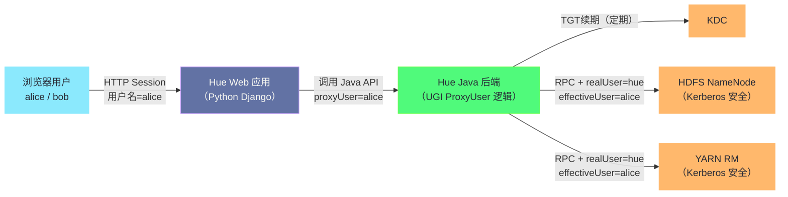
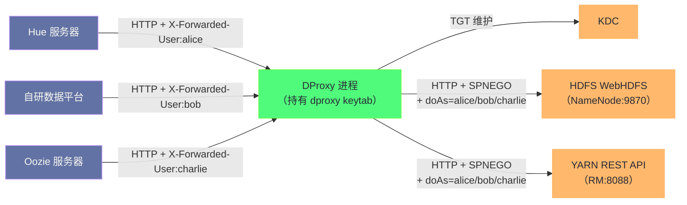
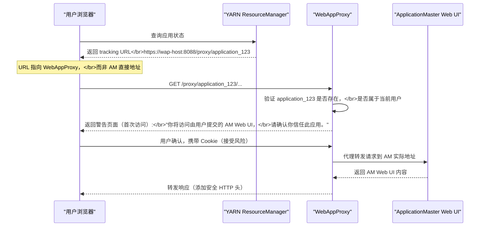
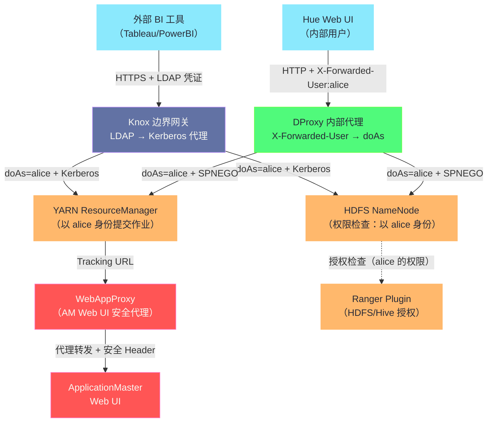

**摘要：**

在大数据平台的实际生产架构中，除了面向外部访问的 Knox 网关，往往还存在另一类代理服务——内部透明代理（DProxy）。它解决的是 Knox 未能覆盖的场景：集群内部的数据服务（如 Hue、Oozie、自研数据服务平台）需要以**最终用户身份**访问 HDFS/YARN，但这些服务本身运行在安全模式的集群内，拥有自己的 Kerberos 凭证，而最终用户（通过 Web 浏览器操作）并没有 Kerberos TGT。DProxy 的本质是：**在 HTTP 协议层承接用户的请求，在 Kerberos 层以服务账号代理身份（Proxy User / Impersonation）执行操作，同时通过 `doAs` 参数透传真实用户身份，使所有权限检查在 NameNode/ResourceManager 侧以真实用户身份进行**。本文深入剖析透明代理的设计哲学、Hadoop 代理用户机制的完整技术细节、YARN Web Application Proxy 的工作原理，以及生产中代理层安全防护的关键要点。

---

## 第 1 章 代理模式在大数据平台中的定位

### 1.1 三类代理的分工

在一个完整的企业级大数据平台中，代理服务通常分为三层，各有不同的定位：

**第一层：边界网关代理（Knox）**
- 部署位置：集群边界（Edge Node）
- 服务对象：集群外部的用户和应用（BI 工具、外部系统）
- 认证方式转换：外部 LDAP/JWT → 内部 Kerberos
- 核心价值：屏蔽 Kerberos 复杂性，统一外部入口

**第二层：内部透明代理（DProxy 类）**
- 部署位置：集群内部（或边界节点，可与 Knox 共存）
- 服务对象：集群内部的服务应用（Hue、Oozie、自研数据平台）
- 认证方式：服务账号持 keytab，通过 Hadoop Proxy User 代理最终用户
- 核心价值：让没有 Kerberos 凭证的最终用户，通过受信任的服务账号透明访问 Hadoop

**第三层：YARN Web Application Proxy（WebAppProxy）**
- 部署位置：集群内部（通常与 ResourceManager 同主机或独立部署）
- 服务对象：访问正在运行的 YARN 应用程序 Web UI（Spark UI、MR Job UI）
- 核心价值：防止恶意 ApplicationMaster 通过 Web UI 对用户发起 XSS/CSRF 等攻击
- 这是 Hadoop 官方原生提供的代理组件，详见本文第 5 章

### 1.2 为什么需要内部透明代理

设想一个典型的企业数据平台场景：用户通过 Hue（Hadoop Web UI 工具）浏览 HDFS 文件、提交 Hive 查询。

**Hue 的技术架构**：Hue 是一个 Python/Django Web 应用，运行在集群边界节点。它使用一个服务账号（`hue@EXAMPLE.COM`，有 keytab）向 HDFS 发起 WebHDFS 请求。

**问题一：用户身份的透传**。Hue 的 100 个并发用户都通过 Hue 的服务账号向 NameNode 发请求。从 NameNode 的视角看，所有请求都来自 `hue`，无法区分哪个是 alice 的操作、哪个是 bob 的操作，HDFS 文件权限控制完全失效（`hue` 账号如果是超级用户，所有用户都拥有超级用户权限；如果是普通账号，所有用户只能访问 `hue` 账号有权限的目录）。

**问题二：审计日志的失真**。HDFS 的审计日志记录的是 `hue` 账号的操作，而不是真实用户。当需要追查"是谁删除了这个文件"时，审计日志完全无用。

**问题三：Ranger 策略无法细粒度生效**。Ranger 基于用户/组决定权限，所有请求都以 `hue` 身份到达，只有 `hue` 账号的权限有意义，无法为 100 个不同用户配置差异化的数据访问策略。

内部透明代理（DProxy 模式）的引入，通过 Hadoop 的 Proxy User（代理用户）机制，让 Hue 的每个请求在 NameNode 侧以发起该请求的真实用户身份执行，从根本上解决上述三个问题。

---

## 第 2 章 Hadoop Proxy User 机制：技术核心

### 2.1 代理用户的设计来源与本质

Hadoop Proxy User（代理用户，又称 Superuser Impersonation）是 Hadoop 安全机制中的一个核心特性，最早在 Hadoop 1.x 时代就已存在，专门为 Oozie 这类需要代理提交任务的协调系统设计。

**它的本质是什么？** 代理用户机制允许一个经过 Kerberos 认证的"超级用户"（通常是服务账号，如 `oozie`、`hue`、`knox`），在向 NameNode/ResourceManager 发起请求时，通过附加参数（`doAs=alice`）声明"我要代理 alice 执行这个操作"。NameNode 在接到请求后：

1. 首先验证请求的 Kerberos 身份（`oozie@EXAMPLE.COM`）——确认请求确实来自 oozie 服务
2. 检查 oozie 是否被配置为允许代理 alice（通过 `hadoop.proxyuser.oozie.*` 配置）
3. 如果允许，以 alice 的身份执行操作，应用 alice 的文件权限，在审计日志中记录"alice 执行了该操作（通过 oozie 代理）"

**为什么不直接让服务账号持有所有用户的 keytab？** 这在技术上显然不可行（密钥管理灾难），也违背了最小权限原则。代理用户机制提供了一个优雅的中间路径：服务账号只需要一个 keytab，但可以合法地"代表"任意数量的用户行事，同时 NameNode 知道每次操作的真实主体是谁。

### 2.2 代理用户的配置详解

代理用户的配置位于 `core-site.xml`，采用 `hadoop.proxyuser.<proxyUser>.<property>` 的命名规范：

```xml
<!-- 允许 hue 服务账号代理用户，且必须从 hue 服务器发起 -->
<property>
    <name>hadoop.proxyuser.hue.hosts</name>
    <!-- 只允许从特定主机发起代理请求（推荐填写具体 FQDN，而不是 *） -->
    <value>hue-server.example.com</value>
</property>
<property>
    <name>hadoop.proxyuser.hue.users</name>
    <!-- 允许代理的用户列表（* 表示所有用户） -->
    <value>*</value>
</property>

<!-- 或者用 groups 替代 users，更具扩展性 -->
<property>
    <name>hadoop.proxyuser.hue.groups</name>
    <!-- 只允许代理属于这些组的用户 -->
    <value>hadoop-users,analysts,data-engineers</value>
</property>

<!-- Oozie 服务：通常需要代理所有用户 -->
<property>
    <name>hadoop.proxyuser.oozie.hosts</name>
    <value>oozie-server.example.com</value>
</property>
<property>
    <name>hadoop.proxyuser.oozie.groups</name>
    <value>*</value>
</property>

<!-- knox 网关代理 -->
<property>
    <name>hadoop.proxyuser.knox.hosts</name>
    <value>knox-host.example.com</value>
</property>
<property>
    <name>hadoop.proxyuser.knox.users</name>
    <value>*</value>
</property>
```

**`hosts` 配置的安全含义**：

`hadoop.proxyuser.hue.hosts` 指定了哪些主机的代理请求是被信任的。这个设计是防止 keytab 泄露后的二次防线：即使攻击者获取了 hue 的 keytab，如果他不是从 `hue-server.example.com` 发起请求，NameNode 也会拒绝代理操作。

> [!warning] 生产避坑：`hosts=*` 是高风险配置
> 许多管理员图省事将 `hadoop.proxyuser.hue.hosts` 设为 `*`，意味着任何机器都可以持 hue 的 keytab 发起代理请求。一旦 hue 的 keytab 文件泄露，攻击者可以从任意机器代理任意用户访问 HDFS，等同于获得了集群的超级用户权限。生产环境务必将 `hosts` 配置为具体的服务器 FQDN，或使用 IP 段限制。

### 2.3 代理用户在 WebHDFS 中的使用方式

对于 HTTP 协议的服务（WebHDFS、WebHCat、Oozie REST API），代理用户通过 URL 查询参数 `doAs` 传递：

```bash
# 以 hue 服务账号的 Kerberos 凭证，代理 alice 列出她的 HDFS 主目录
curl -k --negotiate -u : \
  "https://namenode:9870/webhdfs/v1/user/alice?op=LISTSTATUS&doAs=alice"

# 分解说明：
# --negotiate -u :    使用当前用户的 Kerberos TGT 进行 SPNEGO 认证
# doAs=alice          声明代理 alice 执行此操作
```

对于 Java RPC 协议的服务（HDFS NameNode RPC、YARN ResourceManager RPC），代理用户通过 `UserGroupInformation.createProxyUser()` 实现：

```java
// 服务端代码（如 Hue 的 Java 后端组件）
// 1. 以服务账号登录（使用 keytab）
UserGroupInformation serviceUGI = UserGroupInformation.loginUserFromKeytabAndReturnUGI(
    "hue/hue-server.example.com@EXAMPLE.COM",
    "/etc/security/keytabs/hue.service.keytab"
);

// 2. 基于服务账号，创建代理用户 UGI
// realUser=hue, proxyUser=alice
UserGroupInformation proxyUGI = UserGroupInformation.createProxyUser(
    "alice",           // 被代理的用户名
    serviceUGI         // 真实的（有 Kerberos 凭证的）用户 UGI
);

// 3. 在代理用户 UGI 的上下文中执行 HDFS 操作
// 向 NameNode 发起的 RPC 请求中，会携带：
//   realUser=hue/hue-server.example.com@EXAMPLE.COM（Kerberos 认证）
//   effectiveUser=alice（通过 RPC 头中的 ProxyUsers 字段传递）
proxyUGI.doAs((PrivilegedExceptionAction<Void>) () -> {
    FileSystem fs = FileSystem.get(conf);
    // 以下操作均以 alice 的身份执行
    FileStatus[] files = fs.listStatus(new Path("/user/alice"));
    return null;
});
```

**NameNode 侧的 RPC 头解析**：

在 Hadoop RPC 协议中，当代理用户发起请求时，RPC 连接头中携带了两个关键字段：
- `AuthProtocol.SASL`：通过 Kerberos 认证，确认 `realUser = hue/hue-server@EXAMPLE.COM`
- `UserGroupInformation.ProxyUsers`：`effectiveUser = alice`

NameNode 收到 RPC 请求后，提取 `realUser` 和 `effectiveUser`，验证 `realUser` 是否被允许代理 `effectiveUser`（通过 `hadoop.proxyuser.*` 配置），验证通过后以 `effectiveUser`（alice）的身份执行操作。

---

## 第 3 章 DProxy 的架构设计

### 3.1 DProxy 的角色定义

"DProxy" 这个名字在开源社区没有标准定义，在不同企业中有不同的具体实现，但它们共享同一类设计模式：

**DProxy = 数据平台内部的受信任 HTTP 反向代理，持有 Kerberos 凭证，通过 Proxy User 机制将来自多个上游服务的 HTTP 请求，以各自真实用户身份透明转发到 HDFS/YARN 等后端服务。**

它与 Knox 的核心区别：

| 对比维度 | Knox | DProxy |
|---------|------|--------|
| 服务对象 | 集群外部用户（跨越网络边界）| 集群内部服务（Hue、Oozie、自研平台）|
| 认证来源 | LDAP/JWT/SPNEGO | 信任上游服务设置的用户标识 Header |
| 安全级别 | 高（需要显式认证凭证）| 中（依赖上游服务的安全性，通常在受控内网）|
| URL 重写 | 完整的 URL 重写和响应改写 | 透明转发，最小干预 |
| 部署模式 | 独立进程（Edge Node）| 可嵌入服务进程，或独立部署 |
| 典型实现 | Apache Knox 开源项目 | 自研或基于 Nginx/Apache HttpComponents 定制 |

### 3.2 DProxy 的两种典型架构模式

**模式一：嵌入式代理（In-Process Proxy）**

代理逻辑直接嵌入上游服务（如 Hue）的进程中。Hue 在处理用户请求时，直接调用 Hadoop Java Client，通过 `createProxyUser()` 以用户身份访问 HDFS，无需独立的代理进程。



**优点**：
- 无额外网络跳转，延迟低
- 不需要维护独立的代理进程

**缺点**：
- 代理逻辑与业务逻辑耦合在同一进程，Kerberos keytab 需要分发给每个应用服务器
- 多个应用（Hue、自研平台、Oozie）各自维护 keytab，管理复杂

**模式二：独立代理进程（Standalone HTTP Proxy）**

将 Kerberos 认证和 `doAs` 转发逻辑独立成一个 HTTP 代理进程。上游服务只需在 HTTP 请求中设置一个信任 Header（如 `X-Forwarded-User: alice`），DProxy 识别这个 Header 后，用自己的 keytab 完成 Kerberos 认证，并在请求 NameNode/ResourceManager 时附加 `doAs=alice`。



**优点**：
- Kerberos keytab 只需维护一份（DProxy 专用账号的 keytab）
- 上游服务与 Kerberos 完全解耦，可以用任何语言编写
- 集中管理，便于监控和审计

**缺点**：
- 增加了一跳网络转发，延迟略高
- DProxy 成为单点，需要 HA 部署
- 安全依赖：上游服务到 DProxy 的通道必须受信任，否则任何人都可以通过设置 `X-Forwarded-User` 来冒充其他用户

### 3.3 X-Forwarded-User 信任机制的安全设计

独立代理模式的核心安全假设是：**DProxy 只接受来自受信任上游服务的请求**。如果任意客户端都能直接访问 DProxy 并设置 `X-Forwarded-User`，则任何人都可以冒充任意用户。

典型的安全加固手段：

**手段一：网络层隔离**。DProxy 绑定内网 IP，只接受来自特定子网（如内部服务网段 `10.0.1.0/24`）的请求，通过 iptables 或安全组规则拒绝所有外部请求。

**手段二：Mutual TLS（mTLS）**。DProxy 要求上游服务提供客户端证书，只有持有受信任 CA 签发证书的服务才能连接 DProxy。这适用于安全要求更高的场景。

**手段三：服务间 Token 验证**。上游服务在请求中附加一个内部 Token（HMAC 签名，用 DProxy 和上游服务共享的密钥计算），DProxy 验证 Token 有效后才处理请求。

```
安全层次建议：
┌─────────────────────────────────────────────────┐
│ 层次 1（必须）：网络层 ACL，只允许已知内部服务 IP │
├─────────────────────────────────────────────────┤
│ 层次 2（推荐）：HTTPS 加密（防止内网嗅探）        │
├─────────────────────────────────────────────────┤
│ 层次 3（高安全）：mTLS 客户端证书认证            │
└─────────────────────────────────────────────────┘
```

---

## 第 4 章 DProxy 的核心实现逻辑

### 4.1 Kerberos TGT 维护

DProxy 进程需要持续维持有效的 Kerberos TGT，才能在每次代理请求时完成 SPNEGO 认证。这与 Hadoop UGI 的 `checkTGTAndReloginFromKeytab` 机制本质相同：

```java
// DProxy 核心：Kerberos 凭证维护（伪代码）
public class DProxyServer {
    private UserGroupInformation dproxyUGI;
    
    // 启动时初始化
    public void initialize() throws IOException {
        Configuration conf = new Configuration();
        conf.set("hadoop.security.authentication", "kerberos");
        UserGroupInformation.setConfiguration(conf);
        
        // 从 keytab 登录
        UserGroupInformation.loginUserFromKeytab(
            "dproxy/dproxy-host.example.com@EXAMPLE.COM",
            "/etc/security/keytabs/dproxy.service.keytab"
        );
        dproxyUGI = UserGroupInformation.getLoginUser();
        
        // 启动 TGT 续期线程
        startTGTRenewalThread();
    }
    
    private void startTGTRenewalThread() {
        ScheduledExecutorService scheduler = Executors.newSingleThreadScheduledExecutor();
        scheduler.scheduleAtFixedRate(() -> {
            try {
                // 检查 TGT 剩余有效期，必要时重新 kinit
                dproxyUGI.checkTGTAndReloginFromKeytab();
            } catch (IOException e) {
                log.error("TGT renewal failed", e);
                // 告警：TGT 续期失败，后续所有代理请求将失败
            }
        }, 0, 1, TimeUnit.MINUTES);
    }
}
```

### 4.2 请求处理流程

```java
// DProxy 请求处理核心逻辑（伪代码）
public void handleRequest(HttpRequest inRequest, HttpResponse outResponse) throws Exception {
    // Step 1：提取并验证上游传来的真实用户名
    String realUser = inRequest.getHeader("X-Forwarded-User");
    if (realUser == null || realUser.isEmpty()) {
        outResponse.sendError(400, "X-Forwarded-User header is required");
        return;
    }
    
    // Step 2：验证请求来源（IP 白名单检查）
    String clientIP = getClientIP(inRequest);
    if (!trustedIpRanges.contains(clientIP)) {
        outResponse.sendError(403, "Request from untrusted source: " + clientIP);
        return;
    }
    
    // Step 3：构造代理用户 UGI
    // realUser=dproxy（持有 keytab），effectiveUser=alice（被代理的用户）
    UserGroupInformation proxyUGI = UserGroupInformation.createProxyUser(
        realUser, 
        dproxyUGI  // DProxy 服务账号的 UGI
    );
    
    // Step 4：在代理用户上下文中执行 HTTP 转发
    return proxyUGI.doAs((PrivilegedExceptionAction<Void>) () -> {
        // 构造目标 URL：在原始 URL 中追加 doAs 参数
        String targetUrl = buildTargetUrl(inRequest, realUser);
        
        // 使用 Kerberos SPNEGO 认证向后端服务发起 HTTP 请求
        // dproxyUGI 的 TGT 用于 SPNEGO，doAs=alice 传递真实用户身份
        HttpResponse backendResponse = executeWithKerberos(targetUrl, inRequest);
        
        // Step 5：将后端响应返回给上游服务（透明转发）
        copyResponse(backendResponse, outResponse);
        return null;
    });
}

private String buildTargetUrl(HttpRequest request, String realUser) {
    // 原始：GET /webhdfs/v1/user/alice?op=LISTSTATUS
    // 目标：GET http://namenode:9870/webhdfs/v1/user/alice?op=LISTSTATUS&doAs=alice
    String originalPath = request.getRequestURI();
    String originalQuery = request.getQueryString();
    
    StringBuilder targetUrl = new StringBuilder();
    targetUrl.append("http://").append(getBackendHost(request));
    targetUrl.append(originalPath);
    targetUrl.append("?").append(originalQuery);
    
    // 追加 doAs 参数（如果已存在则覆盖，防止上游注入恶意 doAs）
    if (!originalQuery.contains("doAs=")) {
        targetUrl.append("&doAs=").append(URLEncoder.encode(realUser, "UTF-8"));
    }
    
    return targetUrl.toString();
}
```

> [!warning] 生产避坑：防止上游注入恶意 doAs 参数
> 上游服务传来的请求中可能已经包含 `doAs` 参数（无论是 bug 还是恶意构造）。DProxy 在构造目标 URL 时，必须**移除上游请求中已有的 `doAs` 参数**，只使用从可信 Header（`X-Forwarded-User`）中提取的用户名来构造 `doAs`。否则，恶意上游可以通过在 URL 中设置 `doAs=hdfs` 来绕过访问控制，以 HDFS 超级用户身份执行操作。

### 4.3 DProxy 的 TGT 与 Delegation Token 的权衡

DProxy 每次代理请求都使用 Kerberos SPNEGO 进行认证，这意味着：
- 每次 HTTP 请求都需要一次 GSSAPI 握手（获取 Service Ticket，或复用已有的 ST）
- ST 通常缓存在 JVM 的 Kerberos 实现中，重复访问同一服务时复用缓存的 ST，开销较小

对于高并发场景（如大量 Hue 用户同时操作），DProxy 每秒可能需要处理数百个不同用户的请求。此时可以考虑优化：

**优化方案：预申请 Delegation Token 并缓存**

对于活跃用户，DProxy 可以在首次代理请求时，用 SPNEGO 认证向 NameNode 申请一个 Delegation Token（代表该用户），后续请求直接用 Delegation Token 认证，跳过 Kerberos SPNEGO 流程：

```
用户 alice 首次访问（DProxy 缓存中无 alice 的 Token）：
  1. DProxy 以 dproxy 账号 + doAs=alice 向 NameNode 请求：
     POST /webhdfs/v1/?op=GETDELEGATIONTOKEN&doAs=alice
  2. NameNode 返回：
     HDFS_DELEGATION_TOKEN{owner=alice, renewer=dproxy, ...}
  3. DProxy 将 Token 存储在缓存中：alice → Token（TTL = Token 有效期）

后续访问（缓存命中）：
  1. DProxy 从缓存取出 alice 的 Token
  2. 用 DIGEST-MD5（Token）认证，无需 SPNEGO
  3. 请求处理速度提升约 30-50ms（节省 Kerberos 握手时间）
```

这个方案的代价是增加了 Token 缓存的维护逻辑（过期刷新、Token 续期），以及缓存安全问题（Token 在缓存中泄露的风险）。在实际生产中需要根据性能需求和安全要求权衡取舍。

---

## 第 5 章 YARN Web Application Proxy：官方标准代理

### 5.1 为什么 YARN 需要 Web Application Proxy

YARN 的 ApplicationMaster（AM）提供了 Web UI 供用户实时查看任务进度（Spark UI、MapReduce Job UI）。这个 Web UI 的 URL 由 AM 自己提供，并注册到 ResourceManager。

**安全威胁**：如果 YARN 直接将 AM 的 Web UI URL 暴露给用户，可能面临以下攻击：

**威胁一：XSS（跨站脚本攻击）**。AM 是用户提交的代码，可以在 Web UI 页面中嵌入恶意 JavaScript。当用户（或运维人员）在浏览器中打开 AM Web UI 时，恶意脚本可能窃取该用户的浏览器 Cookie（包括 Kerberos Token 或 Knox JWT）。

**威胁二：CSRF（跨站请求伪造）**。AM Web UI 嵌入的恶意内容可能诱导用户的浏览器向其他 Hadoop 服务（如 RM、NameNode）发起伪造请求，利用用户的已认证 Session 做出危险操作。

**威胁三：内部网络地址探测**。AM Web UI 中的超链接可能指向集群内部的 IP 地址/端口，使外部用户得知集群的内部网络拓扑。

WebAppProxy 通过在 RM 和 AM Web UI 之间插入一个代理层来缓解这些威胁。

### 5.2 WebAppProxy 的工作流程



**WebAppProxy 的安全防护手段**：

1. **警告页面（First-time Warning）**：首次通过 WebAppProxy 访问某个 AM Web UI 时，WebAppProxy 展示一个安全警告页面，告知用户即将访问用户提交的应用内容，要求明确确认后才继续（通过设置一个 Cookie 标记确认状态）

2. **安全 HTTP 响应头注入**：WebAppProxy 在转发 AM Web UI 的 HTTP 响应时，自动注入以下安全响应头：
   ```
   X-Frame-Options: SAMEORIGIN       # 防止 clickjacking（页面被嵌入 iframe）
   X-Content-Type-Options: nosniff   # 防止 MIME 类型嗅探
   Content-Security-Policy: ...      # 限制页面可以加载的资源来源（Hadoop 3.x 新增）
   ```

3. **URL 隔离**：所有 AM Web UI 的 URL 都通过 WebAppProxy 的前缀（`/proxy/{applicationId}/`）访问，WebAppProxy 的 Cookie 与 AM 所在 DataNode 的 Cookie 完全隔离，AM 无法读取 WebAppProxy 域下的 Cookie

### 5.3 WebAppProxy 的部署模式

WebAppProxy 有两种部署模式，由 `yarn.web-proxy.address` 配置决定：

**嵌入模式（默认）**：WebAppProxy 嵌入在 ResourceManager 进程中，不需要单独部署。适合中小规模集群。

```xml
<!-- 不配置 yarn.web-proxy.address，则 WebAppProxy 嵌入 RM -->
<!-- 此时 tracking URL 直接使用 RM 地址 -->
<property>
    <name>yarn.resourcemanager.webapp.address</name>
    <value>rm-host.example.com:8088</value>
</property>
```

**独立模式**：WebAppProxy 作为独立进程部署，有自己的地址，适合大规模集群（RM 压力大时，将代理请求卸载到独立节点）：

```xml
<!-- 配置独立的 WebAppProxy 地址 -->
<property>
    <name>yarn.web-proxy.address</name>
    <value>wap-host.example.com:8088</value>
</property>

<!-- 启动独立 WebAppProxy 进程 -->
<!-- $HADOOP_YARN_HOME/sbin/yarn-daemon.sh start proxyserver -->
```

独立模式下，`yarn.resourcemanager.webapp.address` 返回的 Tracking URL 会指向 WebAppProxy 的地址而非 AM 的直接地址。

---

## 第 6 章 生产中的代理链路全景与监控

### 6.1 完整代理链路图

在一个完整的企业大数据平台中，一个外部用户请求的完整路径可能经过多个代理层：



### 6.2 代理链路的关键监控指标

代理服务是集群所有外部访问的必经之路，其健康状态直接影响所有用户的访问体验，必须建立完善的监控体系：

**DProxy 关键指标**：

| 指标 | 含义 | 告警阈值建议 |
|------|------|------------|
| `dproxy_tgt_remaining_seconds` | DProxy 的 TGT 剩余有效期 | < 1800 秒（30 分钟）告警 |
| `dproxy_request_rate` | 每秒代理请求数 | 突增 > 正常值的 3 倍 |
| `dproxy_proxy_user_unique_count` | 当前并发活跃代理用户数 | 异常增长 |
| `dproxy_backend_error_rate` | 后端服务返回 5xx 的比例 | > 1% 告警 |
| `dproxy_auth_failure_rate` | Kerberos 认证失败率 | > 0.1% 告警（可能 TGT 过期）|
| `dproxy_p99_latency_ms` | 99 分位端到端延迟 | > 500ms 告警 |

**TGT 过期是 DProxy 最常见的故障模式**，必须重点监控：

```bash
# 检查 DProxy 服务账号当前 TGT 状态
klist -c /tmp/krb5cc_dproxy 2>&1 | grep -E "Expires|Principal"

# 典型输出：
# Principal: dproxy/dproxy-host.example.com@EXAMPLE.COM
# Expires: Jan 15 20:00:00 2024

# 计算剩余有效期（秒）
EXPIRES=$(date -d "$(klist | grep 'Expires' | awk '{print $3, $4}')" +%s)
NOW=$(date +%s)
REMAINING=$((EXPIRES - NOW))
echo "TGT remaining: ${REMAINING} seconds"
```

### 6.3 常见故障排查

**故障一：DProxy 返回 403 Forbidden**

原因可能有两种：
1. `hadoop.proxyuser.dproxy.hosts` 中未配置 DProxy 所在主机 → 在所有 NameNode/RM 的 `core-site.xml` 中添加 DProxy 主机名，并刷新配置（`hdfs dfsadmin -refreshSuperUserGroupsConfiguration`）
2. `hadoop.proxyuser.dproxy.users` 或 `groups` 未包含被代理的用户 → 扩大代理用户范围

```bash
# 验证代理用户配置是否生效（不需要重启 NameNode）
hdfs dfsadmin -refreshSuperUserGroupsConfiguration
yarn rmadmin -refreshSuperUserGroupsConfiguration
```

**故障二：DProxy 返回 401 Unauthorized（SPNEGO 失败）**

排查步骤：
```bash
# 1. 检查 DProxy 当前 TGT 是否有效
klist

# 2. 尝试手动 kinit（验证 keytab 是否正确）
kinit -kt /etc/security/keytabs/dproxy.service.keytab \
    dproxy/dproxy-host.example.com@EXAMPLE.COM

# 3. 验证 DProxy 能否访问目标服务（排除网络/防火墙问题）
curl -v --negotiate -u: http://namenode:9870/webhdfs/v1/?op=LISTSTATUS

# 4. 检查时钟偏差（DProxy 节点与 KDC 之间）
ntpq -p
```

**故障三：用户反馈数据权限错误（被代理的用户名映射不正确）**

可能原因：`X-Forwarded-User` Header 中传递的用户名与 HDFS/Ranger 中的用户名不一致（如大小写差异、AD 域名后缀未去除）。

```bash
# 检查 HDFS 中该用户的实际可访问目录
hdfs dfs -ls /user/  # 查看是否有该用户目录
# 或通过 Ranger Admin UI 模拟该用户的访问，查看策略匹配结果
```

---

## 小结

本文系统梳理了大数据平台中"代理"这一通用模式的三个具体实例：

- **Hadoop Proxy User（代理用户机制）**：平台内的所有代理模式的技术基础。服务账号持 Kerberos keytab，通过 `doAs` 参数以真实用户身份执行操作，权限检查和审计日志均以真实用户为准，解决了"服务账号统一访问但权限细粒度控制"的根本矛盾
- **DProxy（内部透明代理）**：集群内部服务（Hue、Oozie、自研平台）的 Kerberos 统一承接点，有嵌入式和独立进程两种部署模式，安全边界依赖网络层 ACL + 信任 Header 的组合保护
- **YARN WebAppProxy**：Hadoop 官方内置的 AM Web UI 安全代理，通过警告页面、安全 HTTP 头、Cookie 隔离三层机制防止恶意 AM 发起 Web 攻击

代理层是大数据平台安全架构中最容易被忽视却最关键的环节：它既是所有用户访问的必经之路，也是权限体系（Ranger）真正发挥作用的前提——只有 `doAs` 正确传递了真实用户身份，Ranger 的细粒度策略才能真正落地。

下一篇 [[07 YARN ATS 与 AHS 作业历史日志服务全解析]] 将从另一个角度切入集群安全：谁有权限查看作业的历史日志，以及日志数据的完整存储链路。
