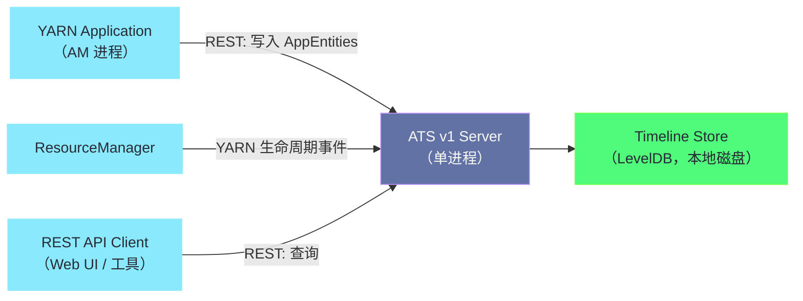
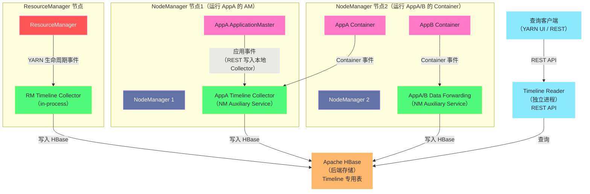
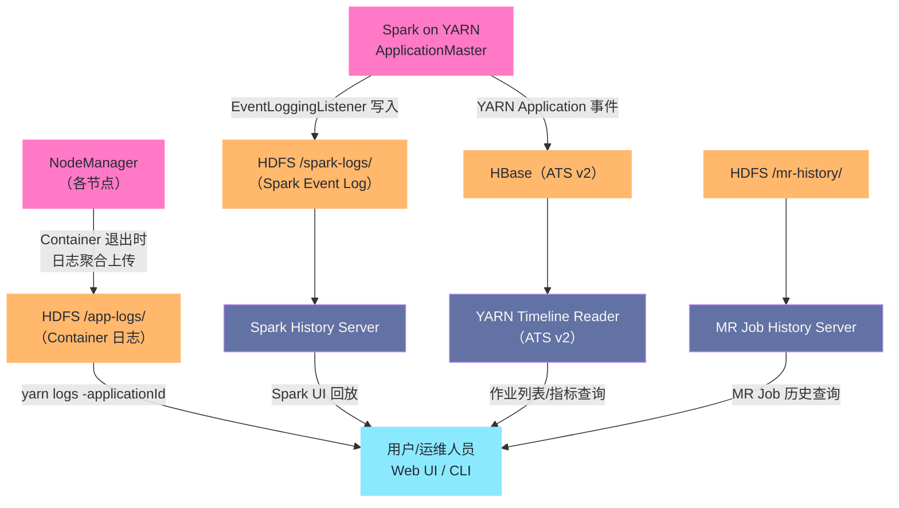

**摘要：**

当一个 Spark 或 MapReduce 作业执行完毕后，它的运行轨迹存储在哪里？谁能查看？存多久？这些问题背后涉及 YARN 生态中两个常被混淆的服务：**Application History Server（AHS）** 和 **Timeline Service（ATS）**。AHS 是 MapReduce 时代的历史遗留，专门服务于 MapReduce 作业历史；ATS 是 YARN 层面的通用时间线服务，v1 架构存在严重的单点扩展性瓶颈，v2 架构通过分布式 Collector + HBase 存储彻底重构，并引入了 Flow 概念来聚合多 Application 的逻辑任务。与此同时，**Log Aggregation（日志聚合）**服务将各 NodeManager 上的容器日志汇聚到 HDFS，是整个日志查看体系的数据底座。本文系统梳理这三个服务的架构演进、数据存储机制、访问鉴权方式，以及生产中最常见的日志丢失、查询慢等问题的根因与解决方法。

---

## 第 1 章 YARN 作业历史日志体系概览

### 1.1 问题背景：作业跑完了，数据去哪里了

一个 YARN 作业在运行期间，其状态信息存储在 ResourceManager（RM）的内存中：ApplicationMaster（AM）的状态、Container 的分配情况、作业进度等。但 RM 的内存是有限的，也是易失的——一旦作业完成，RM 很快就会从内存中清除这些信息（可配置保留窗口，通过 `yarn.resourcemanager.max-completed-applications` 控制，默认 10000 个应用）；RM 重启后内存数据全部丢失。

这就产生了三类持久化需求：

**需求一：作业结构性元数据**。任务的 DAG 结构、每个 Stage 的耗时、Task 的调度延迟、Shuffle 数据量……这类结构化的数据是事后分析作业性能瓶颈的关键，必须持久化，且需要支持复杂查询（"找出过去一周执行时间超过 2 小时的 Hive 作业"）。

**需求二：容器日志（stdout/stderr）**。每个 Container 在 NodeManager 上运行时会产生 stdout、stderr 以及 ApplicationMaster 的业务日志。这些日志分散在集群各节点，作业结束后如果不及时聚合，节点重启或磁盘清理就会永久丢失。

**需求三：Spark/Tez 引擎级事件**。Spark 作业有自己的 Event Log（记录 SparkContext 事件、Stage、Task 级别的详细信息），Tez 同样有自己的 History 事件。这些是框架层面的数据，粒度比 YARN 的 Application 级别更细。

YARN 的历史日志体系由以下服务共同承担这三类需求：

| 服务 | 主要职责 | 数据类型 | 存储位置 |
|------|---------|---------|---------|
| **Log Aggregation** | 汇聚容器日志 | stdout/stderr/业务日志 | HDFS `/app-logs/` |
| **MapReduce Job History Server（AHS）** | MR 作业历史查询 | MR Job 结构化元数据 | HDFS 历史目录 |
| **YARN Timeline Service v1（ATS v1）** | 通用应用时间线 | YARN Application 事件 | LevelDB（本地磁盘）|
| **YARN Timeline Service v2（ATS v2）** | 通用 + Flow 聚合 | YARN + 框架事件 + 指标 | Apache HBase |
| **Spark History Server（SHS）** | Spark 作业回放 | Spark Event Log | HDFS 或云存储 |

这五个服务并非互斥关系，在生产集群中通常同时存在，各司其职，形成完整的作业历史体系。

### 1.2 混淆点梳理：AHS、ATS、SHS 到底是什么关系

这是运维和开发人员最容易搞混的地方，一次性梳理清楚：

**AHS（Application History Server）** 是 YARN 早期架构的历史遗留概念，在 Hadoop 2.x 的文档和代码中有时与 ATS v1 混用。严格来说，AHS 在代码层面是 `yarn-application-history-store` 模块，是 Timeline Service 的早期接口。现代语境下 AHS 通常特指 **MapReduce Job History Server**（`mapreduce.jobhistory.address` 配置项），一个专门服务 MR 作业历史数据的服务进程。

**ATS（Application Timeline Server/Service）** 特指 YARN 的 Timeline Service，有 v1、v1.5、v2 三个版本。ATS 是 YARN 框架层面的通用事件存储，任何 YARN 应用都可以向 ATS 写入自定义事件，不限于 MR。

**SHS（Spark History Server）** 完全独立于 YARN 的 ATS/AHS，是 Spark 自带的历史查询服务。SHS 读取的是 Spark ApplicationMaster 写入 HDFS 的 Event Log 文件（JSON 格式的事件流），与 ATS 互相独立。

**关系总结**：

```
YARN 历史体系（作业结构元数据）：
  MR 作业 → MapReduce Job History Server（AHS/MR-JHS）
  所有 YARN 应用 → Timeline Service（ATS v1/v2）

容器日志体系：
  所有 YARN 应用的容器日志 → Log Aggregation → HDFS
  日志查看：yarn logs -applicationId <id>

引擎级历史（细粒度事件）：
  Spark 作业 → Spark Event Log（HDFS）→ Spark History Server（SHS）
  Tez 作业 → ATS v2（Tez 直接写入 ATS）
```

---

## 第 2 章 Log Aggregation：日志体系的数据底座

### 2.1 Log Aggregation 的工作原理

**是什么**：Log Aggregation 是 YARN NodeManager 提供的一项服务，在应用程序完成（或容器退出）后，将该节点上所有属于该应用的容器日志文件汇聚（合并）成一个文件，上传到 HDFS 指定目录。

**为什么出现**：没有 Log Aggregation 时，容器日志散落在各个 NodeManager 节点的本地磁盘（`yarn.nodemanager.log-dirs` 配置的路径）。要查看某个作业的日志，需要登录每一台运行过该作业 Container 的节点，逐一查找对应的日志目录，极为不便。更严重的是，节点的日志目录会因磁盘空间不足被自动清理，日志丢失风险极高。

**不这样会怎样**：日志散落在数十上百台节点，无法集中查看；节点故障时日志永久丢失；无法基于日志做历史分析或故障回溯。

**在 YARN 中如何落地**：

```xml
<!-- yarn-site.xml：开启日志聚合 -->
<property>
    <name>yarn.log-aggregation-enable</name>
    <value>true</value>
</property>

<!-- 聚合日志在 HDFS 上的根目录 -->
<property>
    <name>yarn.nodemanager.remote-app-log-dir</name>
    <value>/app-logs</value>
</property>

<!-- HDFS 上的日志目录后缀（区分不同集群/用途）-->
<property>
    <name>yarn.nodemanager.remote-app-log-dir-suffix</name>
    <value>logs</value>
</property>
<!-- 最终存储路径：/app-logs/{username}/logs/{applicationId}/{nodeId}_{port} -->

<!-- 日志保留时长（秒）：-1 表示永不删除，单位秒 -->
<property>
    <name>yarn.log-aggregation.retain-seconds</name>
    <value>604800</value>  <!-- 7 天 -->
</property>

<!-- 日志检查间隔（秒）：多久检查一次过期日志并删除 -->
<property>
    <name>yarn.log-aggregation.retain-check-interval-seconds</name>
    <value>3600</value>  <!-- 每小时检查一次 -->
</property>
```

### 2.2 日志聚合的触发时机与文件格式

**触发时机**：
1. **应用完成时**：AM 向 RM 注册应用完成（`ApplicationState.FINISHED/FAILED/KILLED`）后，RM 通知各 NM 开始聚合该应用的日志
2. **Container 退出时**（如果配置了 `yarn.nodemanager.log-aggregation.roll-monitoring-interval-seconds`）：Container 退出后立即触发日志上传，不等待整个应用结束

**HDFS 上的日志文件结构**：

```
/app-logs/
  └── alice/                           # 提交作业的用户名
      └── logs/
          └── application_1705000000_0001/
              ├── node01.example.com_45678   # 每个 NodeManager 一个文件
              ├── node02.example.com_45679   # （包含该 NM 上所有 Container 的日志）
              └── node03.example.com_45680
```

每个 NM 上传的日志文件是一个**自定义二进制格式**（非普通文本），使用 `LogReader` 解析。文件内部按 ContainerId 分段，每段包含：

```
Container: container_1705000000_0001_01_000001
LogType: stderr
Log Upload Time: Mon Jan 15 10:30:00 CST 2024
LogLength: 1234
Log Contents:
[实际日志内容]
```

**查看聚合日志的方式**：

```bash
# 方式一：yarn logs 命令（自动处理解析、权限验证）
yarn logs -applicationId application_1705000000_0001

# 查看特定容器的日志
yarn logs -applicationId application_1705000000_0001 \
    -containerId container_1705000000_0001_01_000001

# 查看特定类型的日志（stdout/stderr/syslog）
yarn logs -applicationId application_1705000000_0001 \
    -log_files stderr

# 方式二：直接读取 HDFS 文件（需要知道确切路径）
hdfs dfs -cat /app-logs/alice/logs/application_1705000000_0001/node01.example.com_45678
```

### 2.3 Log Aggregation 的安全与权限

**谁能看到谁的日志？** 这是生产中经常遇到的权限问题。Log Aggregation 的 HDFS 目录权限配置决定了日志可见性：

默认情况下，`/app-logs/{username}/logs/` 目录的权限是 `750`（所有者可读写，同组可读，其他人无权限）。这意味着：
- 作业提交用户 alice 可以看自己的日志
- alice 所在的 group 成员也可以看（如果 group 权限允许）
- 其他人无权访问（包括 YARN 管理员，除非是 HDFS 超级用户）

**生产常见问题：运维人员无法查看普通用户的日志**

解决方案一：为运维账号设置 HDFS ACL

```bash
# 为 ops-team 组的成员添加对所有用户 app-logs 的读取权限
hdfs dfs -setfacl -m group:ops-team:r-x /app-logs
hdfs dfs -setfacl -m default:group:ops-team:r-x /app-logs
# 递归设置已有的子目录
hdfs dfs -setfacl -R -m group:ops-team:r-x /app-logs
```

解决方案二：在 YARN 中配置日志聚合目录全局可读

```xml
<property>
    <name>yarn.nodemanager.remote-app-log-dir.permissions</name>
    <value>775</value>  <!-- 允许组可读写，其他人可读 -->
</property>
```

解决方案三：通过 Ranger 对 HDFS 的 `/app-logs/` 目录配置 Tag Policy，允许特定角色读取。

---

## 第 3 章 MapReduce Job History Server（AHS）

### 3.1 MR-JHS 的定位与职责

MapReduce Job History Server（通常简称 MR-JHS 或 Job History Server，部分文档用 AHS 指代）是专门服务 MapReduce 作业历史数据的独立服务进程，提供：

- 历史 MR 作业的查询 Web UI（`http://historyserver:19888`）
- REST API 查询接口（`/ws/v1/history/mapreduce/jobs`）
- 作业配置、Counter 值、任务列表、Task Attempt 详情

**数据来源**：MR ApplicationMaster 在运行过程中持续将 Job 事件（task start、task finish、reduce shuffle start 等）写入 HDFS 的 `intermediate-done-dir`（中间目录）。作业完成后，MR-JHS 的后台线程将完成的作业历史文件从中间目录**移动**到 `done-dir`（最终目录）并做整理。

```xml
<!-- mapred-site.xml：MR Job History Server 配置 -->

<!-- MR-JHS 服务地址 -->
<property>
    <name>mapreduce.jobhistory.address</name>
    <value>historyserver.example.com:10020</value>
</property>

<!-- MR-JHS Web UI 地址 -->
<property>
    <name>mapreduce.jobhistory.webapp.address</name>
    <value>historyserver.example.com:19888</value>
</property>

<!-- 作业运行中的中间历史文件目录（HDFS）-->
<property>
    <name>mapreduce.jobhistory.intermediate-done-dir</name>
    <value>/mr-history/tmp</value>
</property>

<!-- 完成作业的最终历史文件目录（HDFS）-->
<property>
    <name>mapreduce.jobhistory.done-dir</name>
    <value>/mr-history/done</value>
</property>

<!-- 历史文件保留时长：默认 1 天（86400 秒）-->
<property>
    <name>mapreduce.jobhistory.max-age-ms</name>
    <value>604800000</value>  <!-- 7 天，单位毫秒 -->
</property>
```

### 3.2 HDFS 上的历史文件目录结构

MR-JHS 在 `done-dir` 中按时间分层存储，目录结构为：

```
/mr-history/done/
  └── 2024/
      └── 01/
          └── 15/
              └── 000000/                    # 每桶最多 999 个文件
                  ├── job_1705000000_0001-...-alice-WordCount.jhist   # 历史文件
                  ├── job_1705000000_0001_conf.xml                    # 作业配置快照
                  └── job_1705000000_0002-...-bob-HiveQuery.jhist
```

**`.jhist` 文件**是 Avro 格式（二进制序列化），包含作业的完整事件序列：Job Started、Task Started、Task Finished、Job Finished 等。MR-JHS 解析这些文件提供 UI 查询。

**安全模式下的 MR-JHS 访问**：

MR AM 写入历史文件时，历史目录的权限配置至关重要：

```xml
<!-- intermediate-done-dir 需要对所有用户可写（AM 以用户身份写入）-->
<!-- 通常权限为 1777（sticky bit，防止用户删除别人的文件）-->
```

生产中频繁出现的"MR 作业完成但 Job History 查不到"问题，几乎都源于：
1. MR AM 写入 `intermediate-done-dir` 失败（权限问题或目录不存在）
2. MR-JHS 移动文件时权限不足（MR-JHS 进程的 Principal 需要有操作该目录的权限）

---

## 第 4 章 YARN Timeline Service v1：通用时间线服务的第一代

### 4.1 ATS v1 的设计目标与架构

ATS v1（YARN Timeline Service version 1）在 Hadoop 2.4 引入，是 YARN 层面通用的应用时间线服务。它的目标是为**所有 YARN 应用**（不仅仅是 MR）提供一个标准化的事件存储和查询接口，Tez、Spark 等框架都可以向 ATS 写入自定义事件。

**ATS v1 的架构**非常简单：



**ATS v1 的核心数据模型——TimelineEntity**：

```json
{
  "entityType": "TEZ_DAG_ID",            // 实体类型（框架自定义）
  "entity": "dag_1705000000_0001_1",     // 实体 ID（唯一标识）
  "starttime": 1705280400000,            // 开始时间戳（毫秒）
  "events": [                            // 事件列表（时间有序）
    {
      "timestamp": 1705280400000,
      "eventtype": "DAG_STARTED",
      "eventinfo": {"numVertices": 5, "dagName": "select count(*)"}
    },
    {
      "timestamp": 1705283400000,
      "eventtype": "DAG_FINISHED",
      "eventinfo": {"timeTaken": 3000000, "status": "SUCCEEDED"}
    }
  ],
  "primaryfilters": {                    // 主过滤字段（用于高效查询）
    "applicationId": ["application_1705000000_0001"],
    "user": ["alice"]
  },
  "otherinfo": {                         // 其他非过滤信息（JSON KV）
    "diagnostics": "",
    "counters": {...}
  }
}
```

### 4.2 ATS v1 的存储：LevelDB

ATS v1 使用 **LevelDB**（Google 开发的嵌入式键值存储库，LSM 树结构）作为本地磁盘存储，存储路径由 `yarn.timeline-service.leveldb-timeline-store.path` 配置（默认 `${hadoop.tmp.dir}/yarn/timeline`）。

**LevelDB 选型的背后考量**：v1 时代的设计者选择 LevelDB，是因为它：
- 嵌入式，无需单独部署存储服务，降低运维复杂度
- LSM 树写入速度快，适合事件流的顺序写入
- 支持范围查询，可以按时间范围查找事件

但这个选择也带来了 v1 最根本的**扩展性瓶颈**：

**瓶颈一：单写单读，无法水平扩展**。ATS v1 是单个进程，所有 YARN 应用的事件写入都汇聚到这一个节点，成为写入瓶颈。当集群规模增大（数千个并发应用）时，ATS v1 的写入延迟急剧增加，最终导致应用的 AM 写入 ATS 超时，影响应用性能。

**瓶颈二：本地磁盘存储无法线性扩展**。历史数据随时间线性增长，单节点磁盘容量有限，且 LevelDB 不支持分片。

**瓶颈三：单点故障**。ATS v1 节点宕机，所有历史事件查询均不可用（写入缓冲在 AM 内存，可能丢失）。

这些瓶颈直接推动了 ATS v2 的设计。

### 4.3 ATS v1 的访问控制

ATS v1 通过 `yarn-site.xml` 中的配置控制访问权限：

```xml
<!-- 开启 Timeline Service 鉴权 -->
<property>
    <name>yarn.timeline-service.http-authentication.type</name>
    <value>kerberos</value>  <!-- 或 simple -->
</property>

<!-- 允许读取 Timeline 数据的用户/组（Whitelist）-->
<property>
    <name>yarn.timeline-service.read-acls</name>
    <value>*</value>  <!-- * 表示所有用户都可读；生产中建议设为特定组 -->
</property>

<!-- 管理员白名单（可以查看任意用户的 Timeline 数据）-->
<property>
    <name>yarn.admin.acl</name>
    <value>yarn-admins</value>
</property>
```

> [!note] 设计哲学：ATS v1 的 ACL 是粗粒度的
> ATS v1 的 ACL 只有两个维度：全局读取白名单和管理员。无法做到"alice 只能看自己的作业历史，bob 只能看 finance 队列的作业"。这种粗粒度的 ACL 在 v2 中得到了改进（Entity 级别的 ACL 支持），但 v2 的 ACL 支持在撰写本文时仍处于演进中。

---

## 第 5 章 YARN Timeline Service v2：分布式重构

### 5.1 v2 的设计动机：从三个根本缺陷出发

ATS v2 的设计从 v1 的三个根本缺陷出发，做了彻底的架构重构：

**缺陷一→解决：单写瓶颈 → 分布式 Collector**

v2 的核心架构变革是**将写入（Collection）与读取（Serving）分离**：

- 每个 YARN 应用有一个专属的 **Timeline Collector**（时间线收集器），作为 NodeManager 的 Auxiliary Service（辅助服务）运行在 AM 所在的节点上
- AM 只向本地节点的 Collector 写入数据，无需跨网络写入中心节点
- ResourceManager 有自己专属的 Collector，只写入 YARN 级别的生命周期事件
- 独立的 **Timeline Reader** 进程负责响应查询请求

这使得写入压力随集群规模线性分摊，彻底解决了单写瓶颈。

**缺陷二→解决：单节点存储 → Apache HBase**

v2 选择 Apache HBase 作为后端存储，因为 HBase 天然支持：
- 水平分片（Region Split），随数据量增长线性扩展
- 低写入延迟（LSM 树结构，写优化）
- 丰富的 Row Key 设计能力，支持复杂查询模式
- 与 Hadoop 生态无缝集成（存储在 HDFS 之上）

**缺陷三→解决：Application 粒度 → Flow 粒度**

v2 引入了 **Flow** 的概念：多个 YARN Application 可以归属于同一个 Flow（逻辑工作流），Flow 中的多次运行称为 **Flow Run**。

这个设计来自真实的业务需求：一个 Oozie Workflow 可能包含多个 MR/Tez Application，它们共同完成一个业务逻辑单元；Spark Structured Streaming 的每次 micro-batch 是一个独立的 YARN Application，但它们都属于同一个流式作业。v2 允许对 Flow 级别进行聚合查询（如"这个 ETL 工作流的所有 Application 总共消耗了多少 CPU-hours？"）。

### 5.2 ATS v2 的完整架构



### 5.3 HBase 表设计：RowKey 的工程哲学

ATS v2 在 HBase 中设计了多张表，核心表是 `timelineservice.app_flow`（存储 Application 到 Flow 的映射）和 `timelineservice.application`（存储 Application 级别的实体信息）以及 `timelineservice.entity`（存储通用实体）。

以 `timelineservice.application` 表为例，其 RowKey 设计为：

```
RowKey = Reversed(ClusterId) + Reversed(TimestampInSeconds) + UserId + FlowName + FlowRunId + AppId
```

**为什么要 Reverse（反转）ClusterId 和 Timestamp？**

HBase 的数据按 RowKey 字典序排列，并按 Region 分片。如果直接用递增的时间戳作为 RowKey 前缀，**所有新写入的数据都会聚集到最后一个 Region**（HBase 的 Region 热点问题），导致大部分写入压力集中在一台 RegionServer，完全无法利用 HBase 的分布式优势。

反转时间戳后，时间戳从大到小变为 RowKey 从小到大的顺序，**最新的数据分布在最小的 RowKey 范围**。配合预分区（Pre-Split），新数据会均匀分散到各个 Region，避免热点。同时，反转时间戳使得最新的数据在 scan 时最先出现，符合"最近的作业历史最常被查"的访问模式。

> [!info] 核心概念：HBase Region 热点问题
> 在 HBase 中，Region 是数据分片的基本单元，每个 Region 由一台 RegionServer 负责。如果 RowKey 设计导致大量写入集中到同一个 Region（如顺序递增的 ID 或时间戳前缀），该 Region 所在的 RegionServer 会成为写入瓶颈，即使其他 RegionServer 空闲。RowKey 设计是 HBase 工程中最关键的决策之一，ATS v2 通过反转时间戳和预分区来解决这个问题。

### 5.4 Flow 与 Flow Run 的数据模型

ATS v2 的 Flow 数据模型通过三个层次的实体描述 YARN 工作流：

```
Flow（逻辑工作流）
  ├── 标识：clusterId + userId + flowName
  └── Flow Run（某次执行）
        ├── 标识：clusterId + userId + flowName + flowRunId
        ├── 聚合指标：startTime, finishTime, CPU-ms, Memory-ms, ...
        └── Application（单个 YARN App）
              ├── 标识：appId
              └── Entity（框架自定义实体）
                    ├── Tez DAG/Vertex/Task
                    ├── MR Job/Task/TaskAttempt
                    └── Spark Job/Stage/Task
```

**应用通过 YARN 提交时如何关联 Flow**？

YARN 客户端在提交 Application 时，在 `ApplicationSubmissionContext` 中设置三个关键属性：

```java
// Spark on YARN 的提交代码示例
ApplicationSubmissionContext appContext = ...;

// 这三个属性会被 AM 传递给 Timeline Collector
Map<String, String> tags = new HashMap<>();
tags.put(TimelineUtils.FLOW_NAME_TAG_PREFIX, "daily-etl-pipeline");  // Flow 名称
tags.put(TimelineUtils.FLOW_VERSION_TAG_PREFIX, "v2.1");              // Flow 版本
tags.put(TimelineUtils.FLOW_RUN_ID_TAG_PREFIX, "1705280400000");      // Flow Run ID

appContext.setApplicationTags(new HashSet<>(tags.values()));
```

### 5.5 ATS v2 的 Kerberos 配置

ATS v2 在 Kerberos 安全集群中需要配置以下 Principal：

```xml
<!-- yarn-site.xml：ATS v2 安全配置 -->

<!-- Timeline Service 的 Kerberos 主体 -->
<property>
    <name>yarn.timeline-service.principal</name>
    <value>yarn/_HOST@EXAMPLE.COM</value>
</property>

<property>
    <name>yarn.timeline-service.keytab</name>
    <value>/etc/security/keytabs/yarn.service.keytab</value>
</property>

<!-- Timeline Reader 的 HTTP 认证（SPNEGO）-->
<property>
    <name>yarn.timeline-service.http-authentication.type</name>
    <value>kerberos</value>
</property>

<!-- ATS 与 HBase 通信的 Kerberos 配置 -->
<property>
    <name>yarn.timeline-service.hbase.configuration.file</name>
    <value>file:///etc/hadoop/conf/hbase-ats-site.xml</value>
</property>
```

HBase 侧需要为 ATS 创建专用的命名空间和表，并设置权限：

```bash
# 在 HBase shell 中：
# 创建 ATS 专用命名空间
create_namespace 'timelineservice'

# 授权 yarn 账号对 timelineservice 命名空间的读写权限
grant 'yarn', 'RWCA', '@timelineservice'

# ATS 服务启动时自动创建所需的 HBase 表（通过 create_tables.rb 脚本）
# 或手动执行：
hbase org.apache.hadoop.yarn.server.timelineservice.storage.TimelineSchemaCreator \
    -create
```

---

## 第 6 章 Spark History Server：引擎级历史的独立实现

### 6.1 Spark History Server 与 ATS 的关系

Spark History Server（SHS）是完全独立于 YARN ATS 的服务，它读取的是 Spark 自己的 **Event Log** 文件。理解这个区别非常重要：

- **ATS**：YARN 框架级别，记录 Application 生命周期事件（app submitted/started/finished），粒度是 YARN Application
- **SHS**：Spark 引擎级别，记录 SparkContext 内部所有事件（Job/Stage/Task start/end、executor add/remove、RDD 血缘等），粒度是 Spark Job/Stage/Task

两者互补，不可替代：要分析 Spark 作业的调度性能（某个 Stage 为什么慢），必须看 SHS；要分析 YARN 层面的资源分配（Container 申请等待了多久），需要看 ATS。

### 6.2 Spark Event Log 的写入与存储

**Event Log 的写入**：Spark 的 `EventLoggingListener` 在 SparkContext 初始化时注册，它监听 SparkContext 发出的所有事件，并以 JSON 格式逐行追加写入 Event Log 文件（每行一个事件 JSON）：

```json
{"Event":"SparkListenerApplicationStart","App Name":"Spark Pi","App ID":"application_1705000000_0001","Timestamp":1705280400000,"User":"alice"}
{"Event":"SparkListenerJobStart","Job ID":0,"Submission Time":1705280401000,...}
{"Event":"SparkListenerStageSubmitted","Stage Info":{"Stage ID":0,"Stage Name":"count at SparkPi.scala:34",...}}
{"Event":"SparkListenerTaskEnd","Stage ID":0,"Task Info":{"Task ID":1,"Executor ID":"1","Duration":1234,...}}
```

**存储配置**：

```
spark.eventLog.enabled = true
spark.eventLog.dir = hdfs:///spark-logs          # Event Log 文件存储目录
spark.eventLog.compress = true                    # 压缩 Event Log（生产必开）
spark.eventLog.compression.codec = zstd          # 推荐 zstd（Spark 3.x）
```

**Event Log 文件命名**：

```
/spark-logs/
  ├── application_1705000000_0001                 # 作业进行中（文件后没有 .inprogress 也没有扩展名）
  ├── application_1705000000_0001.zstd            # 作业完成后（添加压缩格式后缀）
  └── application_1705000000_0001.zstd.inprogress # 作业进行中（新版本 Spark）
```

> [!warning] 生产避坑：Event Log 目录的权限与清理策略
> `/spark-logs/` 目录通常需要所有用户可写（权限 `1777`），因为每个 Spark 应用的 AM 需要在此创建 Event Log 文件。同时，这个目录会随时间急速增长（一个繁忙的 Spark 集群每天可产生数 GB 的 Event Log）。必须配置定期清理策略：
> 
> 方案一：SHS 内置的清理（`spark.history.fs.cleaner.enabled=true`，配合 `spark.history.fs.cleaner.maxAge`）
> 方案二：独立的 HDFS 清理脚本（crontab 定期删除超过指定天数的文件）
> 
> 注意：如果 Event Log 文件以 `.inprogress` 结尾，说明作业可能仍在运行或异常退出。SHS 会标记这类文件为"仍在运行"，但如果作业实际已经完结（如 AM 崩溃），SHS 无法自动感知，需要手动移除 `.inprogress` 后缀或重命名。

### 6.3 Spark History Server 的安全配置

在 Kerberos 安全集群中，SHS 需要：

```
spark.history.kerberos.enabled = true
spark.history.kerberos.principal = spark/history-host.example.com@EXAMPLE.COM
spark.history.kerberos.keytab = /etc/security/keytabs/spark.service.keytab
```

SHS 的 Web UI 访问控制：

```
# 允许查看 Spark UI 的用户/组（* 表示所有人）
spark.history.ui.acls.enable = true
spark.history.ui.admin.acls = spark-admins
spark.history.ui.admin.acls.groups = yarn-admins

# 注意：单个 Application 的 UI 访问权限
# 由 SparkContext 提交时的配置决定（spark.ui.view.acls）
```

**每个 Spark 应用的 UI 访问控制**：即使 SHS 整体开启了认证，每个应用的 UI 默认只对提交该应用的用户和 admin 可见。如果希望特定组的成员也能查看所有应用的 UI，可以配置：

```
spark.ui.view.acls.groups = data-platform-team
```

---

## 第 7 章 作业历史的完整数据链路与生产问题排查

### 7.1 完整数据链路

将所有服务整合，一个 Spark on YARN 作业的历史数据完整链路如下：



### 7.2 生产问题排查手册

**问题一：`yarn logs` 命令提示 "Logs not available"**

这是最常见的问题，排查步骤：

```bash
# Step 1：确认 Log Aggregation 是否已完成
yarn application -status <appId> | grep "Final-State"
# 如果 Final-State=UNDEFINED，作业可能仍在运行

# Step 2：检查 Log Aggregation 状态
yarn logs -applicationId <appId> -list_nodes
# 如果输出为空，说明聚合尚未完成或失败

# Step 3：检查 HDFS 上是否有日志文件
hdfs dfs -ls /app-logs/<username>/logs/<appId>/
# 如果目录不存在，说明聚合彻底失败，需要去 NM 本地磁盘找

# Step 4：检查 NodeManager 日志，查找聚合失败原因
grep "aggregation" $HADOOP_LOG_DIR/yarn-yarn-nodemanager-*.log
# 常见错误：
# - HDFS quota exceeded（HDFS 空间不足）
# - Permission denied（HDFS 权限问题）
# - Connection refused（NameNode 不可达）
```

**问题二：Spark History Server 打开某个应用历史非常慢**

根本原因：SHS 需要将整个 Event Log 文件读入内存并解析，大型 Spark 作业（数百 Stage、数万 Task）的 Event Log 可能高达数 GB，解析耗时数分钟。

优化手段：

```
# 1. 开启 Event Log 压缩（减少文件大小，减少 HDFS 读取 IO）
spark.eventLog.compress = true
spark.eventLog.compression.codec = zstd  # zstd 压缩率高且解压速度快

# 2. 开启 SHS 的内存缓存
spark.history.store.maxDiskUsage = 10g    # SHS 缓存解析后的数据（Spark 3.x）

# 3. 调整 SHS 的内存
# spark-env.sh:
SPARK_HISTORY_OPTS="-Xmx8g"

# 4. 限制单个 Event Log 中记录的 Task 数
spark.ui.timeline.tasks.maximum = 1000   # 只保留最多 1000 个 Task 的时间线
```

**问题三：YARN UI 上作业历史消失（RM 刚完成的作业查不到）**

作业刚完成时，历史数据在 RM 内存中，通过 RM 的 REST API 可以查到。但 RM 保留内存中历史的数量有限：

```xml
<!-- 调整 RM 内存中保留的完成应用数量 -->
<property>
    <name>yarn.resourcemanager.max-completed-applications</name>
    <value>50000</value>  <!-- 默认 10000 -->
</property>
```

当 RM 内存中超出此数量时，最老的记录被清除，转由 ATS v2 或 MR-JHS 提供历史查询。如果 ATS 未正确配置，这部分历史会永久丢失。

---

## 小结

本文梳理了 YARN 作业历史日志体系的全景：

- **Log Aggregation**：日志体系的数据底座，将 Container 日志从各 NM 节点汇聚到 HDFS `/app-logs/`，解决日志散落和丢失问题；权限配置直接影响日志可见性
- **MapReduce Job History Server（AHS）**：MR 作业历史的专用服务，基于 HDFS 的 `.jhist` 文件提供 MR 作业的完整历史查询
- **ATS v1**：通用的 YARN 应用时间线服务，单进程 + LevelDB 架构，扩展性受限，适合中小规模集群
- **ATS v2**：分布式 Collector + HBase 存储的重构版本，引入 Flow 概念支持多 Application 聚合，解决了 v1 的写入瓶颈和存储扩展性问题
- **Spark History Server（SHS）**：独立于 YARN ATS 的 Spark 引擎级历史服务，读取 HDFS 上的 Spark Event Log，提供 Stage/Task 粒度的性能分析

这些服务共同构成了大数据平台的"黑匣子"——当一个作业出现问题时，是否有完整的历史数据可供追溯，直接决定了故障排查的效率。

下一篇 [[08 大数据安全体系全景串联]] 将从更高的视角，将本专栏介绍的所有安全组件（UGI、Kerberos、Delegation Token、Ranger、Knox、DProxy、ATS）串联成一个有机整体，讨论它们在一次完整的数据访问请求中各自扮演的角色，以及生产中端到端安全链路的设计原则。


> [!note] 思考题
> 1. YARN 的 Log Aggregation 在作业完成后，将所有 Container 的日志从各 NodeManager 节点聚合到 HDFS 的指定目录（`yarn.nodemanager.remote-app-log-dir`）。聚合完成后，本地的 Container 日志被删除（默认 3 小时后）。在聚合过程中，如果某个 NodeManager 节点宕机（本地日志未完成聚合），这个节点的 Container 日志是否会丢失？YARN 的聚合机制如何处理这种"部分日志聚合失败"的情况？
> 2. ATS（Application Timeline Server）v2 采用了 HBase 作为存储后端，相比 ATS v1（基于 LevelDB 的单机存储）提升了可扩展性。但 ATS v2 引入了 HBase 的依赖，增加了运维复杂性。在一个不希望引入 HBase 依赖的小型 Hadoop 集群中，ATS v1 的 LevelDB 存储在什么规模（并发作业数、历史作业数）下会成为性能瓶颈？如何估算 ATS v1 的存储容量上限？
> 3. Spark History Server（SHS）依赖 YARN 写入 HDFS 的 EventLog 文件来重建 Spark UI。如果 EventLog 文件非常大（如一个运行 48 小时的超复杂 Spark 作业产生了数 GB 的 EventLog），SHS 解析这个文件需要数分钟，期间 SHS 的 UI 响应缓慢。如何通过 SHS 的配置（如 `spark.history.fs.eventLog.rolling.maxFileSize` 控制 EventLog 滚动）和 SHS 的缓存机制（`spark.history.store.maxDiskUsage`）来改善 SHS 的响应性能？