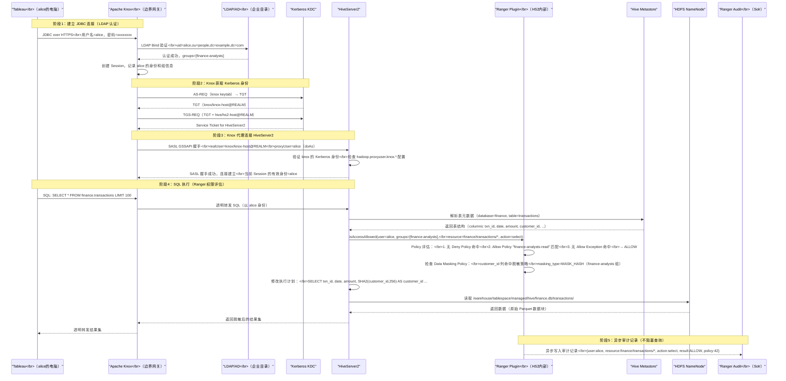
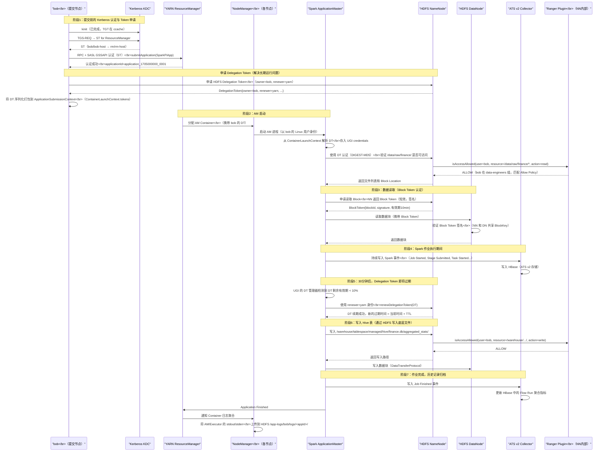
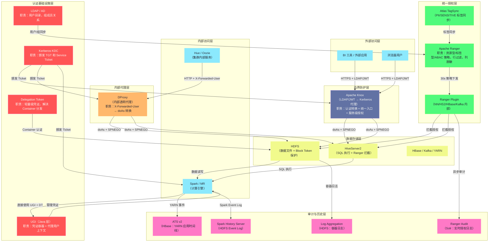

**摘要：**

本专栏历经七篇，从 Java 安全基石 [[UGI]] 出发，经过 [[Kerberos]] 协议、Hadoop 安全模式、[[Apache Ranger]] 权限管控、[[Apache Knox]] 网关、[[DProxy]] 透明代理，最终到达 [[YARN ATS]] 与 [[AHS]] 日志历史服务。这七篇文章构成了企业级大数据平台安全体系的完整拼图，但每篇文章聚焦于单一组件的纵深解析，读者读完后仍可能困惑：这些组件在一次真实的数据访问中，究竟是如何协作的？它们的边界在哪里，职责如何分工？本篇作为专栏的收官之作，以**两个完整的端到端场景**（外部 BI 工具通过 Knox 访问 Hive 数据、内部 Spark 作业读写 HDFS）为主线，将七个安全组件逐一落地到请求链路中的每一个节点，让读者真正做到"对整个安全体系了然于胸"。

---

## 第 1 章 重新审视安全体系的三个核心问题

在深入场景分析之前，先用三个核心问题重新审视整个安全体系的设计框架。大数据平台安全的所有复杂性，最终都可以归结为对这三个问题的回答：

**问题一：你是谁？（Authentication，认证）**

系统必须确认"发出请求的这个实体，真的是它声称的那个人吗"。Kerberos、LDAP、SPNEGO、JWT 都是认证机制，它们解决的都是"身份证明"这个问题。认证必须防止伪造（攻击者无法假冒 alice）、防止重放（老的认证凭证不能被再次使用）、防止中间人攻击（无法劫持认证过程）。

**问题二：你能做什么？（Authorization，授权）**

认证只证明"你是 alice"，但 alice 能不能读 `finance.transactions` 表？能不能向 `root.finance` 队列提交作业？这是授权的范畴。Ranger 的 Policy 引擎、HDFS POSIX 权限、YARN Queue ACL 都是授权机制。授权必须做到细粒度（列级、行级）、集中管理（一个地方配置生效于所有服务）、动态生效（策略变更不需要重启服务）。

**问题三：你做了什么？（Audit，审计）**

认证和授权是访问前的防线，审计是访问后的记录。"谁在什么时间，从哪里，对什么资源，做了什么操作，结果是什么"——这是合规（GDPR、SOX、HIPAA）的核心需求，也是安全事件溯源的基础。Ranger 的审计日志、HDFS 审计日志、YARN 的作业历史（ATS）都是审计体系的组成部分。

**这三个问题对应的组件分工**：

| 安全问题 | 主要承载组件 | 辅助组件 |
|---------|------------|---------|
| **认证（你是谁）** | Kerberos（身份证）、LDAP（用户目录）| UGI（Java 侧认证抽象）、SPNEGO（HTTP 协议的 Kerberos）|
| **授权（你能做什么）** | Apache Ranger（统一授权引擎）| HDFS POSIX ACL（底层文件权限）、YARN Queue ACL |
| **审计（你做了什么）** | Ranger 审计日志（Solr）| HDFS 审计日志、YARN ATS/AHS、Spark History Server |
| **边界防护（谁能进来）** | Apache Knox（外部边界）| DProxy（内部边界）、WebAppProxy（AM Web UI 防护）|

---

## 第 2 章 场景一：外部 BI 工具通过 Knox 访问 Hive 数据

### 2.1 场景描述

**角色**：alice 是财务分析师，使用 Tableau 通过 JDBC 连接 HiveServer2，查询 `finance.transactions` 表，分析过去一季度的交易趋势。

**技术背景**：
- Tableau 部署在公司办公网络，无 Kerberos 客户端
- Hadoop 集群部署在数据中心，全 Kerberos 安全模式
- Knox 部署在集群边界，提供 HTTPS 的 JDBC 入口
- Ranger 管理 Hive 数据权限，`finance.transactions` 表的 `customer_id` 列配置了 MASK_HASH 脱敏

### 2.2 完整请求链路图



### 2.3 逐层解析：每个组件做了什么

**第一层：Knox（边界防护 + 外部认证转换）**

Tableau 使用 LDAP 账号密码通过 HTTPS 连接 Knox，Knox 的 ShiroProvider 向企业 LDAP 验证 alice 的身份。这一步的关键价值在于：Tableau 完全不需要知道 Kerberos 的存在，所有 Kerberos 的复杂性被 Knox 吸收。

Knox 在认证成功后，从 Session 中提取 alice 的用户名和所属 LDAP 组（finance-analysts），传递给身份断言 Provider，最终在向 HiveServer2 发起连接时，通过 `doAs=alice` 透传真实用户身份。

**第二层：Kerberos（集群内部认证的基础）**

Knox 持有自己的 keytab（`knox/knox-host@REALM`），向 KDC 获取 HiveServer2 的 Service Ticket，然后在 SASL GSSAPI 握手中用这个 Service Ticket 向 HiveServer2 证明自己的身份。

HS2 侧通过 `hadoop.proxyuser.knox.hosts` 和 `hadoop.proxyuser.knox.groups` 配置，验证 knox 是否被允许代理 alice，验证通过后当前 HS2 Session 的有效身份变为 alice。

**第三层：Ranger（细粒度授权 + 数据脱敏）**

每条 SQL 到达 HS2 后，Ranger Hive Plugin 在**执行计划生成阶段**（SQL 还没有真正执行时）同步评估两类策略：

1. **访问策略**（`policyType=0`）：alice 是否有权 SELECT `finance.transactions` → 命中 Allow Policy，放行
2. **脱敏策略**（`policyType=1`）：`customer_id` 列是否有脱敏规则 → 命中，将 SELECT 中的 `customer_id` 改写为 `SHA2(customer_id, 256) AS customer_id`

这两次 Policy 评估发生在 HS2 进程内部的 RangerPlugin（本地内存），没有任何网络 I/O，耗时通常在 1ms 以内。

**第四层：HDFS（底层存储的第二道权限关）**

HS2 以 alice 的身份（通过 HDFS Delegation Token 或 Kerberos）从 HDFS 读取数据文件。NameNode 会再次检查 alice 对 Hive 仓库目录的访问权限（HDFS 层 Ranger Plugin）。正常情况下，Hive 仓库目录的 HDFS 权限允许 hive 服务账号和经过认证的 Hive 用户读取；如果 Ranger HDFS Plugin 也有策略，则在 Ranger 策略和 HDFS POSIX 权限中取最严格的。

**第五层：Ranger 审计（合规记录）**

Ranger Plugin 在完成 Policy 评估后，异步（非阻塞）将审计记录推送到审计缓冲队列，后台线程批量写入 Solr。审计记录包含：操作用户（alice）、客户端 IP（经过 Knox 后是 Knox 的 IP，Knox 会注入 `X-Forwarded-For` 头传递真实 IP）、资源（finance/transactions/*）、操作（select）、结果（ALLOW）、命中的策略 ID（42）。

这条审计记录回答了合规审计的核心问题：**alice 在什么时间，从哪个 IP，通过 Knox，对哪张表做了 SELECT，是否被允许**。

---

## 第 3 章 场景二：内部 Spark 作业读写 HDFS

### 3.1 场景描述

**角色**：data-engineer bob 提交了一个 Spark on YARN 的 ETL 作业，该作业：
1. 从 HDFS `/data/raw/finance/` 读取原始数据（bob 有读取权限）
2. 处理后写入 Hive 表 `finance.aggregated_stats`（bob 有写入权限）
3. 作业运行时间约 30 分钟

**技术背景**：
- 集群为 Kerberos 安全模式
- bob 在提交节点上已完成 `kinit`，持有有效 TGT
- Ranger 管理所有权限
- ATS v2 记录作业历史

### 3.2 完整请求链路图



### 3.3 逐层解析：长期运行作业的安全挑战

**挑战：Kerberos TGT 的有效期限制**

这是 Spark on YARN 在安全集群中最核心的挑战，也是 Delegation Token（委派令牌）机制存在的根本原因。

Kerberos TGT 通常有效期为 10 小时（可配置），Service Ticket 有效期更短（通常 10 分钟）。一个跑 30 分钟的 ETL 作业看起来没问题，但实际上 YARN Container 分布在不同节点，它们并没有 bob 的 TGT——bob 的 TGT 只存在于提交节点的内存中（`/tmp/krb5cc_<uid>` 文件），无法安全地传输到其他节点。

**解决方案：两层 Token 机制**

Hadoop 设计了两层 Token 机制来解决这个问题：

**第一层：Delegation Token（委派令牌）**

bob 在提交作业前，以自己的 Kerberos 身份向 NameNode 申请 Delegation Token（DT）。DT 的特殊性在于：
- 它不依赖 Kerberos，用 HMAC 签名（NameNode 的 Master Key）验证，任何节点都可以用它向 NameNode 认证
- 它携带 `renewer=yarn`，允许 YARN 代表 bob 续期 DT，无需 bob 的 Kerberos 凭证
- bob 将 DT 打包到 Container 的启动上下文，AM 启动后从中解析并使用

这使得 AM 和各 Executor Container 在没有 Kerberos TGT 的情况下，也能以 bob 的身份操作 HDFS。

**第二层：Block Token（块令牌）**

每次 AM 向 NameNode 请求读/写某个数据块时，NameNode 颁发一个 Block Token（BT）。BT 是短效的（默认 10 分钟），用 NameNode 和 DataNode 共享的密钥（Block Key）签名。

DataNode 接受来自 AM/Executor 的数据传输请求时，验证 BT 的签名（确认这个请求是 NameNode 授权的）和有效期（确认不是重放攻击）。DataNode 本身不需要向 KDC 查询——这是 BT 设计的精妙之处：**DataNode 数量可能达到数千台，如果每次 Block 读写都要 DataNode 向 KDC 查询，KDC 会被压垮**。通过共享 Block Key + 本地验证签名，DataNode 既保证了安全性，又完全不依赖 KDC 的可用性。

**DT 的续期链**：

```
30 分钟作业的 DT 续期时序：

T+0min:   bob 申请 DT（有效期 24h，renewer=yarn）
T+0min:   AM 启动，从 ContainerLaunchContext 获取 DT
T+0min~T+30min: AM/Executor 持续使用 DT 访问 HDFS

（如果是长期运行作业，如流式作业，需要续期）：
T+20h:    UGI 的 DT 管理器检测到 DT 剩余有效期 = 24h * 10% = 2.4h
          → 触发续期：AM 以 yarn principal 向 NN 续期 DT
T+44h:    下一次续期...（直到达到 maxLifetime，默认 7 天）
```

> [!info] 核心概念：Delegation Token 的最大生命周期
> Delegation Token 可以被续期，但有一个上限：`dfs.namenode.delegation.token.max-lifetime`（默认 7 天）。超过这个时间，无论续期多少次，Token 都会失效。这意味着跑超过 7 天的长期 Spark Streaming 作业需要一种不同的机制——通常的做法是在 Spark 应用内部定期重新 `kinit`（通过 Keytab 续期 TGT，再重新申请 DT），即 `spark.yarn.access.hadoopFileSystems` 配合 `spark.yarn.principal` 和 `spark.yarn.keytab` 配置。

**UGI 的角色：底层的"凭证容器"**

在整个 Spark AM 和 Executor 的生命周期中，[[UGI]]（UserGroupInformation）始终是凭证的管理者：
- AM 启动时，UGI 从 ContainerLaunchContext 的 token 字节流中反序列化出所有 DT，存入 `currentUser.credentials`
- 每次 HDFS 操作，Hadoop FileSystem 从 UGI 的 `credentials` 中取出对应的 DT（按服务类型匹配），用于认证
- UGI 的后台线程负责检测 DT 的剩余有效期，在适当时机触发续期

这就是第一篇文章讲 UGI 的意义所在：UGI 是整个 Hadoop 安全认证在 Java 层面的统一抽象，所有上层框架（Spark、MapReduce、Tez）都通过 UGI 来管理认证凭证，无需关心底层是 Kerberos 认证还是 Token 认证。

---

## 第 4 章 七个组件的职责边界与协作接口

### 4.1 组件职责边界的精确描述

经历了两个完整场景的分析，现在可以精确描述每个组件的职责边界：

**UGI（UserGroupInformation）**

边界：Java 进程内部的认证上下文管理器。
- 管理当前用户的所有凭证（Kerberos TGT、Delegation Token）
- 提供 `doAs()` 接口，支持代理用户上下文切换
- 管理长期运行进程的凭证自动续期
- **不做任何授权决策**，只负责"我是谁"这一问题的 Java 层抽象

**Kerberos**

边界：身份证明协议，解决"如何向另一个服务证明你是你"。
- 通过可信第三方（KDC）颁发的 Ticket 证明身份，无需密码直接传输
- Service Ticket 保证了通信双方的相互认证（防止中间人攻击）
- **不做任何资源级别的授权**，只说"alice 确实是 alice"

**Hadoop Delegation Token**

边界：Kerberos 的轻量级补充，用于解决容器分发和长期运行问题。
- 允许没有 Kerberos TGT 的节点（Container）以特定用户身份访问服务
- 可续期，但有最大生命周期上限
- **不是 Kerberos 的替代品**，而是 Kerberos 体系的延伸——DT 的颁发本身需要 Kerberos 认证

**Apache Ranger**

边界：统一的细粒度授权引擎，解决"你能做什么"。
- Policy 集中管理，执行本地化（Plugin in-process）
- 覆盖资源型、标签型、ABAC 三种策略模型
- 提供行级过滤和列级脱敏
- **不做认证**，它相信传入的用户身份是已经过认证的真实身份

**Apache Knox**

边界：集群边界的 API 网关，解决"外部如何安全进入"。
- 将外部认证（LDAP/JWT）转换为内部认证（Kerberos Proxy User）
- 隐藏集群内部的服务地址和 Kerberos 细节
- 提供 URL 重写、高可用、集中审计
- **不做资源级授权**，只做服务级访问控制（"你能不能访问 HDFS 这个服务"）

**DProxy（内部透明代理）**

边界：集群内部应用的 Kerberos 承接层。
- 允许没有 Kerberos 凭证的内部应用（Hue、自研平台）以真实用户身份访问 Hadoop
- 通过 `X-Forwarded-User` Header 获取用户身份，通过 `doAs` 透传给 Hadoop
- **安全完全依赖调用者的可信度**，必须配合网络层 ACL 使用

**YARN ATS / AHS / Log Aggregation**

边界：作业历史数据的持久化和查询服务，解决"你做了什么"（审计的历史维度）。
- Log Aggregation：容器日志的跨节点汇聚，存入 HDFS
- ATS v2：YARN 应用级别和 Flow 级别的结构化事件存储（HBase）
- AHS/MR-JHS：MR 作业历史的专用查询服务
- **不做任何授权决策**，只负责数据的存储和查询

### 4.2 组件间的接口协议

理清接口协议，是理解系统整体的关键：

```
Knox ←→ LDAP
  接口协议：LDAP Bind（用户名 + 密码）
  数据流向：Knox 向 LDAP 验证用户身份，获取组信息

Knox/DProxy ←→ KDC
  接口协议：Kerberos（AS/TGS 交换，krb5 协议）
  数据流向：Knox/DProxy 用 keytab 定期 kinit，获取 TGT

Knox/DProxy ←→ HiveServer2/NameNode（HTTP 服务）
  接口协议：HTTP SPNEGO（Authorization: Negotiate <token>）
  数据流向：Knox 用 Service Ticket 完成 SPNEGO 握手

YARN AM ←→ HDFS NameNode（RPC）
  接口协议：Hadoop IPC（SASL）+ DIGEST-MD5（Delegation Token）
  数据流向：AM 用 DT 认证，NameNode 验证后允许操作

NameNode ←→ Ranger HDFS Plugin
  接口协议：进程内方法调用（Plugin in-process）
  数据流向：NameNode 在每次操作前调用 Plugin.isAccessAllowed()

Ranger Plugin ←→ Ranger Admin Server
  接口协议：HTTPS REST API（策略下载）
  数据流向：Plugin 每 30 秒拉取最新策略（如有更新）

TagSync ←→ Apache Atlas
  接口协议：Atlas REST API
  数据流向：TagSync 拉取资源的分类标签，推送到 Ranger

Spark AM ←→ ATS v2 Collector
  接口协议：HTTPS REST API（写入 Timeline 事件）
  数据流向：AM 向本地 NM 上的 Collector 写入事件，Collector 写入 HBase
```

---

## 第 5 章 安全体系的演进方向与工程决策

### 5.1 当前体系的设计权衡

任何技术架构都是权衡（Trade-off）的产物，Hadoop 安全体系也不例外：

**权衡一：Kerberos 的复杂性 vs 安全性**

Kerberos 是业界成熟的企业认证协议，提供强认证保证，但其运维复杂度极高：keytab 管理、Principal 命名规范、`_HOST` 解析、时钟同步（5 分钟时钟偏差容忍）……这些运维开销在中小规模集群上往往让人望而却步。Knox 的引入部分解决了这个问题（对外部用户屏蔽 Kerberos），但集群内部仍然需要全套 Kerberos 运维知识。

**权衡二：Ranger 的本地 Policy Cache vs 策略一致性**

Ranger 插件使用本地策略缓存（30 秒刷新）来保证性能，但这带来了最多 30 秒的策略变更传播延迟。在高安全要求的场景（如即时撤销某员工的所有权限），这 30 秒的窗口期是一个需要接受的风险。

**权衡三：Delegation Token 的便利性 vs 安全性**

DT 使得 Container 可以在没有 Kerberos TGT 的情况下访问 HDFS，大幅降低了长期运行作业的复杂性。但 DT 一旦泄露（如从 Container 的日志中读取），攻击者就可以在 Token 有效期内以该用户身份访问 HDFS。DT 设计的 `renewer` 机制（限制谁能续期）和 `maxLifetime`（限制最长有效期）是缓解这个风险的关键。

### 5.2 体系演进的三个方向

**方向一：Zero Trust 化**

传统的 Hadoop 安全体系是"边界信任"模型：只要通过 Knox 进入集群，内部服务之间的信任度较高。Zero Trust（零信任）模型要求"永不信任，始终验证"——集群内部的每次服务间调用，都要重新验证身份。这意味着将 mTLS 推广到集群内部所有 RPC 通道（不只是 SASL），并缩短 Token 有效期，用更频繁的认证换取更高的安全性。

**方向二：细粒度数据授权向列/字节级演进**

Ranger 目前的列级脱敏（Data Masking）是在查询执行层做函数替换，对于通过 Spark 直接读取 HDFS 底层文件的场景无效。更完整的方案是在 HDFS 层面做透明加密（HDFS Transparent Encryption），将加密密钥的访问控制与 Ranger 策略绑定，做到"没有 Ranger 授权就无法解密数据文件"，从而封堵 Spark 绕过 HiveServer2 直读 Parquet 的漏洞。

**方向三：云原生安全体系的融合**

随着大数据平台向 K8s 迁移（Spark on Kubernetes），Kerberos 的传统运维模式（keytab 文件、NameNode RPC 的 SASL 握手）面临挑战。云原生安全体系（SPIFFE/SVID、AWS IAM Roles for Service Accounts、Kubernetes Service Account Token）正在逐步替代或补充 Kerberos。Hadoop 社区在 HDFS 的 S3A FileSystem 实现中已经支持 AWS IAM 认证，这是一个融合方向的早期信号。

### 5.3 生产中最高频的安全问题 TOP 5

基于对上述七个组件的深度理解，生产中最高频的安全问题和对应的排查思路：

**Top 1：Kerberos TGT/keytab 过期导致服务认证失败**

```bash
# 症状：Hadoop 服务日志出现 GSSException: No valid credentials
# 排查：
klist -k /etc/security/keytabs/hdfs.keytab  # 检查 keytab 包含的 Principal
klist                                         # 检查当前 TGT 状态
# 修复：
kinit -kt /etc/security/keytabs/hdfs.keytab hdfs/_HOST@REALM
# 或检查服务的 Kerberos 续期配置
```

**Top 2：Ranger 策略变更未生效（30 秒内的竞态）**

```bash
# 症状：在 Ranger Admin 修改了策略，但用户仍然报权限错误（或仍然有权限）
# 排查：
# 等待 30-60 秒（等待策略刷新）
# 检查 RangerPlugin 本地策略缓存文件的时间戳
ls -la /etc/ranger/hive_cluster1/policycache/
# 强制刷新（触发 Plugin 立即重新下载策略）
# 方法：通过 Ranger Admin REST API 更新策略的 version，Plugin 检测到版本变化立即下载
```

**Top 3：Knox 代理请求 403 Forbidden（Proxy User 未配置）**

```bash
# 症状：外部用户通过 Knox 访问报 403，Knox 日志显示 HDFS 返回
# "User: knox is not allowed to impersonate alice"
# 排查：
hdfs getconf -confKey hadoop.proxyuser.knox.hosts
hdfs getconf -confKey hadoop.proxyuser.knox.groups
# 修复：在 core-site.xml 中添加配置，然后
hdfs dfsadmin -refreshSuperUserGroupsConfiguration
```

**Top 4：日志聚合失败（yarn logs 命令查不到日志）**

```bash
# 症状：yarn logs 报 "Logs not available"
# 排查：
yarn application -status <appId> | grep "Log Aggregation"
# 或者检查 NM 日志
grep "aggregation" $HADOOP_LOG_DIR/yarn-*.nodemanager*.log | tail -50
# 常见原因：HDFS 空间不足、/app-logs 目录权限问题
hdfs dfs -df -h /app-logs
hdfs dfs -ls -d /app-logs/<username>/
```

**Top 5：Spark 长期运行作业 Delegation Token 过期**

```bash
# 症状：Spark Streaming 作业运行约 24h 后开始报错
# "InvalidToken: token (HDFS_DELEGATION_TOKEN) is expired"
# 排查：
# 检查 DT 的配置参数
hdfs getconf -confKey dfs.namenode.delegation.token.renew-interval
hdfs getconf -confKey dfs.namenode.delegation.token.max-lifetime
# 修复：为长期作业配置 Kerberos Keytab 认证，允许作业内部自动续期
# spark.yarn.principal = spark/spark-host@REALM
# spark.yarn.keytab = /etc/security/keytabs/spark.keytab
```

---

## 第 6 章 体系全景图：一张图看懂七层安全



---

## 结语：安全是工程，不是魔法

回顾本专栏的七篇文章，从 `javax.security.auth.Subject` 的 Java 类图，到 Kerberos AS/TGS 的三次握手，从 Ranger Policy 的 Allow/Deny/Exception 评估逻辑，到 Knox Topology 的 Provider 链，从 Delegation Token 的 `renewer` 字段设计，到 ATS v2 HBase RowKey 的反转时间戳技巧——**每一个看似复杂的细节背后，都有清晰的工程理由**。

企业级大数据安全体系的复杂性并非无谓的，它是对真实威胁的系统性应对：
- Kerberos 解决了"网络上的任何人都可以伪造 TCP 包"的威胁
- Delegation Token 解决了"密钥不能在不可信节点上存储"的约束
- Ranger 解决了"多系统权限管理孤岛"的混乱
- Knox 解决了"将强认证要求延伸到没有 Kerberos 客户端的用户"的矛盾
- DProxy 解决了"内部服务必须以真实用户身份操作，但服务进程不可能持有所有用户的凭证"的悖论

理解了这些"为什么"，才能在生产中做出正确的架构决策——什么时候用 Knox、什么时候用 DProxy、为什么 Ranger 策略必须配合 Kerberos 才有意义、为什么 Log Aggregation 的权限配置直接影响安全合规……这些判断力，正是一个资深大数据工程师区别于一个"会配置"的运维人员的核心能力。

安全不是魔法，是工程。


> [!note] 思考题
> 1. 大数据安全体系的三个核心问题是"你是谁（认证）"、"你能做什么（授权）"、"你做了什么（审计）"。在实际的安全事故中，"审计"往往是发现问题的最后一道防线。但大数据平台的审计日志量极其庞大（Ranger Audit + HDFS Audit + Hive Audit 每天可能产生数百 GB 的日志），如何设计一套可行的审计日志分析体系，使安全团队能够在数秒内响应"某个用户在过去 1 小时内访问了哪些敏感表"的查询？
> 2. 在 BI 工具通过 Knox → Hive → HDFS 的完整访问链路中，每个组件都需要验证请求的身份：Knox 验证外部用户的 Basic Auth → Knox 以代理用户身份向 HiveServer2 发起 Kerberos 请求 → HiveServer2 以代理用户身份读取 HDFS 文件。如果在这条链路中，某一步的身份传递出现问题（如 HiveServer2 没有正确透传代理用户身份给 HDFS），HDFS 会用谁的身份做权限检查？如何通过日志和 Ranger Audit 来诊断这类"身份传递断链"问题？
> 3. 在大数据平台的安全演进过程中，通常经历"无安全（简单部署）→ 基础安全（Kerberos + HDFS ACL）→ 完整安全（Kerberos + Ranger + Knox + Audit）"三个阶段。从"基础安全"升级到"完整安全"（引入 Ranger 替换 HDFS ACL，引入 Knox 收口外部访问）是一个高风险的在线迁移——期间需要同时保证现有作业不中断、权限规则平滑迁移。如何设计这个迁移过程，使得在 Ranger 未完全就绪前，原有的 HDFS ACL 权限仍然有效，而在 Ranger 就绪后无缝切换？