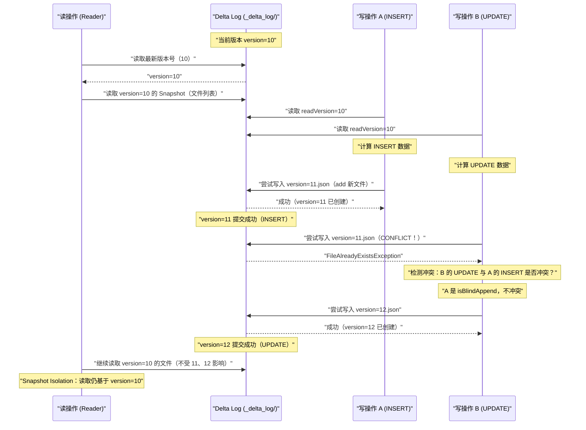

# 03 MVCC 与快照隔离：并发读写的正确性保证

## 摘要

当两个 Spark 作业同时向同一张 Delta 表写入数据时，会发生什么？在传统数据库中，这由锁机制处理——写入者获取锁，其他写入者等待。但在对象存储（S3/OSS）上，传统的分布式锁代价高昂且不可靠。Delta Lake 选择了**乐观并发控制（Optimistic Concurrency Control，OCC）**：假设大多数事务不会真正冲突，每个事务独立执行，提交时才检测是否与其他事务冲突——若冲突则重试，否则直接提交。配合**多版本并发控制（Multi-Version Concurrency Control，MVCC）**，读操作始终读取某个固定版本的快照（Snapshot Isolation），不会看到进行中的写操作，也不会阻塞写操作。本文从"两个作业同时写入的时序"出发，逐步建立对 OCC 提交协议（版本竞争、冲突检测、重试）的完整理解，以及哪些并发操作是真正冲突的（需要重试），哪些是可以安全并发的（不需要重试）。

---

## 第 1 章 MVCC：让读写不互相阻塞

### 1.1 传统锁机制的问题

在 [[MySQL InnoDB]] 这类传统关系数据库中，读-写并发通过锁机制管理：写操作获取行锁或表锁，读操作（在 Serializable 隔离级别下）也需要读锁。这在单机数据库上效率尚可，但在分布式对象存储（S3）上实现分布式锁代价极高：

- 需要一个外部协调服务（ZooKeeper、DynamoDB）存储锁状态
- 网络分区时锁服务可能不可用，写入被阻塞
- 锁持有者崩溃时需要超时 + 锁释放机制，复杂且有延迟

**Delta Lake 的选择：放弃锁，用 MVCC + OCC**。

### 1.2 MVCC 的核心思想

**多版本并发控制（MVCC）** 的核心思想是：数据库维护多个版本的数据，读操作读取某个固定版本的快照，写操作创建新版本。读和写操作作用于不同版本，天然不互相阻塞。

在 Delta Lake 中，每次提交（Commit）就是一个新版本，对应 `_delta_log/` 中的一个新 JSON 文件。版本号是全局单调递增的。

**读操作的快照隔离**：

```python
# 在 Spark 中读取 Delta 表
df = spark.read.format("delta").load("s3://bucket/delta/orders/")
# 此时 Spark 记录当前版本号，例如 version=50
# 后续对 df 的所有操作都基于 version=50 的 Snapshot
# 即使在 df.count() 执行期间，其他作业将表更新到 version=51、52，
# df 看到的依然是 version=50 的数据（Snapshot Isolation）
```

这意味着读操作是**一致性读（Consistent Read）**：读取开始时的快照在整个读取过程中保持不变，不会看到写操作的中间状态。

**写操作不阻塞读操作**：

写入作业在 `_delta_log/` 中写入新版本（add 新文件），但旧版本的文件（`remove` 之前的文件）依然存在于 S3 上。正在读取旧版本快照的读操作不受影响，因为旧文件没有被物理删除（物理删除只由 `VACUUM` 执行，且受保留期限保护）。

---

## 第 2 章 乐观并发控制（OCC）：提交协议详解

### 2.1 OCC 的三个阶段

Delta Lake 的每次写事务经历三个阶段：

```
阶段 1：读取（Read Phase）
  写入者读取当前最新版本（readVersion）
  基于 readVersion 的 Snapshot 执行计算
  确定需要 add 哪些文件、remove 哪些文件

阶段 2：验证（Validation Phase）
  检查从 readVersion 到当前最新版本之间，是否有其他事务提交了与本事务冲突的操作
  如果冲突：放弃本事务，重新从阶段 1 开始（Retry）
  如果不冲突：继续阶段 3

阶段 3：写入（Write Phase）
  尝试写入 version=readVersion+1 的 JSON 文件
  如果该版本文件已存在（被其他并发事务抢先写入）：
    回到阶段 2 重新验证（updateReadVersion = readVersion+1，重新检查是否冲突）
  如果写入成功：提交完成
```

### 2.2 版本竞争：S3 的原子性 PUT 实现锁

Delta Lake 不使用分布式锁，而是利用**对象存储的原子性 PUT 操作**来实现版本竞争：

```
事务 A（readVersion=10，尝试提交 version=11）：
  PUT s3://bucket/_delta_log/00000000000000000011.json
  → 如果 version=11 的文件已存在（其他事务已写入）：PUT 操作的语义是覆盖（S3 PUT 是幂等的）

问题：S3 的 PUT 本身不支持"原子性条件写入"（如果文件不存在才写）！
```

**这里有一个关键问题**：S3 的标准 PUT API 不支持"如果文件不存在才写入"（Conditional PUT），这意味着两个并发事务可能都成功写入了 `version=11.json`，但内容不同——导致版本 11 的内容是最后一个写入者的（后写覆盖先写），数据丢失！

Delta Lake 的解决方案：

1. **AWS S3 的 `If-None-Match` 请求头**（S3 2023 年才支持 Conditional Write）：如果文件已存在则返回 412 错误，写入者知道需要重试
2. **外部 Lock Provider（HDFS 原子 rename，DynamoDB 乐观锁）**：
   - **HDFS/Azure ADLS**：支持原子 rename 操作，先写入临时文件 `tmp/version=11.json`，再原子 rename 到 `_delta_log/11.json`；rename 到已存在的文件会失败
   - **DynamoDB LogStore**：每次提交前在 DynamoDB 中进行条件写入（`ConditionalExpression: attribute_not_exists(version)`），只有一个事务能成功
   - **S3 Conditional Write**（最新）：S3 在 2023 年底支持了 Conditional PUT，Delta Lake 3.x 利用这个特性实现真正的无锁并发

```scala
// Delta Lake 源码中的版本提交逻辑（简化）
// org.apache.spark.sql.delta.storage.LogStore
def write(path: Path, actions: Seq[String]): Unit = {
  // 尝试原子写入，如果文件已存在则抛出 FileAlreadyExistsException
  if (fs.exists(path)) throw new FileAlreadyExistsException(path.toString)
  // 写入内容
  val stream = fs.create(path, false)  // false = 不覆盖
  actions.foreach(a => stream.write((a + "\n").getBytes("UTF-8")))
  stream.close()
}
```

### 2.3 提交冲突检测的核心逻辑

假设事务 A 在 readVersion=10 时开始，计算完成后准备提交 version=11，但此时发现 version=11 已经被事务 B 提交了。事务 A 需要判断：**事务 B 的提交与我的操作是否冲突？**

**不冲突的情况（可以将 readVersion 提升为 11，继续尝试提交 version=12）**：

```
场景：事务 A 是 Append-only 写入（isBlindAppend=true）
  → 我的写入不依赖任何现有数据，也不修改任何现有数据
  → 事务 B 写了什么我不关心
  → 直接将 readVersion 更新为 11，尝试提交 version=12

场景：事务 B 修改了分区 partition=2026-01，我的操作只涉及 partition=2026-02
  → 事务 B 的变更与我的操作作用于不同的数据分区
  → 不冲突，继续尝试提交
```

**冲突的情况（事务 A 必须重试，从头重新读取数据并重新计算）**：

```
场景：事务 A 是 UPDATE，readVersion=10 时读取了文件 F1 并计划 remove F1 + add F1'
      事务 B（version=11）也 remove 了文件 F1（例如 B 也更新了 F1 中的数据）
  → 事务 A 的 remove F1 与事务 B 的 remove F1 冲突（F1 已被 B 删除，A 无法再删除）
  → 事务 A 必须从 readVersion=11 重新读取数据，重新计算 UPDATE

场景：事务 A 执行 MERGE（读了部分文件判断是否需要更新）
      事务 B 向这些文件所在的分区追加了新数据
  → 事务 A 读取时没有看到 B 追加的数据，A 的 MERGE 结果可能是不完整的
  → 冲突（取决于隔离级别：WriteSerializable 下不冲突，Serializable 下冲突）
```

**冲突检测算法（简化版）**：

```
事务 A 的冲突检测输入：
  - A 在 readVersion=10 时读取的文件集合（readFiles）
  - A 计划 remove 的文件集合（filesToRemove）
  - 事务 B（version=11）的 add 和 remove 集合

冲突条件：
  1. A 的 filesToRemove 与 B 的 filesToRemove 有交集
     （A 和 B 都想删除同一个文件）
  2. B 的 add 的文件覆盖了 A 读取的数据范围（且 A 不是 isBlindAppend）
     （B 在 A 读取之后修改了 A 读取的数据）
```

---

## 第 3 章 并发操作的冲突矩阵

### 3.1 哪些并发操作不冲突

理解哪些操作可以安全并发，对设计高吞吐的 Delta Lake 写入管道至关重要：

| 操作 A | 操作 B | 是否冲突 | 原因 |
|-------|-------|---------|-----|
| INSERT（Append）| INSERT（Append）| **不冲突** | 双方都是 isBlindAppend，互不干扰 |
| INSERT（新分区）| INSERT（不同分区）| **不冲突** | 作用于不同分区文件 |
| INSERT（Append）| UPDATE | **不冲突**（WriteSerializable）| A 是 Append，不读取现有数据，B 的修改不影响 A |
| INSERT（Append）| DELETE | **不冲突**（WriteSerializable）| 同上 |
| OPTIMIZE | INSERT | **不冲突** | OPTIMIZE 的文件替换（dataChange=false）不与新数据冲突 |
| SELECT（读）| 任何写 | **永不冲突** | MVCC：读操作固定在某个 Snapshot 版本 |

### 3.2 哪些并发操作会冲突

| 操作 A | 操作 B | 是否冲突 | 原因 |
|-------|-------|---------|-----|
| UPDATE（分区 P1）| UPDATE（分区 P1）| **冲突** | 双方都要删除和重写 P1 的文件 |
| DELETE（全表扫描）| INSERT（Append）| **冲突**（Serializable）| A 读取了所有文件，B 在 A 读取后增加了新文件（A 未看到）|
| MERGE | INSERT（同分区）| **冲突**（Serializable）| MERGE 读取了目标分区，B 在之后追加了新数据到该分区 |
| MERGE | UPDATE（同文件）| **冲突** | 双方都要修改同一个文件 |

### 3.3 隔离级别对冲突判断的影响

**WriteSerializable（默认）**：只保证写操作之间的串行化，读操作不参与冲突检测。

```
WriteSerializable 下，以下不冲突：
  - 事务 A（MERGE）读取了文件 F1，事务 B（INSERT Append）之后向 F1 所在分区追加了数据
  - 原因：A 是写操作，B 也是写操作，但 B 的 INSERT 是 isBlindAppend，
    两者的写入目标文件没有交集

Serializable 下，以下冲突（更保守）：
  - 同样场景中，A 在 readVersion=10 时读取了文件 F1
  - B 在 version=11 时向 F1 所在分区追加了新数据
  - A 的 MERGE 结果可能不包含 B 追加的数据（A 读取时没有看到 B 的数据）
  - 为了保证串行等价性，A 必须重试，基于 version=11 重新执行 MERGE
```

> [!warning] 生产避坑
> **WriteSerializable 的语义陷阱**：默认的 WriteSerializable 隔离级别在某些场景下可能导致非直觉的结果。例如：
> - 作业 A：`DELETE FROM events WHERE user_id NOT IN (SELECT user_id FROM active_users)`
> - 作业 B：INSERT 了一批新 user_id 到 active_users（与 A 并发）
> 
> 在 WriteSerializable 下，A 可能成功删除了 B 刚插入的 user_id 对应的事件（因为 A 读取 active_users 时 B 的数据还不存在）。如果业务要求更强的一致性，需要将隔离级别改为 Serializable：
> ```sql
> ALTER TABLE events SET TBLPROPERTIES ('delta.isolationLevel' = 'Serializable');
> ```

---

## 第 4 章 读-写隔离的完整时序图



**关键点**：
1. 读操作（Reader）在整个过程中看到的是 version=10 的一致性快照，不受写操作 A（version=11）和写操作 B（version=12）的干扰
2. 写操作 A 和 B 通过版本竞争解决并发：A 抢先写入 version=11，B 发现冲突后重新验证，确认不冲突后写入 version=12

---

## 第 5 章 OCC 的性能代价与优化

### 5.1 冲突重试的代价

OCC 的代价在于：发生冲突时，事务需要回滚并重新执行。对于一个耗时 1 小时的 Spark 作业，如果在提交时发现冲突，需要重新执行 1 小时的计算——代价巨大。

**降低冲突概率的实践**：

1. **分区表 + 按分区写入**：不同分区的并发写入几乎不会冲突。将并发写入路由到不同分区（如按日期分区，不同作业写不同日期的数据），完全避免冲突

2. **减少读-写范围重叠**：UPDATE/MERGE/DELETE 的条件越精确，涉及的文件越少，与其他并发写入冲突的概率越低

3. **使用 Append 代替 MERGE（当业务允许时）**：Append 操作永远不会与其他写入冲突。如果业务可以接受先 Append 再定期 MERGE 去重，优先使用 Append

4. **串行化敏感操作**：对于确实需要全表扫描的操作（全表 DELETE、无分区条件的 MERGE），在业务低峰期单独执行，避免与其他写入并发

### 5.2 Long-Running 事务的风险

如果一个 Spark 作业在 readVersion=10 时开始，运行 2 小时后尝试提交，此时 Delta Log 已经有了 version=11, 12, ..., 50。事务需要对每个中间版本（11 到 50）执行冲突检测：

```
冲突检测次数 = 50 - 10 = 40 次
每次冲突检测需要读取中间版本的 JSON 日志
总额外开销：40 × JSON 读取延迟
```

当中间版本很多时（如高频写入的表），长时间运行的事务在提交时需要做大量冲突检测，延迟显著。

**实践建议**：对 Delta Lake 表的写入作业，尽量控制单次作业的运行时间（避免超过 30 分钟），减少中间版本积累。对于真正需要长时间运行的作业（如历史数据回填），使用 Append 模式（isBlindAppend=true）跳过冲突检测。

---

## 小结

Delta Lake 的并发控制体系建立在两个相互配合的机制之上：

- **MVCC（多版本并发控制）**：每次提交创建新版本，读操作固定读取某个版本的 Snapshot，读写不互相阻塞；历史文件由 VACUUM 延迟清理，支持 Time Travel
- **OCC（乐观并发控制）**：写操作独立执行，提交时通过版本号竞争（原子 PUT）+ 冲突检测决定是否成功；不冲突直接提交，冲突则重试（重新从最新版本读取并重新计算）

**冲突判断的核心规则**：
- Append-only 写入（`isBlindAppend=true`）与任何写入都不冲突
- 不同分区的写入通常不冲突
- 修改同一批文件的并发写入冲突（需要重试）
- WriteSerializable（默认）比 Serializable 更宽松（读操作不参与冲突检测）

第 04 篇深入 MERGE、UPDATE、DELETE 的物理实现机制，重点分析 Copy-on-Write 与 Merge-on-Read 两种写入模式的性能特征，以及 Deletion Vector（Delta Lake 2.0+ 的核心优化）如何将单行删除的代价从"重写整个文件"降低到"标记一个 bit"。

---

> [!note] 思考题
> 1. Delta Lake 使用乐观并发控制（OCC），冲突判断基于操作是否涉及相同的文件。在高并发 MERGE 操作场景下，冲突率如何估算？如何通过分区设计降低冲突概率？
> 2. 快照隔离保证读操作始终读取一致的快照。如果在长时间读操作（2 小时批处理）期间，`VACUUM` 删除了该快照版本引用的旧文件，读操作会失败吗？`deletedFileRetentionDuration` 参数与快照隔离有什么关系？
> 3. `VACUUM` 也会破坏 Time Travel——旧数据文件被删除后无法查询历史版本。在设计 Time Travel 保留策略时，如何在存储成本和历史回溯能力之间做出合理权衡？

## 参考资料

- [Delta Lake 事务协议规范](https://github.com/delta-io/delta/blob/master/PROTOCOL.md#optimistic-concurrency-control)
- [Delta Lake 冲突检测源码：ConflictChecker.scala](https://github.com/delta-io/delta/blob/master/core/src/main/scala/org/apache/spark/sql/delta/ConflictChecker.scala)
- Armbrust et al. Delta Lake: High-Performance ACID Table Storage over Cloud Object Stores. VLDB 2020.
