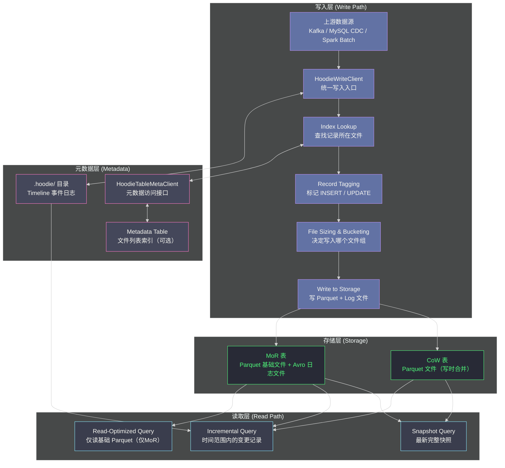

**摘要：**

本文从 Uber 工程团队在 2016 年面临的真实工程困境出发，揭示 Apache Hudi 诞生的根本原因——**传统数据湖的文件替换模型无法高效支持记录级别的增量更新**。在理解这一痛点之后，文章将深入解析 Hudi 的核心设计哲学：它不是"给数据湖加事务"（这是 Delta Lake 做的事），而是"让数据湖成为一个高效的增量处理引擎"。两者的出发点、设计取舍和最终适用场景存在本质差异，这一差异将贯穿整个专栏，并在最后一篇得出明确的选型结论。

---

## 第 1 章 数据湖的先天缺陷：只能追加，不能更新

### 1.1 Hive 时代的数据更新困境

在 Hudi 诞生之前，以 [[Apache Hive]] 为代表的数据湖方案面对"更新数据"这件事，几乎没有优雅的解法。这不是 Hive 的 Bug，而是分布式存储系统的**先天架构约束**。

理解这个约束，需要回到 [[HDFS]] 的文件模型。HDFS 是一个**追加写（append-only）** 的分布式文件系统——文件一旦写入，就不可修改，只能追加或整体删除重写。这个设计选择是合理的：在一个横跨数千台机器的分布式系统中，如果允许随机写，就需要复杂的分布式锁机制来协调并发访问，系统复杂度会呈指数级上升，而大数据工作负载本质上是"大批量写、大批量扫描"，随机写的需求很少。

然而，工业界的数据管道现实与这个模型之间存在一道深深的鸿沟。

### 1.2 Uber 的真实困境：每天十亿条记录的增量同步

2016 年，Uber 的数据团队面临这样一个问题：Uber 的核心业务数据（行程记录、司机账单、用户订单等）存储在多个在线数据库（[[MySQL]]、Cassandra）中。出于数仓分析的需要，这些数据需要定期同步到 Hadoop 数据湖中供 Hive/Spark 查询。

**一次行程的数据生命周期**大致如下：

```
1. 乘客下单 → 在 MySQL 中插入一条 trip 记录（status=REQUESTED）
2. 司机接单 → 更新同一条记录（status=ACCEPTED, driver_id=xxx）
3. 行程开始 → 再次更新（status=IN_PROGRESS, start_time=xxx）
4. 行程结束 → 最终更新（status=COMPLETED, fare=xxx, end_time=xxx）
5. 账单结算 → 又一次更新（status=BILLED, payment_method=xxx）
```

一条逻辑记录，在其生命周期内会被更新 4-5 次。Uber 每天新增数千万次行程，每次行程产生多次状态更新，**每天需要同步到数据湖的"变更记录"就有数十亿条**。

### 1.3 传统解法的两难困境

面对这个问题，传统数据湖有两种解法，都有严重缺陷：

**解法一：每天全量覆盖（Full Overwrite）**

每天凌晨，从 MySQL 中将所有 trip 记录全量导出，覆盖 HDFS 上的 Hive 分区。

```
问题：
- 假设 trip 表有 500 亿条历史记录，每次全量导出就是 500 亿条
- 即使当天只有 3000 万条新记录（其中大部分是已有记录的状态更新）
- 也要为这 3000 万条处理 500 亿条记录 ← 效率极其低下

数据新鲜度：
- 全量覆盖通常需要 6-12 小时
- 所以数据湖的数据始终是昨天的
- 对于 Uber 的运营分析（今日实时收入、司机在线率）完全不够
```

**解法二：增量追加 + 去重（Append + Dedup）**

每天只把"今天有变化的记录"增量追加到 Hive 分区，查询时通过 `ROW_NUMBER()` 窗口函数按主键取最新版本。

```sql
-- 查询行程表的"最新状态"
SELECT * FROM (
    SELECT *,
           ROW_NUMBER() OVER (PARTITION BY trip_id ORDER BY updated_at DESC) AS rn
    FROM trips_raw  -- 包含所有历史追加记录，有大量重复
)
WHERE rn = 1;
```

```
问题：
- trips_raw 表每天追加新数据，历史数据不断累积
- 每次查询都要扫描全量历史数据并做窗口函数去重
- 随着数据量增长，查询性能线性下降
- 1年后 trips_raw 可能有原始数据量的 5-10 倍大小（每条记录有 5 个版本）
```

> [!info] 核心矛盾的本质
> 这两种方法揭示了一个根本矛盾：**OLAP 数据湖的文件格式（Parquet/ORC）为批量顺序扫描优化，而不是为记录级别的点查和更新优化**。传统关系数据库可以用 B-Tree 索引精准定位一条记录然后原地更新，但在一个把数据存成不可变 Parquet 文件的系统里，你没有任何方式"找到这条记录然后改它"。

### 1.4 为什么这个问题在当时没有好的开源解法

值得思考：Delta Lake 不是也解决了这个问题吗？为什么 Uber 要自己造轮子？

原因很简单：**Delta Lake 在 2019 年才开源，而 Uber 的问题在 2016 年就必须解决**。更重要的是，即便 Delta Lake 开源了，它对这个特定场景的解法和 Hudi 也有本质不同——这正是本专栏要深入剖析的内容。

Uber 工程师 Vinoth Chandar 在 2017 年发表的博文《Hoodie: Uber Engineering's Incremental Processing Framework on Apache Hadoop》中，将这个问题总结为：

> "We needed a way to do **record-level upserts** at scale, while still supporting the **incremental consumption** of data changes by downstream systems."

两个关键需求：**记录级 Upsert（不是文件级替换）** 和 **增量消费（下游能知道哪些记录变了）**。这两个需求共同塑造了 Hudi 的整个架构。

---

## 第 2 章 Hudi 的设计哲学：增量处理引擎

### 2.1 Hudi 的核心假设

Hudi 的设计建立在一个核心假设之上：**数据湖中的大多数写入操作，本质上是对已有记录的状态更新，而不是全新记录的插入**。

这个假设在以下场景中成立：
- **CDC 场景**：从 MySQL/PostgreSQL 同步变更数据（大量 UPDATE/DELETE，少量 INSERT）
- **事件流去重**：Kafka 消费端，同一业务实体的多次事件只保留最新状态
- **SCD（缓慢变化维度）**：维表更新（用户地址变更、商品信息修改）
- **数据修正**：历史数据质量问题的修复（少量记录的批量订正）

在这些场景下，"找到已有记录并更新它"是高频操作。Hudi 为此设计了**记录级别的索引（Record-Level Index）**，这是它和 Delta Lake、Iceberg 最根本的架构差异。

### 2.2 Hudi 的三张面孔：三种查询模式

Hudi 针对不同场景提供三种查询模式，这三种模式的存在本身就揭示了 Hudi 的设计哲学：

**面孔一：Snapshot Query（快照查询）**

读取表的最新完整快照，语义和普通 Hive 表一样，查询者看到"当前时刻所有记录的最新状态"。

```
用途：BI 报表、数仓查询（最常用）
性能：取决于存储类型（CoW vs MoR，详见第 02 篇）
```

**面孔二：Incremental Query（增量查询）**

**这是 Hudi 区别于所有竞争对手的独特能力**——你可以查询"在某个时间点之后发生变更的所有记录"。

```sql
-- 只获取从 checkpoint 时间戳之后变更的记录
SELECT * FROM trips
WHERE _hoodie_commit_time > '20240101120000'   -- 增量拉取点
```

下游 Spark 任务每小时运行一次，只处理上一小时内变更的记录（可能是几万条），而不是全量扫描数十亿条历史数据。这就是所谓的"增量 ETL"，相比全量 ETL，**计算量可以减少 100-1000 倍**。

**面孔三：Read-Optimized Query（读优化查询）**

仅适用于 MoR（Merge-on-Read）存储类型，只读取已完成 Compaction 的 Parquet 基础文件，忽略尚未合并的增量日志文件，以获得最高的查询性能（代价是读到的数据可能略有延迟）。

> [!note] 三种查询模式的设计哲学
> 这三种模式不是"多余的功能"，而是 Hudi 在**数据新鲜度**与**查询性能**之间做出的显式权衡暴露接口。它承认"在高频更新场景下，不可能同时做到数据最新和查询最快"，所以提供三种模式让用户自己选择权衡点——这正是 Hudi 面向工程师而非面向产品的设计风格。

### 2.3 Hudi 的整体架构全景

在深入各个模块之前，先建立对 Hudi 整体架构的直观认识：



---

## 第 3 章 Timeline：Hudi 的核心创新

### 3.1 什么是 Timeline，为什么需要它

**Timeline** 是 Hudi 最核心的架构创新，存储在表根目录的 `.hoodie/` 目录下。它是一个**全局有序的事件日志**，记录了对表发生的每一次操作（每次 Commit、Compaction、Clean、Rollback）的元数据。

为什么需要一个专门的 Timeline 而不是像 Delta Lake 那样直接用事务日志文件？

答案在于 Hudi 的**增量消费语义**需求。

考虑这样一个场景：下游 Spark 任务每小时运行一次，需要知道"过去 1 小时内，哪些记录被插入或更新了"。要支持这个查询，系统必须能回答以下问题：

1. 某次 Commit 操作覆盖了哪些文件？
2. 这些文件里包含哪些记录（按主键）？
3. 某个时间范围内，哪些 Commit 已经完成（COMPLETED）而不是正在进行（INFLIGHT）？

Delta Lake 的事务日志（`_delta_log/*.json`）也记录了类似信息，但它的设计目标是**快照一致性**，回答的问题是"给我版本 N 的完整文件列表"。Hudi 的 Timeline 设计目标是**增量流语义**，回答的问题是"给我时间点 T1 到 T2 之间发生变化的文件列表"——这是本质不同的查询模式。

### 3.2 Timeline 的文件结构

```
表根目录/
├── .hoodie/
│   ├── 20240101120000.commit          ← 已完成的 Commit（COMPLETED 状态）
│   ├── 20240101120000.commit.requested ← Commit 开始前的预登记（REQUESTED 状态）
│   ├── 20240101130000.commit.inflight  ← 正在执行中的 Commit（INFLIGHT 状态）
│   ├── 20240101110000.compaction.requested
│   ├── 20240101110000.compaction.inflight
│   ├── 20240101110000.compaction      ← 已完成的 Compaction
│   ├── 20240101090000.clean           ← 已完成的 Clean（删除旧版本文件）
│   ├── hoodie.properties              ← 表配置（表类型、主键字段等）
│   └── .aux/
│       └── requests/                  ← 辅助文件
├── 分区目录/
│   ├── 数据文件（.parquet / .log）
```

**三种 Action 状态**：

每个 Action（操作）都有三种状态，对应三个文件后缀：

| 状态 | 文件后缀 | 含义 |
|-----|---------|-----|
| `REQUESTED` | `.action.requested` | 操作已计划，尚未开始执行 |
| `INFLIGHT` | `.action.inflight` | 操作正在执行中（Driver 崩溃前的状态）|
| `COMPLETED` | `.action` | 操作已成功完成，对读者可见 |

**五种 Action 类型**：

| Action | 触发时机 | 作用 |
|--------|---------|-----|
| `commit` | 每次 Upsert/Insert 完成 | 记录本次写入覆盖的文件列表及统计信息 |
| `deltacommit` | MoR 表的增量写入 | 记录写入了哪些 Log 文件（.log）|
| `compaction` | 后台异步任务 | 将 MoR 的日志文件合并到基础 Parquet 文件 |
| `clean` | 后台异步任务 | 删除超出保留版本数的旧文件 |
| `rollback` | Commit 失败时 | 回滚 INFLIGHT 状态的操作，保证原子性 |

### 3.3 Timeline 如何保证原子性

Hudi 利用 HDFS/S3 的文件创建原子性（在大多数分布式文件系统中，创建一个新文件是原子操作）来实现事务语义：

```
写入流程（三阶段提交）：

阶段 1：REQUESTED
  Driver 在 .hoodie/ 目录创建 timestamp.commit.requested 文件
  → 此时 Executor 开始执行实际写入

阶段 2：INFLIGHT  
  创建 timestamp.commit.inflight 文件
  → 标记操作正在进行中（防止其他 Writer 重复执行）
  → Executor 写数据文件到分区目录

阶段 3：COMPLETED
  创建 timestamp.commit 文件（写入本次操作的统计信息）
  删除 timestamp.commit.inflight 文件
  → 对读者可见（读者只看 .commit 结尾的文件）

如果 Driver 在阶段 2 崩溃：
  → .inflight 文件存在，.commit 文件不存在
  → 下次启动时，HoodieWriteClient 检测到孤立的 inflight
  → 执行 Rollback：删除本次写入的数据文件 + 删除 inflight 文件
  → 状态回到干净的起点
```

> [!warning] 与 Delta Lake 的重要差异
> Delta Lake 的原子性基于事务日志文件（`_delta_log/N.json`）的顺序写入，使用乐观并发控制（OCC）检测并发冲突。
> Hudi 的原子性基于 HDFS 文件创建的原子性 + 三阶段提交协议，是一种更"工程化"的实现，但在并发写入的冲突检测上不如 Delta Lake 精细。

### 3.4 Timeline 如何支持增量查询

有了 Timeline，增量查询的实现就非常直接了：

```python
# 增量查询的内部逻辑（简化）
def incremental_query(table_path, begin_time, end_time):
    # 1. 读取 Timeline，找到 begin_time ~ end_time 之间所有 COMPLETED 的 Commit
    timeline = read_timeline(table_path + "/.hoodie/")
    relevant_commits = [
        c for c in timeline
        if c.action == "commit"
        and c.state == "COMPLETED"
        and begin_time < c.timestamp <= end_time
    ]

    # 2. 从每个 Commit 的元数据中，提取本次写入影响的文件列表
    affected_files = []
    for commit in relevant_commits:
        commit_metadata = read_commit_metadata(commit)
        affected_files.extend(commit_metadata.written_files)

    # 3. 只扫描这些文件（而不是整张表）
    # 并且只返回 _hoodie_commit_time 在范围内的记录
    return spark.read.parquet(*affected_files).filter(
        F.col("_hoodie_commit_time") > begin_time
    )
```

这就是 Hudi 增量查询的本质：**利用 Timeline 中的 Commit 元数据，将全表扫描缩减为只扫描受影响的文件**，再加上列过滤去除不在时间范围内的记录。

---

## 第 4 章 Hudi 与 Delta Lake 的本质差异

### 4.1 两者解决的核心问题不同

经过上述分析，可以清晰地总结两者的核心设计取舍：

| 维度 | Apache Hudi | Delta Lake |
|-----|-----------|-----------|
| **核心问题** | 记录级 Upsert + 增量消费 | 数据湖 ACID 事务 + DML 可靠性 |
| **主要场景** | CDC 摄入、近实时数仓、增量 ETL | 批量 DML（MERGE/UPDATE/DELETE）、流批一体写入 |
| **事务粒度** | 文件组（FileGroup）级别 | 表快照级别（Snapshot Isolation）|
| **并发控制** | 基于文件锁的乐观并发 | OCC + 冲突矩阵（更精细）|
| **增量消费** | **原生支持**（Incremental Query）| 需要借助 CDC Feed（后期加入，非核心）|
| **引擎绑定** | Spark 原生，Flink 支持良好 | Spark 深度绑定（其他引擎通过 Delta 协议）|
| **Index 设计** | **有记录级索引**（路由更新到正确文件）| **无记录级索引**（更新触发全分区扫描）|

### 4.2 记录级 Index：Hudi 最关键的差异点

**这是 Hudi 和 Delta Lake 最根本的架构差异**，值得深入展开。

当你对 Hudi 表执行 Upsert 时，系统需要知道"这条记录（按主键 trip_id = 12345）**当前存储在哪个 Parquet 文件里**"，才能决定是"插入新文件"还是"更新旧文件"。

Hudi 为此维护了一个**记录 → 文件位置**的映射索引（默认使用 Bloom Filter 索引）：

```
记录索引：
  trip_id=12345 → partition=2024/01/01, fileId=xxxx-xxxx.parquet
  trip_id=12346 → partition=2024/01/01, fileId=yyyy-yyyy.parquet
  trip_id=99999 → 不存在（新记录，走 INSERT 路径）
```

有了这个索引，Upsert 的逻辑就变为：
1. **查索引**：确定每条输入记录是 INSERT 还是UPDATE，以及 UPDATE 目标文件
2. **按文件分组**：将所有更新同一个文件的记录批量处理
3. **写入**：INSERT 的记录写新文件，UPDATE 的记录合并到目标文件（CoW）或追加日志（MoR）

**Delta Lake 没有这个索引**（截至 Delta Lake 3.x，其 Deletion Vectors 功能在特定场景下有类似机制，但不是通用的记录索引）。Delta Lake 的 `MERGE INTO` 操作如果没有分区剪裁，会扫描整个表来找到匹配的记录——在大表上可能非常昂贵。

> [!info] 记录索引的代价
> 记录级索引不是"免费的午餐"——维护索引需要存储空间，且在每次写入时有索引查找开销（Bloom Filter 索引是近似查找，需要读取相关数据文件做精确验证）。Hudi 提供了多种索引类型（Bloom Filter、HBase、Bucket、Record-Level），各有性能权衡，这将在第 04 篇深入讨论。

### 4.3 谁更适合你的场景

用一个简单的决策框架来结束本篇：

```
你的写入负载是什么类型？

主要是 INSERT（全新记录）+ 少量更新？
  → Delta Lake 或 Iceberg 可能更合适
  → Hudi 的索引优势在这里无法体现

主要是 UPSERT（按主键更新已有记录，典型 CDC）？
  → Hudi 是最佳选择
  → 记录级 Index 让 Upsert 效率比 Delta Lake 高得多

需要下游系统增量消费（只处理新变化的记录）？
  → Hudi 的 Incremental Query 是原生能力
  → Delta Lake 的 Change Data Feed 是后加的功能，语义略有差异

需要最强的多引擎互操作性（Spark + Trino + Flink + Hive 混用）？
  → Apache Iceberg（下一个专栏的主角）更合适
  → Hudi 对非 Spark 引擎的支持历史上不如 Iceberg 完善
```

---

## 小结

Hudi 的诞生有明确的工程起点：Uber 的 CDC 增量数仓问题。这个起点决定了它的核心设计——记录级 Index + Timeline + 三种查询模式（Snapshot/Incremental/Read-Optimized）。

Hudi 不是"更好的 Delta Lake"，也不是"Delta Lake 的替代品"——它们是**面向不同问题**的解法。如果你的数据管道大量依赖 CDC 同步、按主键 Upsert 和增量 ETL 消费，Hudi 是更自然的选择；如果你的场景主要是批量 DML 和流批一体写入，Delta Lake 的事务保证更为完善。

下一篇 [[02 存储类型深度解析——CoW vs MoR 的设计权衡与适用场景]] 将深入 Hudi 最重要的技术选型问题：你的表到底应该用 Copy-on-Write（CoW）还是 Merge-on-Read（MoR）？这个决策直接决定你的写入吞吐量、读取延迟和资源消耗，是使用 Hudi 的第一道必答题。


> [!note] 思考题
> 1. Hudi 通过 Index 机制精确定位需要更新的记录，避免了传统全量覆盖方案的线性代价。但 Hudi 的 Bloom Filter Index 本身也需要在每个 Parquet 文件的 Footer 中存储和维护。当表的分区数和文件数极多时（如数百万个文件），Index 查找阶段需要打开所有分区内的文件读取 BloomFilter，这个扫描代价是否会成为新的瓶颈？
> 2. Hudi 的 Timeline 支持消费者只处理"上次消费以来的增量变更"，类似 Kafka 的 Offset 消费。但如果消费者在消费增量的过程中重启（未完整消费一个 Commit），重启后应该从哪个时间点开始重新消费？Hudi 的 Timeline 如何保证增量消费的 Exactly-Once 语义？
> 3. `HoodieTimelineArchiver` 会归档旧的 Timeline 条目，将其合并压缩。如果归档策略过于激进，消费者无法找到"上次消费位置"对应的 Commit，增量消费会怎样处理这种"起始点不存在"的情况？