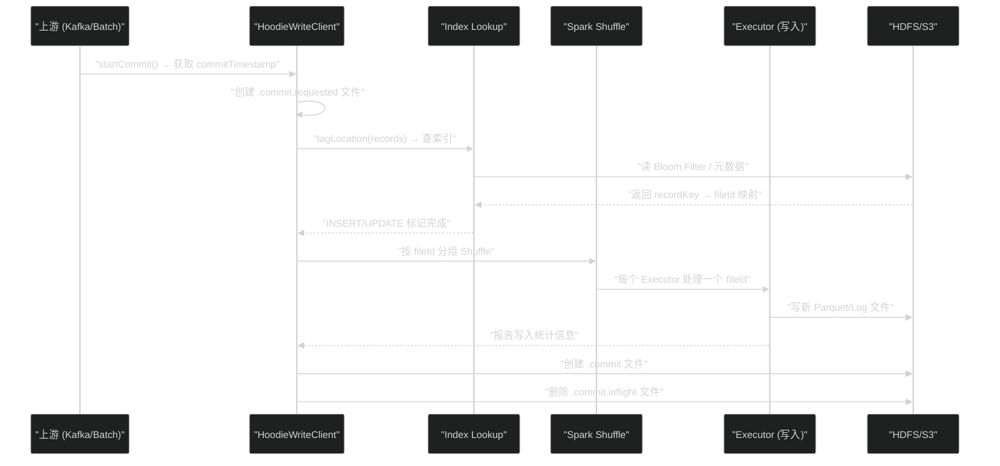

**摘要：**

[[Apache Hudi]] 能高效支持记录级 Upsert 的根本原因，在于它维护了一个**记录 → 文件位置的映射索引**。没有这个索引，每次更新一条记录就必须扫描整张表来寻找它的位置——这与 [[Delta Lake]] 的 `MERGE INTO` 在无分区剪裁时的行为相同，代价极高。本文深入剖析 Hudi 的 Upsert 写入全路径：从 `HoodieKey`（主键 + 分区路径的二元组）的设计，到 Bloom Filter Index（默认索引）的工作原理与误判代价，再到 Bucket Index（Hudi 1.x 的重大改进）如何通过哈希分桶彻底消除索引查找开销。理解这套索引机制，是正确选择 Hudi 索引类型、调优 Upsert 吞吐量的基础。

---

## 第 1 章 Upsert 的核心挑战：如何找到记录在哪里

### 1.1 分区不解决"哪个文件"的问题

当你对 Hudi 表执行 Upsert 时，假设按 `date` 字段分区，你知道一条 `trip_id=12345` 的更新记录应该落在 `date=2024-01-01` 分区——但这个分区下可能有**几十个乃至几百个 Parquet 文件**，这条记录在哪个文件里？

这不是一个可以通过分区解决的问题。分区只告诉你"去哪个文件夹找"，但不告诉你"具体是哪个文件"。

对比一下关系数据库：MySQL 的主键对应一棵 B-Tree 索引，通过 B-Tree 可以在 `O(log N)` 时间内定位任意一条记录。Hudi 没有 B-Tree，它的文件是不可变 Parquet，无法在文件内部建立随机访问索引。

Hudi 的解法是：**在文件粒度上建立索引**——不精确到"第 N 行"，而是精确到"哪个 Parquet 文件（fileId）"。找到了文件，就可以只读这一个文件并执行合并，而不需要扫描整个分区。

### 1.2 HoodieKey：Hudi 记录的唯一标识

在 Hudi 的数据模型里，每条记录由 **`HoodieKey`** 唯一标识，它是一个**二元组**：

```
HoodieKey = (recordKey, partitionPath)

recordKey：记录的业务主键，可以是单字段或多字段组合
  例：trip_id=12345
  或：trip_id=12345_city=shanghai（复合主键）

partitionPath：记录所在的分区路径
  例：date=2024-01-01
  或：region=CN/date=2024-01-01（多级分区）
```

**为什么 partitionPath 也是 HoodieKey 的一部分**？

这是 Hudi 设计的一个约束：**一条记录的分区不能改变**。如果一条记录的 `trip_id=12345` 在 `date=2024-01-01` 写入，之后对它的所有更新都必须发生在 `date=2024-01-01` 分区——你不能把它"移动"到另一个分区。

这个约束换来的是：**索引只需要在同一分区内查找**，大大缩小了索引查找的范围。同时，只要知道 `partitionPath`，就可以精确定位到对应的 HDFS/S3 子目录，再在目录内查找文件。

> [!warning] 分区不可变的工程含义
> 如果你的 CDC 数据包含可能导致分区变化的更新（如用户的注册日期被修正），Hudi 的标准 Index 无法处理这种"跨分区 Upsert"。Hudi 1.x 引入了 Record-Level Global Index 来支持跨分区更新，但代价是索引维护成本更高。

### 1.3 写入路径全景

在深入各种 Index 类型之前，先建立 Upsert 写入路径的完整全景：



整个流程的关键瓶颈在 **Index Lookup** 阶段——如果索引查找慢，整个 Upsert 就慢。这就是 Hudi 在索引机制上投入大量工程精力的原因。

---

## 第 2 章 Bloom Filter Index：默认索引的原理与代价

### 2.1 什么是 Bloom Filter

**Bloom Filter** 是一种**概率型数据结构**，用于快速判断"某个元素是否在一个集合中"。它的特点是：

- **空间极其紧凑**：存储 100 万个字符串的 Bloom Filter，只需约 1.2MB（远小于存储原始字符串）
- **查询 O(1)**：无论集合大小，查询时间恒定
- **有误判率（False Positive）**：可能错误地说"元素在集合中"（但不会错误地说"元素不在"）
- **无误报（No False Negative）**：如果 Bloom Filter 说"不在"，就一定不在

在 Hudi 的语境里，每个 Parquet 文件都有一个关联的 Bloom Filter，存储了该文件包含的所有 `recordKey` 的哈希。查询时，给定一个 `recordKey`，可以快速判断"该文件**可能**包含这个 key"（需要进一步读文件验证）或"该文件**一定不**包含这个 key"（直接排除）。

### 2.2 Bloom Filter Index 的工作流程

```
场景：Upsert 100 万条记录，其中 80 万条是对已有记录的更新

Step 1：确定候选分区
  对每条输入记录，计算其 partitionPath（如 date=2024-01-01）
  按 partitionPath 分组，确定哪些分区需要查索引

Step 2：加载候选文件的 Bloom Filter
  对 date=2024-01-01 分区，列出所有 Parquet 文件（假设有 20 个文件）
  读取每个 Parquet 文件的页脚（Footer）中存储的 Bloom Filter 数据
  每个 Bloom Filter 约 100KB → 读取 20 个文件的 Bloom Filter = 2MB（很快）

Step 3：候选文件筛选（第一轮过滤）
  对每条输入记录的 recordKey：
    → 依次检查 20 个文件的 Bloom Filter
    → 如果 Bloom Filter 返回"可能存在"：标记为候选文件
    → 如果 Bloom Filter 返回"一定不存在"：排除该文件
  结果：大多数记录只有 1-2 个候选文件（甚至 0 个，说明是新记录）

Step 4：精确验证（第二轮，读文件）
  对 Bloom Filter 返回"可能存在"的候选文件：
    → 读取文件中的 _hoodie_record_key 列（只读这一列，利用 Parquet Column Pruning）
    → 精确比对 recordKey 是否真的存在（排除 Bloom Filter 的误判）
  结果：得到精确的 recordKey → fileId 映射

Step 5：标记 INSERT / UPDATE
  找到了对应 fileId 的记录 → 标记为 UPDATE，关联 fileId
  没找到对应 fileId 的记录 → 标记为 INSERT，分配新文件
```

### 2.3 Bloom Filter 的误判代价

Bloom Filter 有误判率（通常配置为 0.000001，即百万分之一）。误判的后果是：

```
误判场景：
  recordKey=12345 其实不在 fileA.parquet 里
  但 Bloom Filter 说"可能在"
  → 触发精确验证：读取 fileA.parquet 的 _hoodie_record_key 列
  → 发现确实不在，排除
  → 多读了一个文件（浪费 IO）

误判在大规模场景的放大效应：
  假设 100 万条输入记录，误判率 0.001%（10^-5）
  → 约 10 条记录触发误判
  → 对 10 个文件进行了不必要的精确验证
  → 每个文件 128MB / 30 列 ≈ 4MB 的列数据读取
  → 额外读取 40MB（可以接受）

但如果分区文件数很多（如 1000 个文件）且数据倾斜：
  → 误判可能触发对大量文件的精确验证
  → Index Lookup 时间从秒级变成分钟级
```

### 2.4 Bloom Filter Index 的配置调优

```python
spark.write.format("hudi") \
    # Bloom Filter 配置
    .option("hoodie.index.type", "BLOOM") \
    .option("hoodie.bloom.index.filter.type", "DYNAMIC_V0")  \  # 动态 Bloom Filter（自动调整大小）
    .option("hoodie.bloom.index.num.entries", "60000") \         # 每个 Parquet 文件的预期记录数（影响 Bloom Filter 大小）
    .option("hoodie.bloom.index.fpp", "0.000001") \              # 误判率：百万分之一
    .option("hoodie.bloom.index.parallelism", "200") \           # Index Lookup 的并行度
    # 小文件处理
    .option("hoodie.parquet.small.file.limit", "104857600") \    # 128MB，小于此大小的文件会被合并
    .option("hoodie.copyonwrite.record.size.estimate", "1024") \ # 预估每条记录大小（用于计算文件容量）
    .save("s3://bucket/trips/")
```

**Bloom Filter Index 的适用场景**：

```
✅ 分区文件数量适中（每个分区 < 500 个文件）
✅ 数据分布均匀（每个文件的 recordKey 分布无严重倾斜）
✅ 对写入配置不想太复杂（Bloom Filter 是默认选项，开箱即用）

❌ 每个分区文件数极多（> 1000 个）：Index Lookup 变为全分区扫描，退化严重
❌ 高频小批量 Upsert：每次 Upsert 都要做 Bloom Filter 查找，Index Lookup 占写入时间的 60-80%
❌ 数据生命周期短（记录几小时后就被删除）：Bloom Filter 的有效性降低
```

---

## 第 3 章 Bucket Index：无查找开销的哈希路由

### 3.1 Bloom Filter 的根本缺陷

Bloom Filter Index 有一个无法克服的根本缺陷：**每次 Upsert 都必须读取文件元数据**（Bloom Filter 数据），随着表规模增大，这个代价线性增长。

对于一个有 1 万个文件的大表：
- 每个 Bloom Filter 约 100KB
- 需要读取所有候选分区的 Bloom Filter：可能是 GB 级数据
- 这些数据分散在 HDFS/S3 上：大量随机 IO，耗时数十秒甚至更长

Hudi 1.x 引入的 **Bucket Index** 用一种完全不同的思路解决了这个问题：**不读索引，直接用哈希计算路由**。

### 3.2 Bucket Index 的设计原理

Bucket Index 的核心思想是：**提前用哈希把分区细分为固定数量的 Bucket（桶），每条记录通过对 recordKey 取哈希后模除 Bucket 数，确定性地路由到固定的 Bucket（即固定的一组文件）**。

```
假设：分区 date=2024-01-01 配置 128 个 Bucket

写入时：
  recordKey = "trip_id=12345"
  bucket_id = hash("trip_id=12345") % 128 = 47
  → 这条记录必须写到 bucket_47 对应的文件中

查询时（Upsert 的 Index Lookup）：
  recordKey = "trip_id=12345"
  bucket_id = hash("trip_id=12345") % 128 = 47  ← 计算确定性！无需读任何文件！
  → 直接去 bucket_47 的文件查找/写入

优势：
  Index Lookup 从"读 Bloom Filter + 精确验证"变为"计算一次哈希"
  时间复杂度：O(1)，且无任何 IO 操作！
```

### 3.3 Bucket Index 的文件布局

```
使用 Bucket Index 的表文件结构：

date=2024-01-01/
  .0d6a4b2e-aaaa_0-1_0.parquet   ← bucket_0 的文件
  .0d6a4b2e-bbbb_0-1_0.parquet   ← bucket_1 的文件
  ...
  .0d6a4b2e-zzzz_0-1_0.parquet   ← bucket_127 的文件（共 128 个文件）

每个 bucket 文件的 fileId 中编码了 bucket 编号：
  fileId 格式：{uuid}_{bucketId}_{taskId}_{commitTimestamp}
```

每个分区的文件数等于 Bucket 数，不会因为数据量增长而增加（除非扩展 Bucket 数，这是一个大操作）。

### 3.4 Bucket Index 的性能对比

实际测试数据（基于 100 亿条记录、10TB 数据集的生产基准测试）：

| 指标 | Bloom Filter Index | Bucket Index |
|-----|-------------------|-------------|
| **Index Lookup 时间** | 45-120 秒 | < 1 秒（纯 CPU 计算）|
| **写入总吞吐量（MoR）** | 50 MB/s | 300 MB/s（6 倍提升）|
| **写入总吞吐量（CoW）** | 30 MB/s | 150 MB/s（5 倍提升）|
| **大表扩展性** | 随文件数线性退化 | 不受文件数影响 |
| **配置复杂度** | 低（自动）| 中（需要预估数据量设置 Bucket 数）|

### 3.5 Bucket Index 的关键配置

```python
spark.write.format("hudi") \
    .option("hoodie.index.type", "BUCKET") \
    .option("hoodie.storage.layout.type", "BUCKET") \          # 启用 Bucket 存储布局
    .option("hoodie.bucket.index.num.buckets", "128") \        # 每个分区的 Bucket 数
    .option("hoodie.bucket.index.hash.field", "trip_id") \     # 哈希路由的字段（主键字段）
    .save("s3://bucket/trips/")
```

**Bucket 数的选择至关重要**：

```
Bucket 数太少：
  每个 Bucket 文件过大（> 1GB），读取效率低
  更新同一 Bucket 的并发度低（更容易产生热点）

Bucket 数太多：
  每个 Bucket 文件过小（< 10MB），产生大量小文件
  文件管理开销大，查询时文件打开开销增加

经验公式：
  Bucket 数 ≈ 分区内预计总数据量（GB）× 8
  例：每个日期分区预期有 128GB 数据 → 128 × 8 = 1024 个 Bucket
      每个 Bucket 约 128MB（一个标准 Parquet 文件大小）

注意：Bucket 数一旦设定，修改需要重新写整张表（类似 Kafka 的分区数变更），
因此要在建表时根据业务增长预测合理规划。
```

> [!warning] Bucket Index 的限制
> Bucket Index 有一个 Bloom Filter 没有的限制：**数据倾斜会导致 Bucket 文件大小不均匀**。如果某个 Bucket 承载的记录远多于平均值（典型的热点 key），该 Bucket 文件会异常大，影响读写性能。此时需要选择分布更均匀的哈希字段，或使用复合主键哈希。

---

## 第 4 章 其他索引类型与选型矩阵

### 4.1 HBase Index（全局索引）

HBase Index 将 `recordKey → (partitionPath, fileId, offset)` 的映射存储在外部 [[HBase]] 集群中：

```
优点：
  支持全局唯一主键（不受分区路径约束）
  跨分区的 Upsert 原生支持
  索引查找精确，无误判

缺点：
  依赖外部 HBase 集群（增加运维复杂度）
  每次 Index Lookup 需要 HBase 批量 Get（网络 IO）
  HBase 集群成本高

适合：
  主键在全局唯一（不分区），且分区路径可能变化的场景
  如：用户 ID 表（用户可能修改注册城市，分区路径变化）
```

### 4.2 Record Level Index（记录级全局索引，Hudi 1.x 新增）

Hudi 1.x 引入了基于 Hudi 元数据表（Metadata Table）的 Record Level Index，将全局索引内置化，不依赖外部 HBase：

```python
spark.write.format("hudi") \
    .option("hoodie.metadata.enable", "true") \
    .option("hoodie.metadata.index.column.stats.enable", "true") \
    .option("hoodie.metadata.record.index.enable", "true") \   # 开启 Record Level Index
    .save("s3://bucket/trips/")
```

这个索引存储在 Hudi 的 Metadata Table（一张内置的 Hudi 表）中，查找性能优于 Bloom Filter，且原生支持全局唯一主键。这是 Hudi 1.x 推荐的高性能索引方案。

### 4.3 索引选型决策矩阵

| 场景 | 推荐索引 | 原因 |
|-----|---------|-----|
| 快速上手，数据量 < 100GB | Bloom Filter（默认）| 无需额外配置，对小表性能可接受 |
| 高频 Upsert，数据量 > 1TB | Bucket Index | Index Lookup 零 IO，吞吐最高 |
| 跨分区 Upsert（分区路径可变）| Record Level Index（Hudi 1.x）| 唯一支持跨分区的高性能选项 |
| 已有 HBase 集群，需要全局唯一性 | HBase Index | 利用现有基础设施 |
| Hudi 1.x 新建表 | Bucket Index 或 Record Level Index | 两者均比 Bloom Filter 性能优越 |

---

## 第 5 章 完整的 Upsert 性能调优清单

### 5.1 写入参数调优

```python
# 高性能 Upsert 配置（MoR 表 + Bucket Index）
spark.write.format("hudi") \
    # 表基础配置
    .option("hoodie.table.name", "trips") \
    .option("hoodie.datasource.write.table.type", "MERGE_ON_READ") \
    .option("hoodie.datasource.write.recordkey.field", "trip_id") \
    .option("hoodie.datasource.write.partitionpath.field", "date") \
    .option("hoodie.datasource.write.precombine.field", "updated_at") \ # 相同 key 多条记录取最新
    # 索引配置
    .option("hoodie.index.type", "BUCKET") \
    .option("hoodie.storage.layout.type", "BUCKET") \
    .option("hoodie.bucket.index.num.buckets", "256") \
    # 写入并行度
    .option("hoodie.upsert.shuffle.parallelism", "400") \
    .option("hoodie.insert.shuffle.parallelism", "400") \
    # 小文件合并
    .option("hoodie.parquet.max.file.size", "134217728") \    # 128MB
    .option("hoodie.parquet.small.file.limit", "67108864") \  # 64MB 以下为小文件，合并处理
    # Inline Compaction（MoR）
    .option("hoodie.compact.inline", "false") \               # 异步 Compaction，不阻塞写入
    .option("hoodie.compact.inline.max.delta.commits", "5") \ # 备用：同步时每 5 次触发
    .mode("Append") \
    .save("s3://bucket/trips/")
```

### 5.2 预合并（Pre-Combine）：处理同批次重复 Key

**Pre-Combine** 是 Upsert 流程中一个容易被忽略但极其重要的步骤：在执行 Index Lookup 之前，先在输入批次内部按 `recordKey` 合并，确保每个 Key 在本批次中只保留最新的一条记录。

```python
# 配置 precombine.field
.option("hoodie.datasource.write.precombine.field", "updated_at")

# Pre-Combine 的作用：
# 输入：
#   [trip_id=12345, status=REQUESTED,  updated_at=10:00]
#   [trip_id=12345, status=ACCEPTED,   updated_at=10:01]  ← 同批次的两条更新
#   [trip_id=12345, status=IN_PROGRESS,updated_at=10:02]
#
# Pre-Combine 后（只保留 updated_at 最大的）：
#   [trip_id=12345, status=IN_PROGRESS,updated_at=10:02]
#
# 好处：
#   Index Lookup 只需要查找 1 次（而不是 3 次）
#   写入只触发 1 次文件更新（而不是 3 次）
```

---

## 小结

Hudi 的 Index 机制是它能高效支持记录级 Upsert 的工程核心。从默认的 Bloom Filter（概率过滤，有误判代价）到 Bucket Index（哈希确定性路由，零 IO 开销），体现了 Hudi 在大规模写入场景下持续优化的工程思路。

**关键选型原则**：
- 小表/快速上手 → Bloom Filter
- 生产大表（TB 级）+ 高频 Upsert → Bucket Index
- 需要全局唯一主键或跨分区更新 → Record Level Index（Hudi 1.x）

下一篇 [[05 增量查询与 Incremental Pull——流批一体的数据消费]] 将聚焦 Hudi 最独特的能力：下游如何精确消费"上次处理之后新变化的记录"，以及这个能力如何构建 10-100 倍于全量 ETL 的高效增量数据管道。


> [!note] 思考题
> 1. Hudi 的 Bloom Filter Index 通过在每个 Parquet 文件的 Footer 中嵌入 BloomFilter 来快速判断记录是否存在。Bloom Filter 有假阳性率，更大的 Filter 有更低的假阳性率但占用更多存储空间。如何根据每个文件的记录数和目标假阳性率，计算 Bloom Filter 的最优大小？
> 2. Bucket Index 通过预先将 Key 空间哈希分桶，Upsert 时直接定位到对应 Bucket，查找复杂度 O(1) 远优于 Bloom Filter 的 O(文件数)。但 Bucket 数量是固定的，如果数据量增长导致某些 Bucket 的文件过大，该如何扩容 Bucket 数量？
> 3. 全局索引（跨所有分区确保 Key 唯一）和非全局索引（仅在同一分区内唯一）有不同的性能特征。在数据按日期分区且同一用户 ID 可能跨多天都有记录的场景（用户历史行为日志），应该使用全局索引还是非全局索引？理由是什么？