**摘要：**

[[Apache Hudi]]、[[Delta Lake]]、[[Apache Iceberg]] 并称数据湖"三剑客"，在中国大数据社区还需加上 [[Apache Paimon]]。它们都宣称解决了"数据湖 ACID 事务"问题，但在架构哲学、设计取舍和最适合的场景上存在本质差异。本文基于本专栏前五篇对 Hudi 内部机制的深度解析，结合对 Delta Lake 和 Iceberg 核心设计的理解，从六个关键维度（事务实现、索引机制、增量消费、引擎生态、存储格式、运维复杂度）进行架构级的精准对比，并给出明确的场景化选型决策矩阵。理解三者的差异，不是为了选出"最好的"，而是为了在具体的业务约束下选出"最合适的"。

---

## 第 1 章 三者的历史起点决定了设计哲学

### 1.1 起点不同，目标自然不同

理解三者差异，最好的入口是它们的**诞生背景**——不同的工程问题催生了不同的设计优先级：

**Hudi（2016，Uber）**：解决"每天数十亿条 CDC 变更记录高效 Upsert 到数据湖"的问题。核心痛点是**记录级更新效率低**。设计优先级：Record-Level Upsert → Incremental Consumption → ACID。

**Delta Lake（2019，Databricks）**：解决"Spark 流式写入数据湖时的数据一致性和 DML 可靠性"问题。核心痛点是**数据湖缺乏 ACID 保证**，批流写入产生脏数据。设计优先级：ACID → Spark 深度集成 → DML 操作（MERGE/UPDATE/DELETE）。

**Iceberg（2018，Netflix）**：解决"多引擎（Spark/Trino/Flink/Hive）同时读写同一张表的元数据一致性"问题。核心痛点是**Hive 元数据的扩展性瓶颈**和引擎绑定。设计优先级：开放性/多引擎互操作 → Schema Evolution → 分区演进（Hidden Partitioning）。

> [!info] 起点决定终点
> 三者的起点差异直接反映在它们今天的架构强项上：Hudi 的增量消费是同类最强、Delta Lake 的 Spark 集成最深（DLT、Z-Order、液体集群等高级特性只在 Databricks 生态内完整）、Iceberg 的多引擎兼容性最好（Spark/Trino/Flink/Hive/StarRocks 均有完善支持）。

### 1.2 架构哲学的根本分歧

```mermaid
%%{init: {"theme": "dark", "themeVariables": {"primaryColor": "#6272a4", "edgeLabelBackground": "#44475a"}}}%%
graph TD
    subgraph "Hudi 哲学"
        H1["增量处理引擎</br>数据湖 = 可高效更新的流存储"]
        H2["记录级 Index</br>精准路由每条更新"]
        H3["Timeline 增量日志</br>增量消费原生语义"]
        H4["CoW + MoR 双存储</br>显式权衡写读代价"]
        H1 --> H2 --> H3 --> H4
    end

    subgraph "Delta Lake 哲学"
        D1["事务性存储层</br>数据湖 = 带 ACID 的数仓"]
        D2["事务日志 _delta_log</br>Snapshot 一致性"]
        D3["Spark 深度集成</br>计算存储协同优化"]
        D4["Z-Order + 液体集群</br>查询加速原生内置"]
        D1 --> D2 --> D3 --> D4
    end

    subgraph "Iceberg 哲学"
        I1["开放表格式标准</br>数据湖 = 引擎无关的格式规范"]
        I2["三层元数据架构</br>Snapshot-ManifestList-Manifest"]
        I3["Hidden Partitioning</br>分区对用户透明"]
        I4["引擎互操作优先</br>计算与存储完全解耦"]
        I1 --> I2 --> I3 --> I4
    end

    classDef hudi fill:#6272a4,stroke:#bd93f9,color:#f8f8f2
    classDef delta fill:#44475a,stroke:#ff79c6,color:#f8f8f2
    classDef iceberg fill:#282a36,stroke:#50fa7b,color:#50fa7b
    class H1,H2,H3,H4 hudi
    class D1,D2,D3,D4 delta
    class I1,I2,I3,I4 iceberg
```



---

## 第 2 章 六个核心维度的深度对比

### 2.1 维度一：事务实现机制

**Hudi 的事务**：基于三阶段提交协议（REQUESTED → INFLIGHT → COMPLETED）+ HDFS 文件创建原子性。每个 Action 对应 `.hoodie/` 目录下的独立小文件，并发冲突检测是文件级 OCC（乐观并发控制）。

**Delta Lake 的事务**：基于事务日志（`_delta_log/`）的顺序版本号（`00000.json`, `00001.json`）。每次 Commit 原子写入新的日志 JSON 文件，通过版本号序列保证线性化。冲突检测是事务隔离级别（Serializable / Write Serializable / Snapshot Isolation）的精细控制，在三者中最完善。

**Iceberg 的事务**：基于 Snapshot 的乐观并发控制。每次 Commit 创建新的 Snapshot 元数据文件，原子地更新表的"当前 Snapshot"指针（通过 MetaStore 的原子操作）。并发冲突策略可配置（合并不冲突的变更）。

| 对比项 | Hudi | Delta Lake | Iceberg |
|-------|------|-----------|---------|
| **提交机制** | 三阶段文件协议 | 事务日志版本序列 | Snapshot 乐观并发 |
| **原子性保障** | HDFS/S3 文件原子创建 | 日志文件原子写入 | MetaStore 原子指针切换 |
| **并发冲突检测** | 文件级 OCC | 事务隔离级别（最细粒度）| 操作级 OCC（可配置策略）|
| **多写场景** | 需要外部锁（ZooKeeper）| 原生支持（最成熟）| 原生支持（Catalog 原子操作）|
| **故障恢复** | 主动 Rollback（清理文件）| 幂等重试（日志未写不可见）| 幂等重试（Snapshot 未指向不可见）|

**结论**：事务机制的完善程度：**Delta Lake > Iceberg > Hudi**。对于多 Writer 高并发写入场景，Delta Lake 的事务隔离级别控制是最精细的。

### 2.2 维度二：索引与查询加速

**Hudi 的索引**：核心特色，专为 Upsert 设计的记录级索引（Bloom Filter / Bucket Index / Record Level Index）。此外，Hudi 的 Commit 元数据中包含列级统计信息（Min/Max），支持查询时的 Data Skipping。

**Delta Lake 的索引**：没有记录级索引，通过 **Z-Order**（多维数据聚合）和 **Data Skipping**（列统计信息）加速查询。Databricks 的 Delta Lake 还有 **Liquid Clustering**（液体集群化），比 Z-Order 更灵活。关键限制：`MERGE INTO` 如果没有分区过滤，会全表扫描匹配记录。

**Iceberg 的索引**：通过 Manifest 文件中的列级统计信息（Min/Max/Null Count）进行 Partition Pruning 和 File Pruning。Iceberg 1.x 引入了 **Puffin 文件格式**，支持 Bloom Filter 和 NDV（Distinct Count）统计，为未来的更细粒度过滤奠基。

| 对比项 | Hudi | Delta Lake | Iceberg |
|-------|------|-----------|---------|
| **记录级索引** | ✅ 核心特性（多种类型）| ❌（MERGE 需要全分区扫描）| ❌（Puffin 文件级统计）|
| **列统计 Data Skipping** | ✅（Commit 元数据）| ✅（Z-Order 最优化）| ✅（Manifest 中）|
| **多维聚合（Z-Order）** | ✅ 支持 | ✅ 最成熟 | ✅ Sort Order |
| **Upsert 效率** | **最高**（Index 精准路由）| 中（依赖分区剪裁）| 中（同 Delta）|
| **点查效率** | 高（Index）| 中 | 中 |

**结论**：高频 Upsert 的索引效率：**Hudi >> Delta Lake ≈ Iceberg**。纯查询加速（Data Skipping）：**Delta Lake ≥ Iceberg ≥ Hudi**。

### 2.3 维度三：增量消费能力

这是 Hudi 最突出的差异化优势维度。

**Hudi**：原生 Incremental Query，`_hoodie_commit_time` 元字段内置，Timeline 从设计之初就服务于增量消费语义。与 Spark Structured Streaming 和 Flink 均有良好集成。

**Delta Lake**：CDF（Change Data Feed）是后加功能（2022 年 GA），需要在建表时显式开启（`delta.enableChangeDataFeed = true`），且会产生额外的 `_change_data` 目录存储开销。语义是行级变更流水（包含 `update_preimage`/`update_postimage`），比 Hudi 的"最新快照"语义更细，但也更复杂。

**Iceberg**：通过 **Incremental Read**（扫描两个 Snapshot 之间的变更文件）支持增量消费，但没有原生的"行级变更"语义。Iceberg 1.x 的 **Changelog View** 正在完善行级增量消费，但成熟度不如前两者。

| 对比项 | Hudi | Delta Lake | Iceberg |
|-------|------|-----------|---------|
| **增量消费** | ✅ 原生设计 | ⚠️ CDF 后加（需建表时开启）| ⚠️ 文件级增量，行级实验中 |
| **语义类型** | 最新快照（Last Write Wins）| 完整变更流水（Insert/Update/Delete）| 文件变更集合 |
| **Flink 集成** | ✅ 成熟 | ✅ Delta 协议 | ✅ 成熟 |
| **存储开销** | 无额外开销（利用 Timeline）| 有额外 `_change_data` 目录 | 无额外开销 |
| **历史回溯** | ✅（Timeline Archive）| ✅（Delta Log 保留期内）| ✅（Snapshot 保留期内）|

**结论**：增量消费的原生程度和性能：**Hudi >> Iceberg ≈ Delta Lake（CDF）**。

### 2.4 维度四：引擎生态与开放性

**Hudi**：
- Spark：原生支持，最成熟
- Flink：官方支持，写入性能优秀
- Presto/Trino：通过 Hudi 的输入格式（Input Format）支持，读性能有一定损耗
- Hive：通过 Hudi 的 StorageHandler 支持
- 引擎绑定程度：中等（有明确的 API 层，但生态不如 Iceberg 广泛）

**Delta Lake**：
- Spark：最深度集成（Databricks 原生）
- Flink：通过 `delta-flink` 连接器支持
- Trino/Presto：通过 Delta 协议支持（社区维护，稳定性不如官方）
- 引擎绑定程度：高（与 Spark/Databricks 生态深度绑定，其他引擎体验参差）

**Iceberg**：
- Spark：官方支持，一等公民
- Flink：官方支持，一等公民
- Trino/Presto：官方支持，一等公民
- Hive：官方支持
- StarRocks/Doris/DuckDB：均有成熟集成
- 引擎绑定程度：**最低**（设计目标就是引擎无关，有 Iceberg REST Catalog 标准接口）

| 引擎 | Hudi | Delta Lake | Iceberg |
|-----|------|-----------|---------|
| Spark | ✅✅✅ | ✅✅✅ | ✅✅✅ |
| Flink | ✅✅ | ✅✅ | ✅✅✅ |
| Trino/Presto | ✅✅ | ✅✅ | ✅✅✅ |
| Hive | ✅ | ✅ | ✅✅ |
| StarRocks/Doris | ✅ | ✅ | ✅✅✅ |
| DuckDB | ❌ | ✅（Delta 协议）| ✅✅ |
| 标准化程度 | 中 | 中（Delta Protocol）| **最高**（开放 API + REST Catalog）|

**结论**：多引擎互操作：**Iceberg >> Hudi ≈ Delta Lake**。

### 2.5 维度五：Schema Evolution

三者都支持 Schema Evolution（模式演进），但灵活程度和默认策略不同：

**Hudi**：
- 支持新增列（Backward Compatible）
- 支持删除列（需要显式配置）
- 支持修改列类型（有限，需要兼容 Avro 的类型提升规则）
- Schema Evolution 与 Index 机制有一定耦合，需要注意

**Delta Lake**：
- 支持新增列（`mergeSchema=true`）
- 支持删除/重命名列（通过 Column Mapping，`delta.columnMapping.mode=name`）
- Schema Enforcement（默认拒绝不匹配的写入）
- 最灵活，`OVERWRITE` 模式可强制覆盖 Schema

**Iceberg**：
- 支持最完整的 Schema Evolution（增/删/改/重命名/重排序列，全部原子操作）
- 历史 Schema 版本保留，Time Travel 可用旧 Schema 读取历史数据
- **列 ID 机制**：每列有唯一 ID（不依赖列名），重命名列不会破坏历史数据的读取
- Schema Evolution 是 Iceberg 设计最优的维度之一

| 操作 | Hudi | Delta Lake | Iceberg |
|-----|------|-----------|---------|
| 新增列 | ✅ | ✅ | ✅ |
| 删除列 | ✅（需配置）| ✅（需 Column Mapping）| ✅ |
| 重命名列 | ⚠️（有限）| ✅（需 Column Mapping）| ✅（原子，无破坏）|
| 修改列类型 | ⚠️（受 Avro 限制）| ✅（有限）| ✅（兼容类型提升）|
| 历史数据兼容 | ✅ | ✅ | ✅（最强，列 ID 机制）|

**结论**：Schema Evolution 的完善程度：**Iceberg > Delta Lake > Hudi**。

### 2.6 维度六：存储文件格式与分区

**Hudi**：
- 数据格式：Parquet（基础文件）+ Avro（MoR 的日志文件）
- 分区：传统 Hive 风格分区（`date=2024-01-01/`），分区路径由用户管理，需要手动处理分区演进
- 文件管理：FileGroup 概念（同一 fileId 的多个版本），Compaction 定期清理

**Delta Lake**：
- 数据格式：纯 Parquet
- 分区：传统 Hive 风格分区（与 Hudi 相同），Databricks 的 Liquid Clustering 不依赖分区列
- 文件管理：通过 `OPTIMIZE` 命令整合小文件，`VACUUM` 清理旧版本

**Iceberg**：
- 数据格式：Parquet / ORC / Avro（可选）
- 分区：**Hidden Partitioning**（隐藏分区）是 Iceberg 最大的创新之一
  - 分区规则存储在表的元数据中，而不是文件路径名中
  - 用户查询无需知道分区字段，Iceberg 自动做分区剪裁
  - 支持分区演进（Partition Evolution）：可以无缝更改分区策略，不需要重写历史数据
- 文件管理：Rewrite Data Files（整合小文件），Expire Snapshots（清理旧快照）

> [!info] Hidden Partitioning 的工程价值
> 传统 Hive/Delta/Hudi 的分区是"物理分区"——分区路径编码在文件目录结构中（`date=2024-01-01/`）。用户写入时必须指定正确的分区列，查询时也必须使用分区列过滤，否则会触发全分区扫描。
> Iceberg 的 Hidden Partitioning 把分区逻辑抽象到元数据层——物理文件路径是普通 UUID 命名，分区信息存在 Manifest 的统计信息里。这带来几个好处：
> 1. **分区列陷阱消失**：不会因为查询时忘写分区过滤条件就触发全表扫描
> 2. **分区演进无缝**：从按天分区改为按小时分区，不需要重写历史数据
> 3. **灵活分区策略**：可以按 `date` 分区，也可以按 `month(date)` 或 `bucket(user_id, 64)` 分区

---

## 第 3 章 场景化选型决策矩阵

### 3.1 核心决策树

```
问题 1：你的主要写入模式是什么？

A. 高频 CDC Upsert（按主键更新，典型 MySQL→数据湖同步）
   → 强推 Hudi（记录级 Index + MoR 是为此场景生而设计）

B. 流式追加 + 偶发批量 DML（MERGE/UPDATE/DELETE）
   → 推荐 Delta Lake（ACID 最完善，Spark 集成最深，DML 语义最可靠）

C. 多引擎混合访问（Spark + Trino + Flink + 其他）
   → 强推 Iceberg（开放性最强，任何引擎都能用）

问题 2：是否需要下游增量消费？

A. 需要（下游 Spark/Flink 任务只处理变化数据，增量 ETL）
   → Hudi Incremental Query 是同类最强的原生能力

B. 需要完整变更流水（INSERT/UPDATE/DELETE 明细，如 SCD-2）
   → Delta Lake CDF（Change Data Feed）语义更丰富

C. 不需要（下游每次全量读取）
   → 三者均可，选 Iceberg 或 Delta Lake

问题 3：你的主要计算引擎是什么？

A. 纯 Spark（特别是 Databricks 平台）
   → Delta Lake 在 Databricks 上有最多 Native 优化（DLT、Photon 等）

B. Spark + Flink 混合
   → Iceberg 或 Hudi 均有良好双引擎支持

C. 需要 Trino/Presto 强查询性能
   → Iceberg（Trino 的 Iceberg 连接器成熟度最高）

问题 4：对 Schema Evolution 的灵活性要求？

A. 频繁改列名、重排列顺序
   → Iceberg（列 ID 机制，最完善）

B. 只加列
   → 三者均可

问题 5：团队的运维能力？

A. 希望尽量简单，少维护后台任务
   → Delta Lake 或 Iceberg（无 Compaction 调度需求）
   → 注意：Iceberg 需要 Rewrite Data Files 定期运行，但不是强制的

B. 有能力维护 Compaction 调度 Job
   → Hudi MoR 开放，充分享受低写延迟优势
```

### 3.2 典型场景映射

| 场景 | 推荐方案 | 原因 |
|-----|---------|-----|
| MySQL CDC → 数据湖实时同步 | **Hudi（MoR + Bucket Index）** | 记录级索引，Upsert 吞吐最高 |
| Kafka 事件流 → 数据湖（纯插入）| **Iceberg 或 Delta Lake** | 无 Upsert 需求，Hudi 的 Index 是多余开销 |
| Databricks 平台上的数仓 | **Delta Lake** | 平台原生，DLT/Z-Order/Photon 深度优化 |
| 多引擎数据湖（Spark + Trino + Flink）| **Iceberg** | REST Catalog，标准化程度最高 |
| 近实时数仓（15 分钟刷新）+ 增量 ETL | **Hudi（MoR）** | Incremental Query 是最自然的实现 |
| 数据质量订正（偶发批量更新）| **Delta Lake 或 Iceberg** | MERGE INTO 语义清晰，无需 Index 维护 |
| 云原生数据湖（AWS/GCP/Azure 对象存储）| **Iceberg** | 与主流云原生服务（Athena、BigQuery Omni 等）集成最好 |
| Flink 流计算 → 数据湖实时写 + 低延迟查询 | **Paimon**（第三个专栏主角）| LSM 存储，专为 Flink 设计，延迟最低 |

### 3.3 不该选 Hudi 的场景

以下场景选 Hudi 通常是错误的：

```
❌ 纯插入（无 Upsert）的日志型数据湖
   → Hudi 的 Index 机制是专为 Upsert 设计的，纯插入场景下浪费资源
   → 选 Iceberg 或 Parquet on S3 + Delta Lake 更合适

❌ 主要通过 Trino/Presto 进行 OLAP 查询，Spark 写入很少
   → Hudi 在 Trino 上的读性能不如 Iceberg
   → 复杂的 Merge-on-Read 在 Trino 端有较高的合并开销

❌ 希望零运维/完全托管
   → Hudi 的 Compaction、Clustering、Index 升级都需要运维干预
   → Databricks 上的 Delta Lake 或 AWS Glue/Athena 上的 Iceberg 更省心

❌ 数据湖兼容多种格式（ORC、Avro）
   → Hudi 的基础文件只支持 Parquet
   → Iceberg 支持 Parquet/ORC/Avro 多种格式
```

---

## 第 4 章 三者的未来演进方向

### 4.1 Hudi 1.x 的变革

Hudi 1.x（2024 年）是一次重大架构升级，引入了：
- **Record Level Index（记录级全局索引）**：解决了 Hudi 长期以来全局唯一主键支持不足的问题
- **Bucket Index 正式 GA**：取代 Bloom Filter 成为高吞吐场景的推荐索引
- **Multi-Writer 改进**：减少对外部锁服务的依赖
- **Hudi Catalog**：向 Iceberg REST Catalog 标准靠拢，改善多引擎集成

### 4.2 Delta Lake 的 UniForm

**Delta UniForm**（Uniform Metadata，2023 年）是 Delta Lake 的重大开放性举措——允许 Delta Lake 表同时以 Iceberg 和 Hudi 的元数据格式暴露自己，让 Trino 等只支持 Iceberg 的引擎直接读取 Delta 表：

```python
# 创建 UniForm Delta 表（同时兼容 Iceberg 读取）
CREATE TABLE delta.`s3://bucket/trips/`
USING DELTA
TBLPROPERTIES (
  'delta.universalFormat.enabledFormats' = 'iceberg'
);
```

这是 Delta Lake 向开放生态妥协的重要信号，也反映了 Iceberg 在多引擎场景下的强大压力。

### 4.3 Iceberg 与云原生深度整合

Iceberg 正在成为云数据湖的事实标准：
- **AWS**：Athena、Glue、EMR 原生支持 Iceberg
- **Google Cloud**：BigQuery Omni 和 Dataproc 支持 Iceberg
- **Azure**：Azure Synapse 支持 Iceberg（通过 Delta 协议桥接）
- **Snowflake**：通过 Iceberg Tables 支持将 Snowflake 数据导出为 Iceberg 格式

这种云厂商的广泛支持，是 Hudi 和 Delta Lake 目前无法比拟的生态优势。

---

## 小结：三者定位总结

| | Hudi | Delta Lake | Iceberg |
|---|---|---|---|
| **核心价值** | 高效增量 Upsert | ACID 事务 + DML | 开放多引擎标准 |
| **最强场景** | CDC 增量摄入 | Databricks 平台 | 多引擎混合访问 |
| **最弱场景** | 纯查询/多引擎 | 跨平台互操作 | 高频 Upsert |
| **运维复杂度** | 高（Compaction）| 中 | 中 |
| **生态广度** | 中 | 中（Databricks 强，其他弱）| 最广 |
| **未来方向** | 全局索引 + 更好多引擎 | UniForm 开放性 | 云原生标准化 |

Hudi 专栏到此完结。下一步将进入 [[Apache Iceberg]] 专栏，深入 Iceberg 的三层元数据架构（Snapshot → Manifest List → Manifest File）、Hidden Partitioning 的实现原理，以及它如何在不依赖任何特定计算引擎的前提下，成为多引擎数据湖的开放标准。
