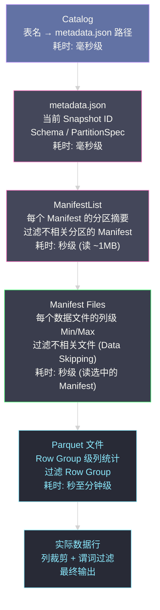

**摘要：**

[[Apache Iceberg]] 的查询性能优化是一个从粗到细的**多级过滤体系**：从 Catalog 的元数据解析（毫秒级），到 ManifestList 的分区摘要过滤（秒级），到 Manifest 的列级统计过滤（文件级 Data Skipping），再到 Parquet 内部的 Row Group 级过滤——每一层都在尽量减少下一层需要处理的数据量。本文深入解析这套多级过滤体系的完整执行路径，重点剖析列统计信息（lower_bounds/upper_bounds）如何驱动文件级 Data Skipping，以及 Iceberg 1.x 引入的行级删除（Row-level Delete）的两种实现方式（Position Delete 和 Equality Delete）在性能代价和适用场景上的根本差异。

---

## 第 1 章 Iceberg 查询执行的多级过滤体系

### 1.1 为什么需要多级过滤

一张典型的生产 Iceberg 表可能包含：
- 分区数：10,000+（按天 × 按地区的组合分区）
- 每分区文件数：50-200 个 Parquet 文件
- 总文件数：50 万至 200 万个

如果每次查询都需要扫描所有文件，查询耗时将以小时计。多级过滤的目标是：**在不读取数据文件的前提下，尽可能早地排除不相关的文件**。

Iceberg 的多级过滤从外到内分为四层：



### 1.2 完整查询示例的过滤路径

以查询 `SELECT user_id, event_type FROM events WHERE event_ts BETWEEN '2024-01-15' AND '2024-01-16' AND region = 'CN'` 为例（表按 `day(event_ts)` + `region` 双分区）：

```
第 1 层：Catalog 解析（< 10ms）
  读取 metadata.json 的位置
  → 获取当前 Snapshot：snap-v42
  → 获取 partition-spec：[day(event_ts), identity(region)]

第 2 层：ManifestList 分区摘要过滤（< 100ms）
  读取 ManifestList（约 500KB）
  过滤条件：
    event_ts_day: lower_bound ≤ day('2024-01-16') AND upper_bound ≥ day('2024-01-15')
    region: lower_bound ≤ 'CN' AND upper_bound ≥ 'CN'
  结果：1000 个 Manifest 中，有 3 个 Manifest 包含匹配的分区数据
  → 排除 997 个 Manifest（无需读取这些 Manifest 文件）

第 3 层：Manifest 列统计过滤（< 1s）
  读取选中的 3 个 Manifest 文件（每个约 1MB，共 3MB）
  每个文件条目有 lower_bounds / upper_bounds（Iceberg 文件级统计）
  进一步过滤：
    event_ts 的 lower_bound ≤ '2024-01-16' AND upper_bound ≥ '2024-01-15'
    region = 'CN'（通过分区值精确匹配）
  结果：3 个 Manifest 共约 3000 个文件条目，过滤后有 120 个文件需要扫描
  → 排除 2880 个文件（无需打开这些 Parquet 文件）

第 4 层：Parquet Row Group 过滤（< 10s）
  打开 120 个 Parquet 文件，读取各 Row Group 的列统计（Footer 中）
  进一步过滤 event_ts 精确范围内的 Row Group
  结果：120 个文件的约 1500 个 Row Group 中，有 200 个需要解压读取

实际数据读取（30-60s）：
  解压并扫描 200 个 Row Group，应用列裁剪（只读 user_id 和 event_type 列）
  最终输出满足条件的数据行
```

---

## 第 2 章 Manifest 列统计（Column Metrics）的细节

### 2.1 列统计的物理存储

Manifest File 中每个数据文件条目的列统计存储为 `lower_bounds` 和 `upper_bounds` 字段，使用 `map<int, bytes>` 格式（key 是 field-id，value 是二进制编码的统计值）：

```
lower_bounds 和 upper_bounds 的编码规则（Iceberg 规范）：
  int、long → 4/8 字节小端序整数
  float、double → IEEE 754 小端序
  string → UTF-8 字节
  date → 天数（从 epoch 起的整数），4 字节小端序
  timestamp → 微秒（从 epoch 起的整数），8 字节小端序
  binary → 原始字节
  boolean → 1 字节

例：
  lower_bounds[4] = "\x80\xa8\x00\x00\x00\x00\x00\x00"
    → field-id=4（event_ts 字段）的最小值 = 1704067200000000 微秒
      = 2024-01-01T00:00:00 UTC
```

Iceberg 还支持 `null_value_counts`（每列的 null 数量）和 `nan_value_counts`（浮点 NaN 的数量），这些统计信息用于更精细的过滤（如 `WHERE event_ts IS NOT NULL` 可以跳过全为 null 的文件）。

### 2.2 列统计的收集与限制

**统计信息在写入时自动收集**：Iceberg 的写入引擎在将数据文件写入 Parquet 时，同时扫描数据计算每列的 Min/Max，并写入 Manifest。这意味着**列统计信息在写入时有额外的 CPU 开销**（需要对每列求 Min/Max），但换来了查询时的显著加速。

**统计信息的精度限制**：

对于高基数字符串列（如 UUID），Min/Max 统计的过滤效果很差——UUID 的最小值和最大值跨度极大，几乎所有文件的范围都相互重叠，Data Skipping 无效。

```
高基数 UUID 列的 Min/Max 统计无效示例：
  文件 A：lower="00000000-...", upper="ffffffff-..."  ← 几乎覆盖所有 UUID
  文件 B：lower="00000001-...", upper="fffffffe-..."

  查询：WHERE event_id = '12345678-...'
  两个文件的范围都包含这个 UUID
  → 两个文件都无法跳过 → Data Skipping 无效
```

解决方案：对 UUID 列使用 `bucket[N]` 分区变换，将记录按哈希分组，使同一 Bucket 的 UUID 聚合在少数文件中，提升 bucket 级别的过滤效率（虽然不是精确的 Min/Max 过滤）。

### 2.3 截断列统计（Truncated Stats）

对于很长的字符串列，Iceberg 默认对列统计进行截断（truncate），以避免 Manifest 文件过大：

```python
# 配置列统计的截断长度（默认 16 字节）
spark.sql("""
ALTER TABLE analytics.events
SET TBLPROPERTIES (
  'write.metadata.metrics.column.url' = 'truncate(32)',  -- url 列截断到 32 字节
  'write.metadata.metrics.column.description' = 'none'  -- description 列不收集统计
)
""")
```

截断会降低 Data Skipping 的精度，但减小 Manifest 文件大小。对于查询频繁过滤但值很长的列，可以增大截断长度；对于从不用于过滤的列，设置为 `none` 避免浪费存储。

---

## 第 3 章 Row-level Delete：Iceberg 的行级删除机制

### 3.1 为什么需要行级删除

传统的 Copy-on-Write 删除模式（Hudi CoW 和 Delta Lake 默认）是：找到包含要删除记录的文件，重写该文件（排除要删除的记录），写出新版本文件。

```
CoW 删除代价：
  要删除 1 条记录（在一个 128MB 的 Parquet 文件里）
  → 读取 128MB
  → 过滤掉 1 条记录
  → 写出约 128MB 的新文件
  → 写放大：~1280x（128MB / 100B）

在 CDC 场景下，如果每次 DELETE 操作涉及少量记录（如撤单、数据修正），
CoW 删除的写放大代价极高
```

Iceberg 的 **Row-level Delete** 机制（类似 Hudi MoR 的精神）提供了一种低写放大的删除方案：**不重写数据文件，而是写入一个小的"删除标记文件"**，查询时在读取阶段应用删除标记。

### 3.2 两种删除文件类型

**类型一：Position Delete File（位置删除）**

记录"某个数据文件的某个行位置需要被删除"：

```
Position Delete 文件（Avro 格式）：
schema:
  file_path: string  ← 指向被删除行所在的数据文件
  pos:       long    ← 该文件内的行号（0-based）
  row:       ...     ← 可选：被删除行的原始内容（用于 CDC 场景记录 before-image）

示例内容：
  {file_path: "s3://bucket/events/data/00001-abc.parquet", pos: 1234}
  {file_path: "s3://bucket/events/data/00001-abc.parquet", pos: 5678}
  {file_path: "s3://bucket/events/data/00002-def.parquet", pos: 999}
```

查询时，Iceberg 读取数据文件的同时，应用 Position Delete：跳过 `pos` 指定的行。

**Position Delete 的写入代价极低**：删除 1000 条记录，只需写入一个约 30KB 的删除文件（每行约 30 字节），写放大接近 1x。

但它有一个**关键限制**：`pos` 是行在文件内的物理位置（偏移量）。一旦数据文件被 Compaction 重写（行的物理位置会变化），旧的 Position Delete 文件就失效了——Compaction 需要在重写时将 Position Delete 合并进去。

**类型二：Equality Delete File（等值删除）**

记录"满足某个键值条件的行需要被删除"（类似 Hudi 的 Equality Index）：

```
Equality Delete 文件（Parquet 格式）：
schema:
  event_id: string   ← 按主键删除

示例内容（按主键删除 3 条记录）：
  {event_id: "ev-12345"}
  {event_id: "ev-23456"}
  {event_id: "ev-34567"}

等效语义：
  DELETE FROM events WHERE event_id IN ('ev-12345', 'ev-23456', 'ev-34567')
```

查询时，Iceberg 对每一条读取到的数据行，检查其 `event_id` 是否在 Equality Delete 文件中——如果在，则该行被删除（不输出）。

**Equality Delete 的读取代价高**：查询需要在内存中构建 Equality Delete 的哈希集合，对每行数据做哈希查找。当 Equality Delete 文件积累多了（如几百个），这个哈希查找的内存和 CPU 开销非常显著。

### 3.3 两种删除方式的性能对比

| 维度 | Position Delete | Equality Delete |
|-----|----------------|----------------|
| **写入代价** | 极低（约 30 字节/行）| 低（取决于主键大小）|
| **读取代价** | 低（行级过滤，跳过指定行）| 高（哈希查找，随 Delete 文件数增加而增加）|
| **适用场景** | MERGE INTO、UPDATE、DELETE（通过扫描找到目标行的位置）| 按主键 DELETE（不需要知道行的物理位置）|
| **Compaction 依赖** | 强（数据文件重写后 Position Delete 失效）| 弱（Equality Delete 基于键值，与物理位置无关）|
| **多文件支持** | 每个 Position Delete 条目绑定到具体文件 | 一个 Equality Delete 文件可对多个数据文件生效 |
| **Iceberg 使用场景** | Copy-on-Write 替代（细粒度删除）| 主键 Upsert/Delete（Iceberg 的 Merge-on-Read 模式）|

> [!note] Iceberg 的 v2 格式与删除文件
> Iceberg 的 Format Version 2（`format-version: 2`）才支持 Row-level Delete。旧版本（v1）只支持文件级的 Replace（CoW 模式）。生产环境应使用 v2 格式（Iceberg 1.x 的默认格式），才能享受行级删除带来的写放大降低。

### 3.4 Merge-on-Read 模式（Iceberg 的 MoR 等价实现）

Iceberg 没有 Hudi 那样显式的 CoW/MoR 存储类型配置，但通过 `write.update.mode` 和 `write.delete.mode` 配置，可以实现类似 MoR 的行为：

```sql
-- 创建表时配置为 Merge-on-Read 模式（行级删除替代文件重写）
CREATE TABLE analytics.events (
    event_id  STRING,
    user_id   BIGINT,
    event_ts  TIMESTAMP,
    region    STRING
)
USING iceberg
TBLPROPERTIES (
  'format-version' = '2',
  'write.update.mode' = 'merge-on-read',  -- UPDATE 时写 Delete File + 新行，不重写文件
  'write.delete.mode' = 'merge-on-read',  -- DELETE 时写 Position Delete File
  'write.merge.mode'  = 'merge-on-read'   -- MERGE INTO 时使用 MoR 模式
);
```

在 `merge-on-read` 模式下：

```
DELETE FROM events WHERE event_id = 'ev-12345';

执行流程：
  1. 扫描 events 表，找到 event_id='ev-12345' 的行所在文件 + 行位置
  2. 写入 Position Delete 文件：
     {file_path: "data/00001-abc.parquet", pos: 1234}
  3. 提交新 Snapshot（包含 Position Delete 文件的引用）
  4. 原数据文件不变！

代价：写入约 30 字节的删除标记，极快
读取代价：每次查询需要过滤 Position Delete
```

```sql
-- 默认模式（Copy-on-Write）下相同的 DELETE：
DELETE FROM events WHERE event_id = 'ev-12345';

执行流程：
  1. 扫描找到目标行所在文件
  2. 读取整个文件（128MB）
  3. 过滤掉目标行，写出新文件（约 128MB）
  4. 提交新 Snapshot（新文件替换旧文件）

代价：读写约 256MB 的数据
```

---

## 第 4 章 Compaction：维持查询性能的后台保障

### 4.1 为什么需要 Compaction

随着 MoR 模式的写入积累，会产生两类问题：

**问题 1：小文件累积**

每次微批写入产生一批小文件（如每 5 分钟一批，每批 10 个 50KB 的文件）。S3 对象存储的 GET 请求有 10-50ms 的延迟，1000 个小文件的并发打开代价远高于 1 个 128MB 的大文件。

**问题 2：Delete File 积累**

Position Delete 和 Equality Delete 文件不断积累，每次查询需要加载和应用越来越多的删除标记，查询内存和 CPU 开销线性增长。

Iceberg 的 Compaction（`rewrite_data_files`）将这两类问题一并解决：将多个小数据文件合并为大文件，同时将积累的 Delete File 合并进去（物化删除结果）。

### 4.2 Compaction 的触发方式

**手动触发（Spark 过程调用）**：

```sql
-- 基本用法
CALL system.rewrite_data_files('analytics.events');

-- 带过滤（只 Compact 特定分区，避免不必要的全表重写）
CALL system.rewrite_data_files(
  table => 'analytics.events',
  where => 'event_ts >= timestamp ''2024-01-01T00:00:00'' 
             AND event_ts < timestamp ''2024-01-08T00:00:00''',
  options => map(
    'target-file-size-bytes', '134217728',   -- 目标文件大小 128MB
    'min-input-files', '5',                   -- 至少 5 个输入文件才触发
    'max-concurrent-file-group-rewrites', '10' -- 最多 10 个并发重写任务
  )
);
```

**自动 Compaction（Spark Structured Streaming 集成）**：

```python
# 在流式写入的 afterEach 回调中触发 Compaction
class CompactionCommitListener(StreamingQueryListener):
    def onQueryProgress(self, event):
        if event.progress.numInputRows > 1000000:  # 每次写入超过 100 万行时触发
            spark.sql("""
                CALL system.rewrite_data_files(
                    table => 'analytics.events',
                    options => map('min-input-files', '4')
                )
            """)

spark.streams.addListener(CompactionCommitListener())
```

### 4.3 Manifest 整合（rewrite_manifests）

除了数据文件的 Compaction，Iceberg 还提供 Manifest 文件的整合操作：

```sql
-- 整合 Manifest 文件（减少 ManifestList 中的条目数，加速元数据解析）
CALL system.rewrite_manifests('analytics.events');
```

当表经历了大量小批量写入后，ManifestList 中可能有数千个 Manifest 文件（每次写入产生一个）。`rewrite_manifests` 将多个小 Manifest 合并为少量大 Manifest，减少 ManifestList 的读取开销。

> [!warning] Compaction 的资源竞争
> Compaction 操作会大量消耗 CPU（解压/压缩 Parquet）和 IO（读写 S3）。在写入高峰期运行 Compaction 可能与正常写入竞争资源，导致写入延迟增加。最佳实践：在业务低峰期（如凌晨）运行 Compaction，或使用独立的 Spark 集群（与写入集群分离）运行 Compaction Job。

---

## 第 5 章 查询优化的总体策略

### 5.1 分区设计对查询性能的决定性影响

分区设计是 Iceberg 查询优化中影响最大的因素：

```
最优分区策略原则：
  1. 主要查询维度决定分区键
     → 如果 90% 的查询带 event_ts 范围过滤，按 day(event_ts) 分区
     → 如果查询经常 region 点查，考虑增加 identity(region) 作为第二分区键

  2. 分区粒度与数据量匹配
     → 目标：每个分区约 128MB-1GB 的数据（对应 1-8 个 Parquet 文件）
     → 数据量太少 → 过细分区，ManifestList 条目过多
     → 数据量太大 → 过粗分区，每次查询需要扫描过大的分区内数据

  3. 利用 Partition Evolution 随业务增长调整
     → 数据量从 10GB/天 增长到 1TB/天？
     → 从 month(event_ts) 演进到 day(event_ts)，无需重写历史数据
```

### 5.2 Sort Order（排序规范）：文件内数据布局优化

类似 [[Delta Lake]] 的 Z-Order，Iceberg 支持通过 `sort_order` 配置文件内的数据排列顺序，使高频查询的过滤列在 Parquet Row Group 内聚合，提升 Row Group 级别的 Data Skipping 效果：

```sql
-- 配置写入时的全局排序（按 user_id 聚合）
ALTER TABLE analytics.events
WRITE ORDERED BY user_id;

-- 配置 Compaction 时的局部排序（Z-Order 等价）
CALL system.rewrite_data_files(
  table => 'analytics.events',
  strategy => 'sort',
  sort_order => 'zorder(user_id, region)'  -- 多维 Z-Order
);
```

**Sort Order 的效果**：

```
无排序（随机写入）：
  Row Group 1：user_id 在 1-1000000 之间（随机分布）
  Row Group 2：user_id 在 1-1000000 之间（随机分布）
  查询 WHERE user_id = 12345：两个 Row Group 都无法跳过（Min/Max 都包含 12345）

按 user_id 排序写入：
  Row Group 1：user_id 在 1-100000 之间
  Row Group 2：user_id 在 100001-200000 之间
  ...
  查询 WHERE user_id = 12345：只有 Row Group 1 需要读取，其他 Row Group 跳过
  Data Skipping 效率：~99%
```

---

## 小结

Iceberg 查询优化的核心思想是**层次化剪枝 + 统计驱动的 Data Skipping**：

- **ManifestList 层**：基于分区摘要，快速排除整个 Manifest（包含数百至数千个文件）
- **Manifest 层**：基于文件级列统计（Min/Max），精确排除不含目标数据的 Parquet 文件
- **Parquet 层**：基于 Row Group 级统计，进一步减少解压缩数据量
- **Row-level Delete**：通过 Position/Equality Delete File 实现低写放大的行级删除，Compaction 定期合并恢复查询性能

下一篇 [[06 Iceberg vs Delta Lake vs Hudi——格式开放性与生态广度对比]] 将从 Iceberg 的视角，对三大数据湖方案做最终的架构总结，给出在云原生、多引擎场景下的选型建议。
