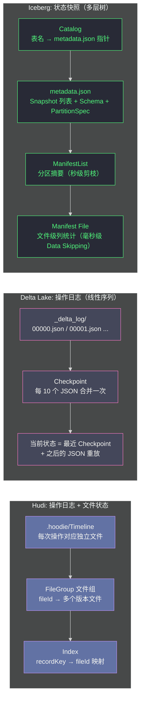

**摘要：**

本篇是 [[Apache Iceberg]] 专栏的收尾，也是对前五篇所有技术细节的综合汇总。经过对 Iceberg 三层元数据架构、Hidden Partitioning、乐观并发控制和行级删除的深度解析，我们可以从 Iceberg 的视角，精确地描述三大数据湖方案（[[Apache Hudi]]、[[Delta Lake]]、Apache Iceberg）在**格式开放性、多引擎生态、元数据架构、分区能力和云原生集成**五个维度上的本质差异。本文不以 Iceberg 为"最优解"，而以"适配特定场景的最优解"为选型原则——理解每个方案在什么场景下是最佳选择，比得出"谁更好"的结论更有工程价值。

---

## 第 1 章 三者的格式开放性：从本质上理解差异

### 1.1 "开放"的三个层次

在数据湖领域，"开放"是一个被过度使用的词。要精确区分三者的开放程度，需要把"开放"拆解为三个层次：

**层次 1：代码开源（Code Open Source）**

三者都是 Apache 许可证（Apache 2.0）的开源项目。这个层次上三者没有差异。

**层次 2：格式规范开放（Format Spec Open）**

这是最关键的差异层次：格式规范是否以独立文档形式发布，任何实现者不依赖特定框架的代码库就能完整实现？

```
Delta Lake：
  有 Delta Protocol 规范（https://github.com/delta-io/delta/blob/master/PROTOCOL.md）
  但规范的演进由 Linux Foundation Delta Lake 项目控制
  部分高级特性（Liquid Clustering、Deletion Vectors）的规范更新滞后于 Databricks 实现
  → 格式规范半开放：基础功能开放，高级特性受商业控制

Apache Hudi：
  没有独立的格式规范文档
  格式定义分散在 Java 代码中（`org.apache.hudi.common.model` 等包）
  其他语言（如 Python、C++）要实现 Hudi 读取，必须理解 Java 代码
  → 格式规范较封闭：事实上与 Java/Spark 实现耦合

Apache Iceberg：
  有完整的独立格式规范（https://iceberg.apache.org/spec/）
  规范用 JSON Schema / Avro Schema 描述，与任何实现语言无关
  任何语言的任何框架，只需按规范实现，即可读写 Iceberg 表
  → 格式规范完全开放：设计目标就是引擎无关的标准
```

**层次 3：生态互操作开放（Ecosystem Interoperability）**

即使规范开放，如果现实中只有一种引擎能高质量地读写，仍然是事实上的锁定。

```
多引擎读写质量（社区 2024 年状态）：
  Delta Lake：Spark（最优）> Flink（良好）> Trino/Presto（社区维护，有 Gap）
  Hudi：Spark（最优）> Flink（良好）> Trino（功能有缺口）
  Iceberg：Spark（最优）= Flink（最优）= Trino（最优）= Presto（良好）= StarRocks（良好）
```

### 1.2 为什么格式开放性在企业级场景至关重要

格式开放性的价值，在单一团队使用单一引擎时不明显，但在以下场景会变得决定性：

```
场景 1：数据湖 + 数据仓库混合架构
  数据工程团队用 Spark 写入数据湖
  数据科学团队用 Trino/Presto 做即席查询
  业务 BI 团队用 StarRocks 做 OLAP

  如果用 Delta Lake：Trino 读取 Delta 的体验不如 Iceberg
  如果用 Hudi：Trino 的 Hudi 连接器功能不完整（如不支持 MoR 的 Snapshot Query）
  如果用 Iceberg：三个引擎均有官方一流支持，体验一致

场景 2：云厂商服务集成
  AWS Athena：原生 Iceberg（还支持 Delta/Hudi，但 Iceberg 优先）
  AWS Glue：原生 Iceberg 格式支持
  Google BigQuery：支持 BigLake with Iceberg
  Snowflake：支持 Iceberg Tables（Snowflake 存储 + Iceberg 格式）

  Iceberg 已经成为云数据湖的事实标准，云厂商集成最完善

场景 3：跨组织数据共享
  A 公司用 Spark 写入 Iceberg 表，存在 S3
  B 公司用 Trino 直接查询 A 公司的 S3 Iceberg 表（只需读权限）
  无需 A 公司暴露任何 API，只需双方都实现 Iceberg 规范

  Delta Lake 和 Hudi 在这个场景下的互操作性不如 Iceberg
```

---

## 第 2 章 元数据架构的根本差异

### 2.1 三种元数据哲学

理解三者的元数据架构差异，是理解它们所有性能特征的基础：



| 元数据维度 | Hudi | Delta Lake | Iceberg |
|-----------|------|-----------|---------|
| **设计思想** | 操作日志 + 文件组索引 | 操作日志（线性序列）| 状态快照（层次树）|
| **Time Travel 实现** | Timeline 时间戳直查 | 重放 JSON 日志到 Checkpoint | 直接索引到目标 Snapshot |
| **元数据扫描开销** | 中（Timeline 文件数线性增长）| 中（需要读 Checkpoint + N 个 JSON）| 低（三层剪枝，按需读取）|
| **大表扩展性** | 中（文件数多时 Timeline 扫描慢）| 中（Checkpoint 机制缓解，但仍受限）| **高**（Manifest 分层，理论无上限）|
| **写操作元数据开销** | 低（只写 Timeline 小文件）| 低（只追加一个 JSON）| 中（写 Manifest + ManifestList）|

### 2.2 Iceberg 元数据在超大规模下的优势

当表规模超过 PB 级（数百万个文件）时，Iceberg 的三层元数据架构体现出决定性优势：

```
对比场景：一张有 100 万个文件的 Iceberg 表

Delta Lake：
  Checkpoint 记录全部 100 万个文件的 Add Action
  → Checkpoint 文件本身就有数 GB 大小
  → 每次读取 Checkpoint = 读取数 GB 的 Parquet 文件
  → 在此基础上再应用增量 JSON 日志

Hudi：
  Timeline 文件数量随 Commit 次数增长
  每次读取 Timeline = 列举 .hoodie/ 目录下所有文件
  → 当 Commit 积累到数万次时，目录列举本身就是瓶颈

Iceberg：
  ManifestList 记录所有 Manifest 文件（假设 1000 个 Manifest，每个管理 1000 个数据文件）
  ManifestList 大小 ≈ 1000 条 × ~100 字节 = 100KB
  查询过滤后只需读取 3 个 Manifest（~3MB）
  → 总元数据读取：~3MB，无论总文件数多少，始终维持这个量级
```

---

## 第 3 章 分区能力的代际差异

### 3.1 三代分区模型

数据湖的分区模型经历了三代演进，三种方案分别代表了不同的代际：

```
第一代（Hive 模型）：目录层次分区
  分区 = 目录路径（date=2024-01-01/）
  分区列 = 用户手动维护的冗余列
  分区演进 = 不可能，需要重写历史数据
  代表：Hive、早期 Delta Lake、Hudi

第二代（Iceberg 模型）：元数据层分区
  分区 = 元数据中的变换规则（month(event_ts)）
  分区列 = 不存在，查询时自动推导
  分区演进 = 原地演进，无需重写历史数据
  代表：Iceberg
  
第三代（LSM 流存储）：行级排序而非文件分区
  "分区" = LSM-Tree 的 KeyRange（如 Paimon）
  代表：Apache Paimon（下一个专栏主角）
```

Hudi 和 Delta Lake 的分区模型本质上是第一代（目录层次）——它们添加了 ACID 事务和 Upsert 能力，但分区的根本设计没有改变。Iceberg 是第一个在生产级别实现了第二代分区模型的系统。

### 3.2 分区变换函数的工程价值量化

Iceberg 的五种分区变换函数（identity、year/month/day/hour、truncate、bucket）在实际工程中的价值：

```
场景：事件表（每天 10 亿条记录）按 event_ts 分区

传统方案（第一代，按天 date 分区）：
  写入：用户必须在记录中保留冗余 date 字段
  查询：WHERE event_ts >= '2024-01-01' 不触发分区剪裁（全表扫描！）
        必须写 WHERE date = '2024-01-01' 才有效
  分区演进：要从按天改为按小时，需要重写全部历史数据（PB 级）

Iceberg 方案（第二代，按 day(event_ts) 隐藏分区）：
  写入：用户只写 event_ts，不需要 date 字段
  查询：WHERE event_ts >= '2024-01-01' 自动触发分区剪裁（只扫描一天数据）
  分区演进：从 day 改为 hour，执行一条 ALTER TABLE 命令，历史数据无需重写

量化收益：
  - 消除冗余分区列：Schema 更简洁，存储节省约 5%（date 列的冗余）
  - 消除分区列陷阱：按时间戳过滤的查询自动受益，无需培训和代码审查
  - 分区演进成本：从"PB 级数据重写（数天）"降为"一条 DDL（秒级）"
```

---

## 第 4 章 云原生生态：Iceberg 的决定性优势

### 4.1 主流云服务的 Iceberg 集成现状

Iceberg 在云原生数据湖场景下已经形成了难以撼动的生态优势：

| 云服务 | Iceberg 支持 | Delta Lake 支持 | Hudi 支持 |
|-------|------------|----------------|----------|
| **AWS Athena** | ✅ 原生一等公民 | ✅ 支持（Delta Protocol）| ✅ 支持 |
| **AWS Glue Data Catalog** | ✅ 原生 Iceberg Catalog | ⚠️ 有限支持 | ⚠️ 有限支持 |
| **AWS S3 Tables** | ✅ 专为 Iceberg 设计 | ❌ | ❌ |
| **Google BigQuery** | ✅ BigLake Iceberg | ❌ | ❌ |
| **Google Dataproc** | ✅ 原生集成 | ✅ | ✅ |
| **Azure Synapse** | ✅ 通过 Delta UniForm 间接 | ✅ 原生 | ⚠️ 有限 |
| **Snowflake** | ✅ Iceberg Tables | ❌ | ❌ |
| **Databricks** | ✅ 通过 UniForm | ✅✅ 原生最优 | ✅ |
| **Trino** | ✅✅ 官方一等公民 | ✅ | ⚠️ 功能有缺 |
| **StarRocks/Doris** | ✅✅ 广泛使用 | ✅ | ✅ |

**AWS S3 Tables** 是 Iceberg 生态地位的最强信号：这是 AWS 在 2024 年发布的、专门为 Iceberg 格式优化的对象存储服务，将 Iceberg 元数据管理直接集成到 S3 存储层，彻底消除了 Manifest 文件的读写开销。这个服务只支持 Iceberg，不支持 Delta Lake 或 Hudi——这表明 AWS 在云原生数据湖标准上已经做出了明确的押注。

### 4.2 REST Catalog：Iceberg 生态的标准化接口

[[REST Catalog]] 是 Iceberg 社区在 2022 年提出的 Catalog 标准接口规范，定义了一套 HTTP REST API 用于管理 Iceberg 表的元数据：

```
REST Catalog 核心 API：
  GET  /v1/namespaces                           ← 列出所有命名空间
  GET  /v1/namespaces/{ns}/tables              ← 列出命名空间下的所有表
  GET  /v1/namespaces/{ns}/tables/{table}      ← 获取表的最新 metadata.json 位置
  POST /v1/namespaces/{ns}/tables/{table}/transactions/commit  ← 原子提交事务
  GET  /v1/namespaces/{ns}/tables/{table}/snapshots           ← 列出 Snapshot 历史

REST Catalog 的意义：
  任何引擎（Spark/Flink/Trino/DuckDB）只需实现这个 HTTP 客户端
  就能连接任何实现了 REST Catalog 的服务（AWS Glue、Snowflake Open Catalog、自研服务）
  → 彻底解耦引擎与 Catalog 后端
  → Delta Lake 和 Hudi 没有等价的标准化 Catalog 协议
```

REST Catalog 的出现，使得 Iceberg 从一个"表格式规范"升级为一个完整的"开放数据湖协议栈"——格式规范 + Catalog 协议 + 多引擎生态，三层全部标准化。

---

## 第 5 章 场景化选型的最终建议

### 5.1 从 Iceberg 视角看三者的互补关系

经过本专栏对 Iceberg 内部机制的深度解析，可以从 Iceberg 的视角给出一个更精准的三者互补关系描述：

```
Hudi 强在写入侧（Write-side Optimization）：
  → 记录级 Index + MoR 存储：Upsert 写入效率最高
  → Timeline 增量消费：CDC 场景的最自然选择
  → 弱点：多引擎支持不如 Iceberg，分区能力第一代

Delta Lake 强在平台侧（Platform-side Optimization）：
  → 在 Databricks 平台上的集成深度无可比拟
  → 事务隔离级别最精细（3 种配置）
  → DML 操作（MERGE/UPDATE/DELETE）的语义最完善
  → 弱点：引擎绑定（非 Databricks 场景体验下降），分区能力第一代

Iceberg 强在格式侧（Format-side Optimization）：
  → 三层元数据：超大规模下查询性能最稳定
  → Hidden Partitioning + Partition Evolution：分区能力第二代
  → REST Catalog + 多引擎一流支持：开放生态最广
  → 弱点：没有记录级 Index，Upsert 效率不如 Hudi
           MoR 功能（Row-level Delete）相对 Hudi 的 MoR 还在成熟中
```

### 5.2 选型决策矩阵（最终版）

| 决策维度 | 如果你的答案是... | 推荐方案 |
|---------|---------------|---------|
| **主要写入模式** | 高频 CDC Upsert（按主键更新）| **Hudi** |
| | 批量追加 + 偶发 DML | **Iceberg 或 Delta** |
| | 纯追加（日志/事件流）| **Iceberg**（格式最轻量）|
| **引擎栈** | 纯 Databricks 平台 | **Delta Lake** |
| | Spark + Trino/Presto | **Iceberg** |
| | Spark + Flink 混合 | **Iceberg 或 Hudi** |
| | 多云 / 云原生优先 | **Iceberg** |
| **分区需求** | 分区方案确定，不需要演进 | 三者均可 |
| | 需要 Partition Evolution | **Iceberg**（唯一原生支持）|
| | 高频查询用函数过滤时间列 | **Iceberg**（自动分区推导）|
| **增量消费** | 下游只需最新状态 | **Hudi**（Incremental Query）|
| | 需要完整变更流水（CDC 明细）| **Delta Lake**（CDF）|
| | 不需要增量消费 | 三者均可 |
| **数据规模** | < 100TB，单一团队 | 三者均可 |
| | > 1PB，超大规模 | **Iceberg**（元数据扩展性最强）|
| | 多组织数据共享 | **Iceberg**（REST Catalog 标准）|
| **运维偏好** | 极简，不想维护后台任务 | **Iceberg 或 Delta**（无强制 Compaction）|
| | 可以接受 Compaction 调度 | **Hudi MoR**（写延迟最低）|

### 5.3 三方共存的混合架构（现实选择）

在实际的大型数据平台中，往往不是"选一个用到底"，而是根据不同数据集的特征选择最适合的格式：

```
典型混合架构：

ODS 层（原始 CDC 数据，高频 Upsert）：
  → Hudi（MoR + Bucket Index）
  → 写入效率最高，增量消费支持最完善

DWD 层（清洗后的明细数据，批量覆写 + BI 查询）：
  → Iceberg
  → 多引擎访问（Spark 写入 + Trino BI 查询 + Flink 流读）
  → Hidden Partitioning 简化运维

DWS 层（聚合指标，在 Databricks 平台上）：
  → Delta Lake
  → DLT（Delta Live Tables）管理聚合逻辑
  → Z-Order + Data Skipping 优化 BI 查询

实时层（低延迟流存储 + 查询）：
  → Apache Paimon（下一个专栏的主角）
  → LSM-Tree 存储，写延迟最低（秒级），Flink 原生
```

---

## 第 6 章 Iceberg 的未来方向

### 6.1 Iceberg v3 格式

Iceberg v3（规范草案中）正在引入以下新能力：

- **Row Lineage（行级血缘）**：每行数据自动关联写入它的 Snapshot ID，支持更精细的数据溯源
- **Default Value（列默认值）**：Schema Evolution 时新增列的默认值管理
- **Nanosecond Timestamps**：支持纳秒精度时间戳，满足高精度事件时序场景
- **Geospatial Type**（实验性）：原生地理空间数据类型支持

### 6.2 Apache Polaris / Snowflake Open Catalog

2024 年，Snowflake 开源了 Apache Polaris（Polaris Catalog），一个基于 Iceberg REST Catalog 标准的开源 Catalog 服务。这是 Iceberg 生态发展的重要里程碑——一个中立的、开源的、生产级的 Catalog 服务使得企业可以在不绑定任何云厂商的前提下，部署完整的 Iceberg 生态栈。

### 6.3 与 Paimon 的互补关系

[[Apache Paimon]]（下一个专栏的主角）代表了分区模型的第三代演进——基于 LSM-Tree 的行级流存储。它不与 Iceberg 竞争，而是与 Iceberg **互补**：

```
Iceberg 的定位：
  批处理 + OLAP 查询的数据湖标准格式
  写入以批量追加为主（Flink/Spark 微批）
  
Paimon 的定位：
  流计算 + 低延迟存储的实时数据湖格式
  写入以高频流式 Upsert 为主（Flink 流写）

典型分工：
  实时数据（秒级延迟）→ Paimon
  准实时到批量数据（分钟至小时级）→ Iceberg
```

---

## 小结：Iceberg 专栏总结

本专栏六篇文章，从 Netflix 的工程困境出发，系统解析了 Iceberg 的核心技术：

| 篇章 | 核心要点 |
|-----|---------|
| **01** | HMS 的三大缺陷；Iceberg 将"表"从目录结构升级为元数据规范的本质创新 |
| **02** | 三层元数据（metadata.json → ManifestList → Manifest）的层次剪枝；列 ID 机制使 Schema Evolution 最完善 |
| **03** | Hidden Partitioning 消除分区列陷阱；Partition Evolution 让分区方案原地演进无需重写历史数据 |
| **04** | Catalog 原子 CAS 操作是所有事务的物理基础；OCC 使追加密集场景的并发吞吐最高 |
| **05** | 四层过滤体系（Catalog → ManifestList → Manifest → Parquet）；Position/Equality Delete 的性能权衡；Compaction 的必要性 |
| **06** | 格式开放性三个层次；云原生生态（AWS S3 Tables/Snowflake/Athena）押注 Iceberg；REST Catalog 标准化接口 |

**Iceberg 的核心价值主张**：不是"最快的写入"，不是"最深的 Spark 集成"，而是**"在最大规模、最多引擎的场景下，提供最一致、最可靠的表格式标准"**。

下一个专栏将进入 [[Apache Paimon]]，探索为 [[Apache Flink]] 流计算原生设计的第三代数据湖存储——它用 LSM-Tree 代替 Copy-on-Write 文件替换，将流式写入延迟从分钟级压缩到秒级，是实时数仓架构的重要基础。


> [!note] 思考题
> 1. Iceberg 格式规范完全公开（任何引擎都可按 Spec 实现读写）；Delta 3.0 开源了协议但高级功能仍是 Databricks 私有；Hudi 是开源 Apache 项目但 Java SDK 与实现紧密绑定。"格式开放性"与"生态成熟度"通常相互制衡——开放性最高的格式（Iceberg）生态是否一定最成熟？
> 2. 在跨云、跨数据中心的数据共享场景（AWS + Azure 双云部署），哪种格式的 Catalog 架构更容易支持这种部署？Project Nessie（类 Git 的数据湖版本管理）与 Iceberg 的结合能带来什么额外价值？
> 3. 如果一个新数据平台的主要计算引擎是 Flink（而不是 Spark），且需要同时支持高频 CDC Upsert 和低延迟分析查询，在 Hudi、Delta、Iceberg 三者之间如何选择？选择的核心依据是什么？