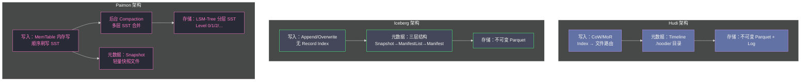

**摘要：**

本文从一个在 2021 年前后困扰着大量实时数仓工程师的真实问题出发：**为什么用 [[Apache Flink]] 向数据湖（[[Apache Hudi]]、[[Apache Iceberg]]）写入数据，数据新鲜度始终无法突破 5-10 分钟的瓶颈？** 分析根本原因后，我们将理解这不是 Flink 的问题，也不是 Hudi/Iceberg 的问题，而是"不可变文件 + 微批提交"这个根本架构模式在高频写入场景下的天花板。[[Apache Paimon]] 用一个来自数据库领域已有 40 年历史的设计——**[[LSM-Tree]]（Log-Structured Merge-Tree）**——打破了这个天花板。理解 Paimon 为什么选择 LSM-Tree，是理解它与 Hudi/Iceberg 所有架构差异的起点。

---

## 第 1 章 实时数仓的延迟困境

### 1.1 2021 年的真实工程场景

2021 年，阿里巴巴的数据团队面临一个典型问题。他们的实时数仓架构是：

```
MySQL/OceanBase（在线业务库）
    ↓（Flink CDC 实时捕获变更）
Kafka（变更事件流）
    ↓（Flink 消费 + 处理）
Hudi/Iceberg 数据湖（离线 + 准实时查询）
    ↓
Hive / Presto / Trino（查询）
```

这个架构在理论上可以做到分钟级的数据新鲜度——MySQL 的变更通过 Flink CDC 几乎实时捕获，Kafka 的消费延迟在秒级。问题出在最后一步：**Flink 向 Hudi/Iceberg 写入数据的延迟**。

实际测量下来，端到端延迟（从 MySQL 变更到 Hudi 表可查询）始终在 **5-15 分钟**，无论怎么调优都无法突破这个壁垒。

### 1.2 延迟的根本来源：Checkpoint 驱动的微批提交

要理解这个 5-15 分钟延迟的根因，需要深入 Flink 写入 Hudi/Iceberg 的执行模型。

**Flink 写 Hudi/Iceberg 的流程（简化）**：

```
Flink 消费 Kafka 事件流（连续，每秒数千条记录）

每隔 N 分钟触发 Checkpoint：
  Step 1：Flink Checkpoint 开始
         → 向所有 Operator 发送 Barrier（屏障）
         → 等待所有 Operator 的 State 快照完成
         ← 耗时：30 秒 ~ 2 分钟（取决于状态大小）

  Step 2：Checkpoint 完成后，触发 Commit
         → Flink Sink（Hudi/Iceberg Writer）将本次 Checkpoint 内
           积累的数据文件提交到 Hudi/Iceberg 的元数据
         → 提交后，数据对读者可见
         ← 耗时：10 秒 ~ 1 分钟

  Step 3：下次 Checkpoint 前，Flink 继续消费并缓冲数据
         → 这段时间的数据在内存或 Buffer 中，对任何读者不可见
```

**关键约束**：Flink 的 exactly-once 语义要求 Hudi/Iceberg 的 Commit 必须在 Checkpoint 完成后才能执行——这保证了即使 Job 崩溃重启，已 Commit 的数据是完整的（没有重复也没有丢失）。

这意味着：**数据从 Kafka 消费到 Hudi/Iceberg 可查询，至少需要等待一个完整的 Checkpoint 周期**。Checkpoint 间隔越短，数据新鲜度越好，但：

```
Checkpoint 间隔 → 数据新鲜度    反向影响

Checkpoint 间隔 = 1 分钟：
  → 数据新鲜度：约 1-3 分钟
  → 每分钟一次 Commit，每次产生大量小文件（Hudi/Iceberg 没有 MemTable 缓冲写放大）
  → S3 上每小时产生数千个小文件（1440 次 Commit × 10+ 文件/次）
  → 小文件问题严重：查询时打开文件数过多，性能下降

Checkpoint 间隔 = 5 分钟：
  → 数据新鲜度：5-10 分钟
  → 每次 Commit 合并 5 分钟的数据，文件大小合理（128MB 级别）
  → 小文件问题缓解，但数据新鲜度牺牲

Checkpoint 间隔 = 10 分钟：
  → 数据新鲜度：10-20 分钟（加上 Checkpoint 本身耗时）
  → 小文件问题好，但实时性完全丧失
```

这就是"实时写湖延迟困境"的本质：**Hudi/Iceberg 的文件级提交模型，无法在保持合理文件大小的同时实现低数据延迟**。

### 1.3 为什么 Hudi MoR 也解决不了这个问题

[[Apache Hudi]] 的 MoR（Merge-on-Read）表在每次 deltacommit 时只追加日志文件，写入很快——但这只解决了"写放大"问题，没有解决"提交延迟"问题。

```
Hudi MoR 的 deltacommit 流程（Flink 场景）：
  仍然需要在 Flink Checkpoint 完成后才能 deltacommit
  → 数据可见延迟 = Checkpoint 间隔 + Checkpoint 执行时间
  → 仍然是分钟级

唯一的改进：
  每次 deltacommit 写入的是小日志文件（.log），不是大 Parquet 文件
  → 小文件问题相对缓解
  → 但日志文件积累后 Compaction 的代价同样不小
```

即便是 Hudi 最轻量的写入模式，数据新鲜度的天花板仍然是 Checkpoint 间隔，通常无法做到分钟内。

### 1.4 Paimon 的根本性解答：解耦写入与可见性

Paimon 团队（最初是阿里巴巴 Flink 团队）对这个问题的分析是：

> 延迟不是 Flink 的问题，而是"文件系统上的不可变文件"这个存储模型的问题。不可变文件意味着每次"发布"新数据都需要一次文件提交（Commit），Commit 必须等 Checkpoint 完成，所以延迟被 Checkpoint 周期下限约束。

解法方向是：**引入一种支持高频写入而不需要高频 Commit 的存储结构**。

这个解法在数据库领域已经存在了 40 年：**LSM-Tree（Log-Structured Merge-Tree）**。

---

## 第 2 章 LSM-Tree 的核心思想

### 2.1 LSM-Tree 解决的问题

[[LSM-Tree]] 最初由 Patrick O'Neil 等人于 1996 年提出，被 [[LevelDB]]、[[RocksDB]]、[[Apache HBase]]、[[Apache Cassandra]] 等系统广泛使用。它的设计目标是：**在随机写入（如按主键更新）场景下，实现接近顺序写的吞吐量**。

为什么传统存储对随机写慢？以 B-Tree（关系数据库的标准索引）为例：

```
B-Tree 随机写入问题：
  写入 key=12345, value=新值
  → 在 B-Tree 中查找 key=12345 的位置（可能是任意磁盘位置）
  → 读取该磁盘页（随机读）
  → 在页内修改值
  → 写回该磁盘页（随机写）

随机 IO 的代价（HDD 时代）：
  HDD 随机写：100-200 IOPS（每秒 100-200 次 IO）
  HDD 顺序写：100MB/s（相当于 100000+ IOPS）
  性能差距：1000 倍！
```

LSM-Tree 的核心思想是：**不做随机写，只做顺序写**。具体策略是：

```
LSM-Tree 写入策略：
  1. 新写入先进内存（MemTable）
     → 内存中保持有序结构（如跳表 SkipList）
     → 内存写入速度 = 内存速度（极快）

  2. 内存满了，顺序刷写到磁盘（生成 SST 文件，Level 0）
     → 顺序写，速度快
     → 每个 SST 文件内部有序（按 key 排序）

  3. 后台异步合并（Compaction）
     → 将多个 SST 文件合并，去除重复 key 的旧版本
     → 合并后文件层级上升（Level 0 → Level 1 → Level 2 ...）
     → 读取时合并多层（用堆排序）

写入代价：顺序写（快）+ 内存写（极快）
读取代价：需合并多层 SST 文件（比 B-Tree 稍慢）
```

这就是 LSM-Tree 的核心权衡：**用读放大换写放大**——写入极快（只做顺序写），读取时合并多层数据（有额外开销）。

### 2.2 LSM-Tree 如何解决数据湖的流式写入问题

Paimon 把 LSM-Tree 的思想应用到数据湖场景，解决了以下关键问题：

**解决"高频写入 = 海量小文件"问题**：

```
传统数据湖写入（Hudi/Iceberg）：
  Flink 每秒写 1000 条记录
  每次 Checkpoint（5 分钟）生成一批文件（如 10 个 Parquet，每个 5MB）
  → 每小时产生 120 个文件（每分钟 2 批）
  → 每天产生 2880 个文件（仅一个分区）
  → 随时间积累，小文件问题严重

Paimon 写入：
  Flink 每秒写 1000 条记录 → 先进入 MemTable（内存）
  MemTable 满后（如 256MB）顺序刷写到 Level 0 SST 文件
  Level 0 文件积累后，后台 Compaction 合并到 Level 1/2（大文件）
  → 数据在内存中的积累与 Checkpoint 解耦
  → 小文件生命周期短（很快被 Compaction 合并），不在 S3 上永久积累
```

**解决"数据可见性依赖 Checkpoint"的问题**：

Paimon 通过在写入流程中引入独立的"可见性提交"（Snapshot Commit）机制，允许在 Flink Checkpoint 之间发布数据快照，使数据对读者更频繁地可见：

```
Paimon 的写入可见性模型（简化）：
  Flink Checkpoint 间隔：5 分钟（保证 exactly-once）
  数据快照发布间隔：10 秒（数据对读者可见）
  
  两者解耦：
  - 快照发布不需要等 Checkpoint（只是"最新的内存 + L0 文件"对外可见）
  - Checkpoint 保证的是"崩溃恢复时不丢数据"，与可见性是正交的
  
  数据新鲜度：约 10-30 秒（取决于配置）
  vs Hudi/Iceberg：5-15 分钟
```

> [!info] 秒级 vs 分钟级的工程价值
> 数据新鲜度从分钟级提升到秒级，对以下场景有决定性意义：
> - **实时大屏**：电商大促的实时 GMV 统计，需要秒级刷新
> - **风控系统**：用户行为异常检测，分钟级延迟可能导致损失已发生
> - **实时维表**：流计算中的 Lookup Join，维表数据越新，业务逻辑越准确
> - **准实时报表**：业务运营在上午 9 点查看昨晚 23:59 的最终数据

---

## 第 3 章 Paimon 的整体架构

### 3.1 Paimon 与 Flink 的原生绑定关系

Paimon 最初叫做 **Flink Table Store**，这个名字直接揭示了它的设计定位：不是一个独立的通用数据湖框架，而是 **Flink 的"原生存储层"**。

这种原生绑定关系体现在：

```
1. Flink 流写是 Paimon 的第一公民
   → Flink 的 Checkpoint 机制与 Paimon 的提交协议深度集成
   → Flink 的 Watermark 机制与 Paimon 的 Compaction 触发器集成

2. Flink SQL 作为主要操作界面
   → DDL（建表/改表）→ Flink SQL
   → DML（写入/查询）→ Flink SQL / Spark SQL
   → 无需专门的 "Paimon Client" SDK

3. Flink 的 State 机制用于 Paimon 的 MemTable 管理
   → MemTable 数据存在 Flink Operator State 中
   → Checkpoint 时持久化 MemTable 状态（防止崩溃丢数据）
```

Paimon 也支持 Spark（批处理读写）、Trino/Presto（查询）等其他引擎，但 Flink 场景是设计优先级最高的。

### 3.2 Paimon 的物理存储结构

```
表根目录（S3/HDFS）/
├── manifest/                    ← 元数据层（类似 Iceberg 的 ManifestList）
│   ├── manifest-list-snap-1.avro
│   └── manifest-abc.avro
├── snapshot/                    ← 快照层（每次 Commit 生成一个快照文件）
│   ├── LATEST                   ← 指向最新快照 ID 的文件
│   ├── EARLIEST                 ← 指向最早保留快照 ID 的文件
│   ├── snapshot-00000001        ← 快照 1 的元数据（JSON）
│   └── snapshot-00000002        ← 快照 2 的元数据
├── schema/                      ← Schema 版本管理
│   └── schema-0                 ← Schema 定义（JSON）
└── partition=2024-01-01/        ← 分区目录（支持 Hive 风格分区）
    └── bucket-0/                ← Bucket 目录（按 bucket 分桶）
        ├── data-xxx.orc         ← Level 0 数据文件（刚刷写的 SST）
        ├── data-yyy.orc         ← Level 1 数据文件（经过 Compaction）
        └── data-zzz.orc         ← Level 2 数据文件（高层，最稳定）
```

注意 Paimon 的数据文件格式默认是 **ORC**（也支持 Parquet、Avro），而不是其他数据湖普遍使用的 Parquet。这是因为 ORC 在小文件随机写场景下的压缩效率略优于 Parquet，更适合 LSM-Tree 的 Level 0 小文件场景。

### 3.3 Paimon 与其他三者的整体架构对比



---

## 第 4 章 Paimon 与 Hudi/Iceberg 的本质差异

### 4.1 存储模型的代际差异

Hudi 和 Iceberg 都基于**不可变文件（Immutable File）** 模型——数据文件一旦写出就不再修改，更新通过写新文件（CoW）或追加日志（MoR）来实现。这个模型天生适合批处理（大批量写入，每次写完整文件），但对高频流式写入不友好。

Paimon 基于 **LSM-Tree（可变 MemTable + 分层不可变 SST）** 模型——数据先写入可变的内存结构（MemTable），内存满后顺序刷写到磁盘，多个小文件通过后台 Compaction 合并为大文件。这个模型天生适合高频写入（内存写速度接近顺序写）。

```
不可变文件模型（Hudi/Iceberg）的流式写入天花板：
  数据可见性 = 文件提交（Commit）的频率
  Commit 频率受限于 Checkpoint 间隔
  → 数据新鲜度天花板：~ 5-10 分钟

LSM-Tree 模型（Paimon）的流式写入上限：
  数据可见性 = 快照发布频率（独立于 Checkpoint）
  快照发布极轻量（只写一个小的 JSON 快照文件）
  → 数据新鲜度：~ 10-30 秒
```

### 4.2 Paimon 不适合的场景

Paimon 的 LSM-Tree 模型带来低写延迟，但也有代价：

```
LSM-Tree 的固有代价（Paimon 继承）：

1. 读放大（Read Amplification）：
   查询时可能需要合并多层 SST 文件（Level 0, 1, 2...）
   直到后台 Compaction 把 Level 0 的小文件合并到高层，读放大才降低
   → 在 Compaction 不及时的情况下，查询性能不如 Hudi CoW 或 Iceberg

2. Compaction 资源消耗：
   后台 Compaction 持续消耗 CPU 和 IO
   在 Flink Job 资源紧张时，Compaction 可能与主写入流程竞争
   → 需要为 Compaction 预留额外资源

3. 空间放大（Space Amplification）：
   同一条记录可能在多个 SST 层中有旧版本
   直到 Compaction 清理旧版本，存储空间占用高于实际数据量
   → 空间使用率不如 Hudi/Iceberg（CoW 每次只保留最新版本文件）

适合 Paimon 的场景：
  ✅ 高频流式 Upsert（Flink CDC、实时维表写入）
  ✅ 秒级数据新鲜度要求（实时大屏、实时风控）
  ✅ Flink 流计算 + 查询混合场景（Lookup Join）

不适合 Paimon 的场景：
  ❌ 低频大批量 ETL（Hudi CoW 或 Iceberg 更适合）
  ❌ 多引擎混合访问（Iceberg 的生态更广）
  ❌ 纯 Spark 批处理栈（Paimon 的 Spark 支持不如 Iceberg 完善）
```

---

## 小结

Paimon 的诞生解决了 Flink 实时写湖场景中"不可变文件模型的分钟级延迟天花板"问题，其核心武器是 LSM-Tree——这个在 [[RocksDB]]、[[HBase]]、[[Cassandra]] 中已经被广泛验证的存储设计，第一次被系统性地应用到数据湖场景。

**Paimon 的核心价值主张**：在 Flink 流计算生态中，提供秒级延迟的流式 Upsert + ACID 语义 + 可查询的存储层——这是 Hudi 和 Iceberg 在 2022 年之前无法达到的。

下一篇 [[02 LSM-Tree 存储引擎——为什么用 LSM 而非 CoW 文件覆盖]] 将深入 Paimon 的 LSM-Tree 实现细节：MemTable 的数据结构、SST 文件的分层合并策略、Compaction 的触发机制，以及 Paimon 如何在 HDFS/S3 等对象存储（不支持随机写）上实现 LSM-Tree 的核心语义。


> [!note] 思考题
> 1. Paimon 的核心洞察是"解耦写入路径和可见性路径"——数据写入后立即可见，LSM Compaction 在后台异步完成。这与 Hudi MoR 的"写 Log 文件，查询时合并"类似。Paimon 的 LSM 分层设计如何比 Hudi MoR 的"Base 文件 + Log 文件"更有效地控制读放大？在"尚未 Compaction"的状态下，两者的查询性能退化程度有什么本质差异？
> 2. Paimon 起源于 Flink 社区（最初名为 Flink Table Store），与 Flink 集成最为紧密。对于 Paimon 的主键表（Primary Key Table），Spark 读取时需要理解 LSM 的多层文件结构并在读取时合并。Spark 的 Paimon Connector 实现了这个合并逻辑吗？如果 Spark 只读取了 Level-0 的文件而没有合并，会读到不一致的数据吗？
> 3. Paimon 将"秒级可见"作为核心卖点，但这依赖 Checkpoint 触发的提交频率（如 Flink Checkpoint 间隔为 30 秒，则数据可见延迟约 30 秒）。在需要真正毫秒级可见性的场景（如实时风控），30 秒的延迟是否可以接受？Paimon 有没有比 Checkpoint 更频繁的提交机制？