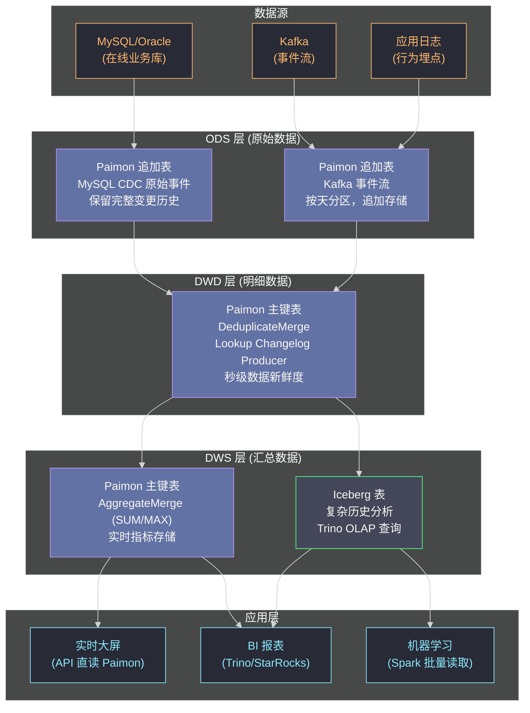

**摘要：**

本篇是 [[Apache Paimon]] 专栏的收尾，也是三个数据湖专栏（[[Apache Hudi]]、[[Apache Iceberg]]、Apache Paimon）的最终汇总。经过对 Paimon 的 LSM-Tree 存储引擎、双表模型、Changelog Producer 和 Lookup Join 的深度解析，本文将从**流存储能力**这个 Paimon 的核心差异化维度出发，对四大方案（包含 [[Delta Lake]]）做全面的架构级对比。重点不在于"谁更好"，而在于**理解每个方案在什么约束条件下是最优解**——特别是在实时数仓、流批一体这个 Paimon 最强的赛道上，四者之间的差距到底有多大，体现在哪些具体的工程细节上。

---

## 第 1 章 从存储模型出发理解四者的根本差异

### 1.1 四种存储哲学

理解四大数据湖方案的所有架构差异，最本质的入口是它们的**存储模型**：

```
Delta Lake：不可变 Parquet 文件 + 事务日志
  → 核心设计决策：用事务日志保证 ACID，文件本身不可变
  → 写入=创建新文件，更新=替换旧文件（或 MoR 的变更文件）
  → 适合：批处理 ETL + 偶发 DML，Spark 平台的核心存储

Apache Hudi：不可变 Parquet 文件 + Record-Level Index + Timeline
  → 核心设计决策：在不可变文件之上建立记录级索引，支持高效 Upsert
  → 写入=Index 路由后更新对应文件（CoW）或追加日志（MoR）
  → 适合：高频 CDC Upsert，增量数据消费

Apache Iceberg：不可变 Parquet 文件 + 多层元数据规范
  → 核心设计决策：表格式规范与引擎解耦，Hidden Partitioning
  → 写入=追加新文件，更新=CoW 或 Row-level Delete File
  → 适合：多引擎互操作，大规模批处理，云原生数据湖标准

Apache Paimon：LSM-Tree（MemTable + 分层 SST）
  → 核心设计决策：用 LSM-Tree 替代 CoW，实现内存级写入速度
  → 写入=先进 MemTable（内存），定期刷写 SST（磁盘），后台 Compaction
  → 适合：高频流式 Upsert，秒级数据新鲜度，Flink 实时数仓
```

这四种存储哲学决定了它们在各个场景下的性能边界。

### 1.2 流式写入延迟的代际差异

这是 Paimon 最核心的差异化优势，值得用量化数据来精确描述：

```
场景：Flink 消费 Kafka，写入数据湖，要求端到端延迟最低

Delta Lake（Spark Streaming）：
  Flink Checkpoint 间隔：5 分钟
  每次 Commit 生成的文件：10-50 个 Parquet（视数据量）
  端到端延迟：5-15 分钟
  限制：Commit 必须等 Checkpoint，Checkpoint 间隔是延迟下限

Hudi MoR（Flink Sink）：
  Flink Checkpoint 间隔：5 分钟（调到 1 分钟会产生大量小文件）
  每次 deltacommit：若干 .log 文件（轻量）
  端到端延迟：3-10 分钟
  限制：deltacommit 必须等 Checkpoint，同样受限

Iceberg（Flink Sink）：
  Flink Checkpoint 间隔：5 分钟
  每次 Commit：若干 Parquet + 新 Manifest
  端到端延迟：5-15 分钟
  限制：同 Delta Lake

Paimon（Flink Sink）：
  Flink Checkpoint 间隔：5 分钟（用于 exactly-once 保证）
  MemTable Flush 间隔：每隔 N 秒（当 MemTable 满 256MB）
  数据可见性更新：每次 MemTable Flush 后发布 Snapshot（独立于 Checkpoint）
  端到端延迟：10-60 秒（Snapshot 发布与 Checkpoint 解耦）
  这是 Paimon 相比其他三者的决定性差异
```

**为什么 Paimon 能做到解耦，而其他三者不行？**

根本原因在于 LSM-Tree 的 MemTable：Paimon 的 MemTable 在 Flink 的 Operator State 中持久化（Checkpoint 时快照），所以即使 Checkpoint 尚未完成，MemTable 中的数据也是安全的（即使崩溃也能从 Checkpoint 恢复）。因此，Paimon 可以在 MemTable 写满后立即刷写到 SST 并发布 Snapshot，不需要等待 Checkpoint。

其他三者（Delta/Hudi/Iceberg）的写入数据存在 Flink 外部（S3/HDFS 上的 Parquet 文件）。在 Checkpoint 完成之前，这些文件的"可提交性"无法保证（崩溃后可能是部分写入的不完整文件）。所以它们必须等 Checkpoint 完成后才能安全 Commit。

---

## 第 2 章 四大方案的多维度深度对比

### 2.1 流式写入能力对比

| 维度 | Paimon | Hudi | Iceberg | Delta Lake |
|-----|--------|------|---------|-----------|
| **数据可见延迟** | **10-60 秒** | 3-10 分钟 | 5-15 分钟 | 5-15 分钟 |
| **Flink 原生支持** | **最优**（原生设计）| 良好 | 良好 | 需要 Delta-Flink 连接器 |
| **高频 Upsert 吞吐** | 高（MemTable 内存写）| 高（MoR 日志追加）| 中（CoW 或 Delete File）| 中（CoW 或 Deletion Vector）|
| **Changelog 生成** | **原生**（Full/Lookup）| 有限（Incremental Query）| 实验性（Changelog View）| CDF（需建表时开启）|
| **小文件控制** | LSM-Tree 自动分层（后台 Compaction）| Inline Compaction 可选 | Rewrite Data Files | OPTIMIZE 命令 |
| **Exactly-Once** | ✅ 与 Flink Checkpoint 集成 | ✅ | ✅ | ✅ |

### 2.2 存储与查询能力对比

| 维度 | Paimon | Hudi | Iceberg | Delta Lake |
|-----|--------|------|---------|-----------|
| **主键 Upsert** | ✅ LSM-Tree 原生 | ✅ Index 路由 | ⚠️ CoW（写放大）| ⚠️ CoW（写放大）|
| **聚合存储（SUM/MAX 等）** | ✅ AggregateMerge | ❌ | ❌ | ❌ |
| **部分字段更新** | ✅ PartialUpdateMerge | ❌ | ❌ | ❌（需要 MERGE）|
| **Time Travel** | ✅ Snapshot 历史 | ✅ Timeline | ✅ Snapshot | ✅ Delta Log 版本 |
| **多引擎支持** | 中（Flink 最优，Spark/Trino 可用）| 中（Spark 最优）| **最优**（规范统一）| 中（Spark 最优）|
| **列式查询效率** | 高（ORC/Parquet）| 高（Parquet）| 高（Parquet）| 高（Parquet）|
| **分区演进** | 有限 | 有限 | ✅ Hidden Partitioning | 有限 |

### 2.3 运维复杂度对比

| 维度 | Paimon | Hudi | Iceberg | Delta Lake |
|-----|--------|------|---------|-----------|
| **Compaction 必要性** | **必须**（LSM-Tree 维护）| 重要（MoR）| 可选（优化）| 可选（优化）|
| **后台任务管理** | 内嵌 Flink Job | 独立 Compaction Job | 手动触发 | 手动触发 |
| **Schema 演进** | 支持 | 支持（受 Avro 限制）| **最完善**（列 ID）| 良好 |
| **多 Catalog 支持** | 中（Flink Catalog）| 中 | **最优**（REST Catalog）| 中 |
| **云原生集成** | 中（主要是阿里云）| 中 | **最优**（AWS/GCP/Snowflake）| 中（Databricks 平台）|
| **社区生态规模** | 中（快速增长）| 大 | 大 | 大 |

---

## 第 3 章 实时数仓场景的完整技术栈分析

### 3.1 Lambda 架构 vs 流批一体架构

传统的大数据架构采用 **Lambda 架构**：实时层（Kafka + Flink）和批处理层（Hive/Spark）并行运行，最终数据由 Serving 层合并：

```
Lambda 架构（传统）：
  实时层：Kafka → Flink → HBase/Redis（实时结果）
  批处理层：HDFS → Spark → Hive/Parquet（离线结果）
  Serving 层：合并两层结果（复杂！）

问题：
  双路维护：相同业务逻辑需要用 Flink 和 Spark 各写一遍
  结果不一致：实时层和批处理层的计算逻辑可能有偏差
  运维复杂：两套系统的监控、告警、故障处理
```

**流批一体架构（基于 Paimon）**：

```
流批一体架构（Paimon）：
  唯一的存储层：Paimon 数据湖
    → Flink 流式写入（秒级延迟）
    → Spark/Trino 批量读取（历史分析）
    → Flink 流式读取 Changelog（下游计算）
  
  消除了实时层和批处理层的分离：
    → 同一份数据，流读 = 实时 Changelog，批读 = 历史快照
    → 相同的业务逻辑只需写一遍（Flink SQL）
    → 运维单点：只需维护 Paimon 表 + Flink Job
```

### 3.2 四层实时数仓的完整选型



**分层选型逻辑**：

```
ODS 层 → Paimon 追加表
  理由：ODS 是原始数据，只追加，不更新
        Paimon 追加表最轻量，与 Flink CDC 无缝集成
        保留完整的 CDC 原始事件（+I/-U/+U/-D）

DWD 层 → Paimon 主键表（Lookup Changelog）
  理由：DWD 是清洗后的最新状态，需要 Upsert（按主键）
        Lookup Changelog 提供秒级延迟的 Changelog 给下游
        Lookup Join 支持实时维表关联

DWS 实时指标层 → Paimon 主键表（AggregateMerge）
  理由：实时指标（UV、GMV、转化率）需要秒级更新
        AggregateMerge 在存储层维护聚合结果，避免重复全量计算
        直接支持 API 查询（低延迟点查）

DWS 批量分析层 → Iceberg
  理由：复杂的历史分析（如跨年的用户行为分析）需要多引擎访问
        Iceberg 的 Trino 集成最完善，分析查询性能最优
        Hidden Partitioning 简化运维
```

---

## 第 4 章 Paimon 的局限与适用边界

### 4.1 Paimon 不应该做什么

清晰地理解 Paimon 的局限，与理解它的优势同样重要：

```
❌ 不适合替代 Iceberg 做多引擎数据湖标准
  Paimon 的 REST Catalog 标准化程度不如 Iceberg
  Trino 对 Paimon 的支持不如对 Iceberg 完善
  云厂商（AWS Athena、Google BigQuery）没有 Paimon 的原生集成

❌ 不适合在非 Flink 技术栈中部署
  Paimon 的 Spark 支持存在，但不如 Flink 原生
  如果技术栈是纯 Spark（Databricks），Delta Lake 更好

❌ 不适合要求极低 Compaction 运维负担的场景
  LSM-Tree 的 Compaction 是必选项，不可禁用
  如果运维团队无法保障 Compaction Job 的稳定运行，
  LSM-Tree 会退化（L0 文件积累，查询变慢）

❌ 不适合超大规模批处理（PB 级全量 ETL）
  Paimon 的元数据结构不如 Iceberg 的三层 Manifest 在超大规模下高效
  对于 PB 级的历史数据管理，Iceberg 更稳健
```

### 4.2 Paimon 在实时数仓中无可替代的价值

```
✅ 秒级数据可见延迟
  其他三者在 Flink 场景下无法突破分钟级的 Checkpoint 延迟
  Paimon 通过 MemTable 与 Snapshot 发布的解耦，实现秒级延迟
  这是实时大屏、实时风控场景的基础设施要求

✅ 存储层聚合（AggregateMerge）
  其他三者的存储层不支持聚合函数（SUM/MAX/HyperLogLog）
  下游每次查询都需要 GROUP BY 全量重算
  Paimon 的 AggregateMerge 将聚合结果持久化在存储层，
  查询直接读取聚合值（相当于物化视图，但实时更新）

✅ Changelog 原生生产（Full Compaction / Lookup）
  其他三者的 Changelog 能力是后加的（CDF、Incremental Query）
  Paimon 的 Changelog 是核心设计的一部分
  与 Flink 的 Changelog 语义（+I/-U/+U/-D）完全对齐

✅ 维表 Lookup Join（替代 HBase）
  内置 Lookup Cache 机制，直接支持 Flink Lookup Join 语法
  不需要单独维护 HBase 集群
  维表同时支持批量 OLAP 查询（HBase 不行）
```

---

## 第 5 章 四大方案的最终选型建议

### 5.1 一张决策矩阵

| 你的主要需求 | 最佳方案 | 次优方案 | 说明 |
|-----------|---------|---------|-----|
| 实时数仓，秒级延迟 | **Paimon** | Hudi MoR | Paimon 是唯一真正突破分钟级限制的方案 |
| Flink CDC → 数据湖 | **Paimon** | Hudi | Paimon 原生设计，Hudi 性能次之 |
| 实时指标聚合（SUM/UV） | **Paimon** | 无直接对比 | AggregateMerge 是 Paimon 独有能力 |
| 高频 CDC Upsert（分钟级可接受）| **Hudi** | Paimon | Hudi 的 Index + MoR 吞吐更高 |
| 多引擎数据湖（Spark+Trino+Flink）| **Iceberg** | Hudi | Iceberg REST Catalog 是标准 |
| 云原生（AWS/GCP） | **Iceberg** | Delta | Iceberg 云厂商集成最广 |
| Databricks 平台 | **Delta Lake** | Iceberg | 平台原生，DLT/Photon 优化 |
| 分区演进（无缝修改分区方案）| **Iceberg** | 无直接对比 | Hidden Partitioning 是 Iceberg 独有 |
| Spark + 历史批量 ETL | **Delta Lake/Iceberg** | Hudi CoW | Paimon 不是批处理的最优选 |
| 流批一体（Flink 主导）| **Paimon** | Hudi | 实时链路 Paimon 最优，批量分析可搭配 Iceberg |

### 5.2 三专栏技术栈汇总

回顾三个专栏覆盖的技术版图：

```
数据湖"四剑客"的定位总结：

Delta Lake（专注平台）：
  最适合 = Databricks 平台 + Spark 技术栈
  核心能力 = DML 事务、Z-Order 优化、DLT 管道
  设计DNA = "给数据湖加 ACID，与 Spark 深度融合"

Apache Hudi（专注写入）：
  最适合 = CDC Upsert 高吞吐 + 增量消费 ETL
  核心能力 = Record-Level Index（Bloom/Bucket）、Incremental Query、MoR
  设计DNA = "记录级 Upsert 是数据湖最难的问题，我来解决"

Apache Iceberg（专注规范）：
  最适合 = 多引擎数据湖 + 云原生 + 大规模批处理
  核心能力 = 三层元数据、Hidden Partitioning、REST Catalog
  设计DNA = "开放表格式规范，让所有引擎平等地读写数据湖"

Apache Paimon（专注实时）：
  最适合 = Flink 实时数仓 + 秒级延迟 + 流批一体
  核心能力 = LSM-Tree、Changelog Producer、AggregateMerge、Lookup Join
  设计DNA = "让数据湖原生支持流存储，彻底消除实时 vs 批量的架构鸿沟"
```

---

## 小结：Paimon 专栏总结

本专栏六篇文章，从 Flink 实时写湖的延迟困境出发，系统解析了 Paimon 如何用 LSM-Tree 突破这个困境：

| 篇章 | 核心要点 |
|-----|---------|
| **01** | Checkpoint 周期是分钟级延迟的根本原因；Paimon 通过 MemTable 解耦写入与可见性 |
| **02** | MemTable（SortBuffer）+ 分层 SST + Full/Universal Compaction 的三层 LSM-Tree 实现 |
| **03** | 主键表（LSM-Tree，Upsert）vs 追加表（不可变文件，仅追加）；MergeFunction 的四种模式 |
| **04** | Full Compaction Changelog（分钟级延迟，高精确性）vs Lookup Changelog（秒级延迟，有写入开销）|
| **05** | Paimon 作为 Flink Lookup Join 的维表：LRU Cache、全量 Cache 策略；替代 HBase 的适用边界 |
| **06** | 四大数据湖方案的流存储能力全面对比；实时数仓分层选型：Paimon（ODS/DWD/实时 DWS）+ Iceberg（批量 DWS）|

**三专栏的最终总结**：Hudi、Iceberg、Paimon 三者不是竞争关系，而是互补关系——它们解决的是数据湖建设中三个不同层次的核心问题（写入效率、格式标准、实时性）。在真实的大型数据平台中，很可能同时使用这三者（甚至加上 Delta Lake），每层数据选择最适合的方案。理解它们各自的设计取舍，是做出正确架构决策的基础。


> [!note] 思考题
> 1. Paimon 的核心差异化是"流式写入延迟最低"——基于 LSM-Tree 的秒级可见性远优于 Delta/Iceberg 的分钟级延迟（取决于 Compaction 频率）。但 Paimon 的 LSM 架构带来了额外的运维复杂性（需要管理 Compaction 策略、多层文件结构）。在一个以 Flink 为核心计算引擎、需要同时支持实时写入和 OLAP 查询的数据平台中，Paimon 的运维复杂性代价是否值得为其低延迟特性买单？
> 2. 四种格式（Delta、Iceberg、Hudi、Paimon）在批处理 OLAP 查询（大规模数据扫描 + 聚合）性能上有什么差异？Delta 和 Iceberg 的"不可变文件 + 统计信息"设计天然适合 OLAP（文件有序、无 Compaction 读放大）；Hudi MoR 和 Paimon 由于存在未 Compacted 的文件，在 OLAP 查询时有额外的合并代价。在选型时，如何量化这个"实时写入能力"和"OLAP 查询性能"之间的权衡？
> 3. 如果一个组织同时使用 Delta Lake（用于批处理数仓）和 Paimon（用于实时写入），存在"双格式并存"的局面。数据在 Paimon（实时更新）中写入，定期转换为 Delta Lake（供 OLAP 查询）。这个定期转换的过程（Paimon → Delta Lake）如何实现？转换过程中的数据一致性如何保证（避免读到转换中间态的不一致数据）？