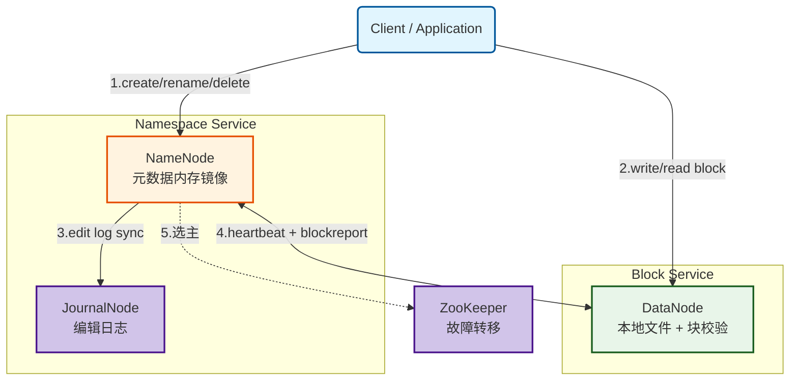
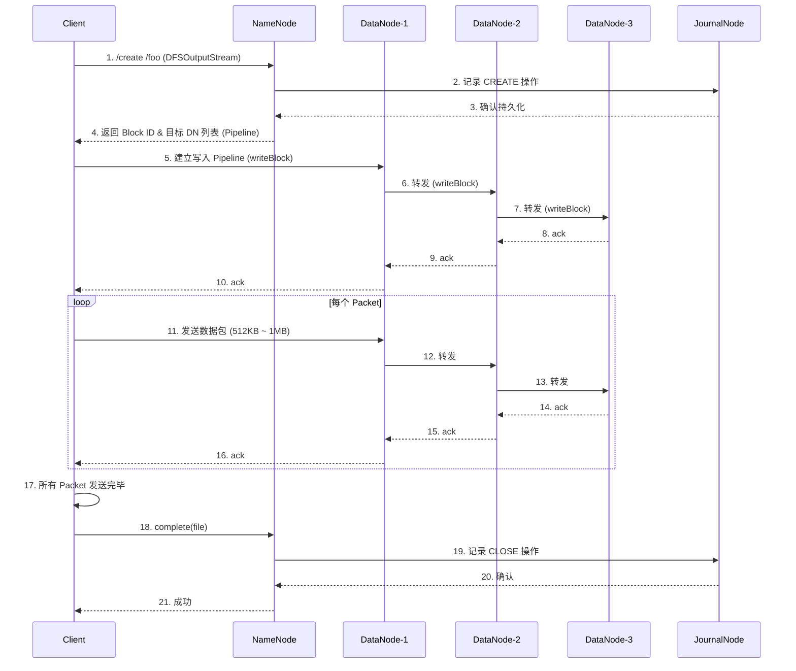
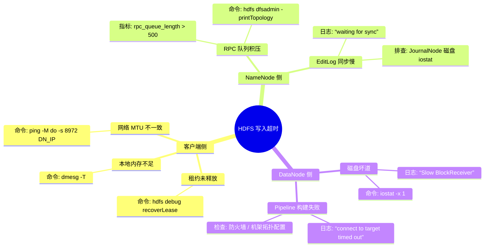

> [!info] 摘要  
> HDFS 是 Hadoop 生态的存储基石，其核心价值在于将“硬件故障常态化”这一前提转化为系统设计的首要约束。本文从 GFS 论文的工程落地视角切入，深度剖析 NameNode 元数据内存结构、Block 副本放置策略、高可用一致性模型三大核心机制。通过源码级拆解 Lease 管理与 BlockReport 流程，还原一次完整的数据写入生命周期。结合生产案例，提供元数据目录隔离、慢节点剔除、JournalNode 延迟排查等实战方案。最后，在 2026 年存算分离趋势下，讨论 HDFS 作为“冷存储标准”的长期定位。

---

## 一、核心概念与底层图景

### 1.1 定义

> [!quote] 工程定义  
> **HDFS** 是一个**假设硬件故障为常态**、以**高吞吐数据访问**为首要目标、**写一次读多次**的分布式文件系统。

*类比*：它并非通用 POSIX 文件系统，而是为数据中心的“数据集”提供原子化替换的存储仓库。

### 1.2 架构全景图



> [!note] 交互方向解读  
> - **控制流**（实线）：客户端与 NameNode 交互元数据；NameNode 与 DataNode 维持心跳与指令。  
> - **数据流**（虚线）：客户端直接与 DataNode 传输数据块，NameNode 不参与数据传输。  
> - **持久化流**：NameNode 将元数据变更写入 JournalNode 磁盘；DataNode 将块存储于本地文件系统。

---

## 二、机制原理深度剖析

### 2.1 核心子模块拆解

| 子模块 | 职责 | 设计意图/为何独立 |
|-------|------|------------------|
| **NameNode (NN)** | 维护文件系统树（INode 结构）及 Block → DataNode 映射 | **单点统一视图**：避免分布式元数据的一致性协商开销；牺牲可用性换取强一致性 |
| **FSEditLog** | 记录对元数据的每次原子操作（创建/删除/重命名） | **崩溃可恢复**：将易失的内存状态通过 WAL 持久化；顺序追加，不随机 IO |
| **FSImage** | 文件系统元数据的完整快照 | **加速重启**：无需重放所有历史 EditLog，周期性 checkpoint 降低重启耗时 |
| **DataNode (DN)** | 本地磁盘存储 Block 文件 + 元数据（`.meta`校验和） | **无状态设计**：NN 掌握所有映射关系，DN 仅汇报“我有什么”；降低 DN 心智负担 |
| **BlockManager** | 副本放置、冗余复制、均衡调度 | **策略化**：将“副本存放在哪里”从 NN 核心解耦，允许不同拓扑策略（机架感知、异构存储） |

> [!tip]- 深度分析：为何保留 NameNode 单点？  
> Google GFS 论文（2003）及 Hadoop 初期（2006）的硬件环境，分布式共识协议（Paxos/Raft）生产级实现尚未成熟。单 Master 虽引入单点故障，但通过 **主备热备 + 共享存储（NFS / Quorum Journal Manager）** 将恢复时间控制在分钟级，在当时是“可用性”与“实现复杂度”的最佳权衡。

### 2.2 核心流程可视化：**一次完整的数据写入**



> [!warning] 关键决策点与异常路径  
> - **Pipeline 构建失败**：若 D3 不可用，NN 会重新分配一个副本节点，Client 重试建链。  
> - **写入中 DataNode 宕机**：Client 收到 ack 超时，关闭当前 Pipeline，向 NN 申请新的 Block ID 继续写入剩余数据（块不完整，NN 后台自动复制补全副本）。  
> - **租约（Lease）**：Client 创建文件时向 NN 申请租约，防止其他客户端并发写入；若 Client 崩溃，NN 超时后强制释放租约。

---

## 三、内核/源码级实现

### 3.1 核心数据结构（Java）

> [!code] 包路径：`org.apache.hadoop.hdfs.server.namenode`

```java
/**
 * 文件系统目录树的 INode 抽象。
 * 所有修改必须在 FSNameSystem 写锁保护下执行。
 */
public abstract class INode {
    protected byte[] name;                 // 文件名/目录名，UTF-8 字节数组
    protected long id;                    // 唯一 ID，FSNamesystem idGenerator 分配
    protected PermissionStatus permission;// 所有者、组、权限模式
    protected long modificationTime;      // 最后修改时间
    
    // 并发保护：所有读写通过 FSNamesystem 持有的 ReentrantReadWriteLock
    // 读路径（get*）允许多并发；写路径（add/remove）独占锁
}

/**
 * 文件节点特有属性。
 */
public class INodeFile extends INode {
    private BlockInfo[] blocks;           // 属于该文件的块列表
    private short replication;            // 期望副本数
    private long preferredBlockSize;      // 块大小偏好（通常 128MB）
    
    // 文件长度 = 已确认块的总长度 + 正在写入块的确认长度
    private long header;                 // 低 48 位存储文件长度
}

/**
 * Block 元数据，存储在 NameNode 内存。
 * 不包含副本位置，位置信息由 BlocksMap 维护。
 */
public class BlockInfo {
    private final long blockId;          // 全局唯一块 ID (DataNode 本地文件名)
    private long numBytes;              // 块的实际字节数
    private final long generationStamp;  // 时间戳，区分同一块 ID 的不同版本（追加写/恢复）
    private BlockInfo trieNext;         // BlocksMap 哈希桶链表
}
```

> [!bug] 并发保护说明  
> `FSNamesystem` 内部使用 `ReentrantReadWriteLock` 控制并发。  
> - 读操作（如 `getBlockLocations`）获取 `readLock`，可数千并发。  
> - 写操作（如 `addBlock`、`completeFile`）获取 `writeLock`，串行执行。  
> 
> **此设计是 HDFS 元数据吞吐瓶颈的根本来源，也是 Federation 诞生的直接动因。**

### 3.2 核心流程伪代码：**租约恢复（Lease Recovery）**

当客户端崩溃，文件处于 `UNDER_CONSTRUCTION` 状态，NN 必须**强制完成**该文件，防止孤儿块。

```java
// FSNamesystem 内部
void internalReleaseLease(Lease lease, String src) {
    writeLock();
    try {
        INodeFile pendingFile = getINode(src);
        if (pendingFile == null) return;
        
        // 步骤1：判断是否仍有活跃客户端
        if (lease.hasHardLinks()) {
            // 仍有其他持有租约的客户端，等待超时
            return;
        }
        
        // 步骤2：获取最后一个块 (lastBlock)
        BlockInfo lastBlock = pendingFile.getLastBlock();
        
        // 步骤3：选择恢复协调者（Primary DataNode）
        DatanodeDescriptor recoveryNode = 
            choosePrimaryDataNode(lastBlock);
        
        // 步骤4：调用 DataNode 的 recoverBlock RPC
        boolean recovered = recoveryNode.recoverBlock(
            lastBlock, pendingFile.getPreferredBlockSize());
        
        if (recovered) {
            // 步骤5：更新块长度 & 完成文件
            lastBlock.setNumBytes(recoveredLength);
            pendingFile.completeLastBlock();
        } else {
            // 恢复失败，保持原有状态，下次周期扫描再试
        }
    } finally {
        writeUnlock();
    }
}
```

> [!example]- 版本差异（Hadoop 2.x → 3.x）  
> 在 2.x 中，租约恢复由 NameNode **主动调用** DataNode RPC，若 NameNode 并发恢复大量文件，会阻塞写锁。  
> 3.x 引入 **Erasure Coding** 后，租约恢复流程移至 DataNode 端异步执行，NameNode 仅标记“需要恢复”，大幅降低写锁持有时间。

---

## 四、生产落地与 SRE 实战

### 4.1 场景化案例：**NameNode RPC 延迟抖动导致 DataNode 心跳超时**

> [!danger] 现象  
> - `NameNode RPC processing time` 监控突增到 500ms+  
> - DataNode 日志周期性出现 `Lost contact with NameNode`  
> - 集群出现大量 `Block replication` 任务堆积

> [!check] 排查链路  
> 1. **先排除 GC** → `jstat -gcutil` 查看 FGC 频率正常，排除。  
> 2. **抓取 RPC 队列长度** → `hdfs dfsadmin -printTopology` 观察到 RPC 队列积压。  
> 3. **分析慢调用** → 开启 NameNode RPC 详细日志（`log4j.logger.org.apache.hadoop.ipc.Server=TRACE`），发现大量 `getBlockLocations` 调用耗时 2s+。  
> 4. **定位根因** → 某生产目录下单个文件 Block 数量超过 50w（该文件连续写入 3 年未合并），`getBlockLocations` 需遍历所有块。

> [!success] 解决方案  
> ```bash
> # 紧急止血：对问题目录执行归档（Hadoop Archive）
> hadoop archive -archiveName tmp.har -p /offending/path /tmp
> 
> # 长期防御：设置单文件最大 Block 数
> dfs.namenode.fs-limits.max-blocks-per-file=100000
> ```

> [!done] 验证  
> RPC 耗时降至 10ms 以下，DataNode 心跳恢复正常。

### 4.2 参数调优矩阵

| 参数名 | 作用域 | 推荐值（3.3.6） | 内核解释 |
|--------|--------|----------------|---------|
| `dfs.namenode.handler.count` | NameNode | `40`（每 8GB 堆 + 5） | RPC 服务线程数。过高导致上下文切换，过低导致队列积压。经验公式：`20 * log2(集群节点数)` |
| `dfs.datanode.bp.dir` | DataNode | `/disk1,/disk2` | 每个块池的存储目录。多目录可**轮询**写入，提升吞吐；需配置 `dfs.datanode.failed.volumes.tolerated` |
| `dfs.datanode.socket.write.timeout` | DataNode | `480000`（8分钟） | 写入 Pipeline 的超时。HDFS 3.x 默认提高，应对慢节点导致的 Pipeline 频繁中断 |
| `dfs.namenode.replication.max-streams` | NameNode | `20` | 单 NameNode 同时调度的复制任务数。过高挤占正常写流量，过低导致冗余块积压 |

### 4.3 监控与诊断

> [!info] 关键指标（Prometheus + Grafana）

| 指标名 | 健康区间 | 瓶颈阈值 | 含义 |
|--------|----------|----------|------|
| `namenode_capacity_used_percent` | < 70% | > 85% | 集群容量水位，超过 90% 进入安全模式只读 |
| `namenode_blocks_total` | 平滑增长 | 突降 | 突降代表 NameNode 重启加载 FSImage 完成前的空窗期 |
| `datanode_heartbeats_total` | > 0 | 归零 | 某 DataNode 失联，检查网络或 DN 进程 |
| `rpc_queue_length` | < 100 | > 500 | RPC 处理瓶颈，通常伴随 getBlockLocations 慢查询 |

> [!example] 诊断命令  
> ```bash
> # 查看 NameNode 当前读写锁竞争
> jstack -l `pidof NameNode` | grep -A 20 "FSNameSystem"
> 
> # 定位慢 DataNode
> hdfs dfsadmin -report | grep -A 5 "Name:.*slow.*"   # 自定义慢节点标记
> 
> # 实时追踪写入流
> hdfs debug recoverLease -path /path/to/hung/file
> ```

### 4.4 故障排查决策树



---

## 五、技术演进与未来视角（2026+）

### 5.1 历史设计约束与改进

| 版本 | 变化 | 动因/解决的问题 |
|------|------|----------------|
| 0.21 (2011) | **NameNode HA (QJM)** | 消除单点故障，从 30min 恢复降至 30s |
| 2.3 (2014) | **异构存储** | 支持 SSD/ARCHIVE，数据分层，降低 TCO |
| 2.7 (2016) | **HDFS Router-Based Federation** | 解决单个 NameNode 内存瓶颈（5亿文件极限） |
| 3.0 (2017) | **Erasure Coding** | 3副本 → 1.5倍冗余，存储效率提升 50% |

### 5.2 2026 年仍存在的“遗留设计”

> [!bug] 痛点1：单机 Block 数限制  
> NameNode 内存存储每个 Block 约 150 字节，百万 Block 约 150MB。**痛点**：小文件过多仍会导致内存爆炸。  
> **为何不改**：完全去中心化元数据（如 Ceph）会牺牲 POSIX 语义或性能，社区优先通过 Archive、Hudi/Iceberg 聚合文件规避。

> [!bug] 痛点2：Rename 原子性代价  
> HDFS 的 rename 是元数据操作，不移动数据。但目录层级极深时，NN 需要递归加载所有子节点加锁。  
> **为何不改**：重写为“懒删除+元数据指针交换”已列入社区讨论（HDFS-15963），因兼容性风险未合入主干。

> [!tip] 云厂商解决方案  
> AWS EMR、CDP 均提供 **Ozone**（下一代分布式存储）作为 HDFS 替代，但存量 HDFS 迁移成本极高，预计未来 5 年 HDFS 仍将作为“廉价冷存储”标准存在。

### 5.3 未来趋势

- **硬件冲击**：持久内存（PMEM）可让 NameNode 元数据直接持久化，**重启恢复秒级**（无需重放 EditLog）。Intel 已贡献补丁（HDFS-14890），但生态尚未普及。
- **架构重构**：存算分离成为云原生标准，HDFS 向 **分层存储 Gateway** 演化——本地 NVMe 作为缓存，数据最终沉降到 S3/OSS。此架构下 HDFS 不再是“主存储”，而是“加速层”。

> [!quote] 二十年后的 HDFS  
> 它不会消失，但会退化为**大规模、低成本、顺序访问**的“数据沉积层”。它的核心设计——**将硬件故障视为正常**——将在 AI 时代海量训练数据存储中持续成立。

---

## 参考文献
- 源码路径：`hadoop-hdfs-project/hadoop-hdfs/src/main/java/org/apache/hadoop/hdfs/server/namenode/`
- 官方文档：[HDFS Architecture Guide](https://hadoop.apache.org/docs/stable/hadoop-project-dist/hadoop-hdfs/HdfsDesign.html)
- 相关 WL：HDFS-15963（目录重命名性能优化），HDFS-14890（PMEM 支持）
- Google File System 论文（原始设计启发）

---
