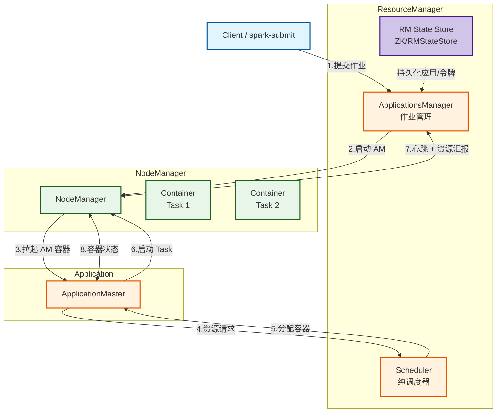
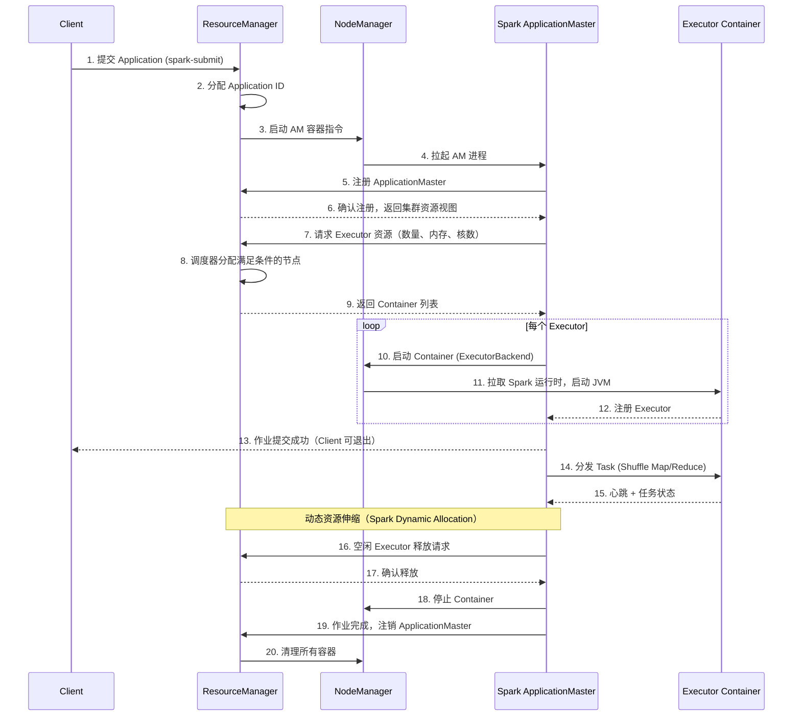
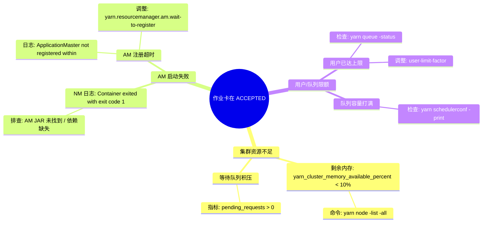

> [!info] 摘要  
> YARN 将 Hadoop 1.x 的“单体计算框架+固定资源分配”重构为**通用的分布式操作系统内核**。本文从 ResourceManager 与 NodeManager 的职责边界切入，深度解析**双层调度模型**（资源协商与容器执行）的设计取舍。通过源码级拆解 ApplicationMaster 注册、Container 分配、NM 心跳协议三大核心流程，还原一次 Spark 作业在 YARN 上的完整生命周期。结合生产案例，提供队列隔离、容器内存超卖、小作业延迟调度等典型问题排查方案。最后，在 2026 年云原生趋势下，讨论 YARN 与 Kubernetes 的竞争与共存边界。

---

## 一、核心概念与底层图景

### 1.1 定义

> [!quote] 工程定义  
> **YARN** 是一个**将资源管理与作业控制分离**的分布式调度框架。它不再绑定 MapReduce，而是通过**全局 ResourceManager + 每应用 ApplicationMaster** 的双层结构，支持多计算框架（Spark/Flink/Tez）共享集群。

*类比*：它并非简单的“升级版 JobTracker”，而是将数据中心操作系统化——RM 是内核，AM 是用户态进程。

### 1.2 架构全景图



> [!note] 交互方向解读  
> - **控制流1（作业提交）**：Client → RM → NM → AM，完成 ApplicationMaster 的首次调度。  
> - **控制流2（动态资源）**：AM → RM 请求资源，RM 返回容器列表，AM 驱动 NM 启动任务。  
> - **状态流**：NM 周期性向 RM 心跳，上报节点健康度与容器占用。  
> - **核心分离**：RM 不感知任何作业逻辑，AM 不参与跨节点资源调度决策。

---

## 二、机制原理深度剖析

### 2.1 核心子模块拆解

| 子模块 | 职责 | 设计意图/为何独立 |
|-------|------|------------------|
| **ResourceManager (RM)** | 全局资源仲裁；维护集群视图 | **单一视图**：避免多个调度器争夺资源导致碎片；所有节点资源状态仅 RM 持有 |
| **Scheduler** | 纯资源分配策略（容量/公平/优先级） | **策略可插拔**：将“如何分”与“分给谁”解耦；不跟踪应用状态，重启不丢队列配置 |
| **ApplicationsManager** | 管理作业生命周期；启动 ApplicationMaster | **故障隔离**：AM 崩溃仅影响单个作业，RM 负责重试 AM |
| **ApplicationMaster (AM)** | 作业级调度器；向 RM 申请资源并与 NM 协作 | **计算框架自主权**：MR/Spark/Flink 可用不同算法决定 Task 放置策略 |
| **NodeManager (NM)** | 节点级容器管理；监控资源使用 | **无状态**：仅执行，不决策；崩溃后 RM 将该节点置黑，任务由 AM 重调度 |
| **Container** | 资源抽象（CPU+内存+磁盘） | **统一抽象**：屏蔽 Linux CGroup、Docker 等底层隔离技术差异 |

> [!tip]- 深度分析：为什么是“双层调度”？  
> **历史约束**：Hadoop 1.x JobTracker 既要调度任务（Task），又要分配资源（Slot），单点压力巨大。  
> **性能与正确性权衡**：  
> - 单层调度（如 Kubernetes）：中心控制器为每个 Pod 决策。  
> - 双层调度（YARN / Mesos）：RM 仅分配资源量，AM 决定资源用途。  
> **优势**：支持毫秒级小作业调度（AM 自行决策），避免 RM 成为瓶颈。  
> **代价**：AM 必须自行实现容错，复杂度从 RM 转移至框架层。

### 2.2 核心流程可视化：**Spark 作业在 YARN 上的完整生命周期（Cluster 模式）**



> [!warning] 关键决策点  
> - **AM 启动失败**：RM 根据 `yarn.resourcemanager.am.max-attempts` 重试，默认 2 次。  
> - **资源不足**：调度器将请求加入等待队列，触发 `pending` 状态。  
> - **NM 心跳超时**：RM 将节点标记为 `lost`，其上所有容器由 AM 重新请求。  
> - **Container 超用**：NM 会强制 kill 超过 `yarn.nodemanager.resource.memory-mb` 的进程。

---

## 三、内核/源码级实现

### 3.1 核心数据结构（Java）

> [!code] 包路径：`org.apache.hadoop.yarn.server.resourcemanager`

```java
/**
 * RM 的核心调度器抽象，所有实现必须继承此抽象类。
 * 关键方法 allocate() 由 AM 通过 RPC 调用。
 */
public abstract class AbstractYarnScheduler
    implements ResourceScheduler {
    
    // 保护整个调度器状态的读写锁
    protected ReentrantReadWriteLock lock;
    
    // 节点 -> 可用资源映射
    protected final Map<NodeId, RMNode> nodes;
    
    // 队列树，根为 root
    protected final Map<String, SchedulerQueue> queues;
    
    // 应用 ID -> 应用调度状态
    protected final ConcurrentMap<ApplicationId, SchedulerApplication> applications;
    
    // 并发保护：applications 使用 ConcurrentHashMap，无需显式锁
    // 但跨应用操作（如队列资源更新）需持有写锁
}

/**
 * 容器分配上下文。
 * AM 每心跳调用一次 allocate()，RM 在此方法中返回新分配的容器。
 */
public class SchedulerApplication {
    private final ApplicationId applicationId;
    private final SchedulerApplicationAttempt currentAttempt;
    
    // 排队资源请求
    private final List<ResourceRequest> pendingRequests;
    
    // 已分配但 AM 尚未确认的容器
    private final List<Container> newlyAllocatedContainers;
}
```

> [!bug] 并发模型  
> - RM 内部有多个线程池：`RMAppManager`、`RMNodeManager`、`Scheduler`。  
> - **调度器锁**：`AbstractYarnScheduler.lock` 保护队列拓扑和节点资源映射，**AM 心跳**与**NM 心跳**会竞争该锁。  
> - **瓶颈点**：大规模集群（>5000 节点）下，调度器锁竞争导致 RPC 超时。  
> - **3.x 优化**：引入异步调度（YARN-5918），NM 心跳不再直接触发分配，通过独立线程异步处理。

### 3.2 核心流程伪代码：**资源分配（Scheduler.allocate）**

```java
// 简化自 FairScheduler/allocate 方法
List<Container> allocate(ApplicationAttemptId appAttemptId,
                          List<ResourceRequest> ask,
                          List<ContainerId> release) {
    writeLock.lock();
    try {
        // 步骤1：处理释放请求
        for (ContainerId id : release) {
            containerPool.release(id);
            updateNodeResource(id.getNodeId());
        }
        
        // 步骤2：更新资源请求（增量）
        FSAppAttempt app = getApplicationAttempt(appAttemptId);
        app.updateResourceRequests(ask);
        
        // 步骤3：执行分配（关键路径）
        List<Container> allocated = new ArrayList<>();
        while (allocated.size() < ask.size() && 
               hasEnoughResource()) {
            // 公平调度主循环
            FSQueue queue = selectNextQueue();
            Container container = queue.attemptAssignment();
            if (container != null) {
                allocated.add(container);
                app.addNewlyAllocatedContainer(container);
            }
        }
        
        // 步骤4：返回新分配的容器
        return allocated;
    } finally {
        writeLock.unlock();
    }
}
```

> [!example]- 版本差异（2.x → 3.x）  
> - **2.x**：`allocate` 直接在 NM 心跳线程中执行，锁持有时间 = 分配算法耗时。  
> - **3.x**（异步调度）：NM 心跳仅触发“需要调度”标记，调度线程池周期性执行分配。**锁持有时间大幅缩短**，但代价是分配延迟从毫秒级变为几十毫秒。

---

## 四、生产落地与 SRE 实战

### 4.1 场景化案例：**小作业延迟高——调度器队列饿死**

> [!danger] 现象  
> - 大量 Spark 小作业（1 executor）提交到生产队列。  
> - 作业状态长时间停留在 `ACCEPTED`，无法进入 `RUNNING`。  
> - 大作业（200+ executor）运行正常，无资源不足。

> [!check] 排查链路  
> 1. **查看 RM UI** → `Application` 页面显示 `pending_requests` 数量巨大。  
> 2. **检查队列配置** → `yarn.scheduler.capacity.root.prod.user-limit-factor=1`（默认）。  
> 3. **触发条件**：小作业来自同一用户，用户资源上限（user-limit）已打满，即使队列仍有空闲资源。

> [!success] 解决方案  
> ```xml
> <!-- capacity-scheduler.xml -->
> <property>
>   <name>yarn.scheduler.capacity.root.prod.user-limit-factor</name>
>   <value>2</value>  <!-- 允许单用户占用队列容量的 2 倍（借用空闲资源） -->
> </property>
> ```

> [!done] 验证  
> 修改后立即生效（无需重启 RM），小作业 5 秒内获得容器。

### 4.2 参数调优矩阵

| 参数名 | 作用域 | 推荐值（3.x） | 内核解释 |
|--------|--------|----------------|---------|
| `yarn.scheduler.minimum-allocation-mb` | RM | `1024` | 单容器最小内存。**过低**导致调度碎片，**过高**浪费小任务资源 |
| `yarn.nodemanager.resource.memory-mb` | NM | 物理内存 80% | NM 可分配给容器的总内存。留空给 OS Cache |
| `yarn.nodemanager.vmem-check-enabled` | NM | `false`（3.x） | 虚拟内存检查。**2.x 默认 true**，频繁 kill 容器，3.x 推荐关闭 |
| `yarn.resourcemanager.scheduler.monitor.enable` | RM | `true` | 启用预emption。抢占调度时强制 kill 低优先级容器 |
| `yarn.scheduler.capacity.maximum-am-resource-percent` | RM | `0.2` | AM 容器占用总资源上限。Spark 大量小作业需调高至 0.4 |

### 4.3 监控与诊断

> [!info] 关键指标

| 指标名 | 健康区间 | 瓶颈阈值 | 含义 |
|--------|----------|----------|------|
| `yarn_cluster_memory_available_percent` | > 20% | < 10% | 集群剩余内存逼近零，即将发生 pending |
| `yarn_rpc_queue_time` | < 50ms | > 200ms | RM RPC 队列积压，通常由调度器锁竞争导致 |
| `yarn_am_launch_duration_seconds` | < 30s | > 120s | AM 容器启动耗时，可能 NM 拉取 JAR 慢 |
| `yarn_nodemanager_container_killed_total` | 0 | 持续 >0 | 检查 vmem-check 或 OOM Killer |

> [!example] 诊断命令  
> ```bash
> # 查看 RM 当前调度器状态
> yarn rmadmin -getGroups
> 
> # 抓取 NM 容器异常退出原因
> grep "Container killed" /var/log/hadoop-yarn/yarn-yarn-nodemanager-*.log
> 
> # 动态调整队列容量（无需重启）
> yarn rmadmin -refreshQueues
> ```

### 4.4 故障排查决策树



---

## 五、技术演进与未来视角（2026+）

### 5.1 历史设计约束与改进

| 版本 | 变化 | 动因/解决的问题 |
|------|------|----------------|
| 2.2 (2013) | **ResourceManager HA (Active/Standby)** | RM 单点故障，影响整个集群 |
| 2.7 (2016) | **时间轴服务器 v.2** | 解决历史应用数据查询性能 |
| 3.1 (2018) | **GPU 与 FPGA 资源支持** | 深度学习训练进入 Hadoop 集群 |
| 3.3 (2021) | **YARN Federation** | 突破单个 RM 管理 1w+ 节点限制 |

### 5.2 2026 年仍存在的“遗留设计”

> [!bug] 痛点1：节点分区无法跨 RM  
> YARN Federation 本质是多个独立集群的“逻辑拼接”，而非统一调度器。**跨 RM 节点无法负载均衡**。  
> **为何不改**：统一视图需要全分布式的调度状态机，复杂度 ≈ 重构 YARN。

> [!bug] 痛点2：容器隔离依赖于 CGroup v1  
> 多数发行版仍使用 CGroup v1，v2 的 unified hierarchy 未完全适配。  
> **为何不升级**：CGroup v2 与旧内核兼容性差，社区推进缓慢（YARN-10438）。

> [!tip] 云原生冲击  
> Kubernetes 已成为事实上的云原生调度标准。Cloudera/Hortonworks 已支持 YARN on K8s，但 **YARN 自身的调度器（容量/公平）仍是企业自建 Hadoop 不可替代的理由**。

### 5.3 未来趋势

- **共存而非消亡**：纯 Hadoop 集群逐步减少，但**金融、政务**等强合规场景仍沿用 YARN（存量作业验证成本极高）。
- **YARN on Kubernetes**：K8s 负责节点资源，YARN 作为应用层调度器运行于 Pod 内——牺牲一层性能，换取统一运维。
- **Scheduler 插件化**：YARN 3.x 已支持外挂调度器，未来可能出现 **K8s scheduler-plugins 与 YARN 融合**的实现。

> [!quote] 十年后的 YARN  
> 它不会像 MapReduce 那样被彻底替代，而是退居为**大规模离线批处理的事实调度标准**。它的遗产——**双层调度模型**——已被众多云原生调度系统借鉴。

---

## 参考文献
- 源码路径：`hadoop-yarn-project/hadoop-yarn/hadoop-yarn-server/hadoop-yarn-server-resourcemanager/src/main/java/org/apache/hadoop/yarn/server/resourcemanager/scheduler/`
- 官方文档：[YARN Capacity Scheduler](https://hadoop.apache.org/docs/stable/hadoop-yarn/hadoop-yarn-site/CapacityScheduler.html)
- 相关 WL：YARN-5918（异步调度），YARN-10438（CGroup v2）
- Vavilapalli, V. K., et al. (2013). "Apache Hadoop YARN: Yet Another Resource Negotiator." SoCC.