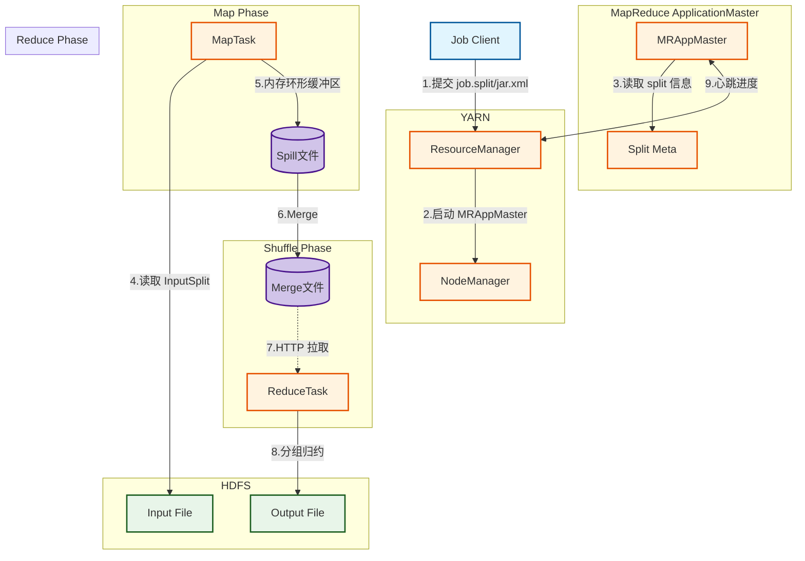
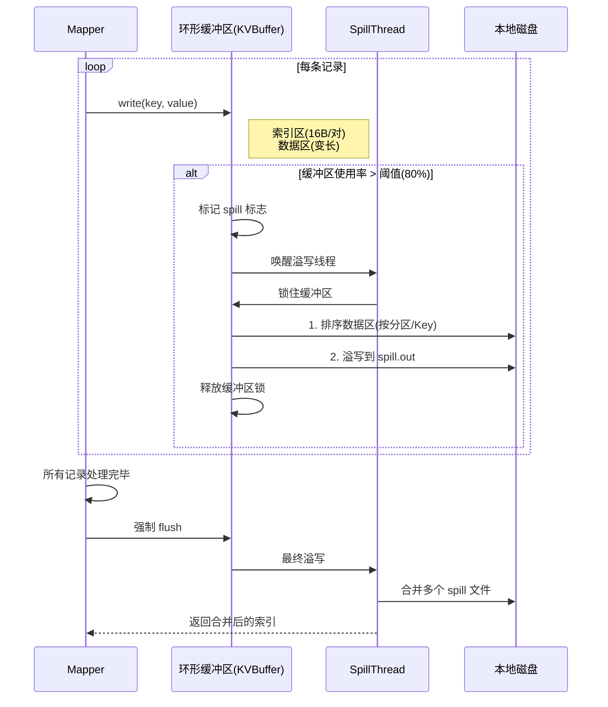
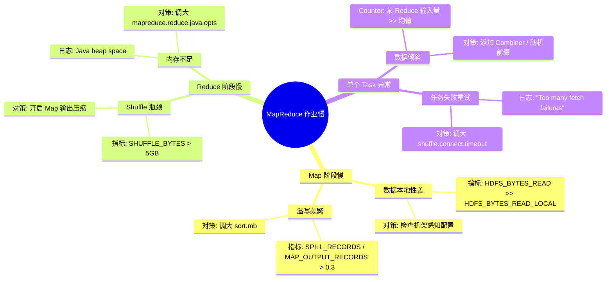

> [!info] 摘要  
> MapReduce 并非简单的“分而治之”工具，而是一套**将分布式计算错误处理、数据本地性、容错恢复编码进编程模型**的工程范式。本文从 Google 原始论文的算法直觉切入，深度解析**分片→映射→排序→归约**的全链路设计取舍。通过源码级拆解 `Mapper`/`Reducer` 接口契约、Shuffle 阶段的缓冲区溢出、推测执行机制，还原一次 WordCount 作业在 YARN 上的完整生命周期。结合生产案例，提供数据倾斜调优、Shuffle 吞吐瓶颈、小文件分片策略等实战方案。最后，在 2026 年 Spark 成为通用计算引擎的背景下，讨论 MapReduce 仍不可替代的**极低资源消耗**与**线性可预测性**定位。

---

## 一、核心概念与底层图景

### 1.1 定义

> [!quote] 工程定义  
> **MapReduce** 是一个**将分布式程序强制约束为“键值对处理 + 交换键分组”两阶段模型**的编程框架。它通过**移动计算而非移动数据**的原则，在数千节点上提供可预测的批处理吞吐。

*类比*：它不是最快的计算引擎，而是**对硬件故障、网络分区、数据倾斜提供统一容错预案**的确定性状态机。

### 1.2 架构全景图



> [!note] 交互方向解读  
> - **作业准备阶段**：客户端计算 Split，上传 JobConf/JAR 到 HDFS。  
> - **调度阶段**：MRAppMaster 根据数据本地性申请 Map/Reduce 容器。  
> - **Shuffle 核心**：Map 输出持久化到本地磁盘，Reduce 通过 HTTP 拉取对应分区数据。  
> - **无状态设计**：Task 失败仅重试，MRAppMaster 不保留中间状态。

---

## 二、机制原理深度剖析

### 2.1 核心子模块拆解

| 子模块             | 职责                                                      | 设计意图/为何独立                               |
| --------------- | ------------------------------------------------------- | --------------------------------------- |
| **InputFormat** | 1. 验证输入路径合法性<br>2. 将文件切分为逻辑 Split<br>3. 提供 RecordReader | **统一接入**：屏蔽 HDFS、本地、数据库等数据源差异           |
| **Split**       | 一个可被单个 Mapper 处理的“数据块+偏移量+位置列表”元组                       | **数据本地性载体**：Split 的位置列表指导 RM 调度容器       |
| **MapTask**     | 执行用户 Mapper，将输出写入环形缓冲区（KVBuffer）                        | **批量持久化**：避免每条数据都产生磁盘 I/O，攒批溢写          |
| **环形缓冲区**       | Map 输出在内存中的 KV 块，默认 100MB                               | **性能与容错权衡**：内存不足时阻塞，而非 OOM              |
| **Shuffle**     | Map 端分区排序+Reduce 端拉取合并                                  | **计算向数据迁移**：Reduce 拉取代价高于 Map 推送（控制面简化） |
| **ReduceTask**  | 分组归约，执行用户 Reducer                                       | **全量排序幻觉**：仅保证每个 Reduce 分区内有序           |

> [!tip]- 深度分析：为什么 Split 必须包含 Block 位置列表？  
> **历史约束**：2010 年前网络带宽是磁盘带宽的 1/10（1Gbps vs 100MB/s）。  
> **设计取舍**：MRAppMaster 将 Split 位置列表传递给 RM，RM **尽力将 Map 容器调度到 Block 所在节点**。  
> **效果**：90% 以上的 Map 任务实现本地读，网络负载下降一个数量级。  
> **代价**：RM 调度器必须感知 HDFS 拓扑（机架感知）。

### 2.2 核心流程可视化：**Map 端环形缓冲区溢写全流程**



> [!warning] 关键决策点  
> - **缓冲区大小**：默认 100MB (`mapreduce.task.io.sort.mb`)，**太小**导致频繁溢出，**太大**增加 GC 压力。  
> - **溢写阈值**：80% (`mapreduce.map.sort.spill.percent`)，**留 20% 缓冲**避免程序写入与溢写死锁。  
> - **排序算法**：快速排序 + 二路归并，**全内存排序**，溢写时才落盘。  
> - **压缩**：Map 输出可压缩（`mapreduce.map.output.compress`），**CPU 换带宽**。

### 2.3 Shuffle 阶段的内存计算模型

```java
// 伪代码：Map 端内存预算
long sortMb = jobConf.getInt(“mapreduce.task.io.sort.mb”, 100);
float spillPercent = jobConf.getFloat(“mapreduce.map.sort.spill.percent”, 0.8f);

// 实际可用缓冲区 = sortMb * spillPercent
// 若缓冲区满，Mapper.write() 阻塞
```

> [!bug] 经典陷阱  
> 若单个 Map 输出极大（>100MB），即使缓冲区 100MB，也会因 spillPercent 80% 在 80MB 时溢写。  
> **最终文件**：多个 80MB 溢写文件 + 1 次合并 → 性能下降。  
> **解法**：调高 `sort.mb` 至 300~500（需预留堆外内存）。

---

## 三、内核/源码级实现

### 3.1 核心数据结构（Java）

> [!code] 包路径：`org.apache.hadoop.mapreduce` 与 `org.apache.hadoop.mapred`

```java
/**
 * Mapper 基类 - 所有用户 Mapper 必须继承此类。
 * 注解：非抽象方法，避免强制实现。
 */
public class Mapper<KEYIN, VALUEIN, KEYOUT, VALUEOUT> {
    /**
     * 每个 key/value 对调用一次。
     * 并发安全：同一 MapTask 单线程调用，无需加锁。
     */
    protected void map(KEYIN key, VALUEIN value, 
                       Context context) throws IOException {
        context.write((KEYOUT) key, (VALUEOUT) value);
    }
    
    /**
     * Task 级别上下文，包装 OutputCollector。
     * MapTask 会将 Context 强制转为 MapContextImpl。
     */
    public abstract class Context implements MapContext<KEYIN, VALUEIN, KEYOUT, VALUEOUT> {}
}
```

```java
/**
 * Map 输出环形缓冲区的核心数据结构。
 * 路径：org.apache.hadoop.mapred.MapTask$MapOutputBuffer
 */
class MapOutputBuffer {
    // 数据区：字节数组，存储序列化后的 KV
    private byte[] kvbuffer;
    
    // 索引区：整形数组，每对 KV 占 4 个 int
    // [0]=分区号, [1]=起始位置, [2]=长度, [3]=值长度
    private int[] kvindices;
    
    // 并发控制：volatile 保证 spill 线程可见性
    private volatile boolean spillInProgress;
    
    // 锁对象：同步溢写与写入
    private final Object spillLock = new Object();
    
    /**
     * 核心写入方法 - 由 Mapper 线程调用。
     * 无锁，仅通过缓冲区内 volatile 指针竞争。
     */
    public void write(Object key, Object value) {
        if (bufindex + keylen + vallen > kvstart + kvmeta.capacity()) {
            // 触发溢写条件
            startSpill();  // 唤醒溢写线程，当前线程可能阻塞
        }
        // 1. 复制 key 到 kvbuffer
        // 2. 复制 value 到 kvbuffer
        // 3. 写入索引区 (分区号、位置、长度)
    }
    
    // 并发保护：由 spill 线程持有 spillLock
    private void sortAndSpill() {
        synchronized (spillLock) {
            // 快速排序索引区（按分区号、Key）
            QuickSort.sort(kvindices, ...);
            // 顺序读取 kvbuffer，写入溢写文件
        }
    }
}
```

> [!bug] 并发模型  
> - **单生产者**：Mapper 线程独占写入缓冲区。  
> - **单消费者**：SpillThread 独占溢写。  
> - **同步点**：缓冲区满时 Mapper 调用 `startSpill()` 唤醒线程，若 spillInProgress 仍为 true，Mapper 调用 `wait()`。  
> - **无锁化设计**：通过 `bufindex` 指针自增实现串行化写入，无需 CAS。

### 3.2 核心流程伪代码：**Reduce 端拉取线程（Fetcher）**

```java
// 路径：org.apache.hadoop.mapreduce.task.reduce.Fetcher
class Fetcher extends Thread {
    public void run() {
        while (!stopped) {
            // 1. 从调度器获取下一个待拉取的 Map 输出主机
            MapHost host = scheduler.getHost();
            
            // 2. 建立 HTTP 连接（重试机制内嵌）
            HttpURLConnection conn = openConnection(host);
            
            // 3. 流式读取 Map 输出
            InputStream in = conn.getInputStream();
            
            // 4. 合并至 Reduce 内存缓冲区（in-memory merge）
            MapOutput output = inMemoryMerge(in);
            
            if (output.size() > MEMORY_LIMIT) {
                // 5. 内存不足时溢写到磁盘
                spillToDisk(output);
            }
        }
    }
}
```

> [!example]- 版本差异（1.x → 2.x）  
> - **1.x**：Reduce 拉取时，每个 Map 输出单独文件，**大量小文件**，NameNode 压力大。  
> - **2.x**（优化）：ShuffleHandler 支持**合并传输**，多个 Map 输出打包为一个 HTTP 响应。  
> - **3.x**（YARN-430）：支持 **Shuffle 加密**，SSL 传输。

---

## 四、生产落地与 SRE 实战

### 4.1 场景化案例：**数据倾斜——少数 Key 占据 90% 数据量**

> [!danger] 现象  
> - WordCount 作业，99% Reduce 在 1 分钟内完成，1 个 Reduce 运行 30 分钟。  
> - RM UI 显示该 Reduce 拉取数据量 100GB，其他 Reduce < 1GB。

> [!check] 排查链路  
> 1. **检查 Map 输出** → Counter 显示 `MAP_OUTPUT_BYTES` 分布均匀，非 Map 倾斜。  
> 2. **采样 Key 分布** → 在 Mapper 中加入 `if (new Random().nextInt(100) == 0) System.out.println(key)`。  
> 3. **定位热点 Key** → 空字符串、`NULL` 或某个高频词。

> [!success] 解决方案  
> ```java
> // 方案A：在 Mapper 侧添加随机前缀（倾斜不严重时）
> String newKey = (key.equals("hotspot")) 
>     ? "hotspot_" + new Random().nextInt(50) 
>     : key;
> context.write(new Text(newKey), value);
> 
> // 方案B：使用 Combine 减少 Map 端传输（必须幂等）
> job.setCombinerClass(IntSumReducer.class);
> ```

> [!done] 验证  
> 添加 Combine 后，热点 Key 在 Map 端已做局部聚合，Reduce 拉取数据从 100GB 降至 2GB。

### 4.2 参数调优矩阵

| 参数名 | 作用域 | 推荐值（3.3.6） | 内核解释 |
|--------|--------|----------------|---------|
| `mapreduce.task.io.sort.mb` | Map Task | `300` | Map 输出缓冲区大小。**非 JVM 堆内存**，是堆外 DirectByteBuffer |
| `mapreduce.map.sort.spill.percent` | Map Task | `0.85` | 溢写阈值，调高可减少溢写次数，但增加 OOM 风险 |
| `mapreduce.reduce.shuffle.parallelcopies` | Reduce Task | `10` | 同时拉取 Map 输出的线程数。**NR 节点*0.1** |
| `mapreduce.reduce.shuffle.input.buffer.percent` | Reduce Task | `0.7` | Reduce 堆内存分配给 Shuffle 的百分比 |
| `mapreduce.map.output.compress` | 作业级 | `true` | Map 输出启用压缩，**codec=Snappy** |
| `mapreduce.job.reduce.slowstart.completedmaps` | 作业级 | `0.8` | 80% Map 完成后启动 Reduce，**早期启动可重叠执行** |

### 4.3 监控与诊断

> [!info] 关键指标（JobHistory Server）

| 指标名 | 健康区间 | 瓶颈阈值 | 含义 |
|--------|----------|----------|------|
| `MAP_INPUT_RECORDS / MAP_OUTPUT_RECORDS` | 1:0.5~2 | > 10 | Mapper 输出膨胀（生成过多中间数据） |
| `REDUCE_SHUFFLE_BYTES / MAP_OUTPUT_BYTES` | 1 | < 0.8 | 部分 Map 输出丢失（任务重算） |
| `CPU_MILLISECONDS / GC_MILLISECONDS` | > 5 | < 2 | GC 开销过大，调大缓冲区 |
| `FILE_BYTES_READ / HDFS_BYTES_READ` | < 0.1 | > 0.5 | 过度依赖磁盘溢写，内存不足 |

> [!example] 诊断命令  
> ```bash
> # 查看已完成作业的详细 Counter
> mapred job -status <job_id>
> 
> # 获取 Reduce 拉取延迟分布
> yarn logs -applicationId <app_id> | grep "Shuffle"
> 
> # 实时跟踪单个 Task 进度
> mapred task -status <task_attempt_id>
> ```

### 4.4 故障排查决策树



---

## 五、技术演进与未来视角（2026+）

### 5.1 历史设计约束与改进

| 版本 | 变化 | 动因/解决的问题 |
|------|------|----------------|
| 0.20 (2009) | **Uber Task** | 小作业直接在 AM JVM 运行，减少容器启动开销 |
| 1.x → 2.x | **迁移至 YARN** | 脱离 JobTracker 单点，MRAppMaster 按作业拉起 |
| 2.6 (2015) | **Shuffle Handler 长连接** | 避免 Reduce 为每个 Map 输出建立 HTTP 短连接 |
| 3.2 (2019) | **Native GPU 支持** | 少量深度学习任务仍用 MR 预处理 |

### 5.2 2026 年仍存在的“遗留设计”

> [!bug] 痛点1：Shuffle 的写放大  
> Map 输出必须**完整排序 + 落盘**，即使 Reduce 仅做聚合（如 `SUM`）。  
> **为何不改**：排序是 Reduce 能够**流式合并**的前提，若去排序，Reduce 需全量加载所有记录到内存，更易 OOM。

> [!bug] 痛点2：启动延迟  
> 每个作业拉起 MRAppMaster + 申请容器，**空载延迟 > 5s**。  
> **对比**：Spark 常驻 Executor，毫秒级响应。  
> **为何保留**：MR 设计之初面向**小时级 ETL**，5s 启动可接受。至今无重构动力。

> [!tip] 替代方案  
> 延迟敏感场景迁移 Spark/Flink；**极低成本场景**仍用 MR Streaming API（Python/Perl 脚本处理百 MB 数据）。

### 5.3 未来趋势

- **MapReduce 3.x**：已停滞，仅关键 bug 修复。**社区重心完全移至 Spark/Flink**。
- **不可替代的定位**：**单机内存 < 8GB** 的边缘节点、定时触发的**每日备份 ETL**，MR 仍是资源消耗最低的选择（无需常驻进程）。
- **遗产价值**：Shuffle 规范（HTTP + 磁盘）成为 Hadoop 生态事实标准，Tez/Spark 在 YARN 上运行仍需兼容 MR 的 **ShuffleHandler**。

> [!quote] 二十年后的 MapReduce  
> 它不会消亡，而是作为**分布式计算的“汇编语言”**沉淀下来。每个新入行的工程师通过手写 MR 理解“数据本地性”“容错边界”，正如每个 C 程序员仍需理解指针。

---

## 参考文献
- 源码路径：`hadoop-mapreduce-project/hadoop-mapreduce-client/hadoop-mapreduce-client-core/src/main/java/org/apache/hadoop/mapreduce/`
- 源码路径（核心引擎）：`hadoop-mapreduce-project/hadoop-mapreduce-client/hadoop-mapreduce-client-app/src/main/java/org/apache/hadoop/mapreduce/v2/app/`
- 官方文档：[MapReduce Tutorial](https://hadoop.apache.org/docs/stable/hadoop-mapreduce-client/hadoop-mapreduce-client-core/MapReduceTutorial.html)
- Dean, J., & Ghemawat, S. (2004). "MapReduce: Simplified Data Processing on Large Clusters." OSDI.