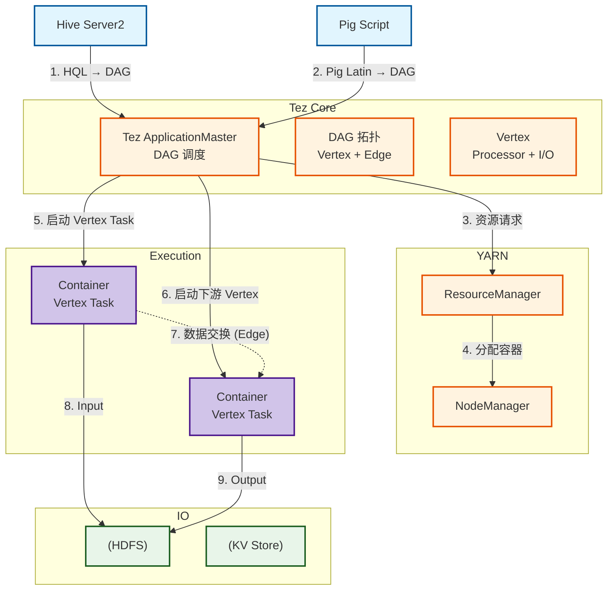
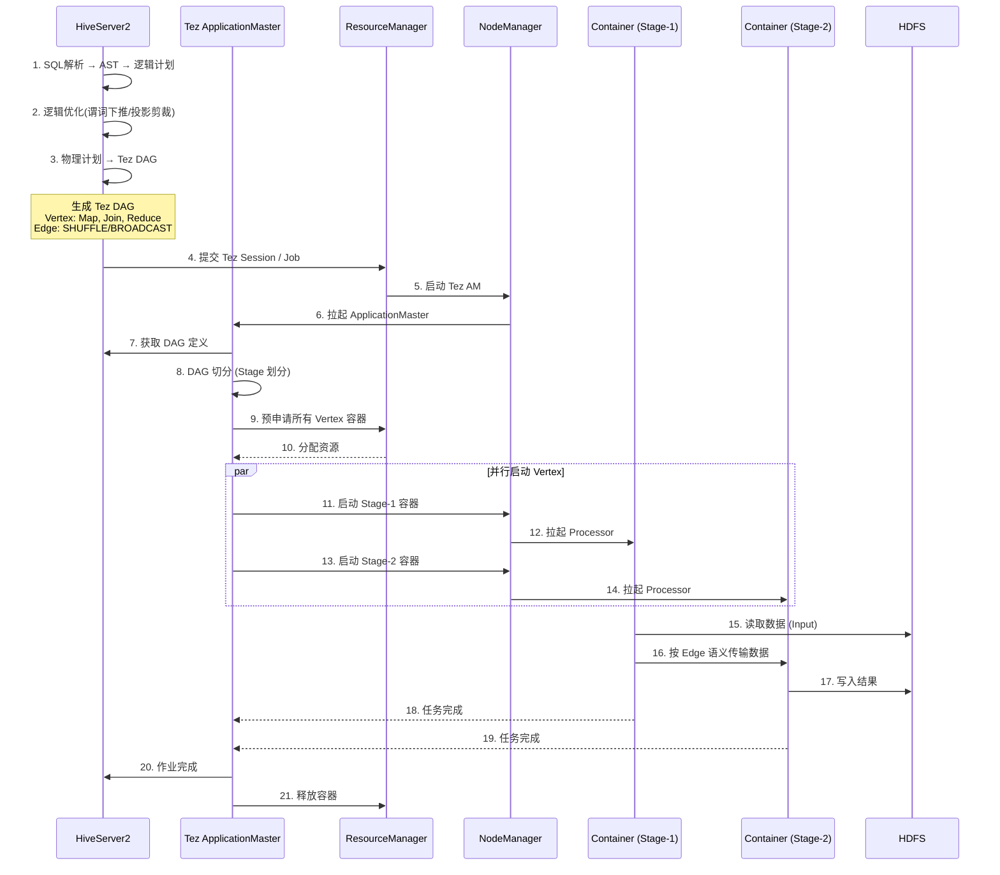
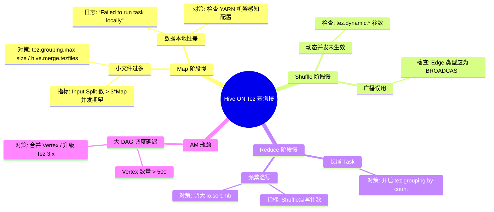

> [!info] 摘要  
> Tez 并非 MapReduce 的“升级版”，而是**将 MapReduce 的固定二阶段模型重构为任意 DAG 拓扑的数据流执行引擎**。本文从消除 MapReduce **写屏障**的设计意图切入，深度解析 Tez 的核心抽象——**Vertex-Edge-DAG** 如何实现算子级流水线与容器复用。通过源码级拆解 Tez AM 的 DAG 切分、Input/Output 插件化、动态并发调整三大机制，还原一次 Hive ON Tez 查询的完整编译执行链路。结合生产案例，提供容器复用预热、Shuffle 倾斜规避、大 DAG 拆分策略等实战方案。最后，在 2026 年 Spark 全面向量化执行的背景下，讨论 Tez 在**大吞吐 ETL**与**Hive 兼容性**领域的稳固阵地。

---

## 一、核心概念与底层图景

### 1.1 定义

> [!quote] 工程定义  
> **Apache Tez** 是一个**以 YARN 为底层资源管理器、以 DAG 为基本执行单元**的数据流引擎。它通过 **Vertex-Edge 拓扑**描述计算任务，将 MapReduce 的固定 Map+Reduce 阶段泛化为任意数量、任意连接关系的算子。

*类比*：它不是 Spark，而是**专为 Hive/Pig 优化的高性能 DAG 运行时**——牺牲 API 通用性，换取与现有 Hive 语法 100% 兼容的极致性能。

### 1.2 架构全景图



> [!note] 交互方向解读  
> - **编译器前端**：Hive/Pig 将 SQL/脚本转换为 Tez DAG（逻辑计划→物理计划）。  
> - **控制流**：Tez AM 持有完整 DAG，**一次性为所有 Vertex 预申请资源**（与 MapReduce 的逐阶段申请不同）。  
> - **数据流**：上游 Vertex 输出直接通过**内存/本地磁盘/网络**传递给下游，无 MR 的固定落盘屏障。  
> - **容错**：Vertex Task 失败仅重试该 Sub-DAG，无需从头重跑。

---

## 二、机制原理深度剖析

### 2.1 核心子模块拆解

| 子模块 | 职责 | 设计意图/为何独立 |
|-------|------|------------------|
| **DAG API** | 描述 Vertex、Edge、Input、Output 的拓扑结构 | **统一编程模型**：隐藏 YARN 与资源调度细节，用户（框架）仅需关心数据流 |
| **Vertex** | 计算单元抽象，包含 Processor（业务逻辑）+ I/O 描述 | **任务泛化**：一个 Vertex 可对应 Map、Reduce、Join、Union 任意算子 |
| **Edge** | 定义上下游数据传输语义（1:1/广播/Scatter-Gather） | **数据交换策略化**：将 Shuffle 从固定组件变为可配置属性 |
| **Input/Output** | 数据源/宿描述，支持 HDFS、Hive、本地文件等 | **可插拔存储适配**：Tez 不内置 SerDe，完全复用 Hive 生态 |
| **Tez AM** | DAG 切分、并发度决策、资源协商、容错恢复 | **动态优化**：根据输入数据量在运行时调整并行度（区别于 MR 静态确定） |
| **Container Pool** | 复用已申请容器，避免 Task 启动开销 | **消除冷启动**：MR 每个 Task 新起 JVM → Tez 同 Vertex 复用 Container |

> [!tip]- 深度分析：为什么 Tez 能比 MapReduce 快 2~10 倍？  
> **根本原因**：**消除写屏障**。  
> - MapReduce 每个 Stage 必须**完整落盘 HDFS** → 下一 Stage 重新读取 → **三倍 I/O**（Map 写 + Reduce 读 + 中间 HDFS 副本）。  
> - Tez：上游直接 Push 到下游内存 → 无中间副本 → **1 倍 I/O**。  
> **代价**：容错粒度变粗。MR 任意 Task 失败仅重试自身；Tez 若下游已消费部分数据，失败需重跑整个子 DAG。  
> **权衡**：批处理作业失败概率低，性能收益远大于重跑代价。

### 2.2 核心流程可视化：**Hive ON Tez 查询编译与执行**



> [!warning] 关键决策点  
> - **预申请资源**：MR 按 Stage 申请 → 可能存在下游等待资源；Tez **一次申请全量** → 需更精准预测资源量。  
> - **Edge 类型选择**：  
>   - `ONE_TO_ONE`：上下游分区数一致，直接本地传递（0 拷贝）。  
>   - `SCATTER_GATHER`：经典 Shuffle，Key 重新哈希。  
>   - `BROADCAST`：小表复制至所有下游 Task，避免 Shuffle。  
> - **容器复用**：同一 Vertex 的多个 Task **串行运行在同一 Container**，避免 JVM 反复拉起。

---

## 三、内核/源码级实现

### 3.1 核心数据结构（Java）

> [!code] 包路径：`org.apache.tez.dag.api`

```java
/**
 * DAG 拓扑的根容器。
 * 不可变对象，构建完成后仅用于序列化提交。
 */
public final class DAG {
    private final String name;
    private final Map<String, Vertex> vertices;    // Vertex 名称 → 定义
    private final Map<String, Edge> edges;         // Edge ID → 定义
    private final Map<String, InputDescriptor> inputs;   // 全局 Input
    private final Map<String, OutputDescriptor> outputs; // 全局 Output
    
    // 并发保护：构建阶段单线程，提交后只读，无需锁
}

/**
 * 计算单元定义。
 * 包含 Processor（业务代码）、Input/Output 插件、并行度。
 */
public final class Vertex {
    private final String name;
    private final ProcessorDescriptor processor;  // 指向 Hive Processor
    
    private final int parallelism;                // 静态并发度
    private final Configuration conf;             // Task 配置
    
    // 动态并发相关（Tez 3.x+）
    private final boolean enableDynamicParallelism;
    private final float dynamicParallelismFactor; // 每 G 数据 N 个 Task
}

/**
 * Edge 连接器 - Tez 性能优化的核心抽象。
 * 决定了数据如何从上游 Producer 传递到下游 Consumer。
 */
public final class Edge {
    private final Vertex inputVertex;   // 上游
    private final Vertex outputVertex;  // 下游
    
    // 数据分发模式
    private final EdgeProperty edgeProperty;
    
    public static class EdgeProperty {
        private final DataMovementType movementType;  // ONE_TO_ONE / SCATTER_GATHER / BROADCAST
        private final DataSourceType sourceType;      // PERSISTED / EPHEMERAL
        private final SchedulingType schedulingType;  // SEQUENTIAL / CONCURRENT
        
        private final KeyExtractor keyExtractor;       // Shuffle Key 定义
        private final Partitioner partitioner;         // 分区器
    }
}
```

> [!bug] 并发模型  
> - **Tez AM**：单线程事件驱动模型（`Apache Tez` 基于 `Apache Hadoop YARN` 事件总线）。  
> - **DAG 调度**：`DAGScheduler` 持有全局 DAG 状态，通过**状态机**（`DAGState`）处理 Task 完成/失败事件。  
> - **无全局锁**：状态变更通过**事件队列**串行化，避免显式锁竞争。  
> - **瓶颈点**：极端大规模 DAG（>1k Vertex）下，单线程事件处理可能积压（YARN-4227）。

### 3.2 核心流程伪代码：**动态并行度决策**

```java
// 路径：org.apache.tez.dag.app.dag.impl.VertexImpl
// Tez 3.0+ 特性：根据输入数据量自动调整并发 Task 数
public class VertexImpl implements Vertex {
    
    private int configuredParallelism;    // 用户配置并行度
    private int runtimeParallelism;       // 实际运行时并行度
    private long inputDataSize;          // 从 Input 插件获取
    
    /**
     * DAG 提交阶段，AM 调用此方法决策最终并发度。
     * 决策点：Vertex 启动前，获取所有上游已完成的输出统计。
     */
    public int getParallelism() {
        if (!enableDynamicParallelism) {
            return configuredParallelism;
        }
        
        // 1. 聚合所有上游实际输出字节数
        long totalOutputBytes = 0;
        for (Edge edge : inEdges) {
            for (Task task : edge.getSourceVertex().getCompletedTasks()) {
                totalOutputBytes += task.getStatistics().getOutputBytes();
            }
        }
        
        // 2. 根据公式计算所需 Task 数
        // 默认：每 1GB 数据分配 1 个 Task (可配置)
        long bytesPerTask = getBytesPerTask();  // conf: tez.dynamic.bytes-per-task
        int calculated = (int) (totalOutputBytes / bytesPerTask) + 1;
        
        // 3. 钳位至配置范围 [min, max]
        int min = getMinParallelism();   // conf: tez.dynamic.min-parallelism
        int max = getMaxParallelism();   // conf: tez.dynamic.max-parallelism
        
        runtimeParallelism = Math.min(max, Math.max(min, calculated));
        return runtimeParallelism;
    }
}
```

> [!example]- 版本差异（2.x → 3.x）  
> - **2.x**：仅支持**静态并发**，需用户根据经验配置 `hive.tez.auto.reducer.parallelism`。  
> - **3.x**：内置**动态并发**，AM 在 Vertex 启动前**等待所有上游完成**，精确计算输入总量。  
> **代价**：引入调度屏障——上游必须全部完成才能启动下游（失去部分流水线）。  
> **适用场景**：Reducer 数量优化收益 > 流水线延迟损失（典型如 Group By）。

---

## 四、生产落地与 SRE 实战

### 4.1 场景化案例：**Tez Container 预热不足导致 Stage-1 延迟尖峰**

> [!danger] 现象  
> - Hive ON Tez 查询**首个 Job** 延迟 > 30s，后续 Job < 5s。  
> - RM UI 显示 Container 启动耗时分布不均：首个 Task 12s，后续 1s。  
> - YARN NodeManager 日志无资源不足告警。

> [!check] 排查链路  
> 1. **排除 JVM 加载** → 首次任务确实需加载 Hive SerDe JAR，但 12s 远大于 JAR 加载耗时。  
> 2. **检查 Tez Session 配置** → `tez.session.reserved.containers=0`（默认）。  
> 3. **根因**：Tez AM 每次申请全新 Container，YARN NM 需从 HDFS 拉取 Tez Runtime JAR（~100MB），**首次拉取未缓存**。

> [!success] 解决方案  
> ```bash
> # 方案A：预申请保留容器
> set tez.session.reserved.containers=5;      # 保留 5 个空容器
> set tez.session.container.idle.timeout=10m; # 10分钟超时
> 
> # 方案B：启用 YARN 本地化缓存（避免重复拉取 JAR）
> yarn.nodemanager.localizer.cache.target-size-mb=10240
> ```

> [!done] 验证  
> 首个 Task 启动耗时降至 2.3s（JVM 冷启动 + 少量类加载）。

### 4.2 参数调优矩阵

| 参数名 | 作用域 | 推荐值（Tez 0.10+） | 内核解释 |
|--------|--------|----------------|---------|
| `tez.grouping.split-count` | 作业级 | `-1` | 强制 Map 并行度。-1 表示自动，手工调大可缓解小文件问题 |
| `tez.dynamic.bytes-per-task` | 作业级 | `1073741824` (1GB) | 动态并发每 G 数据分配 1 Task，调小增加并行度（CPU 换速度） |
| `tez.runtime.io.sort.mb` | Vertex 级 | `200` | Shuffle 输出缓冲区，同 MR 环形缓冲区概念 |
| `tez.runtime.unordered.output.buffer.size-mb` | Vertex 级 | `100` | 无排序 Shuffle（如 UNION）缓冲区，调大减少溢写 |
| `tez.am.container.reuse.enabled` | AM | `true` | 容器复用，必须开启 |
| `tez.session.reserved.containers` | Session | `5-10` | 预留容器数，应对突增查询 |

### 4.3 监控与诊断

> [!info] 关键指标（Tez UI / Timeline Server）

| 指标名 | 健康区间 | 瓶颈阈值 | 含义 |
|--------|----------|----------|------|
| `Vertex Total Time` | < 5min | > 30min | Vertex 总耗时，**需下钻至 Task 分布** |
| `Task Duration P99` | < 10s | > 60s | 长尾任务，数据倾斜标志 |
| `Container Reuse Count` | > 5 | = 0 | 容器复用率为 0，每次新建 JVM |
| `Shuffle Bytes` | 平滑 | 突增 | 通常伴随数据倾斜或广播误用 |
| `GC Time` | < 5% | > 20% | 检查 `tez.runtime.io.sort.mb` 是否过大 |

> [!example] 诊断命令  
> ```bash
> # 获取 Tez AM 日志（定位 DAG 切分决策）
> yarn logs -applicationId <app_id> -log_files "tez-dag.log"
> 
> # 查看动态并发决策明细
> grep "Setting parallelism" tez-dag.log
> 
> # 实时跟踪容器复用状态
> yarn node -list | xargs yarn node -status
> ```

### 4.4 故障排查决策树



---

## 五、技术演进与未来视角（2026+）

### 5.1 历史设计约束与改进

| 版本 | 变化 | 动因/解决的问题 |
|------|------|----------------|
| 0.5 (2014) | **容器复用** | 消除 MR 每次 Task 启动 JVM 开销 |
| 0.8 (2016) | **Input/Output 插件化** | 脱离 Hive 绑定，支持 Pig/Cascading |
| 0.9 (2018) | **动态并发调整** | 解决 reducer 数量估算偏差 |
| 0.10 (2020) | **滚动日志聚合** | 避免 Tez AM 日志撑满磁盘 |

### 5.2 2026 年仍存在的“遗留设计”

> [!bug] 痛点1：无内置 DataFrame API  
> Tez 始终定位为“框架的框架”，不提供类似 Spark 的编程接口。  
> **为何不改**：社区明确拒绝——Tez 是**编译器后端**，不是数据分析师直接工具。

> [!bug] 痛点2：Shuffle 依赖磁盘  
> 虽然避免 HDFS 落盘，但仍需溢写到本地磁盘。  
> **对比**：Spark 可配置全内存（风险）。  
> **为何保留**：Tez 目标场景为**超大吞吐 ETL**（100TB+），磁盘缓冲是稳定性的最后防线。

> [!tip] 替代方案  
> 交互式查询 → Spark；流处理 → Flink；**大表 Join** → Tez 仍是 CDP 默认引擎。

### 5.3 未来趋势

- **Hive 4.0+**：官方**弃用 Spark 执行引擎**，全力投入 Tez。  
  **信号**：Hive 社区认为，与其维护两套执行后端，不如将 Tez 优化到极致。
- **LLAP + Tez**：常驻进程 + DAG 调度，**交互式分析吞吐超越 Presto**。
- **与 Spark 的终极分工**：
  - **Tez**：SQL ETL，**极简资源消耗**，无需额外 Driver 常驻。
  - **Spark**：机器学习、流处理、Ad-hoc 分析。

> [!quote] 十年后的 Tez  
> 它仍将作为 **Hive 的默认执行引擎**存在，就像 GCC 之于 C 语言。用户不会直接调用它，但每个 Hadoop 发行版都离不开它。

---

## 参考文献
- 源码路径：`tez/tez-dag/src/main/java/org/apache/tez/dag/app/`
- 官方文档：[Apache Tez Documentation](https://tez.apache.org/documentation.html)
- 相关 JIRA：TEZ-4217（动态并发）、TEZ-4001（滚动日志）
- Saha, B., et al. (2015). "Apache Tez: A Unifying Framework for Modeling and Building Data Processing Applications." SIGMOD.