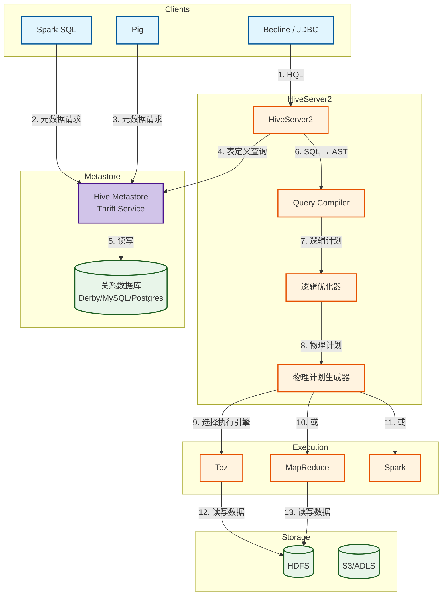
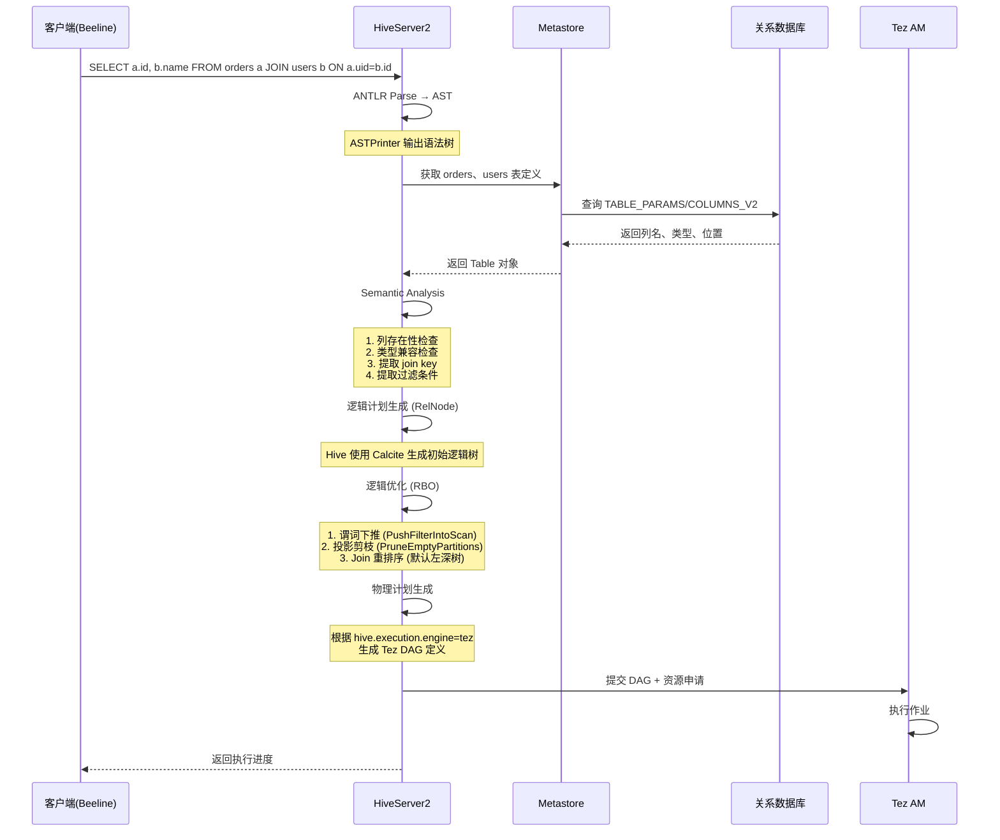
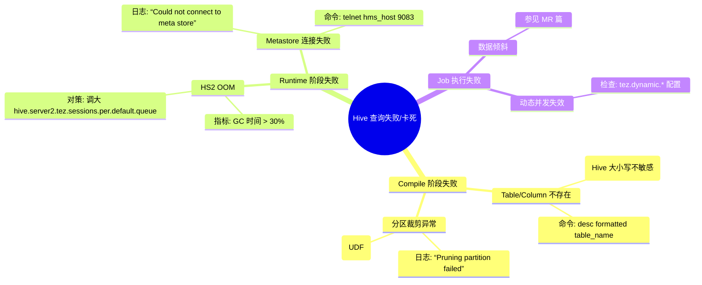

> [!info] 摘要  
> Hive 并非“SQL on Hadoop”的第一个尝试，却是**唯一将元数据管理与执行引擎彻底解耦、从而支撑起整个数据湖生态**的架构。本文从“Hive Metastore 如何成为 Hadoop 的事实目录”这一视角切入，深度解析 HMS 的表定义抽象、分区模型、事务性元数据存储三大设计。通过源码级拆解 Hive SQL 的**解析→语义分析→逻辑计划→物理计划→执行引擎适配**五阶段编译流程，还原一次 JOIN 查询如何最终转化为 Tez DAG。结合生产案例，提供 Metastore 连接池打满、分区数爆炸、HiveServer2 OOM 等典型问题排查方案。最后，在 2026 年 Iceberg 等表格式逐步接管元数据管理的背景下，讨论 HMS 向**开放目录**转型的必然路径。

---

## 一、核心概念与底层图景

### 1.1 定义

> [!quote] 工程定义  
> **Apache Hive** 是一个**将 SQL 语句转换为分布式作业**的数据仓库基础设施。其核心由两部分构成：**Hive Metastore（元数据存储）** 与 **查询编译器**。HMS 独立于任何执行引擎，而编译器负责将 SQL 转化为 MapReduce/Tez/Spark 任务。

*类比*：Hive 不是数据库，而是**为已存储在 HDFS 的数据附加 Schema 解释层**的翻译器。

### 1.2 架构全景图



> [!note] 交互方向解读  
> - **元数据路径**：所有客户端均通过 **Thrift API** 访问 HMS，HMS 自身无状态，将数据持久化至关系库。  
> - **查询路径**：HS2 接收 SQL → 本地编译 → 生成执行计划 → 提交至 YARN。  
> - **关键解耦**：HMS **不依赖** HS2，Spark/Presto/Impala 均可直连 HMS 获取表定义。**这是 Hive 统治数据湖元数据十余年的根本原因**。

---

## 二、机制原理深度剖析

### 2.1 核心子模块拆解

| 子模块 | 职责 | 设计意图/为何独立 |
|-------|------|------------------|
| **HMS (Hive Metastore)** | 存储表、分区、列、SerDe、存储路径等元数据 | **统一目录**：将文件（HDFS路径）抽象为表，提供 ACID 特性的元数据操作 |
| **Thrift API** | 跨语言元数据访问接口 | **语言中立**：支持 Java/C++/Python/PHP 客户端，生态扩展基础 |
| **HS2 (HiveServer2)** | 多会话 SQL 服务，执行查询编译 | **会话隔离**：独立进程，崩溃不影响元数据 |
| **Parser** | SQL → AST（抽象语法树） | **语法兼容**：基于 ANTLR 生成，支持 HiveQL 与大部分 SQL-92 |
| **Semantic Analyzer** | AST → 逻辑计划 + 元数据绑定 | **完整性检查**：列名/表名存在性、类型兼容、分区裁剪表达式提取 |
| **逻辑优化器** | 谓词下推、投影剪枝、Join 重排 | **RBO**：基于规则的优化，不依赖统计信息 |
| **物理计划生成器** | 逻辑计划 → 物理算子树 → DAG | **执行引擎适配**：输出 Tez DAG / MR Spec / Spark DataFrame 代码 |

> [!tip]- 深度分析：为什么 Hive 直到 2014 年才支持 ACID？  
> **历史约束**：Hive 设计之初假设数据**一次性写入，多次读取**，底层 HDFS 不支持文件内随机修改。  
> **外部压力**：Oracle/SQL Server 数据仓库迁移至 Hadoop，客户要求 UPDATE/DELETE 语义。  
> **权衡方案**：不修改 HDFS，而是**在 ORC 文件上实现增量文件叠加（Base + Delta）**。  
> **代价**：ACID 表性能约为非 ACID 表的 60%，且必须使用 ORC 格式。  
> **结果**：ACID 启用率长期低于 20%，直到 Iceberg/Hudi 以“表格式”方式重新解决此问题。

### 2.2 核心流程可视化：**SQL → Tez DAG 完整编译链路**



> [!warning] 关键决策点  
> - **分区裁剪时机**：Hive 在**语义分析阶段**提取 `WHERE` 中的分区字段表达式，生成分区过滤条件。**过早**提取可减少元数据查询量，但复杂表达式（如函数嵌套）需延迟至逻辑计划。  
> - **Join 策略**：  
>   - `MapJoin`（小表）：编译期决定，将小表复制至每个 Mapper 内存。  
>   - `ReduceJoin`（大表）：Shuffle 至 Reduce 阶段完成。  
>   - 3.x 支持**运行时选择**（`hive.auto.convert.join.noconditionaltask`）。  
> - **统计信息**：若无统计信息（ANALYZE TABLE），优化器无法准确选择广播 Join，**默认走 ReduceJoin**。

---

## 三、内核/源码级实现

### 3.1 核心数据结构（Java）

> [!code] 包路径：`org.apache.hadoop.hive.metastore` 与 `org.apache.hadoop.hive.ql`

```java
/**
 * Hive Metastore 的 Thrift 服务端实现。
 * 路径：org.apache.hadoop.hive.metastore.HiveMetaStore
 */
public class HiveMetaStore {
    /**
     * 核心元数据操作：获取表定义。
     * 并发保护：基于关系数据库事务隔离级别，HMS 自身无锁。
     */
    public Table getTable(String dbName, String tableName) throws MetaException {
        // 1. 从缓存中获取（guava Cache）
        Table tbl = tableCache.get(dbName, tableName);
        if (tbl != null) return tbl;
        
        // 2. 缓存未命中 → 查询底层数据库
        RawStore rs = getRawStore();  // 线程局部变量，每个请求独立事务
        tbl = rs.getTable(dbName, tableName);
        
        // 3. 填充缓存
        tableCache.put(dbName, tableName, tbl);
        return tbl;
    }
}

/**
 * Hive 查询编译器的核心上下文。
 * 路径：org.apache.hadoop.hive.ql.QueryPlan
 */
public class QueryPlan {
    private final String queryString;       // 原始 SQL
    private final Operator<?> rootOp;       // 逻辑计划根节点
    private final Map<String, String> hints;// Query Hints
    
    // 执行计划切分后的任务列表（MR/Tez DAG）
    private List<Task<? extends Serializable>> rootTasks;
    
    // 并发保护：QueryPlan 单线程构造，只读提交
}

/**
 * 物理计划中的 Tez DAG 构建器。
 * 路径：org.apache.hadoop.hive.ql.exec.tez.TezTask
 */
public class TezTask extends Task<TezWork> {
    private TezWork work;   // 封装了 DAG 定义
    
    /**
     * 核心方法：将 Hive 算子树转换为 Tez Vertex/Edge。
     * 调用链：compile → genMapRedTasks → convertToTez
     */
    @Override
    public int execute(DriverContext driverContext) {
        // 1. 遍历 Hive 逻辑算子树
        // 2. 为每个 ReduceSink 算子生成 Tez Edge (SCATTER_GATHER)
        // 3. 为每个 FileSink 算子生成 OutputVertex
        // 4. 序列化 DAG 提交至 Tez AM
        TezConfiguration tezConf = new TezConfiguration(conf);
        DagClient client = DagClient.createDagClient(tezConf);
        client.submitDag(work.getDAG());
    }
}
```

> [!bug] 并发模型  
> - **HMS**：无状态服务，每个 Thrift 请求启动独立数据库事务（`RawStore` 线程局部）。  
> - **HS2**：每个 JDBC 会话对应一个 `SessionState`，包含 `HiveConf`、临时表、UDF 注册表。**编译过程单线程**。  
> - **瓶颈**：HMS 数据库连接数极易打满——默认 `hive.metastore.max.threads=20`，连接池单节点上限 40。**千万级分区表的 getPartitions 操作会耗尽连接**。

### 3.2 核心流程伪代码：**分区裁剪实现**

```java
// 路径：org.apache.hadoop.hive.ql.optimizer.pcr.PcrExprProc
// 功能：将 WHERE 条件中的分区字段表达式转化为 Partition Pruner

public class PartitionPruner {
    /**
     * 输入：查询 SQL 的 WHERE 条件表达式（ExprNodeGenericFuncDesc）
     * 输出：可求值的分区过滤器
     */
    public static PrunedPartitionList prune(Table table, 
                                            ExprNodeDesc predicate) {
        // 1. 提取分区列
        List<FieldSchema> partCols = table.getPartCols();
        
        // 2. 遍历表达式，构建分区键 → 值映射
        Map<String, Set<String>> partKeyToValues = new HashMap<>();
        predicate.accept(new ExprNodeVisitor() {
            @Override
            public void visit(ExprNodeGenericFuncDesc func) {
                if (func.isPartitionKeyPredicate()) {
                    // 示例: ds = '2026-02-11'
                    String key = func.getColName();
                    String value = func.getValue();
                    partKeyToValues.computeIfAbsent(key, k -> new HashSet<>()).add(value);
                }
            }
        });
        
        // 3. 与 HMS 交互，获取匹配的分区名
        List<Partition> partitions = metastore.getPartitionsByFilter(
            table, partKeyToValues);
        
        return new PrunedPartitionList(partitions);
    }
}
```

> [!example]- 版本差异（1.x → 3.x）  
> - **1.x**：分区裁剪在**语义分析后**硬编码执行，仅支持 `=`、`IN`、`BETWEEN`。  
> - **2.x**（HIVE-10028）：引入**逻辑计划优化阶段**的分区裁剪，支持函数表达式（`date_add(ds,1)=...`）。  
> - **3.x**：分区信息缓存至 HMS（`hive.metastore.partition.name.cache`），避免频繁查库。

---

## 四、生产落地与 SRE 实战

### 4.1 场景化案例：**Metastore 连接池打满导致所有查询卡死**

> [!danger] 现象  
> - 所有 Hive/Spark/Presto 查询均卡在 `Waiting for metastore connection`。  
> - HMS 日志大量 `Caused by: java.sql.SQLNonTransientConnectionException: Data source rejected establishment of connection, message from server: "Too many connections"`。  
> - MySQL 侧显示 `max_connections=151` 已用满。

> [!check] 排查链路  
> 1. **检查 HMS 连接池配置** → `hive.metastore.connection.pool.maxConnections=10`（默认 10）。  
> 2. **查看活跃连接** → MySQL `show processlist;` 发现 140 个连接来自 HMS 主机，且大部分处于 `Sleep` 状态。  
> 3. **根因**：HMS 默认使用 **C3P0 连接池**，空闲连接存活时间过长，且未开启自动回收。

> [!success] 解决方案  
> ```bash
> # 方案A：立即清理（应急）
> mysql> kill 1050; kill 1051; ...  # 逐个 kill sleep 连接
> 
> # 方案B：永久修复（hive-site.xml）
> <property>
>   <name>hive.metastore.connection.pool.maxConnections</name>
>   <value>30</value>  <!-- 调大，但不超过 MySQL 总连接数 -->
> </property>
> <property>
>   <name>datanucleus.connectionPool.maxPoolSize</name>
>   <value>30</value>  <!-- DataNucleus 连接池 -->
> </property>
> <property>
>   <name>hive.metastore.connection.pool.minEvictableIdleTimeMillis</name>
>   <value>60000</value>  <!-- 1分钟回收空闲连接 -->
> </property>
> ```

> [!done] 验证  
> 重启 HMS，连接数稳定在 30 左右，不再堆积睡眠连接。

### 4.2 参数调优矩阵

| 参数名 | 作用域 | 推荐值（Hive 4.0） | 内核解释 |
|--------|--------|----------------|---------|
| `hive.metastore.uris` | 客户端 | `thrift://hms1:9083,thrift://hms2:9083` | 多 HMS 地址，客户端轮询负载均衡 |
| `hive.metastore.client.socket.timeout` | 客户端 | `600`（秒） | Thrift 读超时。大分区表查询需调高 |
| `hive.metastore.partition.name.cache` | HMS | `true` | 启用分区名缓存，减少数据库查询 |
| `hive.server2.thrift.port` | HS2 | `10001`（避免与 Hive 1.x 冲突） | HS2 Thrift 端口 |
| `hive.execution.engine` | HS2 | `tez` | 执行引擎，3.x+ 推荐 tez，spark 已废弃 |
| `hive.auto.convert.join` | 查询级 | `true` | 自动转换为 MapJoin，依赖表统计信息 |
| `hive.tez.auto.reducer.parallelism` | 查询级 | `true` | 启用 Tez 动态并行度 |

### 4.3 监控与诊断

> [!info] 关键指标

| 指标名 | 健康区间 | 瓶颈阈值 | 含义 |
|--------|----------|----------|------|
| `metastore_thrift_active_connections` | < 20 | > 50 | HMS Thrift 活跃线程数，超阈值需扩容 |
| `metastore_db_query_latency_p99` | < 50ms | > 200ms | 元数据查询慢，索引缺失或数据量过大 |
| `hive_query_compile_time` | < 2s | > 10s | SQL 编译耗时，通常为分区数过多 |
| `hive_active_sessions` | < 100 | > 500 | HS2 并发会话数，超限需扩容 |

> [!example] 诊断命令  
> ```bash
> # 查看 HMS 当前 Thrift 连接数
> netstat -anp | grep 9083 | wc -l
> 
> # 获取 HS2 卡死线程栈
> jstack -l `pidof HiveServer2` | grep -A 30 "RUNNABLE"
> 
> # 查询表分区数
> hive -e "SHOW PARTITIONS large_table;" | wc -l
> ```

### 4.4 故障排查决策树



---

## 五、技术演进与未来视角（2026+）

### 5.1 历史设计约束与改进

| 版本 | 变化 | 动因/解决的问题 |
|------|------|----------------|
| 0.10 (2012) | **HiveServer2** | 替代 HiveServer1，支持多会话、Kerberos |
| 0.13 (2014) | **ACID 事务表** | 满足数据仓库 UPDATE/DELETE 需求 |
| 2.1 (2016) | **HPL/SQL** | 兼容 Oracle PL/SQL，降低迁移成本 |
| 3.0 (2018) | **LLAP** | 交互式查询优化 |
| 4.0 (2021) | **弃用 Spark 引擎** | 社区聚焦 Tez，减少维护负担 |

### 5.2 2026 年仍存在的“遗留设计”

> [!bug] 痛点1：分区数爆炸  
> Hive 表支持数万分区，但 **Metastore 数据库的 partition 表行数**成为瓶颈。  
> `ALTER TABLE ... ADD PARTITION` 在千万级分区表上耗时数分钟。  
> **为何不改**：分区是 Hive 的“一等公民”，完全重构分区模型 = 重写 HMS。

> [!bug] 痛点2：数据库绑定过强  
> HMS 直接依赖关系数据库事务，**无法像 Iceberg 一样基于文件实现元数据 ACID**。  
> **为何保留**：2010 年代无成熟分布式事务存储，MySQL/PostgreSQL 是唯一选择。  
> **社区方案**：HMS 2.0 计划支持 **Raft 元数据存储**，但进度缓慢。

> [!tip] 替代方案  
> 新项目直接采用 **Iceberg + Spark/Presto**，绕过 HMS；存量 Hive 用户通过 **Iceberg 迁移工具**逐步解耦。

### 5.3 未来趋势

- **HMS 2.0（预测）**：  
  - 支持对象存储（S3/OSS）作为元数据后端。  
  - 与 Iceberg 的 `HadoopCatalog` 融合，实现统一目录接口。
- **HS2 走向 Serverless**：  
  - 按需拉起，无常驻进程（已有厂商实现 Hive On K8s + 弹性伸缩）。  
- **Hive 的终点**：  
  - **作为 SQL 编译器的价值**会留存，但作为执行引擎的角色逐步被 Spark/Trino 蚕食。  
  - **Metastore 将继续存在 10 年以上**，因为它是 Hadoop 生态唯一通用的目录服务。

> [!quote] 二十年后的 Hive  
> 它将不再是一个“数据仓库产品”，而是退化为 **元数据管理服务 + SQL 解析库**。但整个大数据生态至今没有第二个工具，能像它一样**兼容从百 MB 到百 PB 的所有数据规模，且维持同一套 SQL 方言**。

---

## 参考文献
- 源码路径：`standalone-metastore/`（Hive 4+ 独立 Metastore 项目）
- 源码路径：`ql/src/java/org/apache/hadoop/hive/ql/parse/`（编译核心）
- 官方文档：[Hive Metastore Administration](https://cwiki.apache.org/confluence/display/Hive/AdminManual+Metastore+Administration)
- 相关 JIRA：HIVE-10028（分区裁剪优化）、HIVE-19312（独立 Metastore）
- Thusoo, A., et al. (2009). "Hive - A Warehousing Solution Over a Map-Reduce Framework." VLDB.