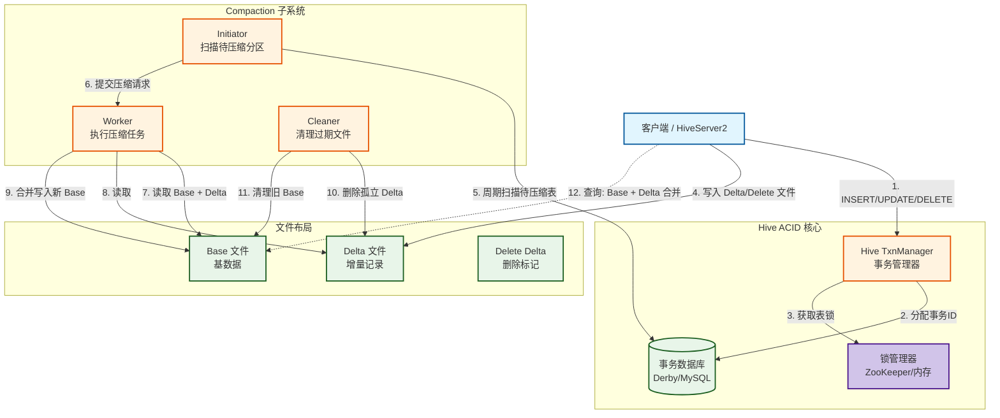
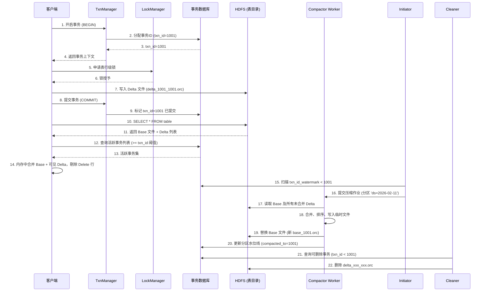
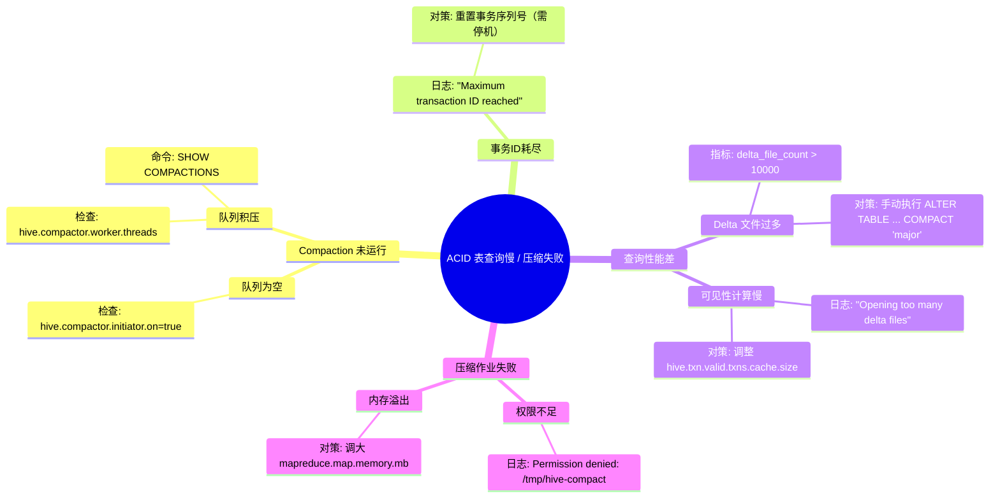

> [!info] 摘要  
> Hive ACID 是**在不可变文件系统（HDFS）之上实现可变数据语义**的经典妥协工程。它不修改底层存储，而是通过**增量文件叠加（Base + Delta）**与**事务状态日志**，在 ORC 文件层面构建出 ACID 幻觉。本文从“如何在只读文件系统上实现 UPDATE/DELETE”这一根本矛盾切入，深度解析 Hive ACID 表的文件布局、事务 ID 分配机制、Compaction 的三大策略（Minor/Major/Cumulative）。通过源码级拆解 Delta 文件合并、Compactor 调度、清理器生命周期，还原一次 ACID 表写入→查询→压缩的全流程。结合生产案例，提供 Compaction 积压死锁、小文件雪崩、事务 ID 耗尽等典型问题排查方案。最后，在 2026 年 Iceberg 已成湖仓一体事实标准的背景下，讨论 Hive ACID 的**存量兼容价值**与**不可移植包袱**。

---

## 一、核心概念与底层图景

### 1.1 定义

> [!quote] 工程定义  
> **Hive ACID** 是一套**基于文件叠加与事务日志**的变更新语义实现。它允许对 ORC 格式的 Hive 表执行行级 INSERT/UPDATE/DELETE，并通过 **Compaction** 将增量文件合并回基文件，解决小文件膨胀问题。

*类比*：Hive ACID 如同在纸质账本（HDFS 文件）上**不擦写原始记录，而是每次修改贴一张便利贴（Delta 文件）**，查询时由管理员将所有便利贴汇总后朗读。

### 1.2 架构全景图



> [!note] 交互方向解读  
> - **写入路径**：客户端申请事务 ID → 获取行级锁 → 写入 Delta/Delete 文件到表目录下的事务子目录。  
> - **读取路径**：查询引擎必须同时读取 Base 文件（完整快照）+ 所有未合并的 Delta 文件 + Delete 标记，在内存中合并出最新版本。  
> - **Compaction 路径**：独立后台进程将多个 Delta 文件合并为新的 Base 文件，并清理已合并的过期文件。  
> - **状态持久化**：事务 ID、压缩进度、锁状态均存储在独立的事务数据库中（与 HMS 共享或独立）。

---

## 二、机制原理深度剖析

### 2.1 核心子模块拆解

| 子模块 | 职责 | 设计意图/为何独立 |
|-------|------|------------------|
| **事务ID分配器** | 全局唯一递增 64 位 ID，标记每个写入事务 | **版本标识**：所有 Delta/Delete 文件名均包含 `min_txn`/`max_txn`，查询时根据可见性过滤 |
| **Delta 文件** | 存储 INSERT/UPDATE 产生的新行数据 | **增量不可变**：一旦落盘永不修改，查询时与 Base 合并 |
| **Delete Delta 文件** | 仅存储被删除行的主键（或整行原始值） | **墓碑机制**：避免修改 Base 文件，通过标记实现逻辑删除 |
| **Compaction 队列** | 存储待压缩分区列表及优先级 | **异步化**：将 I/O 密集型操作移出查询路径 |
| **Compactor Worker** | 执行 MapReduce/Tez 作业，读取 Base + Deltas，写出新 Base | **与执行引擎复用**：直接调用 MR/Tez，无需额外计算框架 |
| **Cleaner** | 删除所有事务 ID 小于当前快照的 Delta 文件 | **垃圾回收**：基于事务水位线，确保已压缩文件被物理删除 |

> [!tip]- 深度分析：为什么 Hive ACID 直到 0.13 才发布？  
> **根本矛盾**：HDFS 不支持文件内随机写，而数据库需要行级更新。  
> **早期尝试**：Hive 0.7 曾尝试 HBase 作为存储引擎（HBase 支持随机写），但 SQL 兼容性与性能无法满足数据仓库需求。  
> **转折点**：ORC 格式 2.0 版本开始支持**列级索引**与**行级别版本戳**，使得在不重写整个文件的前提下，快速定位并合并 Delta 成为可能。  
> **妥协结果**：性能 ≈ 非 ACID 表的 60%，但满足 ETL 增量加载场景。

### 2.2 核心流程可视化：**ACID 表写入 → 查询 → 压缩全生命周期**



> [!warning] 关键决策点  
> - **事务ID可见性**：Hive 采用**快照隔离**级别。查询只看到**提交时间早于查询开始时间**的事务。  
> - **Delete 实现方式**：早期版本存储被删除行的整行数据；3.x+ 支持**仅存储主键**（需表有主键约束）。  
> - **Compaction 策略**：  
>   - **Minor**：合并多个 Delta 为单个 Delta，不改 Base。  
>   - **Major**：合并 Base + 所有 Delta 为新 Base。  
>   - **Cumulative**（Hive 4+）：增量合并 Delta，避免 Full Compaction 的 I/O 峰值。

---

## 三、内核/源码级实现

### 3.1 核心数据结构（Java）

> [!code] 包路径：`org.apache.hadoop.hive.ql.lockmgr` 与 `org.apache.hadoop.hive.ql.txn`

```java
/**
 * 事务上下文，每个写入会话持有。
 * 路径：org.apache.hadoop.hive.ql.txn.TxnManager
 */
public class ValidTxnList {
    private final long[] excludedTxns;      // 不可见事务ID（活跃/回滚）
    private final long minOpenTxn;          // 最小活跃事务ID
    private final long highWatermark;       // 最大已提交事务ID
    
    /**
     * 核心可见性判断：该 Delta 文件是否对当前查询可见。
     * Delta 文件名编码了 minTxnId / maxTxnId。
     */
    public boolean isTxnVisible(long txnId) {
        if (txnId > highWatermark) return false;  // 提交晚于查询开始
        if (txnId < minOpenTxn) return true;      // 早于所有活跃事务
        // 检查是否在排除列表中
        return Arrays.binarySearch(excludedTxns, txnId) < 0;
    }
}

/**
 * Delta 文件命名规范。
 * 格式：delta_minTxnId_maxTxnId[_attemptId].orc
 * 示例：delta_1001_1001_0.orc
 */
public class AcidUtils {
    public static final String DELTA_PREFIX = "delta_";
    public static final String DELETE_DELTA_PREFIX = "delete_delta_";
    public static final String BASE_PREFIX = "base_";
    
    /**
     * 从文件名解析事务范围
     */
    public static AcidDirectory parseAcidPath(Path dir) {
        // 遍历目录，分组：base_xxx, delta_xxx, delete_delta_xxx
    }
}

/**
 * Compactor 压缩队列条目。
 * 路径：org.apache.hadoop.hive.ql.txn.compactor.CompactorUtil
 */
public class CompactionInfo {
    public final String dbName;
    public final String tableName;
    public final String partName;          // 分区名，非分区表为空
    public final String compactionType;    // MINOR / MAJOR
    public final long runAs;              // 提交用户ID
    public final long id;                // 压缩任务ID
    
    // 并发保护：状态变更通过 TxnHandler 持久化至数据库
    // Compactor 进程间不共享内存状态，全量依赖 DB 轮询
}
```

> [!bug] 并发模型  
> - **写入并发**：依赖 `LockManager`（ZooKeeper 或内存），**行级锁**实际是**分区级锁**的细化，粒度较粗。  
> - **读取并发**：无锁，完全依赖事务 ID 可见性判断，**读不阻塞写，写不阻塞读**。  
> - **Compaction 并发**：多个 Worker 可并行压缩不同分区；**同一分区仅允许一个压缩任务**，由数据库乐观锁控制。  
> - **瓶颈**：事务数据库（MySQL）成为全局写入瓶颈——每次提交均需写入 `TXNS`、`TXN_COMPONENTS` 表。

### 3.2 核心流程伪代码：**Major Compaction 作业实现**

```java
// 路径：org.apache.hadoop.hive.ql.txn.compactor.CompactorMR
// Compaction 以 MapReduce 作业形式执行

public class MajorCompactor {
    /**
     * Map 阶段：读取 Base + Delta 文件
     * InputFormat: OrcInputFormat（定制）
     */
    public static class CompactionMapper {
        public void map(Object key, OrcStruct value, Context ctx) {
            // 1. 获取该行的最新版本
            // 2. 检查 Delete Delta 中是否包含该行主键
            // 3. 若未被删除，输出 (bucket_id, row)
        }
    }
    
    /**
     * Reduce 阶段：按桶排序，写入新 Base 文件
     */
    public static class CompactionReducer {
        public void reduce(IntWritable bucket, Iterable<OrcStruct> rows) {
            // 按主键/偏移量排序（保证数据分布与 Base 一致）
            // 批量写入 ORC 文件
            OrcFile.Writer writer = OrcFile.createWriter(
                new Path(baseDir, "base_" + newTxnId),
                conf
            );
            for (OrcStruct row : rows) {
                writer.addRow(row);
            }
            writer.close();
        }
    }
    
    /**
     * 作业后置钩子：更新事务水位线
     */
    public int run(String[] args) {
        Job job = Job.getInstance(conf, "Compaction: " + tableName);
        // ... 设置 Mapper/Reducer ...
        boolean success = job.waitForCompletion(true);
        if (success) {
            // 记录该分区已压缩至 txnId = maxDeltaTxnId
            txnHandler.markCompacted(db, table, part, maxTxnId);
        }
        return success ? 0 : 1;
    }
}
```

> [!example]- 版本差异（2.x → 3.x → 4.x）  
> - **2.x**：仅支持 **Major Compaction**，每次压缩读取所有 Base + Delta，I/O 放大严重。  
> - **3.x**：引入 **Minor Compaction**，仅合并 Delta 文件，不改 Base，适合高频写入场景。  
> - **4.x**：**Cumulative Compaction**（增量合并），避免 Major 作业长时间持有旧 Base 文件句柄。

---

## 四、生产落地与 SRE 实战

### 4.1 场景化案例：**Compaction 积压导致 Delta 文件雪崩，查询性能归零**

> [!danger] 现象  
> - 某实时写入 Hive ACID 表（5 分钟写入一次），一周后查询耗时从 10 秒暴涨至 10 分钟。  
> - HDFS 表目录下 Delta 文件数量达 50,000+。  
> - NameNode RPC 队列积压，影响集群其他作业。

> [!check] 排查链路  
> 1. **查看 Compaction 队列** → `SHOW COMPACTIONS;` 显示无 Running 任务，且 0 条等待。  
> 2. **检查 Compactor 进程** → `jps` 发现 `HiveMetaStore` 进程存在，但 **Initiator/Worker 线程未启动**。  
> 3. **根因**：Hive 4.0 默认**关闭自动压缩**，需显式配置 `hive.compactor.initiator.on=true` 且指定 `hive.compactor.worker.threads>0`。

> [!success] 解决方案  
> ```xml
> <!-- hive-site.xml 强制开启压缩 -->
> <property>
>   <name>hive.compactor.initiator.on</name>
>   <value>true</value>
> </property>
> <property>
>   <name>hive.compactor.worker.threads</name>
>   <value>4</value>  <!-- 每个 Metastore 启动 4 个 Worker -->
> </property>
> <property>
>   <name>hive.compactor.delta.num.threshold</name>
>   <value>50</value> <!-- 超过 50 个 Delta 触发 Minor -->
> </property>
> ```

> [!done] 验证  
> 重启 HMS，Compactor 开始消费积压队列。2 小时后 Delta 文件降至 100 以内，查询性能恢复。

### 4.2 参数调优矩阵

| 参数名 | 作用域 | 推荐值（Hive 4.0） | 内核解释 |
|--------|--------|----------------|---------|
| `hive.support.concurrency` | 全局 | `true` | 启用并发事务，ACID 表必要条件 |
| `hive.txn.manager` | 全局 | `org.apache.hadoop.hive.ql.lockmgr.DbTxnManager` | 使用数据库事务管理器 |
| `hive.compactor.initiator.on` | HMS | `true` | 周期性扫描待压缩分区 |
| `hive.compactor.worker.threads` | HMS | `4` | 并行压缩任务数，调高需注意 I/O 争抢 |
| `hive.compactor.delta.num.threshold` | 表级 | `10` | 触发 Minor 压缩的 Delta 文件数阈值 |
| `hive.compactor.delta.pct.threshold` | 表级 | `0.1` | Delta 文件总大小超过 Base 10% 时触发 Major |
| `hive.txn.max.open.batch` | HMS | `10000` | 单次事务批大小，避免大事务撑爆内存 |
| `hive.txn.timeout` | HMS | `300`（秒） | 未心跳事务超时时间，缺省 5 分钟 |

### 4.3 监控与诊断

> [!info] 关键指标

| 指标名 | 健康区间 | 瓶颈阈值 | 含义 |
|--------|----------|----------|------|
| `compaction_queue_size` | < 10 | > 100 | 等待压缩的分区数，积压标志 |
| `delta_file_count` | < 1000 | > 10000 | 表目录下 Delta 文件总数，超阈值需强制压缩 |
| `txn_open_transactions` | < 100 | > 1000 | 活跃事务数，长期未提交事务泄露 |
| `compaction_job_duration_sec` | < 300 | > 1800 | 单次 Major 压缩耗时，检查是否 I/O 瓶颈 |

> [!example] 诊断命令  
> ```sql
> -- 查看当前所有压缩任务状态
> SHOW COMPACTIONS;
> 
> -- 查询事务积压情况
> SELECT * FROM metastore.TXNS WHERE txn_last_heartbeat < UNIX_TIMESTAMP() - 600;
> 
> -- 统计 Delta 文件数（HDFS）
> hdfs dfs -count -q /warehouse/table/delta* | wc -l
> ```

### 4.4 故障排查决策树



---

## 五、技术演进与未来视角（2026+）

### 5.1 历史设计约束与改进

| 版本 | 变化 | 动因/解决的问题 |
|------|------|----------------|
| 0.13 (2014) | **ACID 事务表** | 初始版本，仅支持 INSERT，不支持 UPDATE/DELETE |
| 1.3 (2016) | **UPDATE/DELETE 支持** | 满足 GDPR 删除需求 |
| 2.1 (2017) | **Minor Compaction** | 减少 Major 对磁盘 I/O 的冲击 |
| 3.0 (2018) | **TxnHandler 重构** | 解除与 Derby 的强制绑定，支持 MySQL 高可用 |
| 4.0 (2021) | **Cumulative Compaction** | 增量合并，避免 Full Scan |

### 5.2 2026 年仍存在的“遗留设计”

> [!bug] 痛点1：事务数据库的单点瓶颈  
> Hive ACID 将事务状态写入 MySQL/PostgreSQL，**该库成为全局写入瓶颈**。  
> **对比**：Iceberg 通过元数据文件列表实现 ACID，**无中心化数据库**。  
> **为何不改**：Hive ACID 架构深度绑定 RDBMS，重构成元数据文件模型 ≈ 重写整个 ACID 子系统。

> [!bug] 痛点2：Compaction 与查询的 I/O 争抢  
> Major Compaction 执行时，**同时读取旧 Base + 所有 Delta**，与查询共享磁盘带宽。  
> **无法根治**：即使使用 YARN 队列隔离，底层 HDFS 仍然是共享存储。  
> **社区方案**：调度压缩作业至低峰时段（`hive.compactor.cron`）。

> [!bug] 痛点3：跨版本兼容性债务  
> Hive 2.x ACID 表与 Hive 3.x/4.x 元数据格式不兼容，**升级需重写表**。  
> **现状**：大量生产集群因此**永远停留在 Hive 2.x**。

### 5.3 未来趋势

- **Hive ACID 的终点**：  
  **不会再有重大新特性开发**。Hive 社区已明确将**表格式研发重心转移至 Iceberg**。
- **存量维护**：  
  修复关键 Bug，确保 CDP/HDInsight 等发行版客户的兼容性。
- **迁移路径**：  
  Hive 4.0 提供 **`HiveIceberg` 表格式**，支持将 ACID 表原地转换为 Iceberg 表（仅改元数据，不移动数据）。

> [!quote] 十年后的 Hive ACID  
> 它将作为**第一代湖仓事务方案**写入教科书——它不够优雅，效率不高，但在 HDFS 只读时代强制实现了可变数据语义。Iceberg 站在它的肩膀上，把“文件列表即事务”的设计推向了极致。

---

## 参考文献
- 源码路径：`ql/src/java/org/apache/hadoop/hive/ql/txn/`
- 源码路径：`ql/src/java/org/apache/hadoop/hive/ql/io/orc/`（RecordReader 合并逻辑）
- 官方文档：[Hive Transactions](https://cwiki.apache.org/confluence/display/Hive/Hive+Transactions)
- 相关 JIRA：HIVE-17013（Cumulative Compaction），HIVE-19312（独立 Metastore 事务）
- 设计文档：[ACID in Hive](https://cwiki.apache.org/confluence/display/Hive/Design+docs/ACID+in+Hive+0.13)