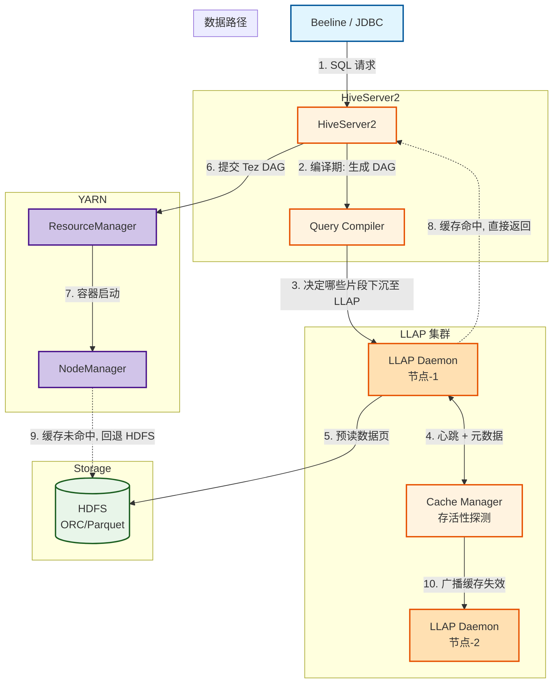
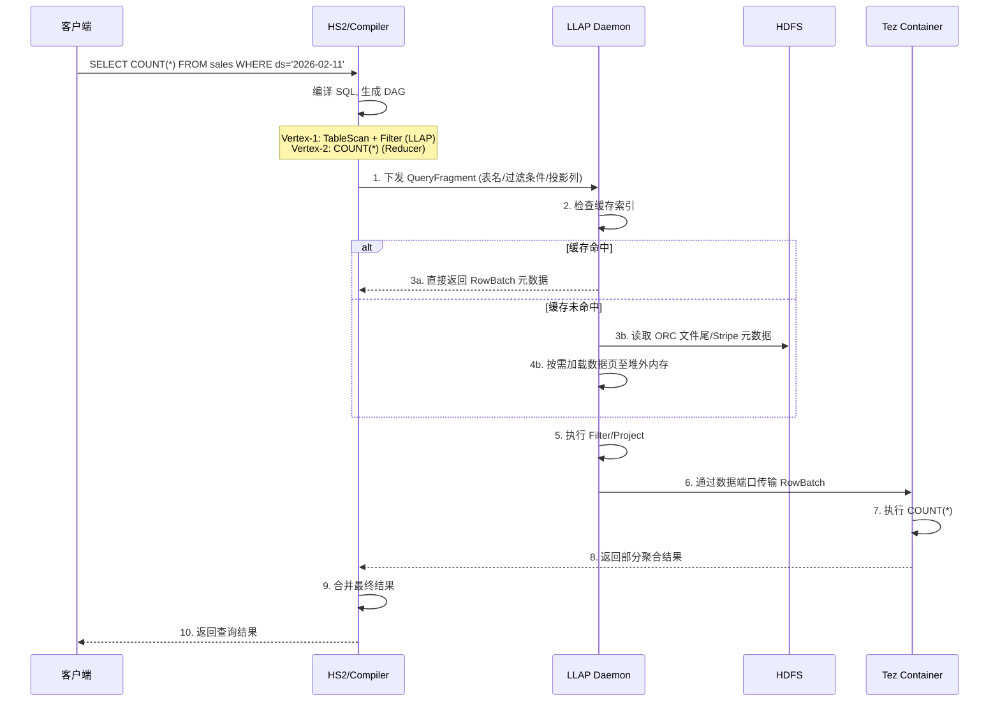
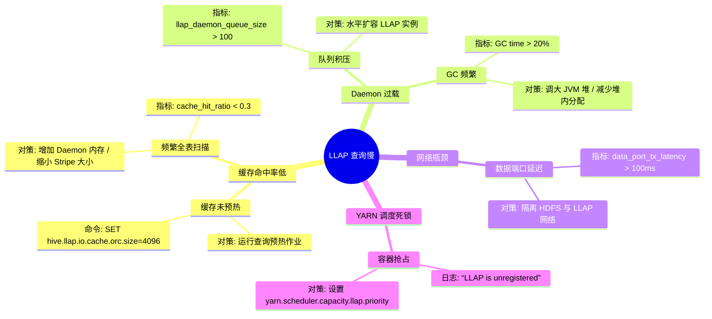

> [!info] 摘要  
> Hive LLAP（Low Latency Analytical Processing）不是简单缓存，而是一套**将 Tez DAG 执行与常驻进程内存池深度耦合**的混合执行架构。它通过**预加载数据分片、压缩列存格式、片段级流水线**，在保持 Hive 高吞吐批处理能力的同时，将查询延迟压缩至秒级。本文从“如何让 Hive 像 Presto 一样快但保留 ACID 语义”这一矛盾切入，深度解析 LLAP Daemon 的**双端口设计**（I/O 端口 + 执行端口）、缓存淘汰策略、谓词下推下移机制。通过源码级拆解 LLAP 的 InputFormat 重写、RowBatch 流水线、容器内复用池，还原一次 LLAP 查询如何绕过 YARN 调度直接命中内存数据。结合生产案例，提供 LLAP Daemon OOM、缓存命中率骤降、YARN 队列抢占死锁等典型问题排查方案。最后，在 2026 年 Presto/Trino 已成交互查询事实标准的背景下，讨论 Hive LLAP 的**混合负载价值**与**运维复杂度过高**的根本矛盾。

---

## 一、核心概念与底层图景

### 1.1 定义

> [!quote] 工程定义  
> **Hive LLAP** 是一个**将部分数据缓存于常驻 JVM 进程，并在进程内直接执行查询片段**的执行增强框架。它不是独立的查询引擎，而是 **Tez 执行引擎的缓存化扩展**——查询仍然走 Hive 编译器，但数据读取和基础过滤下沉至 LLAP Daemon。

*类比*：LLAP 如同图书馆的**阅览室常驻研究员**——你不需要每次从书库（HDFS）搬书，研究员已在桌上摊开最常用的几本，并帮你翻到需要的章节。

### 1.2 架构全景图



> [!note] 交互方向解读  
> - **控制流**：HS2 编译 SQL，将**可下沉算子**（TableScan、Filter、Project）标记为 LLAP 执行，其余部分仍走 Tez 容器。  
> - **数据流**：LLAP Daemon 直接读取 HDFS，以**列存批处理**格式（RowBatch）传输给下游。  
> - **混合执行**：同一 DAG 中，部分 Vertex 在 LLAP 进程内执行，部分在独立容器执行。**这是 Hive 实现“批处理 + 交互式”一体化的核心设计**。  
> - **存活性**：LLAP Daemon 作为 YARN 长服务托管，故障由 ResourceManager 重启。

---

## 二、机制原理深度剖析

### 2.1 核心子模块拆解

| 子模块 | 职责 | 设计意图/为何独立 |
|-------|------|------------------|
| **LLAP Daemon** | 常驻 JVM 进程，持有数据缓存 + 执行查询片段 | **消除调度延迟**：避免每次查询申请 YARN 容器 |
| **InputFormat 重写** | 将 Hive 标准 ORC/Parquet 读路径替换为 LLAP 缓存感知读 | **无缝兼容**：不修改 SQL 语义，仅优化物理读路径 |
| **Cache Manager** | 维护数据块元数据（文件偏移、列统计）与节点分布 | **分布式一致性**：缓存项变更时通知所有 Daemon 失效 |
| **IO 线程池** | 异步预读 HDFS 数据页，解耦网络 I/O 与计算 | **隐藏 I/O 延迟**：计算线程永不直接阻塞读 |
| **RowBatch 流水线** | LLAP → Tez Container 的数据传输协议，批量列存格式 | **零拷贝序列化**：减少跨进程序列化开销 |
| **执行端口/数据端口** | 执行端口（15002）处理查询请求；数据端口（15001）处理批量传输 | **控制流与数据流分离**：避免大结果集阻塞控制面 |

> [!tip]- 深度分析：为什么 LLAP 没有选择完全向量化执行？  
> **历史约束**：Hive 原有执行引擎（MR/Tez）基于**行式逐条处理**，完全改造为向量化需重写全部算子。  
> **妥协**：LLAP **仅缓存层和数据传输层采用列批格式**，实际计算仍以单行模式执行。  
> **效果**：I/O 吞吐提升 5~10 倍，但计算吞吐仅提升 20%。  
> **代价**：CPU 效率仍低于 Presto/Spark 的向量化引擎。  
> **4.x 改进**：引入 **LLAP 向量化插件**，允许自定义算子以向量化模式运行。

### 2.2 核心流程可视化：**LLAP 查询命中缓存全过程**



> [!warning] 关键决策点  
> - **缓存粒度**：LLAP 缓存单位是 **ORC Stripe（默认 64MB）**，而非整文件。  
>   **权衡**：细粒度缓存提高命中率，但增加元数据管理开销。  
> - **淘汰策略**：**LRU + 文件级版本戳**。当 HDFS 文件被覆盖，LLAP 通过 HDFS 监听机制立即失效对应缓存。  
> - **亲和性调度**：HS2 将查询片段下发至**存储对应数据块副本的节点**，避免网络传输。  

---

## 三、内核/源码级实现

### 3.1 核心数据结构（Java）

> [!code] 包路径：`org.apache.hadoop.hive.llap` 与 `org.apache.hadoop.hive.llap.io`

```java
/**
 * LLAP Daemon 的缓存页元数据。
 * 路径：org.apache.hadoop.hive.llap.io.metadata.LlapMetadataCache
 */
public class LlapMetadataCache {
    /**
     * 缓存键：文件路径 + Stripe 偏移量 + 列集合
     */
    static final class CacheKey {
        private final Path filePath;
        private final long stripeOffset;    // ORC Stripe 起始偏移
        private final BitSet columns;       // 投影列ID
        // 不可变对象，hashCode 预计算
    }
    
    /**
     * 缓存值：反序列化后的列数据页（堆外）
     */
    static final class CacheValue {
        private final DirectByteBuffer[] columnBuffers; // 堆外内存
        private final int numRows;          // 行数
        private final long length;          // 占用内存字节数
        private final long lastAccessTime;  // LRU 时间戳
    }
    
    // 并发保护：ConcurrentHashMap + 分段锁
    private final ConcurrentHashMap<CacheKey, CacheValue> cache;
    
    /**
     * 异步预读线程池
     */
    private final ExecutorService ioThreadPool;
}

/**
 * LLAP 与 Tez Container 之间的传输协议。
 * 路径：org.apache.hadoop.hive.llap.daemon.rpc.LlapDaemonProtocol
 */
public interface LlapDaemonProtocol {
    /**
     * 提交查询片段（由 HS2 调用）
     */
    SubmitWorkResponse submitWork(SubmitWorkRequest request);
    
    /**
     * 获取数据块（由 Tez Container 调用）
     */
    DataOutputPacket fetchData(DataInputPacket request);
}

/**
 * RowBatch 序列化格式 - 列式内存布局。
 * 路径：org.apache.hadoop.hive.llap.io.api.impl.LlapIoImpl
 */
public class LlapIoImpl {
    /**
     * 将列批编码为 Thrift 可传输对象。
     * 零拷贝设计：列数据直接引用堆外内存地址。
     */
    public static ByteBuffer serializeRowBatch(ColumnVector[] batch) {
        // 1. 计算所需总内存
        // 2. 分配 DirectByteBuffer
        // 3. 压缩列数据（可选）
        // 4. 写入头部（行数、列数、编码类型）
        return buffer;
    }
}
```

> [!bug] 并发模型  
> - **IO 线程池**：每个 LLAP Daemon 持有 20~50 个独立线程处理 HDFS 读取。**网络 I/O 与计算完全异步**。  
> - **执行线程池**：处理查询片段的线程池，**每个查询独占一个线程**，避免资源争抢。  
> - **数据端口**：**基于 Netty** 的异步 NIO 服务器，单线程 Accept，Worker 线程处理编解码。  
> - **瓶颈**：堆外内存容量受 `llap.daemon.memory.mem` 控制，超限时触发**同步淘汰**（此时查询会被阻塞）。

### 3.2 核心流程伪代码：**缓存读取与淘汰决策**

```java
// 路径：org.apache.hadoop.hive.llap.io.api.impl.LlapIoImpl
// 核心读路径：被 LlapInputFormat 调用

public class LlapRecordReader extends RecordReader<VoidWritable, OrcRowBatchWritable> {
    
    private final CacheKey cacheKey;
    private final LlapMetadataCache cache;
    
    public boolean nextKeyValue() throws IOException {
        // 1. 尝试从缓存获取
        CacheValue cv = cache.get(cacheKey);
        
        if (cv == null) {
            // 2. 缓存未命中，从 HDFS 读取
            long startTime = System.nanoTime();
            OrcStripe stripe = readStripeFromHdfs(cacheKey);
            
            // 3. 估算内存占用
            long estimatedSize = stripe.getRawDataSize();
            long totalCacheSize = cache.getCurrentSize();
            
            // 4. 检查是否达到内存上限
            if (totalCacheSize + estimatedSize > maxCacheMemory) {
                // 5. LRU 淘汰：删除至少 10% 最冷数据
                long evictTarget = (long)(maxCacheMemory * 0.1);
                cache.evictLRU(evictTarget);
            }
            
            // 6. 存入缓存
            cv = new CacheValue(stripe);
            cache.put(cacheKey, cv);
            
            metrics.recordCacheMiss(estimatedSize);
        } else {
            metrics.recordCacheHit();
        }
        
        // 7. 返回 RowBatch（零拷贝）
        this.currentBatch = cv.getRowBatch();
        return true;
    }
}
```

> [!example]- 版本差异（2.x → 3.x → 4.x）  
> - **2.x**：LLAP 仅支持 ORC 格式，Parquet 查询无法加速。  
> - **3.x**：引入 **LLAP + Parquet** 适配器，但性能低于 ORC（无列统计缓存）。  
> - **4.x**：**堆外内存统一管理**，ORC/Parquet 共享缓存池。

---

## 四、生产落地与 SRE 实战

### 4.1 场景化案例：**LLAP Daemon 持续 OOM，缓存命中率骤降 80%**

> [!danger] 现象  
> - 某 BI 报表集群，每日 10:00 报表刷新高峰时，LLAP Daemon 频繁 OOM。  
> - 监控显示 `llap_cache_hit_ratio` 从 75% 暴跌至 15%。  
> - Daemon 日志出现 `Direct buffer memory` 异常。

> [!check] 排查链路  
> 1. **检查堆外内存设置** → `llap.daemon.memory.mem=4096`（4GB）。  
> 2. **检查 ORC 文件大小** → 该表单个 Stripe 大小 128MB（默认）。  
> 3. **计算理论最大缓存行数** → 4GB / 128MB ≈ 32 条 Stripe。  
> 4. **根因**：报表查询涉及**全表扫描**，不断载入新 Stripe，挤爆缓存且触发大量淘汰。

> [!success] 解决方案  
> ```xml
> <!-- hive-site.xml 调优 -->
> <property>
>   <name>llap.daemon.memory.mem</name>
>   <value>16384</value>  <!-- 16GB，预留足够堆外空间 -->
> </property>
> <property>
>   <name>llap.io.allocator.direct.max.size</name>
>   <value>10240</value>  <!-- 10GB 直接内存上限 -->
> </property>
> <property>
>   <name>hive.llap.io.memory.mode</name>
>   <value>cache</value>  <!-- 强制启用缓存模式 -->
> </property>
> 
> <!-- ORC 文件重写：减少 Stripe 大小 -->
> SET hive.exec.orc.default.stripe.size=33554432;  <!-- 32MB -->
> ```

> [!done] 验证  
> 缓存命中率回升至 68%，OOM 消失。全表扫描仍导致缓存颠簸，但已控制在 Daemon 承受范围内。

### 4.2 参数调优矩阵

| 参数名 | 作用域 | 推荐值（Hive 4.0） | 内核解释 |
|--------|--------|----------------|---------|
| `llap.daemon.memory.mem` | LLAP | 物理内存 60% | 堆外缓存 + JVM 堆总和。**过大引发 YARN 容器杀** |
| `llap.io.allocator.direct.max.size` | LLAP | `8192`（MB） | 直接内存上限。超限时回退至 HDFS 读取 |
| `llap.io.allocator.allocate.heap` | LLAP | `false` | 是否允许分配堆内内存。建议 false，堆外更高效 |
| `hive.llap.io.allocator.mmap` | LLAP | `false`（Linux） | 是否启用 mmap 模式。3.x+ 支持，减少内存拷贝 |
| `hive.llap.io.cache.orc.size` | LLAP | `0`（自动） | 强制 ORC 缓存大小，0=按需分配 |
| `hive.llap.daemon.service.principal` | 安全 | `llap/_HOST@REALM` | Kerberos 主体，启用身份认证 |

### 4.3 监控与诊断

> [!info] 关键指标（LLAP 内置 Metrics）

| 指标名 | 健康区间 | 瓶颈阈值 | 含义 |
|--------|----------|----------|------|
| `llap_cache_hit_ratio` | > 0.6 | < 0.3 | 缓存命中率，低于 0.3 说明缓存策略失效 |
| `llap_io_wait_time_ms_avg` | < 10ms | > 50ms | HDFS 读等待延迟，可能磁盘饱和 |
| `llap_direct_memory_used` | < 80% | > 95% | 堆外内存水位，接近上限时触发同步淘汰 |
| `llap_daemon_queue_size` | < 10 | > 100 | 查询请求排队数，Daemon 过载 |

> [!example] 诊断命令  
> ```bash
> # 获取 LLAP Daemon JMX 指标
> curl http://llap-host:15002/jmx | grep Llap
> 
> # 查看缓存内容组成
> curl http://llap-host:15002/cacheStats
> 
> # 实时跟踪 I/O 线程状态
> jstack `pidof LlapDaemon` | grep "IOThread"
> ```

### 4.4 故障排查决策树



---

## 五、技术演进与未来视角（2026+）

### 5.1 历史设计约束与改进

| 版本 | 变化 | 动因/解决的问题 |
|------|------|----------------|
| 2.1 (2016) | **LLAP 首次发布** | 解决 Hive 交互式查询性能短板 |
| 3.0 (2018) | **堆外内存存储** | 避免 JVM GC 对缓存命中率的冲击 |
| 3.1 (2019) | **Parquet 支持** | 打破 ORC 独占局面 |
| 4.0 (2021) | **LLAP 向量化插件** | 初步追赶向量化执行引擎 |

### 5.2 2026 年仍存在的“遗留设计”

> [!bug] 痛点1：运维复杂度极高  
> LLAP 是 **YARN + 常驻进程 + 内存缓存 + 查询调度** 的四位一体怪兽。  
> **故障场景**：节点重启后，LLAP Daemon 恢复慢 → 缓存冷 → 查询性能雪崩。  
> **为何不改**：架构已锁定。完全重构 LLAP ≈ 重写 Hive。

> [!bug] 痛点2：混合负载隔离困难  
> 同一套 LLAP 集群同时服务**报表查询**与**后台 ETL**，  
> ETL 全表扫描会冲掉报表所需缓存。  
> **社区方案**：`hive.llap.io.quota`（按表/用户限制缓存占用），**但 Hive 4.0 未完全实现**。

> [!tip] 替代方案  
> **Presto/Trino**：专为交互式查询设计，无需缓存预热，冷查询性能优于 LLAP。  
> **Spark**：通过 AQE + 列式缓存也可达到 2~5 秒延迟。  
> **LLAP 的生存空间**：**已有巨大存量 Hive SQL 资产**的企业，不愿为部分交互查询引入新引擎。

### 5.3 未来趋势

- **Hive 5.0（预测）**：  
  **LLAP 将变为可选组件**，默认关闭。社区建议**交互查询迁移 Trino，ETL 保留 Tez**。
- **存算分离冲击**：  
  数据驻留 S3/OSS + 弹性计算集群 → **缓存命中率大幅下降**（每次查询可能分到不同节点）。  
  **LLAP 在云原生环境价值锐减**。
- **最终定位**：  
  **混合负载边缘场景**——既有高速 OLAP 需求，又不能接受 Presto/Spark 额外运维成本。

> [!quote] 十年后的 Hive LLAP  
> 它将作为**大数据查询引擎从“批处理”向“交互式”演进的一次痛苦分娩**被记录。它不够优雅，运维昂贵，但它在 Hive 无法重写的核心资产之上，硬生生挤出了 10 倍性能。

---

## 参考文献
- 源码路径：`llap-server/src/java/org/apache/hadoop/hive/llap/daemon/`
- 源码路径：`llap-io/src/java/org/apache/hadoop/hive/llap/io/api/`
- 官方文档：[LLAP in Hive](https://cwiki.apache.org/confluence/display/Hive/LLAP)
- 相关 JIRA：HIVE-19320（LLAP + Parquet），HIVE-22551（向量化插件）
- 设计文档：[LLAP: Long-lived Process for Hive](https://issues.apache.org/jira/secure/attachment/12790318/LLAP-design-v3.pdf)