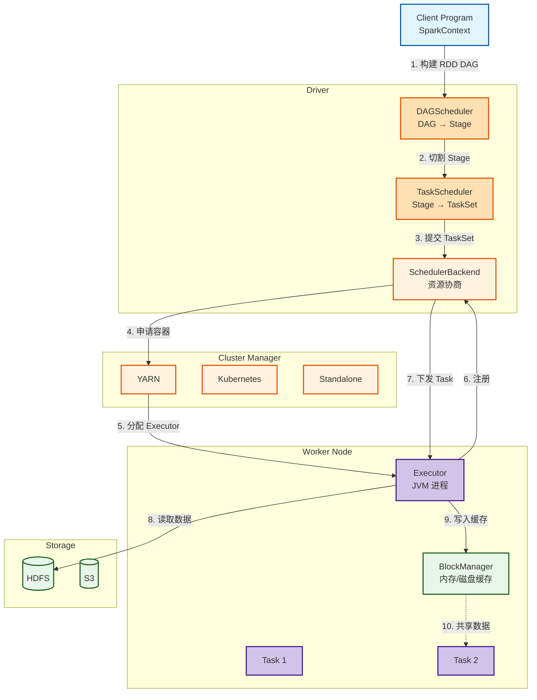
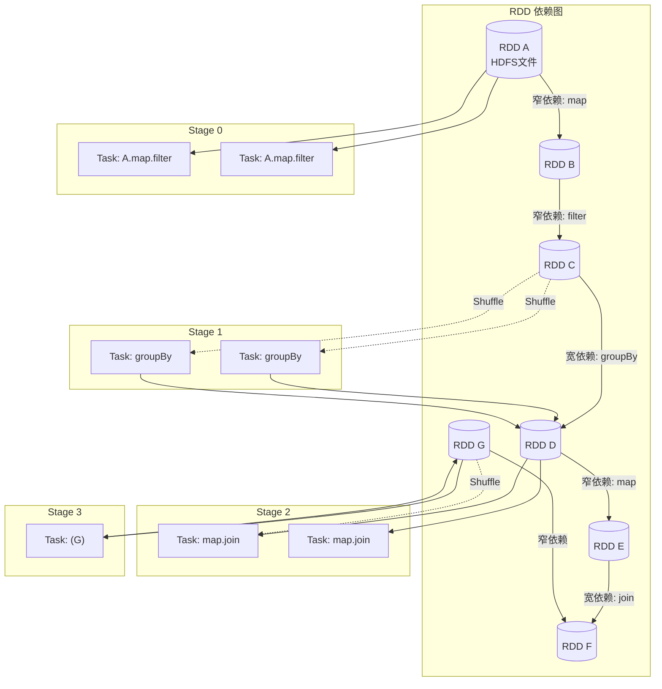
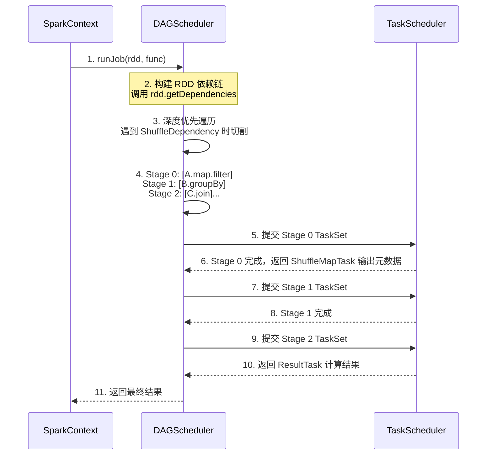
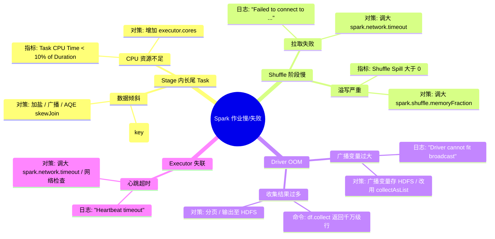

> [!info] 摘要  
> Spark 并非“MapReduce 内存版”，而是一套**以有向无环图（DAG）为执行单元、以弹性分布式数据集（RDD）为容错合约**的通用计算框架。它将 MapReduce 的**二阶段固定流程**泛化为**任意算子拓扑 + 流水线执行**，通过** lineage 而非数据复制**实现容错。本文从“如何在不引入昂贵检查点的前提下实现节点失败恢复”这一根本设计问题切入，深度解析 Spark 的**依赖类型划分（窄/宽）、阶段边界确定、任务调度亲和性**三大核心机制。通过源码级拆解 DAGScheduler 的 stage 切割算法、TaskScheduler 的延迟调度策略、Executor 的线程池复用模型，还原一次 WordCount 作业从 RDD 构建到物理执行的完整生命周期。结合生产案例，提供数据倾斜可视化、推测执行参数泥潭、大 shuffle 失败恢复等典型问题排查方案。最后，在 2026 年 Spark 已实现**流批一体 SQL 化**的背景下，讨论其 RDD 抽象从“主力 API”到“内核 DSL”的角色转型。

---

## 一、核心概念与底层图景

### 1.1 定义

> [!quote] 工程定义  
> **Apache Spark** 是一个**基于 DAG 执行引擎与弹性分布式数据集（RDD）容错模型**的统一计算框架。它将分布式程序表达为**对不可变数据集的确定性变换序列**，通过记录变换 lineage 而非复制数据实现节点失败恢复。

*类比*：Spark 如同**带有黑板（内存缓存）的数学家团队**——每个数学家（执行器）在黑板（内存）上演算局部结果，黑板内容丢失时仅需向出题人（Driver）索取推导公式（Lineage）重算，无需从头抄写整本习题集。

### 1.2 架构全景图



> [!note] 交互方向解读  
> - **控制流**：Driver 持有 SparkContext，负责 DAG 构建→Stage 切割→Task 下发，**单点调度**。  
> - **数据流**：Executor 直接与存储系统交互，Task 间通过 BlockManager 的 shuffle 服务交换数据。  
> - **容错边界**：Executor 崩溃 → Driver 将丢失数据的 Task 重新调度至其他节点；Driver 崩溃 → 作业失败。  
> - **关键解耦**：DAGScheduler 与 TaskScheduler 分离——前者关注**数据依赖**，后者关注**资源映射**。

---

## 二、机制原理深度剖析

### 2.1 核心子模块拆解

| 子模块 | 职责 | 设计意图/为何独立 |
|-------|------|------------------|
| **RDD** | 不可变、分区式的数据集抽象，包含 compute 与 dependencies | **容错单元**：将数据恢复问题转化为函数重放问题 |
| **DAGScheduler** | 接收 RDD DAG，按 Shuffle 依赖切割 Stage，提交 TaskSet | **数据依赖驱动**：将宽依赖视为调度边界，窄依赖内形成流水线 |
| **TaskScheduler** | 管理 Task 生命周期，处理失败重试、延迟调度 | **资源抽象**：屏蔽 YARN/K8s/Mesos 差异 |
| **SchedulerBackend** | 与集群管理器交互，获取资源，维护 Executor 列表 | **反向适配器**：将集群资源变更反压至 TaskScheduler |
| **BlockManager** | 分布式数据存储服务，提供内存/磁盘/堆外缓冲 | **统一数据平面**：Shuffle 数据、RDD 缓存、广播变量均通过 BM |
| **Executor** | 常驻 JVM 进程，线程池执行 Task，返回结果至 Driver | **消除冷启动**：MR 每 Task 启动 JVM → Spark 复用 Executor |

> [!tip]- 深度分析：为什么 RDD 是“失败时重放算子”而非“检查点”？  
> **历史约束**：2009 年，分布式系统容错主流方案是**周期性检查点**（如 MapReduce 写 HDFS）。  
> **根本矛盾**：检查点成本 = 序列化 + 网络复制 + 磁盘落盘，迭代算法（如 PageRank）每轮都做 checkpoint 不可接受。  
> **设计决策**：RDD 记录**数据从何处来（依赖）+ 如何变换（函数）**，失败时重新 apply。  
> **代价**：计算成为幂等函数；**非确定性算子（如随机数）需用户保证幂等**。  
> **结果**：Spark 迭代算法比 MapReduce 快 10~100 倍。

### 2.2 核心流程可视化：**DAG 切分 Stage 算法**





> [!warning] 关键决策点  
> - **切割规则**：从最后一个 RDD 开始反向遍历，遇到**窄依赖**加入当前 Stage，**宽依赖**切分新 Stage。  
> - **Result Stage**：包含结果输出的 Action 算子；**Shuffle Stage**：仅产生中间 Shuffle 数据。  
> - **容错边界**：Stage 内 Task 失败仅重试该 Task；**Stage 失败需重算父 Stage**（Shuffle 数据丢失）。  

---

## 三、内核/源码级实现

### 3.1 核心数据结构（Scala）

> [!code] 包路径：`org.apache.spark.rdd` 与 `org.apache.spark.scheduler`

```scala
/**
 * RDD 抽象基类 - Spark 容错模型的核心。
 * 路径：core/src/main/scala/org/apache/spark/rdd/RDD.scala
 */
abstract class RDD[T: ClassTag](
    @transient private var _sc: SparkContext,
    @transient private var deps: Seq[Dependency[_]]  // 依赖列表
) extends Serializable {
  
  // 分区数组 - 由 getPartitions 实现
  @transient var partitions_ : Array[Partition] = _
  
  // 依赖 - 由 getDependencies 实现
  protected def getDependencies: Seq[Dependency[_]] = deps
  
  /**
   * 核心方法：根据父 RDD 分区计算当前分区数据。
   * 窄依赖：通常为父 RDD 同一分区转换。
   * 宽依赖：拉取所有父分区数据合并。
   */
  def compute(split: Partition, context: TaskContext): Iterator[T]
  
  // 并发保护：RDD 不可变，所有字段初始化后只读
  // 分区和依赖在构造阶段确定，无需锁
}

/**
 * 依赖类型 - 决定 Stage 边界。
 */
abstract class Dependency[T] extends Serializable {
  def rdd: RDD[T]
}

/**
 * 窄依赖 - 父 RDD 每个分区被子 RDD **至多**一个分区使用。
 */
class OneToOneDependency[T](rdd: RDD[T]) extends NarrowDependency[T](rdd)

/**
 * 宽依赖 - 父 RDD 每个分区被子 RDD **至少**一个分区使用。
 * 出现 Shuffle 操作的标志。
 */
class ShuffleDependency[K, V, C](
    @transient private val _rdd: RDD[_ <: Product2[K, V]],
    val partitioner: Partitioner,
    val serializer: Serializer = null
) extends Dependency[Product2[K, V]]
```

```scala
/**
 * DAG 调度器 - Stage 切割与提交逻辑。
 * 路径：core/src/main/scala/org/apache/spark/scheduler/DAGScheduler.scala
 */
class DAGScheduler(
    private[scheduler] val sc: SparkContext,
    private[scheduler] val taskScheduler: TaskScheduler
) {
  
  // 活跃 Stage 缓存
  private[scheduler] val stageIdToStage = new HashMap[Int, Stage]
  
  // 等待父 Stage 完成的 Stage 队列
  private[scheduler] val waitingStages = new HashSet[Stage]
  
  // 已提交但仍有 Task 运行的 Stage
  private[scheduler] val runningStages = new HashSet[Stage]
  
  // 已完成 Stage
  private[scheduler] val completedStages = new HashSet[Stage]
  
  // 并发保护：所有状态变更在事件循环线程中串行执行
  // 线程: DAGSchedulerEventProcessLoop
}
```

> [!bug] 并发模型  
> - **Driver 侧**：`DAGScheduler` 运行在**单线程事件循环**（`DAGSchedulerEventProcessLoop`）。所有 RDD 依赖遍历、Stage 切割、Task 提交均在单线程完成。  
>   **为什么**：避免分布式状态机的一致性锁开销。  
>   **代价**：Driver 成为全局瓶颈（大规模集群 > 5000 cores 需调优）。  
> - **Executor 侧**：每个 Executor 持有**线程池**（`Executor.taskThreadPool`），**每个 Task 独占一个线程**，阻塞式执行。  
>   **资源隔离**：通过 `executor.cores` 限制并发 Task 数。  

### 3.2 核心流程伪代码：**DAGScheduler Stage 切割算法**

```scala
// DAGScheduler 核心方法: 递归构建 Stage
private def getParentStages(
    rdd: RDD[_], 
    firstJobId: Int
): List[Stage] = {
  
  val parents = new HashSet[Stage]
  val visited = new HashSet[RDD[_]]
  
  // DFS 遍历 RDD 依赖图
  def visit(rdd: RDD[_]): Unit = {
    if (!visited(rdd)) {
      visited.add(rdd)
      
      for (dep <- rdd.dependencies) {
        dep match {
          // 窄依赖: 继续向上遍历
          case _: NarrowDependency[_] =>
            visit(dep.rdd)
          
          // 宽依赖: 创建 ShuffleMapStage
          case shufDep: ShuffleDependency[_, _, _] =>
            val stage = newOrUsedShuffleStage(shufDep, firstJobId)
            parents.add(stage)
        }
      }
    }
  }
  
  visit(rdd)
  parents.toList
}
```

```scala
/**
 * Task 在 Executor 端的执行入口。
 * 路径：core/src/main/scala/org/apache/spark/executor/Executor.scala
 */
def launchTask(context: ExecutorBackend, taskDescription: TaskDescription): Unit = {
  val tr = new TaskRunner(context, taskDescription)
  runningTasks.put(taskDescription.taskId, tr)
  
  // 线程池执行 Task
  threadPool.execute(tr)
}

class TaskRunner(
    execBackend: ExecutorBackend,
    taskDescription: TaskDescription
) extends Runnable {
  
  override def run(): Unit = {
    // 1. 反序列化任务 (Task 二进制)
    val task = ser.deserialize[Task[Any]](
      taskDescription.serializedTask, Thread.currentThread.getContextClassLoader)
    
    // 2. 执行任务
    val value = task.run(
      taskAttemptId = taskDescription.taskId,
      attemptNumber = taskDescription.attemptNumber,
      metricsSystem = env.metricsSystem)
    
    // 3. 序列化结果并返回 Driver
    val result = new TaskResult(value, accumUpdates)
    execBackend.statusUpdate(taskId, TaskState.FINISHED, ser.serialize(result))
  }
}
```

> [!example]- 版本差异（1.x → 2.x → 3.x）  
> - **1.x**：`DAGScheduler` 直接调用 `TaskScheduler`。  
> - **2.x**：引入 **`DAGSchedulerEventProcessLoop`**，事件驱动模型解耦。  
> - **3.x**：**Stage 合并优化**（SPARK-30778），相邻的窄依赖 Stage 可合并提交，减少调度开销。  

---

## 四、生产落地与 SRE 实战

### 4.1 场景化案例：**数据倾斜导致少数 Task 运行 2 小时，其余 1 分钟完成**

> [!danger] 现象  
> - Spark SQL 执行 `GROUP BY user_id`，200 个 Reducer，199 个在 30 秒内完成。  
> - 单个 Reducer 运行时间 > 2 小时，最终失败。  
> - 监控显示该 Reducer **Shuffle Read 数据量 200GB**，其余 Reducer < 1GB。

> [!check] 排查链路  
> 1. **SQL 执行计划** → `df.explain(true)` 显示 `HashPartitioning` 使用 `user_id.hashCode % 200`。  
> 2. **数据采样** → `df.groupBy("user_id").count().orderBy(desc("count")).show(10)`。  
> 3. **根因**：某个测试用户（`user_id = 0`）占总数据量 60%。

> [!success] 解决方案  
> ```scala
> // 方案A：加盐（随机前缀）——适用于倾斜 Key 值较少
> val saltedDf = df.withColumn(
>   "salted_id",
>   when(col("user_id") === 0, 
>        concat(col("user_id"), lit("_"), (rand * 10).cast("int")))
>     .otherwise(col("user_id").cast("string"))
> )
> 
> // 方案B：广播小表（若表足够小）
> val broadcasted = spark.sparkContext.broadcast(smallTable.collect())
> 
> // 方案C：调整分区数，强制增加 Reducer 并行度
> df.repartition(1000, col("user_id"))
> ```

> [!done] 验证  
> 最长 Task 耗时降至 8 分钟，作业整体从 2 小时降至 12 分钟。

### 4.2 参数调优矩阵

| 参数名 | 作用域 | 推荐值（Spark 3.5） | 内核解释 |
|--------|--------|----------------|---------|
| `spark.sql.shuffle.partitions` | 会话 | `200`（默认） | Shuffle 分区数。调高减轻倾斜但增加调度开销 |
| `spark.speculation` | 应用 | `true`（生产） | 推测执行。慢 Task 启动副本，**必须配合 blacklist 机制** |
| `spark.speculation.multiplier` | 应用 | `1.5` | 比中位数慢 1.5 倍即推测 |
| `spark.shuffle.file.buffer` | 应用 | `32k`→`1m` | Shuffle 写缓冲区，调高减少溢写次数 |
| `spark.reducer.maxSizeInFlight` | 应用 | `48m`→`96m` | Reduce 同时拉取的数据量，调高增加网络吞吐 |
| `spark.shuffle.compress` | 应用 | `true` | 压缩 Shuffle 输出，**codec=snappy/lz4** |

### 4.3 监控与诊断

> [!info] 关键指标（Spark UI / EventLog）

| 指标名                          | 健康区间   | 瓶颈阈值    | 含义                        |
| ---------------------------- | ------ | ------- | ------------------------- |
| `Shuffle Read Size / Record` | < 1KB  | > 10KB  | 单条数据过大，可能含长字符串            |
| `GC Time`                    | < 5%   | > 20%   | Executor GC 开销大，检查内存配置    |
| `Task Deserialization Time`  | < 10ms | > 100ms | 任务反序列化慢，检查 broadcast 变量大小 |
| `Shuffle Spill (Memory)`     | 0      | > 0     | 内存不足溢写磁盘，性能骤降             |

> [!example] 诊断命令  
> ```bash
> # 获取 Spark UI 正在运行任务的详细信息
> curl http://driver-host:4040/api/v1/applications/[app-id]/jobs
> 
> # 分析 Event Log 定位长尾 Task
> grep "Stage 10" application_*.inprogress | grep "Task 100"
> 
> # 实时跟踪 Executor GC
> jstat -gcutil `pidof CoarseGrainedExecutorBackend` 1000
> ```

### 4.4 故障排查决策树



---

## 五、技术演进与未来视角（2026+）

### 5.1 历史设计约束与改进

| 版本 | 变化 | 动因/解决的问题 |
|------|------|----------------|
| 0.6 (2011) | **RDD API** | 初始发布，仅 Scala |
| 1.0 (2014) | **DataFrame API** | 提高易用性，Catalyst 优化器 |
| 1.6 (2016) | **Dataset API** | 静态类型 + 编码器，减少序列化开销 |
| 2.0 (2016) | **Tungsten 第 2 阶段** | 堆外内存管理 + 全阶段代码生成 |
| 3.0 (2020) | **AQE（自适应查询执行）** | 运行时合并 Shuffle 分区、动态切换 Join 策略 |
| 3.4 (2023) | **Spark Connect** | 解耦 Driver 与客户端，云原生基础 |

### 5.2 2026 年仍存在的“遗留设计”

> [!bug] 痛点1：Driver 单点瓶颈  
> 即使 AQE 动态优化，**DAG 切割、Task 调度、UI 聚合**仍在 Driver 进程。  
> 5000 core 集群下，Driver 成为**调度吞吐瓶颈**（5万+ Task/秒）。  
> **为何不改**：分布式调度器（如 K8s scheduler-plugins）需重写 Spark 核心架构。

> [!bug] 痛点2：Shuffle 拉取的拉模型  
> Reduce Task **主动向所有 Map Task 发起 HTTP 请求**，高并发时引发 NodeManager `too many open files`。  
> **为何不改**：推模型（Map 主动推送）需反向背压机制，复杂度高。  
> **社区方案**：**Spark Push-based Shuffle**（SPARK-34386）已在 3.3+ 实验性支持，但需部署 ESS 服务。

> [!bug] 痛点3：内存抽象遗留  
> `spark.memory.fraction = 0.6` 遗留自 1.x，将 JVM 堆划分为**执行内存 + 存储内存 + 保留区**。  
> **现代硬件**：堆外内存管理早已成熟，但**大量用户代码仍依赖堆内存储**。  
> **演进**：**Project Zen**（长期）逐步淘汰堆内执行内存。

### 5.3 未来趋势

- **Spark Connect**：  
  Driver 作为**长期服务**运行，客户端仅提交 DataFrame 操作。**已解决 Driver 单点部署问题**。
- **Serverless Spark**：  
  执行引擎 + 弹性伸缩 + 秒级启动。RDD 抽象在用户侧**逐步隐退**，仅 SQL/DataFrame 可见。
- **RDD 的未来**：  
  2026 年新项目几乎不再直接使用 RDD API。但 **RDD 作为内核 DSL** 将持续存在——它是 Spark 能够**兼容任意非 SQL 计算**的根本保障。

> [!quote] 二十年后的 Spark  
> 它的 RDD API 会被遗忘，但 **Lineage 容错 + DAG 执行** 会像 MapReduce 的“分治”思想一样，沉淀为分布式计算的基本单元。每个分布式引擎仍会问自己：**如果我丢失了 1TB 已计算数据，我是应该复制它，还是记住它怎么来的？**

---

## 参考文献
- 源码路径：`core/src/main/scala/org/apache/spark/scheduler/`（调度核心）
- 源码路径：`core/src/main/scala/org/apache/spark/rdd/`（RDD 抽象）
- 官方文档：[Spark Architecture](https://spark.apache.org/docs/latest/cluster-overview.html)
- 相关 JIRA：SPARK-30778（Stage 合并），SPARK-34386（Push-based Shuffle）
- Zaharia, M., et al. (2010). "Spark: Cluster Computing with Working Sets." HotCloud.