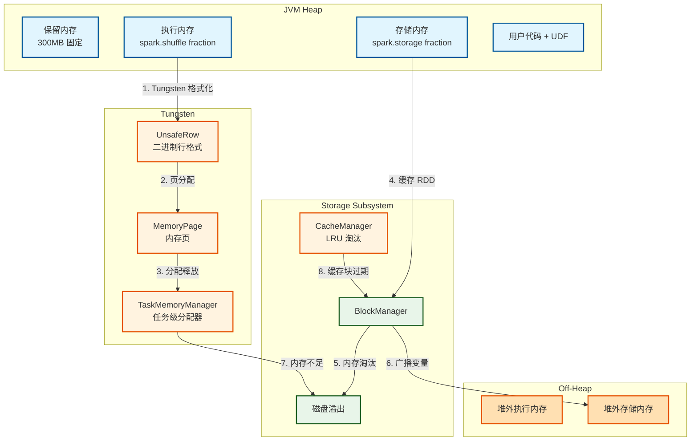
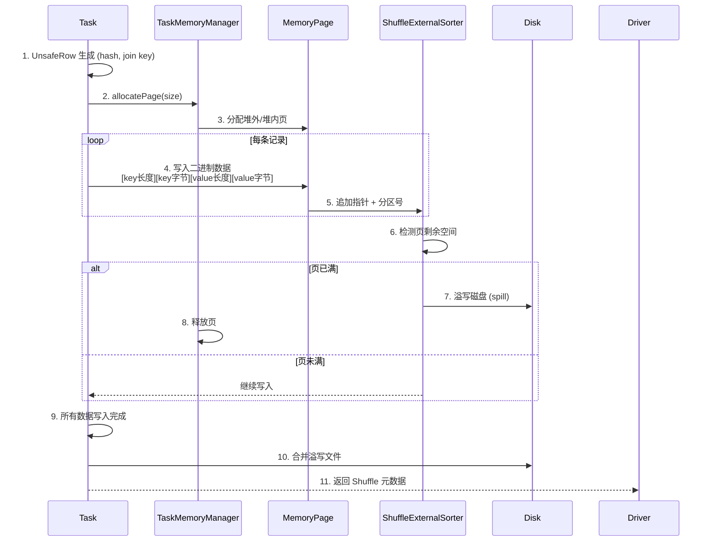

> [!info] 摘要  
> Spark 内存管理并非简单的“堆内缓存池”，而是一套**为绕过 JVM GC 瓶颈与消除对象序列化开销而生的二进制数据处理体系**。Tungsten 项目的核心贡献不在于“用堆外内存”，而在于**将 Java 对象直接转化为二进制记录，并在该二进制格式上执行算子**。本文从“Spark 1.x 频繁 Full GC 导致 100 秒暂停”这一生产痛点切入，深度解析 Spark 内存模型的**三大区域划分（执行/存储/保留）**、Tungsten 的**堆外列式缓存**与**全阶段代码生成**机制。通过源码级拆解 `UnsafeRow` 的二进制布局、`TaskMemoryManager` 的页式分配、`CacheManager` 的 LRU 淘汰策略，还原一次 Join 操作中数据在内存与磁盘间的完整换入换出路径。结合生产案例，提供统一内存模型参数调优、堆外内存泄漏排查、Tungsten 回退问题诊断等实战方案。最后，在 2026 年 Project Valhalla 为 Java 引入值对象（Value Object）的背景下，讨论 Spark 内存管理向**零拷贝堆内紧凑布局**演进的可能路径。

---

## 一、核心概念与底层图景

### 1.1 定义

> [!quote] 工程定义  
> **Spark 内存管理**是一套**以区域划分和动态抢占为特征的混合内存分配系统**。它将 JVM 堆划分为**执行内存（用于 Shuffle/Join 算子）**、**存储内存（用于 RDD 缓存）** 与**保留内存（系统预留）**，并支持堆外二进制内存扩展。**Tungsten** 是内存管理的物理实现层，其核心是**将 JVM 对象转换为二进制记录 + 直接在该二进制格式上执行算子**。

*类比*：传统 Spark 内存管理如同**杂乱的图书馆**——每本书（对象）形态各异，找书需翻目录（反序列化）；Tungsten 则是**标准化仓库**——所有货物统一装入相同规格货箱（二进制行），铲车（向量化算子）可直接叉走整排货架。

### 1.2 架构全景图



> [!note] 交互方向解读  
> - **执行内存**：Shuffle、Join、Aggregate 等算子中间计算结果存放区。**可主动溢出磁盘**。  
> - **存储内存**：RDD 缓存、广播变量、展开结果集。**不可溢出**，内存满则淘汰缓存块。  
> - **动态抢占**：执行内存可强制借用存储内存（可配置是否归还）。**这是 Spark 1.6+ 统一内存模型的核心特征**。  
> - **Tungsten 边界**：`UnsafeRow` 仅用于 DataFrame/SQL 执行路径；RDD API 仍使用 Java 对象。

---

## 二、机制原理深度剖析

### 2.1 核心子模块拆解

| 子模块 | 职责 | 设计意图/为何独立 |
|-------|------|------------------|
| **MemoryPool** | 抽象内存区域，提供借还接口 | **统一记账**：Execution/Storage 继承同一基类，支持动态借用 |
| **TaskMemoryManager** | 任务级内存分配，页式管理 | **隔离性**：不同 Task 内存上限互不影响，避免 OOM 跨任务传染 |
| **MemoryPage** | Tungsten 二进制数据存储单元（≈ 2^31 字节） | **大页分配**：减少指针数量，支持 32 位偏移量 |
| **UnsafeRow** | 二进制行格式，字段偏移固定 | **零反序列化**：可直接计算 hash/compare，无需构建 Java 对象 |
| **CacheManager** | RDD 缓存 LRU 管理器 | **存储内存策略核心**：同步 BlockManager 更新缓存元数据 |
| **UnifiedMemoryManager** | 1.6+ 默认管理器，执行内存可占用存储 | **资源复用**：避免 Shuffle 巨量数据时存储内存空转 |

> [!tip]- 深度分析：为什么 Spark 1.x GC 成为瓶颈？  
> **根本原因**：Java 对象开销巨大。  
> - 64 位 JVM 上，`Integer` = 16 字节（数据）+ 8 字节（对象头）。  
> - 缓存 1 亿条整数 → 2.4GB 堆内存，仅数据值占 400MB。  
> **更严重**：Shuffle 写入时，每条记录需**序列化 → 堆外缓冲区 → 网络 → 反序列化**。  
> **Tungsten 解法**：  
> 1. 数据以二进制格式连续排列 → **内存占用降低 30~50%**。  
> 2. 算子直接在二进制数据上执行 → **无序列化/反序列化**。  
> **代价**：Unsafe API 绕开 JVM 检查，Native 内存泄漏风险极高。

### 2.2 核心流程可视化：**Shuffle Write 过程中 Tungsten 二进制格式化**



> [!warning] 关键决策点  
> - **页大小**：默认 128MB（`spark.memory.offHeap.size` 或堆内自动调整）。  
> - **溢写触发**：当 Task 内存使用量超过 **执行内存池上限** 的 90%。  
> - **UnsafeRow 设计取舍**：  
>   - 固定长度字段（int/long）直接内联存储。  
>   - 变长字段（String）存储**指针（页内偏移）+ 长度**。  
>   - **优点**：hash/compare 直接基于二进制值，无需构建 String 对象。  
>   - **缺点**：修改字段需整体复制，不支持单字段更新。

---

## 三、内核/源码级实现

### 3.1 核心数据结构（Scala + Java）

> [!code] 包路径：`org.apache.spark.memory` 与 `org.apache.spark.sql.catalyst.expressions`

```java
/**
 * Tungsten 二进制行格式。
 * 路径：sql/catalyst/src/main/java/org/apache/spark/sql/catalyst/expressions/UnsafeRow.java
 */
public final class UnsafeRow extends MutableRow {
    // 堆内：byte[] 引用；堆外：long 地址偏移
    private Object baseObject;
    private long baseOffset;
    
    // 行宽度（字节数）
    private int sizeInBytes;
    
    // 字段数
    private int numFields;
    
    /**
     * 获取第 ordinal 个整数字段。
     * 直接从内存偏移读取，无对象装箱。
     */
    public int getInt(int ordinal) {
        assertIndexIsValid(ordinal);
        // 每个字段占 4 字节
        long offset = getFieldOffset(ordinal);
        return Platform.getInt(baseObject, baseOffset + offset);
    }
    
    /**
     * 计算哈希码：Murmur3 直接在二进制数据上执行。
     * 不会产生任何 GC 对象。
     */
    public int hashCode() {
        return Murmur3_x86_32.hashUnsafeBytes(baseObject, baseOffset, sizeInBytes, 42);
    }
}

/**
 * 任务级内存管理器。
 * 路径：core/src/main/java/org/apache/spark/memory/TaskMemoryManager.java
 */
public class TaskMemoryManager {
    // 页表：页号 → MemoryPage
    private final MemoryBlock[] pageTable = new MemoryBlock[8192];
    
    // 已分配内存字节数
    private final AtomicLong allocatedMemory = new AtomicLong(0);
    
    /**
     * 分配内存页。
     * 使用 long 作为页句柄，编码 [页号(13bit) + 偏移(51bit)]
     */
    public MemoryBlock allocatePage(long size) {
        // 1. 检查 Task 内存上限
        long acquired = acquireExecutionMemory(size, MemoryMode.ON_HEAP);
        
        // 2. 分配内存块
        MemoryBlock page = memoryManager.tungstenMemoryAllocator().allocate(acquired);
        
        // 3. 分配页号
        int pageNumber = allocatePageNumber();
        page.pageNumber = pageNumber;
        pageTable[pageNumber] = page;
        
        return page;
    }
    
    /**
     * 页内偏移编码为 64 位 long。
     * 高位 13 位 = 页号，低位 51 位 = 页内偏移。
     */
    public long encodePageNumberAndOffset(MemoryBlock page, long offsetInPage) {
        int pageNumber = page.pageNumber;
        return (((long) pageNumber) << OFFSET_BITS) | (offsetInPage & PAGE_MASK);
    }
}
```

```scala
/**
 * 统一内存管理器（Spark 1.6+ 默认）。
 * 路径：core/src/main/scala/org/apache/spark/memory/UnifiedMemoryManager.scala
 */
class UnifiedMemoryManager private(
    conf: SparkConf,
    val maxHeapMemory: Long,          // 总可用内存 (spark.memory.fraction)
    val onHeapStorageRegionSize: Long // 初始存储内存
  ) extends MemoryManager(conf) {
  
  // 执行内存池 - 可借用存储内存
  private val executionPool = new ExecutionMemoryPool(this, "execution")
  // 存储内存池
  private val storagePool = new StorageMemoryPool(this, "storage")
  
  /**
   * 执行内存申请：当 executionPool 不足时，可尝试从 storagePool 抢占。
   */
  override def acquireExecutionMemory(
      numBytes: Long,
      taskAttemptId: Long,
      memoryMode: MemoryMode): Long = synchronized {
    
    // 1. 先从自家池子拿
    var acquired = executionPool.acquireMemory(numBytes, taskAttemptId)
    
    // 2. 不够？尝试从 storage 池抢占
    if (acquired < numBytes) {
      val remaining = numBytes - acquired
      val borrowed = storagePool.freeSpaceToShrink(remaining)
      acquired += executionPool.acquireMemory(borrowed, taskAttemptId)
    }
    
    acquired
  }
}
```

> [!bug] 并发模型  
> - **MemoryManager**：`synchronized` 粗粒度锁，**内存分配高峰期成为全局瓶颈**。  
> - **TaskMemoryManager**：每个 Task 独享实例，**无锁化页分配**（`pageNumber` 通过 `AtomicInteger` 分配）。  
> - **UnsafeRow**：**无锁**，只读访问；写入时由单个线程独占。  
> - **3.x+ 改进**：引入 **`MemoryAllocator`** 接口，堆外分配通过 `PooledByteBuffer` 减少锁竞争。

### 3.2 核心流程伪代码：**存储内存淘汰策略（LRU）**

```scala
// 路径：core/src/main/scala/org/apache/spark/storage/memory/PartiallyUnrolledIterator.scala
// 简化自 CacheManager 的淘汰逻辑

def evictBlocksToFreeSpace(
    numBytes: Long,
    memoryMode: MemoryMode): Long = {
  
  var freedMemory = 0L
  val iterator = entries.values.iterator   // 所有缓存块
  
  // LRU 近似算法：按访问时间升序
  val sorted = iterator.toSeq.sortBy(_.lastAccessTime)
  
  while (freedMemory < numBytes && sorted.nonEmpty) {
    val block = sorted.remove(0)  // 淘汰最旧
    
    if (block.memoryMode == memoryMode) {
      val size = block.size
      if (dropBlock(block.blockId)) {  // 通知 BlockManager 移除
        freedMemory += size
      }
    }
  }
  
  freedMemory
}
```

> [!example]- 版本差异（1.x → 2.x → 3.x）  
> - **1.x**：`StaticMemoryManager`，执行内存与存储内存**硬隔离**，一方不足另一方无法借用。  
> - **1.6+**：`UnifiedMemoryManager`，执行可抢占存储，但**存储不可抢占执行**。  
> - **3.x**：`spark.memory.offHeap.enabled` + `spark.memory.offHeap.size`，正式支持堆外统一管理。  

---

## 四、生产落地与 SRE 实战

### 4.1 场景化案例：**堆外内存泄漏导致 NodeManager 被 YARN 强制 kill**

> [!danger] 现象  
> - Spark 作业运行数小时后，Executor 日志无 OOM，但 NodeManager 日志显示 `Container killed by YARN for exceeding memory limits`。  
> - `spark.executor.memory=10g`，`spark.memory.offHeap.size=5g`。  
> - YARN 监控显示容器物理内存占用持续上涨，最终突破 16GB 上限。

> [!check] 排查链路  
> 1. **怀疑堆外泄漏** → 开启 JVM Native Memory Tracking：  
>    `-XX:NativeMemoryTracking=summary -XX:+UnlockDiagnosticVMOptions -XX:+PrintNMTStatistics`。  
> 2. **观察堆外增长** → `jcmd <pid> VM.native_memory summary` 显示 `Internal` 区域持续增长。  
> 3. **定位泄漏源** → 堆栈采样发现 `Platform.freeMemory` 调用不匹配，大量 `Unsafe` 分配的 `MemoryBlock` 未释放。  
> 4. **根因**：自定义 UDF 中手动调用 `UnsafeRow.setLong` 但未正确管理内存生命周期，GC 无法回收堆外内存。

> [!success] 解决方案  
> ```scala
> // 方案A：禁用堆外内存（紧急止血）
> --conf spark.memory.offHeap.enabled=false
> 
> // 方案B：显式释放（代码修复）
> val row = new UnsafeRow(2)
> // ... 使用 row ...
> row.baseObject match {
>   case arr: Array[Byte] => // 堆内，GC 自动回收
>   case _ => row.asInstanceOf[AutoCloseable].close()  // 堆外需手动释放
> }
> ```

> [!done] 验证  
> 物理内存稳定在 12GB 水位，不再超标。

### 4.2 参数调优矩阵

| 参数名 | 作用域 | 推荐值（Spark 3.5） | 内核解释 |
|--------|--------|----------------|---------|
| `spark.memory.fraction` | 应用 | `0.6` → `0.75`（大缓存） | (执行+存储)/JVM 堆。调高需预留用户代码内存 |
| `spark.memory.storageFraction` | 应用 | `0.5` | 初始存储内存比例。调高缓存稳定，调低 Shuffle 性能佳 |
| `spark.memory.offHeap.enabled` | 应用 | `true`（3.x+） | 启用堆外内存管理 |
| `spark.memory.offHeap.size` | 应用 | `4g`（根据物理内存） | 堆外内存总量，不计入 JVM 堆 |
| `spark.shuffle.spill.compress` | 应用 | `true` | 溢写磁盘压缩，**codec=lz4** |
| `spark.sql.inMemoryColumnarStorage.compressed` | 会话 | `true` | 列式缓存启用压缩 |

### 4.3 监控与诊断

> [!info] 关键指标（Spark UI / JVM NativeMemoryTracking）

| 指标名 | 健康区间 | 瓶颈阈值 | 含义 |
|--------|----------|----------|------|
| `JVM Heap Used` | < 0.8*fraction | > 0.9 | 堆即将打满，触发 Full GC |
| `Off-Heap Memory` | 平稳 | 持续增长 | 疑似堆外泄漏 |
| `Storage Memory Used` | < 0.9 | = 1.0 | 缓存满，后续缓存会淘汰 |
| `Shuffle Spill (Memory)` | 0 | > 0 | 执行内存不足，频繁溢写磁盘 |

> [!example] 诊断命令  
> ```bash
> # 查看 Executor 堆外内存分布
> jcmd `pidof CoarseGrainedExecutorBackend` VM.native_memory summary
> 
> # 实时 GC 日志分析
> jstat -gcutil `pidof CoarseGrainedExecutorBackend` 1000 10
> 
> # 获取内存页分配统计
> curl http://driver-host:4040/api/v1/applications/[app-id]/executors
> ```

### 4.4 故障排查决策树

```mermaid
mindmap
  root((Spark 内存相关故障))
    作业 OOM
      Executor 堆 OOM
        指标: Heap Used > 90%
        对策: 调大 spark.executor.memory
      Driver 堆 OOM
        命令: df.collect() 过大
        对策: 改用 df.write.save / foreach
    频繁 Full GC
      堆内存过小
        对策: 调大 executor.memory / memory.fraction
      对象序列化频繁
        指标: GC time > 20%
        对策: 启用 Tungsten / 改用 Dataset API
    堆外内存泄漏
      NativeMemoryTracking 显示 Internal 增长
        对策: 检查 UDF 中 UnsafeRow.close()
      Container 被 YARN kill
        日志: "Container killed for memory limit"
        对策: 调小 offHeap.size / 禁用堆外
    溢写严重
      Shuffle Spill > 0
        对策: 调大 spark.shuffle.memoryFraction
```

---

## 五、技术演进与未来视角（2026+）

### 5.1 历史设计约束与改进

| 版本 | 变化 | 动因/解决的问题 |
|------|------|----------------|
| 1.0 (2014) | `StaticMemoryManager` | 固定分区，简单但资源浪费 |
| 1.6 (2016) | `UnifiedMemoryManager` | 执行/存储动态借用，消除隔离墙 |
| 2.0 (2016) | **Tungsten Phase 2** | 堆外内存 + 全阶段代码生成 |
| 3.0 (2020) | **堆外内存正式支持** | `spark.memory.offHeap.enabled` 不再实验性 |
| 3.2 (2022) | **Project Zen 启动** | 逐步淘汰堆内执行内存 |

### 5.2 2026 年仍存在的“遗留设计”

> [!bug] 痛点1：内存比例仍依赖用户调优  
> `spark.memory.fraction=0.6` 是 1.x 时代 JVM 预留 40% 给用户代码的经验值。  
> **现代 JVM**：GC 更高效，UDF 内存使用更规范。0.6 已过于保守。  
> **为何不改**：向下兼容恐惧症。改默认值 = 大量既有作业 OOM。

> [!bug] 痛点2：堆外内存统计不精确  
> `Platform.freeMemory` 需显式调用，`UnsafeRow` 在 Dataset API 内部无法保证用户显式关闭。  
> **现状**：堆外内存泄漏仍是最难排查的 Spark 生产问题。  
> **社区方案**：`spark.memory.offHeap.debug` 实验性参数，开启强引用跟踪（性能损失 20%）。

> [!bug] 痛点3：Tungsten 未覆盖所有算子  
> `flatMap`、`mapPartitions` 等 RDD API 仍使用 Java 对象。  
> **为何不改**：RDD 的泛型签名决定了它无法携带二进制格式信息。

### 5.3 未来趋势

- **Project Valhalla（Java 21+）**：  
  值对象（Value Object）可消除 Java 对象头开销。**未来 Spark 可能将 `UnsafeRow` 替换为内建值类型**，兼顾 GC 友好与代码可读性。
- **Project Amber（向量化 API）**：  
  SIMD 加速列式计算，Tungsten 最终进化为**全引擎向量化**。
- **内存管理终点**：  
  **用户不再感知内存区域划分**。动态自适应调度器根据数据量与硬件资源自动决策溢写阈值、堆外比例。

> [!quote] 二十年后的 Spark 内存管理  
> 它将作为**大规模分布式系统摆脱 GC 依赖的经典案例**被记住。Tungsten 证明了：**绕过 JVM 不是异端，而是刚需**。当值类型普及后，`UnsafeRow` 会消失，但其思想——**数据应以其被处理的形式存储**——将成为分布式计算引擎的设计公理。

---

## 参考文献
- 源码路径：`core/src/main/scala/org/apache/spark/memory/`
- 源码路径：`sql/catalyst/src/main/java/org/apache/spark/sql/catalyst/expressions/UnsafeRow.java`
- 官方文档：[Tungsten Wiki](https://issues.apache.org/jira/browse/SPARK-7075)
- 相关 JIRA：SPARK-10000（Tungsten Phase 1），SPARK-30778（Stage 合并）
- Zaharia, M., et al. (2010). "Spark: Cluster Computing with Working Sets." HotCloud.