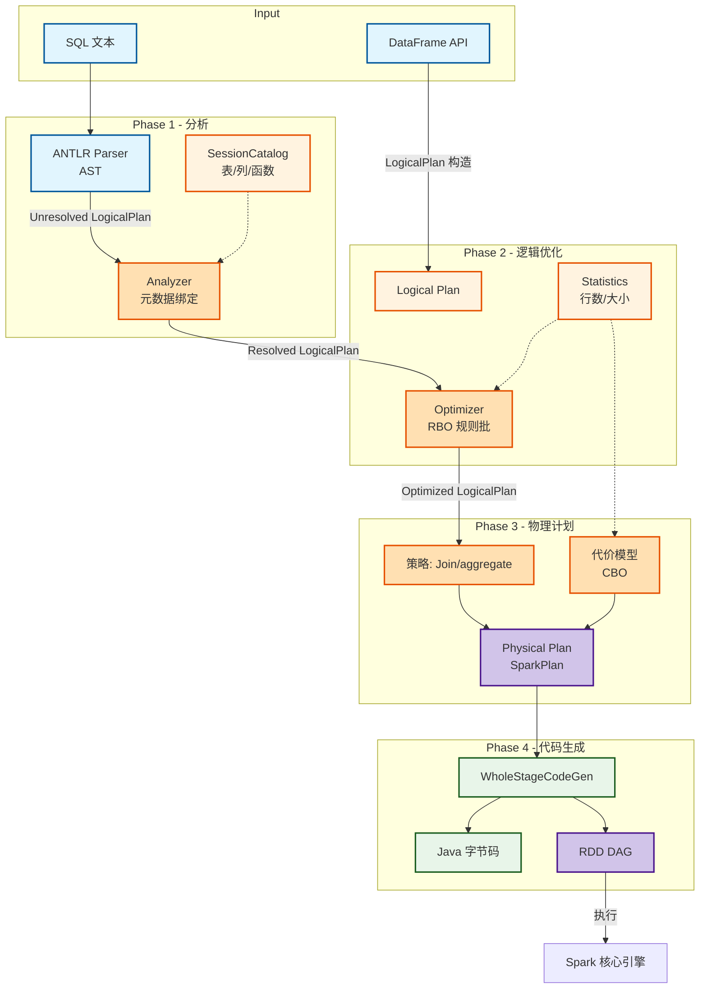
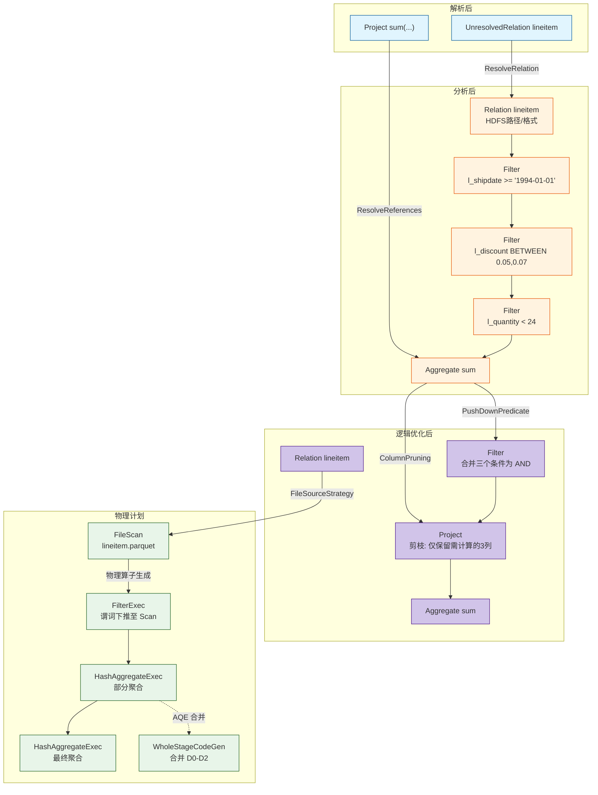

> [!info] 摘要  
> Catalyst 并非“Spark 的 SQL 优化器”，而是一套**将高级语言（SQL/DataFrame）不断降级为物理执行计划的规则应用框架**。它的革命性不在于优化规则本身，而在于**将优化器编写范式从“硬编码逻辑”转变为“规则集合 + 模式匹配”**。本文从“如何让 Spark 同时支持 SQL 与 DataFrame 且共享同一优化流程”这一架构挑战切入，深度解析 Catalyst 的**四阶段管线**（分析→逻辑优化→物理计划→代码生成）以及**树结构变换规则**的核心抽象。通过源码级拆解 `TreeNode` 的 `transform` 方法、`Analyzer` 的元数据解析、`JoinReorder` 的代价估算、`Tungsten` 全阶段代码生成，还原一次 TPCH Q6 查询从 SQL 文本到 Java 字节码的完整编译路径。结合生产案例，提供谓词下推失效、统计信息缺失导致 Join 策略误判、AQE 动态分区合并等典型问题排查方案。最后，在 2026 年 Substrait 中间表示逐渐普及的背景下，讨论 Catalyst 从“前端编译器”向“多引擎统一 IR 生成器”转型的可能。

---

## 一、核心概念与底层图景

### 1.1 定义

> [!quote] 工程定义  
> **Catalyst** 是一个**基于树变换规则（Rule）与代价模型（Cost Model）的查询优化框架**。它将 SQL 抽象语法树/DataFrame 逻辑计划作为不可变树结构输入，通过多轮规则匹配与替换，最终输出物理执行计划。**其核心抽象是 `TreeNode` 与 `Rule`——任何优化都是一棵树到另一棵树的映射**。

*类比*：Catalyst 如同**语法编译器**——SQL 是高级语言，Catalyst 将其编译为 Spark 虚拟机的“字节码”（RDD DAG）。不同在于，传统编译器优化阶段是硬编码的，Catalyst 允许开发者**像写模式匹配一样添加优化规则**。

### 1.2 架构全景图



> [!note] 交互方向解读  
> - **不可变树**：每个阶段输出新的树，绝不修改输入树。**这是 Catalyst 能够安全并发应用数百条规则的前提**。  
> - **规则批**：规则组织为批次（Batch），批次内规则顺序固定。**一次分析阶段应用约 50+ 条规则**。  
> - **惰性评估**：逻辑优化阶段仅变换结构，不接触数据。统计信息仅在 CBO 时主动查询 HMS。  
> - **全阶段代码生成**：将多个物理算子合并为一个 Java 函数，消除虚函数调用。

---

## 二、机制原理深度剖析

### 2.1 核心子模块拆解

| 子模块 | 职责 | 设计意图/为何独立 |
|-------|------|------------------|
| **TreeNode** | 所有逻辑/物理计划节点的基类，提供 `transform` 遍历方法 | **统一变换入口**：将树的递归遍历封装为高阶函数，规则只需写匹配与替换 |
| **Rule** | `Rule[Tree]` 抽象，输入一棵树，输出一棵新树 | **可插拔优化**：新增优化无需修改核心流程，仅添加 Rule 至 Batch |
| **Analyzer** | 将 `UnresolvedRelation` 绑定到 `Catalog` 中的表/列 | **元数据隔离**：SQL 文本与运行时元数据解耦 |
| **LogicalPlan** | 逻辑算子树，无物理执行语义（如 Join、Filter、Project） | **语义载体**：描述“要做什么”，不描述“怎么做” |
| **SparkPlan** | 物理算子树，包含 `doExecute` 方法返回 RDD | **执行实体**：每个算子实现具体的 `next()` 数据生产逻辑 |
| **WholeStageCodeGen** | 将多个 `SparkPlan` 算子链编译为单段 Java 循环代码 | **消除虚调用**：将火山模型的 `next()` 虚函数调用内联为 `while` 循环 |
| **AQE** | 运行时根据 shuffle 统计信息重新优化物理计划 | **动态适应**：解决 RBO 因统计信息缺失导致的误判 |

> [!tip]- 深度分析：为什么 Catalyst 选择“规则引擎”而非“成本模型优先”？  
> **历史约束**：2014 年 Spark 1.0 发布时，统计信息收集机制（ANALYZE TABLE）尚未成熟。  
> **根本矛盾**：若强制依赖统计信息，大部分无统计表将执行次优计划；若完全依赖规则，Join 顺序错误无法修正。  
> **设计决策**：  
> - **RBO**（基于规则）：保守但稳定，应用于所有查询。  
> - **CBO**（基于代价）：需统计信息，仅在 `spark.sql.cbo.enabled=true` 时启用。  
> - **AQE**（自适应）：3.0+ 将统计信息采集推迟至运行时，绕过前期信息缺失问题。  
> **结果**：Catalyst 成为**唯一同时支持三种优化模式**的 SQL 引擎。

### 2.2 核心流程可视化：**TPC-H Q6 查询优化全路径**

```sql
SELECT sum(l_extendedprice * l_discount) AS revenue
FROM lineitem
WHERE l_shipdate >= '1994-01-01'
  AND l_shipdate < '1995-01-01'
  AND l_discount BETWEEN 0.05 AND 0.07
  AND l_quantity < 24;
```



> [!warning] 关键决策点  
> - **谓词下推**：Catalyst 将 `Filter` 尽可能推至 `FileScan`，让 Parquet/ORC 读取时跳过整块数据。  
> - **列剪枝**：最终仅需 `l_extendedprice`、`l_discount`、`l_shipdate`、`l_quantity` 四列，减少 I/O 50% 以上。  
> - **常量折叠**：`'1994-01-01'` 和 `'1995-01-01'` 在优化期即转为时间戳常量。  
> - **投影合并**：多个 `Project` 算子合并为一个。

---

## 三、内核/源码级实现

### 3.1 核心数据结构（Scala）

> [!code] 包路径：`org.apache.spark.sql.catalyst` 与 `org.apache.spark.sql.execution`

```scala
/**
 * 所有逻辑计划/表达式节点的基类。
 * 路径：sql/catalyst/src/main/scala/org/apache/spark/sql/catalyst/trees/TreeNode.scala
 */
abstract class TreeNode[BaseType <: TreeNode[BaseType]] {
  
  // 当前节点的子节点
  def children: Seq[BaseType]
  
  /**
   * 核心变换方法：对整个树应用部分函数。
   * 不可变：返回新树，原树不变。
   */
  def transform(rule: PartialFunction[BaseType, BaseType]): BaseType = {
    // 1. 递归变换子节点
    val afterChildren = mapChildren(_.transform(rule))
    // 2. 应用规则到当前节点
    if (afterChildren.fastEquals(this)) {
      rule.applyOrElse(this, identity[BaseType])
    } else {
      rule.applyOrElse(afterChildren, identity[BaseType])
    }
  }
}

/**
 * 逻辑计划节点：表扫描。
 * 路径：sql/catalyst/src/main/scala/org/apache/spark/sql/catalyst/plans/logical/LogicalPlan.scala
 */
case class HiveTableRelation(
    tableMeta: CatalogTable,
    dataCols: Seq[AttributeReference],
    partitionCols: Seq[AttributeReference]
  ) extends LeafNode {
  
  // 输出字段 = 数据列 + 分区列
  override def output: Seq[Attribute] = dataCols ++ partitionCols
}

/**
 * 规则接口：将一棵树变换为另一棵树。
 */
abstract class Rule[TreeType <: TreeNode[_]] {
  def apply(plan: TreeType): TreeType
}

/**
 * 分析阶段：将 UnresolvedRelation 解析为 Catalog 中的表。
 */
object ResolveRelations extends Rule[LogicalPlan] {
  def apply(plan: LogicalPlan): LogicalPlan = plan.transformDown {
    case u @ UnresolvedRelation(ident) =>
      // 从 SessionCatalog 查询表元数据
      val catalogTable = v1SessionCatalog.lookupRelation(ident)
      catalogTable
  }
}
```

```scala
/**
 * 物理计划节点：Filter 实现。
 * 路径：sql/core/src/main/scala/org/apache/spark/sql/execution/FilterExec.scala
 */
case class FilterExec(
    condition: Expression,
    child: SparkPlan
  ) extends UnaryExecNode {
  
  override def output: Seq[Attribute] = child.output
  
  /**
   * 核心执行方法：生成 RDD。
   * 全阶段代码生成时，此方法可能被内联至 while 循环。
   */
  protected override def doExecute(): RDD[InternalRow] = {
    child.execute().mapPartitions { iter =>
      val predicate = condition.genCode(iter)
      iter.filter(predicate.eval)
    }
  }
}
```

> [!bug] 并发模型  
> - **优化器线程**：`SessionState` 持有 `Analyzer` 与 `Optimizer`，**每个查询独享实例**，无锁竞争。  
> - **Catalog 并发**：`SessionCatalog` 内 `HashMap` 由 `ReadWriteLock` 保护，**表定义变更（DDL）时加写锁，查询元数据时加读锁**。  
> - **物理计划执行**：`doExecute` 在 Executor 端并行执行，**无跨任务状态共享**。

### 3.2 核心流程伪代码：**谓词下推至 Parquet 扫描**

```scala
// 路径：sql/core/src/main/scala/org/apache/spark/sql/execution/datasources/parquet/ParquetFileFormat.scala
// 将 Catalyst Filter 转换为 Parquet Filter API

def pushdownPredicates(
    predicates: Seq[Expression],
    sparkSession: SparkSession): ParquetFilters = {
  
  val parquetFilters = new ParquetFilters()
  
  predicates.flatMap { predicate =>
    predicate match {
      // 匹配: column = literal
      case EqualTo(attr: AttributeReference, lit: Literal) =>
        val field = attr.name
        val value = lit.value
        Some(parquetFilters.eq(field, value))
      
      // 匹配: column > literal
      case GreaterThan(attr: AttributeReference, lit: Literal) =>
        Some(parquetFilters.gt(attr.name, lit.value))
      
      // 匹配: column BETWEEN literal AND literal
      case And(GreaterThanOrEqual(attr, leftLit), LessThanOrEqual(`attr`, rightLit)) =>
        Some(parquetFilters.between(attr.name, leftLit.value, rightLit.value))
      
      // 不支持的表达式 -> 不下推
      case _ => None
    }
  }
}
```

```scala
/**
 * 全阶段代码生成：合并 Filter + Project + Aggregate
 * 路径：sql/core/src/main/scala/org/apache/spark/sql/execution/WholeStageCodegenExec.scala
 */
case class WholeStageCodegenExec(child: SparkPlan) extends UnaryExecNode {
  
  override def doExecute(): RDD[InternalRow] = {
    // 1. 编译子节点链
    val ctx = new CodegenContext()
    val code = child.produce(ctx)
    
    // 2. 生成 Java 源码
    val javaSource = s"""
      public Object generate(Object[] references) {
        return new GeneratedIterator(references);
      }
      
      class GeneratedIterator extends BufferedRowIterator {
        private int rows;
        public void processNext() throws IOException {
          while (input.next()) {
            ${code}  // 内联的列读取/过滤/聚合逻辑
          }
        }
      }
    """
    
    // 3. 动态编译并执行
    val clazz = CodeGenerator.compile(javaSource)
    val iter = clazz.generate(references).asInstanceOf[BufferedRowIterator]
    // ...
  }
}
```

> [!example]- 版本差异（2.x → 3.x）  
> - **2.x**：`WholeStageCodeGen` 仅支持单线程流水线，**多个 stage 不能连续生成**。  
> - **3.x**：**CollapseCodegenStages** 规则可将跨 Shuffle 的 Stage 也纳入代码生成（SPARK-27940）。  
> - **3.4+**：**全阶段代码生成默认覆盖所有算子**，除部分 UDF。

---

## 四、生产落地与 SRE 实战

### 4.1 场景化案例：**谓词下推失效导致全表扫描**

> [!danger] 现象  
> - Spark SQL 查询：`SELECT * FROM orders WHERE dt = '2026-02-11'`。  
> - 表 orders 为分区表，分区列 `dt`，共 1000 个分区。  
> - Spark UI 显示 **Scan 阶段读取 1000 个分区**，耗时 5 分钟，实际期望仅读取 1 个分区。

> [!check] 排查链路  
> 1. **检查执行计划** → `df.explain()` 输出 `Filter` 在 `Scan` 之后，而非 `Scan` 内。  
> 2. **检查表定义** → `DESC EXTENDED orders` 显示 `PARTITIONED BY (dt)` 正常。  
> 3. **根因**：`dt` 列在表中数据类型为 `STRING`，查询传入值 `'2026-02-11'` 类型也为 `STRING`——**看似匹配，但 Spark 将分区过滤与数据过滤视为不同阶段**。  
> 4. **深层问题**：`spark.sql.parquet.pushdown.partition` 默认 `true`，但查询中包含非分区列过滤时，**分区裁剪规则仅在 LogicalPlan 阶段运行一次**；后续优化若改变了 Filter 结构，分区信息可能丢失。

> [!success] 解决方案  
> ```scala
> // 方案A：显式指定分区列（强制裁剪）
> df.filter("dt = '2026-02-11'").explain()
> 
> // 方案B：使用 where 子句而非 filter 函数（效果相同）
> 
> // 方案C：禁用 AQE 分区合并（若与 AQE 冲突）
> spark.conf.set("spark.sql.adaptive.enabled", "false")
> ```

> [!done] 验证  
> 执行计划显示 `FileScan parquet [dt=2026-02-11]`，扫描时间降至 3 秒。

### 4.2 参数调优矩阵

| 参数名 | 作用域 | 推荐值（Spark 3.5） | 内核解释 |
|--------|--------|----------------|---------|
| `spark.sql.cbo.enabled` | 会话 | `true` | 启用基于代价优化（统计信息） |
| `spark.sql.cbo.joinReorder.enabled` | 会话 | `true` | 多表 Join 重排序 |
| `spark.sql.cbo.joinReorder.dp.threshold` | 会话 | `12` | 动态规划表数量上限，超限回退贪心 |
| `spark.sql.adaptive.enabled` | 会话 | `true` | 自适应查询执行（3.0+） |
| `spark.sql.adaptive.coalescePartitions.enabled` | 会话 | `true` | 动态合并 Shuffle 分区 |
| `spark.sql.autoBroadcastJoinThreshold` | 会话 | `10MB` | 自动广播阈值，调大可减少 Shuffle |
| `spark.sql.codegen.wholeStage` | 会话 | `true` | 全阶段代码生成（默认开启） |

### 4.3 监控与诊断

> [!info] 关键指标（Spark UI / SQL 页面）

| 指标名 | 健康区间 | 瓶颈阈值 | 含义 |
|--------|----------|----------|------|
| `Physical Plan 深度` | < 10 | > 20 | 计划过深，可能多次反复扫描 |
| `WholeStageCodeGen 数量` | > 总Stage 80% | < 50% | 代码生成失效，检查非确定性 UDF |
| `Join 策略` | BroadcastHashJoin | SortMergeJoin | SMJ 通常慢于 BHJ，检查广播阈值 |
| `Exchange (Shuffle) 数量` | < 3 | > 10 | Shuffle 过多，通常为 Join 重排序失效 |

> [!example] 诊断命令  
> ```scala
> // 打印完整解析后逻辑计划
> df.queryExecution.logical
> 
> // 打印优化后逻辑计划
> df.queryExecution.optimizedPlan
> 
> // 打印完整物理计划（含代码生成）
> df.queryExecution.debug.codegen
> 
> // 强制打印所有优化规则应用过程
> spark.conf.set("spark.sql.optimizer.logLevel", "TRACE")
> ```

### 4.4 故障排查决策树

```mermaid
mindmap
  root((Spark SQL 查询性能劣))
    执行计划异常
      谓词未下推
        检查: df.explain() 中 Filter 位置
        对策: 分区列类型匹配 / 显式 where
      Join 策略为 SMJ
        指标: 表大小 < autoBroadcastJoinThreshold
        对策: 手动 hint: /*+ BROADCAST(t) */
    Stage 过多
      频繁 Shuffle
        指标: Exchange 节点 > 5
        对策: 启用 AQE coalescePartitions
      AQE 未生效
        检查: spark.sql.adaptive.enabled=true
    CodeGen 失效
      WholeStageCodeGen 节点缺失
        日志: "failed to generate code for ..."
        对策: 移除非确定性 UDF / 升级 Spark
    统计信息缺失
      CBO 未生效
        命令: ANALYZE TABLE table COMPUTE STATISTICS
      JoinReorder 未生效
        检查: spark.sql.cbo.joinReorder.enabled=true
```

---

## 五、技术演进与未来视角（2026+）

### 5.1 历史设计约束与改进

| 版本 | 变化 | 动因/解决的问题 |
|------|------|----------------|
| 1.0 (2014) | **Catalyst 初始版本** | Scala 模式匹配实现规则引擎 |
| 1.6 (2016) | **Cost-Based Optimizer** | 引入统计信息与 Join 重排序 |
| 2.0 (2016) | **WholeStageCodeGen** | 消除火山模型虚函数调用 |
| 3.0 (2020) | **Adaptive Query Execution** | 运行时重新优化物理计划 |
| 3.4 (2023) | **Spark Connect + Proto** | Catalyst 支持将逻辑计划序列化传输 |

### 5.2 2026 年仍存在的“遗留设计”

> [!bug] 痛点1：优化器与执行器紧耦合  
> Catalyst 生成的 `SparkPlan` 直接依赖 `RDD` API。  
> **后果**：无法将优化后的计划直接发给其他引擎执行（如 Flink/Presto）。  
> **为何不改**：Spark 内核设计之初未考虑多引擎互操作。  
> **社区方案**：**Substrait** 中间表示项目可将 Catalyst LogicalPlan 序列化为跨引擎格式，但生产部署极少。

> [!bug] 痛点2：CBO 统计信息陈旧  
> `ANALYZE TABLE` 需用户主动触发，且统计信息**静态存储于 HMS**，数据变更后未更新。  
> **对比**：Iceberg/Paimon 元数据自带统计信息。  
> **现状**：Spark CBO 在云湖仓环境因统计信息缺失常被关闭，仍依赖 RBO + AQE。

> [!bug] 痛点3：代码生成编译开销  
> 每查询数万个 `Filter`/`Project` 短期作业，**代码生成编译时间 > 执行时间**。  
> **对策**：`spark.sql.codegen.hugeMethodLimit` 拆分为小方法，但增加了虚调用。

### 5.3 未来趋势

- **Spark Connect + Substrait**：  
  客户端仅构建 LogicalPlan，序列化后发给服务端执行。**Catalyst 将逐步演变为 Server 端组件**。
- **智能物化视图**：  
  Spark 4.x（预测）将支持基于成本模型的**自动物化视图匹配**，改写查询以命中预计算结果。
- **优化器学习化**：  
  初期实验：通过历史 Query Log 训练 Join 顺序选择模型，替代动态规划。

> [!quote] 十年后的 Catalyst  
> 它将作为**开源大数据系统中最成功的规则驱动优化器**被铭记。它的遗产不是某条具体优化规则，而是 **“将编译器思想带入分布式数据处理”** 的方法论。当新的计算引擎出现，人们仍会问：**它的 IR 是什么？它的规则系统可扩展吗？**

---

## 参考文献
- 源码路径：`sql/catalyst/src/main/scala/org/apache/spark/sql/catalyst/`
- 源码路径：`sql/core/src/main/scala/org/apache/spark/sql/execution/`
- 官方文档：[Catalyst Optimizer](https://spark.apache.org/docs/latest/sql-performance-tuning.html#catalyst-optimizer)
- 相关 JIRA：SPARK-27940（跨 Stage 代码生成），SPARK-30778（Stage 合并）
- Armbrust, M., et al. (2015). "Spark SQL: Relational Data Processing in Spark." SIGMOD.