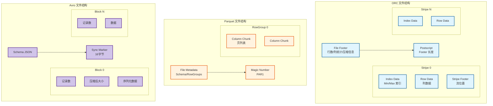
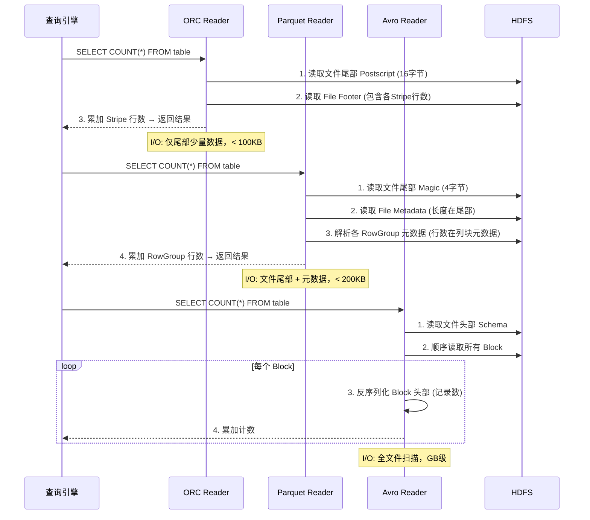
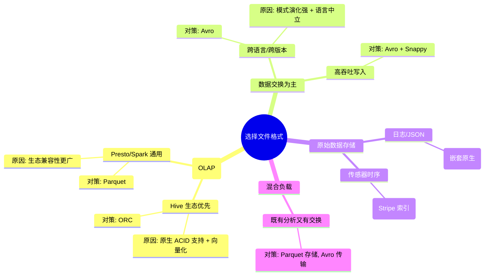
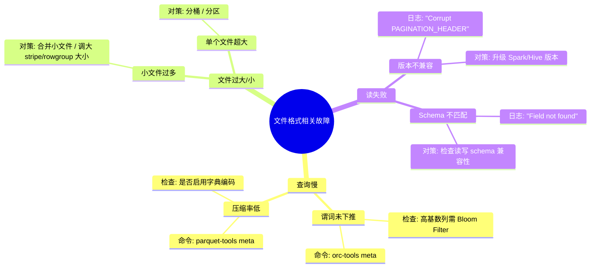

> [!info] 摘要  
> ORC、Parquet、Avro 并非简单的“存储格式选择”，而是**列存与行存、压缩效率与写入速度、模式演化与类型系统之间的根本性权衡**。本文从“如何在不可变文件上实现高效分析”这一核心矛盾切入，深度解析三种格式的**存储布局（Stripe/RowGroup/Block）、编码算法（字典/RLE/增量）、谓词下推实现（Min/Max索引/Bloom Filter）**。通过源码级拆解 ORC 的索引数据、Parquet 的页式存储、Avro 的块编码，还原一次 COUNT(*) 查询在三种格式下的物理 I/O 路径差异。结合生产案例，提供格式选型决策矩阵、压缩算法（ZSTD/Snappy/LZ4）实测对比、小文件合并策略等实战方案。最后，在 2026 年湖仓格式（Iceberg/Paimon）接管表语义层的背景下，讨论文件格式作为**底层存储编码标准**的长期定位。

---

## 一、核心概念与底层图景

### 1.1 定义

> [!quote] 工程定义  
> **文件格式**是数据在磁盘/对象存储上的**物理组织方式**，它定义了记录如何分割、如何编码、如何压缩、如何建立索引。  
> - **ORC**（Optimized Row Columnar）：Hive 原生的列式格式，以 Stripe 为存储单元，内置轻量级索引。  
> - **Parquet**：源自 Google Dremel 的列式格式，支持嵌套数据，以 RowGroup 为存储单元。  
> - **Avro**：行式存储格式，以 Block 为单元，强调模式演化与语言中立性。

*类比*：文件格式如同**图书馆的藏书方式**——ORC/Parquet 是把书拆散按主题归类（列存），适合查阅特定领域（分析查询）；Avro 是把书按原样整本存放（行存），适合借出整本书（数据交换）。

### 1.2 架构全景图



> [!note] 交互方向解读  
> - **ORC**：文件由多个 Stripe 组成（默认 64MB），每个 Stripe 包含自己的索引和数据。读取时先加载 Footer 获取 Stripe 统计信息，跳过无关 Stripe。  
> - **Parquet**：文件以 RowGroup 为单元，每个 RowGroup 内数据按列连续存放。读取时根据 Footer 中的列元数据直接定位所需列的数据页。  
> - **Avro**：文件以 Block 为单元顺序写入，读取时需顺序扫描 Block，但支持块级别压缩和同步标记以便分割。

---

## 二、机制原理深度剖析

### 2.1 核心子模块拆解

| 子模块 | ORC | Parquet | Avro |
|--------|-----|---------|------|
| **存储单元** | Stripe（64MB） | RowGroup（≈ HDFS块大小） | Block（可配置） |
| **列存实现** | 每个 Stripe 内列数据连续存放 | 跨 RowGroup 列数据连续存放 | 行存，列需反序列化整行 |
| **索引类型** | Stripe-level Min/Max + Bloom Filter | Column Chunk-level Min/Max | 无内置索引 |
| **编码算法** | Run Length、字典、位打包 | 字典、RLE、Delta 编码 | 二进制序列化（无内置压缩） |
| **嵌套支持** | 有限（Struct/Map） | 原生支持（Rep/Def 级别） | Schema 支持嵌套 |
| **模式演化** | 允许添加列末尾 | 允许添加/删除列 | 强支持，读写器可不同 Schema |
| **压缩接口** | Zlib/Snappy/LZO/ZSTD | Snappy/Gzip/LZO/ZSTD | Snappy/Deflate/Bzip2 |

> [!tip]- 深度分析：为什么 Parquet 能处理嵌套数据而 ORC 不能？  
> **根本原因**：Google Dremel 论文中的**重复级别与定义级别**。  
> - **定义级别**：记录该字段在嵌套路径中出现多少次 NULL。  
> - **重复级别**：记录该字段在重复结构中属于第几个元素。  
> **Parquet 实现**：每个列存储两个额外整数（Rep/Def），可在读取时无损重建嵌套结构。  
> **ORC 设计取舍**：专注于扁平表分析，嵌套支持通过 Struct/Map 类型模拟，但无法表达复杂多层级。  
> **结果**：Parquet 成为日志/JSON 数据的首选；ORC 主导数仓场景。

### 2.2 核心流程可视化：**COUNT(*) 查询在三种格式下的 I/O 路径**



> [!warning] 关键决策点  
> - **ORC/Parquet 优势**：列式格式将“行数”作为元数据存储在文件尾部，COUNT(*) 无需读取数据行。  
> - **Avro 劣势**：行式格式无法剥离元数据，必须扫描全部数据。  
> - **生产意义**：千万行级 COUNT(*) 在 ORC/Parquet 上 < 100ms，在 Avro 上可能数分钟。

---

## 三、内核/源码级实现

### 3.1 核心数据结构

> [!code] ORC 文件尾部格式（Java）
```java
/**
 * ORC 文件尾部数据结构。
 * 路径：org.apache.orc.OrcProto
 */
message Footer {
  optional uint64 headerLength = 1;      // 文件头长度
  optional uint64 contentLength = 2;     // 数据总长度
  repeated StripeInformation stripes = 3; // 所有 Stripe 元数据
  repeated Type types = 4;                // Schema 类型定义
  optional uint64 numberOfRows = 5;       // 总行数 ← COUNT(*) 直接使用
  repeated ColumnStatistics statistics = 6; // 列统计信息
}

message StripeInformation {
  optional uint64 offset = 1;             // Stripe 起始偏移
  optional uint64 indexLength = 2;        // 索引数据长度
  optional uint64 dataLength = 3;         // 行数据长度
  optional uint64 footerLength = 4;       // Stripe 尾部长度
  optional uint64 numberOfRows = 5;       // 该 Stripe 行数
}
```

> [!code] Parquet 列块元数据（Thrift）
```thrift
/**
 * Parquet 文件元数据。
 * 路径：parquet-format/src/main/thrift/parquet.thrift
 */
struct FileMetaData {
  1: required i32 version                  // 版本号
  2: required list<SchemaElement> schema   // 嵌套 schema
  3: required i64 num_rows                  // 总行数 ← COUNT(*) 直接使用
  4: required list<RowGroup> row_groups     // RowGroup 列表
  5: optional map<string, string> key_value_metadata
}

struct RowGroup {
  1: required list<ColumnChunk> columns     // 该组所有列块
  2: required i64 total_byte_size           // 压缩前总大小
  3: required i64 num_rows                   // 该组行数
}
```

> [!code] Avro 块结构（Java）
```java
/**
 * Avro 数据块编码。
 * 路径：org.apache.avro.file.DataFileWriter
 */
public class DataFileWriter {
    /**
     * 块写入格式：
     * [记录数 (long)][块大小 (long)][压缩数据]
     */
    private void writeBlock(
        List<ByteBuffer> buffers, 
        long numRecords  // 块内记录数
    ) {
        encoder.writeLong(numRecords);       // 1. 写入记录数
        encoder.writeLong(blockSize);        // 2. 写入块大小
        encoder.writeBytes(compressedData);  // 3. 写入压缩数据
    }
}
```

### 3.2 谓词下推实现对比

```java
// ORC 谓词下推：利用 Stripe 级别 Min/Max 索引
// 路径：org.apache.orc.impl.RecordReaderImpl
public class RecordReaderImpl {
    /**
     * 根据查询条件过滤 Stripe
     */
    private List<StripeInformation> pickStripes(
        List<StripeInformation> stripes,
        SearchArgument sarg
    ) {
        List<StripeInformation> result = new ArrayList<>();
        for (StripeInformation stripe : stripes) {
            // 读取该 Stripe 的列统计信息
            ColumnStatistics[] stats = getStripeStatistics(stripe);
            
            // 评估谓词是否可能命中
            if (sarg.evaluate(stats)) {
                result.add(stripe);  // 保留该 Stripe
            } else {
                // 完全跳过整个 Stripe
                skippedStripeCount++;
            }
        }
        return result;
    }
}
```

```java
// Parquet 谓词下推：利用 ColumnChunk 级别统计
// 路径：org.apache.parquet.filter2.compat.FilterCompat
public class FilteredRecordReader {
    public boolean shouldReadBlock(ColumnChunkMetaData meta) {
        // 获取该列块的 Min/Max 值
        Primitive min = meta.getStatistics().genericGetMin();
        Primitive max = meta.getStatistics().genericGetMax();
        
        // 评估过滤器
        return filter.accept(
            new FilterPredicate.StatisticsSupplier() {
                public <T extends Comparable<T>> T getMin() { return min; }
                public <T extends Comparable<T>> T getMax() { return max; }
            }
        );
    }
}
```

> [!example]- 版本差异（格式版本演进）  
> - **ORC 1.x**：仅支持 Stripe 级索引。  
> - **ORC 2.x**：引入 Bloom Filter，支持高基数列等值查询跳过。  
> - **Parquet 1.x**：列块级索引。  
> - **Parquet 2.x**：页级索引（Page Index），可跳过 RowGroup 内的部分数据页。  
> - **Avro**：始终无索引。

---

## 四、生产落地与 SRE 实战

### 4.1 场景化案例：**ORC 文件 Bloom Filter 配置不当导致查询无法下推**

> [!danger] 现象  
> - 查询 `SELECT * FROM orders WHERE order_id = 'abc123'`（order_id 为高基数列）。  
> - ORC 表，数据量 10TB，期望 1 秒内返回。  
> - 实际执行 30 秒，`EXPLAIN` 显示仍读取了全部 Stripe。

> [!check] 排查链路  
> 1. **检查表属性** → `SHOW TBLPROPERTIES orders` 显示 `orc.bloom.filter.columns` 为空。  
> 2. **查看文件内部索引** → `ORC tools` 读取 Stripe 统计信息，发现 Min/Max 索引对高基数列无效（每个 Stripe 内 Min/Max 几乎覆盖全范围）。  
> 3. **根因**：高基数列等值查询需 Bloom Filter，但未配置。

> [!success] 解决方案  
> ```sql
> -- 方案A：在建表时指定 Bloom Filter
> CREATE TABLE orders (
>   order_id STRING,
>   ...
> ) STORED AS ORC
> TBLPROPERTIES (
>   'orc.bloom.filter.columns' = 'order_id',
>   'orc.bloom.filter.fpp' = '0.05'  -- 假阳性率
> );
> 
> -- 方案B：已存在表需重写数据
> INSERT OVERWRITE TABLE orders SELECT * FROM orders;
> ```

> [!done] 验证  
> 查询时间降至 0.5 秒，`EXPLAIN` 显示 `PushedFilters: [order_id = abc123]`。

### 4.2 压缩算法实测对比矩阵

| 格式 | 压缩算法 | 压缩比 (TPC-H lineitem) | 压缩速度 (MB/s) | 解压速度 (MB/s) | 适用场景 |
|------|---------|------------------------|-----------------|-----------------|----------|
| ORC | ZSTD | 8.2:1 | 180 | 450 | 归档/冷数据 |
| ORC | Snappy | 4.5:1 | 320 | 580 | 热数据查询 |
| ORC | LZ4 | 3.8:1 | 480 | 720 | 极致速度 |
| Parquet | ZSTD | 7.9:1 | 165 | 430 | 归档/冷数据 |
| Parquet | Snappy | 4.3:1 | 300 | 560 | 通用推荐 |
| Parquet | GZIP | 9.1:1 | 85 | 210 | 最低存储成本 |
| Avro | Snappy | 2.1:1 | 280 | 520 | 数据交换 |
| Avro | Deflate | 3.2:1 | 90 | 240 | 小文件传输 |

### 4.3 参数调优矩阵

| 参数名 | 格式 | 推荐值 | 内核解释 |
|--------|------|--------|---------|
| `orc.compress` | ORC | `ZSTD`（3.x+） | 压缩算法，3.x 前默认 ZLIB |
| `orc.stripe.size` | ORC | `67108864`（64MB） | Stripe 大小，调大增加索引粒度，调小减少内存占用 |
| `orc.row.index.stride` | ORC | `10000` | 索引步长，每 1 万行记录 Min/Max |
| `orc.bloom.filter.fpp` | ORC | `0.05` | Bloom Filter 假阳性率，越低越准确但占空间 |
| `parquet.block.size` | Parquet | `134217728`（128MB） | RowGroup 大小，建议等于 HDFS 块大小 |
| `parquet.page.size` | Parquet | `1048576`（1MB） | 数据页大小，调小增加索引粒度 |
| `parquet.enable.dictionary` | Parquet | `true` | 启用字典编码，低基数列收益极大 |
| `avro.compress` | Avro | `snappy` | 压缩算法，默认 null（不压缩） |

### 4.4 格式选型决策树



### 4.5 故障排查决策树



---

## 五、技术演进与未来视角（2026+）

### 5.1 历史设计约束与改进

| 版本 | 变化 | 动因/解决的问题 |
|------|------|----------------|
| ORC 1.x (2013) | 列式存储 + Stripe | 替代 RCFile，提升分析性能 |
| ORC 2.x (2017) | Bloom Filter + ACID | 支持高基数等值过滤 |
| Parquet 1.x (2013) | 嵌套支持 | 解决 JSON 日志分析需求 |
| Parquet 2.x (2019) | 页级索引 + 列统计缓存 | 进一步减少 I/O |
| Avro 1.x (2009) | 二进制序列化 + Schema | 替代 Thrift，解决数据交换问题 |

### 5.2 2026 年仍存在的“遗留设计”

> [!bug] 痛点1：嵌套数据读取性能仍不佳  
> Parquet 虽支持嵌套，但读取时需重建 Rep/Def 级别，**反序列化开销 ≈ 行存**。  
> **为何不改**：Parquet 设计目标正确性 > 性能，社区宁愿保留原始结构也不引入近似表示。

> [!bug] 痛点2：ORC/Parquet 小文件无法利用索引  
> 当文件 < 10MB，Stripe/RowGroup 数量为 1，**索引失效**，查询变为全量扫描。  
> **对策**：强制文件合并至 HDFS 块大小，或使用表格式（Iceberg）统一管理小文件。

> [!bug] 痛点3：列存格式写放大  
> 单行写入需更新多个列文件，写入放大因子 ≈ 列数。  
> **现状**：列存格式**不适合高频写入**，需由表格式（Hudi/Iceberg）的 Delta 层缓冲。

### 5.3 未来趋势

- **列存统一化**：  
  新格式如 **Paimon（原 Flink Table Store）** 同时支持列存与行存，动态切换。
- **压缩算法进化**：  
  **ZSTD** 已取代 Snappy 成为默认压缩算法（压缩比提升 50%，速度损失 < 20%）。
- **文件格式地位变化**：  
  在 Iceberg 等表格式普及后，**文件格式降级为“存储编码层”**，用户不再直接选择格式，而是由表格式根据 workload 自动决定（例如：热数据 Avro，冷数据 ZSTD 压缩 Parquet）。

> [!quote] 二十年后的文件格式  
> ORC 与 Parquet 将像今天的 CSV 一样成为“通用格式”——人人皆知，但不再需要直接操作。它们的内核——列存、索引、谓词下推——已融入所有现代存储系统。而 Avro，作为“唯一真正跨语言的数据交换格式”，将在微服务通信中继续存在。

---

## 参考文献
- 源码路径（ORC）：`https://github.com/apache/orc/tree/main/java`
- 源码路径（Parquet）：`https://github.com/apache/parquet-mr`
- 源码路径（Avro）：`https://github.com/apache/avro`
- 官方文档：[ORC Specification](https://orc.apache.org/specification/)，[Parquet Documentation](https://parquet.apache.org/documentation/)，[Avro Specification](https://avro.apache.org/docs/current/spec.html)
- Melnik, S., et al. (2010). "Dremel: Interactive Analysis of Web-Scale Datasets." VLDB.