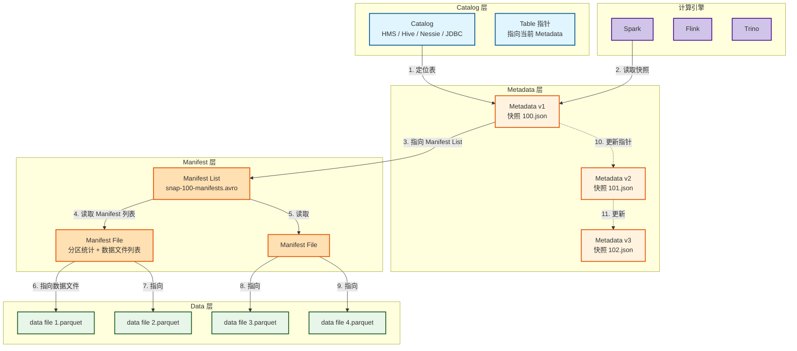
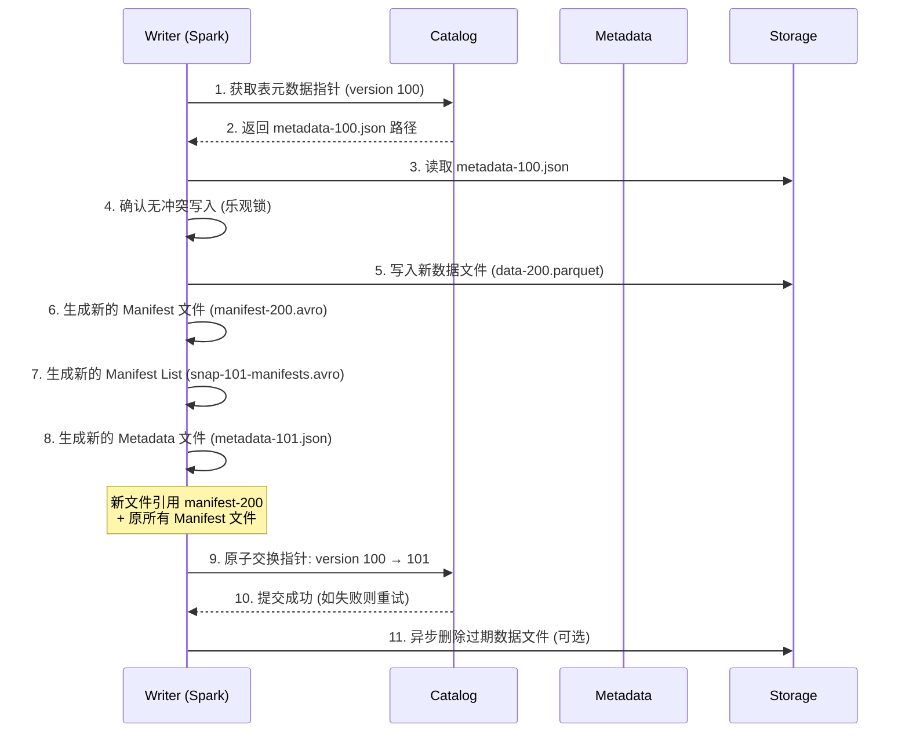
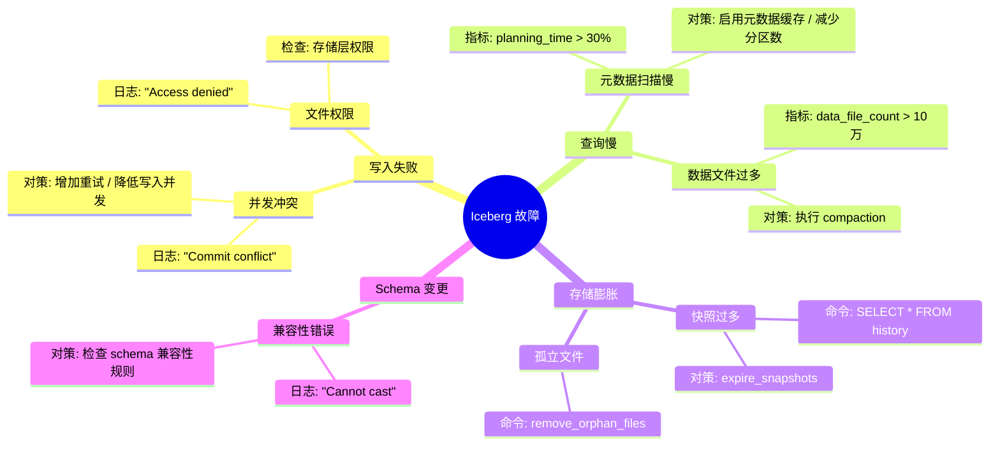

> [!info] 摘要  
> Iceberg 并非“另一种文件格式”，而是一套**将表语义（Schema、分区、快照）从计算引擎解耦至存储层的开放表格式**。它的革命性在于：首次让数据湖（对象存储 + 不可变文件）拥有了**数据库级别的 ACID 事务、快照隔离与模式演化**。本文从“如何在不可变的 Parquet 文件上实现行级更新”这一核心矛盾切入，深度解析 Iceberg 的**三层元数据架构**（Catalog → Metadata → Manifest → DataFile）、**快照机制**（Metadata 文件指针切换）与**隐藏分区设计**。通过源码级拆解 Iceberg 的元数据文件 JSON 结构、Manifest 列表的合并策略、以及 Spark 查询时的分区剪枝流程，还原一次 INSERT/UPDATE/Time Travel 操作的完整生命周期。结合生产案例，提供元数据膨胀控制、快照过期清理、Spark 与 Flink 并发写入冲突等典型问题排查方案。最后，在 2026 年 Iceberg 已成为湖仓一体事实标准的背景下，讨论其与 Paimon 的竞争关系及**表格式作为云原生存储层协议**的终极形态。

---

## 一、核心概念与底层图景

### 1.1 定义

> [!quote] 工程定义  
> **Apache Iceberg** 是一个**面向超大规模数据湖的高性能表格式**。它在计算引擎（Spark/Flink/Trino）与底层文件格式（Parquet/ORC/Avro）之间插入**三层元数据层**，将表的分区、快照、统计信息以文件形式存储，从而实现跨引擎的表语义一致性。

*类比*：Iceberg 如同**书籍的目录系统**——文件格式（Parquet）是书的正文，而 Iceberg 是前言的目录页（Metadata）和每章的摘要卡片（Manifest）。读者无需翻遍全书就能知道哪章有需要的内容。

### 1.2 架构全景图



> [!note] 交互方向解读  
> - **三层结构**：Catalog 指向当前快照的 Metadata 文件；Metadata 文件指向 Manifest List；Manifest List 指向多个 Manifest 文件；Manifest 文件指向实际数据文件。  
> - **快照切换**：每次写入生成新的 Metadata 文件（快照），Catalog 中的指针原子性地指向新文件。**这是 Iceberg 实现 ACID 的核心**。  
> - **数据不变性**：数据文件一旦写入永不被修改，更新 = 新文件 + 旧文件标记删除。

---

## 二、机制原理深度剖析

### 2.1 核心子模块拆解

| 子模块 | 职责 | 设计意图/为何独立 |
|-------|------|------------------|
| **Catalog** | 存储表位置（root path）与当前快照指针 | **解耦计算引擎**：HMS 只是 Catalog 的一种实现，也可用 Nessie/REST/内存 |
| **Metadata File** | JSON 文件，包含 Schema、分区定义、快照列表 | **快照隔离**：每个提交生成新 Metadata 文件，旧 Metadata 不可变 |
| **Snapshot** | 某时刻表的完整视图（包含所有 Manifest 列表） | **时间旅行单元**：查询时可指定任意 Snapshot ID |
| **Manifest List** | Avro 文件，列出属于某快照的所有 Manifest 文件及分区统计 | **元数据聚合**：避免扫描所有 Manifest 就能进行分区裁剪 |
| **Manifest File** | Avro 文件，存储数据文件列表及每文件的列统计、分区信息 | **谓词下推核心**：查询时可快速跳过无关数据文件 |
| **Data File** | 实际数据文件（Parquet/ORC/Avro） | **存储无关性**：文件格式可任意替换 |

> [!tip]- 深度分析：为什么 Iceberg 将元数据设计为多文件而非集中式数据库？  
> **根本原因**：避免关系数据库成为单点瓶颈与可扩展性限制。  
> - **元数据文件化**：所有元数据以 Avro/JSON 形式存放在存储层（S3/HDFS），查询引擎直接读取。  
> - **优点**：可扩展性 = 对象存储的可扩展性；无单点；支持任意并发读。  
> - **代价**：元数据操作（如提交）需“读-写-原子交换”多文件，提交延迟较传统数据库高（数百毫秒）。  
> **权衡结果**：Iceberg 适合较大粒度写入（分钟级 ETL），不适合每秒数百次微批。

### 2.2 核心流程可视化：**INSERT 操作与快照切换**



> [!warning] 关键决策点  
> - **乐观锁**：写入前需确认当前 Metadata 版本未变（通过 Catalog 提供的条件更新）。  
> - **提交失败**：若其他并发写入已更新指针，当前事务需**重试**——重新读取最新元数据、重新写入数据文件（或复用已写入文件）。  
> - **孤立文件清理**：旧快照指向的文件需保留以供时间旅行，定期由 `expireSnapshots` 删除。

---

## 三、内核/源码级实现

### 3.1 核心数据结构（Java）

> [!code] 包路径：`org.apache.iceberg`

```java
/**
 * Metadata 文件 JSON 结构的 Java 表示。
 * 路径：core/src/main/java/org/apache/iceberg/TableMetadata.java
 */
public class TableMetadata {
    private final int formatVersion;                // 元数据格式版本 (1/2)
    private final String location;                  // 表根路径
    private final Schema schema;                     // 当前 Schema
    private final int lastColumnId;                  // 最后一列的 ID
    private final PartitionSpec partitionSpec;       // 分区定义
    private final Map<String, String> properties;    // 表属性
    
    private final List<Snapshot> snapshots;          // 所有快照列表
    private final long currentSnapshotId;            // 当前快照 ID
    
    private final List<HistoryEntry> snapshotLog;    // 快照变更历史
    private final List<MetadataLogEntry> metadataLog;// Metadata 文件变更历史
}

/**
 * 快照表示。
 */
public interface Snapshot {
    long snapshotId();                // 快照唯一 ID
    Long parentId();                  // 父快照 ID (用于追溯)
    long timestampMillis();           // 创建时间
    List<ManifestFile> allManifests();// 该快照包含的所有 Manifest 文件
    String manifestListLocation();    // Manifest List 文件路径
}

/**
 * Manifest 文件 - 存储数据文件列表。
 * 路径：core/src/main/java/org/apache/iceberg/ManifestFile.java
 */
public interface ManifestFile {
    String path();                     // Manifest 文件路径
    long length();                      // 文件长度
    int partitionSpecId();               // 关联的分区定义 ID
    ManifestContent content();          // DATA 或 DELETES
    
    // 分区统计 - 用于快速裁剪
    Long snapshotId();
    int addedFilesCount();
    int existingFilesCount();
    int deletedFilesCount();
}
```

```java
/**
 * 数据文件表示。
 * 路径：core/src/main/java/org/apache/iceberg/DataFile.java
 */
public interface DataFile {
    Long recordCount();                 // 文件内记录数
    Long fileSizeInBytes();              // 文件大小
    
    // 列统计 - 用于谓词下推
    Long valueCounts();                  // 各列非空计数
    Long nullValueCounts();               // 各列空值计数
    ByteBuffer lowerBound();              // 列最小值
    ByteBuffer upperBound();              // 列最大值
    
    FileFormat format();                  // PARQUET/ORC/AVRO
    PartitionData partition();            // 分区值
}
```

> [!bug] 并发模型  
> - **Catalog 原子操作**：所有 Catalog 实现必须提供**条件更新**（`putIfAbsent` / `checkAndPut`）。HMS 基于数据库行锁实现，REST Catalog 基于 ETag。  
> - **写入无锁**：写入期间完全无锁，仅提交时进行一次原子交换。**这是 Iceberg 高并发读的基础**。  
> - **读无锁**：查询读取 Metadata 文件后，后续操作完全基于不可变文件，无锁需求。  
> - **瓶颈**：高频提交（<1秒间隔）会导致 Metadata 文件数量爆炸，需定期 `expireSnapshots` 清理。

### 3.2 核心流程伪代码：**查询时的分区裁剪**

```java
// 路径：core/src/main/java/org/apache/iceberg/BaseTableScan.java
// 简化版分区裁剪逻辑

public CloseableIterable<FileScanTask> planFiles() {
    // 1. 获取当前快照的 Manifest List
    Snapshot snapshot = table.currentSnapshot();
    ManifestList manifestList = ManifestList.read(ops.io(), snapshot.manifestListLocation());
    
    // 2. 过滤 Manifest List
    List<ManifestFile> filteredManifests = new ArrayList<>();
    for (ManifestFile manifest : manifestList) {
        // 3. 检查分区范围是否与查询条件重叠
        if (partitionEvaluator.overlaps(manifest.partitionBounds())) {
            filteredManifests.add(manifest);
        }
    }
    
    // 4. 读取过滤后的 Manifest 文件
    List<FileScanTask> tasks = new ArrayList<>();
    for (ManifestFile manifest : filteredManifests) {
        ManifestReader reader = ManifestReader.read(ops.io(), manifest.path());
        
        for (ManifestEntry entry : reader.entries()) {
            DataFile dataFile = entry.file();
            
            // 5. 列级谓词下推
            if (expression.eval(dataFile.lowerBounds(), dataFile.upperBounds())) {
                tasks.add(new BaseFileScanTask(dataFile, ...));
            }
        }
    }
    
    return CloseableIterable.withNoopClose(tasks);
}
```

> [!example]- 版本差异（v1 → v2 → v3）  
> - **v1** (2019)：基础版本，支持 Parquet/ORC，行列级别统计。  
> - **v2** (2020)：**Row-level Deletes**——支持 UPDATE/DELETE 通过位置删除文件实现，而非重写整个文件。  
> - **v3** (规划中)：**Merge-on-Read** 优化 + 流式变更日志。

---

## 四、生产落地与 SRE 实战

### 4.1 场景化案例：**Metadata 文件爆炸导致 NameNode RPC 压力飙升**

> [!danger] 现象  
> - Iceberg 表每秒一次微批写入（Flink 流写入）。  
> - 一周后，HDFS NameNode 出现 RPC 队列积压，`getFileInfo` 操作延迟 > 10 秒。  
> - 表目录下 Metadata 文件夹包含 60 万个小 JSON 文件。

> [!check] 排查链路  
> 1. **检查快照数量** → `SELECT * FROM table.history` 返回 50 万条记录。  
> 2. **查看清理策略** → 表属性 `write.metadata.delete-after-commit.enabled=false`（默认），`write.metadata.previous-versions-max=100`（默认）。  
> 3. **根因**：高频写入 + 未启用自动清理，每次提交保留前 100 个 Metadata 文件，但 60 万文件是历史遗留。

> [!success] 解决方案  
> ```sql
> -- 方案A：立即清理过期快照
> CALL catalog.system.expire_snapshots('db.table', TIMESTAMP '2026-02-01 00:00:00');
> 
> -- 方案B：设置保留策略
> ALTER TABLE db.table SET TBLPROPERTIES (
>   'write.metadata.delete-after-commit.enabled' = 'true',
>   'write.metadata.previous-versions-max' = '10'
> );
> 
> -- 方案C：开启孤儿文件清理
> CALL catalog.system.remove_orphan_files('db.table');
> ```

> [!done] 验证  
> NameNode RPC 延迟降至 100ms，Metadata 文件夹稳定在 50 个文件以内。

### 4.2 参数调优矩阵

| 参数名 | 作用域 | 推荐值（Iceberg 1.5+） | 内核解释 |
|--------|--------|----------------|---------|
| `write.metadata.previous-versions-max` | 表级 | `10` | 保留的旧 Metadata 文件数，调低减少 NameNode 压力 |
| `write.metadata.delete-after-commit.enabled` | 表级 | `true` | 提交后立即删除旧 Metadata 文件 |
| `write.target-file-size-bytes` | 表级 | `536870912`（512MB） | 目标文件大小，调大减少小文件 |
| `write.distribution-mode` | 表级 | `hash` | 写入时按分区分布，避免小文件 |
| `read.split.target-size` | 表级 | `134217728`（128MB） | 查询时 Split 大小，并行度控制 |
| `read.split.planning-lookback` | 表级 | `10` | 计划 Split 时考虑的候选文件数 |
| `history.expire.max-snapshot-age-ms` | 表级 | `86400000`（1天） | 快照最大保留时间 |

### 4.3 监控与诊断

> [!info] 关键指标（Iceberg Metastore 或 MetricsReporter）

| 指标名 | 健康区间 | 瓶颈阈值 | 含义 |
|--------|----------|----------|------|
| `snapshot_count` | < 100 | > 1000 | 快照过多，需清理 |
| `metadata_file_count` | < 50 | > 500 | Metadata 文件数，影响 NameNode |
| `data_file_count` | < 10000 | > 10万 | 数据文件过多，需 compaction |
| `total_scan_planning_time_ms` | < 100 | > 1000 | 扫描计划时间长，可能分区/统计失效 |

> [!example] 诊断命令  
> ```sql
> -- 查看快照历史
> SELECT * FROM db.table.history;
> 
> -- 查看文件统计
> SELECT * FROM db.table.files;
> 
> -- 查看分区统计
> SELECT * FROM db.table.partitions;
> 
> -- 清理计划预览
> CALL catalog.system.expire_snapshots('db.table', NOW() - INTERVAL '1' DAY, dry_run => true);
> ```

### 4.4 故障排查决策树



---

## 五、技术演进与未来视角（2026+）

### 5.1 历史设计约束与改进

| 版本 | 变化 | 动因/解决的问题 |
|------|------|----------------|
| 0.8 (2019) | **快照隔离 + 时间旅行** | 解决数据湖一致性问题 |
| 0.10 (2020) | **v2 格式 + 位置删除** | 支持高效 UPDATE/DELETE |
| 0.12 (2021) | **Spark 3.x 集成** | 成为 Spark 默认表格式 |
| 1.0 (2022) | **稳定版发布** | API 锁定，广泛生产 |
| 1.3 (2024) | **REST Catalog** | 解耦 HMS，云原生部署 |

### 5.2 2026 年仍存在的“遗留设计”

> [!bug] 痛点1：Metadata 操作延迟  
> 每次提交至少写 3 个文件（Manifest List + Manifest + Metadata JSON）。  
> **对比**：传统数据库提交仅日志追加。  
> **为何不改**：无中心化日志服务是 Iceberg 的设计哲学，代价可接受（提交延迟 200~500ms）。

> [!bug] 痛点2：小文件合并仍需手动  
> Iceberg 不主动合并数据文件，需用户触发 `REWRITE_DATA_FILES`。  
> **为何不改**：自动合并可能破坏流写入性能（写放大），社区倾向提供更好的监控而非自动化。

> [!bug] 痛点3：并发写入冲突重试成本高  
> 冲突时需**重写数据文件**（已写入文件可能无法复用）。  
> **现状**：推荐微批写入（分钟级），避免高频并发。

### 5.3 未来趋势

- **REST Catalog 成为主流**：  
  所有引擎通过 REST API 访问 Iceberg 表，无需共享 HMS 数据库。
- **Paimon 竞争**：  
  Flink 社区力推 Paimon 作为流式湖仓方案，与 Iceberg 形成“流 VS 批”分工。
- **Iceberg 定位**：  
  **批处理湖仓事实标准**。云厂商（AWS Athena、Google BigLake）已原生支持 Iceberg，无需额外服务。
- **终极形态**：  
  表格式成为**云存储层的内置语义**——S3 直接理解 Iceberg 元数据，提供原子切换 API。

> [!quote] 十年后的 Iceberg  
> 它将作为**第一个真正解耦存储与计算的工业级表格式**被铭记。它的三层元数据架构会被未来所有湖仓格式继承。当人们不再谈论“Hive 分区”时，他们仍会说“Iceberg 快照”——因为那已是对象存储的原子操作。

---

## 参考文献
- 源码路径：`https://github.com/apache/iceberg`
- 官方文档：[Iceberg Documentation](https://iceberg.apache.org/docs/latest/)
- 相关 JIRA：ICEBERG-0（v1 初始设计），ICEBERG-1328（v2 行级删除）
- 设计文档：[Iceberg Spec](https://iceberg.apache.org/spec/)