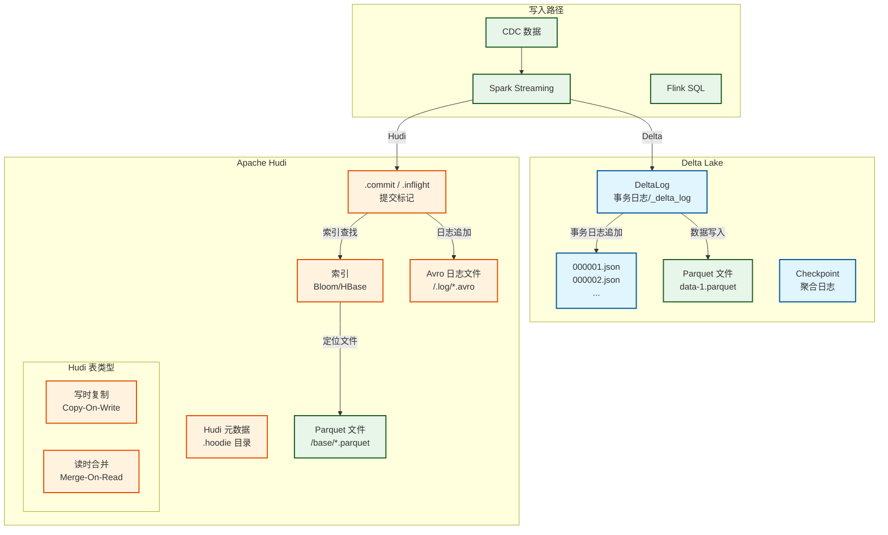
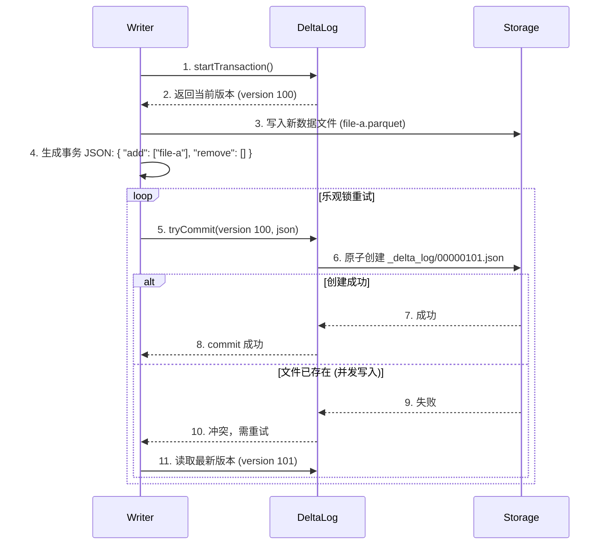
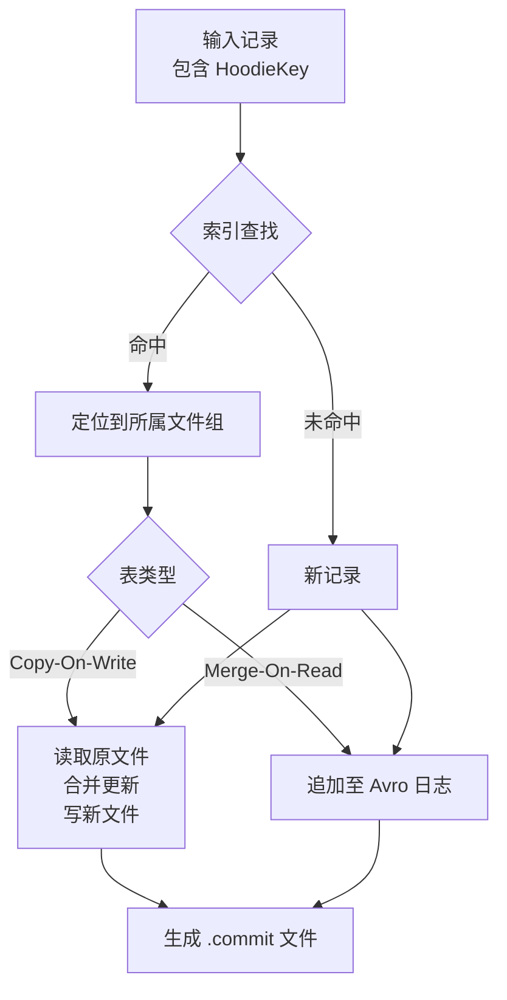
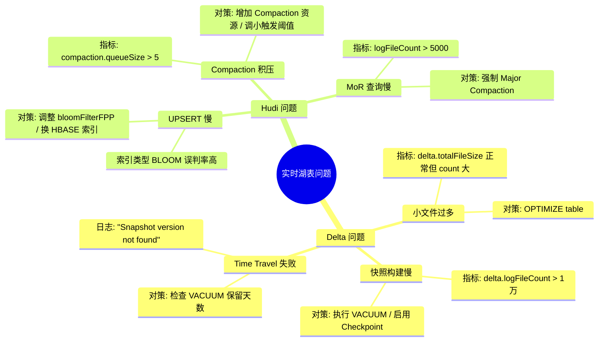

> [!info] 摘要  
> Delta Lake 与 Apache Hudi 是**为“流批一体”和“增量处理”而生的数据湖表格式**。它们与 Iceberg 共享“文件级元数据”的基本哲学，但在**写入路径的实时性**和**更新语义的灵活性**上走出不同道路：Delta 强调**事务日志 + Spark 深度集成**，Hudi 则内置**索引 + 增量查询**以支撑高吞吐更新。本文从“如何在不可变文件上实现高效 UPSERT”这一核心矛盾切入，深度解析 Delta Lake 的**事务日志（DeltaLog）** 与 Hudi 的**索引机制（Bloom Index/HBase Index）**。通过源码级拆解 Delta 的 `ACID` 提交协议、Hudi 的 `HoodieKey` 分区策略以及两者的 Compaction 实现差异，还原一次 CDC 数据入湖并实时查询的完整生命周期。结合生产案例，提供 Delta 小文件合并优化、Hudi 索引选型陷阱、Mor/Cor 表性能对比等典型问题排查方案。最后，在 2026 年 Iceberg 主导批式湖仓、Paimon 占领流式湖仓的格局下，讨论 Delta Lake 与 Hudi 在 Databricks/Cloudera 商业生态中的**护城河定位**。

---

## 一、核心概念与底层图景

### 1.1 定义

> [!quote] 工程定义  
> **Delta Lake** 与 **Apache Hudi** 是**面向实时数据湖的增量处理表格式**。它们通过**事务日志 + 索引 + 异步 Compaction**，在 Parquet 文件之上实现**分钟级延迟的 UPSERT 与增量查询**。
> - **Delta Lake**：由 Databricks 开源，深度集成 Spark，核心抽象为**事务日志（DeltaLog）**。
> - **Apache Hudi**：由 Uber 开源，内置**索引机制**，支持**写时复制（CoW）** 与**读时合并（MoR）** 两种表类型。

*类比*：Iceberg 是**严谨的图书馆目录系统**，Delta 是**带实时更新公告栏的图书馆**（事务日志记录每次变更），Hudi 则是**带快速查找索引的智能书库**（UPSERT 时直接定位旧书位置）。

### 1.2 架构全景图



> [!note] 交互方向解读  
> - **Delta 事务日志**：`_delta_log/` 目录下每个 JSON 文件对应一次提交，记录该次写入新增的文件 + 逻辑删除的文件。**所有元数据均在日志中**。  
> - **Hudi 索引**：UPSERT 时需定位记录所属文件，索引避免全表扫描。  
> - **表类型差异**：  
>   - CoW：更新时重写整个文件（写放大），查询快。  
>   - MoR：更新时追加至 Avro 日志（写快），查询时合并 Parquet + Avro（读放大）。

---

## 二、机制原理深度剖析

### 2.1 核心子模块拆解

| 子模块 | Delta Lake | Apache Hudi |
|--------|------------|-------------|
| **事务日志** | `_delta_log/` 下的 JSON 文件，每次提交追加一条记录 | `.hoodie/` 下的 `.commit` 文件，标记提交完成 |
| **索引机制** | 无全局索引（依赖文件裁剪 + 数据跳过） | Bloom Filter / HBase / 简单索引 |
| **更新实现** | 新数据写新文件，旧文件标记删除（逻辑删除） | CoW：重写文件；MoR：追加至 Avro 日志 |
| **Compaction** | `OPTIMIZE` 命令合并小文件 | 异步 Compaction 将 MoR 的 Avro 日志合并为 Parquet |
| **时间旅行** | 基于事务日志版本号 | 基于提交时间戳 / 版本号 |
| **增量查询** | `delta-io/connectors` 支持 CDC | 原生支持 `BEGIN/END` 时间戳增量拉取 |
| **并发控制** | 乐观锁（基于 DeltaLog 原子重命名） | 悲观锁（基于文件系统原子操作） |

> [!tip]- 深度分析：为什么 Hudi 需要索引而 Delta 不需要？  
> **根本原因**：使用场景差异。  
> - **Hudi 起源**：Uber 轨迹数据 UPSERT 场景，**必须快速定位某条记录所属文件**，否则全表扫描无法满足延迟。  
> - **Delta 定位**：Databricks 默认表格式，假设**大多数写入为追加**（日志/CDC 批处理），更新场景较少。  
> - **代价差异**：  
>   - Hudi 索引带来额外存储与维护成本，但 UPSERT 性能优。  
>   - Delta 无索引，更新时需扫描文件，适合更新占比低的场景。  
> **社区演进**：Delta 2.0+ 引入 **Data Skipping** 与 **Z-Order**，部分弥补无索引的查询性能。

### 2.2 核心流程可视化：**Delta Lake 事务提交协议**



### 2.3 Hudi UPSERT 全流程（索引 + 更新）



> [!warning] 关键决策点  
> - **文件组（File Group）**：Hudi 将数据划分为固定数量的文件组，每个组内包含一个 Base 文件（Parquet）和多个 Log 文件（Avro）。  
> - **索引粒度**：索引记录每个 HoodieKey（记录主键）所属的文件组 ID，而非具体偏移量。  
> - **写放大**：CoW 表更新 N 条记录需重写整个文件（写放大可能 100x），MoR 表仅追加日志（写放大 ≈ 1x），但查询时需合并。

---

## 三、内核/源码级实现

### 3.1 核心数据结构

> [!code] Delta Lake 事务日志条目（JSON）
```json
{
  "commitInfo": {
    "timestamp": 1708765432000,
    "operation": "WRITE",
    "operationParameters": {"mode": "Append"},
    "readVersion": 100,
    "isolationLevel": "Serializable"
  },
  "add": {
    "path": "part-00000-xxx.snappy.parquet",
    "size": 134217728,
    "partitionValues": {"dt": "2026-02-11"},
    "modificationTime": 1708765432000,
    "dataChange": true,
    "stats": "{\"numRecords\":1000000,\"minValues\":{...}}"
  },
  "remove": {
    "path": "part-00000-old.snappy.parquet",
    "deletionTimestamp": 1708765432000,
    "dataChange": true
  }
}
```

> [!code] Hudi 核心类（Java）
```java
// 路径：hudi-common/src/main/java/org/apache/hudi/common/model/HoodieKey.java
/**
 * Hudi 记录的唯一标识。
 */
public class HoodieKey {
    private String recordKey;      // 主键值
    private String partitionPath;  // 分区路径
    
    // 用于索引查找的唯一标识
}

// 路径：hudi-client/src/main/java/org/apache/hudi/client/AbstractHoodieWriteClient.java
/**
 * UPSERT 核心方法。
 */
public abstract class AbstractHoodieWriteClient<T> {
    
    public JavaRDD<WriteStatus> upsert(JavaRDD<T> records, String commitTime) {
        // 1. 索引查找：定位每条记录所属文件组
        JavaPairRDD<HoodieKey, HoodieRecord> keyedRecords = tagLocation(records);
        
        // 2. 按文件组分批处理
        JavaRDD<HoodieRecord> partitioned = keyedRecords.partitionBy(fileGroupId);
        
        // 3. 执行写入
        return partitioned.mapPartitions(iterator -> {
            String fileGroupId = getFileGroupId();
            HoodieTable table = getTable();
            
            if (table.getTableType() == TableType.COPY_ON_WRITE) {
                return cowWrite(fileGroupId, iterator);
            } else {
                return morWrite(fileGroupId, iterator);
            }
        }, true);
    }
}
```

> [!code] Delta Lake 事务日志读取（Scala）
```scala
// 路径：delta/core/src/main/scala/org/apache/spark/sql/delta/DeltaLog.scala
/**
 * 事务日志的 Scala 实现。
 */
class DeltaLog(
    val logPath: Path,
    val snapshot: Snapshot
) {
    
    /**
     * 获取当前快照：读取 _delta_log 目录下所有 JSON 文件并合并。
     */
    def snapshot(): Snapshot = {
        val commits = listCommits()  // 列出所有 000000.json
        val latestCommit = commits.last
        
        // 从 checkpoint 开始合并
        val checkpoint = getCheckpoint(latestCommit)
        val state = checkpoint.replay()
        
        // 重放后续增量日志
        commits.drop(checkpoint.version + 1).foreach { commit =>
            val actions = readCommit(commit)  // JSON → Action 对象
            state.apply(actions)
        }
        
        Snapshot(state)
    }
}
```

> [!example]- 版本差异（Delta 1.x → 2.x → 3.x）  
> - **1.x**：基础事务日志 + 时间旅行。  
> - **2.x**：**Z-Order** + 动态文件修剪，查询性能提升 10x。  
> - **3.x**：**UniForm**（统一格式），可同时输出 Delta/Iceberg/Hudi 元数据。

---

## 四、生产落地与 SRE 实战

### 4.1 场景化案例：**Hudi MoR 表查询延迟急剧升高**

> [!danger] 现象  
> - Hudi MoR 表（实时摄入 CDC），运行一周后查询耗时从 3 秒升至 3 分钟。  
> - 表目录下 `.log` 文件数量达 5 万+。  
> - 查询计划显示扫描了所有 Log 文件。

> [!check] 排查链路  
> 1. **检查表类型** → `DESC EXTENDED` 显示 `type=MOR`。  
> 2. **查看 Compaction 状态** → `SHOW COMPACTION` 返回空，Compaction 未运行。  
> 3. **根因**：Compaction 作业未配置定时执行，Log 文件持续累积。

> [!success] 解决方案  
> ```bash
> # 方案A：手动触发 Compaction
> spark-submit --class org.apache.hudi.utilities.HoodieCompactor \
>   --table-type MERGE_ON_READ \
>   --base-path s3://table/path \
>   --schedule
> 
> # 方案B：配置异步 Compaction（生产）
> spark.sql("SET hoodie.compact.inline=true")  # 每次写入触发 Compaction
> spark.sql("SET hoodie.compact.inline.max.delay=60")  # 延迟上限
> 
> # 方案C：调整触发阈值
> ALTER TABLE table SET TBLPROPERTIES (
>   'hoodie.parquet.small.file.limit' = '104857600',  # 100MB
>   'hoodie.logfile.to.parquet.compaction.threshold' = '5'  # 5 个 Log 触发
> );
> ```

> [!done] 验证  
> 运行 Compaction 后 Log 文件减少至 50 个，查询恢复 3 秒。

### 4.2 参数调优矩阵

| 参数名 | 引擎 | 推荐值 | 内核解释 |
|--------|------|--------|---------|
| `spark.databricks.delta.retentionDurationCheck.enabled` | Delta | `false` | 关闭保留期检查，允许 VACUUM 清理 |
| `delta.autoOptimize.autoCompact` | Delta | `true` | 自动合并小文件 |
| `delta.autoOptimize.optimizeWrite` | Delta | `true` | 写入时动态优化文件大小 |
| `hoodie.upsert.shuffle.parallelism` | Hudi | `200` | UPSERT 时 Shuffle 并行度 |
| `hoodie.index.type` | Hudi | `BLOOM`（千万级） / `HBASE`（亿级） | 索引类型，影响 UPSERT 性能 |
| `hoodie.compact.inline.max.delay` | Hudi | `60`（秒） | 内联 Compaction 最大延迟 |
| `hoodie.cleaner.policy` | Hudi | `KEEP_LATEST_COMMITS` | 清理策略，默认保留 10 次提交 |

### 4.3 监控与诊断

> [!info] 关键指标

| 指标名 | 引擎 | 健康区间 | 瓶颈阈值 | 含义 |
|--------|------|----------|----------|------|
| `delta.logFileCount` | Delta | < 1000 | > 10000 | 日志文件数，过多影响快照构建 |
| `delta.totalFileSize` | Delta | < 10GB | > 100GB | 小文件过多需 OPTIMIZE |
| `hudi.logFileCount` | Hudi | < 100 | > 5000 | MoR 表 Log 文件积压 |
| `hudi.compaction.queueSize` | Hudi | 0 | > 10 | Compaction 积压 |
| `hudi.index.lookupTimeMs` | Hudi | < 10ms | > 100ms | 索引查询慢，需优化索引类型 |

> [!example] 诊断命令  
> ```sql
> -- Delta 查看文件统计
> DESCRIBE DETAIL table;
> 
> -- Delta 查看事务日志
> SELECT * FROM (DESCRIBE HISTORY table);
> 
> -- Hudi 查看文件组分布
> CALL hudi.show_fsview('table');
> 
> -- Hudi 查看 Compaction 计划
> CALL hudi.show_compaction('table');
> ```

### 4.4 故障排查决策树



---

## 五、技术演进与未来视角（2026+）

### 5.1 历史设计约束与改进

| 版本 | 变化 | 动因/解决的问题 |
|------|------|----------------|
| Delta 0.1 (2019) | **事务日志 + Spark 集成** | 解决 S3 数据湖一致性问题 |
| Delta 1.0 (2020) | **Z-Order + 动态修剪** | 查询性能提升 10 倍 |
| Delta 2.0 (2022) | **UniForm** | 兼容 Iceberg/Hudi 元数据 |
| Hudi 0.5 (2017) | **增量处理 + 索引** | Uber 内部轨迹数据需求 |
| Hudi 0.10 (2021) | **Metadata Table** | 加速文件列表查询 |
| Hudi 0.13 (2023) | **Flink 原生集成** | 流式湖仓能力提升 |

### 5.2 2026 年仍存在的“遗留设计”

> [!bug] Delta 痛点：无全局索引  
> 高频 UPDATE/DELETE 场景仍需全表扫描或人工分区裁剪。  
> **为何不改**：保持元数据轻量，避免索引维护成本。

> [!bug] Hudi 痛点：MoR 查询稳定性  
> 大量 Log 文件时，查询需同时打开数百个 Avro 文件，HDFS NameNode 压力巨大。  
> **为何不改**：Compaction 触发策略保守，避免频繁重写。

> [!bug] 共同痛点：并发写入冲突  
> 高频写入（< 30 秒间隔）易发生事务冲突，重试成本高。  
> **现状**：生产环境推荐分钟级微批，而非秒级。

### 5.3 未来趋势

- **Delta UniForm**：  
  一套数据，同时生成 Delta/Iceberg/Hudi 元数据。**用户可自由选择查询引擎**。
- **Hudi 与 Flink 深度融合**：  
  抢占流式湖仓市场，与 Paimon 正面竞争。
- **Iceberg 成为“通用底层”**：  
  Delta/Hudi 作为商业发行版增强特性存在，开源核心与 Iceberg 趋同。

> [!quote] 十年后的实时湖格式  
> Delta Lake 将作为 Databricks 的护城河继续存在，Hudi 扎根 Cloudera 生态，Iceberg 成为云厂商默认格式。它们的核心创新——事务日志、索引、增量查询——已融入所有现代表格式。用户将不再争论“选哪个”，而是由平台根据 workload 自动决定。

---

## 参考文献
- 源码路径（Delta）：`https://github.com/delta-io/delta`
- 源码路径（Hudi）：`https://github.com/apache/hudi`
- 官方文档：[Delta Lake Documentation](https://docs.delta.io/latest/index.html)，[Apache Hudi Documentation](https://hudi.apache.org/docs/overview)
- 相关论文：Armbrust, M., et al. (2020). "Lakehouse: A New Generation of Open Platforms that Unify Data Warehousing and Advanced Analytics." CIDR.