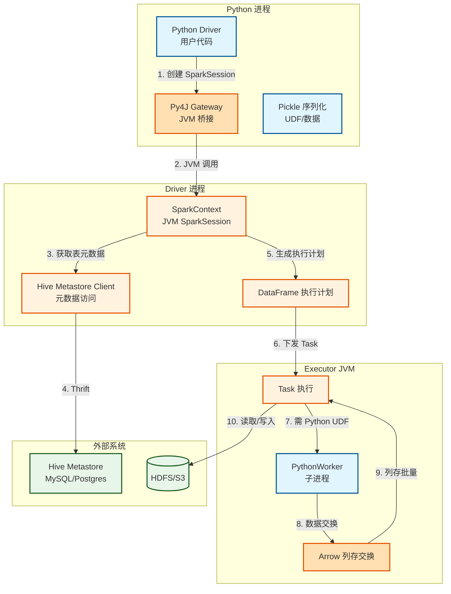
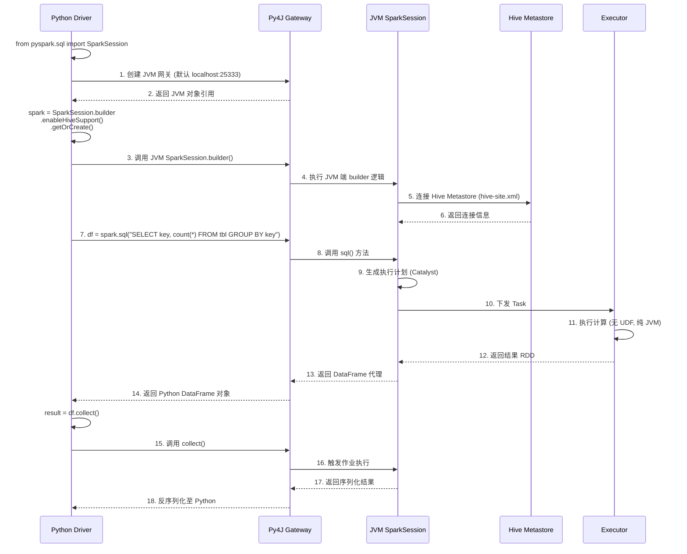
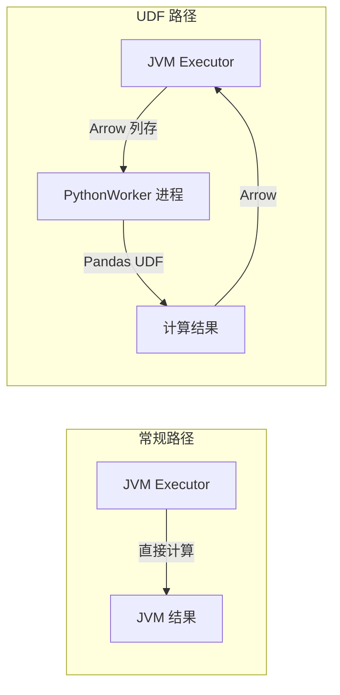
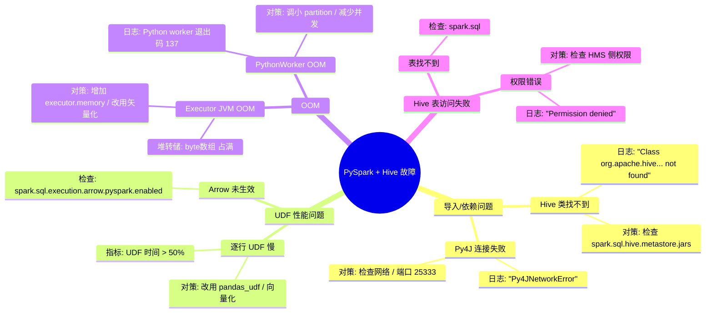

> [!info] 摘要  
> PySpark 并非“Spark 的 Python 包装器”，而是一套**通过 JVM 桥接（Py4J）实现 Python 进程与 Spark 执行引擎深度互操作**的分布式计算接口。Hive 集成则是在此基础上，通过 **Hive Metastore 客户端 + SparkSession 配置**，将 Hive 的元数据管理与 Spark 的执行引擎打通。本文从“Python 如何调用 JVM 对象”这一根本实现问题切入，深度解析 PySpark 的**架构分层**（Python Driver → JVM Gateway → Executor）、**数据序列化**（Pickle → Java 对象）以及 **Hive 集成时元数据同步机制**。通过源码级拆解 `SparkSession` 的 `enableHiveSupport` 实现、`DataFrame` 在 Python 与 JVM 间的内存布局、以及 PySpark UDF 的序列化传输路径，还原一次 PySpark 读取 Hive 表并执行 GroupBy 的完整生命周期。结合生产案例，提供 Python UDF 性能优化、Hive 依赖冲突排查、以及 PySpark 内存调优等典型问题解决方案。最后，在 2026 年 Spark Connect 普及的背景下，讨论 PySpark 从“本地桥接”向“远程服务端执行”的架构演进。

---

## 一、核心概念与底层图景

### 1.1 定义

> [!quote] 工程定义  
> **PySpark** 是 Spark 的 Python 语言绑定，其核心是一个**通过 Py4J 启动的 JVM 网关进程**，Python 进程将 DataFrame 操作翻译为对 JVM `SparkSession` 的方法调用。**Hive 集成**则是在此基础上加载 Hive 的配置文件和依赖，使 Spark 能够访问 Hive Metastore 中的表元数据。

*类比*：PySpark 如同**同声传译员**——Python 使用者（客户端）说出操作意图，传译员（Py4J 网关）将其转换为 JVM 世界（Spark 内核）能理解的指令，再将计算结果翻译回 Python。

### 1.2 架构全景图



> [!note] 交互方向解读  
> - **控制流**：Python Driver 通过 Py4J 调用 JVM SparkSession 的 API，所有 DataFrame 操作在 JVM 侧生成执行计划。  
> - **数据流（常规）**：Executor 直接读取 HDFS，处理结果以二进制形式返回 Driver。  
> - **数据流（UDF）**：Executor 需启动 PythonWorker 子进程，通过 Arrow 列存格式批量交换数据。  
> - **Hive 集成**：JVM Driver 加载 Hive 配置，通过 Thrift 连接 HMS，将表元数据拉取至 Spark 侧。

---

## 二、机制原理深度剖析

### 2.1 核心子模块拆解

| 子模块 | 职责 | 设计意图/为何独立 |
|-------|------|------------------|
| **Py4J Gateway** | Python 进程内的 JVM 桥接，提供 JVM 对象引用 | **单一通信通道**：所有 JVM 调用复用同一 TCP 连接，避免重复建连 |
| **SparkContext 代理** | Python 侧持有 JVM SparkContext 的引用，方法调用转发 | **API 对称性**：Python API 与 Scala API 保持一一对应 |
| **Serializer** | 将 Python 对象序列化为 Java 对象（反之亦然） | **跨语言数据交换**：默认使用 Pickle，UDF 场景需传递函数代码 |
| **Arrow-based 交换** | Executor 与 PythonWorker 间的列存数据交换 | **消除逐行序列化**：批量传输，性能提升 10~100x |
| **HiveClient 缓存** | 缓存 Hive Metastore 元数据，减少 RPC | **元数据访问优化**：表定义、分区信息等一次性拉取 |

> [!tip]- 深度分析：为什么 PySpark UDF 比 Scala UDF 慢？  
> **根本原因**：数据需跨进程传输 + 逐行序列化。  
> - **路径**：JVM Executor 数据 → Socket → PythonWorker → 反序列化为 Python 对象 → 执行 UDF → 序列化 → Socket → JVM。  
> - **Arrow 优化**：批量传输列存格式，**Python 端可直接操作 Arrow 数组**，避免逐行反序列化。  
> - **剩余瓶颈**：跨进程通信 + Python 解释器 GIL。  
> **结论**：非 UDF 操作（标准 SQL/DataFrame）性能与 Scala 无差异；UDF 应尽量用 Pandas UDF（矢量化）替代逐行 UDF。

### 2.2 核心流程可视化：**PySpark 读取 Hive 表执行 GroupBy**



### 2.3 Python UDF 执行路径（与常规路径对比）



> [!warning] 关键决策点  
> - **序列化策略**：Spark 2.3+ 默认启用 Arrow，但需设置 `spark.sql.execution.arrow.pyspark.enabled=true`。  
> - **UDF 类型**：  
>   - `udf()`：逐行，慢。  
>   - `pandas_udf()`：矢量化，快。  
>   - `pandas_udf()` 需指定返回类型（如 `IntegerType()`）。

---

## 三、内核/源码级实现

### 3.1 核心数据结构（Python + Java）

> [!code] Python 侧：SparkSession 类（简化）
```python
# 路径：python/pyspark/sql/session.py
class SparkSession:
    def __init__(self, spark_context, jsparkSession=None):
        self._sc = spark_context
        # JVM 侧 SparkSession 的引用
        self._jsparkSession = jsparkSession or self._jvm.SparkSession(self._sc._jsc)
    
    def sql(self, sqlQuery):
        # 调用 JVM 侧的 sql() 方法，返回 JVM DataFrame 引用
        jdf = self._jsparkSession.sql(sqlQuery)
        # 包装为 Python DataFrame
        return DataFrame(jdf, self)
    
    @staticmethod
    def builder():
        return Builder()
    
    class Builder:
        def enableHiveSupport(self):
            self._options['enableHiveSupport'] = True
            return self
        
        def getOrCreate(self):
            # 构建 JVM 侧 SparkSession.Builder
            jbuilder = self._jvm.SparkSession.builder()
            # 应用配置
            for k, v in self._options.items():
                jbuilder = getattr(jbuilder, k)()
            # 创建 JVM SparkSession
            jspark = jbuilder.getOrCreate()
            return SparkSession(self._sc, jspark)
```

> [!code] JVM 侧：Hive 集成核心类（Scala）
```scala
// 路径：sql/hive/src/main/scala/org/apache/spark/sql/hive/HiveSessionStateBuilder.scala
/**
 * Hive 感知的 SessionState 构建器。
 * 当 enableHiveSupport() 被调用时，Spark 使用此实现。
 */
class HiveSessionStateBuilder(
    session: SparkSession,
    parentState: Option[SessionState])
  extends SessionStateBuilder(session, parentState) {
  
  override lazy val catalog: HiveExternalCatalog = {
    new HiveExternalCatalog(
      session.sharedState.externalCatalog,
      session.sharedState.globalTempViewManager)
  }
  
  override lazy val metadataHive: HiveClient = {
    val client = HiveUtils.newClientForMetadata(
      session.sparkContext.conf,
      session.sharedState.hadoopConf)
    client
  }
}
```

> [!code] 跨进程数据交换：Arrow 序列化（Java + Python）
```java
// 路径：sql/core/src/main/java/org/apache/spark/sql/execution/python/ArrowPythonRunner.java
/**
 * 在 Executor JVM 侧，将数据转换为 Arrow 格式并发送给 PythonWorker。
 */
public class ArrowPythonRunner extends BasePythonRunner<ColumnarBatch> {
    
    protected void writeIteratorToStream(
        Iterator<ColumnarBatch> iter,
        OutputStream stream) {
        
        ArrowWriter writer = new ArrowWriter(root, stream);
        while (iter.hasNext()) {
            ColumnarBatch batch = iter.next();
            writer.writeBatch(batch);  // 列存批量写入
        }
        writer.finish();
    }
}
```

```python
# 路径：python/pyspark/serializers.py
class ArrowStreamSerializer:
    """
    Python 侧 Arrow 流反序列化。
    """
    def load_stream(self, stream):
        import pyarrow as pa
        reader = pa.ipc.open_stream(stream)
        for batch in reader:
            yield batch
```

> [!bug] 并发模型  
> - **Py4J 网关**：单线程处理 Python 侧 JVM 调用，所有 API 调用串行。  
> - **Executor 与 PythonWorker**：每个 Executor 可启动多个 PythonWorker（`spark.python.worker.reuse=true` 时复用）。  
> - **GIL 限制**：单个 PythonWorker 内 UDF 执行受 GIL 限制，但多个 PythonWorker 可并行。

---

## 四、生产落地与 SRE 实战

### 4.1 场景化案例：**Python UDF 导致 Executor OOM**

> [!danger] 现象  
> - PySpark 作业使用常规 `udf()` 处理字符串列。  
> - 运行 1 小时后 Executor 日志出现 `java.lang.OutOfMemoryError: Java heap space`。  
> - 堆转储显示 `byte[]` 占用大量内存。

> [!check] 排查链路  
> 1. **检查 UDF 类型** → 使用 `udf()`，而非 `pandas_udf()`。  
> 2. **监控 PythonWorker** → Executor 日志显示 PythonWorker 进程正常，但 JVM 内存持续上涨。  
> 3. **根因**：逐行 UDF 导致**每行数据在 JVM 和 Python 间复制**，序列化后的小对象在 JVM 侧无法快速 GC，最终 OOM。

> [!success] 解决方案  
> ```python
> # 方案A：改用 Pandas UDF（矢量化）
> from pyspark.sql.functions import pandas_udf
> 
> @pandas_udf("string")
> def clean_string(s: pd.Series) -> pd.Series:
>     return s.str.strip().str.lower()
> 
> # 方案B：若无法矢量化，增加 batch size
> spark.conf.set("spark.sql.execution.arrow.maxRecordsPerBatch", "10000")
> 
> # 方案C：调大 Executor 内存 + 降低并行度
> --conf spark.executor.memory=8g
> --conf spark.sql.execution.arrow.pyspark.enabled=true
> ```

> [!done] 验证  
> 改用 Pandas UDF 后，内存稳定在 2GB 以下，作业完成时间从 3 小时降至 20 分钟。

### 4.2 参数调优矩阵

| 参数名 | 作用域 | 推荐值 | 内核解释 |
|--------|--------|--------|---------|
| `spark.sql.execution.arrow.pyspark.enabled` | 会话 | `true` | 启用 Arrow 列存交换，UDF 性能提升 10x |
| `spark.sql.execution.arrow.maxRecordsPerBatch` | 会话 | `10000` | 每批最大记录数，调大减少通信次数 |
| `spark.python.worker.reuse` | 应用 | `true` | 复用 PythonWorker 进程，避免频繁启动 |
| `spark.python.daemon.module` | 应用 | `pyspark.daemon` | PythonWorker 守护进程入口 |
| `spark.sql.hive.metastore.version` | 应用 | `3.1.2` | Hive Metastore 版本，需匹配集群 |
| `spark.sql.hive.metastore.jars` | 应用 | `builtin` 或路径 | Hive JAR 包位置，冲突常见原因 |

### 4.3 监控与诊断

> [!info] 关键指标（Spark UI / Python 侧）

| 指标名 | 健康区间 | 瓶颈阈值 | 含义 |
|--------|----------|----------|------|
| `Python UDF 执行时间` | < 30% | > 70% | UDF 占用大部分时间，需优化 |
| `Arrow 序列化时间` | < 10% | > 30% | Arrow 转换开销大，检查 batch size |
| `PythonWorker 数量` | = core 数 | > 2x core 数 | 进程过多，可能内存竞争 |
| `Hive Metastore 连接数` | < 10 | > 50 | 元数据连接泄露，检查会话关闭 |

> [!example] 诊断命令  
> ```python
> # 查看执行计划（确认 UDF 是否被矢量化）
> df.explain()
> 
> # 测试 UDF 性能（小数据集）
> df.sample(0.01).groupBy(...).count().show()
> 
> # 查看 Arrow 是否生效
> spark.conf.get("spark.sql.execution.arrow.pyspark.enabled")
> 
> # 调试 Py4J 通信
> import pyspark
> pyspark.java_gateway._gateway_property()
> ```

### 4.4 故障排查决策树



---

## 五、技术演进与未来视角（2026+）

### 5.1 历史设计约束与改进

| 版本 | 变化 | 动因/解决的问题 |
|------|------|----------------|
| Spark 0.9 (2013) | **PySpark 初版** | Python 开发者可调用 Spark |
| Spark 1.4 (2015) | **DataFrame API** | Python 侧获得同等表达能力 |
| Spark 2.3 (2018) | **Arrow 集成** | UDF 性能提升 10x |
| Spark 3.0 (2020) | **Pandas UDF 增强** | 支持类型推断、迭代器 |
| Spark 3.4 (2023) | **Spark Connect** | Python 客户端可远程连接 Spark 服务端 |

### 5.2 2026 年仍存在的“遗留设计”

> [!bug] 痛点1：Py4J 单点瓶颈  
> 所有 Python API 调用串行经过网关，高并发 DataFrame 操作（如循环 `createDataFrame`）易堵塞。  
> **为何不改**：重构为全双工 RPC 需重写整个客户端，社区选择 Spark Connect 作为长期方案。

> [!bug] 痛点2：Python UDF 调试困难  
> PythonWorker 日志默认不输出，UDF 内 `print()` 不可见。  
> **对策**：启用 `spark.python.worker.log.level = DEBUG`，但日志量大。

> [!bug] 痛点3：Hive 依赖版本冲突  
> 不同 Hive 版本（2.x/3.x）的 JAR 包冲突常见，需精确匹配 `spark.sql.hive.metastore.version`。  
> **社区方案**：`spark.sql.hive.metastore.jars=builtin` 仅覆盖有限版本。

### 5.3 未来趋势

- **Spark Connect**：  
  Python 客户端通过 gRPC 与 Spark Server 通信，**Py4J 网关被彻底替代**。  
  - 优点：解耦 Python 与 JVM 版本，支持远程部署。  
  - 缺点：UDF 执行仍在服务端，Python 侧无法定义 UDF？需传递 Python 代码到服务端。
- **Pandas 2.0 + Arrow**：  
  列存数据交换将成为默认，逐行 UDF 彻底淘汰。
- **Hive Metastore 替代品**：  
  云原生环境多用 AWS Glue Catalog / Unity Catalog，PySpark 直接适配 REST API，绕过 HMS。

> [!quote] 十年后的 PySpark  
> 它将不再有 Py4J 网关，而是 Spark 的**一等公民客户端**。Python 与 JVM 之间的壁垒因 Arrow 和 Spark Connect 彻底消失。但 UDF 的性能瓶颈——那个根植于跨进程通信的天生缺陷——将永远提醒我们：**分布式计算的尽头，数据必须向代码靠近**。

---

## 参考文献
- 源码路径（PySpark）：`python/pyspark/`
- 源码路径（Spark SQL Hive）：`sql/hive/`
- 官方文档：[PySpark Documentation](https://spark.apache.org/docs/latest/api/python/)，[Hive Metastore Integration](https://spark.apache.org/docs/latest/sql-data-sources-hive-tables.html)
- 相关 JIRA：SPARK-22216（Arrow 集成），SPARK-39375（Spark Connect Python 客户端）