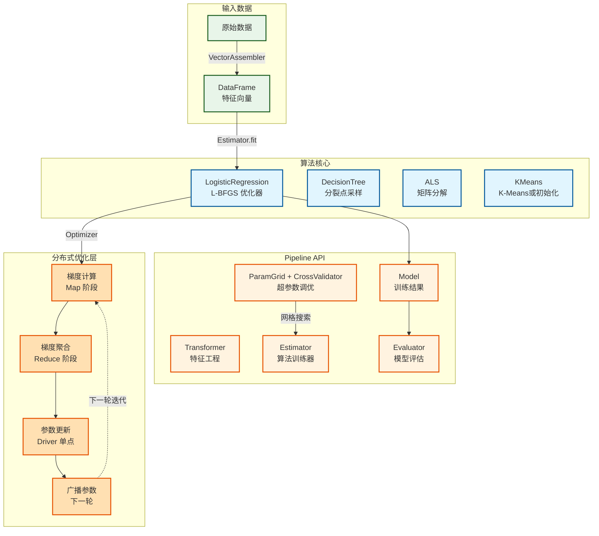
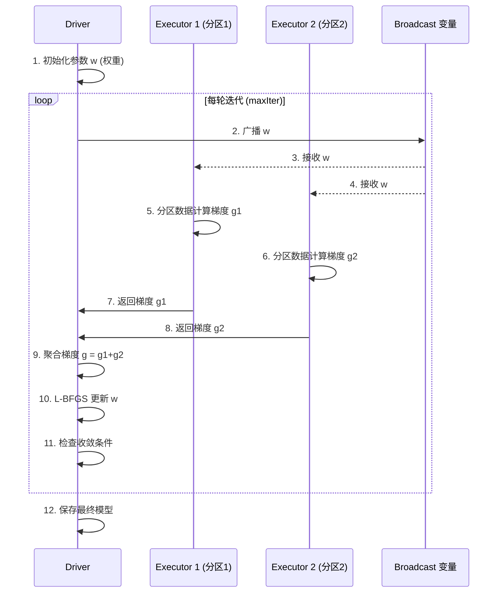
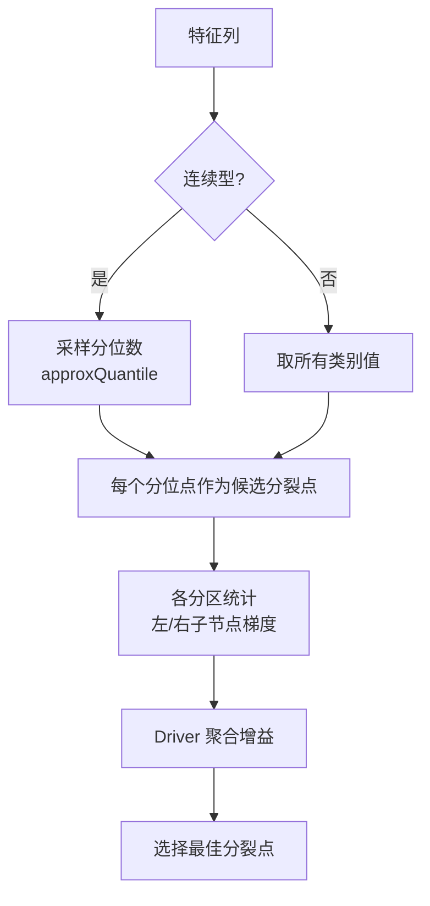
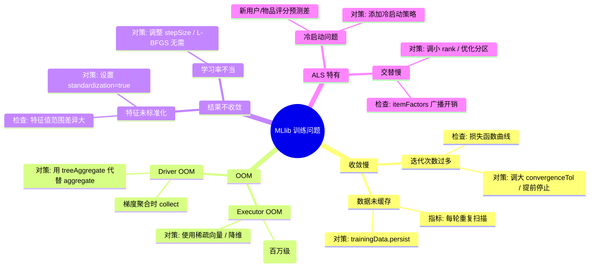

# 15 Spark MLlib：分布式机器学习算法实现

> [!info] 摘要  
> MLlib 并非“在 Spark 上跑 scikit-learn”，而是一套**将经典机器学习算法重新设计为分布式迭代计算**的算法库。其核心挑战在于：如何在多轮迭代中最小化数据 Shuffle、如何在分布式环境下实现高效的梯度计算与参数同步。本文从“如何将线性回归扩展到 TB 级数据”这一核心问题切入，深度解析 MLlib 的两套 API（`spark.ml` 与 `spark.mllib`）、**基于 RDD 的迭代算法设计**以及 **基于 DataFrame 的 Pipeline 抽象**。通过源码级拆解 `LogisticRegression` 的优化器实现（L-BFGS）、`DecisionTree` 的分裂点采样机制、以及 `ALS` 矩阵分解的隐性反馈处理，还原一次分布式模型训练的参数更新生命周期。结合生产案例，提供迭代算法内存调优、`TreeNode` 广播优化、以及多轮迭代中的 Shuffle 控制等典型问题排查方案。最后，在 2026 年分布式深度学习框架（BigDL、Horovod）逐步成熟的背景下，讨论 MLlib 的**大规模线性模型与树模型**的稳固阵地。

---

## 一、核心概念与底层图景

### 1.1 定义

> [!quote] 工程定义  
> **Spark MLlib** 是 Spark 的分布式机器学习库，包含**两套 API**：
> - `spark.mllib`：基于 RDD 的原始 API（现已进入维护模式）
> - `spark.ml`：基于 DataFrame 的高层 API，支持 Pipeline 构建与超参数调优
> 
> 其核心算法均采用**分布式优化**策略，通过将计算分解为 Map 阶段的局部更新和 Reduce 阶段的全局聚合，在多轮迭代中收敛模型参数。

*类比*：MLlib 如同**分布式健身房**——数据被分配到不同教练（分区）指导训练，定期聚会（Driver）交流进步，调整下一轮计划。而基于 DataFrame 的 Pipeline API，则像是为整套训练流程（清洗→特征→建模→评估）设计的标准化器材。

### 1.2 架构全景图



> [!note] 交互方向解读  
> - **Pipeline 抽象**：`Transformer`（如 `StringIndexer`）修改 DataFrame 列；`Estimator` 基于 DataFrame 训练生成 `Model`；`Evaluator` 评估模型。  
> - **分布式优化**：每轮迭代中，各分区并行计算梯度（或损失），Driver 聚合后更新参数，再广播至下一轮。  
> - **算法差异**：树模型分裂需采样特征；KMeans 需全局计算簇心；ALS 需交替更新用户/物品矩阵。

---

## 二、机制原理深度剖析

### 2.1 核心子模块拆解

| 子模块 | 职责 | 设计意图/为何独立 |
|-------|------|------------------|
| **Gradient** | 计算损失函数对参数的偏导 | **计算本地化**：分区数据独立计算梯度，无跨节点依赖 |
| **TreePoint** | 决策树节点的数据结构，包含特征索引与分裂点 | **内存紧凑**：减少对象开销，便于广播 |
| **StatsAggregator** | 聚合各分区统计信息（如梯度、损失、计数） | **reduce 友好**：设计为可结合律的累加器 |
| **Updater** | 根据梯度更新模型参数（SGD/L-BFGS 等） | **优化器可插拔**：同一算法可换不同优化策略 |
| **Broadcast** | 将模型参数分发至各节点 | **通信优化**：避免每轮迭代重新序列化大模型 |

> [!tip]- 深度分析：为什么 MLlib 不直接使用 Spark SQL 的 Tungsten 优化？  
> **根本原因**：算法迭代涉及大量**向量计算**，而 Tungsten 主要优化关系算子（Join/Filter）。  
> - **现状**：MLlib 早期基于 RDD，迭代性能受 JVM 对象开销影响。  
> - **改进**：MLlib 2.0+ 基于 DataFrame，部分利用 Tungsten 列存，但核心算法仍以 JVM 对象为主。  
> - **替代方案**：使用 **Vectorized UDF** 或 **PyTorch Distribute** 在 Spark 上跑深度学习，MLlib 专注于传统机器学习。  

### 2.2 核心流程可视化：**LogisticRegression 分布式训练迭代**



### 2.3 决策树分裂点采样机制



> [!warning] 关键决策点  
> - **分位数采样**：`approxQuantile` 使用 Greenwald-Khanna 算法，一次扫描数据即可获得近似分位数，避免排序。  
> - **逐层训练**：决策树按层生长，每层结束后广播新的分裂点信息，**下一层节点基于上一层的分布数据计算**。  
> - **多线程**：单个 Executor 内并行计算多个候选分裂点的增益，充分利用 CPU。

---

## 三、内核/源码级实现

### 3.1 核心数据结构（Scala）

> [!code] LogisticRegression 梯度计算（RDD API）
```scala
// 路径：mllib/src/main/scala/org/apache/spark/mllib/classification/LogisticRegression.scala
/**
 * LogisticRegression 梯度计算的聚合器。
 */
private class LogisticAggregator(
    val weights: Vector,
    val numClasses: Int,
    val fitIntercept: Boolean
) extends Serializable {
    
    private var lossSum = 0.0
    private var gradientSum: Vector = Vectors.zeros(weights.size)
    
    /**
     * 添加单个样本的梯度贡献。
     * 此方法在 Executor 端被并行调用。
     */
    def add(instance: Instance): this.type = {
        val label = instance.label
        val features = instance.features
        
        // 计算边际 (margin) = w·x
        val margin = BLAS.dot(weights, features)
        
        // 计算损失梯度 (LogLoss)
        val multiplier = 1.0 / (1.0 + math.exp(-margin)) - label
        BLAS.axpy(multiplier, features, gradientSum)
        lossSum += computeLoss(margin, label)
        
        this
    }
    
    /**
     * 合并两个聚合器（Reduce 阶段）。
     */
    def merge(other: LogisticAggregator): this.type = {
        BLAS.axpy(1.0, other.gradientSum, gradientSum)
        lossSum += other.lossSum
        this
    }
}
```

> [!code] 决策树分裂点计算（核心逻辑）
```scala
// 路径：mllib/src/main/scala/org/apache/spark/mllib/tree/impurity/Gini.scala
/**
 * 计算候选分裂点的 Gini 增益。
 */
class GiniCalculator extends ImpurityCalculator {
    
    def calculate(
        leftStats: ImpurityCalculator,
        rightStats: ImpurityCalculator
    ): Double = {
        // 左子节点 Gini
        val leftGini = leftStats.calculate()
        val leftCount = leftStats.count
        
        // 右子节点 Gini
        val rightGini = rightStats.calculate()
        val rightCount = rightStats.count
        
        val totalCount = leftCount + rightCount
        
        // 父节点 Gini
        val parentGini = (leftCount * leftGini + rightCount * rightGini) / totalCount
        
        // 信息增益 = 父节点 Gini - 加权子节点 Gini
        parentGini - (leftCount * leftGini + rightCount * rightGini) / totalCount
    }
}
```

> [!code] ALS 矩阵分解（交替最小二乘）
```scala
// 路径：mllib/src/main/scala/org/apache/spark/mllib/recommendation/ALS.scala
/**
 * ALS 的用户因子更新。
 */
def updateUser(
    userId: Int,
    userRatings: Array[Rating],  // 用户已有的评分
    itemFactors: RDD[(Int, Array[Double])]  // 当前物品因子 (广播)
): Array[Double] = {
    
    // 构建矩阵 X (物品因子矩阵) 和向量 y (评分值)
    val (X, y) = buildLeastSquaresProblem(userRatings, itemFactors)
    
    // 求解 (X^T X) w = X^T y
    val XtX = X.t().multiply(X)   // 矩阵乘法
    val Xty = X.t().multiply(y)
    
    // 添加正则项 λI
    val lambda = getRegParam()
    for (i <- 0 until rank) {
        XtX(i, i) += lambda * userRatings.length
    }
    
    // 求解线性方程组 (Cholesky 分解)
    val w = new DenseVector(Array.fill(rank)(0.0))
    val solver = new CholeskyDecomposition()
    solver.solve(XtX, Xty, w)
    
    w.toArray
}
```

> [!bug] 并发模型  
> - **梯度计算**：各 Executor 并行处理分区数据，无锁。  
> - **聚合阶段**：Driver 单线程汇总所有 Executor 的梯度，**此步骤在 Driver 侧串行**，是迭代收敛的瓶颈。  
> - **参数广播**：每轮迭代广播模型参数，若模型过大（百万特征），广播开销显著。  
> - **3.x 改进**：支持 **TreeAggregate** 优化聚合，减少 Driver 负载。

---

## 四、生产落地与 SRE 实战

### 4.1 场景化案例：**LR 模型训练每轮迭代越来越慢，最终挂起**

> [!danger] 现象  
> - LogisticRegression 训练 100 万样本，1000 维特征。  
> - 前 5 轮迭代正常，第 6 轮开始每轮耗时成倍增长。  
> - Driver 日志显示 Full GC 频繁。

> [!check] 排查链路  
> 1. **检查广播变量大小** → 模型参数大小 = 1000 * 8 字节 ≈ 8KB，不大。  
> 2. **检查梯度聚合阶段** → `toLocalIterator` 导致 Executor 将所有数据返回 Driver。  
> 3. **根因**：某 UDF 在迭代过程中被多次重新计算，触发 RDD 重新计算，而非复用缓存。

> [!success] 解决方案  
> ```scala
> // 方案A：缓存处理后的训练数据
> val trainingData = rawData
>   .map(parseInstance)
>   .persist(StorageLevel.MEMORY_AND_DISK)
> trainingData.count()  // 强制缓存
> 
> // 方案B：减少迭代日志输出
> optimizer.setMaxIter(100).setConvergenceTol(1e-6)
> 
> // 方案C：调整 GC 策略
> --conf spark.executor.extraJavaOptions="-XX:+UseG1GC"
> ```

> [!done] 验证  
> 第 6 轮后耗时稳定，不再增长。

### 4.2 参数调优矩阵

| 参数名 | 作用域 | 推荐值 | 内核解释 |
|--------|--------|--------|---------|
| `spark.ml.tree.maxBins` | 算法级 | `32` | 连续特征分箱数，调高增加候选分裂点 |
| `spark.ml.logisticRegression.standardization` | 算法级 | `true` | 特征标准化，对 L1/L2 正则至关重要 |
| `spark.ml.logisticRegression.elasticNetParam` | 算法级 | `0.0` (L2) / `1.0` (L1) | ElasticNet 混合参数 |
| `spark.ml.als.rank` | 算法级 | `10` | 隐含因子维度，调高增加模型容量 |
| `spark.ml.als.regParam` | 算法级 | `0.1` | 正则参数，控制过拟合 |
| `spark.ml.als.maxIter` | 算法级 | `10` | ALS 迭代次数，通常 5-10 收敛 |
| `spark.ml.classification.decisionTree.impurity` | 算法级 | `gini` / `entropy` | 不纯度计算方式 |

### 4.3 监控与诊断

> [!info] 关键指标（Spark UI / 算法日志）

| 指标名 | 健康区间 | 瓶颈阈值 | 含义 |
|--------|----------|----------|------|
| `每轮迭代耗时` | 稳定 | 持续增长 | 可能 RDD 未缓存 / GC 问题 |
| `广播大小` | < 100MB | > 1GB | 广播开销大，考虑特征压缩 |
| `梯度聚合时间` | < 30% | > 60% | 聚合阶段慢，Driver 瓶颈 |
| `树分裂点计算时间` | < 5s | > 30s | 分区数据倾斜或特征维度过高 |

> [!example] 诊断命令  
> ```scala
> // 查看训练过程中的日志
> sc.setLogLevel("INFO")
> 
> // 监控广播变量大小
> spark.conf.get("spark.sql.autoBroadcastJoinThreshold")
> 
> // 查看 RDD 缓存状态
> spark.sharedState.cacheManager.cacheQuery(trainingData, "training")
> 
> // ALS 调试输出
> alsModel.userFactors.show(5)
> ```

### 4.4 故障排查决策树



---

## 五、技术演进与未来视角（2026+）

### 5.1 历史设计约束与改进

| 版本               | 变化                     | 动因/解决的问题                    |
| ---------------- | ---------------------- | --------------------------- |
| Spark 0.8 (2013) | **MLlib 初版 (RDD API)** | 提供基础分布式算法                   |
| Spark 1.2 (2014) | **Pipeline API 引入**    | 标准化机器学习流程                   |
| Spark 2.0 (2016) | **基于 DataFrame 重构**    | 统一 API，利用 Catalyst/Tungsten |
| Spark 2.3 (2018) | **ALS 隐式反馈优化**         | 提升推荐系统训练速度                  |
| Spark 3.0 (2020) | **树模型特征重要性**           | 输出可解释性指标                    |
| Spark 3.4 (2023) | **集成 XGBoost 插件**      | 官方支持第三方算法库                  |

### 5.2 2026 年仍存在的“遗留设计”

> [!bug] 痛点1：分布式树模型不如单机 XGBoost  
> 决策树/GradientBoostedTrees 在多轮迭代中需逐层计算，**通信开销 > 计算收益**，10 节点以上性能不如单机 XGBoost。  
> **现状**：推荐小规模数据用 MLlib 树，大规模用 XGBoost4J-Spark。

> [!bug] 痛点2：线性模型训练仍为 Driver 聚合  
> 梯度聚合在 Driver 单点，百万特征时 Driver 成为瓶颈。  
> **为何不改**：全分布式 SGD 需参数服务器，社区曾尝试（Spark 1.x），因复杂度放弃。

> [!bug] 痛点3：深度学习缺失  
> MLlib 无原生 CNN/RNN 支持，需引入 Horovod/TensorFlowOnSpark。  
> **定位**：MLlib 坚守传统机器学习，深度学习交给外部框架。

### 5.3 未来趋势

- **向量化计算**：  
  MLlib 逐步迁移至 **Spark 的向量化引擎**，利用 Codegen 加速线性代数运算。
- **异构计算**：  
  支持 GPU 加速（实验性），但生产环境仍以 CPU 为主。
- **自动化机器学习**：  
  内置更智能的超参数调优策略，如贝叶斯优化替代网格搜索。
- **模型部署**：  
  MLlib 模型可导出为 PMML/MLeap，直接部署至在线服务。

> [!quote] 十年后的 MLlib  
> 它将作为**分布式传统机器学习的事实标准**继续存在。深度学习由 PyTorch 生态主导，MLlib 则像统计学家手中的 R 语言——在逻辑回归、决策树、推荐系统领域，它依然是 TB 级数据下最稳妥的选择。它的遗产是证明了：**大多数业务问题，线性模型 + 海量数据 > 复杂模型 + 小数据**。

---

## 参考文献
- 源码路径：`mllib/src/main/scala/org/apache/spark/ml/`
- 源码路径：`examples/src/main/scala/org/apache/spark/examples/ml/`
- 官方文档：[MLlib Guide](https://spark.apache.org/docs/latest/ml-guide.html)
- 相关论文：Meng, X., et al. (2016). "MLlib: Machine Learning in Apache Spark." JMLR.