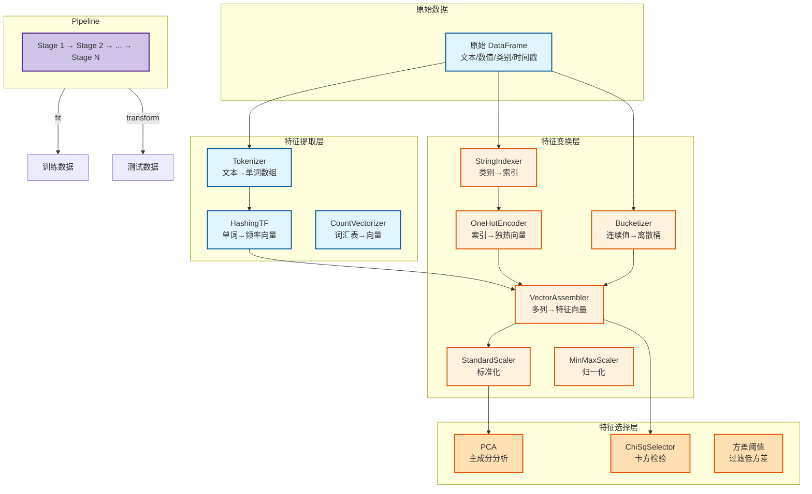
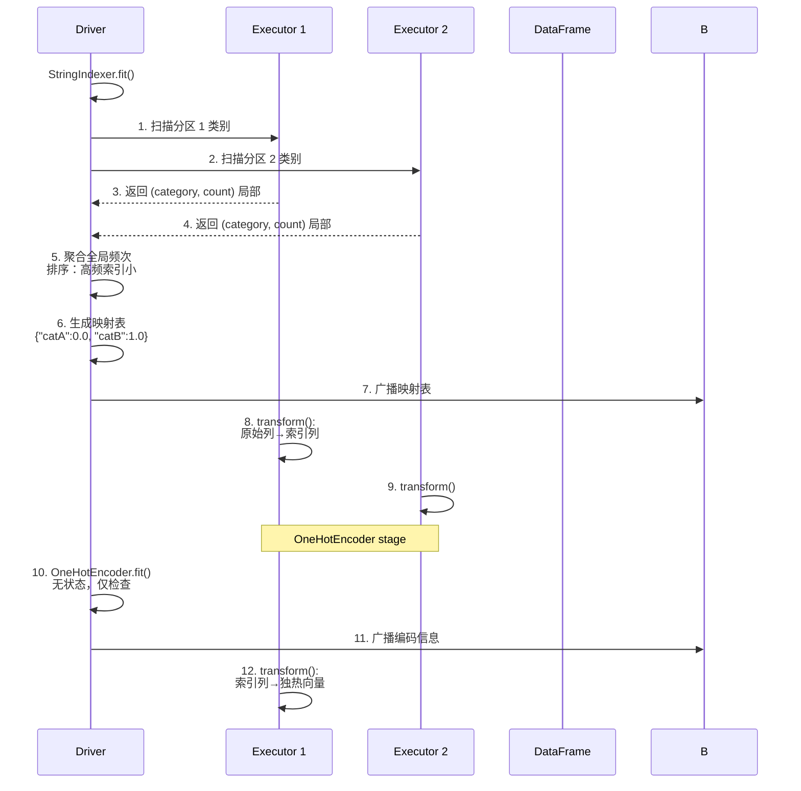
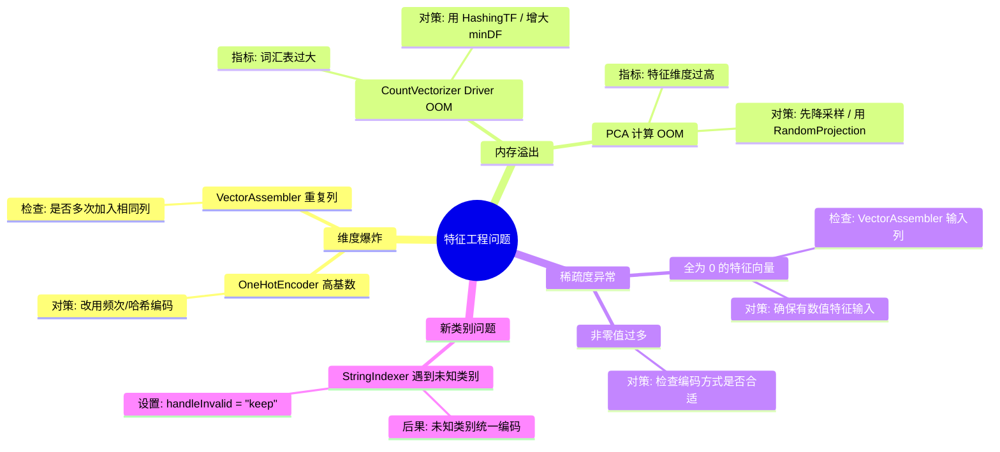

> [!info] 摘要  
> 特征工程在 Spark MLlib 中并非零散的“数据处理步骤”，而是一套**以 Transformer 为核心、可嵌入 Pipeline 的标准化组件体系**。它将特征处理分为三个层次：**提取**（从原始数据构造特征）、**变换**（对特征进行缩放/编码）、**选择**（筛选有效特征）。本文从“如何将非结构化文本/时间戳高效转换为数值向量”这一核心问题切入，深度解析 Spark 内置的 `Tokenizer`、`VectorAssembler`、`StandardScaler` 等组件的实现原理，以及 **PCA**、**ChiSqSelector** 等选择算法的分布式计算策略。通过源码级拆解 `StringIndexer` 的频次统计、`HashingTF` 的哈希碰撞处理、以及 `ChiSqSelector` 的卡方统计量计算，还原一次完整的特征工程 Pipeline 执行路径。结合生产案例，提供高基数列编码陷阱、PCA 内存溢出、Pipeline 持久化版本兼容等典型问题排查方案。最后，在 2026 年特征存储（Feast）与在线特征服务普及的背景下，讨论 Spark 特征工程从“批处理”向“批流一体”演进的方向。

---

## 一、核心概念与底层图景

### 1.1 定义

> [!quote] 工程定义  
> **Spark 特征工程**是基于 `Transformer` 抽象的可复用特征处理组件集合，涵盖：
> - **特征提取**：从原始文本/时间戳/JSON 构造数值特征
> - **特征变换**：缩放、归一化、离散化、编码
> - **特征选择**：基于统计或模型筛选重要特征
> 
> 所有组件均实现 `transform()` 方法，可串联为 `Pipeline`，并在训练/推理时保持一致性。

*类比*：特征工程如同**食材处理流水线**——原始农产品（数据）需经过清洗、切配、腌制、调味（变换），最终成为标准化半成品（特征向量），供后厨（模型）烹饪。

### 1.2 架构全景图



> [!note] 交互方向解读  
> - **提取层**：输入多为原始格式，输出为数值或索引数组。  
> - **变换层**：输入/输出均为数值向量，主要改变分布或表示形式。  
> - **选择层**：输入特征向量，输出降维后的特征向量。  
> - **Pipeline 串联**：前一 Stage 的输出列作为后一 Stage 的输入列，中间结果可保留用于调试。

---

## 二、机制原理深度剖析

### 2.1 核心子模块拆解

| 子模块 | 职责 | 设计意图/为何独立 |
|-------|------|------------------|
| **StringIndexer** | 将字符串列映射为 Double 索引（按频次排序） | **类别编码基础**：高频类别索引小，便于后续处理 |
| **IndexToString** | 将索引映射回原始字符串 | **反向转换**：预测结果可读性 |
| **HashingTF** | 使用哈希函数将词语映射到固定长度向量 | **无状态**：无需维护词汇表，适合流式场景 |
| **CountVectorizer** | 构建词汇表，输出词频向量 | **可解释性**：保留词汇表，便于调试 |
| **VectorAssembler** | 将多列数值合并为单一特征向量列 | **统一接口**：ML 算法仅接受 Vector 类型输入 |
| **StandardScaler** | 计算均值/标准差，标准化特征 | **模型收敛必需**：避免大数值特征主导梯度 |
| **PCA** | 主成分分析降维 | **无监督降维**：保留最大方差方向 |
| **ChiSqSelector** | 基于卡方检验选择与标签最相关的特征 | **有监督筛选**：提升模型可解释性 |

> [!tip]- 深度分析：HashingTF vs CountVectorizer  
> **根本权衡**：内存占用 vs 可解释性。  
> - **HashingTF**：使用 `murmur3` 哈希，固定向量大小（`numFeatures`）。  
>   - 优点：无需存储词汇表，适合无限词汇（日志/流数据）。  
>   - 缺点：哈希碰撞导致信息丢失。  
> - **CountVectorizer**：先扫描数据构建词汇表。  
>   - 优点：无碰撞，可查看重要词汇。  
>   - 缺点：词汇表需存储和广播，不适合高频新词。  
> **生产建议**：日志分析用 HashingTF，业务表用 CountVectorizer。

### 2.2 核心流程可视化：**StringIndexer + OneHotEncoder 执行路径**



### 2.3 卡方特征选择算法

```python
# 伪代码：ChiSqSelector 分布式计算
def chiSqSelector(df: DataFrame, labelCol: str, numTopFeatures: int):
    # 1. 收集特征列与标签列
    featureCols = df.columns - [labelCol]
    
    # 2. 对各特征并行计算卡方统计量
    chiSqValues = df.rdd.mapPartitions { partition =>
        for row in partition:
            for col in featureCols:
                # 构建观测频数矩阵
                observed[ row[col] ][ row[label] ] += 1
        emit (col -> observed)
    }.reduceByKey { (a, b) => a + b }  # 按特征聚合
    
    # 3. Driver 计算卡方值
    for col, observed in chiSqValues:
        expected = computeExpected(observed)
        chiSq = sum((o - e)^2 / e)
        pValue = chi2cdf(chiSq, df)
        results[col] = (chiSq, pValue)
    
    # 4. 按卡方值排序，取前 numTopFeatures
    topFeatures = results.sortBy(-_._2[0]).take(numTopFeatures)
    
    return topFeatures
```

> [!warning] 关键决策点  
> - **卡方适用条件**：要求特征与标签均为离散值。连续特征需先分箱。  
> - **P值校正**：多特征选择需考虑多重检验问题（FDR/Bonferroni），MLlib 默认返回原始 P 值，需用户自行校正。  
> - **分布式计算**：各特征并行统计频数，reduce 阶段合并，Driver 仅计算最终卡方值，无瓶颈。

---

## 三、内核/源码级实现

### 3.1 核心数据结构（Scala）

> [!code] StringIndexer 模型存储
```scala
// 路径：mllib/src/main/scala/org/apache/spark/ml/feature/StringIndexer.scala
/**
 * StringIndexer 训练后的模型。
 */
class StringIndexerModel(
    override val uid: String,
    labels: Array[String]  // 按频次排序的类别数组
) extends Model[StringIndexerModel] with StringIndexerBase {
    
    // 类别 → 索引映射表
    private val labelToIndex: Map[String, Double] = 
        labels.zipWithIndex.map { case (label, idx) => 
            (label, idx.toDouble) 
        }.toMap
    
    /**
     * 将字符串列转换为索引列。
     */
    override def transform(dataset: Dataset[_]): DataFrame = {
        val indexer = udf { label: String =>
            labelToIndex.getOrElse(label, labels.length.toDouble) // 未知类别
        }
        dataset.withColumn($(outputCol), indexer(dataset($(inputCol))))
    }
}
```

> [!code] HashingTF 实现（无状态）
```scala
// 路径：mllib/src/main/scala/org/apache/spark/ml/feature/HashingTF.scala
/**
 * 哈希特征变换。
 */
class HashingTF(override val uid: String) extends Transformer {
    
    private var numFeatures: Int = 1 << 18  // 默认 262144
    
    /**
     * 核心转换：将词语列表哈希为稀疏向量。
     */
    override def transform(dataset: Dataset[_]): DataFrame = {
        val hashUDF = udf { terms: Seq[String] =>
            val indices = ArrayBuffer.empty[Int]
            val values = ArrayBuffer.empty[Double]
            
            terms.foreach { term =>
                // murmur3 哈希，取模 numFeatures
                val index = nonNegativeMod(term.hashCode, numFeatures)
                indices += index
                values += 1.0  // 词频计数
            }
            
            // 构建稀疏向量
            Vectors.sparse(numFeatures, indices.toArray, values.toArray)
        }
        
        dataset.withColumn($(outputCol), hashUDF(dataset($(inputCol))))
    }
}
```

> [!code] VectorAssembler 列合并
```scala
// 路径：mllib/src/main/scala/org/apache/spark/ml/feature/VectorAssembler.scala
/**
 * 将多列合并为特征向量。
 */
class VectorAssembler(override val uid: String) extends Transformer {
    
    override def transform(dataset: Dataset[_]): DataFrame = {
        val assembleUDF = udf { row: Row =>
            val indices = ArrayBuffer.empty[Int]
            val values = ArrayBuffer.empty[Double]
            var currentIndex = 0
            
            // 遍历所有输入列
            for (i <- 0 until row.size) {
                row.get(i) match {
                    case v: Double =>
                        indices += currentIndex
                        values += v
                        currentIndex += 1
                    case v: Vector =>
                        // 若为向量，将其元素逐个加入
                        v.foreachActive { (idx, value) =>
                            indices += currentIndex + idx
                            values += value
                        }
                        currentIndex += v.size
                }
            }
            
            Vectors.sparse(currentIndex, indices.toArray, values.toArray)
        }
        
        // 将多列组合为 Row 类型输入
        val assembled = dataset.withColumn(
            $(outputCol), 
            assembleUDF(struct($(inputCols).map(dataset(_)): _*))
        )
        assembled
    }
}
```

> [!bug] 并发模型  
> - **fit() 阶段**：需扫描全数据计算统计量（频次/均值/方差）。此阶段**各分区并行计算局部统计**，Driver 聚合。  
> - **transform() 阶段**：完全并行，各分区独立处理，无 shuffle。  
> - **瓶颈**：`CountVectorizer` 的词汇表构建需收集全部词语至 Driver，词汇量大时 Driver 内存压力大。

---

## 四、生产落地与 SRE 实战

### 4.1 场景化案例：**高基数列 OneHotEncoder 导致特征爆炸**

> [!danger] 现象  
> - 用户画像表，`city` 列有 10 万种不同城市。  
> - 使用 `StringIndexer + OneHotEncoder` 后，特征维度从 50 飙升至 10 万+。  
> - 模型训练 OOM，且 AUC 下降。

> [!check] 排查链路  
> 1. **检查编码后特征维度** → `df.select('city_vec').first()` 显示稀疏向量长度 = 10 万。  
> 2. **检查模型系数** → 逻辑回归对 10 万维特征需学习 10 万系数，过拟合。  
> 3. **根因**：高基数类别不宜独热编码。

> [!success] 解决方案  
> ```python
> # 方案A：使用频次编码
> city_freq = df.groupBy('city').count().collect()
> freq_dict = {row.city: row.count for row in city_freq}
> freq_udf = udf(lambda x: float(freq_dict.get(x, 0)))
> df = df.withColumn('city_freq', freq_udf('city'))
> 
> # 方案B：哈希技巧（HashingTF + 降维）
> from pyspark.ml.feature import HashingTF
> hashingTF = HashingTF(inputCol='city_words', outputCol='city_hash', numFeatures=1000)
> 
> # 方案C：目标编码（Target Encoding） - 需注意过拟合
> # 需交叉验证或添加平滑
> ```

> [!done] 验证  
> 特征维度降至 1000，AUC 提升 5%，训练时间减少 70%。

### 4.2 参数调优矩阵

| 参数名 | 组件 | 推荐值 | 内核解释 |
|--------|------|--------|---------|
| `numFeatures` | HashingTF | 2^18 = 262144 | 特征维度，调大减少碰撞，增加内存 |
| `minDF` | CountVectorizer | 2 | 词语最小文档频次，过滤罕见词 |
| `maxCategories` | StringIndexer | 20 | 自动判断是否为分类列时，类别数阈值 |
| `withMean` / `withStd` | StandardScaler | `true` / `true` | 是否中心化/标准化，对 SVM/回归必要 |
| `k` | PCA | 保留方差 95% | 降维维度，可用 `explainedVariance` 选择 |
| `numTopFeatures` | ChiSqSelector | 20-200 | 保留特征数，依模型复杂度定 |
| `handleInvalid` | StringIndexer | `skip` / `keep` | 测试集出现新类别时的处理策略 |

### 4.3 监控与诊断

> [!info] 关键指标（特征工程阶段）

| 指标名 | 健康区间 | 瓶颈阈值 | 含义 |
|--------|----------|----------|------|
| `StringIndexer 类别数` | < 1000 | > 10000 | 高基数告警 |
| `特征向量平均非零值` | < 100 | > 1000 | 稀疏度下降，可能编码方式不当 |
| `HashingTF 碰撞率` | < 1% | > 5% | `numFeatures` 太小，需调大 |
| `PCA 解释方差比` | > 0.95 | < 0.8 | 降维后信息损失大，需增 k |

> [!example] 诊断命令  
> ```python
> # 查看编码后稀疏度
> df.select('features').rdd.map(lambda x: x[0].numNonzeros()).stats()
> 
> # 检查 StringIndexer 类别分布
> df.groupBy('indexed_city').count().orderBy('count', ascending=False).show(10)
> 
> # PCA 解释方差
> pcaModel.explainedVariance.sum()
> ```

### 4.4 故障排查决策树



---

## 五、技术演进与未来视角（2026+）

### 5.1 历史设计约束与改进

| 版本 | 变化 | 动因/解决的问题 |
|------|------|----------------|
| Spark 1.2 (2014) | **特征工程组件初版** | `StringIndexer`、`VectorAssembler` 等基础组件 |
| Spark 1.6 (2016) | **Pipeline API 成熟** | 支持特征工程与模型串联 |
| Spark 2.0 (2016) | **基于 DataFrame 重构** | 统一 API，利用 Tungsten 优化 |
| Spark 2.3 (2018) | **Imputer 引入** | 缺失值填充组件 |
| Spark 3.0 (2020) | **FeatureHasher 引入** | 在线学习友好的哈希特征 |
| Spark 3.4 (2023) | **RFormula 增强** | R 风格公式解析，支持交互项 |

### 5.2 2026 年仍存在的“遗留设计”

> [!bug] 痛点1：特征工程与模型训练分离  
> Pipeline 虽能串联，但**特征工程仍独立于模型优化**，无法在调参时自动调整特征处理（如分箱数）。  
> **现状**：需手动搜索或借助第三方库（如 Featuretools）。

> [!bug] 痛点2：在线推理特征不一致  
> 训练时用 `StringIndexer` 生成映射表，在线服务需重新实现相同逻辑。  
> **社区方案**：`PipelineModel.save` 保存所有元数据，Java/Python 端均可加载，但引入 MLlib 依赖。

> [!bug] 痛点3：时间序列特征缺失  
> Spark MLlib 无原生滞后特征、滑动窗口生成器，需用户用 SQL/窗口函数手动实现。

### 5.3 未来趋势

- **特征存储（Feature Store）集成**：  
  Spark 特征工程组件可直接读写 Feast/Hopsworks，实现**训练-推理特征一致性**。
- **自动特征工程**：  
  基于遗传算法/深度学习的自动特征生成（如 OpenFE）与 Spark 集成，在分布式环境下搜索有效特征。
- **在线特征计算**：  
  Spark Structured Streaming 与特征工程组件结合，实现**实时特征更新**（如实时计算用户过去 5 分钟点击率）。

> [!quote] 十年后的 Spark 特征工程  
> 它将不再是一组孤立的 Transformer，而是**特征生命周期管理平台的一部分**。从特征定义、计算、存储到监控，Spark 承担“批处理计算引擎”角色。但它的设计哲学——**可组合、可复用、Pipeline 化**——将影响所有后续特征工程工具。

---

## 参考文献
- 源码路径：`mllib/src/main/scala/org/apache/spark/ml/feature/`
- 官方文档：[Feature Extractors, Transformers, and Selectors](https://spark.apache.org/docs/latest/ml-features.html)
- 相关 JIRA：SPARK-14712（FeatureHasher），SPARK-23336（Imputer）
- 设计文档：[MLlib Pipeline Design](https://spark.apache.org/docs/latest/ml-pipeline.html)