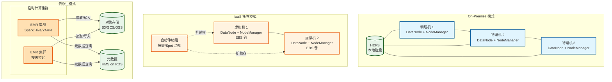
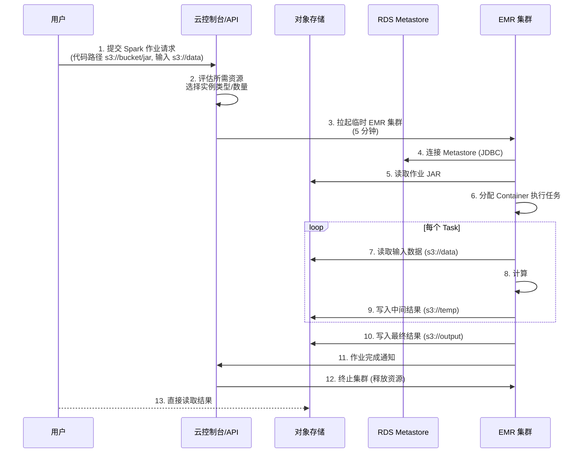
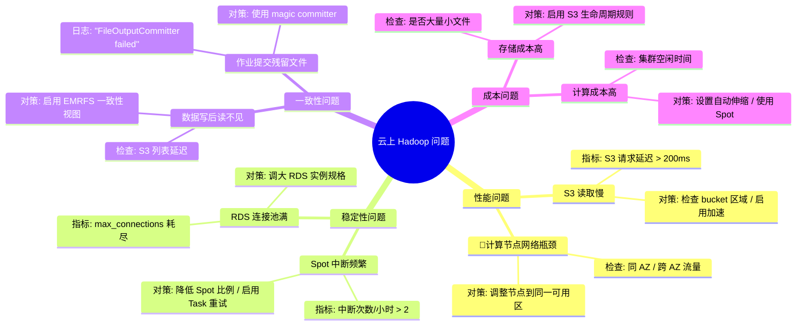

> [!info] 摘要  
> Hadoop 的云部署并非简单的“物理机→虚拟机”迁移，而是一场**从资源视角（机器/磁盘）向服务视角（API/SLA）的范式转移**。本文将云部署模式划分为**三代演进**：第一代**On-Premise**（物理机固定容量）、第二代**IaaS 托管**（EC2/VM 弹性伸缩）、第三代**云原生服务**（EMR/HDInsight/Dataproc + 对象存储分离）。核心矛盾在于：**如何在不重构应用的前提下，让 Hadoop 适配云的弹性、存算分离与按需付费模型**。本文从“HDFS 在对象存储上能否保证一致性”这一根本问题切入，深度解析 **S3A 文件系统的实现妥协**、**存算分离架构下的数据本地性失效**、以及 **Spot 实例的容错设计**。通过源码级拆解 S3A `rename()` 的原子性缺失、EMR 的自动伸缩算法、以及 YARN 在云环境下的节点标签策略，还原一次云上 Spark 作业从提交到执行的全新路径。结合生产案例，提供云上小文件治理、Spot 实例中断处理、跨云数据同步等典型问题排查方案。最后，在 2026 年 Serverless Spark 普及的背景下，讨论 Hadoop 从“部署模式”向“计算引擎”的角色收敛。

---

## 一、核心概念与底层图景

### 1.1 定义

> [!quote] 工程定义  
> **Hadoop 云部署模式**指在公有云/私有云基础设施上运行 Hadoop 生态组件的方式，分为三类：
> - **On-Premise**：自有机房，物理机固定容量，HDFS 本地存储
> - **IaaS 托管**：云上虚拟机，可手动扩缩容，HDFS 可使用云盘（EBS/PD）
> - **云原生服务**：托管 Hadoop 服务（EMR/HDInsight）+ 对象存储（S3/GCS/OSS）分离，计算与存储独立伸缩

*类比*：Hadoop 部署模式演进如同**搬家**——On-Premise 是自建房（全权负责水电煤），IaaS 托管是租公寓（灵活但家具自备），云原生服务是住酒店（按需使用，拎包入住）。

### 1.2 架构全景图



> [!note] 交互方向解读  
> - **On-Premise**：计算与存储紧耦合，数据本地性是性能核心。  
> - **IaaS 托管**：可挂载云盘，但仍需维护 HDFS 副本，存储成本高。  
> - **云原生模式**：数据持久化于对象存储，计算集群无状态，可随时销毁。**HDFS 被 S3A 文件系统取代**。  
> - **元数据服务**：HMS 成为独立 RDS 实例，与计算集群解耦。

---

## 二、机制原理深度剖析

### 2.1 核心子模块拆解

| 子模块 | On-Premise | IaaS 托管 | 云原生模式 |
|--------|------------|-----------|------------|
| **存储** | HDFS 本地磁盘 | HDFS 云盘 (EBS) | 对象存储 (S3/GCS) |
| **一致性** | 强一致性 (NameNode) | 强一致性 (EBS 快照) | 最终一致性 (S3) |
| **数据本地性** | 计算与存储同节点 | 同可用区 (AZ) | 无本地性，拉取数据 |
| **伸缩方式** | 物理扩容（周级） | 虚拟机扩缩容（小时级） | 按需拉起集群（分钟级） |
| **成本模型** | CAPEX 固定 | OPEX 按需 + 预留实例 | 纯 OPEX，计算存储分离计费 |
| **容错单元** | 磁盘/节点故障 | 虚拟机故障 | Spot 实例中断 |

> [!tip]- 深度分析：为什么对象存储最终一致性对 Hadoop 是挑战？  
> **根本原因**：Hadoop 假设文件写入后立即可见。  
> - **HDFS**：`close()` 成功后，所有副本确认，后续读必然可见。  
> - **S3**：`PUT` 成功后返回 200，但**列表操作可能延迟**，新文件在 list 中可能缺失。  
> - **后果**：`FileOutputFormat` 提交时需确保文件列表完整，否则任务失败。  
> - **解决方案**：  
>   - **S3A 的 `strict` 模式**：调用 S3 的 `listObjects` 直到文件出现（轮询）。  
>   - **EMRFS 一致性视图**：DynamoDB 记录文件元数据，保证列表强一致。

### 2.2 核心流程可视化：**云原生 Spark 作业生命周期**



### 2.3 S3A `rename()` 的实现陷阱

```java
// 路径：hadoop-tools/hadoop-aws/src/main/java/org/apache/hadoop/fs/s3a/S3AFileSystem.java
/**
 * S3A 的 rename 操作 - 伪代码。
 * S3 无原生 rename，需 copy + delete。
 */
public boolean rename(Path src, Path dst) {
    // 1. 列出源目录所有文件
    FileStatus[] files = listStatus(src);
    
    // 2. 对每个文件执行 copy + delete
    for (FileStatus file : files) {
        Path srcFile = file.getPath();
        Path dstFile = new Path(dst, srcFile.getName());
        
        // copy 操作 (S3 服务端复制)
        copyFile(srcFile, dstFile);
        
        // 若 copy 成功，删除源文件
        delete(srcFile, false);
    }
    
    // 3. 删除空源目录
    delete(src, true);
    
    // 问题：若中间步骤失败，部分文件已 copy，部分未 copy，状态不一致
    return true;  // 实际可能部分成功
}
```

> [!warning] 关键决策点  
> - **S3A rename 非原子性**：作业提交时 `FileOutputCommitter` 依赖 rename 实现原子提交，在 S3 上可能产生残留数据。  
> - **解决方案**：使用 **EMRFS 的 `OutputCommitter`** 或 **S3A 的 `magic` 提交器**，避免 rename。  
> - **Spot 实例中断**：云原生模式常混用 Spot 实例降低成本，需设置任务级容错（checkpoint + 重试）。

---

## 三、内核/源码级实现

### 3.1 S3A 文件系统核心配置

```xml
<!-- core-site.xml 中的 S3A 配置 -->
<property>
  <name>fs.s3a.impl</name>
  <value>org.apache.hadoop.fs.s3a.S3AFileSystem</value>
</property>

<property>
  <name>fs.s3a.endpoint</name>
  <value>s3.cn-north-1.amazonaws.com.cn</value>  <!-- 国内区域 -->
</property>

<!-- 一致性相关配置 -->
<property>
  <name>fs.s3a.multiobjectdelete.enable</name>
  <value>true</value>
</property>

<!-- 性能优化 -->
<property>
  <name>fs.s3a.connection.maximum</name>
  <value>100</value>  <!-- 连接池大小 -->
</property>

<property>
  <name>fs.s3a.fast.upload.buffer</name>
  <value>bytebuffer</value>  <!-- 堆外内存缓冲 -->
</property>
```

### 3.2 EMR 自动伸缩算法伪代码

```python
# 路径：EMR 自动伸缩逻辑（简化）
class EMRScalePolicy:
    def decide(self, metrics):
        # 指标：YARN 待处理任务数 pending_containers
        pending = metrics['pending_containers']
        current_nodes = metrics['current_nodes']
        
        # 扩容条件
        if pending > current_nodes * 2:
            scale_out_by = min(10, pending // 5)  # 每次最多加 10 节点
            return Action.SCALE_OUT, scale_out_by
        
        # 缩容条件：检查节点利用率
        if metrics['average_utilization'] < 0.3 and current_nodes > self.min_nodes:
            # 检查是否有长时间低负载
            if metrics['low_load_duration'] > 30 * 60:  # 30 分钟
                return Action.SCALE_IN, 1  # 每次缩 1 节点
        
        return Action.NOOP
```

### 3.3 云原生 HMS 部署（RDS）

```sql
-- 云环境下 Hive Metastore 使用 RDS 作为后端
-- 连接池配置需适配云数据库

-- hive-site.xml
<property>
  <name>javax.jdo.option.ConnectionURL</name>
  <value>jdbc:mysql://hms-rds.c9akc0k0xxxx.rds.cn-north-1.amazonaws.com.cn:3306/hive</value>
</property>

<property>
  <name>javax.jdo.option.ConnectionDriverName</name>
  <value>com.mysql.cj.jdbc.Driver</value>
</property>

-- RDS 侧需调整：
-- max_connections = 300 （根据并发）
-- wait_timeout = 600 （避免空闲连接耗尽）
```

> [!bug] 并发模型  
> - **S3A 客户端**：使用连接池复用 HTTP 连接，每个 Executor 持有独立客户端。  
> - **EMR 自动伸缩**：由云控制面服务决策，YARN ResourceManager 仅上报指标。  
> - **元数据访问**：HMS 连接 RDS，RDS 连接数成为新瓶颈。

---

## 四、生产落地与 SRE 实战

### 4.1 场景化案例：**Spot 实例中断导致作业频繁失败**

> [!danger] 现象  
> - 云上 EMR 集群混部 On-Demand 和 Spot 实例（比例 1:3）。  
> - Spot 实例被回收时，作业出现大量 Task 失败。  
> - 失败 Task 重试后成功，但整体作业耗时延长 50%。

> [!check] 排查链路  
> 1. **检查 Spot 中断频率** → 云控制台显示 Spot 平均每小时中断 2 次。  
> 2. **查看任务失败日志** → `Container killed by YARN for exceeding memory limits` 非真实原因，实为 NM 进程被终止。  
> 3. **根因**：Spot 回收时 YARN NodeManager 被强制停止，运行中的 Task 全部失败。

> [!success] 解决方案  
> ```scala
> // 方案A：启用 Task 重试 + 预测执行
> spark.conf.set("spark.task.maxFailures", "8")
> spark.conf.set("spark.speculation", "true")
> 
> // 方案B：使用 checkpoint 中间结果
> streamingDf.checkpoint("s3://bucket/checkpoint/")
> 
> // 方案C：Spot 实例仅用于 Task 节点，Master/AM 使用 On-Demand
> -- EMR 配置：master-instance-group=ON_DEMAND
> --          core-instance-group=SPOT
> ```

> [!done] 验证  
> 作业耗时从 60 分钟降至 45 分钟（仍比纯 On-Demand 多 20%），成本降低 50%。

### 4.2 参数调优矩阵

| 参数名 | 适用模式 | 推荐值 | 内核解释 |
|--------|----------|--------|---------|
| `fs.s3a.fast.upload.buffer` | 云原生 | `bytebuffer` | 堆外缓冲，减少 GC |
| `fs.s3a.connection.maximum` | 云原生 | `100-200` | S3 连接池大小，调高增加并发 |
| `fs.s3a.attempts.maximum` | 云原生 | `20` | S3 请求重试次数，应对限流 |
| `yarn.nodemanager.lost-resource.recovery.enabled` | IaaS | `true` | NM 重启后恢复容器 |
| `spark.sql.adaptive.enabled` | 所有模式 | `true` | 动态合并分区，减少小文件 |
| `spark.hadoop.mapreduce.fileoutputcommitter.algorithm.version` | 云原生 | `2` | 使用新版提交器，避免 rename |
| `spark.sql.hive.metastore.jars` | 云原生 | `path/to/hive/jars` | 避免每次拉取 Hive JAR |

### 4.3 监控与诊断

> [!info] 关键指标

| 指标名         | 来源         | 健康区间      | 含义                  |
| ----------- | ---------- | --------- | ------------------- |
| `S3 请求延迟`   | CloudWatch | < 100ms   | 对象存储延迟，过高需查 S3 限流   |
| `Spot 中断次数` | 云事件        | 0         | 每小时中断次数，>2 需调整混部策略  |
| `RDS 连接数`   | RDS 监控     | < 80% max | HMS 连接池使用率          |
| `Task 失败率`  | Spark UI   | < 1%      | >5% 可能 Spot 中断或节点故障 |

> [!example] 诊断命令  
> ```bash
> # 查看 S3 请求详情（AWS CLI）
> aws s3api get-bucket-metrics-configuration --bucket my-bucket
> 
> # EMR 日志聚合
> yarn logs -applicationId application_xxx -log_files stderr
> 
> # 测试 S3 吞吐
> spark.sql("SELECT COUNT(*) FROM table").explain()
> ```

### 4.4 故障排查决策树



---

## 五、技术演进与未来视角（2026+）

### 5.1 历史设计约束与改进

| 阶段 | 时间 | 变化 | 动因 |
|------|------|------|------|
| On-Premise | 2006-2014 | Hadoop 原生部署 | 企业自建数据中心 |
| IaaS 托管 | 2012-2018 | 虚拟机 + 云盘 | 云厂商提供基础设施 |
| EMR/HDInsight | 2014-2020 | 托管 Hadoop 服务 | 简化运维，按需付费 |
| Serverless Spark | 2020-至今 | 无集群概念，按查询计费 | 极致弹性，数据湖集成 |

### 5.2 2026 年仍存在的“遗留设计”

> [!bug] 痛点1：HDFS 思维惯性  
> 团队在云上仍追求“数据本地性”，花费大量精力优化调度亲和性，而 S3 读取网络开销仅占作业总时间 10-20%。

> [!bug] 痛点2：小文件问题  
> 对象存储对小文件不友好，但 Hadoop 传统习惯生成大量小文件。  
> **对策**：强制设置 `spark.sql.files.maxPartitionBytes` 和合并输出。

> [!bug] 痛点3：元数据服务单点  
> HMS 在云上仍是 RDS，连接数、性能均受限，云厂商原生目录服务（AWS Glue Catalog）仍未完全兼容。

### 5.3 未来趋势

- **Serverless Spark**：  
  AWS Athena for Spark、Google Cloud Serverless Spark 无集群概念，作业直接运行，秒级计费。
- **湖仓一体**：  
  Iceberg/Paimon 作为存储格式，Hadoop 仅作为“计算引擎”存在，不再部署完整 HDFS。
- **混合云联邦**：  
  单个 Spark 作业跨云读取数据（S3 + GCS + OSS），统一目录服务（如 Unity Catalog）。

> [!quote] 十年后的 Hadoop 部署  
> 它将不再作为一个“分布式系统”被部署，而是作为一套 API 和计算引擎嵌入云原生服务。HDFS 会像磁带机一样罕见，但 Hadoop 的设计哲学——数据本地性、容错性、可扩展性——已融入所有云数据服务。当你用 Athena 查询数据时，你已在使用 Hadoop 的遗产。

---

## 参考文献
- 源码路径（S3A）：`hadoop-tools/hadoop-aws/src/main/java/org/apache/hadoop/fs/s3a/`
- 官方文档：[AWS EMR Documentation](https://docs.aws.amazon.com/emr/)，[Azure HDInsight](https://docs.microsoft.com/azure/hdinsight/)，[Google Cloud Dataproc](https://cloud.google.com/dataproc)
- 相关论文：Vavilapalli, V. K., et al. (2013). "Apache Hadoop YARN: Yet Another Resource Negotiator." SoCC.