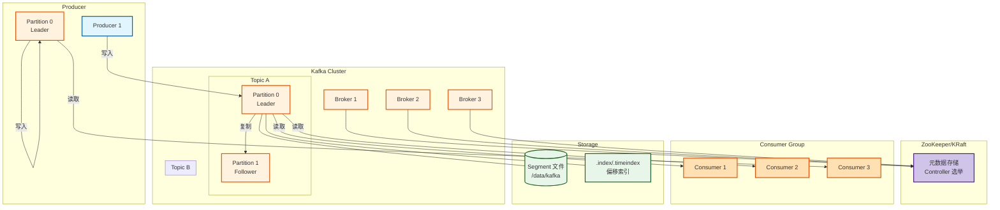
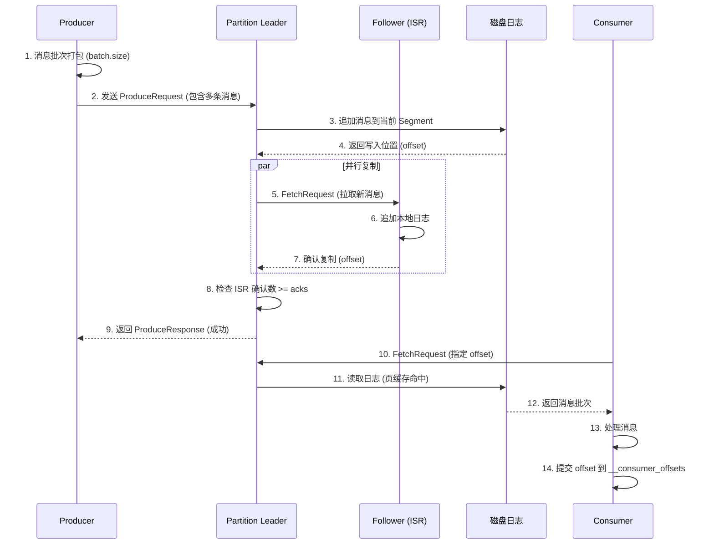
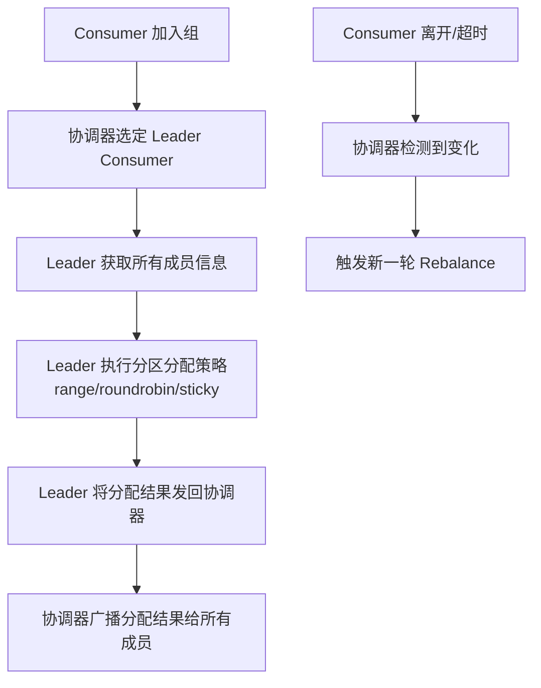
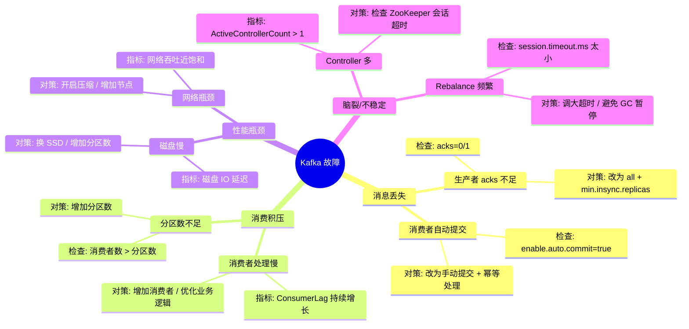

> [!info] 摘要  
> Kafka 并非传统的消息队列，而是一套**以不可变日志为核心、以分区为并行单元的分布式流平台**。它的核心抽象是**发布-订阅日志**，而非点对点队列。本文从“如何在机械硬盘上实现百万级吞吐”这一反直觉的设计切入点，深度解析 Kafka 的**零拷贝传输**、**页缓存依赖**、**顺序写入**三大基石。通过源码级拆解生产者端的**批量发送与压缩**、Broker 端的**分段日志存储**、消费者端的**重平衡协议**，还原一条消息从生产到消费的完整生命周期。结合生产案例，提供消息丢失场景排查、消费积压处理、分区再均衡抖动等典型问题解决方案。最后，在 2026 年 Pulsar 分层架构与 Kafka 对垒的背景下，讨论 Kafka 在流批一体生态中的**数据管道中枢**定位。

---

## 一、核心概念与底层图景

### 1.1 定义

> [!quote] 工程定义  
> **Apache Kafka** 是一个**分布式、分区化、多副本的提交日志服务**。它以 Topic 为单位组织数据，每个 Topic 划分为多个 Partition，Partition 内消息以追加方式顺序写入，消费者通过维护偏移量（Offset）实现重读和回溯。

*类比*：Kafka 如同**大型商场的统一收银台**——每个收银台（Partition）只有一列队伍，新顾客（消息）只能排在队尾，收银员（消费者）按顺序叫号，且可以随时记住自己叫到几号（Offset）下次继续。

### 1.2 架构全景图



> [!note] 交互方向解读  
> - **写入路径**：Producer 直接与 Partition Leader 通信，消息追加到 Leader 的本地日志。  
> - **复制路径**：Follower 从 Leader 拉取消息，保持与 Leader 的偏移同步。  
> - **读取路径**：Consumer 从 Leader（或 Follower）拉取消息，提交偏移量到内部 Topic `__consumer_offsets`。  
> - **元数据**：Broker 注册信息、Topic 配置、Leader 选举由 ZooKeeper（或 KRaft）管理。

---

## 二、机制原理深度剖析

### 2.1 核心子模块拆解

| 子模块 | 职责 | 设计意图/为何独立 |
|-------|------|------------------|
| **Producer 发送器** | 消息批次打包、压缩、发送 | **攒批发送**：减少网络往返，提升吞吐 |
| **Partition Leader** | 处理读写请求，维护 ISR（同步副本） | **单点写入**：保证分区内顺序一致性 |
| **日志分段** | 将 Partition 切分为多个 Segment 文件 | **回收与索引**：便于删除过期数据，建立偏移映射 |
| **偏移索引** | 偏移量→物理位置的映射 | **快速定位**：二分查找 + 稀疏索引，O(logN) 跳转 |
| **消费者协调器** | 管理 Consumer Group 成员与分区分配 | **负载均衡**：成员变化时触发 Rebalance |
| **页缓存依赖** | 利用 OS Page Cache 缓存消息 | **零拷贝**：避免 JVM 堆内存与 GC 开销 |

> [!tip]- 深度分析：为什么 Kafka 在机械硬盘上也能达到百万级吞吐？  
> **根本原因**：**顺序 I/O + 页缓存**。  
> - **传统消息队列**：随机读（消费者各自读不同位置），磁盘瓶颈。  
> - **Kafka 设计**：写入全是追加（顺序写）；读取时数据已被页缓存预热，直接从内存返回。  
> - **零拷贝**：使用 `sendfile` 系统调用，数据从页缓存直接发送到网卡，不经过 JVM 内存。  
> - **结论**：吞吐量与磁盘转速解耦，主要受网络带宽限制。

### 2.2 核心流程可视化：**消息生产到消费全链路**



### 2.3 重平衡（Rebalance）协议



> [!warning] 关键决策点  
> - **ISR 机制**：只有 ISR（In-Sync Replica）中的副本才可能成为 Leader。`min.insync.replicas` 决定最小同步副本数。  
> - **acks 级别**：  
>   - `acks=0`：发后即忘（可能丢）  
>   - `acks=1`：Leader 确认（Leader 宕机可能丢）  
>   - `acks=all`：所有 ISR 确认（最强持久性）  
> - **Rebalance 代价**：所有 Consumer 暂停消费，重新分配分区，**大集群 Rebalance 可能导致分钟级不可用**。

---

## 三、内核/源码级实现

### 3.1 核心数据结构（Java）

> [!code] 日志分段（LogSegment）
```java
// 路径：core/src/main/scala/kafka/log/LogSegment.scala
/**
 * Kafka 日志分段。
 * 每个分段包含一个 .log 文件（消息数据）和 .index（偏移索引）文件。
 */
class LogSegment(
    val log: FileRecords,           // 消息数据文件
    val lazyOffsetIndex: OffsetIndex, // 偏移索引 (稀疏)
    val lazyTimeIndex: TimeIndex,    // 时间戳索引
    val baseOffset: Long,            // 该分段最小偏移量
    val indexIntervalBytes: Int,      // 索引间隔 (默认 4KB)
    val rollJitterMs: Long
) {
    
    /**
     * 追加消息批次。
     */
    def append(
        largestOffset: Long,
        largestTimestamp: Long,
        shallowOffsetOfMaxTimestamp: Long,
        records: MemoryRecords
    ): Unit = {
        // 1. 写入 .log 文件
        val physicalPosition = log.sizeInBytes()
        log.append(records)
        
        // 2. 判断是否需写入索引
        if (bytesSinceLastIndexEntry > indexIntervalBytes) {
            offsetIndex.append(largestOffset, physicalPosition)
            timeIndex.maybeAppend(timestamp, baseOffset)
            bytesSinceLastIndexEntry = 0
        }
        bytesSinceLastIndexEntry += records.sizeInBytes()
    }
    
    /**
     * 根据偏移量读取消息。
     */
    def read(
        startOffset: Long,
        maxSize: Int,
        maxPosition: Long = Long.MaxValue
    ): FetchDataInfo = {
        // 1. 二分查找索引，获取近似物理位置
        val (startOffset, startPosition) = offsetIndex.lookup(startOffset)
        
        // 2. 从物理位置读取消息
        val fileRecords = log.slice(startPosition, maxSize)
        FetchDataInfo(fileRecords, startOffset)
    }
}
```

> [!code] 生产者批量发送（RecordAccumulator）
```java
// 路径：clients/src/main/java/org/apache/kafka/clients/producer/internals/RecordAccumulator.java
/**
 * 生产者端的消息累加器。
 * 按分区攒批，达到 batch.size 或 linger.ms 触发发送。
 */
public final class RecordAccumulator {
    
    private final ConcurrentMap<TopicPartition, Deque<ProducerBatch>> batches;
    
    /**
     * 追加单条消息到对应分区的批次。
     */
    public RecordAppendResult append(
        TopicPartition tp,
        long timestamp,
        byte[] key,
        byte[] value,
        Callback callback,
        long maxTimeToBlockMs
    ) throws InterruptedException {
        Deque<ProducerBatch> dq = getOrCreateDeque(tp);
        synchronized (dq) {
            // 尝试追加到现有批次
            ProducerBatch last = dq.peekLast();
            if (last != null && last.attemptAppend(timestamp, key, value, callback)) {
                return new RecordAppendResult(null, false, false);
            }
        }
        
        // 创建新批次
        int size = Math.max(this.batchSize, Records.LOG_OVERHEAD + Record.recordSize(key, value));
        ByteBuffer buffer = free.allocate(size, maxTimeToBlockMs);
        ProducerBatch batch = new ProducerBatch(tp, buffer, now);
        batch.tryAppend(timestamp, key, value, callback);
        dq.add(batch);
        
        // 判断是否达到发送条件
        boolean full = dq.size() > 1 || batch.estimatedSizeInBytes() > batchSize;
        return new RecordAppendResult(batch, full, false);
    }
}
```

> [!code] 消费者重平衡协议（核心逻辑）
```java
// 路径：clients/src/main/java/org/apache/kafka/clients/consumer/internals/ConsumerCoordinator.java
/**
 * 消费者协调器。
 */
public class ConsumerCoordinator {
    
    /**
     * 加入组请求。
     */
    private JoinGroupResult sendJoinGroupRequest() {
        JoinGroupRequest.Builder builder = new JoinGroupRequest.Builder(
            groupId,
            sessionTimeout,
            rebalanceTimeout,
            groupInstanceId,
            "consumer",  // 协议类型
            metadataList  // 订阅信息
        );
        
        // 阻塞等待响应
        JoinGroupResponse response = client.send(request).await();
        
        if (response.isLeader()) {
            // 当前 Consumer 被选为 Leader
            Map<String, ByteBuffer> assignment = assignPartitions(response.members());
            sendSyncGroupRequest(assignment);
        } else {
            // 普通成员等待分配结果
            sendSyncGroupRequest(Collections.emptyMap());
        }
        
        return response;
    }
}
```

> [!bug] 并发模型  
> - **Producer**：单个 Sender 线程从队列取批次发送，多个分区共享。  
> - **Broker**：每个请求由单独的 Processor 线程处理（Java NIO），每个分区同一时刻只有一个写入。  
> - **Consumer**：单线程拉取 + 心跳线程，处理 Rebalance 时暂停拉取。  
> - **3.x 改进**：KRaft 模式移除 ZooKeeper，Controller 集成在 Broker 中，减少元数据访问延迟。

---

## 四、生产落地与 SRE 实战

### 4.1 场景化案例：**消息丢失——acks=1 + Leader 宕机**

> [!danger] 现象  
> - 某金融系统使用 Kafka 传输交易流水。  
> - Broker 3 节点集群，某日单节点断电重启。  
> - 恢复后发现部分消息丢失，消费者从未收到。

> [!check] 排查链路  
> 1. **检查生产者配置** → `acks=1`（默认），Producer 认为成功即 Leader 写入完成。  
> 2. **查看 ISR 状态** → 宕机节点当时是 Leader，且只有自己 ISR？`min.insync.replicas=1`。  
> 3. **根因**：Leader 写入成功返回 ACK，但消息未复制到 Follower；Leader 宕机后新 Leader 无此消息。

> [!success] 解决方案  
> ```java
> // 方案A：提高持久性级别
> props.put("acks", "all");
> props.put("min.insync.replicas", "2");  // 至少 2 个副本确认
> 
> // 方案B：启用幂等生产者（也需 acks=all）
> props.put("enable.idempotence", "true");
> 
> // 方案C：同步发送（慎用，影响吞吐）
> producer.send(record).get();
> ```

> [!done] 验证  
> 再次模拟节点宕机，消息无丢失。

### 4.2 参数调优矩阵

| 参数名 | 作用域 | 推荐值 | 内核解释 |
|--------|--------|--------|---------|
| `num.partitions` | Topic | 3 × 期望吞吐量/单分区吞吐 | 分区数 = 并行度上限 |
| `replication.factor` | Topic | 3 | 副本数，容忍 1 节点故障 |
| `min.insync.replicas` | Topic/Broker | 2 | 最小同步副本数，配合 acks=all |
| `acks` | Producer | `all` | 持久性最强 |
| `compression.type` | Producer | `snappy` / `zstd` | 压缩算法，CPU 换带宽 |
| `linger.ms` | Producer | 5-10 | 等待攒批时间，吞吐↑延迟↑ |
| `batch.size` | Producer | 32KB-64KB | 批次大小，过大浪费内存 |
| `max.poll.records` | Consumer | 500 | 单次拉取最大记录数，调大增加吞吐 |
| `session.timeout.ms` | Consumer | 10000 | 心跳超时，调小加速故障检测 |
| `auto.offset.reset` | Consumer | `earliest` / `latest` | 无 offset 时的策略 |

### 4.3 监控与诊断

> [!info] 关键指标（JMX / Kafka Exporter）

| 指标名 | 健康区间 | 瓶颈阈值 | 含义 |
|--------|----------|----------|------|
| `UnderReplicatedPartitions` | 0 | >0 | 分区副本数不足，需检查故障节点 |
| `ActiveControllerCount` | 1 | >1 | 多 Controller 同时存在，脑裂 |
| `MessagesInPerSec` | 稳定 | 突降/突升 | 流量变化预警 |
| `TotalTimeMs` (produce) | < 10ms | > 100ms | 写入延迟高，可能磁盘慢 |
| `ConsumerLag` | 接近0 | 持续增长 | 消费者处理不过来 |

> [!example] 诊断命令  
> ```bash
> # 查看 Topic 分区详情
> kafka-topics.sh --describe --topic my-topic --bootstrap-server localhost:9092
> 
> # 查看消费者组状态
> kafka-consumer-groups.sh --group my-group --describe --bootstrap-server localhost:9092
> 
> # 查看 ISR 状态
> kafka-replica-verification.sh --broker-list localhost:9092
> 
> # 查看日志文件内容
> kafka-run-class.sh kafka.tools.DumpLogSegments --files /data/kafka/topic-0/000000000000.log
> ```

### 4.4 故障排查决策树



---

## 五、技术演进与未来视角（2026+）

### 5.1 历史设计约束与改进

| 版本 | 变化 | 动因/解决的问题 |
|------|------|----------------|
| 0.8 (2013) | **复制机制引入** | 解决单点故障 |
| 0.9 (2015) | **新消费者 API + 安全性** | 弃用 Scala 消费者，统一 API |
| 1.0 (2017) | **Kafka Streams 发布** | 流处理能力内置 |
| 2.0 (2018) | **Exactly-Once 语义** | 事务支持，幂等生产者 |
| 2.8 (2021) | **KRaft 模式预览** | 移除 ZooKeeper 依赖 |
| 3.0 (2021) | **KRaft 生产就绪** | 简化元数据管理 |

### 5.2 2026 年仍存在的“遗留设计”

> [!bug] 痛点1：分区重平衡影响大  
> 加新节点时，分区迁移涉及大量数据拷贝，影响在线业务。  
> **替代方案**：Pulsar 的存储计算分离架构，Broker 无状态，数据迁移更平滑。

> [!bug] 痛点2：消费积压监控粒度粗  
> ConsumerLag 是分区级，无法知道具体哪些消息被卡住。  
> **现状**：需配合业务日志追踪。

> [!bug] 痛点3：Exactly-Once 代价高  
> 事务机制需写事务日志 + 协调器，性能约损失 30%。生产仍多用 At-Least-Once + 幂等消费者。

### 5.3 未来趋势

- **KRaft 全面替代 ZooKeeper**：  
  简化运维，单集群可支持更多分区（200k+）。
- **分层存储**：  
  将冷数据卸载到 S3，减少本地磁盘压力（KIP-405）。
- **云原生 Kafka**：  
  Confluent Cloud、MSK 等托管服务普及，用户不再关心 Broker 运维。
- **流批一体生态**：  
  Kafka 作为实时数据管道核心，与 Flink/Spark 深度集成，支持 Schema Registry 与 Data Catalog 打通。

> [!quote] 二十年后的 Kafka  
> 它将像 Syslog 一样成为数据基础设施的默认组件——每个公司都在用，但没人关心它是如何工作的。它的设计哲学——不可变日志、分区顺序、副本机制——已成为现代数据系统的常识。当新入行的工程师问“为什么消息队列这么快”时，答案依然是：**因为它把磁盘当成磁带用**。

---

## 参考文献
- 源码路径：`clients/src/main/java/org/apache/kafka/`（核心客户端）
- 源码路径：`core/src/main/scala/kafka/`（Broker 核心）
- 官方文档：[Apache Kafka Documentation](https://kafka.apache.org/documentation/)
- 相关论文：Kreps, J., et al. (2011). "Kafka: A Distributed Messaging System for Log Processing." NetDB.