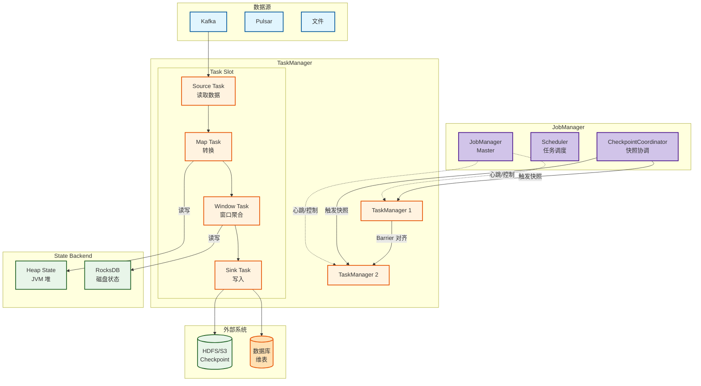
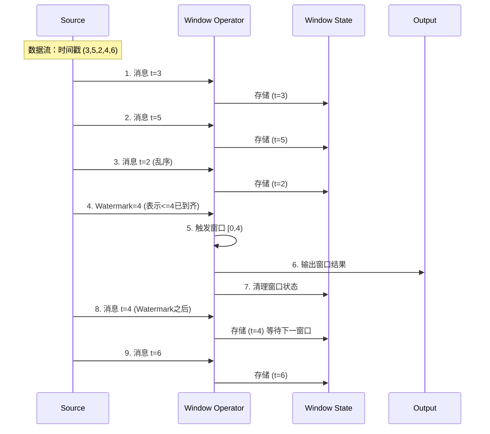
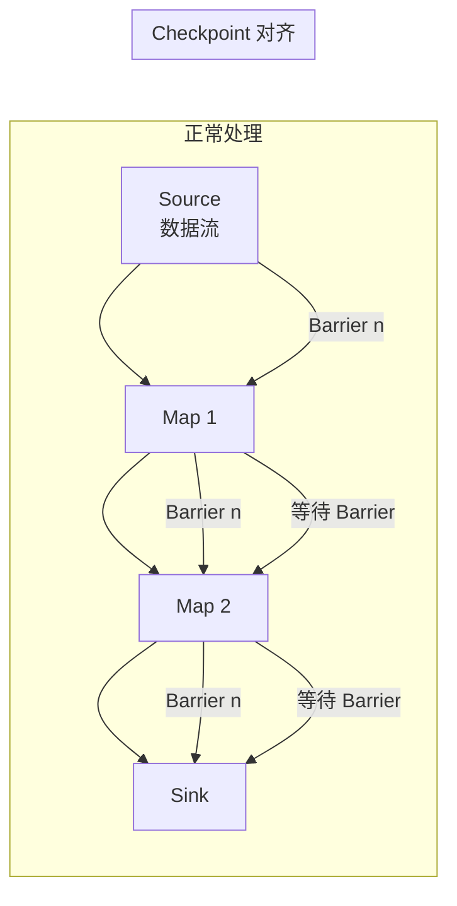
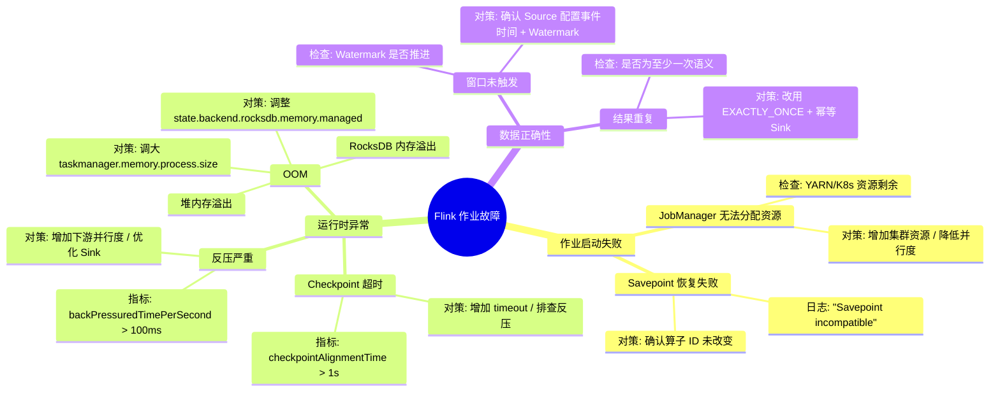

> [!info] 摘要  
> Flink 并非“流上的 Spark”，而是一套**以事件时间为基石、以状态后端为容错单元、以批流一体为终极目标的分布式计算引擎**。它的革命性在于：**将批处理视为流处理的特例**，统一了有界（批）与无界（流）数据集的编程模型。本文从“如何在无序、延迟到达的事件流上保持结果正确性”这一核心挑战切入，深度解析 Flink 的**事件时间处理**、**Watermark 机制**、**状态管理**与**精确一次语义**。通过源码级拆解 `StreamTask` 的执行模型、`RocksDB` 状态后端的增量快照、以及两阶段提交协议在端到端一致性中的应用，还原一次 Flink SQL 作业从构建到容错恢复的完整生命周期。结合生产案例，提供反压处理、状态膨胀控制、Checkpoint 超时等典型问题排查方案。最后，在 2026 年 Flink 已成为流处理事实标准的背景下，讨论其与 Kafka 的“黄金搭档”地位及在实时数据仓库中的核心角色。

---

## 一、核心概念与底层图景

### 1.1 定义

> [!quote] 工程定义  
> **Apache Flink** 是一个**基于事件时间驱动的有状态流处理引擎**。它将数据流抽象为无限流，通过 **Watermark 处理乱序**，通过 **State 保存中间结果**，通过 **Checkpoint 实现一致性快照**。批处理被视为流的有限特例，共享同一套运行时。

*类比*：Flink 如同**有完美记忆力的海关官员**——每个入境旅客（事件）可能迟到或插队，但官员始终按护照时间戳（事件时间）处理，并在小本本上（State）记录每国入境人数，定期拍照存档（Checkpoint）以防忘事。

### 1.2 架构全景图



> [!note] 交互方向解读  
> - **控制流**：JobManager 负责作业调度与 Checkpoint 协调，TaskManager 执行具体任务。  
> - **数据流**：Source 读取数据，经过多级算子转换，最终由 Sink 输出。  
> - **状态流**：算子状态存储于本地（堆/RocksDB），Checkpoint 时异步持久化到远程存储。  
> - **Barrier 对齐**：Checkpoint 期间插入特殊标记，确保一致性快照。

---

## 二、机制原理深度剖析

### 2.1 核心子模块拆解

| 子模块 | 职责 | 设计意图/为何独立 |
|-------|------|------------------|
| **Event Time** | 事件本身携带的时间戳 | **乱序处理基础**：与处理时间解耦，保证重播结果一致 |
| **Watermark** | 表示“所有早于该时间戳的事件都已到达”的标记 | **窗口触发依据**：在无序流中定义“何时该关闭窗口” |
| **State** | 算子的中间数据（聚合值、缓存、列表） | **有状态计算**：流处理本质是连续查询，需持久化中间结果 |
| **Checkpoint** | 分布式快照，保存所有算子状态 + 源偏移量 | **容错单元**：失败时从最近快照恢复，实现精确一次 |
| **Savepoint** | 用户触发的 Checkpoint，用于升级/重启 | **版本管理**：与业务版本对齐，手动触发 |
| **RocksDB State Backend** | 基于磁盘的 KV 存储，支持超大状态 | **内存溢出防护**：状态可大于内存，以访问速度换容量 |

> [!tip]- 深度分析：为什么 Flink 强调“事件时间”而非“处理时间”？  
> **根本原因**：流数据天生无序。  
> - **处理时间**：简单但结果不可重现。网络延迟、背压都会改变计算结果。  
> - **事件时间**：无论数据何时到达，都按产生时间计算。  
> **代价**：需处理乱序与延迟——Watermark 机制引入延迟（allowed lateness）与侧输出流。  
> **生产意义**：90% 的真实流场景（日志、交易、点击）都应使用事件时间。

### 2.2 核心流程可视化：**窗口聚合与 Watermark 推进**



### 2.3 检查点（Checkpoint）对齐过程



> [!warning] 关键决策点  
> - **对齐（Aligning）**：Checkpoint 时，算子需等待所有上游通道的 Barrier 到达，期间不处理数据（增加延迟）。  
> - **非对齐 Checkpoint**：Flink 1.11+ 支持非对齐，牺牲恢复时间换正常处理延迟。  
> - **端到端精确一次**：需 Source 支持 offset 重置 + Sink 支持幂等或事务（两阶段提交）。

---

## 三、内核/源码级实现

### 3.1 核心数据结构（Java）

> [!code] Watermark 与事件时间
```java
// 路径：flink-core/src/main/java/org/apache/flink/api/common/eventtime/Watermark.java
/**
 * Watermark 表示所有时间戳 <= timestamp 的事件都已到达。
 */
public final class Watermark {
    private final long timestamp;  // 单调递增
    
    public Watermark(long timestamp) {
        this.timestamp = timestamp;
    }
    
    public long getTimestamp() {
        return timestamp;
    }
}

// 路径：flink-streaming-java/src/main/java/org/apache/flink/streaming/api/functions/AssignerWithPeriodicWatermarks.java
/**
 * 周期性生成 Watermark 的接口。
 */
public interface AssignerWithPeriodicWatermarks<T> extends TimestampAssigner<T> {
    
    @Nullable
    Watermark getCurrentWatermark();  // 周期性调用（默认 200ms）
}
```

> [!code] 状态接口（ValueState）
```java
// 路径：flink-core/src/main/java/org/apache/flink/api/common/state/ValueState.java
/**
 * 单值状态接口。
 */
public interface ValueState<T> extends State {
    
    /**
     * 读取当前值。
     */
    T value() throws IOException;
    
    /**
     * 更新值。
     */
    void update(T value) throws IOException;
}

// 路径：flink-runtime/src/main/java/org/apache/flink/runtime/state/HeapValueState.java
/**
 * 堆内存实现。
 */
public class HeapValueState<T> implements ValueState<T> {
    
    private final StateTable<K, N, T> stateTable;
    private final K key;
    private final N namespace;
    
    @Override
    public T value() {
        return stateTable.get(key, namespace);
    }
    
    @Override
    public void update(T value) {
        stateTable.put(key, namespace, value);
    }
}
```

> [!code] StreamTask 执行模型
```java
// 路径：flink-runtime/src/main/java/org/apache/flink/runtime/taskmanager/Task.java
/**
 * Task 的核心执行循环。
 */
public class Task implements Runnable {
    
    @Override
    public void run() {
        // 1. 初始化
        invokable.invoke();
        
        // 2. 主循环
        while (running) {
            // 从输入读取数据
            record = input.emitNext();
            
            // 处理记录
            invokable.processElement(record);
            
            // 定期触发 Watermark
            invokable.periodicEmit();
            
            // 检查是否需要触发 Checkpoint
            if (checkpointCoordinator.needTrigger()) {
                invokable.triggerCheckpoint();
            }
        }
    }
}
```

> [!code] RocksDB 状态后端的增量 Checkpoint
```java
// 路径：flink-statebackend-rocksdb/src/main/java/org/apache/flink/contrib/streaming/state/RocksDBKeyedStateBackend.java
/**
 * RocksDB 增量 Checkpoint 的核心逻辑。
 */
public class RocksDBSnapshotOperation {
    
    public void takeSnapshot() {
        // 1. 强制 RocksDB 刷新 MemTable 到 SST
        rocksDB.flush(new FlushOptions().setWaitForFlush(true));
        
        // 2. 获取当前所有活跃 SST 文件列表
        List<String> sstFiles = rocksDB.getLiveFiles();
        
        // 3. 与上次 Checkpoint 的 SST 文件对比，只上传新增部分
        List<String> newFiles = diffSstFiles(previousSstFiles, sstFiles);
        
        // 4. 将新 SST 文件上传到远程存储
        for (String file : newFiles) {
            remoteStorage.put(file, localFile);
        }
        
        // 5. 记录元数据：所有 SST 文件清单
        snapshotMeta.setSstFiles(sstFiles);
    }
}
```

> [!bug] 并发模型  
> - **TaskManager**：每个 Task Slot 运行一个线程，执行 `StreamTask` 的主循环。  
> - **状态访问**：单线程访问状态，无需锁。  
> - **Checkpoint 线程**：异步上传状态文件，不阻塞主处理线程。  
> - **2.x 改进**：引入 **Unified Checkpointing**，减少对齐期间的数据阻塞。

---

## 四、生产落地与 SRE 实战

### 4.1 场景化案例：**反压导致 Checkpoint 超时**

> [!danger] 现象  
> - Flink 作业运行 1 周后，Checkpoint 频繁超时失败。  
> - 最终作业崩溃，恢复后再次循环。  
> - 监控显示 `busyTimePerSecond` 接近 100%。

> [!check] 排查链路  
> 1. **检查 Checkpoint 日志** → `Checkpoint expired before completing`。  
> 2. **查看反压监控** → Web UI 显示 Source 算子反压红色。  
> 3. **分析下游** → Sink 写入 HBase 变慢，导致背压传递至 Source。  
> 4. **根因**：HBase 因 Compaction 导致写入延迟飙升。

> [!success] 解决方案  
> ```java
> // 方案A：增加 Sink 并行度
> stream.sinkTo(new HBaseSink(...)).setParallelism(10);
> 
> // 方案B：引入缓冲队列（Kafka）作为中间层
> stream.addSink(new KafkaSink(...));  // 先写回 Kafka
> 
> // 方案C：启用 Checkpoint 超时自动扩容（3.x+）
> ExecutionConfig config = env.getConfig();
> config.setAutoWatermarkInterval(100);
> ```

> [!done] 验证  
> 增加 Sink 并行度后，反压解除，Checkpoint 稳定完成。

### 4.2 参数调优矩阵

| 参数名 | 作用域 | 推荐值 | 内核解释 |
|--------|--------|--------|---------|
| `execution.checkpointing.interval` | 作业级 | 30-60s | Checkpoint 间隔，调小增加恢复点密度 |
| `execution.checkpointing.timeout` | 作业级 | 10min | Checkpoint 超时，调大避免频繁失败 |
| `execution.checkpointing.mode` | 作业级 | `EXACTLY_ONCE` | 精确一次，至少一次需权衡性能 |
| `state.backend` | 作业级 | `rocksdb`（大状态） | 状态后端选择 |
| `state.checkpoints.dir` | 全局 | `hdfs:///flink/checkpoints` | Checkpoint 存储路径 |
| `taskmanager.memory.process.size` | 实例级 | 根据物理内存 | TM 总内存，包含堆、堆外、网络缓冲 |
| `taskmanager.numberOfTaskSlots` | 实例级 | CPU 核心数 | 每个 TM 的并发数 |
| `restart-strategy` | 作业级 | `fixed-delay` | 失败重启策略 |

### 4.3 监控与诊断

> [!info] 关键指标（Flink UI / Metrics Reporter）

| 指标名 | 健康区间 | 瓶颈阈值 | 含义 |
|--------|----------|----------|------|
| `busyTimePerSecond` | < 60% | > 80% | 算子繁忙度，高值可能预示反压 |
| `backPressuredTimePerSecond` | 0 | > 100ms | 反压时间，持续出现需排查下游 |
| `numberOfFailedCheckpoints` | 0 | > 1 | Checkpoint 失败，可能导致作业崩溃 |
| `checkpointAlignmentTime` | < 100ms | > 1s | Barrier 对齐耗时，长时影响处理延迟 |
| `currentLowWatermark` | - | 停滞不前 | 无新 Watermark，可能 Source 无数据 |

> [!example] 诊断命令  
> ```bash
> # Flink Web UI
> http://jobmanager:8081
> 
> # 查看 Checkpoint 历史
> curl http://jobmanager:8081/jobs/{jobId}/checkpoints
> 
> # 查看反压状态
> curl http://taskmanager:8081/tasks/{taskId}/backpressure
> 
> # 动态调整并行度
> ./bin/flink modify <jobId> -p 10
> ```

### 4.4 故障排查决策树



---

## 五、技术演进与未来视角（2026+）

### 5.1 历史设计约束与改进

| 版本 | 变化 | 动因/解决的问题 |
|------|------|----------------|
| 0.9 (2015) | **DataStream API** | 流处理核心 |
| 1.0 (2016) | **稳定版发布** | 社区活跃度提升 |
| 1.2 (2017) | **RocksDB 状态后端** | 支持超大状态 |
| 1.7 (2019) | **Savepoint 兼容性** | 升级不影响作业 |
| 1.11 (2020) | **非对齐 Checkpoint** | 缓解反压问题 |
| 1.13 (2021) | **DataStream API 批流统一** | 批处理使用相同 API |
| 1.16 (2023) | **算子级状态 TTL** | 细粒度状态管理 |

### 5.2 2026 年仍存在的“遗留设计”

> [!bug] 痛点1：Checkpoint 对大状态不友好  
> RocksDB 状态过大时，增量 Checkpoint 仍可能耗时数分钟。  
> **替代方案**：Flink 社区推进 **Changelog 状态后端**，分离计算与存储。

> [!bug] 痛点2：SQL 与 DataStream API 隔离  
> 两者无法混用，流表转换繁琐。  
> **现状**：DataStream API 与 Table API 互操作仍有性能损耗。

> [!bug] 痛点3：动态调整并行度困难  
> 改变并行度需 Savepoint + 重启，不支持自动弹性伸缩。  
> **社区方向**：**Reactive Mode** 实验性支持动态扩缩容。

### 5.3 未来趋势

- **Flink + Iceberg**：  
  实时数据湖方案——Flink 写入 Iceberg，批流统一存储。
- **Kubernetes Operator**：  
  Flink 作为云原生应用，自动扩缩容、滚动升级。
- **流式数仓**：  
  Flink SQL 取代部分离线 ETL，实现实时 OLAP。
- **与 Kafka 的黄金搭档**：  
  Kafka 作为流管道，Flink 作为流处理器，两者已成为实时数据架构的事实标准。

> [!quote] 十年后的 Flink  
> 它将像今天的 Hadoop 一样成为基础设施——新人入行时，学习的第一课就是“事件时间 vs 处理时间”。它的设计哲学——状态、时间、精确一次——将渗透到每一个实时计算系统中。当人们问“如何做实时计算”时，答案不再是“用 Flink”，而是“Flink 怎么做”。

---

## 参考文献
- 源码路径：`flink-core`、`flink-streaming-java`、`flink-runtime`
- 官方文档：[Apache Flink Documentation](https://flink.apache.org/documentation/)
- 相关论文：Carbone, P., et al. (2015). "Apache Flink: Stream and Batch Processing in a Single Engine." IEEE Data Engineering Bulletin.