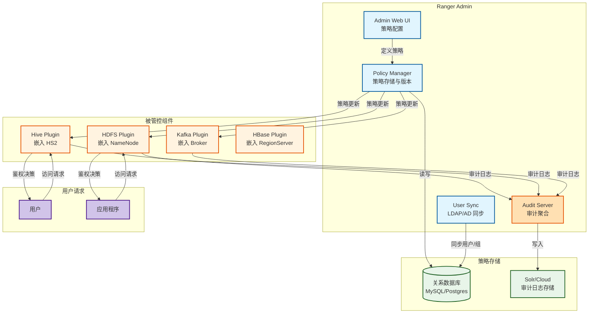
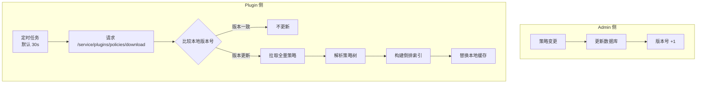
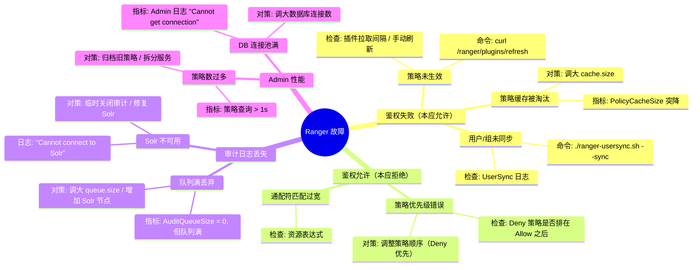

> [!info] 摘要  
> Apache Ranger 并非 Hadoop 生态的“又一个安全组件”，而是一套**将分散在各组件（HDFS/Hive/HBase/Kafka）的授权策略统一管理、集中审计的权限控制框架**。它的核心价值在于：**将“谁在何时对何资源有何权限”这一安全三元组从各组件内部硬编码中抽离，形成可动态更新的中央策略库**。本文从“如何在多组件 Hadoop 集群中实现一致性权限控制”这一根本需求切入，深度解析 Ranger 的**策略管理服务**、**插件架构**、以及**审计日志聚合**三大模块。通过源码级拆解 Ranger 策略在 Hive 插件中的缓存与更新机制、HDFS 的 Namenode 扩展点集成、以及审计日志写入 Solr/Cloud 的异步管道，还原一次用户查询从 Ranger 鉴权到审计的全生命周期。结合生产案例，提供策略生效延迟、插件内存泄漏、审计日志丢失等典型问题排查方案。最后，在 2026 年云原生数据湖普及的背景下，讨论 Ranger 与云厂商原生权限系统（如 AWS Lake Formation）的竞争与共存关系。

---

## 一、核心概念与底层图景

### 1.1 定义

> [!quote] 工程定义  
> **Apache Ranger** 是一个**集中式权限管理与审计平台**，由两部分组成：
> - **Ranger Admin**：策略管理服务，提供 Web UI 和 REST API 供管理员定义安全策略。
> - **Ranger Plugins**：嵌入各组件（Hive、HDFS、HBase、Kafka 等）的轻量级客户端，定期从 Admin 拉取策略，在组件本地执行鉴权。

*类比*：Ranger 如同**大型园区的统一门禁系统**——中央控制室（Admin）管理所有门禁规则，各楼宇的门禁读卡器（Plugin）缓存规则并实时刷卡验证，所有进出记录（Audit）统一回传存档。

### 1.2 架构全景图



> [!note] 交互方向解读  
> - **策略下发**：管理员在 Admin 配置策略 → 存储至数据库 → Plugin 周期性拉取（默认 30 秒）缓存至本地。  
> - **鉴权路径**：用户请求 → Plugin 拦截 → 查本地缓存策略 → 允许/拒绝 → 记录审计日志。  
> - **审计聚合**：Plugin 异步发送审计日志至 Audit Server → Audit Server 批量写入 Solr 供查询。  
> - **用户同步**：UserSync 从 LDAP/AD 同步用户/组信息至 Ranger 数据库，用于策略中指定用户。

---

## 二、机制原理深度剖析

### 2.1 核心子模块拆解

| 子模块 | 职责 | 设计意图/为何独立 |
|-------|------|------------------|
| **Policy Manager** | 策略的 CRUD、版本管理、策略解析 | **策略抽象**：将安全策略建模为资源（Resource）+ 权限项（Allow/Deny）+ 用户/组 |
| **Plugin 缓存** | 拉取并缓存策略，提供本地鉴权 | **性能关键**：避免每次请求远程调用 Admin，鉴权延迟 < 1ms |
| **Policy Evaluator** | 根据请求资源匹配策略 | **高效匹配**：倒排索引、通配符匹配、优先顺序处理 |
| **Audit 通道** | 异步发送审计日志 | **解耦**：不阻塞主请求，日志丢失不影响鉴权 |
| **UserSync** | 同步外部用户/组 | **统一身份源**：避免策略中硬编码用户 |

> [!tip]- 深度分析：为什么 Ranger 选择“拉模式”而非“推模式”？  
> **根本原因**：组件数量多、网络不可靠。  
> - **推模式**（如 Sentry）：Admin 主动推送策略变更到所有组件。  
>   - 缺点：组件重启或网络分区时可能丢失策略。  
> - **拉模式**（Ranger）：组件周期性主动拉取。  
>   - 优点：组件状态独立，策略最终一致。  
>   - 代价：策略生效延迟（默认 30 秒）。  
> **生产建议**：关键策略变更后手动触发插件刷新。

### 2.2 核心流程可视化：**Hive 查询鉴权全流程**

```mermaid
sequenceDiagram
    participant U as 用户 (Beeline)
    participant H as HiveServer2
    participant P as Ranger Hive Plugin
    participant C as Policy Cache
    participant A as Ranger Admin
    participant S as Solr (审计)

    U->>H: SELECT * FROM sales
    
    H->>P: 1. 请求鉴权 (用户: bob, 资源: database=sales, table=sales)
    P->>C: 2. 查缓存策略
    
    alt 缓存中匹配策略
        C-->>P: 3a. 返回决策 (ALLOW/DENY)
    else 缓存未命中
        C-->>P: 3b. 无匹配
        P->>P: 4. 按默认策略 (DENY)
    end
    
    P-->>H: 5. 返回鉴权结果
    
    alt 允许访问
        H->>H: 6. 执行查询
        H-->>U: 7. 返回结果
    else 拒绝访问
        H-->>U: 8. 抛出权限异常
    end
    
    P-)>>A: 9. "异步发送审计日志 (用户、资源、决策)"
    A-)>>S: 10. 批量写入 Solr
```

### 2.3 策略缓存更新机制



> [!warning] 关键决策点  
> - **全量拉取**：每次更新拉取全量策略（非增量），百万级策略时网络/内存压力大。  
> - **策略优先级**：Deny 优先于 Allow，特定资源优先于通配符。  
> - **行级过滤**：Ranger 支持 Hive 行级过滤，通过将过滤条件改写为 SQL 谓词实现。

---

## 三、内核/源码级实现

### 3.1 核心数据结构（Java）

> [!code] Ranger 策略模型
```java
// 路径：security-admin/src/main/java/org/apache/ranger/entity/XXPolicy.java
/**
 * Ranger 策略实体。
 */
@Entity
@Table(name = "x_policy")
public class XXPolicy extends XXPolicyBase {
    
    private String name;                // 策略名称
    private String service;              // 服务类型 (HDFS/Hive/HBase)
    private Long version;                // 版本号，用于插件判断
    private Boolean isEnabled;            // 是否启用
    private String resourceSignature;     // 资源签名，用于快速匹配
    
    // 策略项：允许条目
    @OneToMany(mappedBy = "policy")
    private List<XXPolicyItem> policyItems;
    
    // 策略项：拒绝条目
    @OneToMany(mappedBy = "policy")
    private List<XXPolicyItem> denyPolicyItems;
}

/**
 * 策略项：用户/组 + 权限 + 条件。
 */
@Entity
@Table(name = "x_policy_item")
public class XXPolicyItem {
    
    private Long policyId;
    
    // 访问类型 (select/update/create/...)
    @OneToMany(mappedBy = "policyItem")
    private List<XXPolicyItemAccess> accesses;
    
    // 用户列表
    @OneToMany(mappedBy = "policyItem")
    private List<XXPolicyItemUserPerm> users;
    
    // 组列表
    @OneToMany(mappedBy = "policyItem")
    private List<XXPolicyItemGroupPerm> groups;
    
    // 条件 (如 IP 范围、时间)
    @OneToMany(mappedBy = "policyItem")
    private List<XXPolicyItemCondition> conditions;
}
```

> [!code] Ranger 插件缓存（Hive 插件示例）
```java
// 路径：agents-common/src/main/java/org/apache/ranger/plugin/policyengine/RangerPolicyEngineImpl.java
/**
 * Ranger 策略引擎实现，负责缓存与鉴权。
 */
public class RangerPolicyEngineImpl implements RangerPolicyEngine {
    
    private final RangerPolicyRepository policyRepository;  // 策略库
    private final Map<String, RangerResource> resourceCache; // 资源缓存
    
    /**
     * 鉴权主入口。
     */
    public RangerAccessResult evalPolicies(
        RangerAccessRequest request,
        RangerAccessResultProcessor resultProcessor
    ) {
        // 1. 获取请求资源
        RangerResource resource = getResource(request.getResource());
        
        // 2. 匹配策略（按优先级排序）
        List<RangerPolicy> policies = getMatchingPolicies(resource);
        
        for (RangerPolicy policy : policies) {
            if (policy.getIsEnabled()) {
                // 3. 评估策略项
                RangerPolicyItem item = findMatchingItem(policy, request);
                if (item != null) {
                    // 4. 根据 Deny/Allow 返回结果
                    return buildResult(item, request);
                }
            }
        }
        
        // 5. 无匹配策略 → DENY
        return RangerAccessResult.DENIED;
    }
}
```

> [!code] 审计日志异步发送
```java
// 路径：agents-common/src/main/java/org/apache/ranger/plugin/audit/RangerDefaultAuditHandler.java
/**
 * 审计处理器，异步发送日志。
 */
public class RangerDefaultAuditHandler implements RangerAuditHandler {
    
    private final BlockingQueue<AuditMessage> queue = new LinkedBlockingQueue<>();
    private final Thread consumerThread;
    
    public RangerDefaultAuditHandler() {
        consumerThread = new Thread(this::consume);
        consumerThread.start();
    }
    
    /**
     * 生产者：插件调用此方法记录审计。
     */
    public void log(AuditMessage message) {
        queue.offer(message);  // 非阻塞，队列满时丢弃（可配置）
    }
    
    /**
     * 消费者：批量发送审计日志。
     */
    private void consume() {
        List<AuditMessage> batch = new ArrayList<>();
        while (true) {
            // 攒批：最多等待 1 秒或满 100 条
            queue.drainTo(batch, 100);
            if (batch.isEmpty()) {
                Thread.sleep(1000);
                continue;
            }
            // 发送至 Audit Server
            sendBatch(batch);
            batch.clear();
        }
    }
}
```

> [!bug] 并发模型  
> - **Admin 侧**：Web 请求由 Tomcat 线程池处理，数据库读写由连接池管理。  
> - **Plugin 侧**：鉴权在主请求线程中执行，策略缓存使用 `ConcurrentHashMap`，无锁读。  
> - **审计线程**：单线程消费队列，避免并发写 Solr。  
> - **瓶颈**：策略全量拉取时，可能阻塞插件启动。

---

## 四、生产落地与 SRE 实战

### 4.1 场景化案例：**策略更新延迟导致新员工无法访问数据**

> [!danger] 现象  
> - 管理员在 Ranger Admin 为新员工 bob 添加 Hive 表访问策略。  
> - 30 分钟后，bob 仍报错 `Permission denied`。  
> - 手动重启 HiveServer2 后，访问正常。

> [!check] 排查链路  
> 1. **检查插件日志** → HiveServer2 日志显示 `Policy refetch interval: 30 sec`。  
> 2. **查看 Admin 策略版本** → 策略已更新，版本号 +1。  
> 3. **根因**：Hive 插件缓存在启动时加载策略后，因网络抖动未能拉取新版本，且无强制刷新机制。

> [!success] 解决方案  
> ```bash
> # 方案A：手动触发插件刷新（无需重启）
> curl -X POST http://hiveserver2:6080/ranger/plugins/refresh
> 
> # 方案B：调小拉取间隔（hive-site.xml）
> <property>
>   <name>ranger.plugin.hive.policy.pollIntervalMs</name>
>   <value>15000</value>  <!-- 15 秒 -->
> </property>
> 
> # 方案C：启用失败重试，避免单次失败停止更新
> <property>
>   <name>ranger.plugin.hive.policy.retryIntervalMs</name>
>   <value>5000</value>
> </property>
> ```

> [!done] 验证  
> 配置修改后，策略更新在 15 秒内生效。

### 4.2 参数调优矩阵

| 参数名 | 组件 | 推荐值 | 内核解释 |
|--------|------|--------|---------|
| `ranger.plugin.[service].policy.pollIntervalMs` | Plugin | 30000-60000 | 策略拉取间隔，调小增加一致性，增加 Admin 负载 |
| `ranger.plugin.[service].policy.cache.size` | Plugin | 1000-5000 | 本地缓存策略数量，超限淘汰最久未用 |
| `ranger.audit.source.type` | Plugin | `solr` / `hdfs` | 审计日志存储目的地 |
| `ranger.audit.async.queue.size` | Plugin | 10000 | 审计队列大小，队列满时行为由 `queue.full.policy` 决定 |
| `ranger.admin.max.policies` | Admin | 100000 | 最大策略数，超限影响 Admin 性能 |
| `ranger.usersync.sync.source` | UserSync | `ldap` / `unix` | 用户同步源 |

### 4.3 监控与诊断

> [!info] 关键指标（JMX / Admin API）

| 指标名 | 来源 | 健康区间 | 含义 |
|--------|------|----------|------|
| `PolicyCacheSize` | Plugin JMX | 稳定 | 本地缓存策略数，突降可能缓存失效 |
| `PolicyUpdateLatency` | Plugin JMX | < 30s | 策略从变更到生效的延迟 |
| `AuditQueueSize` | Plugin JMX | < 1000 | 审计日志积压数，持续增长需检查 Solr |
| `NumPolicies` | Admin API | < 10万 | 总策略数，超限需优化或分区 |
| `UserSyncDelta` | Admin API | 0 | 与 LDAP 用户数差异，检查同步任务 |

> [!example] 诊断命令  
> ```bash
> # 查看插件状态
> curl http://hiveserver2:6080/ranger/plugins/status
> 
> # 查看 Admin 策略列表
> curl -u admin:admin http://ranger-admin:6080/service/plugins/policies/serviceName
> 
> # 查看审计日志
> curl http://solr:8983/solr/ranger_audits/select?q=*
> 
> # 手动触发用户同步
> ./ranger-usersync.sh --sync
> ```

### 4.4 故障排查决策树



---

## 五、技术演进与未来视角（2026+）

### 5.1 历史设计约束与改进

| 版本 | 变化 | 动因/解决的问题 |
|------|------|----------------|
| 0.5 (2014) | **初始版本** | 集中管理 Hive/HDFS 权限 |
| 0.6 (2015) | **审计日志 Solr 集成** | 可搜索审计能力 |
| 0.7 (2016) | **Kafka 插件** | 覆盖消息队列安全 |
| 1.0 (2017) | **稳定版发布** | 企业级特性完备 |
| 1.2 (2019) | **行级过滤** | Hive 细粒度权限 |
| 2.0 (2021) | **Ranger 权限与 K8s 集成** | 云原生环境适配 |

### 5.2 2026 年仍存在的“遗留设计”

> [!bug] 痛点1：插件与组件版本耦合  
> Hive 升级需同时升级 Ranger 插件，否则可能不兼容。  
> **现状**：Ranger 2.x 与 Hive 3.x/4.x 版本需严格匹配。

> [!bug] 痛点2：全量拉取策略开销大  
> 策略数达 10 万时，每次拉取 JSON 达数十 MB，网络/内存压力大。  
> **社区方向**：增量策略拉取（RANGER-3000），进展缓慢。

> [!bug] 痛点3：云原生适配不足  
> 对象存储（S3）权限无法通过 Ranger 统一管理，需依赖云厂商原生 IAM。

### 5.3 未来趋势

- **与云原生权限系统竞争**：  
  AWS Lake Formation 提供类似 Ranger 的集中权限管理，且与 S3/IAM 深度集成。Ranger 在云上部署场景被蚕食。
- **Ranger 定位收缩**：  
  在混合云、本地部署中仍是 Hadoop 生态唯一选择；云上逐步被云厂商原生方案替代。
- **权限治理一体化**：  
  Ranger + Atlas（数据血缘）+ 数据分类，形成完整数据治理套件。
- **Open Policy Agent（OPA）集成**：  
  Ranger 策略可转换为 OPA 规则，实现跨平台权限统一。

> [!quote] 十年后的 Ranger  
> 它将像 CDH/HDP 一样，成为“传统 Hadoop 时代”的印记。在公有云上，用户不再直接接触 Ranger，而是通过 Lake Formation、Unity Catalog 等云原生服务管理权限。但在金融、政务等需要完全本地部署的场景，Ranger 依然会是那个默默守护数据的门禁系统。

---

## 参考文献
- 源码路径：`security-admin/`（Admin 服务）、`agents-common/`（插件 SDK）
- 官方文档：[Apache Ranger Documentation](https://ranger.apache.org/documentation.html)
- 相关 JIRA：RANGER-3000（增量策略拉取），RANGER-3500（OPA 集成）