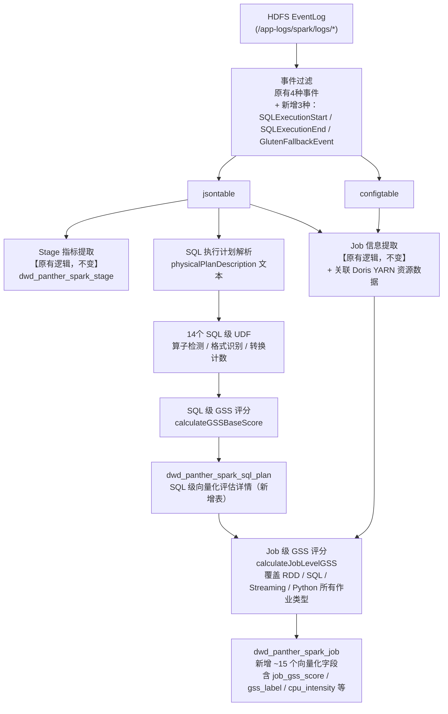

## 🎯 目标与验收标准

### 本周目标（3.16-3.20）
- [x] 完成 GSS 评分模型代码开发与关键逻辑优化
- [ ] 完成作业画像单元测试：14 个 SQL 级 UDF 全部有单测（覆盖 Parquet/ORC/CSV 格式识别、Hive UDF 检测、ColumnarToRow 计数），测试通过率 100%
- [ ] 端到端冒烟测试：取近 7 天 bdwh 用户 EventLog（≥500 个作业），确认 GSS 评分无 NULL、无异常负值，运行耗时不超过原有 PantherSparkEventJob 的 20%
- [ ] `physicalPlanDescription` 格式兼容性验证：`extractInputFormat` 和 `countFileScanNodes` 正确识别 Spark 3.2+ 的 `(N) Scan parquet` 格式（非旧版 `FileScan parquet`）

## ⚙️ 参考执行路径

### Step 1：单元测试补全（3.16-3.17）

重点验证以下 UDF 输入输出对：

| UDF | 测试输入 | 期望输出 |
|-----|---------|---------|
| `extractInputFormat` | `"(1) Scan parquet"` | `"parquet"` |
| `countHiveUDFs` | `"HiveTableScan ... udf:my_func"` | `1` |
| `countColumnarToRow` | `"ColumnarToRow\nRowToColumnar\nColumnarToRow"` | `2` |
| `calculateGSSBaseScore` | Parquet + Aggregate + 无 UDF | `≥80` |

### Step 2：冒烟测试（3.17-3.19）

```bash
# 在测试集群提交画像作业，指定近 7 天 bdwh EventLog
spark-submit \
  --class com.sohu.bdplatform.panther.PantherSparkEventJob \
  --conf spark.executor.memory=4g \
  pantherSparkJob.jar \
  --dt 7d --user bdwh --mode profile

# 验证输出
hive -e "SELECT count(*), min(job_gss_score), max(job_gss_score),
               avg(job_gss_score), count(CASE WHEN job_gss_score IS NULL THEN 1 END) as null_cnt
         FROM dwd_panther_spark_job WHERE dt='$(date -d yesterday +%Y%m%d)'"
```

期望：null_cnt = 0，min ≥ 0，max ≤ 100，作业总耗时与基线相比增幅 < 20%

## ⚙️ 技术原理

### 为什么从 EventLog 离线分析

并非所有 Spark 作业都适合开启 Gluten+Velox 向量化。盲目开启的典型风险：

- **性能回退**：不兼容算子触发频繁的 ColumnarToRow ↔ RowToColumnar 转换（"三明治"结构），反而增加耗时
- **OOM 崩溃**：Gluten 强依赖 Off-Heap 内存，原有 Heap-only 配置下 Container 易被 YARN 杀死
- **功能异常**：复杂 Hive UDF、部分 Window 函数在 Velox 中不受支持

EventLog 是 Spark 原生作业运行日志，其中 `SparkListenerSQLExecutionStart` 事件包含 `physicalPlanDescription` 字段（完整物理执行计划文本），是判断向量化适配性的最佳数据源。**无需修改用户代码或 Spark 配置，全量覆盖历史作业，完全复用现有 PantherSparkEventJob 解析框架**。

### 实现流程



### GSS 评分模型

GSS（Gluten Suitability Score）是 0-100 分的综合评分，分两层：

**SQL 级 GSS**（仅针对有 SQL 执行计划的作业，细粒度）

| 维度 | 加/减分 | 核心依据 |
|------|--------|---------|
| 输入格式为 Parquet/ORC | +20/+15 | Velox 原生支持列式扫描 |
| 输入含行式格式 CSV/Text | -15/-20 | 无法向量化读取 |
| ColumnarToRow + RowToColumnar 转换 | -15/次（上限-60） | "三明治"结构阶梯惩罚 |
| 检测到 Hive UDF | -30 | 必须回退 JVM |
| 检测到 Pandas UDF | -20 | 需要 Python 进程通信 |
| Aggregate 节点存在 | +10 | HashAggregate 是向量化加速最显著的算子 |
| Join 节点 1-3 个 | +10 | 中等复杂度 Join 是主要受益场景 |
| Batched: true（原生列式读取） | +10 | Gluten 接入更平滑 |
| 复杂嵌套类型 Map/Array | -15 | Velox 对此支持有限 |

**Job 级 GSS**（全量覆盖，含纯 RDD / Streaming / Python）

在 SQL 级基础上，额外考虑作业类型信号：纯 RDD 作业（-50）、Streaming 作业（-40）、Python 作业（-25）直接大幅降分，因为 Gluten 对这类作业几乎无法加速。CPU 密集度 > 0.5 的 SQL/Dataset 作业额外加分（+15）。

**决策区间**：

| 分数 | 建议 |
|------|------|
| ≥ 70 | ✅ 建议开启向量化 |
| 40–69 | ⚠️ 谨慎评估，建议小批量灰度 |
| < 40 | ❌ 不建议，存在回退或 OOM 风险 |


## 🐛 踩坑日志 (Troubleshooting)
### 关键踩坑：physicalPlanDescription 格式

Spark 3.2+ 的 `physicalPlanDescription` 使用**格式化计划文本**，节点命名与旧版 `explain` 输出不同：

| 节点 | 旧 explain 格式 | physicalPlanDescription 实际格式 |
|------|----------------|----------------------------------|
| Parquet 扫描 | `FileScan parquet` | `(N) Scan parquet` |
| ORC 扫描 | `FileScan orc` | `(N) Scan orc` |

UDF 中检测 `"FileScan parquet"` 会返回 0，必须改为 `"scan parquet"`（小写子串，向下兼容）。**代码在 v1.2 已修复**（`extractInputFormat` 和 `countFileScanNodes`）。
