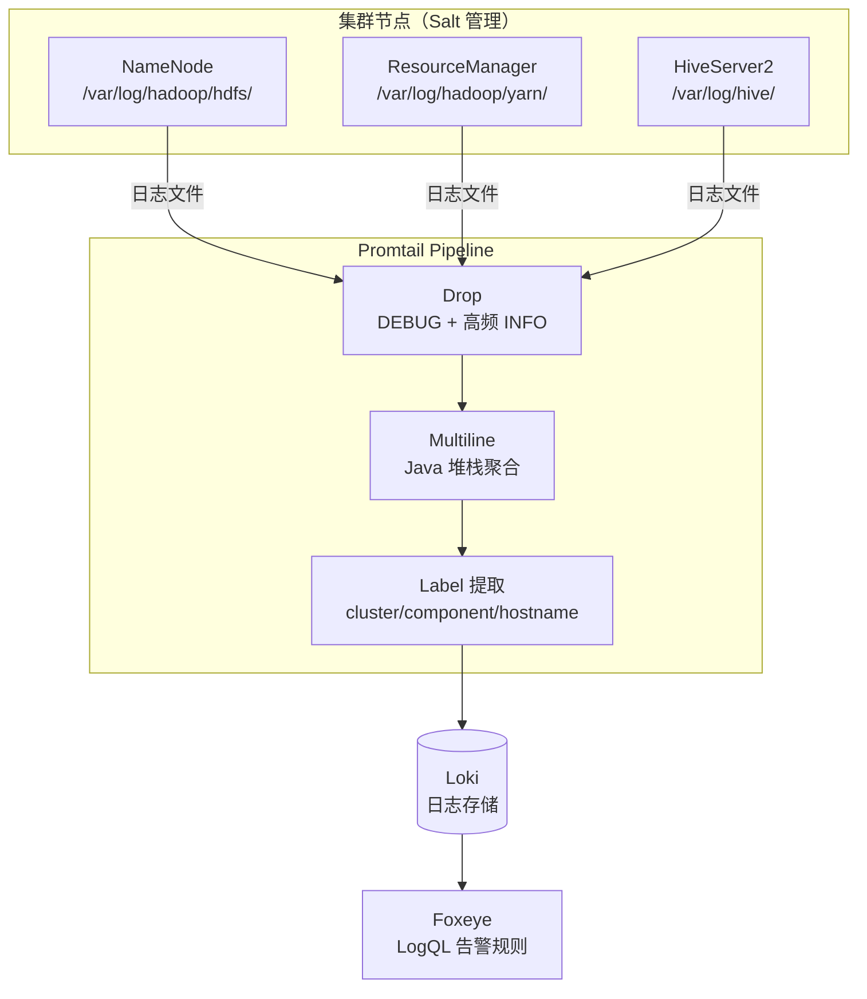

## 🎯 目标与验收标准

### 本周目标（3.16-3.20）
- [ ] Salt 流水线 Promtail 部署模块完善：Salt State 模块可稳定下发 Promtail 配置，`salt '*' state.apply promtail` 在测试节点执行无报错
- [ ] 选取 1-2 个测试节点（建议 NameNode standby）完成 Promtail 接入，日志成功写入 Loki
- [ ] Loki 中可查到该节点的日志流（通过 `{hostname="<node>", component="namenode"}` LogQL 查询）
- [ ] Label 验证：`cluster`、`component`、`hostname` 三个基础 Label 正确附加

### 整体验收标准（4月前）
- [ ] NN/RM/HS2 三类核心组件日志 100% 接入 Loki，Pipeline Drop/Multiline 策略生效
- [ ] 日志存储压缩率验证：对比接入前后同节点日志写入量，压缩率 ≥ 50%
- [ ] 数据链路端到端可用：从 Foxeye 可触达 Loki 日志查询入口

## ⚙️ 参考执行路径

### Step 1：Promtail 配置设计（3.16-3.17）

NameNode 日志采集配置参考结构：

```yaml
# promtail-config-namenode.yaml
server:
  http_listen_port: 9080

clients:
  - url: http://<LOKI_HOST>:3100/loki/api/v1/push

scrape_configs:
  - job_name: namenode
    static_configs:
      - targets: [localhost]
        labels:
          cluster: "bigdata-prod"
          component: "namenode"
          hostname: "${HOSTNAME}"
          __path__: /var/log/hadoop/hdfs/hadoop-hdfs-namenode-*.log

    pipeline_stages:
      # Stage 1: 丢弃 DEBUG 级别日志
      - drop:
          expression: '.*\bDEBUG\b.*'

      # Stage 2: Java 堆栈多行聚合
      - multiline:
          firstline: '^\d{4}-\d{2}-\d{2}'
          max_wait_time: 3s

      # Stage 3: 提取日志级别 Label
      - regex:
          expression: '^(?P<timestamp>\S+ \S+)\s+(?P<level>\w+)\s+'
      - labels:
          level:
```

### Step 2：Salt State 模块（3.17-3.18）

```jinja
# salt/states/promtail/init.sls
promtail_installed:
  file.managed:
    - name: /usr/local/bin/promtail
    - source: salt://promtail/files/promtail-linux-amd64
    - mode: 755

promtail_config:
  file.managed:
    - name: /etc/promtail/config.yaml
    - source: salt://promtail/files/config-{{ grains['roles'][0] }}.yaml
    - makedirs: True

promtail_service:
  service.running:
    - name: promtail
    - enable: True
    - watch:
      - file: promtail_config
```

### Step 3：接入验证（3.18-3.20）

```bash
# 在 Loki 查询页验证日志写入
# LogQL 查询：近 10 分钟 NameNode ERROR 日志
{cluster="bigdata-prod", component="namenode"} |= "ERROR" | line_format "{{.level}}: {{.__line__}}"

# 确认标签正确
{cluster="bigdata-prod"} | json | label_format hostname=hostname
```

## ⚙️ 架构设计图



## 🐛 踩坑日志 (Troubleshooting)
-
