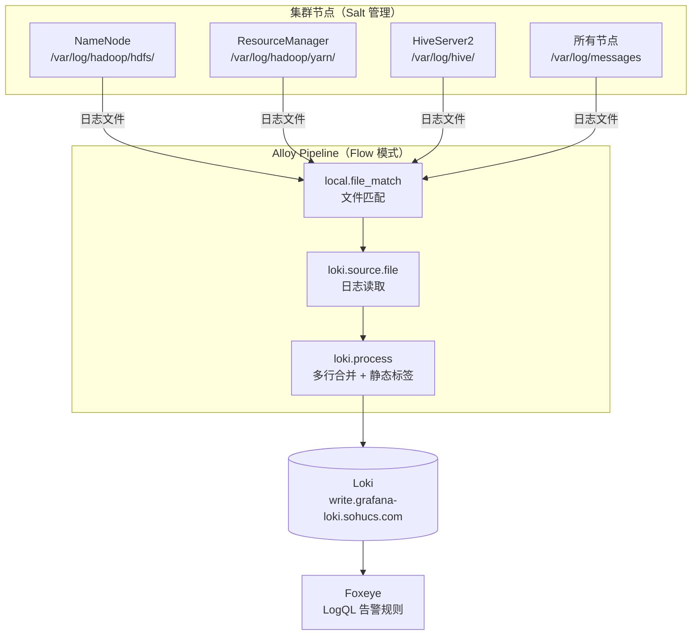

> **[2026-03-18 技术选型变更]** 采集 Agent 由 Promtail 切换为 **Grafana Alloy**（原 Grafana Agent Flow 模式演进版），Salt 模块已按新方案完成开发，代码位于 `salt-states/src/install_alloy/`。

## 🎯 目标与验收标准

### 已完成（截至 3.18）
- [x] 技术选型确认：Promtail → Alloy，基于 Flow 模式，配置模板化，支持多行合并
- [x] Salt State 模块开发完成：`install_alloy.sls`、`start/stop/status_alloy.sls`、systemd unit 模板
- [x] Pillar 分层架构设计：`install_alloy.sls`（全局）+ `host_jobs.sls`（主机差异化）
- [x] `config.alloy.jinja` 模板完成：自动遍历 `default_jobs + extra_jobs + host_jobs[grains['id']]`，生成 local.file_match + loki.source.file + loki.process 组件链
- [x] `host_jobs.sls` 初版生成：覆盖 H3离线、H3实时、H3冷存、H2冷存，包含 NN/RM/DN/NM/HS2/HMS/HBase/ZK 日志配置，60+ 台主机

### 待完成（拆解为独立子任务）
- [ ] 预部署四项验证 → 见 [[Alloy预部署验证：Minion-ID、日志路径与权限核查]]
- [ ] 阶段一：全集群系统日志上线 → 见 [[Alloy阶段一：全集群系统日志上线]]
- [ ] 阶段二：服务级日志按集群逐步接入 → 见 [[Alloy阶段二：服务级日志接入]]

### 整体验收标准（4月前）
- [ ] NN/RM/HS2 三类核心组件日志 100% 接入 Loki，Multiline 策略生效
- [ ] 日志存储压缩率验证：压缩率 ≥ 50%
- [ ] 数据链路端到端可用：从 Foxeye 可触达 Loki 日志查询入口

## ⚙️ 架构设计（已落地）

### 组件架构

```
Panther CMDB
   ↓ (salt state.apply install_alloy)
Salt Master（Pillar 深度合并）
   ├── install_alloy/install_alloy.sls    （全局：binary、Loki endpoint、default_jobs）
   └── install_alloy/host_jobs.sls        （主机差异化：服务级日志）
   ↓
目标主机
   ├── /usr/local/bin/alloy               （v1.5.0）
   ├── /etc/alloy/config.alloy            （Jinja 渲染）
   └── alloy.service                      （systemd，CPUQuota=50%，MemoryLimit=512M）
   ↓
Loki（write.grafana-loki.sohucs.com，tenant: e9e89be363f04160a0e572b08ae0f215）
```

### Pillar 合并顺序

```
default_jobs（系统日志 /var/log/messages）
  + extra_jobs（全局追加，默认空）
  + host_jobs[grains['id']]（服务级日志，按主机精确匹配）
```

### 标签体系

| Label | 含义 | 示例 |
|---|---|---|
| `instance` | 主机（grains['id']） | `dnn014023` |
| `service_name` | 服务 | `hadoop-hdfs`、`hive-hs2` |
| `cluster` | 集群 | `H3离线`、`H3实时` |
| `role` | 角色 | `namenode`、`regionserver` |
| `log_type` | 日志类型 | `service`、`gc` |

## ⚙️ 架构设计图



## 🐛 踩坑日志 (Troubleshooting)
- GC 日志使用年份前缀 `gc-2026*.log`，**每年需更新**，否则新年日志不采集
- `host_jobs` 的 key 必须与 `grains['id']` **完全匹配**（大小写、连字符），否则静默失效
