本文档详细介绍 ATS（Application Timeline Server）高可用方案的技术设计，包括架构原理、核心组件、数据同步策略、故障切换机制以及三大技术隐患的解决方案。

---
## 目录
1. [设计目标与约束](#1-设计目标与约束)
2. [整体架构](#2-整体架构)
3. [核心组件详解](#3-核心组件详解)
4. [三大技术隐患解决方案](#4-三大技术隐患解决方案)
5. [故障切换流程](#5-故障切换流程)
6. [数据同步机制](#6-数据同步机制)
7. [状态机设计](#7-状态机设计)
8. [安全性考虑](#8-安全性考虑)
9. [性能优化](#9-性能优化)
10. [局限性与权衡](#10-局限性与权衡)
11. [v1.2.1 新增特性](#11-v121-新增特性)
---
## 1. 设计目标与约束
### 1.1 设计目标

| 目标        | 描述                     | 实现方式                 |
| --------- | ---------------------- | -------------------- |
| **高可用性**  | 单节点故障时服务自动切换，RTO < 60秒 | Keepalived VIP 漂移    |
| **数据一致性** | 切换后数据不丢失、不损坏           | 分阶段 rsync + 完整性校验    |
| **防止脑裂**  | 任何时刻只有一个节点写入数据         | STONITH 强杀 + Fencing |
| **运维友好**  | 简单部署、易于监控、快速排障         | 详细日志 + 状态文件          |
### 1.2 设计约束

| 约束                  | 原因                        | 影响                 |
| ------------------- | ------------------------- | ------------------ |
| **主备架构**            | ATS 不支持多活，LevelDB 不支持并发写入 | 只能一主一备             |
| **异步同步**            | rsync 基于文件系统，无法实时同步       | RPO > 0，可能丢失最后几秒数据 |
| **依赖 Keepalived**   | 使用 VRRP 协议进行故障检测          | 需要组播网络支持           |
| **Python 3.6.8 兼容** | 生产环境 CentOS 7 默认版本        | 不能使用新语法特性          |
### 1.3 关键指标

```

RPO (Recovery Point Objective) = 同步间隔 + 同步耗时

≈ 5分钟 + 数据量/带宽

RTO (Recovery Time Objective) = 故障检测时间 + VIP 漂移时间 + ATS 启动时间

≈ 15秒 + 3秒 + 30秒

≈ 48秒

```

---
## 2. 整体架构

### 2.1 架构图

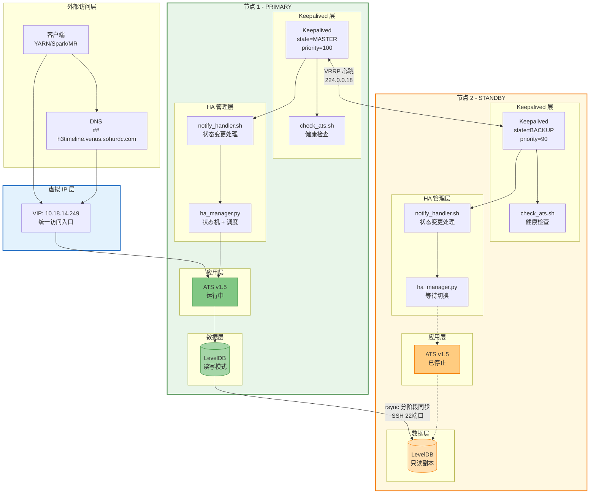
```mermaid

flowchart TB

subgraph External["外部访问层"]

CLIENT["客户端<br/>YARN/Spark/MR"]

DNS["DNS <br/>## h3timeline.venus.sohurdc.com"]

end

subgraph VIPLayer["虚拟 IP 层"]

VIP["VIP: 10.18.14.249<br/>统一访问入口"]

end

subgraph Node1["节点 1 - PRIMARY"]

direction TB

subgraph KA1_Box["Keepalived 层"]

KA1["Keepalived<br/>state=MASTER<br/>priority=100"]

CHK1["check_ats.sh<br/>健康检查"]

end

subgraph HA1_Box["HA 管理层"]

NH1["notify_handler.sh<br/>状态变更处理"]

HAM1["ha_manager.py<br/>状态机 + 调度"]

end

subgraph APP1_Box["应用层"]

ATS1["ATS v1.5<br/>运行中"]

end

subgraph DATA1_Box["数据层"]

LDB1[("LevelDB<br/>读写模式")]

end

KA1 --> CHK1

KA1 --> NH1

NH1 --> HAM1

HAM1 --> ATS1

ATS1 --> LDB1

end

subgraph Node2["节点 2 - STANDBY"]

direction TB

subgraph KA2_Box["Keepalived 层"]

KA2["Keepalived<br/>state=BACKUP<br/>priority=90"]

CHK2["check_ats.sh<br/>健康检查"]

end

subgraph HA2_Box["HA 管理层"]

NH2["notify_handler.sh<br/>状态变更处理"]

HAM2["ha_manager.py<br/>等待切换"]

end

subgraph APP2_Box["应用层"]

ATS2["ATS v1.5<br/>已停止"]

end

subgraph DATA2_Box["数据层"]

LDB2[("LevelDB<br/>只读副本")]

end

KA2 --> CHK2

KA2 --> NH2

NH2 --> HAM2

HAM2 -.-> ATS2

ATS2 -.-> LDB2

end

CLIENT --> DNS

DNS --> VIP

CLIENT --> VIP

VIP --> ATS1

KA1 <--> |"VRRP 心跳<br/>224.0.0.18"| KA2

LDB1 --> |"rsync 分阶段同步<br/>SSH 22端口"| LDB2

style Node1 fill:#e8f5e9,stroke:#2e7d32,stroke-width:2px

style Node2 fill:#fff8e1,stroke:#f57f17,stroke-width:2px

style VIPLayer fill:#e3f2fd,stroke:#1565c0,stroke-width:2px

style ATS1 fill:#81c784,stroke:#388e3c

style ATS2 fill:#ffcc80,stroke:#f57c00

style LDB1 fill:#a5d6a7,stroke:#388e3c

style LDB2 fill:#ffe0b2,stroke:#f57c00

```


### 2.2 组件交互时序


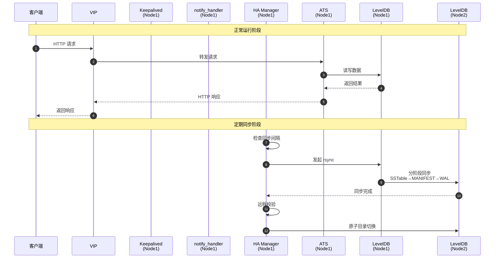
```mermaid

sequenceDiagram

autonumber

participant C as 客户端

participant VIP as VIP

participant KA1 as Keepalived<br/>(Node1)

participant NH1 as notify_handler<br/>(Node1)

participant HAM1 as HA Manager<br/>(Node1)

participant ATS1 as ATS<br/>(Node1)

participant LDB1 as LevelDB<br/>(Node1)

participant LDB2 as LevelDB<br/>(Node2)

Note over C,LDB2: 正常运行阶段

C->>VIP: HTTP 请求

VIP->>ATS1: 转发请求

ATS1->>LDB1: 读写数据

LDB1-->>ATS1: 返回结果

ATS1-->>VIP: HTTP 响应

VIP-->>C: 返回响应

Note over C,LDB2: 定期同步阶段

HAM1->>HAM1: 检查同步间隔

HAM1->>LDB1: 发起 rsync

LDB1->>LDB2: 分阶段同步<br/>SSTable→MANIFEST→WAL

LDB2-->>HAM1: 同步完成

HAM1->>HAM1: 远程校验

HAM1->>LDB2: 原子目录切换

```

### 2.3 组件职责矩阵

| 组件                    | 主要职责                | 输入            | 输出   | 依赖         |
| --------------------- | ------------------- | ------------- | ---- | ---------- |
| **Keepalived**        | VRRP 协议、VIP 管理、健康检查 | VRRP 报文       | 状态通知 | 网络         |
| **check_ats.sh**      | ATS 健康检查            | HTTP 请求       | 退出码  | curl       |
| **notify_handler.sh** | 状态变更处理、STONITH      | Keepalived 通知 | 服务控制 | systemctl  |
| **ha_manager.py**     | 状态机、同步调度            | 状态文件          | 同步任务 | Python     |
| **sync_leveldb.sh**   | 分阶段 rsync           | 源目录           | 目标目录 | rsync, ssh |
| **leveldb_check.py**  | 完整性校验               | LevelDB 目录    | 校验结果 | Python     |

---
## 3. 核心组件详解

### 3.1 Keepalived 配置详解

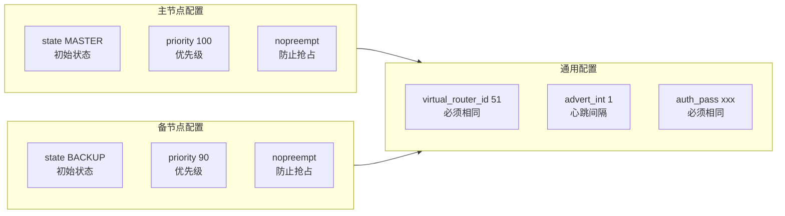
```mermaid

flowchart LR

subgraph Master["主节点配置"]

M1["state MASTER<br/>初始状态"]

M2["priority 100<br/>优先级"]

M3["nopreempt<br/>防止抢占"]

end

subgraph Backup["备节点配置"]

B1["state BACKUP<br/>初始状态"]

B2["priority 90<br/>优先级"]

B3["nopreempt<br/>防止抢占"]

end

subgraph Common["通用配置"]

C1["virtual_router_id 51<br/>必须相同"]

C2["advert_int 1<br/>心跳间隔"]

C3["auth_pass xxx<br/>必须相同"]

end

Master --> Common

Backup --> Common

```

**关键配置项解释**：

| 配置项                 | 值             | 原因               |
| ------------------- | ------------- | ---------------- |
| `state`             | MASTER/BACKUP | 初始角色，实际由优先级决定    |
| `priority`          | 100/90        | 主节点高于备节点，差值足够大   |
| `nopreempt`         | 启用            | 防止原主恢复后自动抢占，减少切换 |
| `virtual_router_id` | 51            | 同一网络不同集群必须不同     |
| `advert_int`        | 1秒            | 心跳间隔，越小检测越快但流量越大 |
| `weight`            | -20           | 健康检查失败时降低的优先级    |
| `fall`              | 3             | 连续失败3次认为故障       |
| `rise`              | 2             | 连续成功2次认为恢复       |

### 3.2 notify_handler.sh 详解

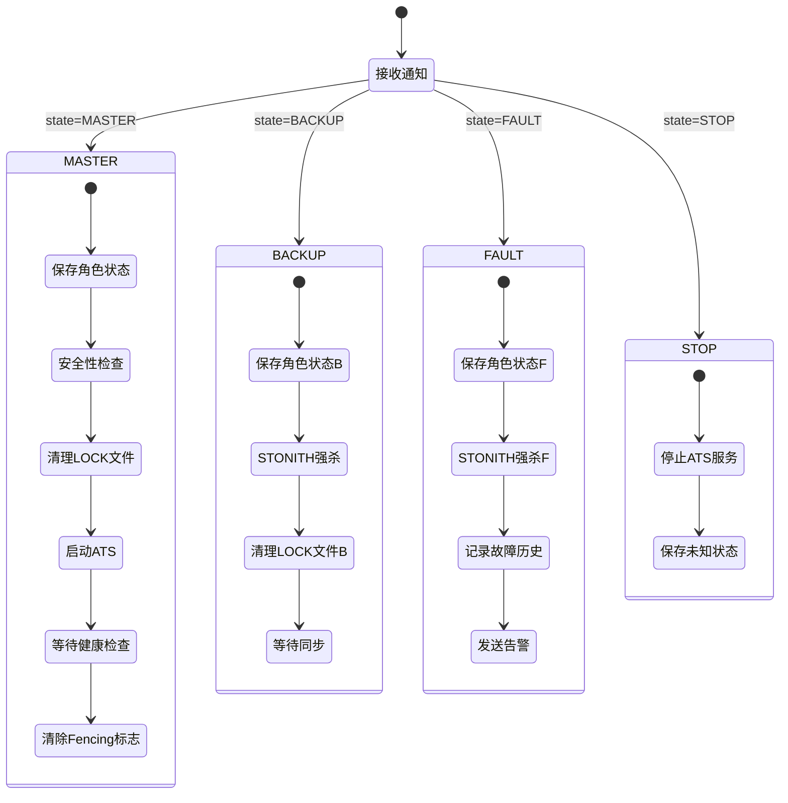
```mermaid

stateDiagram-v2

[*] --> 接收通知

接收通知 --> MASTER: state=MASTER

接收通知 --> BACKUP: state=BACKUP

接收通知 --> FAULT: state=FAULT

接收通知 --> STOP: state=STOP

state MASTER {

[*] --> 保存角色状态

保存角色状态 --> 安全性检查

安全性检查 --> 清理LOCK文件

清理LOCK文件 --> 启动ATS

启动ATS --> 等待健康检查

等待健康检查 --> 清除Fencing标志

}

state BACKUP {

[*] --> 保存角色状态B

保存角色状态B --> STONITH强杀

STONITH强杀 --> 清理LOCK文件B

清理LOCK文件B --> 等待同步

}

state FAULT {

[*] --> 保存角色状态F

保存角色状态F --> STONITH强杀F

STONITH强杀F --> 记录故障历史

记录故障历史 --> 发送告警

}

state STOP {

[*] --> 停止ATS服务

停止ATS服务 --> 保存未知状态

}

```

### 3.3 sync_leveldb.sh 详解

**分阶段同步的技术原理**：

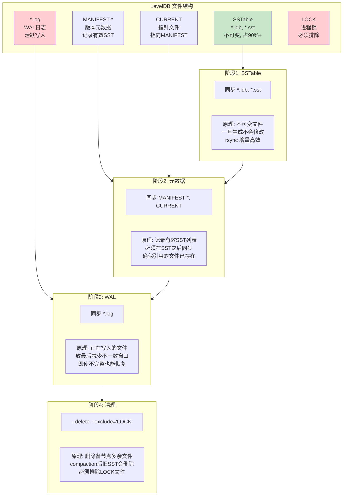
```mermaid

flowchart TB

subgraph LevelDB["LevelDB 文件结构"]

direction LR

SST["SSTable<br/>*.ldb, *.sst<br/>不可变, 占90%+"]

MANIFEST["MANIFEST-*<br/>版本元数据<br/>记录有效SST"]

CURRENT["CURRENT<br/>指针文件<br/>指向MANIFEST"]

WAL["*.log<br/>WAL日志<br/>活跃写入"]

LOCK["LOCK<br/>进程锁<br/>必须排除"]

end

subgraph Phase1["阶段1: SSTable"]

P1["同步 *.ldb, *.sst"]

P1_NOTE["原理: 不可变文件<br/>一旦生成不会修改<br/>rsync 增量高效"]

end

subgraph Phase2["阶段2: 元数据"]

P2["同步 MANIFEST-*, CURRENT"]

P2_NOTE["原理: 记录有效SST列表<br/>必须在SST之后同步<br/>确保引用的文件已存在"]

end

subgraph Phase3["阶段3: WAL"]

P3["同步 *.log"]

P3_NOTE["原理: 正在写入的文件<br/>放最后减少不一致窗口<br/>即使不完整也能恢复"]

end

subgraph Phase4["阶段4: 清理"]

P4["--delete --exclude='LOCK'"]

P4_NOTE["原理: 删除备节点多余文件<br/>compaction后旧SST会删除<br/>必须排除LOCK文件"]

end

SST --> Phase1

MANIFEST --> Phase2

CURRENT --> Phase2

WAL --> Phase3

Phase1 --> Phase2

Phase2 --> Phase3

Phase3 --> Phase4

style SST fill:#c8e6c9

style WAL fill:#ffcdd2

style LOCK fill:#ffcdd2

```


---

## 4. 三大技术隐患解决方案

### A. LevelDB LSM-Tree 分阶段同步

#### 问题分析

LevelDB 使用 LSM-Tree（Log-Structured Merge-Tree）存储引擎，文件结构如下：

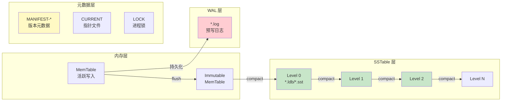
```mermaid

flowchart LR

subgraph MemTable["内存层"]

MT[MemTable<br/>活跃写入]

IMT[Immutable<br/>MemTable]

end

subgraph WAL["WAL 层"]

LOG[*.log<br/>预写日志]

end

subgraph SST["SSTable 层"]

L0[Level 0<br/>*.ldb/*.sst]

L1[Level 1]

L2[Level 2]

LN[Level N]

end

subgraph Meta["元数据层"]

MANIFEST[MANIFEST-*<br/>版本元数据]

CURRENT[CURRENT<br/>指针文件]

LOCK[LOCK<br/>进程锁]

end

MT --> |flush| IMT

IMT --> |compact| L0

L0 --> |compact| L1

L1 --> |compact| L2

L2 --> |compact| LN

MT --> |持久化| LOG

style LOG fill:#ffcdd2

style L0 fill:#c8e6c9

style L1 fill:#c8e6c9

style L2 fill:#c8e6c9

style MANIFEST fill:#fff9c4

```

**风险点**：当 rsync 执行时，主节点 ATS 正在运行：
- WAL 文件 (*.log) 正在不断 append
- MANIFEST 可能会更新（compaction 完成时）
- 如果同时同步所有文件，备节点可能获得不一致的快照
#### 解决方案：分阶段同步

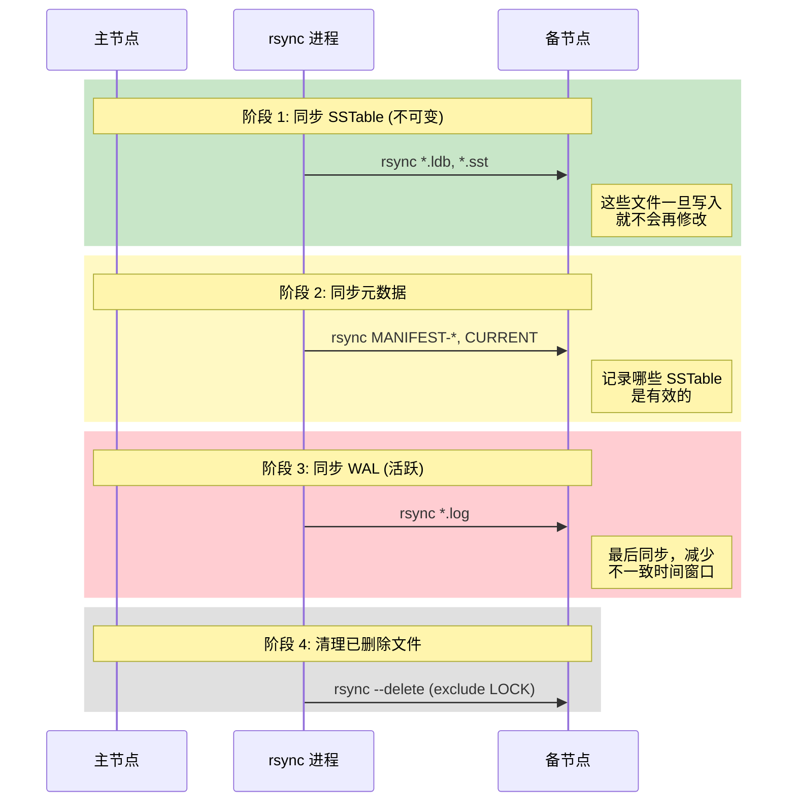
```mermaid

sequenceDiagram

participant Primary as 主节点

participant Rsync as rsync 进程

participant Standby as 备节点

rect rgb(200, 230, 200)

Note over Primary,Standby: 阶段 1: 同步 SSTable (不可变)

Rsync->>Standby: rsync *.ldb, *.sst

Note right of Standby: 这些文件一旦写入<br/>就不会再修改

end

rect rgb(255, 249, 196)

Note over Primary,Standby: 阶段 2: 同步元数据

Rsync->>Standby: rsync MANIFEST-*, CURRENT

Note right of Standby: 记录哪些 SSTable<br/>是有效的

end

rect rgb(255, 205, 210)

Note over Primary,Standby: 阶段 3: 同步 WAL (活跃)

Rsync->>Standby: rsync *.log

Note right of Standby: 最后同步，减少<br/>不一致时间窗口

end

rect rgb(224, 224, 224)

Note over Primary,Standby: 阶段 4: 清理已删除文件

Rsync->>Standby: rsync --delete (exclude LOCK)

end

```

**代码实现** ([sync_leveldb.sh](file:///Users/lihaopeng/go-demos/eino-demos/ats-ha/scripts/sync_leveldb.sh#L239-L350)):

```bash
# 阶段 1: 同步 SSTable 文件 (不可变，最大)
rsync --include='*.ldb' --include='*.sst' --exclude='*' ...

# 阶段 2: 同步元数据文件 (MANIFEST, CURRENT)
rsync --include='MANIFEST-*' --include='CURRENT' --exclude='*' ...

# 阶段 3: 同步 WAL 日志文件 (活跃写入)
rsync --include='*.log' --exclude='*' ...

# 阶段 4: 清理备节点上已删除的文件
rsync --delete --exclude='LOCK' ...
```

**设计考量**：
1. **SSTable 优先**：占数据量 90%+，且不可变，同步过程最稳定
2. **MANIFEST 次之**：记录有效 SSTable 列表，与 SSTable 对应
3. **WAL 最后**：正在写入的文件，放最后减少不一致窗口
4. **排除 LOCK**：进程锁文件不应同步

---
### B. LOCK 文件防御性处理

#### 问题分析

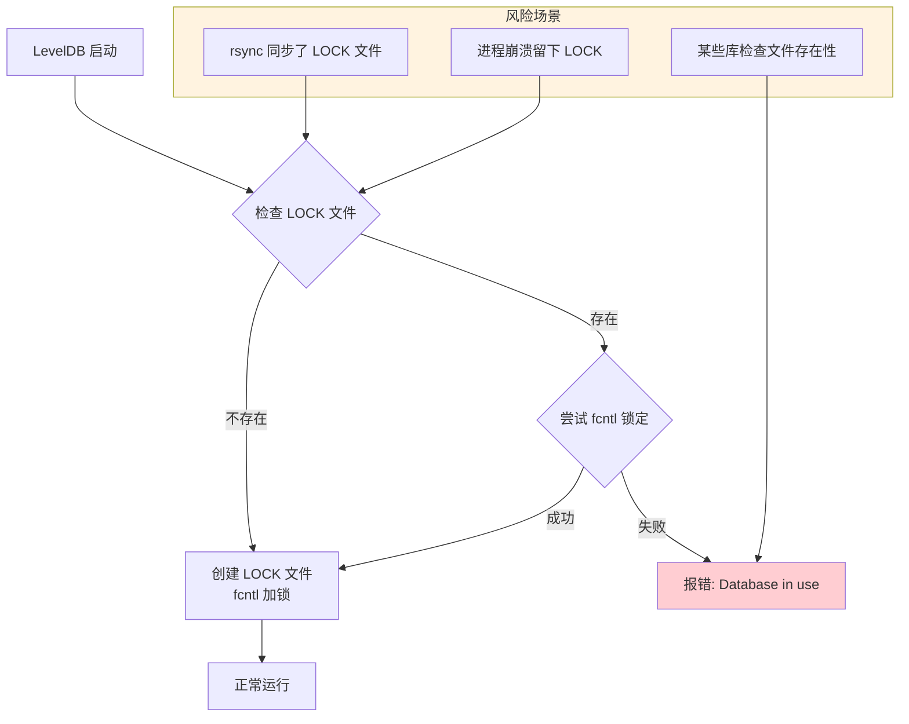
```mermaid

flowchart TD

A[LevelDB 启动] --> B{检查 LOCK 文件}

B -->|不存在| C[创建 LOCK 文件<br/>fcntl 加锁]

B -->|存在| D{尝试 fcntl 锁定}

D -->|成功| C

D -->|失败| E[报错: Database in use]

C --> F[正常运行]

subgraph Risk["风险场景"]

R1[rsync 同步了 LOCK 文件]

R2[进程崩溃留下 LOCK]

R3[某些库检查文件存在性]

end

R1 --> B

R2 --> B

R3 --> E

style E fill:#ffcdd2

style Risk fill:#fff3e0

```


#### 解决方案

**1. rsync 排除 LOCK 文件**（已实现）:

```bash
rsync --exclude='LOCK' ...
```

  
**2. 启动前防御性清理** ([notify_handler.sh](file:///Users/lihaopeng/go-demos/eino-demos/ats-ha/scripts/notify_handler.sh#L160-L175)):

```bash
cleanup_leveldb_lock() {
local lock_file="${LEVELDB_DATA_DIR}/LOCK"
if [[ -f "${lock_file}" ]]; then
	rm -f "${lock_file}" 2>/dev/null || true
fi
}
```

**调用时机**：
- `on_become_master()`: 启动 ATS 前清理
- `on_become_backup()`: 停止 ATS 后清理
- `on_become_fault()`: 进入故障状态后清理

---
### C. 脑裂（Split-Brain）防护

#### 问题分析

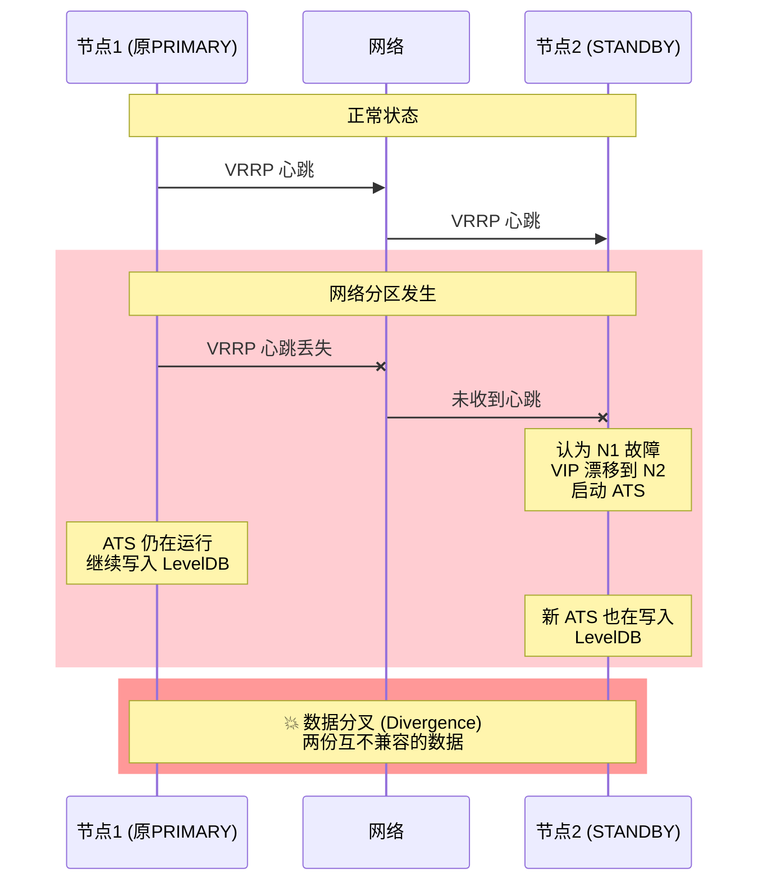
```mermaid

sequenceDiagram

participant N1 as 节点1 (原PRIMARY)

participant Net as 网络

participant N2 as 节点2 (STANDBY)

Note over N1,N2: 正常状态

N1->>Net: VRRP 心跳

Net->>N2: VRRP 心跳

rect rgb(255, 205, 210)

Note over N1,N2: 网络分区发生

N1-xNet: VRRP 心跳丢失

Net-xN2: 未收到心跳

Note over N2: 认为 N1 故障<br/>VIP 漂移到 N2<br/>启动 ATS

Note over N1: ATS 仍在运行<br/>继续写入 LevelDB

Note over N2: 新 ATS 也在写入<br/>LevelDB

end

rect rgb(255, 152, 152)

Note over N1,N2: 💥 数据分叉 (Divergence)<br/>两份互不兼容的数据

end

```

#### 解决方案：强杀逻辑

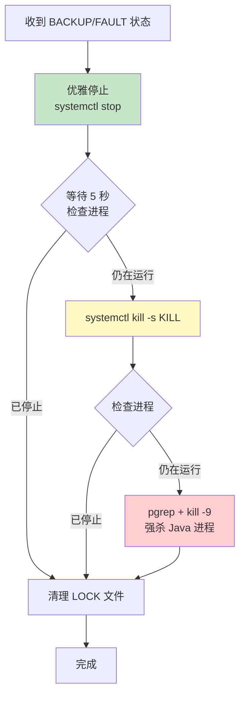
```mermaid

flowchart TD

A[收到 BACKUP/FAULT 状态] --> B[优雅停止<br/>systemctl stop]

B --> C{等待 5 秒<br/>检查进程}

C -->|已停止| G[清理 LOCK 文件]

C -->|仍在运行| D[systemctl kill -s KILL]

D --> E{检查进程}

E -->|已停止| G

E -->|仍在运行| F[pgrep + kill -9<br/>强杀 Java 进程]

F --> G

G --> H[完成]

style B fill:#c8e6c9

style D fill:#fff9c4

style F fill:#ffcdd2

```

**代码实现** ([notify_handler.sh](file:///Users/lihaopeng/go-demos/eino-demos/ats-ha/scripts/notify_handler.sh#L98-L155)):

```bash
force_kill_ats() {
# 步骤 1: 尝试优雅停止
systemctl stop "${ATS_SERVICE}" || true
sleep 5
# 步骤 2: 如果还在运行，systemctl kill
if systemctl is-active --quiet "${ATS_SERVICE}"; then
	systemctl kill -s KILL "${ATS_SERVICE}"
	sleep 2
fi
# 步骤 3: 查找并强杀残留的 Java 进程
local ats_pids=$(pgrep -f "timelineserver")
for pid in ${ats_pids}; do
	kill -9 "${pid}"
done
}
```

**关键设计**：
1. **多级保障**：优雅停止 → systemctl kill → kill -9
2. **进程关键字匹配**：使用 `pgrep -f "timelineserver"` 确保找到所有相关进程
3. **充分等待**：每级之间等待足够时间让进程清理

---
## 5. 故障切换流程

### 5.1 VIP 漂移时序图

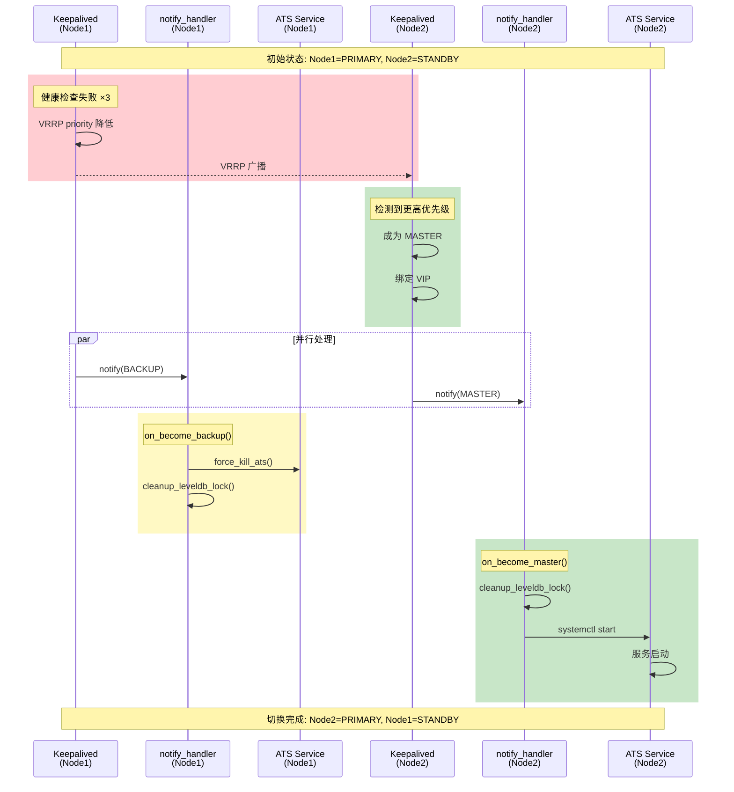
```mermaid

sequenceDiagram

participant KA1 as Keepalived<br/>(Node1)

participant NH1 as notify_handler<br/>(Node1)

participant ATS1 as ATS Service<br/>(Node1)

participant KA2 as Keepalived<br/>(Node2)

participant NH2 as notify_handler<br/>(Node2)

participant ATS2 as ATS Service<br/>(Node2)

Note over KA1,ATS2: 初始状态: Node1=PRIMARY, Node2=STANDBY

rect rgb(255, 205, 210)

Note over KA1: 健康检查失败 ×3

KA1->>KA1: VRRP priority 降低

KA1-->>KA2: VRRP 广播

end

rect rgb(200, 230, 200)

Note over KA2: 检测到更高优先级

KA2->>KA2: 成为 MASTER

KA2->>KA2: 绑定 VIP

end

par 并行处理

KA1->>NH1: notify(BACKUP)

KA2->>NH2: notify(MASTER)

end

rect rgb(255, 249, 196)

Note over NH1: on_become_backup()

NH1->>ATS1: force_kill_ats()

NH1->>NH1: cleanup_leveldb_lock()

end

rect rgb(200, 230, 200)

Note over NH2: on_become_master()

NH2->>NH2: cleanup_leveldb_lock()

NH2->>ATS2: systemctl start

ATS2->>ATS2: 服务启动

end

Note over KA1,ATS2: 切换完成: Node2=PRIMARY, Node1=STANDBY

```

---

## 6. 数据同步机制

### 完整同步流程图


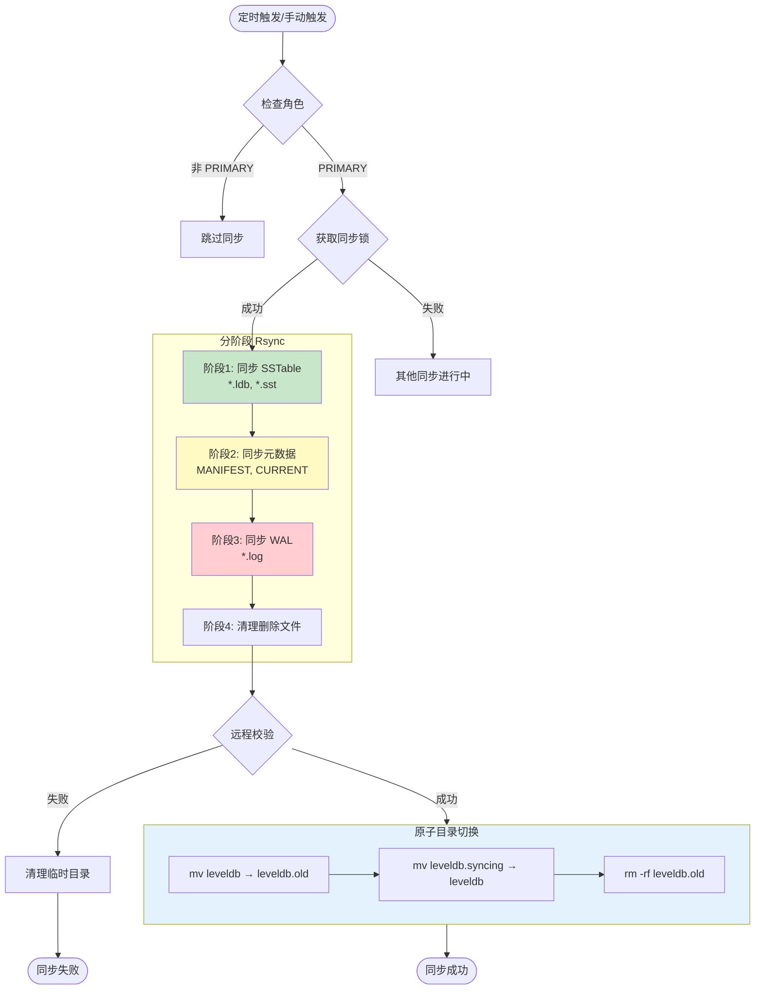
```mermaid

flowchart TB

Start([定时触发/手动触发]) --> CheckRole{检查角色}

CheckRole -->|非 PRIMARY| Skip[跳过同步]

CheckRole -->|PRIMARY| AcquireLock{获取同步锁}

AcquireLock -->|失败| Running[其他同步进行中]

AcquireLock -->|成功| Phase1

subgraph SyncPhases["分阶段 Rsync"]

Phase1[阶段1: 同步 SSTable<br/>*.ldb, *.sst] --> Phase2

Phase2[阶段2: 同步元数据<br/>MANIFEST, CURRENT] --> Phase3

Phase3[阶段3: 同步 WAL<br/>*.log] --> Phase4

Phase4[阶段4: 清理删除文件]

end

Phase4 --> Verify{远程校验}

Verify -->|失败| Cleanup[清理临时目录]

Verify -->|成功| AtomicSwitch

subgraph AtomicSwitch["原子目录切换"]

SW1[mv leveldb → leveldb.old]

SW2[mv leveldb.syncing → leveldb]

SW3[rm -rf leveldb.old]

SW1 --> SW2 --> SW3

end

AtomicSwitch --> Success([同步成功])

Cleanup --> Fail([同步失败])

style Phase1 fill:#c8e6c9

style Phase2 fill:#fff9c4

style Phase3 fill:#ffcdd2

style AtomicSwitch fill:#e3f2fd

```


### 双缓冲目录结构

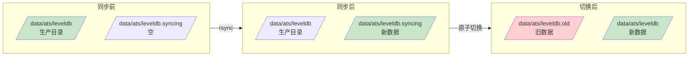
```mermaid

flowchart LR

subgraph BeforeSync["同步前"]

P1[/data/ats/leveldb<br/>生产目录/]

T1[/data/ats/leveldb.syncing<br/>空/]

end

subgraph AfterSync["同步后"]

P2[/data/ats/leveldb<br/>生产目录/]

T2[/data/ats/leveldb.syncing<br/>新数据/]

end

subgraph AfterSwitch["切换后"]

O3[/data/ats/leveldb.old<br/>旧数据/]

P3[/data/ats/leveldb<br/>新数据/]

end

BeforeSync --> |rsync| AfterSync

AfterSync --> |原子切换| AfterSwitch

style P1 fill:#c8e6c9

style T2 fill:#c8e6c9

style P3 fill:#c8e6c9

style O3 fill:#ffcdd2

```

  ---

## 部署与运维

### 快速部署清单

```bash
# 1. 安装依赖
yum install -y keepalived rsync python3
pip3 install pyyaml

# 2. 创建目录
mkdir -p /opt/ats-ha /var/lib/ats-ha /var/log/ats-ha
mkdir -p /data/ats/{leveldb,leveldb.syncing} 

# 3. 部署文件
scp -r ats-ha/ root@node1:/opt/
scp -r ats-ha/ root@node2:/opt/

# 4. 配置 SSH 免密
ssh-keygen -t rsa -N ""
ssh-copy-id root@peer_node  

# 5. 修改配置
vim /opt/ats-ha/config/ha_config.yaml
vim /etc/keepalived/keepalived.conf

# 6. 启动服务
systemctl enable --now keepalived
systemctl enable --now ats-ha-manager
```

### 运维命令速查

| 操作               | 命令                                                               |
| ---------------- | ---------------------------------------------------------------- |
| 查看当前角色           | `cat /var/lib/ats-ha/current_role`                               |
| 查看同步状态           | `cat /var/lib/ats-ha/sync_status`                                |
| 查看 VIP 位置        | `ip addr \| grep 192.168.1.100`                                  |
| 手动触发同步           | `/opt/ats-ha/scripts/sync_leveldb.sh --debug`                    |
| 校验 LevelDB       | `python3 /opt/ats-ha/scripts/leveldb_check.py /data/ats/leveldb` |
| 查看 HA Manager 日志 | `tail -f /var/log/ats-ha/ha_manager.log`                         |
| 查看同步日志           | `tail -f /var/log/ats-ha/sync_leveldb.log`                       |

### 故障诊断流程

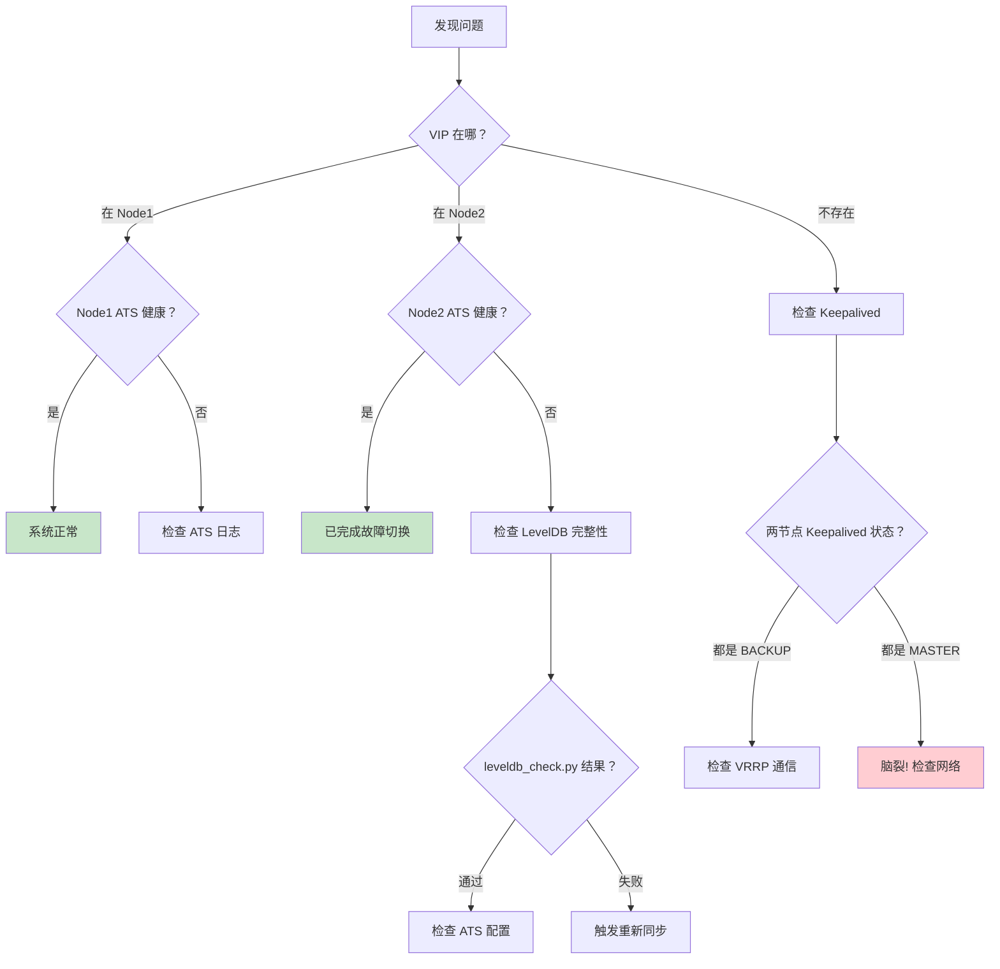
```mermaid

flowchart TD

A[发现问题] --> B{VIP 在哪？}

B -->|在 Node1| C{Node1 ATS 健康？}

B -->|在 Node2| D{Node2 ATS 健康？}

B -->|不存在| E[检查 Keepalived]

C -->|是| F[系统正常]

C -->|否| G[检查 ATS 日志]

D -->|是| H[已完成故障切换]

D -->|否| I[检查 LevelDB 完整性]

E --> J{两节点 Keepalived 状态？}

J -->|都是 BACKUP| K[检查 VRRP 通信]

J -->|都是 MASTER| L[脑裂! 检查网络]

I --> M{leveldb_check.py 结果？}

M -->|通过| N[检查 ATS 配置]

M -->|失败| O[触发重新同步]

style L fill:#ffcdd2

style F fill:#c8e6c9

style H fill:#c8e6c9

```

  
---

## 配置参考

### ha_config.yaml 完整配置

```yaml
```yaml
# 节点配置
nodes:
  local:
    hostname: "node1"
    ip: "192.168.1.1"
  peer:
    hostname: "node2"
    ip: "192.168.1.2"
    ssh_user: "root"
    ssh_port: 22

# VIP 配置
vip:
  address: "192.168.1.100"
  interface: "eth0"

# LevelDB 配置
leveldb:
  data_dir: "/data/ats/leveldb"
  sync_temp_dir: "/data/ats/leveldb.syncing"
  old_dir: "/data/ats/leveldb.old"
  check_tool: "/opt/ats-ha/scripts/leveldb_check.py"
  check_sample_count: 1000

# 同步配置
sync:
  enabled: true
  interval: 300           # 同步间隔（秒）
  timeout: 3600           # 同步超时（秒）
  bandwidth_limit: 0      # 带宽限制 (KB/s)，0=无限制

# ATS 服务配置
ats:
  service_name: "hadoop-yarn-timelineserver"
  health_url: "http://localhost:8188/ws/v1/timeline/about"
  health_timeout: 5
  start_timeout: 60
  stop_timeout: 30

# 日志配置
logging:
  dir: "/var/log/ats-ha"
  level: "INFO"

# 状态文件配置
state:
  dir: "/var/lib/ats-ha"
  lock_file: "/var/lib/ats-ha/ha_manager.lock"
``````

---

## 7. 状态机设计

### 7.1 角色状态机

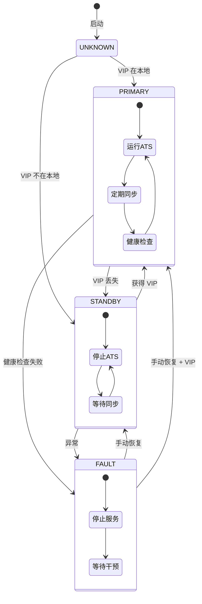
```mermaid

stateDiagram-v2

[*] --> UNKNOWN: 启动

UNKNOWN --> PRIMARY: VIP 在本地

UNKNOWN --> STANDBY: VIP 不在本地

PRIMARY --> STANDBY: VIP 丢失

PRIMARY --> FAULT: 健康检查失败

STANDBY --> PRIMARY: 获得 VIP

STANDBY --> FAULT: 异常

FAULT --> STANDBY: 手动恢复

FAULT --> PRIMARY: 手动恢复 + VIP

state PRIMARY {

[*] --> 运行ATS

运行ATS --> 定期同步

定期同步 --> 健康检查

健康检查 --> 运行ATS

}

state STANDBY {

[*] --> 停止ATS

停止ATS --> 等待同步

等待同步 --> 停止ATS

}

state FAULT {

[*] --> 停止服务

停止服务 --> 等待干预

}

```

### 7.2 状态转换条件

| 当前状态 | 目标状态    | 触发条件      | 执行动作                  |
| ---- | ------- | --------- | --------------------- |
| ANY  | PRIMARY | VIP 绑定到本地 | 清理LOCK → 启动ATS → 健康检查 |
| ANY  | STANDBY | VIP 不在本地  | STONITH强杀 → 清理LOCK    |
| ANY  | FAULT   | 健康检查连续失败  | STONITH强杀 → 发送告警      |

---

## 8. 安全性考虑

### 8.1 网络安全

| 风险点         | 防护措施                   |
| ----------- | ---------------------- |
| SSH 连接被劫持   | 使用密钥认证，禁用密码登录          |
| VRRP 报文伪造   | 配置 `auth_type PASS` 认证 |
| rsync 数据被篡改 | 使用 SSH 隧道加密传输          |
| 未授权访问 VIP   | 防火墙限制 8188 端口来源        |

### 8.2 操作安全

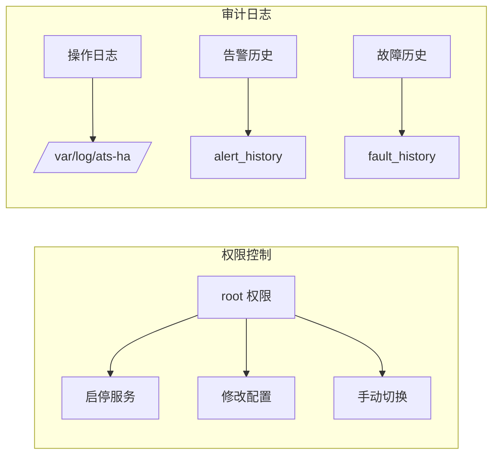
```mermaid

flowchart LR

subgraph 权限控制

A[root 权限] --> B[启停服务]

A --> C[修改配置]

A --> D[手动切换]

end

subgraph 审计日志

E[操作日志] --> F[/var/log/ats-ha/]

G[告警历史] --> H[alert_history]

I[故障历史] --> J[fault_history]

end

```

### 8.3 密钥管理建议

```bash
# 1. 生成专用密钥对
ssh-keygen -t ed25519 -f /root/.ssh/ats_ha_key -N ""

# 2. 限制密钥权限
chmod 600 /root/.ssh/ats_ha_key 

# 3. 配置 SSH 使用指定密钥
# 在 ha_config.yaml 中配置 ssh_key_file
```

---

## 9. 性能优化

### 9.1 同步性能优化

| 优化项   | 配置                            | 效果                |
| ----- | ----------------------------- | ----------------- |
| 带宽限制  | `sync.bandwidth_limit: 50000` | 限制为 50MB/s，避免影响业务 |
| 压缩传输  | rsync `-z` 参数                 | 减少传输量 30-50%      |
| 增量同步  | rsync 默认行为                    | 只传输变化部分           |
| 分阶段同步 | SSTable → MANIFEST → WAL      | 提高一致性成功率          |

### 9.2 故障检测性能

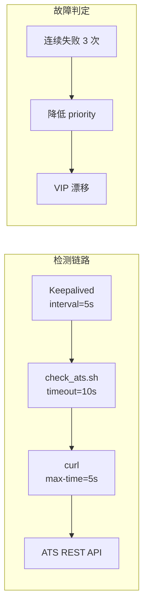
```mermaid

flowchart LR

subgraph 检测链路

A[Keepalived<br/>interval=5s] --> B[check_ats.sh<br/>timeout=10s]

B --> C[curl<br/>max-time=5s]

C --> D[ATS REST API]

end

subgraph 故障判定

E[连续失败 3 次] --> F[降低 priority]

F --> G[VIP 漂移]

end

```

**故障检测时间计算**：
```
最快检测时间 = interval × fall = 5 × 3 = 15秒
最慢检测时间 = interval × fall + timeout = 5 × 3 + 10 = 25秒
```

### 9.3 资源占用

| 组件              | CPU   | 内存      | 磁盘 IO  |
| --------------- | ----- | ------- | ------ |
| Keepalived      | < 1%  | < 10MB  | 极低     |
| ha_manager.py   | < 1%  | < 50MB  | 低      |
| sync_leveldb.sh | 5-20% | < 100MB | 高（同步时） |
| check_ats.sh    | < 1%  | < 5MB   | 无      |

---
  
## 10. 局限性与权衡

### 10.1 已知局限性

| 局限性 | 原因 | 影响 | 缓解措施 |
|-------|------|------|---------|
| **RPO > 0** | 异步同步 | 可能丢失最后几秒数据 | 缩短同步间隔 |
| **单点写入** | LevelDB 不支持多写 | 无法多活 | 使用其他存储引擎 |
| **依赖网络** | rsync 基于 SSH | 网络故障影响同步 | 监控网络质量 |
| **手动恢复** | FAULT 状态需人工 | 不能自动恢复 | 告警及时响应 |

### 10.2 设计权衡


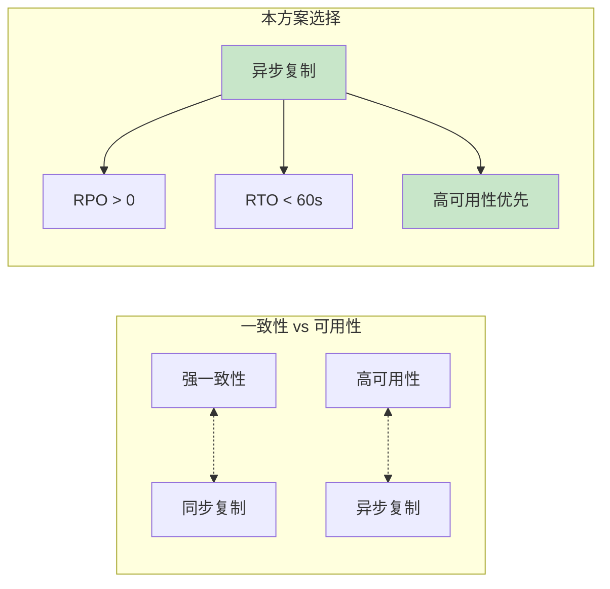
```mermaid

flowchart LR

subgraph 一致性 vs 可用性

A[强一致性] <-.-> B[同步复制]

C[高可用性] <-.-> D[异步复制]

end

subgraph 本方案选择

E[异步复制] --> F[RPO > 0]

E --> G[RTO < 60s]

E --> H[高可用性优先]

end

style E fill:#c8e6c9

style H fill:#c8e6c9

```

### 10.3 不适用场景

> [!CAUTION]
> 以下场景不适合使用本方案：
> 1. **零数据丢失要求**：RPO=0 的场景需要同步复制
> 2. **多活部署**：需要使用支持多写的存储引擎
> 3. **跨地域容灾**：网络延迟会严重影响同步性能
> 4. **大数据量**：LevelDB > 100GB 时同步时间过长

---

## 11. v1.2.1 新增特性

### 11.1 多分片目录结构支持

ATS v1.5 使用时间分片机制存储数据，实际目录结构如下：

```
/data_b/hadoop/yarn/timeline/
├── leveldb-timeline-store/
│ ├── entity-ldb.2026-01-15-07/ # 实体数据分片 (小时级)
│ ├── entity-ldb.2026-01-15-08/
│ ├── ... # 70+ 分片
│ ├── indexes-ldb.2026-01-15-07/ # 索引数据分片
│ ├── indexes-ldb.2026-01-15-08/
│ ├── ... # 70+ 分片
│ ├── domain-ldb/ # 全局域信息
│ ├── owner-ldb/ # 所有者索引
│ └── starttime-ldb/ # 启动时间索引
└── timeline-state-store.ldb/ # ATS 状态存储
```

**实现要点**：

1. **rsync 递归同步** (`sync_leveldb.sh`)：

```bash
# 使用 --include='*/' 保留目录结构，递归匹配所有子目录
rsync --include='*/' --include='*.ldb' --include='*.sst' --exclude='*' ...
```

2. **递归校验** (`leveldb_check.py --recursive`)：
```python
def find_leveldb_directories(base_path):
# 递归查找所有包含 CURRENT 文件的目录

for current_file in base.rglob('CURRENT'):
	yield current_file.parent

```

3. **递归清理 LOCK 文件**：
```bash
find ${LEVELDB_SYNC_TEMP} -name 'LOCK' -type f -delete
```

### 11.2 磁盘可写性探活

**问题场景**：磁盘损坏导致文件系统变为只读，ATS 无法写入数据，但 API 可能仍然响应（读取缓存），导致健康检查误判为正常。


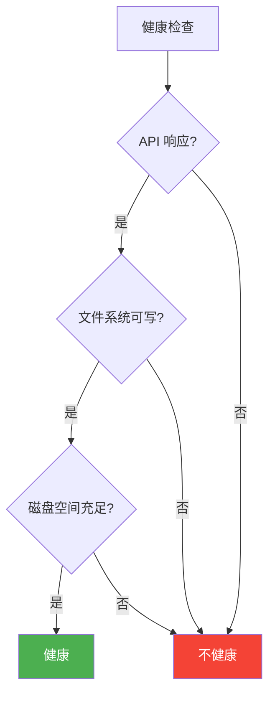
```mermaid

flowchart TD

A[健康检查] --> B{API 响应?}

B -->|是| C{文件系统可写?}

B -->|否| FAIL[不健康]

C -->|是| D{磁盘空间充足?}

C -->|否| FAIL

D -->|是| OK[健康]

D -->|否| FAIL

style FAIL fill:#f44336,color:#fff

style OK fill:#4caf50,color:#fff

```

**实现** (`check_ats.sh`)：

```bash

```bash
# 1. 检查文件系统挂载状态
check_mount_status() {
    local mount_opts=$(findmnt -n -o OPTIONS --target "${check_dir}")
    if [[ "${mount_opts}" == *"ro"* ]]; then
        return 1  # 只读挂载
    fi
}

# 2. 实际写入测试
check_disk_writable() {
    local test_file="${check_dir}/.ats_ha_write_test"
    if echo "$(date +%s)" > "${test_file}" 2>/dev/null; then
        rm -f "${test_file}"
        return 0
    fi
    return 1  # 写入失败
}

# 3. 磁盘空间检查
check_disk_space() {
    local usage=$(df "${check_dir}" | tail -1 | awk '{print $5}' | tr -d '%')
    if [[ "${usage}" -ge 99 ]]; then
        return 1  # 磁盘已满
    fi
}
```

**触发条件**：
- 文件系统以只读方式挂载 (`ro`)
- 无法创建/写入测试文件
- 磁盘使用率 >= 99%

---

## 12. v1.4.0 Controller 模式架构

### 12.1 设计背景

**问题分析**：Keepalived 的 notify 脚本是"边缘触发"（Edge-Triggered），只在状态变化瞬间执行一次。
 
| 风险场景 | 后果 |
|---------|------|
| notify 脚本执行失败 | ATS 未启动，VIP 已漂移，服务不可用 |
| notify 脚本执行一半挂掉 | 状态不一致，可能脑裂 |
| Keepalived 认为切换成功但 ATS 未起 | 服务中断 |
| 数据同步方向搞反 | **灾难性数据丢失** |

**解决方案**：引入 Kubernetes Controller 风格的"水平触发"（Level-Triggered）状态调和机制。

### 12.2 双触发架构


```
┌─────────────────────────────────────────────────────────────────┐
│                    ATS HA 双触发架构                              │
├─────────────────────────────────────────────────────────────────┤
│                                                                 │
│  ┌─────────────────────┐     ┌─────────────────────────────┐    │
│  │  Edge-Triggered     │     │  Level-Triggered            │    │
│  │  (边缘触发)          │     │  (水平触发)                  │     │
│  ├─────────────────────┤     ├─────────────────────────────┤    │
│  │  notify_handler.sh  │     │  ha_manager.py daemon       │    │
│  ├─────────────────────┤     ├─────────────────────────────┤    │
│  │ • 更新角色状态文件     │     │ • 持续检查 VIP 位置          │    │
│  │ • 紧急 STONITH       │     │ • 服务状态调和 (自愈)        │     │
│  │ • 尝试启动 ATS       │     │ • 数据同步调度               │     │
│  │ • 发送告警           │     │ • 健康检查                   │    │
│  ├─────────────────────┤     ├─────────────────────────────┤   │
│  │ 触发时机:            │     │ 触发时机:                    │    │
│  │ Keepalived 状态变化  │     │ 每 5 秒循环                  │    │
│  │ (一次性)             │     │ (持续运行)                   │    │
│  └─────────────────────┘     └─────────────────────────────┘    │
│                                                                 │
│  双保险: 即使 notify 失败，daemon 会在 5 秒内自动修复           │
│                                                                 │
└─────────────────────────────────────────────────────────────────┘
```

### 12.3 Controller 状态调和流程

```python
def _reconcile_loop(self):
    """每 5 秒执行一次"""
    
    # Step 1: 角色仲裁 (以 VIP 为最高准则)
    vip_present = self.vip_monitor.is_vip_local()
    actual_role = Role.PRIMARY if vip_present else Role.STANDBY
    
    # Step 2: 服务调和
    if actual_role == Role.PRIMARY:
        if not self.ats_manager.is_running():
            self.ats_manager.start()  # 自愈启动
    elif actual_role == Role.STANDBY:
        if self.ats_manager.is_running():
            self.ats_manager.force_kill()  # 安全停止
    
    # Step 3: 数据调和 (只有 PRIMARY 才能同步)
    if actual_role == Role.PRIMARY:
        if self.vip_monitor.is_vip_local():  # 双重确认
            self.sync_manager.execute_sync()
```

### 12.4 安全保障

| 保障机制 | 实现方式 |
|---------|---------|
| **防止同步反向** | 只有 VIP 在本地的节点才执行同步 |
| **防止通知丢失** | daemon 5 秒内发现并自愈 |
| **防止脑裂残留** | daemon 发现 VIP 不在但 ATS 运行时强杀 |
| **双重角色确认** | 同时检查 VIP 和状态文件 |

---
