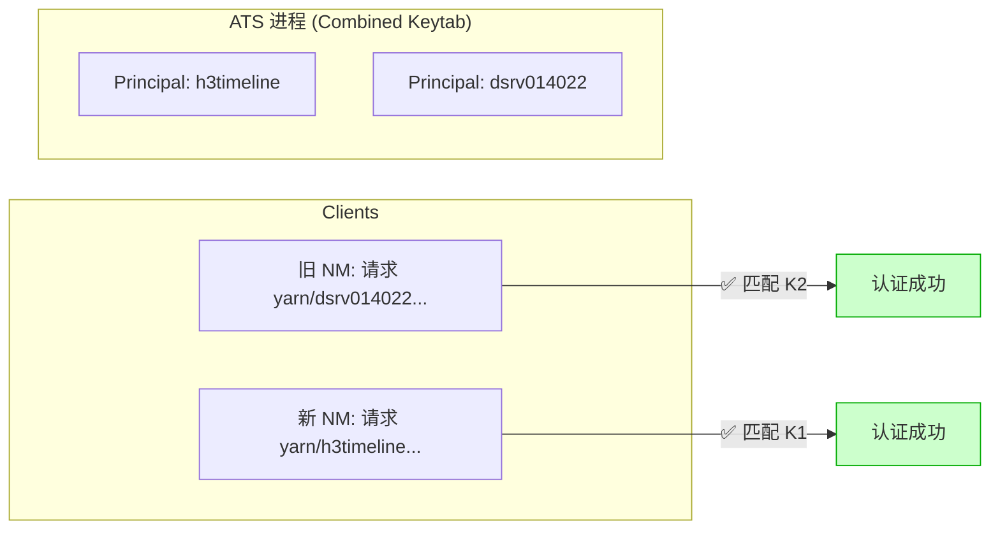
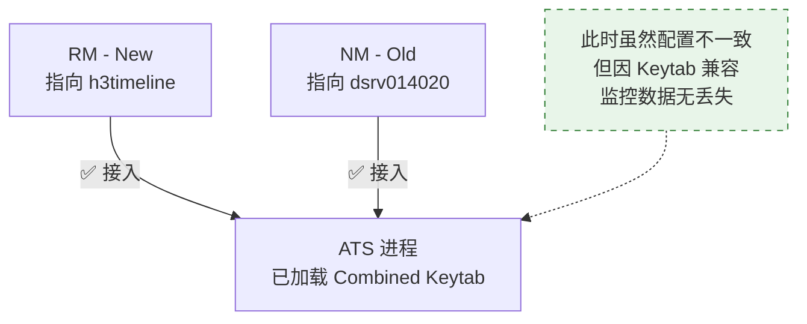
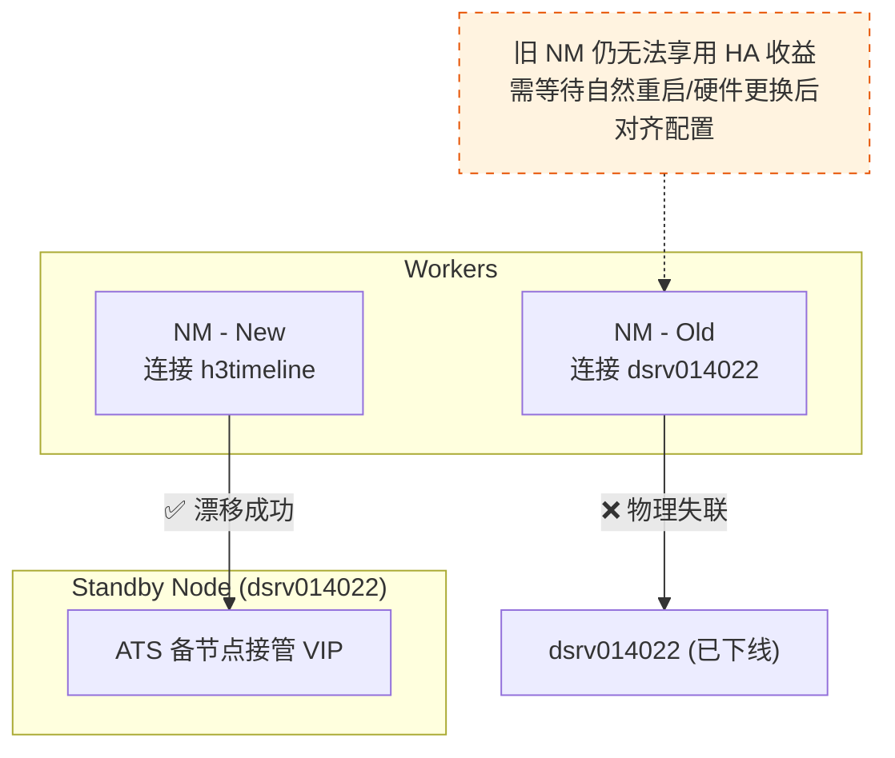

# ATS HA 域名切换与 Keytab 兼容性执行手册

## 1. 核心任务定义
将 YARN TimelineServer (ATS) 的访问入口从原有的物理单点域名（`dsrv014022` 等）切换为高可用虚拟域名（`h3timeline.venus.sohurdc.com`），实现全集群客户端的 HA 接入。

---

## 2. 【核心瓶颈】为什么必须合并 Keytab？ (The Kerberos Trap)

在开启 Kerberos 的集群中，身份校验是**基于 Hostname 严格匹配**的。目前实测暴露了以下致命冲突：

### 2.1 现状分析
- **客户端行为**：NM 在未更新配置前，仍会请求 `yarn/dsrv014022...` 的 Ticket。
- **服务端现状**：当前的 `timeline.ha.keytab` **仅包含** `yarn/h3timeline...` 的 Principal。
- **因果风险**：由于 ATS 是原地升级（物理机没变），一旦应用新 Keytab，所有旧配置 NM 将因无法在服务端 Keytab 中找到对应 Principal 而**认证全量失败**，导致监控断流和作业延迟。

### 2.2 解决方案：构建多 Principal 混合 Keytab
**必须执行前置逻辑**：将物理机 Principal 和 HA Principal 强行合并。只有这样，ATS 进程才能同时识别“旧物理名”和“新 HA 名”的访问请求。

### 2.3 实现方法 (ktutil 实操)
在两台 ATS 主机（14020, 14022）上执行以下操作：
```bash
# 进入 ktutil 工具
ktutil

# 读取新生成的 HA Keytab
read_kt /etc/security/keytabs/timeline.ha.keytab

# 读取原有的物理机服务 Keytab
read_kt /etc/security/keytabs/yarn.service.keytab

# 将合并后的内容写入新文件
write_kt /etc/security/keytabs/timeline.combined.keytab
quit

# 验证合并结果（应同时看到 h3timeline 和 dsrv01402x）
klist -kt /etc/security/keytabs/timeline.combined.keytab
```

### 2.4 【关键确认】分发与有效性核验清单
在修改 Ambari 配置前，必须在 **两台 ATS 主机** 上逐一手动执行以下核验：

**1. 物理文件与权限检查**
确保文件已就绪且 YARN 进程有读取权限（通常为 `yarn:hadoop`）：
```bash
ls -la /etc/security/keytabs/timeline.combined.keytab
# 期望：-r--r----- 1 yarn hadoop ...
```

**2. Principal 完整性校验**
确认 Keytab 同时包含“物理名”和“HA名”：
```bash
klist -kt /etc/security/keytabs/timeline.combined.keytab | grep -E "h3timeline|dsrv014020|dsrv014022"
# 期望：输出包含上述所有关键域名的 Principal 列表
```

**3. 【终极探活】模拟认证测试**
在不启动 ATS 进程的情况下，手动模拟“旧 NM”和“新 NM”的身份进行认证。如果这两条命令都能成功获取 Ticket，说明安全垫已铺好：
```bash
# 模拟旧 NM 的认证请求（针对 14020 节点）
kinit -kt /etc/security/keytabs/timeline.combined.keytab yarn/dsrv014020.venus.sohurdc.com@VENUS.SOHURDC.COM

# 模拟新 HA 域名的认证请求
kinit -kt /etc/security/keytabs/timeline.combined.keytab yarn/h3timeline.venus.sohurdc.com@VENUS.SOHURDC.COM

# 检查 ticket 缓存
klist
```
> **注意**：如果上述 `kinit` 报错 `Key table entry not found`，严禁修改 Ambari 配置！

---

## 3. 实施路径：Ambari 配置修改指引

在确认 **`timeline.combined.keytab`** 已分发并配置生效后，方可进行以下 Ambari 配置修改（hadoop3 集群）：

| 配置项 (Property) | 建议修改值 (New) | 影响面 |
| :--- | :--- | :--- |
| `yarn.timeline-service.hostname` | **`h3timeline.venus.sohurdc.com`** | 全局入口锚点 |
| `yarn.timeline-service.address` | `h3timeline...:10200` | RPC 协议地址 |
| `yarn.timeline-service.webapp.address` | `h3timeline...:8188` | HTTP 访问地址 |
| `yarn.timeline-service.keytab` | `/etc/security/.../timeline.combined.keytab` | **认证核心文件** |

---

## 4. 中间状态的演进与风险评估 (Mermaid 模拟)

### 4.1 认证逻辑：合并 Keytab 后的“全兼容”模式
合并 Keytab 建立了平滑迁移的“安全垫”，允许新旧配置 NM 并存。



### 4.2 场景演进：从混合到对齐

**状态 A：部分重启（RM 已更新，NM 待更新）——【安全运行期】**
得益于合并 Keytab，即便配置不对齐，监控数据依然能正常汇聚。



**状态 B：高可用挑战（故障切换 Failover）——【剩余风险项】**
这是合并 Keytab 后**唯一**无法规避的风险。



---

## 5. 组件影响分析矩阵 (用于滚动更新参考)

| 组件 | 依赖行为 | 重启必要性 |
| :--- | :--- | :--- |
| **YARN RM** | 推送 App 生命周期事件 | **必须重启**。否则新 App 无法在 HA 界面显示。 |
| **YARN NM** | 推送 Container 指标 | **建议重启**。未重启前不具备高可用保障。 |
| **Tez/Spark** | 客户端日志注册 | **无需重启**。新作业提交时自动读取最新 `yarn-site.xml`。 |

---

## 💡 灵感与脑洞 (Brainstorm)
- **Host 欺骗方案**：如果某批 NM 确实无法重启，可以尝试在操作系统层面修改 `/etc/hosts`，将 `dsrv014022` 指向 VIP 地址。
- **自动化预检脚本**：在 Ambari 保存配置前，编写 Python 脚本检查集群所有 NM 节点的 `yarn-site.xml` 刷新状态。
