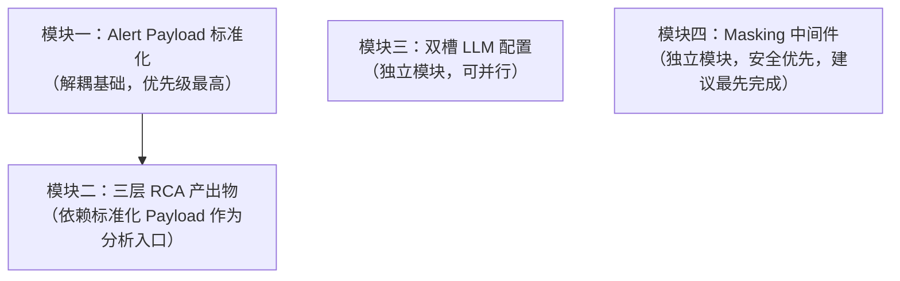

# SRE Copilot 工程增强需求分析说明书

> **来源**：基于 OpenSRE (https://opensre.com) 调研，提炼 4 个适配我方大数据集群场景的工程改进方向  
> **背景**：OpenSRE 本身不适合直接集成（见 [[OpenSRE调研报告]]），但其设计模式对 SRE Copilot 的工程演进有直接参考价值  
> **当前 SRE Copilot 路径**：`/Users/lihaopeng/CascadeProjects/zabbix-foxeye-transfer`（Go + eino，后端）

---

## 模块一：Alert Payload 标准化入口

### 1.1 问题背景

当前 SRE Copilot 根因分析的告警入口由 Foxeye Webhook 硬编码驱动，Webhook Handler 直接解析 Foxeye 的 JSON 格式并喂给 Master Agent。随着后续新增告警源（Ambari 原生告警、Loki 日志告警、Zabbix 残留告警），Agent 将面临**多种 JSON 格式的强耦合**，每新增一类告警源就需要改动 Agent 逻辑。

```
当前架构（耦合问题）：
  Foxeye Webhook → Handler 直接解析 Foxeye JSON → Master Agent
  Ambari Webhook → ??? 格式不同，需单独处理
  Loki AlertRule → ??? 格式又不同，再单独处理
```

### 1.2 目标

定义统一的内部 `AlertPayload` 结构体，在 Webhook Handler 层各告警源只需实现一个适配器接口，输出标准 payload，Master Agent 始终只处理统一格式。

```
目标架构（解耦）：
  Foxeye Webhook → FoxeyeAdapter → StandardAlertPayload → Master Agent
  Ambari Webhook → AmbarAdapter → StandardAlertPayload → Master Agent
  Loki AlertRule → LokiAdapter  → StandardAlertPayload → Master Agent
```

### 1.3 标准 AlertPayload 数据结构设计

```go
// StandardAlertPayload 是所有告警源的统一入口格式
type StandardAlertPayload struct {
    // 元信息
    ID          string    `json:"id"`           // 唯一 ID（UUID）
    ReceivedAt  time.Time `json:"received_at"`  // 到达 SRE Copilot 的时间
    Source      AlertSource `json:"source"`     // 告警来源

    // 告警核心信息
    Name        string    `json:"name"`         // 告警名称（人可读）
    Severity    Severity  `json:"severity"`     // critical/warning/info
    Status      AlertStatus `json:"status"`     // firing/resolved
    StartsAt    time.Time `json:"starts_at"`   // 告警触发时间
    EndsAt      *time.Time `json:"ends_at"`    // 告警恢复时间（firing 时为 nil）

    // 维度标签（统一 Label 体系）
    Labels      map[string]string `json:"labels"` // cluster/service/component/host 等
    
    // 告警内容
    Summary     string `json:"summary"`    // 简短描述（一句话）
    Description string `json:"description"` // 详细描述（含阈值、当前值等）
    GeneratorURL string `json:"generator_url"` // 跳转链接（Grafana/Foxeye 大盘）

    // 原始 Payload（保留原文，供 Agent 必要时回溯）
    RawPayload  json.RawMessage `json:"raw_payload"`
}

type AlertSource string
const (
    SourceFoxeye  AlertSource = "foxeye"
    SourceAmbari  AlertSource = "ambari"
    SourceZabbix  AlertSource = "zabbix"
    SourceLoki    AlertSource = "loki"
)

type Severity string
const (
    SeverityCritical Severity = "critical"
    SeverityWarning  Severity = "warning"
    SeverityInfo     Severity = "info"
)
```

### 1.4 适配器接口

```go
// AlertAdapter 每类告警源实现此接口
type AlertAdapter interface {
    // Parse 将原始 HTTP 请求 body 转换为标准 payload
    Parse(body []byte) (*StandardAlertPayload, error)
    // Source 返回告警来源标识
    Source() AlertSource
}
```

### 1.5 需要新增/修改的文件

| 操作 | 文件路径 | 内容 |
|---|---|---|
| 新增 | `backend/internal/alert/payload.go` | `StandardAlertPayload` 结构体定义 |
| 新增 | `backend/internal/alert/adapter.go` | `AlertAdapter` 接口定义 |
| 新增 | `backend/internal/alert/foxeye_adapter.go` | Foxeye Webhook 适配器 |
| 新增 | `backend/internal/alert/ambari_adapter.go` | Ambari Alert 适配器（stub，待实现） |
| 新增 | `backend/internal/alert/loki_adapter.go` | Loki AlertRule 适配器（stub，待实现） |
| 修改 | `backend/internal/handler/webhook_handler.go` | 改为通过 `AdapterRegistry` 路由分发 |
| 修改 | `backend/internal/tools/analysis_tools.go` | Master Agent 输入改为 `StandardAlertPayload` |

### 1.6 验收标准

- [ ] 新增一个告警源无需修改 Master Agent 代码，只需新增一个 Adapter 文件
- [ ] Foxeye / Ambari / Loki 三类 Webhook 均能被正确解析为标准 Payload
- [ ] 原始 Payload 保留在 `raw_payload` 字段，可被 Agent 回溯使用
- [ ] `StandardAlertPayload` 的 `Labels` 字段遵循统一 Label Schema（cluster/service/component/host）

---

## 模块二：三层 RCA 产出物可视化

### 2.1 问题背景

当前 SRE Copilot 的 AI 根因分析（`ai_analyses` 表）存储的是 Agent 最终输出的分析文本，缺乏**假设链路的可追溯性**：工程师只能看到结论，看不到 Agent 「经历了哪些假设、每条假设的证据支撑是什么、为什么排除了某条假设」。

当 AI 分析结论错误时，工程师无法判断是「数据源问题」还是「Agent 推理问题」，导致对 AI 的信任难以建立。

### 2.2 目标

参考 OpenSRE 的三层产出结构，在 SRE Copilot 内实现：
1. **Problem Frame**：事件定性 + 初始假设列表（结构化）
2. **Hypothesis Chain**：每条假设的验证过程（假设文本 + 工具调用记录 + 验证结论）
3. **Root Cause Report**：最终根因 + 影响面 + 推荐操作步骤

### 2.3 数据库变更（Doris DDL）

```sql
-- 在 alert_shadow 库中新增，替换原 ai_analyses 表中的 result_text 字段
-- 注意：Doris 不支持 JSON 列，使用 VARCHAR 存 JSON 字符串

-- 分析会话表（原 ai_analyses 扩展）
ALTER TABLE ai_analyses ADD COLUMN problem_frame VARCHAR(65535) COMMENT '事件定性与初始假设，JSON';
ALTER TABLE ai_analyses ADD COLUMN hypothesis_count INT DEFAULT 0 COMMENT '假设数量';

-- 新增假设链路表
CREATE TABLE IF NOT EXISTS ai_hypotheses (
    id          BIGINT NOT NULL,
    analysis_id BIGINT NOT NULL,
    seq         INT    NOT NULL COMMENT '假设序号（1-based）',
    hypothesis  VARCHAR(2048) NOT NULL COMMENT '假设内容',
    evidence    VARCHAR(65535) COMMENT '工具调用记录，JSON 数组',
    verdict     VARCHAR(16) COMMENT 'confirmed/rejected/inconclusive',
    reasoning   VARCHAR(65535) COMMENT 'Agent 验证推理文本',
    created_at  DATETIME DEFAULT CURRENT_TIMESTAMP
) DISTRIBUTED BY HASH(id) BUCKETS 4
PROPERTIES ("replication_num" = "1");
```

### 2.4 前端展示设计

```
根因分析详情页 /analysis/:id
├── [告警基本信息卡片]
│   └── 来源 / 触发时间 / 严重级别 / 当前状态
│
├── [Problem Frame]
│   ├── 事件摘要（1-2句话）
│   └── 初始假设列表（折叠，可展开）
│       ├── ❓ 假设1: NameNode GC 风暴导致 RPC 队列积压
│       ├── ❓ 假设2: DataNode 磁盘 IO 瓶颈
│       └── ❓ 假设3: YARN 队列饱和
│
├── [Hypothesis Chain]（进度轴展示）
│   ├── ✅ 假设1 [已确认]
│   │   ├── 使用工具: query_metrics(jvm_gc_pause_seconds)
│   │   ├── 证据: GC STW > 8s，触发条件吻合
│   │   └── 结论: 确认为根因
│   ├── ❌ 假设2 [已排除]
│   │   ├── 使用工具: query_logs(datanode, "IOException")
│   │   ├── 证据: 无相关日志
│   │   └── 结论: 排除
│   └── ⚪ 假设3 [未验证/证据不足]
│
└── [Root Cause Report]
    ├── 根因结论（加粗高亮）
    ├── 影响面（受影响组件列表）
    ├── 推荐操作步骤（有序列表）
    └── 参考资料链接（Grafana Dashboard / Skill 文档）
```

### 2.5 需要新增/修改的文件

| 操作 | 文件路径 | 内容 |
|---|---|---|
| 修改 | `backend/internal/model/analysis_models.go` | 新增 `Hypothesis` 结构体 |
| 新增 | `backend/internal/dao/hypothesis_dao.go` | 假设链路 CRUD |
| 修改 | `backend/internal/agent/analysis_agent.go` | Agent 输出改为结构化三层（需设计 Structured Output prompt） |
| 修改 | `frontend/src/pages/Analysis.vue` | 三层展示 UI 重构 |

### 2.6 验收标准

- [ ] 每次根因分析完成后，`ai_hypotheses` 表有对应假设记录
- [ ] 前端分析详情页可展示假设列表 + 每条假设的工具调用证据
- [ ] Problem Frame 的初始假设可与最终确认根因形成闭环对比

---

## 模块三：Reasoning + Toolcall 双槽 LLM 配置

### 3.1 问题背景

当前三层 Agent 各自固定使用 DeepSeek-V3 或 DeepSeek-R1，随着 Agent 数量增长（SCMDB 拓扑 Agent、降噪 Agent、告警双分类 Agent 等），重推理的大模型被用于简单的工具路由选择，造成无谓的 Token 浪费和延迟增加。

### 3.2 目标

引入双槽模型配置：
- **Reasoning Slot**：用于需要深度推理的 Agent（Master Agent 根因分析、Converter Agent 语义转换）
- **Toolcall Slot**：用于工具路由和结果路由的轻量 Agent（Matcher Agent、Skill Dispatcher、巡检计划解析）

### 3.3 配置结构变更

```go
// backend/config/config.go

type LLMConfig struct {
    // 现有字段
    Provider string `yaml:"provider" env:"LLM_PROVIDER"`
    APIKey   string `yaml:"api_key"  env:"LLM_API_KEY"`
    BaseURL  string `yaml:"base_url" env:"LLM_BASE_URL"`
    
    // 新增：双槽模型配置
    ReasoningModel string `yaml:"reasoning_model" env:"LLM_REASONING_MODEL"`
    ToolcallModel  string `yaml:"toolcall_model"  env:"LLM_TOOLCALL_MODEL"`
    
    // 保留向下兼容：若双槽未配置则 fallback 到 Model
    Model string `yaml:"model" env:"LLM_MODEL"`
}

// GetReasoningModel 返回 Reasoning 模型，未配置则 fallback
func (c *LLMConfig) GetReasoningModel() string {
    if c.ReasoningModel != "" {
        return c.ReasoningModel
    }
    return c.Model  // 向下兼容
}

// GetToolcallModel 返回 Toolcall 模型，未配置则 fallback
func (c *LLMConfig) GetToolcallModel() string {
    if c.ToolcallModel != "" {
        return c.ToolcallModel
    }
    return c.Model  // 向下兼容
}
```

### 3.4 默认配置建议（适配现有 DeepSeek 接入）

```yaml
# config.yaml
llm:
  provider: "deepseek"
  base_url: "https://api.deepseek.com/v1"
  api_key: "${DEEPSEEK_API_KEY}"
  reasoning_model: "deepseek-reasoner"   # DeepSeek-R1，用于深度推理
  toolcall_model:  "deepseek-chat"       # DeepSeek-V3，用于工具路由（更快更便宜）
```

### 3.5 各 Agent 使用槽位规划

| Agent | 使用槽位 | 理由 |
|---|---|---|
| Master Agent | Reasoning | 需要多步任务编排、假设生成 |
| Converter Agent | Reasoning | 语义转换需要 CoT 推理（已在用 R1） |
| Matcher Agent | Toolcall | 主要做打分和路由，不需要深度推理 |
| Skill Dispatcher | Toolcall | 解析用户意图 → 选择 Skill，轻量路由 |
| 巡检计划 Agent | Toolcall | 解析 YAML 巡检计划 → 调度执行 |
| 根因分析 Agent | Reasoning | 假设生成 + 证据归因 |
| SSH 安全审批 Agent | Toolcall | 命令安全判断，规则驱动为主 |

### 3.6 验收标准

- [ ] 现有功能全部兼容（fallback 到 `Model` 字段）
- [ ] `config.yaml` 新增双槽配置项，可独立指定两个模型
- [ ] 各 Agent 根据规划表切换到对应槽位
- [ ] 可通过环境变量 `LLM_REASONING_MODEL` / `LLM_TOOLCALL_MODEL` 覆盖

---

## 模块四：敏感标识符 Masking 中间件

### 4.1 问题背景

SRE Copilot 在调用 LLM（DeepSeek API）时，Prompt 中包含以下内网敏感信息：
- **主机名**：`dnn014023`（含业务含义，可推断服务规模和架构）
- **YARN 队列名**：`root.bdwh`（含部门/业务线信息）
- **Kerberos Principal**：`hive/hiveserver2-host@SOHURDC.COM`
- **Doris 连接串**：`doris-fe.venus.sohurdc.com:9030`
- **IP 地址**：内网 IP 段

这些信息通过 HTTPS 发送给 DeepSeek API（外网），存在企业信息安全合规风险。

### 4.2 目标

在 LLM Client 层增加 `MaskingMiddleware`：
1. **发送前（Mask）**：将 Prompt 中的敏感标识符替换为语义等价的占位符（`HOST_A`、`QUEUE_X` 等）
2. **接收后（Unmask）**：将 LLM 响应中的占位符还原为真实标识符
3. **保留语义**：占位符设计需保留足够语义（`NN_HOST_1` 优于 `HOST_1`，让 LLM 知道这是一个 NameNode 主机）

### 4.3 Masking 规则设计

```go
// backend/internal/llm/masking.go

type MaskingRule struct {
    Pattern     *regexp.Regexp  // 匹配模式
    Template    string          // 占位符模板，如 "NAMENODE_HOST_%d"
    Category    string          // 分类，用于日志
}

var DefaultMaskingRules = []MaskingRule{
    // 大数据主机名（dnn/ddn 开头）
    {regexp.MustCompile(`d[nd]n\d{6}`), "DATANODE_%d", "hostname"},
    // 管理节点主机名
    {regexp.MustCompile(`d[mn]m\d{6}`), "MGMT_HOST_%d", "hostname"},
    // Kerberos Principal
    {regexp.MustCompile(`[a-z]+/[\w.-]+@[\w.]+\.COM`), "KRB_PRINCIPAL_%d", "kerberos"},
    // 内网域名
    {regexp.MustCompile(`[\w-]+\.sohurdc\.com`), "INTERNAL_HOST_%d", "domain"},
    // 内网 IP（10.x.x.x）
    {regexp.MustCompile(`10\.\d{1,3}\.\d{1,3}\.\d{1,3}`), "INTERNAL_IP_%d", "ip"},
    // YARN 队列名
    {regexp.MustCompile(`root\.[a-z_]+`), "YARN_QUEUE_%d", "queue"},
}

// MaskContext 单次请求的 Mask 上下文（保存映射表）
type MaskContext struct {
    forward map[string]string  // 原始值 → 占位符
    reverse map[string]string  // 占位符 → 原始值
    counter map[string]int     // 按 Template 计数
}
```

### 4.4 中间件接入位置

```
Prompt 构建
    ↓
MaskingMiddleware.Mask(prompt) → 返回 masked_prompt + MaskContext
    ↓
LLM API 调用（发送 masked_prompt）
    ↓
LLM Response
    ↓
MaskingMiddleware.Unmask(response, ctx) → 还原占位符
    ↓
后续处理（写库、返回前端）
```

### 4.5 需要新增/修改的文件

| 操作 | 文件路径 | 内容 |
|---|---|---|
| 新增 | `backend/internal/llm/masking.go` | `MaskingMiddleware` 实现 |
| 新增 | `backend/internal/llm/masking_test.go` | 单元测试（覆盖主机名/IP/队列名场景） |
| 修改 | `backend/internal/llm/client.go` | 在 `Complete()` 方法前后插入 Mask/Unmask |
| 新增 | `backend/config/masking_rules.yaml` | 可配置的 Masking 规则列表（支持自定义追加） |

### 4.6 验收标准

- [ ] Prompt 发送前，主机名/IP/队列名等已被占位符替换
- [ ] LLM 响应中的占位符在返回前端前已还原（工程师看到的是真实主机名）
- [ ] Masking 不破坏 LLM 推理（测试：包含敏感信息的 Prompt 分析结论质量不下降）
- [ ] 可通过 `masking_rules.yaml` 追加自定义规则（无需改代码）
- [ ] 单元测试覆盖率 ≥ 90%（纯文本替换逻辑，可全面覆盖）

---

## 实施优先级与依赖关系



| 优先级 | 模块 | 理由 |
|---|---|---|
| P0 | 模块四：Masking | 安全合规，立即生效 |
| P1 | 模块一：Payload 标准化 | 为后续告警源接入奠基 |
| P1 | 模块三：双槽 LLM | 低风险配置变更，可降低运营成本 |
| P2 | 模块二：三层 RCA | 工程量最大，依赖其他模块完成 |

---

## 关联参考

- [[OpenSRE调研报告]]（原始调研文档）
- [[AiOps项目需求分析与设计]]（SRE Copilot 现有设计文档）
- [[告警智能迁移与双跑验证系统代码开发与上线]]（现有系统代码库参考）
