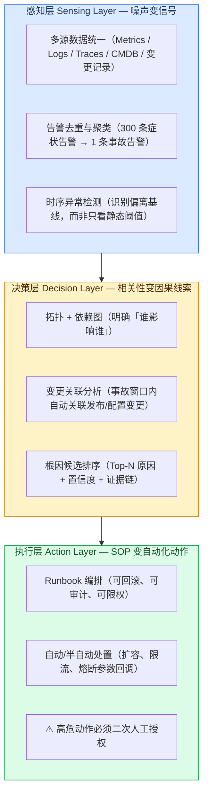
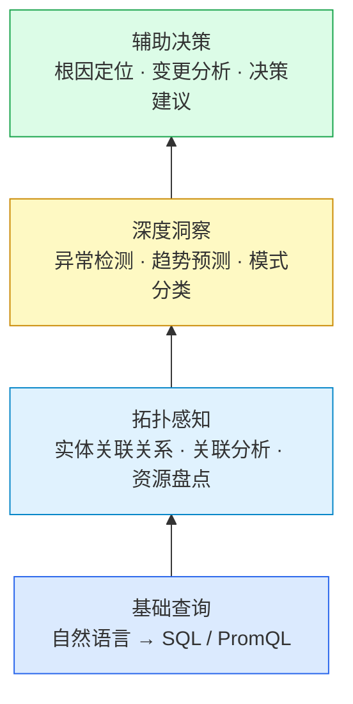
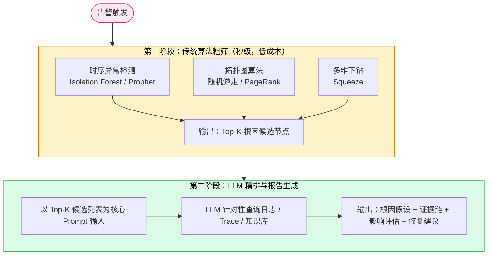
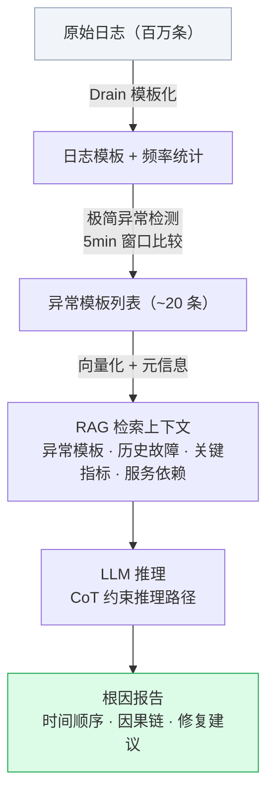
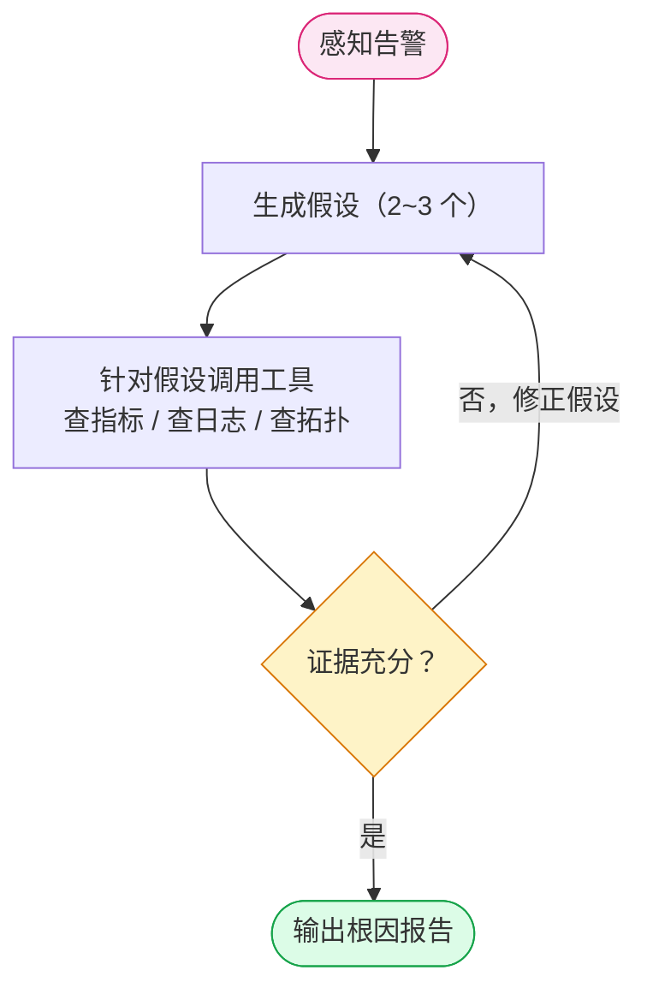
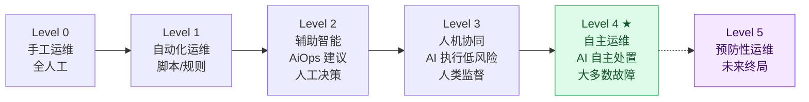

# 业界 AiOps 案例分析报告

> 调研范围：2023–2026 年头部互联网公司实践 + 学术界最新成果
> 参考文章：19 篇业界一手资料（含阿里云、小红书、腾讯、GOPS 等）
> 调研日期：2026-03-11

---

## 一、AiOps 的本质与核心价值

AiOps（Artificial Intelligence for IT Operations）并不是新概念——Gartner 在 2017 年就提出了这个愿景，但过去的落地长期受困于**三大瓶颈**：僵化的规则引擎、严重的数据孤岛、高昂的定制化成本。

大模型时代的到来改变了这一局面。业界普遍认为，AiOps 即将迎来真正的临界点，三个关键因素已经成熟：

1. **高质量数据**：统一可观测平台（Metrics/Logs/Traces）逐步成熟，数据互相关联
2. **弹性算力**：云时代的按需伸缩，支撑 PB 级数据实时处理
3. **大模型**：通用知识与推理能力涌现，无需大量标注数据即可理解运维场景

**AiOps 的真正价值不是"看起来智能"，而是减少人工操作。** 成熟团队里 AiOps 会接管三件事：
- 告警归并与事故摘要
- 低风险标准化处置
- 复盘素材自动生成（时间线、证据链、动作效果）

而工程师的精力应聚焦于：架构韧性优化、容量与成本平衡、故障预防而非故障救火。

---

## 二、能力框架：三层架构是业界共识

业界公认的 AiOps 能力分三层，缺一不可：



**北极星指标不是模型准确率，而是业务恢复效率：**

| 指标 | 说明 |
|---|---|
| MTTD（Mean Time to Detect） | 发现时间缩短多少 |
| MTTR（Mean Time to Recover） | 恢复时间缩短多少 |
| 告警压缩率 | 是否可持续达到 80%+ |
| 误报率 | 是否被值班团队接受 |
| 自动化处置成功率 | 是否稳定提升 |

---

## 三、头部案例深度分析

### 3.1 小红书：基于 Trace 调用拓扑的故障定位实践

**背景**：微服务架构下，单一业务场景调用拓扑可能超过 300 个节点，平均故障排查时间超 1 小时。

**核心流程**：


**关键技术点**：

1. **拓扑生成**：以 Trace 链路为主（覆盖率 90%+），以 RPC 拓扑为补充（节点 > 300 时裁剪弱依赖节点）

2. **异常检测**：针对不同指标类型分别设计算法
   - QPS 类指标（有趋势）：SR-CNN 做频域变换放大变点，再用孤立森林检测
   - 稳定型指标：直接孤立森林
   - 单机离群：DBSCAN + DTW 距离度量

3. **根因分析**：RCSF（异常频繁项集挖掘）+ 专家规则重排序
   - RCSF：从告警入口节点出发，挖掘调用路径中异常最集中的节点
   - 专家规则：流量陡增→优先入口层；单机异常→余弦相似度分析；变更导致→按距离故障时刻排序

4. **影响面分析**：余弦相似度（判断单机/单机房问题）+ DBSCAN 时序离群

**落地效果**：
- Trace 场景故障定位准确率从 40%+ → **80%+**（AC@5 指标）
- 每天触发 **1000+ 次**诊断，覆盖近百个核心场景
- 故障群推送：告警触发后 **1 分钟内**收到诊断报告

**对我们的启示**：Trace 覆盖率是成败关键，大数据场景没有 HTTP Trace，需要替代方案（作业 DAG + 组件依赖图）。

---

### 3.2 腾讯：FastReject LLM-based 根因分析方案（CCF AiOps 2024 冠军）

**核心思路**：完全放弃传统规则，直接用大模型做根因分析，但配以精心的数据预处理和知识增强。

**架构**：
- **在线阶段**：实时分析故障，结合知识库和定位规则推理根因
- **离线阶段**：从历史故障中提炼经验规则，持续优化知识库（Law Agent 自动提炼规则）

**四大创新点**：
1. **多模态数据结构化**：Metric/Trace/Log 三种数据统一转成 LLM 可理解的文本格式（如 `Node X 内存使用率上升 12.88% (21.27 → 24.01)`）
2. **系统拓扑 + CMDB 注入**：将服务调用关系、Pod/Node 部署关系注入 Prompt，避免 LLM 逻辑断链
3. **Law Agent**：自动将人工定位过的故障提炼成可复用规则，新故障先匹配历史规则
4. **SOP 校验**：按标准流程重新验证 LLM 的摇摆答案，确保结果稳定

**效果**：得分 73.95（第一名），平均每个问题 1 分钟出结果，平均消耗 9200 Token。

---

### 3.3 阿里云：Operation Intelligence 语义基座新范式

**核心洞察**：AiOps 落地有两个深层难题：

1. **数据驾驭问题**：海量、异构、实时的可观测数据如何让 AI 有效理解？
   - 解法：计算下推——不把原始数据喂给 LLM，而是将分析意图下推到底层引擎执行，只把高价值信息送入 LLM。Token 消耗降低 90%+。

2. **认知对齐问题**：如何弥合 LLM 通用智能与运维专业知识的鸿沟？
   - 解法：UModel 统一模型——为每个 IT 实体绑定数据（是什么/如何连接）、知识（黄金指标/健康度/运维手册）、行动（回滚/重启/扩容），构建 IT 系统数字孪生

**UModel 的革命性**：让 LLM 能听懂"服务抖动"的真正含义，让 AI 进化成能理解、会推理、可行动的"数字 SRE"。

**AiOps Agent 能力分层金字塔**：



---

### 3.4 行业共识：传统算法 + LLM 混合架构是最佳实践

2026 年业界已形成明确共识：**不是传统算法 vs LLM，而是传统算法先行 + LLM 深化的混合架构**。



**传统算法保证效率和基础准确率（数千节点 → 个位数），LLM 赋予可解释性和自然语言交互能力。**

---

## 四、LLM 在 AiOps 中的关键方法论

### 4.1 极简异常检测（先于 LLM 的工程粗筛）

**核心原则**：超过 95% 的线上故障根因就藏在「最早异常、变化最大的那一小撮日志里」。

**不要一上来就让 LLM 当侦探，先用最土、最硬的工程方法，把嫌疑人名单缩到 20 个以内。**

工程方案（5 分钟时间窗口）：
```
异常规则：
  ① current_count > historical_avg × K（K=5~10）  → 出现次数暴涨
  ② historical_avg == 0 && current_count ≥ N       → 新模板（极危险）
  ③ 连续 N 个窗口异常（可选，提高稳定性）
```

这本质是 RAG 的第一次粗筛检索，用传统工程完成，稳定、可控、可解释。

### 4.2 LLM+RAG 做根因分析（全流程）

**前提：日志必须先做模板化。** 推荐 Drain / Spell，将非结构化日志压缩为有限模式空间。



### 4.3 渐进式假设验证（Agent 模式）

LLM 不直接吞数据，而是主动提问，循环验证：



**工具集（把现有系统封装成 LLM 可调用的 Tool）**：
- `query_metrics(service, time_range)` → Prometheus 查询
- `query_logs(service, pattern, time_range)` → Loki 查询
- `get_alert_context(alert_id)` → 告警详情
- `get_service_topology(service)` → CMDB/服务依赖图
- `get_recent_changes(service, time_range)` → 变更记录

---

## 五、大模型的局限与挑战（不能回避的问题）

| 挑战 | 说明 |
|---|---|
| **幻觉问题** | LLM 逻辑断链，生成错误根因，SRE 难以信任 |
| **上下文限制** | 大规模集群日志数据远超 LLM 上下文窗口 |
| **数据隐私** | 生产环境数据不能发外部 API，需内部部署 |
| **领域知识鸿沟** | 通用 LLM 不理解 YARN RM OOM、Spark Shuffle 等专业概念 |
| **语义鸿沟** | LLM 听不懂"服务抖动""CPU 毛刺"等运维黑话 |
| **成本** | 全量 LLM 推理成本高昂，需要计算下推控制 Token 消耗 |

**业界专家明确指出：LLM 运维应用仍处于初步阶段，辅助功能为主。**

---

## 六、Agentic AiOps 的形态演进（2024-2026）



字节跳动 SRE-Copilot（2023）：故障自愈率 **85%**，人工干预时间减少 **70%**。

---

## 七、关键结论与对本团队的启示

1. **数据质量决定 80% 成败**。没有统一可观测体系、没有 CMDB，任何 AiOps 都是无源之水。数据地基建设必须先行。

2. **先传统算法，后大模型**。传统方法（异常检测+图算法）先快速缩小范围，LLM 做最后一公里的语义推理和报告生成。不要一上来就做纯 LLM 方案。

3. **日志模板化是 LLM-RCA 的前提**，不是可选项。推荐 Drain3，必须在 LLM 接入前完成。

4. **CMDB/服务拓扑是 RCA 的骨架**。没有组件依赖关系图，根因分析就是猜谜。

5. **80% 准确率足够了**，别追求 100%。剩下 20% 的特殊 case 人工兜底。

6. **告警压缩率是第一个验收指标**，把告警风暴降噪 70%+ 是 Phase 1 的核心 KPI，比根因分析更容易落地，价值也最即时。

7. **大数据集群 AiOps 有自己的特殊性**——没有 HTTP Trace，需要用组件依赖图（HDFS→YARN→HiveServer/Spark）+变更记录+Ambari 事件来替代微服务的调用链。参见附件《可行性分析报告》。

---

## 参考资料

| 来源 | 关键内容 |
|---|---|
| 小红书技术博客 | 故障定位与诊断（RCSF+专家规则） |
| AiOps 实战（腾讯 FastReject 方案） | LLM+多模态结构化+Law Agent |
| 阿里云云栖实录 2024 | UModel + 计算下推 + AiOps Agent |
| GOPS 大会 2024 | 大模型 Agent 在 AIOps 的实践 |
| Agentic AIOps 落地实施方案 2026 | 三年建设路线图与五层架构 |
| AIOps RCA 深度解析 | 传统算法+LLM 混合 RCA 架构 |
| 极简异常检测探索系列 | 日志模板化+工程粗筛方法论 |
