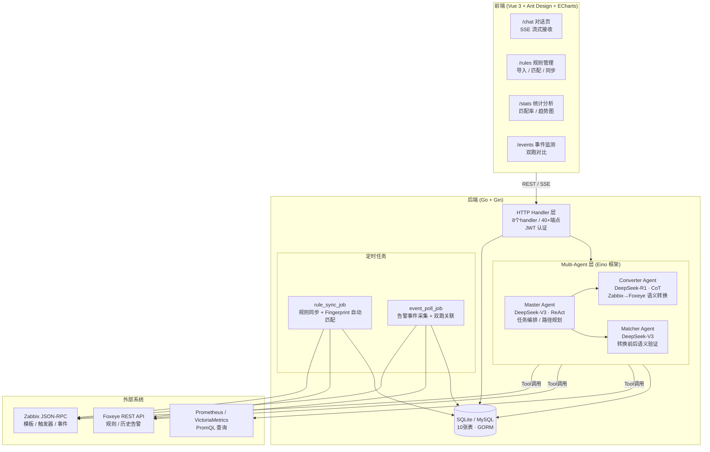
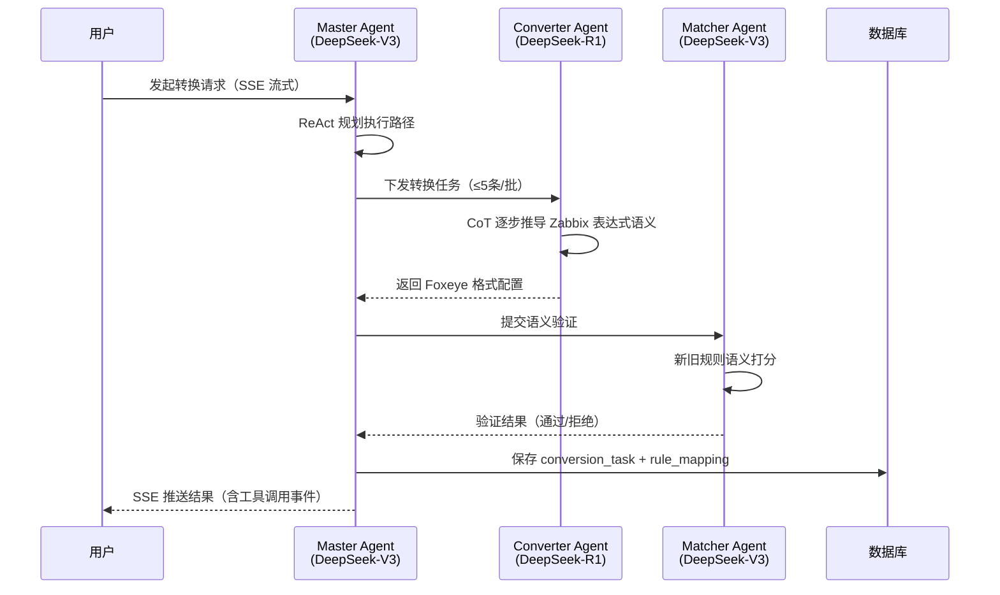

## 🎯 目标与验收标准

### 本周目标（3.16-3.20）
- [x] 完成系统代码初步开发（后端核心模块 ~85%，前端核心页面 ~85%）
  - **2026-03-17 v2 完整重构**：5步迁移流水线全实现（全量导入→业务组管理→自动匹配→批量转换→双跑校验），后端实际完成度 ~90-95%，frontend ~80-85%，当日 commit +4220/-723 lines
- [ ] 完成集成测试（本周截止）：端到端转换 ≥ 5 条真实 Zabbix Trigger，三层 Agent（Master→Converter→Matcher）链路全程无 panic，规则转换准确率验证报告输出
- [ ] 完成 Docker Compose 部署配置：单命令 `docker-compose up` 可启动完整服务（后端 + 前端 + DB），配置文件环境变量化
- [ ] 边界 case 验证通过：表达式含除法（`/`，防 PromQL 语法冲突）、中文 Trigger 名、空 expression 的转换不崩溃且返回合理错误提示

### 后续目标（4月前完成）
- [ ] 生产环境接入真实 Zabbix/Foxeye API，规则双跑漏报率为零验收通过
- [ ] 500+ 条 Zabbix Trigger 通过系统辅助完成 PromQL 迁移

## ⚙️ 系统架构

### 整体架构



### Multi-Agent 规则转换流程



### 规则匹配三层策略

| 层次 | 方式 | 触发时机 |
|------|------|---------|
| L1 Fingerprint | 规则名称 + 阈值结构化匹配 | 定时 rule_sync_job 自动执行 |
| L2 LLM 语义 | Matcher Agent 语义打分 | Fingerprint 未命中时 |
| L3 手动 | 用户在规则管理页手动绑定 | L1/L2 均未命中时 |

### 后端代码完成度

| 模块 | 文件数 | 代码行数 | 完成度 |
|------|--------|---------|--------|
| Multi-Agent（Master/Converter/Matcher） | 4 | 600+ | 95% |
| HTTP Handler | 8 | 600+ | 90% |
| Agent Tool 工具集 | 5 | 450+ | 100% |
| 外部 API 客户端（Zabbix/Foxeye） | 2 | 350+ | 90% |
| 数据库 Store | 8 | 700+ | 100% |
| 数据模型（GORM） | 9 | 300+ | 100% |
| 定时任务 | 2 | — | 90% |

前端（Vue 3）：7个路由页面框架完整，约 80-85%。

**主要待完成项**：集成测试、边界 case 验证、Docker 部署配置、生产环境联调。

## ⚙️ 本周参考执行路径

### Step 1：集成测试准备（3.16-3.17）

1. 确认本地开发环境可以连通 Zabbix JSON-RPC（或 Mock 数据）和 VictoriaMetrics
2. 准备测试用 Trigger 集合（≥5条），覆盖：
   - 简单阈值型（`last()>5`）
   - 含主机名变量（`{HOST.HOST}`）
   - 含中文描述
   - 表达式含除法（`nodata/by_user`）
   - Empty/malformed expression（边界 case）

### Step 2：端到端验证（3.17-3.19）

```bash
# 启动服务
go run cmd/server/main.go

# 发起转换请求（SSE 流式）
curl -N -X POST http://localhost:8080/api/v1/convert \
  -H "Authorization: Bearer <TOKEN>" \
  -H "Content-Type: application/json" \
  -d '{"trigger_ids": ["<ID1>","<ID2>"]}'
```

验证要点：
- Master Agent 是否正确规划 ReAct 路径（日志中打印 `[ReAct]` 步骤）
- Converter Agent 返回的 PromQL 是否可在 VM 上执行（Matcher Agent Tool 验证）
- `conversion_task` 和 `rule_mapping` 是否写入 DB

### Step 3：Docker Compose 配置（3.18-3.20）

```yaml
# docker-compose.yml 关键结构
services:
  backend:
    build: .
    environment:
      - ZABBIX_URL=${ZABBIX_URL}
      - FOXEYE_URL=${FOXEYE_URL}
      - VM_URL=${VM_URL}
      - LLM_API_KEY=${LLM_API_KEY}
  frontend:
    build: ./web
    ports: ["3000:3000"]
  db:
    image: mysql:8.0
    environment:
      - MYSQL_ROOT_PASSWORD=${DB_PASSWORD}
```

验收：`docker-compose up` 无报错，前端页面可访问，`/api/v1/health` 返回 200

## 🐛 踩坑日志 (Troubleshooting)
-