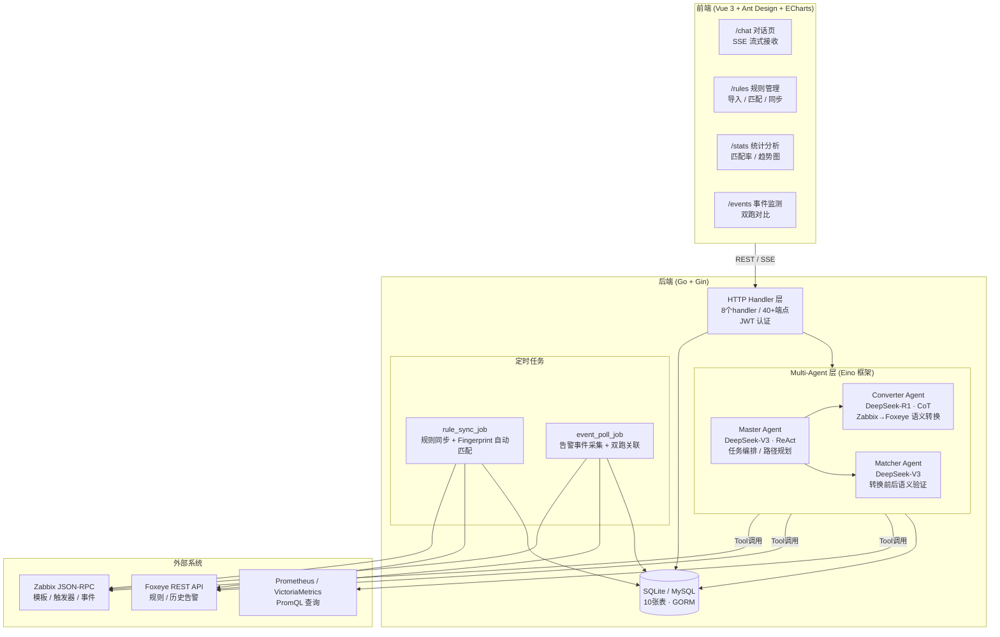
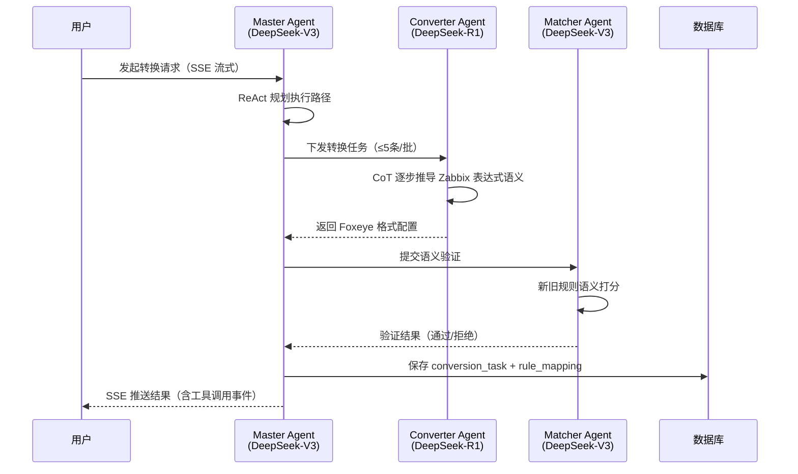

## 🎯 目标与验收标准
- [x] 完成系统代码初步开发（后端核心模块 ~85%，前端核心页面 ~85%）
- [ ] 完成集成测试，验证规则转换准确率与双跑对比逻辑
- [ ] 完成部署上线（Docker Compose / 生产环境）

## ⚙️ 系统架构

### 整体架构

### Multi-Agent 规则转换流程

### 规则匹配三层策略

| 层次 | 方式 | 触发时机 |
|------|------|---------|
| L1 Fingerprint | 规则名称 + 阈值结构化匹配 | 定时 rule_sync_job 自动执行 |
| L2 LLM 语义 | Matcher Agent 语义打分 | Fingerprint 未命中时 |
| L3 手动 | 用户在规则管理页手动绑定 | L1/L2 均未命中时 |

### 后端代码完成度

| 模块 | 文件数 | 代码行数 | 完成度 |
|------|--------|---------|--------|
| Multi-Agent（Master/Converter/Matcher） | 4 | 600+ | 95% |
| HTTP Handler | 8 | 600+ | 90% |
| Agent Tool 工具集 | 5 | 450+ | 100% |
| 外部 API 客户端（Zabbix/Foxeye） | 2 | 350+ | 90% |
| 数据库 Store | 8 | 700+ | 100% |
| 数据模型（GORM） | 9 | 300+ | 100% |
| 定时任务 | 2 | — | 90% |

前端（Vue 3）：7个路由页面框架完整，约 80-85%。

**主要待完成项**：集成测试、边界 case 验证、Docker 部署配置、生产环境联调。

## 🐛 踩坑日志 (Troubleshooting)
-