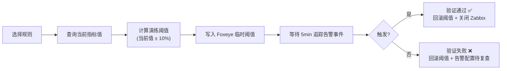

## 🎯 目标与验收标准

在告警迁移平台集成"模拟演练"功能，解决生产环境难以自然触发的告警规则的验证问题。

- [ ] 功能入口：平台规则列表支持"模拟演练"按钮
- [ ] 查询该 Foxeye 规则对应指标的当前值
- [ ] 自动计算并写入降低后的双边触发阈值（双边：upper 降低，lower 提高）
- [ ] 追踪告警事件是否在 TTL（默认 5min）内被 Foxeye 触发
- [ ] 演练完成后自动回滚告警阈值，并关闭对应 Zabbix Trigger
- [ ] 操作全程记录审计日志

## ⚙️ 核心流程

## 📝 实施记录

## 🐛 踩坑日志 (Troubleshooting)
