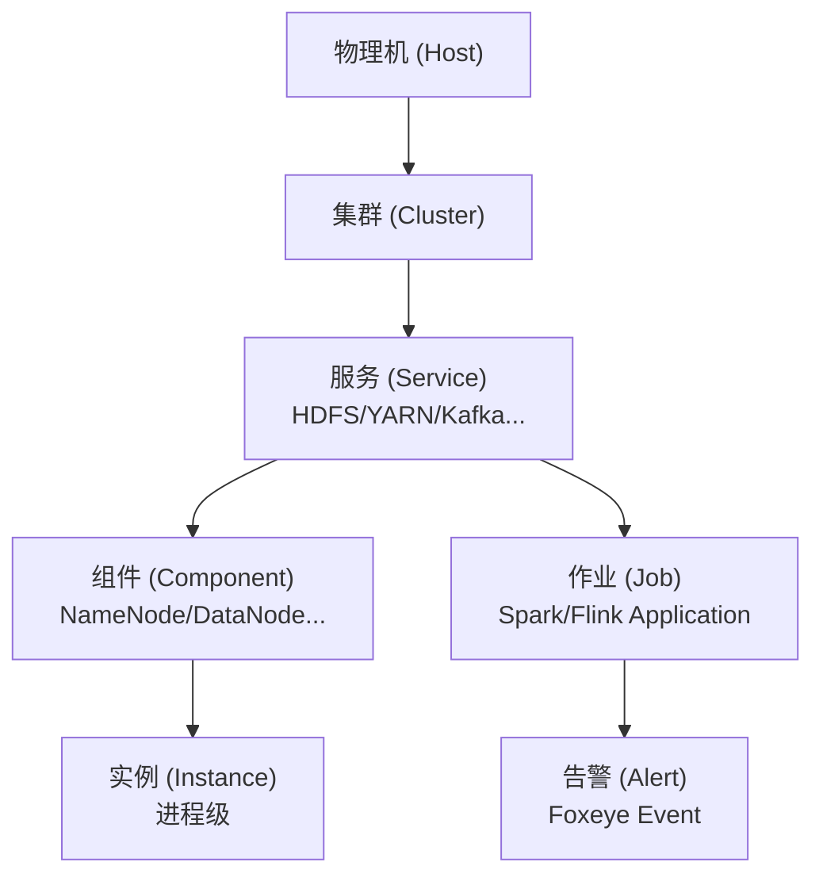

## 🎯 目标与验收标准

拆解大数据集群的服务层级与实体关系，为 AiOps SCMDB 落地提供数据模型基础。

- [ ] 梳理集群中各类实体：物理机、集群、服务、组件、作业
- [ ] 定义实体关系：部署关系（主机→服务→组件）、依赖关系（Spark→HDFS/YARN）、告警关联
- [ ] 输出 ER 图（Mermaid）和实体字段清单
- [ ] 结合 [[SCMDB服务自动发现方案设计]] 中的混合数据源模型，对齐数据接入路径

## ⚙️ 实体层级设计（草稿）

**关键问题待梳理：**
- [ ] Ambari 托管服务 vs 非托管服务（独立 Spark、自定义组件）的数据源如何合并
- [ ] 服务实例的唯一键设计（Hostname + ServiceName + Port）
- [ ] 实体关系的更新频率与 SCMDB 写入机制

## 📝 实施记录

## 🐛 踩坑日志
