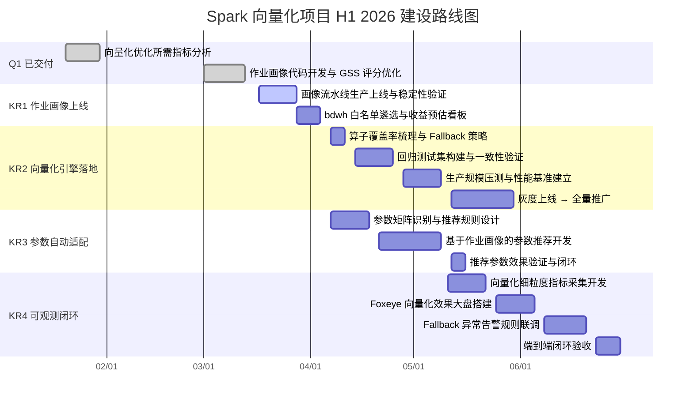

# 1 背景/现状

大数据平台 Spark 集群承担公司核心离线计算、即时查询和 ETL 任务，是数据生产链路的核心基础设施。平台当前现状如下：

- **执行引擎**：Spark 默认使用基于行的火山模型（Volcano Model）执行引擎，CPU 利用率受限于逐行处理模式，无法充分利用现代 CPU 的 SIMD 向量化指令集和 Cache 局部性优化能力
- **向量化执行**：已完成前期调研，识别出基于 Apache Gluten + Velox 的向量化执行引擎方案，初步 PoC 验证在 TPC-DS 基准测试中部分算子有 2-5x 加速效果。2026 年 1 月已完成向量化优化所需指标分析，3 月完成作业画像（GSS 评分模型）代码开发与优化，具备从 EventLog 离线分析作业向量化适配性的基础能力
- **作业适配识别**：已建立 GSS（Gluten Suitability Score）评分模型，覆盖 SQL 级和 Job 级两层评分，通过算子检测、格式识别、Fallback 风险评估等 14 个维度综合打分，为向量化候选作业遴选提供数据支撑。但作业画像尚未上线，白名单作业识别能力尚未生产化
- **参数配置**：Gluten + Velox 对内存配置有特殊要求（强依赖 Off-Heap 内存，executor memory overhead 需相应调整），当前依赖人工经验静态配置，不同类型候选作业的参数需求差异未被系统化建模，存在因参数配置不当导致 OOM 或性能回退的风险
- **可观测支撑**：Spark 作业级别的细粒度性能指标（向量化算子比例、Fallback 率、算子耗时分布、内存水位）在现有监控平台（Foxeye）中缺乏统一采集和展示，向量化效果验证依赖人工分析日志

![[背景和现状.png]]

# 2 问题分析

基于平台现状，当前存在以下核心问题：

**1. 向量化适配候选作业识别缺乏生产化工具，白名单遴选无数据支撑**

- 并非所有 Spark 作业都适合开启 Gluten + Velox 向量化——含复杂 Hive UDF、频繁 ColumnarToRow/RowToColumnar 转换的作业开启后性能反而下降
- GSS 评分模型代码已完成，但尚未完成生产上线和持续运行，无法为白名单决策提供实时数据支撑
- 候选作业遴选缺乏可视化看板，bdwh 等核心用户的潜在收益无法量化展示，难以驱动业务侧配合灰度

**2. 向量化引擎生产落地缺乏全链路回归验证，上线风险不可控**

- Gluten + Velox PoC 验证在标准基准测试中表现良好，但尚未经过真实业务作业的兼容性回归测试，算子覆盖率和 Fallback 策略尚未系统梳理
- 向量化引擎引入后的资源用量变化（CPU/内存）未经过生产规模压测，上线风险不可量化
- 缺乏向量化前后的标准化性能对比基准，无法量化收益、推动规模化推广

**3. 向量化所需参数配置缺乏自动适配能力，参数不当是落地最大风险点**

- Gluten + Velox 强依赖 Off-Heap 内存，不同作业类型（宽表 Join、聚合、排序）的内存需求差异大，原有 Heap-only 配置下 Container 易被 YARN 杀死
- 向量化相关参数（executor memory overhead、spark.memory.offHeap.size、spark.gluten.sql.columnar.backend.lib 等）当前依赖人工经验配置，缺乏基于作业特征（GSS 评分、输入规模、Join 类型）的自动推荐能力
- 参数调整缺乏效果反馈闭环，调优后无标准指标验证改善效果，参数经验无法沉淀

**4. 向量化效果缺乏细粒度可观测能力，规模化推广后无法持续监控收益**

- Foxeye 平台当前缺少向量化引擎运行状态的细粒度指标：向量化算子执行比例、Fallback 率、Gluten Off-Heap 内存水位、算子耗时对比
- 缺乏向量化前后的历史性能基线，无法识别性能退化和异常回退
- 向量化参数动态调优效果无法通过监控平台闭环验证，调优动作与效果指标脱节

# 3 方案/目标

**Objective**：通过完成 Spark 向量化适配引擎的端到端生产落地——从候选作业画像识别、向量化引擎回归验证、参数自动适配，到效果可观测闭环——将大数据 Spark 集群打造为具备智能向量化执行能力的高性能计算基础设施。

- **KR1**：完成作业画像系统生产上线，建立向量化候选作业白名单与收益预估能力。**预计 2026 年 4 月初**，GSS 评分流水线稳定运行，bdwh 等核心用户白名单作业识别完成，Superset 看板可视化展示候选作业列表与预估收益
- **KR2**：完成 Gluten + Velox 向量化引擎生产验证与规模化上线。**预计 2026 年 5 月底**，向量化引擎覆盖核心算子（Filter、Aggregation、HashJoin、Sort），在白名单候选作业上 CPU 利用率提升 ≥ 30%，核心查询 P50 耗时降低 ≥ 40%，Fallback 率低于 10%
- **KR3**：建立基于作业画像的向量化参数自动适配能力，消除参数配置不当导致的 OOM 和性能回退风险。**预计 2026 年 5 月中旬**，覆盖宽表 Join、聚合、排序三类主要作业类型，自动推荐 Off-Heap 大小、executor memory overhead 等向量化关键参数，OOM 导致作业失败次数降低 ≥ 60%
- **KR4**：在 Foxeye 平台建立向量化效果可观测体系，支持持续监控与异常回退告警。**预计 2026 年 6 月底**，向量化引擎细粒度指标（Fallback 率、向量化算子比例、Off-Heap 水位、算子耗时分布）纳入 Foxeye 统一监控，建立向量化前后性能对比基线大盘，支持 Fallback 率异常自动告警

![[方案和目标.png]]

## 3.1 作业画像系统生产上线（KR1）

基于已完成的 GSS 评分模型和作业画像代码，完成生产上线、持续运行验证和候选作业白名单可视化，为向量化引擎灰度上线提供数据支撑。

**核心设计思路**：

- **EventLog 离线分析流水线**：复用 PantherSparkEventJob 解析框架，新增 `SQLExecutionStart / SQLExecutionEnd / GlutenFallbackEvent` 三类事件处理，提取 `physicalPlanDescription` 中的算子结构、输入格式、转换节点，驱动 GSS 评分计算
- **双层 GSS 评分**：SQL 级评分覆盖算子兼容性（Parquet/ORC 加分、Hive UDF 降分、ColumnarToRow 转换惩罚等 9 个维度）；Job 级评分在 SQL 级基础上叠加作业类型信号（纯 RDD/Streaming/Python 大幅降分），确保全量作业类型覆盖
- **白名单遴选与收益预估**：基于 GSS 评分分层（≥70 建议开启、40-69 谨慎灰度、<40 不建议），结合历史 CPU 用量和作业耗时，预估开启向量化后的资源节省量，生成候选作业名单
- **Superset 可视化看板**：展示白名单作业列表（作业名、GSS 评分、预估 CPU 收益）、分用户/队列的候选作业分布、GSS 评分分层统计，支持按用户、队列、作业类型筛选

**验收指标**：GSS 评分流水线稳定运行 ≥ 7 天无异常，bdwh 用户候选作业白名单完成识别，Superset 看板上线可访问。

## 3.2 向量化引擎生产落地（KR2）

基于 KR1 白名单候选作业，完成算子覆盖率梳理、生产回归验证和规模化上线，实现 Spark 计算层 CPU 效率的根本性提升。

**核心设计思路**：

- **算子覆盖率梳理与 Fallback 策略**：系统梳理 Velox 原生支持的算子清单（Filter、Project、Aggregation、HashJoin、Sort、Window 等），明确不支持算子的 Fallback 到原生 Spark 的触发条件和性能影响，制定 Fallback 率目标（< 10%）
- **兼容性回归测试**：针对 KR1 白名单候选作业（ETL、宽表 Join、聚合报表）构建回归测试集，验证向量化执行结果与原生 Spark 结果一致性（精度对齐），覆盖 Null 值处理、浮点精度、复杂类型（Array/Map/Struct）等边界场景
- **生产环境压测**：在隔离的测试队列中以生产规模数据集进行压测，采集 CPU 利用率、内存使用、GC 时间、作业耗时等核心指标，与基线对比量化收益
- **灰度上线策略**：采用「队列级灰度」方式分批上线——先在低优先级离线队列启用，观察稳定性后逐步扩展到核心生产队列，每阶段设置回滚预案

![[引擎落地阶段.png]]

**验收指标**：CPU 利用率提升 ≥ 30%，核心查询 P50 耗时降低 ≥ 40%，Fallback 率 < 10%，回归测试通过率 100%。

## 3.3 向量化参数自动适配方案（KR3）

以动态参数推荐作为实现途径，基于作业画像（GSS 评分、输入规模、Join 类型等特征）自动为向量化候选作业生成最优参数配置，消除因参数不当导致的 OOM 和 Fallback 风险。

**核心设计思路**：

- **向量化参数矩阵识别**：聚焦与向量化直接相关的参数维度：
    - **spark.memory.offHeap.size**：Gluten 强依赖 Off-Heap，基于 Shuffle 写入量和 Join 规模估算合理的堆外内存大小
    - **spark.executor.memoryOverhead**：向量化执行会增加 JVM 之外的内存消耗，需根据作业类型动态调整 overhead 比例
    - **spark.gluten.sql.columnar.backend.lib**：向量化后端选择（Velox / CH），基于算子兼容性和数据格式自动匹配
    - **spark.memory.fraction / spark.memory.storageFraction**：向量化模式下执行内存与存储内存比例的最优调整
- **基于作业画像的参数推荐**：直接复用 KR1 中的作业特征数据（GSS 评分分层、输入格式、Shuffle 规模、Join 类型），建立「作业特征 → 向量化参数推荐规则」的映射关系，避免重复建模
- **参数推荐与回归验证联动**：KR2 回归测试阶段引入参数推荐能力，验证推荐参数下的 OOM 率和 Fallback 率，与静态配置基线对比，量化参数适配收益
- **推荐效果反馈闭环**：采集应用推荐参数后的作业执行结果（OOM 事件、Fallback 次数、Off-Heap 峰值水位），持续迭代推荐规则精度

**验收指标**：覆盖宽表 Join、聚合、排序三类向量化候选作业类型，OOM 导致作业失败次数降低 ≥ 60%，Fallback 率不因参数问题恶化。

## 3.4 向量化效果可观测方案（KR4）

在 Foxeye 平台建立向量化引擎运行状态的细粒度可观测能力，支持持续监控向量化收益、检测 Fallback 异常，形成「部署 → 监控 → 异常告警 → 参数迭代」的闭环。

**核心设计思路**：

- **向量化专项指标采集**：通过 Spark EventListener 和 Gluten 内置 Metrics 机制采集向量化特有指标，经 Prometheus Exporter 暴露，由 vmagent 抓取写入 VictoriaMetrics 集群：
    - **向量化执行层**：向量化算子执行次数、Fallback 算子次数、Fallback 率（Fallback count / total SQL count）
    - **内存层**：Off-Heap 内存峰值水位、executor memory overhead 实际使用率、OOM 事件次数
    - **性能层**：各向量化算子耗时分布（P50/P99）、与原生 Spark 同类算子的耗时对比
- **向量化前后性能对比基线**：基于 KR1 白名单候选作业的历史执行数据建立基线，大盘展示向量化上线前后的 CPU 利用率、作业耗时、Spill 量的对比变化
- **Fallback 异常告警**：定义向量化健康度检测规则（Fallback 率超过 15%、Off-Heap OOM 事件发生、单作业向量化算子比例骤降 > 20%），通过 Foxeye 告警引擎触发通知
- **参数适配效果回路**：将 KR3 参数推荐结果与实际执行指标关联展示，支持参数版本对比，推荐规则迭代有数据依据

![[可观测闭环.png]]

**验收指标**：向量化细粒度指标（Fallback 率、向量化算子比例、Off-Heap 水位、算子耗时对比）100% 纳入 Foxeye，性能对比基线大盘上线，Fallback 异常告警命中率 ≥ 90%，误报率 ≤ 5%。

# 4 关键事项拆解

| KR  | 任务                              | 时间            | 说明                                                                 |
| --- | ------------------------------- | ------------- | ------------------------------------------------------------------ |
| KR1 | 向量化优化所需指标分析（已完成）              | 1月30日         | 完成向量化优化所需指标维度梳理，确定 GSS 评分模型核心维度                                   |
|     | 作业画像代码开发与 GSS 评分模型优化（已完成）    | 3月13日         | 完成 PantherSparkEventJob 扩展、14 个算子检测 UDF、双层 GSS 评分实现与关键逻辑优化        |
|     | 作业画像系统生产上线与稳定性验证              | 3月17日 - 3月28日 | GSS 评分流水线部署上线，稳定运行 ≥ 7 天，dwd_panther_spark_sql_plan 与 job 表新字段验证 |
|     | bdwh 用户候选作业白名单遴选与收益预估          | 3月28日 - 4月4日  | 基于 GSS ≥ 70 筛选 bdwh 白名单作业，预估 CPU 收益，Superset 看板上线                |
| KR2 | 向量化算子覆盖率梳理与 Fallback 策略设计      | 4月7日 - 4月11日  | Velox 算子支持清单、Fallback 触发规则文档、Fallback 率目标定义                        |
|     | 回归测试集构建与结果一致性验证               | 4月14日 - 4月25日 | 覆盖 KR1 白名单候选作业（ETL、宽表 Join、聚合），结果一致性验证通过报告                        |
|     | 生产规模压测与性能基准建立                 | 4月28日 - 5月9日  | 生产规模压测报告（CPU 利用率、P50 耗时对比），TPC-DS + 白名单业务 SQL 基准数据               |
|     | 向量化引擎灰度上线与全量推广                | 5月12日 - 5月30日 | 低优先级队列灰度启用，稳定性验证后扩展至核心生产队列，上线验收报告                                |
| KR3 | 向量化参数矩阵识别与推荐规则设计              | 4月7日 - 4月18日  | Off-Heap、memoryOverhead、memory.fraction 推荐规则方案文档，覆盖三类主要作业类型       |
|     | 基于作业画像的参数推荐能力开发               | 4月21日 - 5月9日  | 参数推荐逻辑集成作业画像特征，单元测试通过，与 KR2 回归测试阶段联调验证                           |
|     | 推荐参数效果验证与反馈闭环                 | 5月12日 - 5月16日 | OOM 事件降低 ≥ 60% 验收报告，推荐参数版本与执行指标关联记录完成                            |
| KR4 | 向量化细粒度指标采集方案设计与开发             | 5月11日 - 5月22日 | Gluten Metrics + Spark EventListener 采集方案，Prometheus Exporter 上线  |
|     | Foxeye 向量化效果大盘搭建               | 5月25日 - 6月5日  | 向量化前后对比基线大盘上线，Fallback 率趋势视图、Off-Heap 水位图完成                       |
|     | Fallback 异常告警规则配置与联调            | 6月8日 - 6月20日  | 向量化健康度告警规则上线，命中率 ≥ 90%，误报率 ≤ 5% 验收报告                             |
|     | 持续优化闭环端到端验收                   | 6月23日 - 6月30日 | 「画像选作业 → 参数适配 → 引擎加速 → 效果监控 → 异常告警 → 参数迭代」完整闭环端到端验收通过            |
