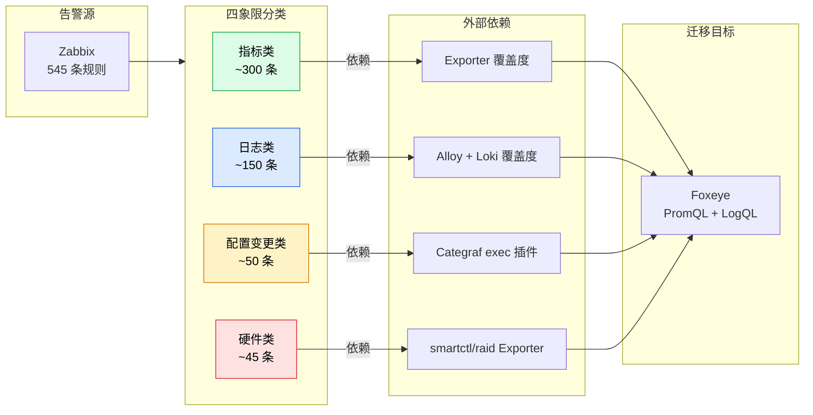
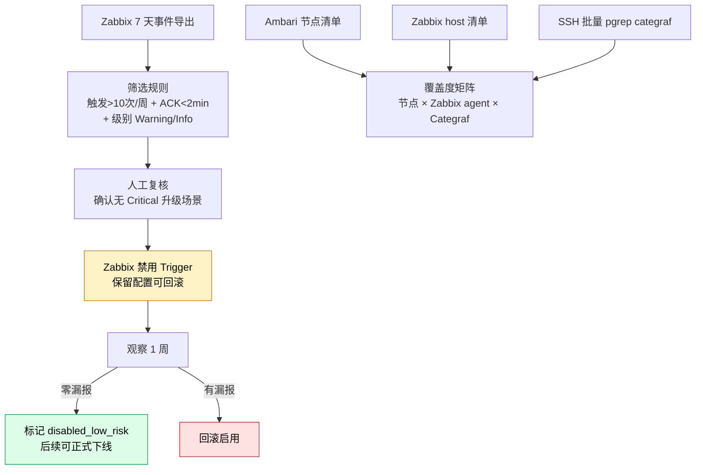
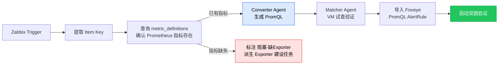
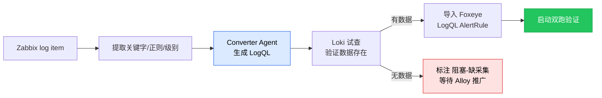
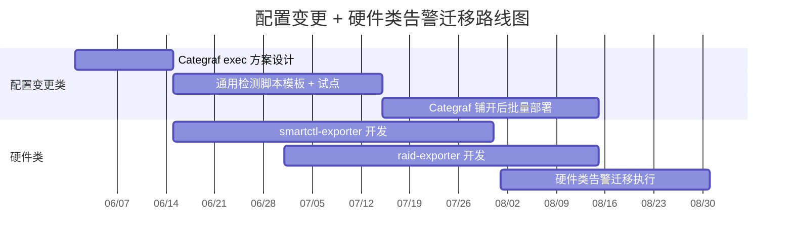
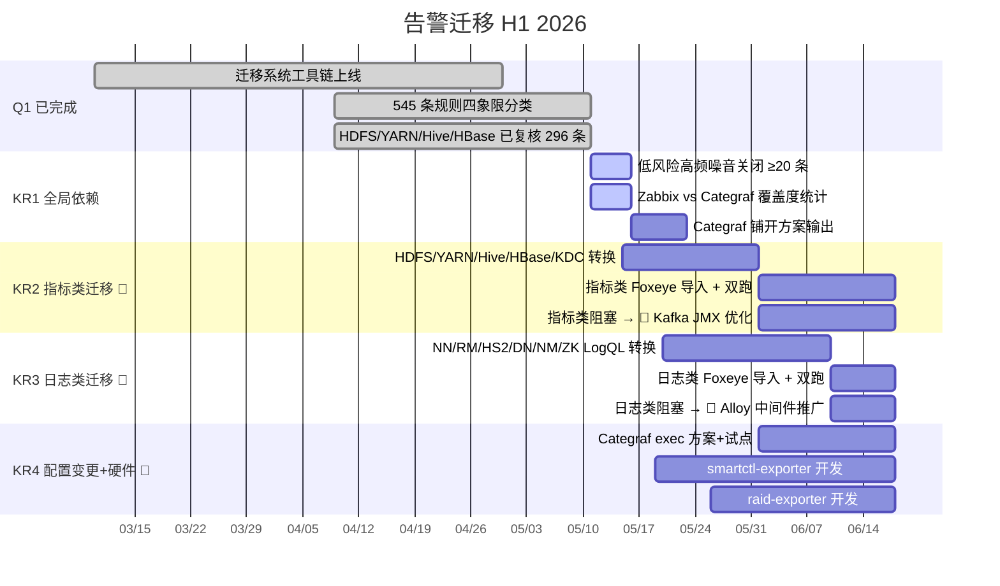

# 1 背景/现状

> **最后更新：2026-05-11**

大数据集群当前使用 Zabbix 作为监控告警平台，维护了 **545 条告警规则**。新平台 Foxeye（基于夜莺）底层数据源切换为 VictoriaMetrics + Loki，需系统性将 Zabbix 规则迁移到 Foxeye。告警迁移系统（Multi-Agent 架构，代码位于旧 SRE Copilot 平台）已完成工具链验证，迁移工作进入批量执行阶段。

- **迁移工具链**：Multi-Agent 转换（指标类 PromQL + 日志类 LogQL）+ 三层匹配（指纹/LLM/人工）+ 双跑数据采集（event_poll_job）已就绪
- **规则分类完成**：545 条 Zabbix 规则已于 2026-05-11 按四象限（指标类/日志类/配置变更类/硬件类）逐条标注类型和迁移状态，各类型外部依赖已识别
- **已完成迁移**：HDFS(55条/迁移率67%)、YARN(44条/84%)、Hive(29条/66%)、HBase(26条/88%)、infra_basic(142条/46%)，合计 keep_match 130 + pending_create 27 + manual_rebind 24
- **待迁移**：zabbix_infra(81)、elasticsearch(45)、misc(56)、kafka(16)、zookeeper(9)、druid(10)、spark(6) 等共 249 条
- **渐进式策略**：不等待全量迁移再关 Zabbix，先行关闭低风险高频噪音告警，逐步替代 Zabbix 能力

---

# 2 问题分析

**1. 迁移进度不均衡，指标类快但日志/配置/硬件类严重滞后**

- **指标类**：HDFS/YARN/Hive/HBase/KDC Exporter 已就绪，指标可直接转换，迁移率最高
- **日志类**：大数据组件（NN/RM/HS2）Loki 已接入可迁移，但中间件（Kafka/ES/Druid）等待 Alloy 推广
- **配置变更类**：Zabbix 配置项监控依赖 Categraf exec 插件，方案未启动
- **硬件类**：磁盘 SMART/RAID 告警依赖 smartctl/raid Exporter，全部未建设

**2. Zabbix 双平台并行成本高，低风险噪音告警未及时治理**

- 545 条规则中大量是高频触发但低风险的告警（INFO 日志匹配、端口抖动），每天消耗值班工程师注意力
- 迁移前可先行关闭这部分规则，降低并行运维成本，不等全量迁移完成
- 但当前缺乏系统性的关闭清单和影响评估

**3. Zabbix agent → Categraf 替代路径不清晰**

- Zabbix agent 仍部署在全集群节点，承担系统指标/进程/日志/配置变更等多类采集
- Categraf 覆盖度未统计，无法评估替代可行性和优先级
- 部分 Zabbix item（如 procstat）在 Categraf 有等价插件，但未验证

---

# 3 方案/目标

**Objective**：按四象限分类驱动 Zabbix → Foxeye 告警规则分批迁移，指标类和日志类作为 H1 重点（外部依赖较成熟），配置变更类和硬件类完成依赖补齐。渐进式替代 Zabbix——先行关闭低风险高频噪音告警，双跑验证后逐批收敛告警源。

**已交付里程碑**：

- ✅ **告警迁移系统工具链上线**（2026-04）：Multi-Agent 转换 + 三层匹配 + 双跑数据采集就绪
- ✅ **545 条规则四象限分类完成**（2026-05-11）：逐条标注类型和迁移状态
- ✅ **HDFS/YARN/Hive/HBase/infra_basic 已复核**（296 条）：keep_match 130 + pending_create 27 + manual_rebind 24
- ✅ **告警迁移 Inbox 拓扑重建**（2026-05-11）：按四象限子目录组织，外部依赖关系清晰

**四个 KR（KR2/KR3 并行推进）**：

- **KR1**：全局依赖补齐。**预计 5 月 23 日**，👤 关闭 ≥ 20 条低风险高频 Zabbix 告警，输出 Zabbix agent vs Categraf 全节点覆盖度矩阵
- **KR2**：指标类告警迁移（第一批）。**预计 6 月 18 日**，👤 HDFS/YARN/Hive/HBase/KDC 可迁移指标类规则全部转换并导入 Foxeye，启动双跑验证；🔗 Kafka 等待 JMX Exporter 优化
- **KR3**：日志类告警迁移（第一批）。**预计 6 月 18 日**，👤 大数据组件（NN/RM/HS2/DN/NM/ZK）可迁移日志类规则全部转换为 LogQL 并导入 Foxeye；🔗 中间件日志等待 Alloy 推广
- **KR4**：配置变更 + 硬件类依赖补齐。**预计 6 月 18 日**，👤 Categraf exec 方案设计完成 + 单节点验证通过；👤 smartctl-exporter + raid-exporter 开发完成

---

> **与其他 OKR 的分工说明**
> 
> | 事项 | 主导 OKR | 说明 |
> |---|---|---|
> | Exporter 建设（smartctl/raid/Kafka JMX） | 可观测建设 KR1 | 本 OKR 消费 Exporter 指标 |
> | Alloy 全集群推广（CVM/中间件） | 可观测建设 KR2 | 本 OKR 消费 Loki 日志数据 |
> | Categraf 全集群铺开 | 可观测建设 KR1 | 本 OKR 消费 Categraf 指标 |
> | 告警迁移工具链维护 | 本 OKR | Multi-Agent 转换 + 匹配 + 双跑 |
> | 迁移后的 ChatOps 交互 | 智能运维 OKR | Hermes Skill 驱动迁移对话 |

---

## 3.1 全局依赖补齐（KR1）

本周立即执行。补齐告警迁移的前置条件，为后续四象限批量迁移扫清障碍。

**核心设计思路**：

- **低风险高频噪音关闭**：从 Zabbix API 导出过去 7 天告警事件统计 → 筛选触发 >10 次/周 + 平均 ACK <2min + 级别为 Warning/Info 的规则 → 人工复核后在 Zabbix 禁用（不删除，可回滚）→ 观察 1 周零漏报后标记为可下线
- **覆盖度统计**：从 Ambari 导出全集群节点 → 与 Zabbix API host 清单交叉比对 → SSH 批量检查 Categraf 进程 → 生成「节点 × 采集器」覆盖度矩阵
- **Categraf 方案**：基于覆盖度矩阵，输出 Categraf 铺开计划（Salt 模块复用 Alloy 经验）

---

## 3.2 指标类告警迁移（KR2）

指标类告警是进度最好的象限，Hadoop/HBase/HS2/KDC Exporter 已就绪，转换路径最成熟。

**核心设计思路**：

- **转换路径**：Zabbix Trigger Expression → 提取 item key → 查询指标元数据库确认 Prometheus 指标存在 → Converter Agent 生成 PromQL → Matcher Agent 语义验证 → Foxeye 导入
- **分批策略**：第一批 HDFS/YARN/Hive/HBase/KDC（已有指标，5-6 月）→ 第二批 Kafka（等待 JMX Exporter 优化，6 月）
- **阻塞处理**：对于指标缺失的规则，标注「阻塞-缺Exporter」并派生到 Exporter 建设需求汇总

---

## 3.3 日志类告警迁移（KR3）

日志类告警依赖 Alloy + Loki 覆盖度。大数据组件日志已接入，可优先迁移。作业日志不通过 Alloy 采集（已聚合到 HDFS）。

**核心设计思路**：

- **转换路径**：Zabbix log[] item → 提取关键字/正则 → Converter Agent 生成 LogQL → Loki 试查验证数据存在 → Foxeye LogQL 导入
- **分批策略**：第一批 NN/RM/HS2/DN/NM/ZK（Alloy 已就绪，5-6 月）→ 第二批 Kafka/ES（等待 Alloy 推广到中间件，6-7 月）
- **关键差异**：日志类迁移需额外验证 LogQL `count_over_time` 阈值与 Zabbix `count()` 等价性

---

## 3.4 配置变更 + 硬件类迁移（KR4）

这两类告警外部依赖链路最长，H1 重点是补齐依赖，H2 完成迁移。

**核心设计思路**：

- **配置变更类**：依赖 Categraf exec 插件（统一采集框架）+ 检测脚本库。H1 完成方案设计和单节点验证
- **硬件类**：磁盘 SMART → smartctl-exporter（Go 自研，7 月底）；RAID 卡 → raid-exporter（MegaRAID 优先，8 月中）
- **H2 迁移**：依赖就绪后逐批转换为 Foxeye PromQL AlertRule

---

# 4 关键事项拆解

| KR | 任务 | 时间 | 说明 |
|---|---|---|---|
| **Q1** | ✅ 告警迁移系统工具链上线 | 3.10 - 4.30 | Multi-Agent 转换 + 三层匹配 + 双跑数据采集就绪 |
| | ✅ 545 条规则四象限分类 | 4.9 - 5.11 | 逐条标注类型（指标/日志/配置变更/硬件）和迁移状态 |
| | ✅ HDFS/YARN/Hive/HBase 已复核 296 条 | 4.9 - 5.11 | keep_match 130 + pending_create 27 + manual_rebind 24 |
| **KR1** | 低风险高频 Zabbix 噪音告警关闭 | 5.11 - 5.16 | 筛选 + 人工复核 + 禁用 ≥ 20 条，观察 1 周零漏报 |
| | Zabbix agent vs Categraf 覆盖度统计 | 5.11 - 5.16 | 全节点矩阵，输出缺口清单 |
| | Categraf 铺开方案输出 | 5.16 - 5.23 | 基于覆盖度矩阵的 Salt 分批部署计划 |
| **KR2** | 👤 HDFS/YARN/Hive/HBase/KDC 指标类转换 | 5.15 - 6.1 | PromQL 生成 + Matcher 验证 |
| | 👤 Foxeye 导入 + 双跑验证启动 | 6.1 - 6.18 | 导入 PromQL AlertRule，event_poll_job 双侧比对 |
| | 🔗 Kafka 指标类：等待 JMX Exporter 优化 | - | 外部依赖，由可观测建设 OKR KR1 跟踪 |
| **KR3** | 👤 NN/RM/HS2/DN/NM/ZK 日志类 LogQL 转换 | 5.20 - 6.10 | LogQL 生成 + Loki 试查验证 |
| | 👤 Foxeye 导入 + 双跑启动 | 6.10 - 6.18 | 导入 LogQL AlertRule，双跑比对 |
| | 🔗 中间件日志告警：等待 Alloy 中间件推广 | - | 外部依赖，由可观测建设 OKR KR2 跟踪 |
| **KR4** | 👤 Categraf exec 方案设计 + 单节点验证 | 6.1 - 6.18 | 通用检测脚本模板 + 试点 |
| | 👤 smartctl-exporter 开发 | 5.19 - 6.18 | 磁盘 SMART 指标采集（Go），复用现有 Exporter 技术栈 |
| | 👤 raid-exporter 开发 | 5.26 - 6.18 | RAID 卡状态采集（MegaRAID 优先） |
