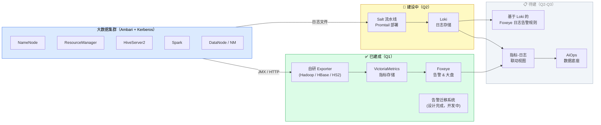
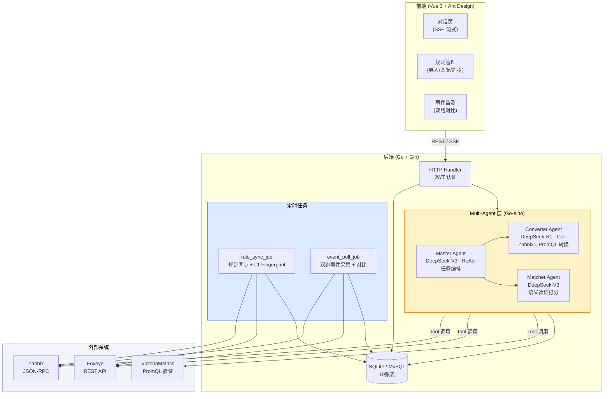
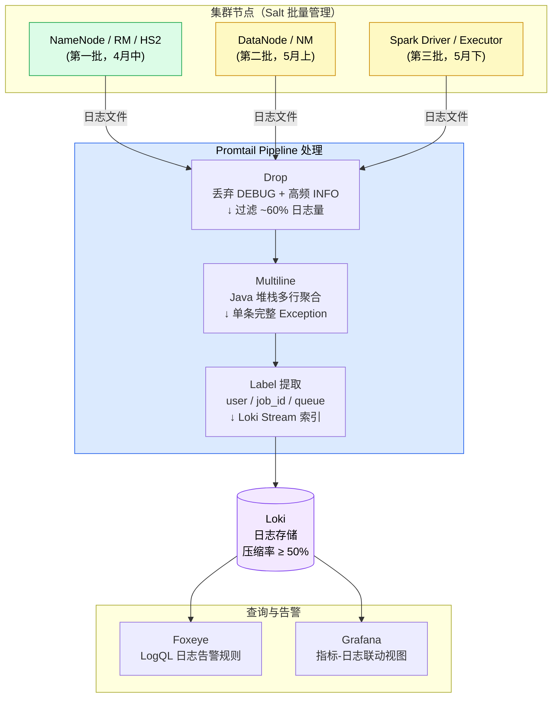
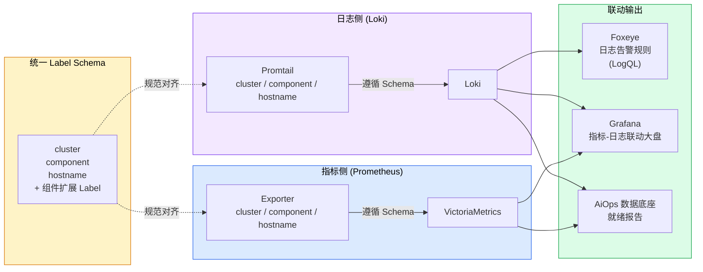
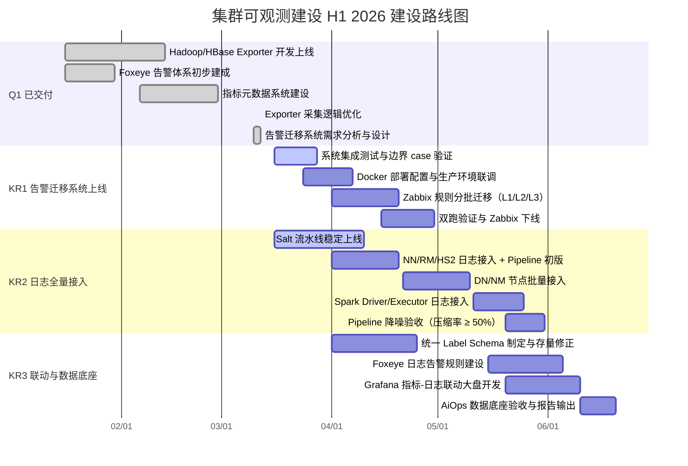

# 1 背景/现状

大数据集群可观测体系重构自 2026 年 1 月启动，目标是用 Prometheus + Exporter + Loki + Foxeye 的云原生可观测栈替代 Zabbix + 物理机本地日志的旧体系。当前（2026-03-16）处于 H1 建设中期，具体状态如下：

- **技术栈与架构**：集群由 Ambari 管理，Kerberos 认证；指标采集采用自研 Go Exporter + Prometheus 协议，统一写入 VictoriaMetrics；告警与大盘由 Foxeye（基于夜莺）承载；日志采集采用 Promtail 通过 Salt 流水线批量部署，写入 Loki
- **已完成能力（Q1 已交付）**：Hadoop/HBase Exporter 开发上线（1 月）；指标元数据系统建设（2 月）；Exporter 采集逻辑优化——per-host context 隔离，防止单节点假死阻塞全局采集（3 月）；Foxeye 告警初步建成（1 月）；告警智能迁移系统需求分析与完整设计文档输出（3 月）
- **建设中的能力**：告警智能迁移系统代码开发（后端 ~85%，前端 ~85%，进行中）；Salt 流水线 Promtail 部署模块测试（进行中）；集群节点初步接入 Loki 采集（启动中）
- **尚缺失的能力**：Zabbix 存量 500+ 条告警规则尚未迁移至 Foxeye，双平台并行运维；核心组件（NN/RM/HS2/Spark）日志尚未全量接入 Loki；指标与日志 Label 体系未对齐，无联动查询能力；基于 Loki 日志的告警规则未建立

---

# 2 问题分析

基于平台现状，H1 剩余阶段存在以下核心问题：

**1. 告警迁移系统待完成上线，Zabbix 双平台并行成本高**

- 告警智能迁移系统（Multi-Agent 架构）代码开发已完成 ~85%，尚待完成集成测试、边界 case 验证与生产环境部署上线
- 系统未上线期间，**Zabbix 500+ 条告警规则**仍需人工逐条转换，双平台并行运维，变更同步成本高，存在规则覆盖缺口和漏报风险
- Zabbix 基于 Host 模型，无法聚合 Queue/Tenant 维度，**JMX** 高负载下易超时，采集稳定性不足

**2. 日志采集流水线处于早期阶段，核心组件覆盖率为零**

- **Promtail** 通过 Salt 流水线的批量部署框架尚在测试中，集群节点接入刚刚启动，距离全量覆盖仍有较大距离
- **NameNode/ResourceManager/HiveServer2/Spark** 等高频故障相关组件日志完全依赖 SSH 登机查看，排障效率极低
- 采集端无 **Pipeline 降噪策略**：DEBUG/INFO 垃圾日志未过滤，Java Exception 堆栈未多行聚合，日志存储成本失控，高价值 ERROR 被淹没

**3. 指标与日志孤立，缺乏联动能力，无法支撑 AiOps 数据底座**

- 指标（Prometheus Label）与日志（Loki Label）的 Label 体系不统一，`cluster`/`component`/`hostname` 命名不一致，跨数据源关联查询无法实现
- 缺乏 **Metric-Log 联动视图**：无法从 Grafana 指标异常点一键跳转同期日志，故障排查链路割裂
- 基于 Loki 日志数据的 **Foxeye 告警规则**尚未建立，日志侧异常（如 HS2 频繁 OOM、NN Full GC）无法自动告警
- AiOps 根因分析所需的高质量、Label 规范的 Metrics + Logs 标准化数据源缺口是 **AiOps 启动的直接阻塞项**

---

# 3 方案/目标

**Objective**：通过完成告警智能迁移系统上线、核心组件日志全量接入与联动能力建设，将大数据集群可观测体系从「指标孤岛 + 日志黑洞」重构为指标-日志一体化、支撑 AiOps 智能运维的标准化数据底座。

**已交付里程碑（Q1）**：

- ✅ **Hadoop/HBase/HS2 Exporter 开发上线**（2026-01 ~ 02），覆盖核心组件指标采集
- ✅ **Exporter 采集逻辑优化**（2026-03-12），per-host context 隔离防止单节点假死阻塞
- ✅ **Foxeye 告警体系初步建成**（2026-01），Hadoop 核心组件告警规则上线
- ✅ **告警智能迁移系统需求分析与设计完成**（2026-03-12），完整设计文档（1060行）覆盖架构、DB ER、40+ API 端点、前端页面设计

**待完成 KR**：

- **KR1**：告警智能迁移系统完成上线，驱动 Zabbix → Foxeye 存量告警全量迁移。**预计 4 月 30 日**，系统完成集成测试并上线生产环境，500+ 条 Zabbix Trigger 通过系统辅助完成 PromQL 转换与双跑验证，Foxeye 告警覆盖率 100%，Zabbix 大数据集群监控正式下线
- **KR2**：完成大数据核心组件日志全量接入 Loki，Pipeline 降噪策略上线。**预计 5 月 31 日**，NN/DN/RM/NM/HS2/Spark Driver+Executor 日志 100% 接入，日志存储压缩率 ≥ 50%
- **KR3**：建立指标-日志统一 Label Schema，上线 Foxeye 日志告警规则与 Grafana 联动视图，交付 AiOps 数据底座。**预计 6 月 20 日**，核心组件 Label 覆盖率 100%，指标异常点可一键跳转对应日志，HS2/NN 关键日志告警规则上线，AiOps 数据地基就绪报告输出

---

## 3.1 告警智能迁移系统上线（KR1）

完成告警智能迁移系统（Multi-Agent 架构，Go + Vue 3）的集成测试与生产部署，驱动 Zabbix 存量 500+ 条告警规则通过系统辅助完成向 Foxeye 的 PromQL 迁移，最终 Zabbix 大数据集群监控下线。

**核心设计思路**：

- **系统架构**：后端采用 Go + Gin，Multi-Agent 层基于 Go-eino 框架；三个 Agent 分工协作——Master Agent（DeepSeek-V3，ReAct 任务编排）→ Converter Agent（DeepSeek-R1，CoT 语义转换）→ Matcher Agent（DeepSeek-V3，转换质量验证）；数据库 SQLite/MySQL（10张表，GORM），前端 Vue 3 + Ant Design + ECharts
- **三层规则匹配策略**：L1 Fingerprint（规则名称 + 阈值结构化匹配，自动执行）→ L2 LLM 语义（Matcher Agent 打分，Fingerprint 未命中时触发）→ L3 手动绑定（L1/L2 均未命中时，用户在规则管理页手动操作）
- **双跑验证机制**：`event_poll_job` 定时采集 Zabbix 与 Foxeye 双侧告警事件，自动关联比对，差异超阈值标记人工复核；双跑期间漏报率为零是验收的核心标准
- **待完成工作**：集成测试（边界 case 验证、规则转换准确率验证）、Docker Compose 部署配置、生产环境联调上线

---

## 3.2 核心组件日志全量接入与 Pipeline 降噪（KR2）

通过 Salt 流水线批量推进 Promtail 全量部署，完成 6 类核心组件日志接入 Loki；在采集端实施 Pipeline 治理（Drop + Multiline + Label），实现日志存储压缩率 ≥ 50%。

**核心设计思路**：

- **Salt 流水线批量部署**：以 Salt State 模块管理 Promtail 配置下发与版本管理，通过 Highstate 批量推送到目标节点；采集进程与 Hadoop 业务进程完全解耦，保障 NameNode/ResourceManager 等核心服务稳定性
- **分组优先级接入**：
  - **第一批（4 月中）**：NameNode、ResourceManager、HiveServer2——高频故障关联组件，优先接入以支撑 KR1 告警双跑验证
  - **第二批（5 月上）**：DataNode、NodeManager——节点量大，借助 Salt 流水线批量推送
  - **第三批（5 月下）**：Spark Driver/Executor——作业级日志，携带 `job_id`/`app_name` 标签，为 AiOps 作业异常检测准备数据
- **Pipeline 三层治理策略**：
  - **Drop**：丢弃 DEBUG 级别日志及高频鉴权类 INFO 日志（Kerberos token 刷新等），预计过滤 60%+ 日志量
  - **Multiline**：将 Java Exception 堆栈聚合为单条完整日志，还原错误上下文，便于 LogQL 查询和 AI 读取
  - **Label 提取**：从日志行提取 `user`、`job_id`、`queue` 等关键字段作为 Loki Stream Label，支撑后续精准查询

---

## 3.3 指标-日志联动与 AiOps 数据底座（KR3）

统一指标与日志的 Label Schema，建立 Foxeye 日志告警规则，配置 Grafana 指标-日志联动视图，完成 AiOps 数据底座的标准化交付。

**核心设计思路**：

- **统一 Label Schema**：制定 Label 规范并同步修正存量 Exporter 配置与 Promtail scrape_config，要求以下 Label 在 Prometheus 指标和 Loki 日志流中完全对齐：
  - 基础 Label（全组件必须）：`cluster`、`component`（如 `namenode`/`resourcemanager`）、`hostname`（FQDN）
  - 组件扩展 Label：RM/NM 携带 `queue`；HS2 携带 `session_id`；Spark 携带 `job_id`/`app_name`
  - 命名规范：全小写下划线，存量不合规 Label 随 KR2 接入阶段同步修正
- **Foxeye 日志告警规则**：基于 Loki 数据，优先为高频故障场景建立 LogQL 告警规则，首批覆盖：HS2 频繁 OOM（GC overhead 关键字频次异常）、NN Full GC（GC pause 超过阈值）、RM 应用提交拒绝（queue capacity exceeded）
- **Grafana 联动视图**：利用 Grafana Explore Split View，在指标告警大盘中通过变量将异常数据点的 `hostname`/`component`/时间范围自动传递至 Loki 查询，实现「点击指标异常点即展示同期日志」的一键跳转体验
- **AiOps 数据底座交付**：输出《H1 数据底座就绪报告》，验收指标：Exporter 核心指标缺失率 < 1%、日志接入率 100%、Label 规范符合度 100%，作为 AiOps KR1 数据地基的正式交付物

---

# 4 关键事项拆解

| KR | 任务 | 时间 | 说明 |
|---|---|---|---|
| Q1 | ✅ Hadoop/HBase/HS2 Exporter 开发上线 | 1月16日 - 2月13日 | 核心组件 JMX 指标 Exporter 上线，替代 Zabbix JMX 采集 |
| | ✅ Foxeye 告警体系初步建成 | 1月16日 - 1月30日 | Hadoop 核心组件 PromQL 告警规则上线 Foxeye |
| | ✅ 指标元数据系统建设 | 2月6日 - 2月28日 | 指标命名规范与元数据管理体系建立 |
| | ✅ Exporter 采集逻辑优化 | 3月12日 | per-host context 隔离上线，防止假死节点阻塞全局采集 |
| | ✅ 告警迁移系统需求分析与设计 | 3月10日 - 3月12日 | 1060 行完整设计文档，覆盖架构/DB ER/40+ API/前端 |
| KR1 | 告警迁移系统集成测试与边界 case 验证 | 3月16日 - 3月28日 | 规则转换准确率验证报告，双跑对比逻辑验证通过 |
| | Docker 部署配置与生产环境联调 | 3月24日 - 4月7日 | Docker Compose 部署包，生产环境访问验证通过 |
| | Zabbix 规则分批迁移（L1/L2/L3 三层策略） | 4月1日 - 4月20日 | 500+ 条 Zabbix Trigger 完成 PromQL 转换，双跑告警事件对齐 |
| | Zabbix 双跑验收与监控下线 | 4月15日 - 4月30日 | 双跑漏报率为零验收通过，Zabbix 大数据集群监控正式下线 |
| KR2 | Salt 流水线 Promtail 模块完善上线 | 3月16日 - 4月10日 | Salt State 模块稳定，支持批量配置下发与版本管理 |
| | NN/RM/HS2 日志接入 + Pipeline 初版上线 | 4月1日 - 4月20日 | 3 个核心管理节点日志接入 Loki，Drop/Multiline 策略生效 |
| | DN/NM 节点批量日志接入 | 4月21日 - 5月10日 | 全量 DataNode/NodeManager 日志接入，携带规范 Label |
| | Spark Driver/Executor 日志接入 | 5月11日 - 5月25日 | Spark 作业日志接入，携带 `job_id`/`app_name` 标签 |
| | Pipeline 降噪策略完善与存储压缩验收 | 5月20日 - 5月31日 | 三层 Pipeline 全量生效，存储压缩率 ≥ 50% 验收通过 |
| KR3 | 统一 Label Schema 规范制定与存量修正 | 4月1日 - 4月25日 | Label 规范文档，Exporter 与 Promtail 配置不合规项全部修正 |
| | Foxeye 日志告警规则建设（HS2/NN 关键场景） | 5月15日 - 6月5日 | HS2 OOM、NN Full GC、RM 队列拒绝等 LogQL 告警规则上线 |
| | Grafana 指标-日志联动大盘开发 | 5月20日 - 6月10日 | NN/RM/HS2 联动大盘上线，指标异常点一键跳转同期日志 |
| | AiOps 数据底座验收与就绪报告输出 | 6月10日 - 6月20日 | 指标缺失率 < 1%、日志接入率 100%、Label 覆盖率 100% 三项达标，输出就绪报告 |
